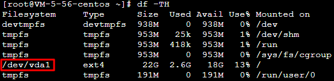
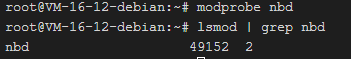

# 制作 Linux 镜像

[云服务器 制作 Linux 镜像-操作指南-文档中心-腾讯云](https://cloud.tencent.com/document/product/213/17814)

## <font style="color:rgb(0, 0, 0);">本页目录：</font>
+ [操作场景](https://cloud.tencent.com/document/product/213/17814#.E6.93.8D.E4.BD.9C.E5.9C.BA.E6.99.AF)
+ [操作步骤](https://cloud.tencent.com/document/product/213/17814#.E6.93.8D.E4.BD.9C.E6.AD.A5.E9.AA.A4)
    - [准备工作](https://cloud.tencent.com/document/product/213/17814#.E5.87.86.E5.A4.87.E5.B7.A5.E4.BD.9C)
    - [查找分区和大小](https://cloud.tencent.com/document/product/213/17814#.E6.9F.A5.E6.89.BE.E5.88.86.E5.8C.BA.E5.92.8C.E5.A4.A7.E5.B0.8F)
    - [导出镜像](https://cloud.tencent.com/document/product/213/17814#.E5.AF.BC.E5.87.BA.E9.95.9C.E5.83.8F)
    - [转换镜像格式（可选）](https://cloud.tencent.com/document/product/213/17814#.E8.BD.AC.E6.8D.A2.E9.95.9C.E5.83.8F.E6.A0.BC.E5.BC.8F.EF.BC.88.E5.8F.AF.E9.80.89.EF.BC.89.5B.5D(id.3Aimageformatconversion))
    - [检查镜像](https://cloud.tencent.com/document/product/213/17814#.E6.A3.80.E6.9F.A5.E9.95.9C.E5.83.8F.5B.5D(id.3Acheckmirror))

## <font style="color:rgb(0, 0, 0);">操作场景</font>
<font style="color:rgb(46, 48, 51);">本文档指导您制作本地或其他平台的 Linux 服务器系统盘镜像。</font>

## <font style="color:rgb(0, 0, 0);">操作步骤</font>
### <font style="color:rgb(0, 0, 0);">准备工作</font>
<font style="color:rgb(46, 48, 51);">制作系统盘镜像导出时，需要进行以下检查：</font>

**<font style="background-color:rgb(246, 252, 255);">说明</font>**

<font style="color:rgb(46, 48, 51);background-color:rgb(246, 252, 255);">如果您是通过数据盘镜像导出，则可以跳过此操作。</font>

#### <font style="color:rgb(0, 0, 0);">检查 OS 分区和启动方式</font>
<font style="color:rgb(46, 48, 51);">1. </font><font style="color:rgb(46, 48, 51);">执行以下命令，检查 OS 分区是否为 GPT 分区。</font>


<font style="color:rgb(46, 48, 51);">若返回结果为 msdos，即表示为 MBR 分区，请执行下一步。</font>

<font style="color:rgb(46, 48, 51);">若返回结果为 gpt，即表示为 GPT 分区。</font>

<font style="color:rgb(46, 48, 51);">2. </font><font style="color:rgb(46, 48, 51);">执行以下命令，检查操作系统是否以 EFI 方式启动。</font>


<font style="color:rgb(46, 48, 51);">若存在文件，则表示当前操作系统以 EFI 方式启动，请通过 </font>[在线支持](https://cloud.tencent.com/online-service?from=doc_213)<font style="color:rgb(46, 48, 51);"> 反馈。</font>

<font style="color:rgb(46, 48, 51);">若不存在文件，请执行下一步。</font>

#### <font style="color:rgb(0, 0, 0);">检查系统关键文件</font>
<font style="color:rgb(46, 48, 51);">需检查的系统关键文件包括且不限于以下文件：</font>

**<font style="background-color:rgb(246, 252, 255);">说明</font>**

<font style="color:rgb(46, 48, 51);background-color:rgb(246, 252, 255);">请遵循相关发行版的标准，确保系统关键文件位置和权限正确无误，可以正常读写。</font>

<font style="color:rgb(46, 48, 51);background-color:rgb(243, 245, 249);">/etc/grub2.cfg</font><font style="color:rgb(46, 48, 51);">： kernel 参数里推荐使用 uuid 挂载 root，其它方式（如 root=</font><font style="color:rgb(46, 48, 51);background-color:rgb(243, 245, 249);">/dev/sda</font><font style="color:rgb(46, 48, 51);">）可能导致系统无法启动。挂载步骤如下：</font>

<font style="color:rgb(46, 48, 51);">1.1 </font><font style="color:rgb(46, 48, 51);">执行以下命令，获取 </font><font style="color:rgb(46, 48, 51);background-color:rgb(243, 245, 249);">/root</font><font style="color:rgb(46, 48, 51);"> 的文件系统名称。</font>


<font style="color:rgb(46, 48, 51);">返回结果如下图所示，表示 </font><font style="color:rgb(46, 48, 51);background-color:rgb(243, 245, 249);">/root</font><font style="color:rgb(46, 48, 51);"> 文件系统名称为 </font><font style="color:rgb(46, 48, 51);background-color:rgb(243, 245, 249);">/dev/vda1 </font><font style="color:rgb(46, 48, 51);">。 </font>



<font style="color:rgb(46, 48, 51);">1.2 </font><font style="color:rgb(46, 48, 51);">执行以下命令，获取 UUID。</font>


**<font style="background-color:rgb(246, 252, 255);">说明</font>**

<font style="color:rgb(46, 48, 51);background-color:rgb(246, 252, 255);">文件系统 UUID 不固定，请您定期确认及更新。例如，重新格式化文件系统后，文件系统的 UUID 将会发生变化。</font>

<font style="color:rgb(46, 48, 51);">1.3 </font><font style="color:rgb(46, 48, 51);">执行以下命令，使用 VI 编辑器打开 </font><font style="color:rgb(46, 48, 51);background-color:rgb(243, 245, 249);">/etc/fstab</font><font style="color:rgb(46, 48, 51);"> 文件。</font>


<font style="color:rgb(46, 48, 51);">1.4 </font><font style="color:rgb(46, 48, 51);">按 </font>**<font style="color:rgb(46, 48, 51);">i</font>**<font style="color:rgb(46, 48, 51);"> 进入编辑模式。</font>

<font style="color:rgb(46, 48, 51);">1.5 </font><font style="color:rgb(46, 48, 51);">将光标移至文件末尾，按 </font>**<font style="color:rgb(46, 48, 51);">Enter</font>**<font style="color:rgb(46, 48, 51);">，添加如下内容。结合前文示例则添加：</font>


<font style="color:rgb(46, 48, 51);">1.6 </font><font style="color:rgb(46, 48, 51);">按 </font>**<font style="color:rgb(46, 48, 51);">Esc</font>**<font style="color:rgb(46, 48, 51);">，输入 </font>**<font style="color:rgb(46, 48, 51);">:wq</font>**<font style="color:rgb(46, 48, 51);">，按 </font>**<font style="color:rgb(46, 48, 51);">Enter</font>**<font style="color:rgb(46, 48, 51);">。保存设置并退出编辑器。</font>

<font style="color:rgb(46, 48, 51);background-color:rgb(243, 245, 249);">/etc/fstab</font><font style="color:rgb(46, 48, 51);">：请勿挂载其它硬盘，迁移后可能会由于磁盘缺失导致系统无法启动。</font>

<font style="color:rgb(46, 48, 51);background-color:rgb(243, 245, 249);">/etc/shadow</font><font style="color:rgb(46, 48, 51);">：权限正常，可以读写。</font>

#### <font style="color:rgb(0, 0, 0);">卸载软件</font>
<font style="color:rgb(46, 48, 51);">卸载会产生冲突的驱动和软件（包括 VMware tools、Xen tools、Virtualbox GuestAdditions 以及一些自带底层驱动的软件）。</font>

#### <font style="color:rgb(0, 0, 0);">检查 virtio 驱动</font>
<font style="color:rgb(46, 48, 51);">操作详情请参考 </font>[Linux 系统检查 Virtio 驱动](https://cloud.tencent.com/document/product/213/9929)<font style="color:rgb(46, 48, 51);">。</font>

#### <font style="color:rgb(0, 0, 0);">安装 cloud-init</font>
<font style="color:rgb(46, 48, 51);">安装详情请参考 </font>[Linux 系统安装 cloud-init](https://cloud.tencent.com/document/product/213/12587)<font style="color:rgb(46, 48, 51);">。</font>

#### <font style="color:rgb(0, 0, 0);">检查其它硬件相关的配置</font>
<font style="color:rgb(46, 48, 51);">上云之后的硬件变化包括但可能不限于：</font>

<font style="color:rgb(46, 48, 51);">显卡更换为 Cirrus VGA。</font>

<font style="color:rgb(46, 48, 51);">磁盘更换为 Virtio Disk，设备名为 vda、vdb。</font>

<font style="color:rgb(46, 48, 51);">网卡更换为 Virtio Nic，默认只提供 eth0。</font>

### <font style="color:rgb(0, 0, 0);">查找分区和大小</font>
<font style="color:rgb(46, 48, 51);">执行以下命令，查看当前操作系统的分区格式，判断需要复制的分区以及大小。</font>


<font style="color:rgb(46, 48, 51);">以如下返回结果为例：</font>


<font style="color:rgb(46, 48, 51);">可得知，根分区在 </font><font style="color:rgb(46, 48, 51);background-color:rgb(243, 245, 249);">/dev/sda1</font><font style="color:rgb(46, 48, 51);"> 中，</font><font style="color:rgb(46, 48, 51);background-color:rgb(243, 245, 249);">/boot</font><font style="color:rgb(46, 48, 51);"> 和 </font><font style="color:rgb(46, 48, 51);background-color:rgb(243, 245, 249);">/home</font><font style="color:rgb(46, 48, 51);"> 没有独立分区，sda1 包含 boot 分区、缺少 mbr，我们只需复制整个 sda。</font>

**<font style="color:rgb(4, 200, 220);background-color:rgb(241, 254, 255);">注意</font>**

<font style="color:rgb(46, 48, 51);background-color:rgb(241, 254, 255);">导出的镜像中至少需要包含根分区以及 mbr。如果导出的镜像缺少 mbr，将无法启动。</font>

<font style="color:rgb(46, 48, 51);background-color:rgb(241, 254, 255);">在当前操作系统中，如果</font><font style="color:rgb(46, 48, 51);background-color:rgb(243, 245, 249);">/boot</font><font style="color:rgb(46, 48, 51);background-color:rgb(241, 254, 255);">和</font><font style="color:rgb(46, 48, 51);background-color:rgb(243, 245, 249);">/home</font><font style="color:rgb(46, 48, 51);background-color:rgb(241, 254, 255);">为独立分区，导出的镜像还需要包含这两个独立分区。</font>

### <font style="color:rgb(0, 0, 0);">导出镜像</font>
<font style="color:rgb(46, 48, 51);">根据实际需求，选择不同的方式导出镜像。</font>

**<font style="color:rgb(51, 119, 255);background-color:rgb(241, 243, 245);">使用平台工具导出镜像</font>**

<font style="color:rgb(46, 48, 51);background-color:rgb(241, 243, 245);">使用命令导出镜像</font>

<font style="color:rgb(46, 48, 51);"> 或 Citrix XenConvert 等虚拟化平台的导出镜像工具。详情请参见各平台的导出工具文档。</font>

<font style="color:rgb(46, 48, 51);">使用 VMWare vCenter Converter</font>

**<font style="background-color:rgb(246, 252, 255);">说明</font>**

<font style="color:rgb(46, 48, 51);background-color:rgb(246, 252, 255);">目前腾讯云服务器迁移支持的镜像格式有：qcow2，vhd，raw，vmdk。</font>

### <font style="color:rgb(0, 0, 0);">转换镜像格式（可选）</font>
<font style="color:rgb(46, 48, 51);">参考 </font>[转换镜像镜像](https://cloud.tencent.com/document/product/213/62569#linux)<font style="color:rgb(46, 48, 51);">，使用 </font><font style="color:rgb(46, 48, 51);background-color:rgb(243, 245, 249);">qemu-img</font><font style="color:rgb(46, 48, 51);"> 将镜像文件转换为支持的格式。</font>

### <font style="color:rgb(0, 0, 0);">检查镜像</font>
**<font style="background-color:rgb(246, 252, 255);">说明</font>**

<font style="color:rgb(46, 48, 51);background-color:rgb(246, 252, 255);">当您未停止服务直接制作镜像或者其它原因，可能导致制作出的镜像文件系统有误，因此建议您在制作镜像后检查是否无误。</font>

<font style="color:rgb(46, 48, 51);">当镜像格式和当前平台支持的格式一致时，您可以直接打开镜像检查文件系统。例如，Windows 平台可以直接附加 vhd 格式镜像，Linux 平台可以使用 qemu-nbd 打开 qcow2 格式镜像，Xen 平台可以直接启用 vhd 文件。本文以 Linux 平台为例，检查步骤如下：</font>

<font style="color:rgb(46, 48, 51);">1. </font><font style="color:rgb(46, 48, 51);">依次执行以下命令，检查是否已有 nbd 模块。</font>


<font style="color:rgb(46, 48, 51);">返回结果如下，则说明已有 nbd 模块。如返回结果为空，则请检查内核编译选项 </font><font style="color:rgb(46, 48, 51);background-color:rgb(243, 245, 249);">CONFIG_BLK_DEV_NBD</font><font style="color:rgb(46, 48, 51);"> 是否打开。如未开启，则需更换系统或打开 </font><font style="color:rgb(46, 48, 51);background-color:rgb(243, 245, 249);">CONFIG_BLK_DEV_NBD</font><font style="color:rgb(46, 48, 51);"> 编译选项后重编内核。 </font>


<font style="color:rgb(46, 48, 51);">2. </font><font style="color:rgb(46, 48, 51);">依次执行以下命令，检查镜像。</font>


<font style="color:rgb(46, 48, 51);">执行 </font><font style="color:rgb(46, 48, 51);background-color:rgb(243, 245, 249);">qemu-nbd</font><font style="color:rgb(46, 48, 51);"> 命令后，</font><font style="color:rgb(46, 48, 51);background-color:rgb(243, 245, 249);">/dev/nbd0</font><font style="color:rgb(46, 48, 51);"> 就映射了 </font><font style="color:rgb(46, 48, 51);background-color:rgb(243, 245, 249);">xxx.qcow2</font><font style="color:rgb(46, 48, 51);"> 中的内容。而 </font><font style="color:rgb(46, 48, 51);background-color:rgb(243, 245, 249);">/dev/nbd0p1</font><font style="color:rgb(46, 48, 51);"> 代表该虚拟磁盘的第一个分区，若 nbd0p1 不存在或 mount 不成功，则很可能是镜像错误。 此外，您还可以在上传镜像前，先启动云服务器测试镜像文件是否可以使用。</font>

```plain
sudo parted -l /dev/sda | grep 'Partition Table'
```

若返回结果为 msdos，即表示为 MBR 分区，请执行下一步。  
若返回结果为 gpt，即表示为 GPT 分区。  
2. 执行以下命令，检查操作系统是否以 EFI 方式启动。

```plain
sudo ls /sys/firmware/efi
```

若存在文件，则表示当前操作系统以 EFI 方式启动，请通过 [在线支持](https://cloud.tencent.com/online-service?from=doc_213) 反馈。

若不存在文件，请执行下一步。

#### 检查系统关键文件
需检查的系统关键文件包括且不限于以下文件：

**说明**

请遵循相关发行版的标准，确保系统关键文件位置和权限正确无误，可以正常读写。

/etc/grub2.cfg： kernel 参数里推荐使用 uuid 挂载 root，其它方式（如 root=/dev/sda）可能导致系统无法启动。挂载步骤如下：

1.1 执行以下命令，获取 /root 的文件系统名称。

```plain
df -TH
```

返回结果如下图所示，表示 /root 文件系统名称为 /dev/vda1 。


```plain
sudo blkid /dev/vda1
```

**说明**

文件系统 UUID 不固定，请您定期确认及更新。例如，重新格式化文件系统后，文件系统的 UUID 将会发生变化。

1.3 执行以下命令，使用 VI 编辑器打开 /etc/fstab 文件。

```plain
vi /etc/fstab
```

按 **i** 进入编辑模式。

1.5 将光标移至文件末尾，按 **Enter**，添加如下内容。结合前文示例则添加：

```plain
UUID=d489ca1c-xxxx-4536-81cb-ceb2847f9954 / ext4 defaults     0   0
```

按 **Esc**，输入 **:wq**，按 **Enter**。保存设置并退出编辑器。

/etc/fstab：请勿挂载其它硬盘，迁移后可能会由于磁盘缺失导致系统无法启动。

/etc/shadow：权限正常，可以读写。

#### 卸载软件
卸载会产生冲突的驱动和软件（包括 VMware tools、Xen tools、Virtualbox GuestAdditions 以及一些自带底层驱动的软件）。

#### 检查 virtio 驱动
操作详情请参考 [Linux 系统检查 Virtio 驱动](https://cloud.tencent.com/document/product/213/9929)。

#### 安装 cloud-init
安装详情请参考 [Linux 系统安装 cloud-init](https://cloud.tencent.com/document/product/213/12587)。

#### 检查其它硬件相关的配置
上云之后的硬件变化包括但可能不限于：

显卡更换为 Cirrus VGA。

磁盘更换为 Virtio Disk，设备名为 vda、vdb。

网卡更换为 Virtio Nic，默认只提供 eth0。

### 查找分区和大小
执行以下命令，查看当前操作系统的分区格式，判断需要复制的分区以及大小。

```plain
mount
```

以如下返回结果为例：

```plain
proc on /proc type proc (rw,nosuid,nodev,noexec,relatime)
sys on /sys type sysfs (rw,nosuid,nodev,noexec,relatime)
dev on /dev type devtmpfs (rw,nosuid,relatime,size=4080220k,nr_inodes=1020055,mode=755)
run on /run type tmpfs (rw,nosuid,nodev,relatime,mode=755)
/dev/sda1 on / type ext4 (rw,relatime,data=ordered)
securityfs on /sys/kernel/security type securityfs (rw,nosuid,nodev,noexec,relatime)
tmpfs on /dev/shm type tmpfs (rw,nosuid,nodev)
devpts on /dev/pts type devpts (rw,nosuid,noexec,relatime,gid=5,mode=620,ptmxmode=000)
tmpfs on /sys/fs/cgroup type tmpfs (ro,nosuid,nodev,noexec,mode=755)
cgroup on /sys/fs/cgroup/unified type cgroup2 (rw,nosuid,nodev,noexec,relatime,nsdelegate)
cgroup on /sys/fs/cgroup/systemd type cgroup (rw,nosuid,nodev,noexec,relatime,xattr,name=systemd)
pstore on /sys/fs/pstore type pstore (rw,nosuid,nodev,noexec,relatime)
cgroup on /sys/fs/cgroup/cpu,cpuacct type cgroup (rw,nosuid,nodev,noexec,relatime,cpu,cpuacct)
cgroup on /sys/fs/cgroup/cpuset type cgroup (rw,nosuid,nodev,noexec,relatime,cpuset)
cgroup on /sys/fs/cgroup/rdma type cgroup (rw,nosuid,nodev,noexec,relatime,rdma)
cgroup on /sys/fs/cgroup/blkio type cgroup (rw,nosuid,nodev,noexec,relatime,blkio)
cgroup on /sys/fs/cgroup/hugetlb type cgroup (rw,nosuid,nodev,noexec,relatime,hugetlb)
cgroup on /sys/fs/cgroup/memory type cgroup (rw,nosuid,nodev,noexec,relatime,memory)
cgroup on /sys/fs/cgroup/devices type cgroup (rw,nosuid,nodev,noexec,relatime,devices)
cgroup on /sys/fs/cgroup/pids type cgroup (rw,nosuid,nodev,noexec,relatime,pids)
cgroup on /sys/fs/cgroup/freezer type cgroup (rw,nosuid,nodev,noexec,relatime,freezer)
cgroup on /sys/fs/cgroup/net_cls,net_prio type cgroup (rw,nosuid,nodev,noexec,relatime,net_cls,net_prio)
cgroup on /sys/fs/cgroup/perf_event type cgroup (rw,nosuid,nodev,noexec,relatime,perf_event)
systemd-1 on /home/libin/work_doc type autofs (rw,relatime,fd=33,pgrp=1,timeout=0,minproto=5,maxproto=5,direct,pipe_ino=12692)
systemd-1 on /proc/sys/fs/binfmt_misc type autofs (rw,relatime,fd=39,pgrp=1,timeout=0,minproto=5,maxproto=5,direct,pipe_ino=12709)
debugfs on /sys/kernel/debug type debugfs (rw,relatime)
mqueue on /dev/mqueue type mqueue (rw,relatime)
hugetlbfs on /dev/hugepages type hugetlbfs (rw,relatime,pagesize=2M)
tmpfs on /tmp type tmpfs (rw,nosuid,nodev)
configfs on /sys/kernel/config type configfs (rw,relatime)
tmpfs on /run/user/1000 type tmpfs (rw,nosuid,nodev,relatime,size=817176k,mode=700,uid=1000,gid=100)
gvfsd-fuse on /run/user/1000/gvfs type fuse.gvfsd-fuse (rw,nosuid,nodev,relatime,user_id=1000,group_id=100)
```

### 可得知，根分区在 /dev/sda1 中，/boot 和 /home 没有独立分区，sda1 包含 boot 分区、缺少 mbr，我们只需复制整个 sda。
**<font style="color:#04c8dc;">注意</font>**

导出的镜像中至少需要包含根分区以及 mbr。如果导出的镜像缺少 mbr，将无法启动。

在当前操作系统中，如果/boot和/home为独立分区，导出的镜像还需要包含这两个独立分区。

### 转换镜像格式（可选）、
**<font style="color:#04c8dc;">注意</font>**

（如在 IO 繁忙时可能造成文件系统的 metadata 错乱等）。建议您在导出镜像后，[检查镜像](#CheckMirror) 完整无误。

由于使用命令手工导出镜像的风险比较大

您可选择 [使用 qemu-img 命令](#qemuimg) 或 [使用 dd 命令](#dd) 其中一种方式导出镜像：

**使用 ****qemu-img**** 命令**

执行以下命令，安装所需包。本文以 Debian 为例，不同发行版的包可能不同，请对应实际情况进行调整。例如，CentOS 中包名为 qemu-img。


```plain
apt-get install qemu-utils
```


执行以下命令，将 /dev/sda 导出至 /mnt/sdb/test.qcow2。


```plain
sudo qemu-img convert -f raw -O qcow2 /dev/sda /mnt/sdb/test.qcow2
```


 其中，/mnt/sdb为挂载的新磁盘或者其他网络存储。 如果您需要转换成其他格式，请修改 -O 的参数值。可修改的参数值如下：

| 参数值 | 含义 |
| --- | --- |
| qcow2 | qcow2 格式 |
| vhd | vhd 格式 |
| vmdk | vmdk 格式 |
| raw | 无格式 |


**使用 ****dd**** 命令** 例如，执行以下命令，导出 raw 格式的镜像。


```plain
sudo dd if=/dev/sda of=/mnt/sdb/test.imag bs=1K count=$count
```


其中，count 参数即为需要复制分区的数量，您可以通过 fdisk 命令查出该数量值。如果您需要全盘复制，count 参数则可以忽略。

例如，执行以下命令，查看 /dev/sda 的分区数量。


```plain
fdisk -lu /dev/sda
```


返回类似如下结果：


```plain
Disk /dev/sda: 1495.0 GB, 1494996746240 bytes
255 heads, 63 sectors/track, 181756 cylinders, total 2919915520 sectors
Units = sectors of 1 * 512 = 512 bytes
Sector size (logical/physical): 512 bytes / 4096 bytes
I/O size (minimum/optimal): 4096 bytes / 4096 bytes
Disk identifier: 0x0008f290   
 
Device     Boot      Start      End      Blocks     Id  System
/dev/sda1   *        2048    41945087    20971520   83  Linux
/dev/sda2        41945088    46123007     2088960   82  Linux swap / Solaris
/dev/sda3        46123008    88066047    20971520   83  Linux/dev
/sda4        88066048  2919910139  1415922046   8e  Linux LVM
```


由 fdisk 命令的返回结果可得知，sda1 结束位置在41945087 * 512字节处，count 设置为20481M即可。

**说明**

通过 dd 命令导出的镜像为 raw 格式，建议 [转换为 qcow2，vhd 或者其他镜像格式](#ImageFormatConversion)。

参考 [转换镜像镜像](https://cloud.tencent.com/document/product/213/62569#linux)，使用 qemu-img 将镜像文件转换为支持的格式

检查镜像

当镜像格式和当前平台支持的格式一致时，您可以直接打开镜像检查文件系统。例如，Windows 平台可以直接附加 vhd 格式镜像，Linux 平台可以使用 qemu-nbd 打开 qcow2 格式镜像，Xen 平台可以直接启用 vhd 文件。本文以 Linux 平台为例，检查步骤如下：

依次执行以下命令，检查是否已有 nbd 模块

```plain
modprobe nbd
```


```plain
lsmod | grep nbd
```

返回结果如下，则说明已有 nbd 模块。如返回结果为空，则请检查内核编译选项 CONFIG_BLK_DEV_NBD 是否打开。如未开启，则需更换系统或打开 CONFIG_BLK_DEV_NBD 编译选项后重编内核。



依次执行以下命令，检查镜像。

```plain
qemu-nbd -c /dev/nbd0 xxxx.qcow2
```


```plain
mount /dev/nbd0p1 /mnt
```

执行 qemu-nbd 命令后，/dev/nbd0 就映射了 xxx.qcow2 中的内容。而 /dev/nbd0p1 代表该虚拟磁盘的第一个分区，若 nbd0p1 不存在或 mount 不成功，则很可能是镜像错误。 此外，您还可以在上传镜像前，先启动云服务器测试镜像文件是否可以使用。


> 更新: 2023-06-24 18:40:23  
> 原文: <https://www.yuque.com/lixinsi/hntyk2/gcmcyupqxei9sad5>