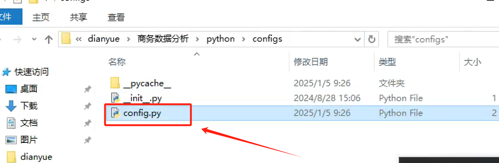
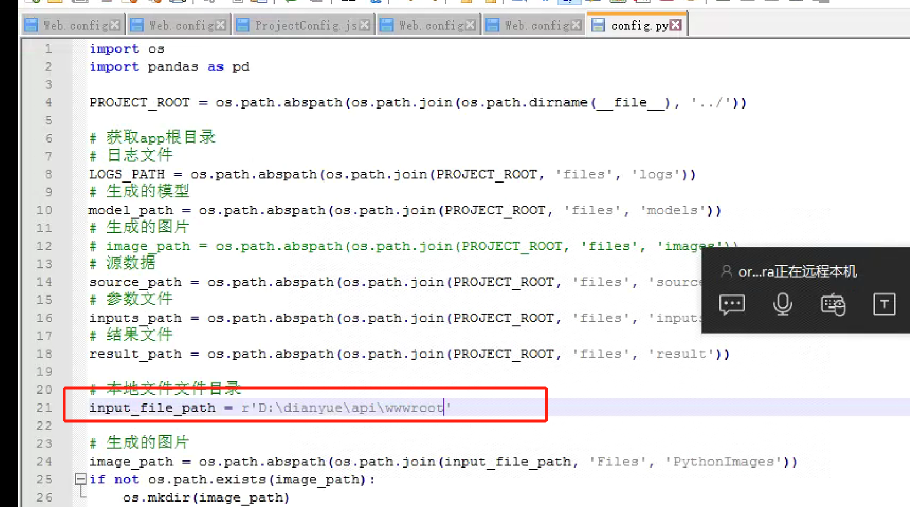
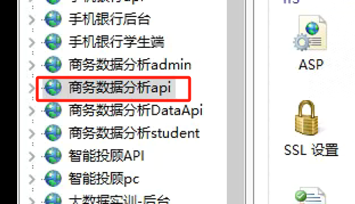
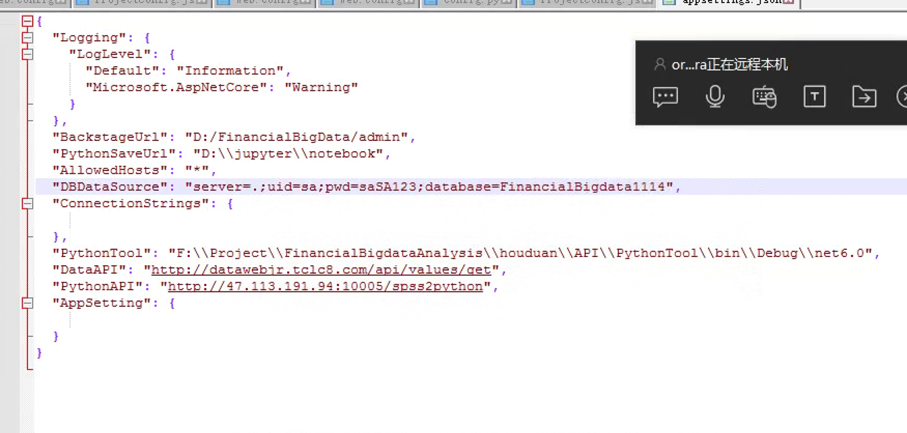
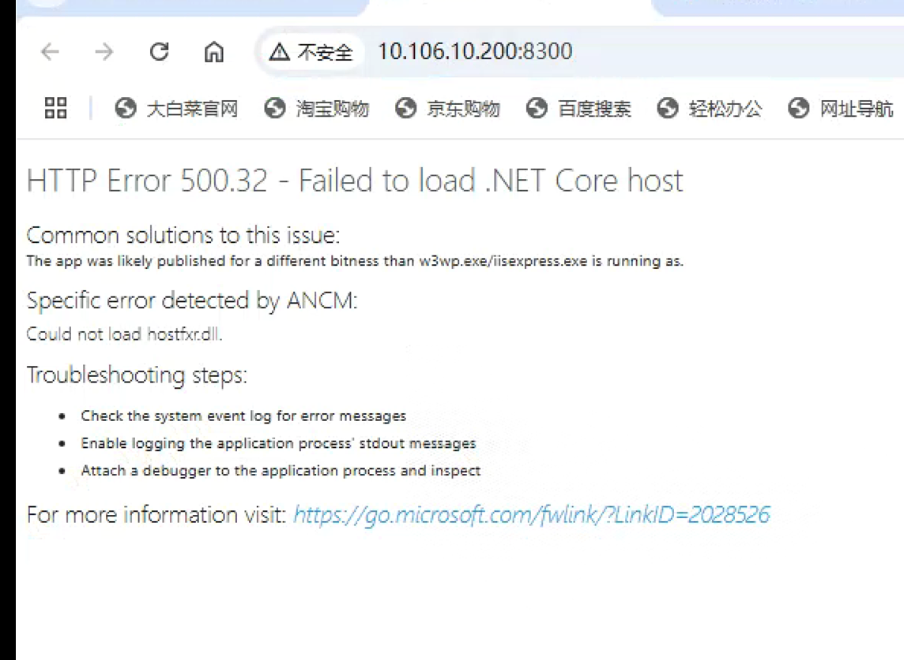
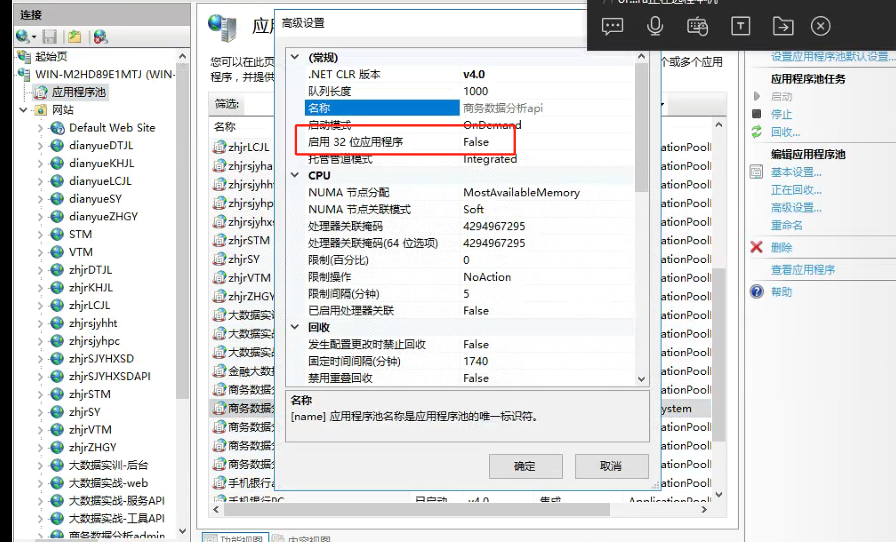
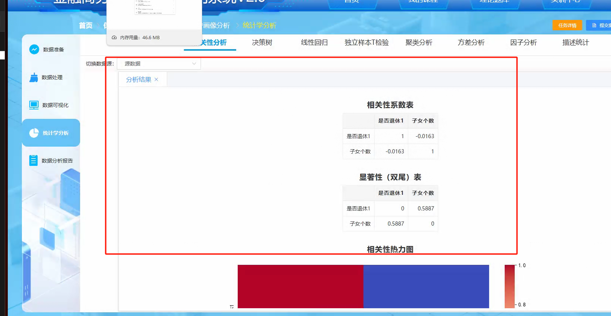
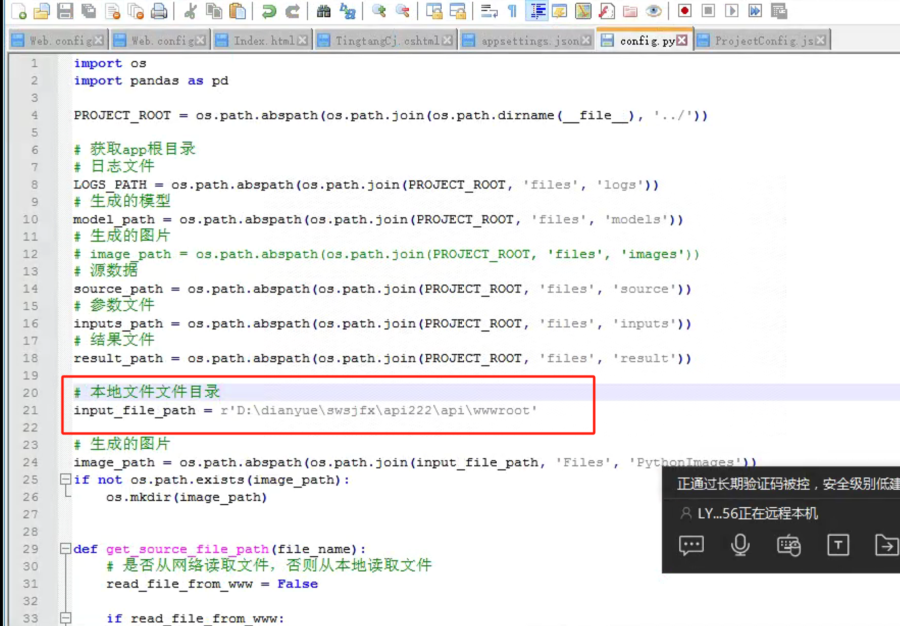
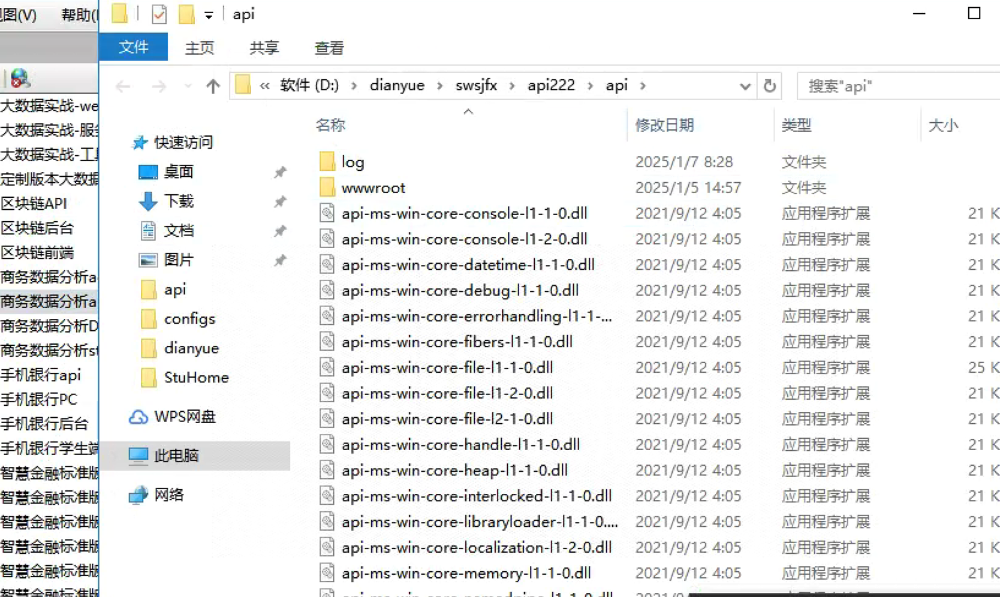

# 商务数据分析python配置

### 1.config.py 配置

```plsql
D:\dianyue\商务数据分析\python\configs\config.py
```





此处配置成 wwwroot 目录

运行切换到虚拟环境运行

```plsql
python -m flask run -h 0.0.0.0 -p 10005 --with-threads
```



### 无法安装环境

### 1.更换镜像源来安装

```plsql
python -m pip install --upgrade pip
pip install -i https://mirrors.aliyun.com/pypi/simple/ -r requirement.txt
pip install -i https://pypi.douban.com/simple/ -r requirement.txt
```

### 2.增加超时时间安装

```plsql
pip install --default-timeout=1000 -r requirement.txt
```

### 3.离线安装

<font style="color:#000000;background-color:#FFFFFF;">如果你有另一台可以正常访问网络的机器，你可以在这台机器上使用 </font><code><font style="color:#000000;background-color:#FFFFFF;">pip download</font></code><font style="color:#000000;background-color:#FFFFFF;"> 命令下载所有依赖包，然后将这些包复制到目标机器上进行离线安装</font>

```plsql
pip download -r requirement.txt

pip install --no-index --find-links=path_to_downloaded_packages -r requirement.txt
```

### 商数 api 报错



修改应用池



### 分析结果没有出来问题



### 检查 python 服务里面的 config.py 取数据






> 更新: 2025-01-07 08:41:07  
> 原文: <https://www.yuque.com/lixinsi/hntyk2/yuxnw9rg7xaso7kn>