# 商务数据分析安装

```powershell
# -*- coding:utf-8 -*-
import requests
from bs4 import BeautifulSoup
import pandas as pd
import json

url = 'http://2025cxdsswsjfxdataapi.occupationedu.com/api/values/get?id=7'
headers = {
    "User-Agent": "Mozilla/5.0 (Windows NT 10.0; Win64; x64) AppleWebKit/537.36 (KHTML, like Gecko) Chrome/100.0.4896.75 Safari/537.36"
}
response = requests.get(url, headers=headers)
json_data = response.json()
# print(json_data)
soup = BeautifulSoup(json_data, 'html.parser')

string_content = soup.get_text()

data = json.loads(string_content)

df = pd.DataFrame(data)
print(df)
print(df.info())
# 保存文件（文件名称暂定为test0.xlsx）
df.to_excel('test0.xlsx',index= False)
```

清库脚本

```plsql
--清理数据脚本
  truncate table [dbo].[tb_MicrospotLog]
  truncate table [dbo].[tb_TrainingResult]
  truncate table [dbo].[tb_TrainingCaseResult]
  truncate table [dbo].[tb_VisualizationDashboard]
  truncate table [dbo].[tb_VisualizationData]
  truncate table [dbo].[tb_SpssHtml]
  truncate table [dbo].[tb_ColumnHandleResult]
  truncate table [dbo].[tb_ClassifySummaryResult]


-- 清理课程得分
  truncate table [dbo].[tb_CourseTranscript]
   truncate table  [dbo].[tb_CourseTranscript_Detail]
   truncate table [dbo].[tb_CourseTranscript_Total]

-- 清理理论题成绩

truncate table [dbo].[tb_ExaminationResult]
truncate table  [dbo].[tb_ExaminationDetails]

-- 清理学生账号
truncate table [dbo].[tb_Class]
truncate table [dbo].[tb_Major]
truncate table [dbo].[tb_School]
truncate table [dbo].[tb_Teacher]
truncate table [dbo].[tb_College]
  truncate table [dbo].[tb_Student]
delete from [dbo].[tb_User] where Type>1

```


### 第三方部署文档
Python配置操作手册

一、Spss环境安装

（1）安装至默认目录，默认目录地址：<font style="color:rgb(0,0,0);">C:\Program Files\IBM\SPSS\Statistics</font>

（2）安装自带的Python包

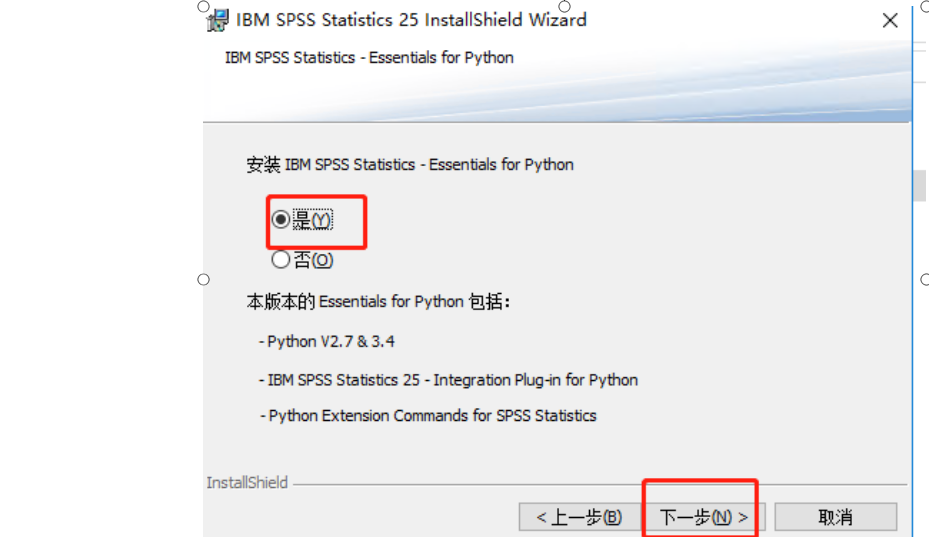<font style="color:rgb(0,0,0);">（3）环境变量配置：</font>

l 右键“我的电脑”，点击“属性”

l 点击“高级系统设置”，弹窗处点击“高级”选项卡，再点击“环境变量”按钮

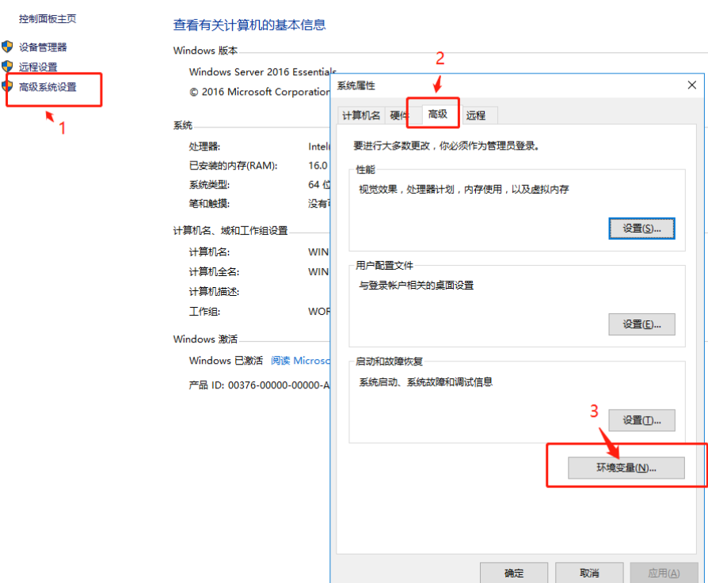

l 选中下方系统变量框中，变量为“Path”的行，再点击“编辑”按钮

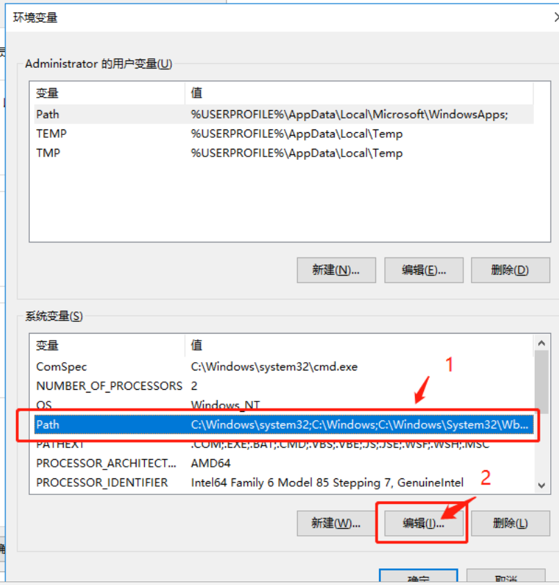

l 点击“新建”按钮新增一行，依次输入下列信息：

<font style="color:rgb(0,0,0);">C:\Program Files\IBM\SPSS\Statistics\</font><font style="color:rgb(0,0,0);">27</font><font style="color:rgb(0,0,0);">\Python3\Scripts</font>

<font style="color:rgb(0,0,0);">C:\Program Files\IBM\SPSS\Statistics\27\Python3</font>

<font style="color:rgb(0,0,0);">C:\Program Files\IBM\SPSS\Statistics\</font><font style="color:rgb(0,0,0);">27</font>

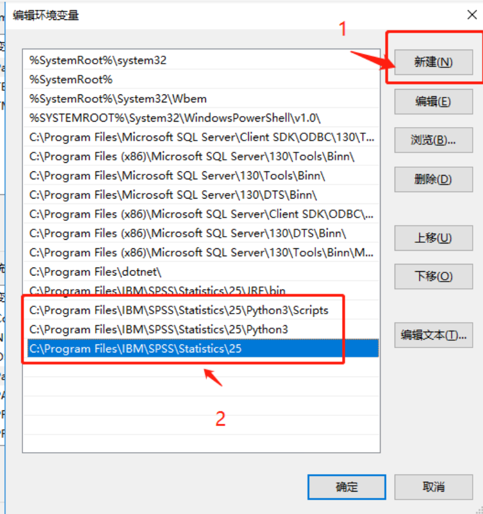

<font style="color:rgb(0,0,0);">l</font><font style="color:rgb(0,0,0);"> </font><font style="color:rgb(0,0,0);">点击</font><font style="color:rgb(0,0,0);">“确定”按钮后配置完成</font>

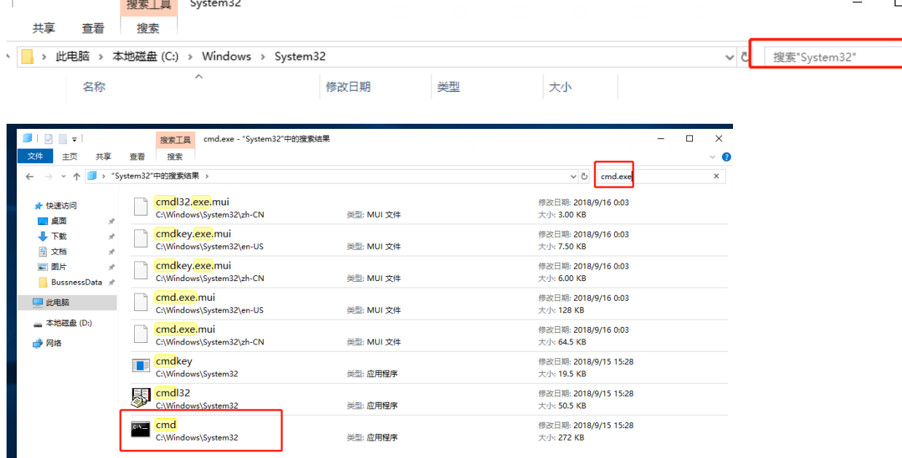

二、Python第三方包安装

（1）进入目录C:\Windows\System32，搜索框中输入cmd.exe，选择cmd右键管理员运行

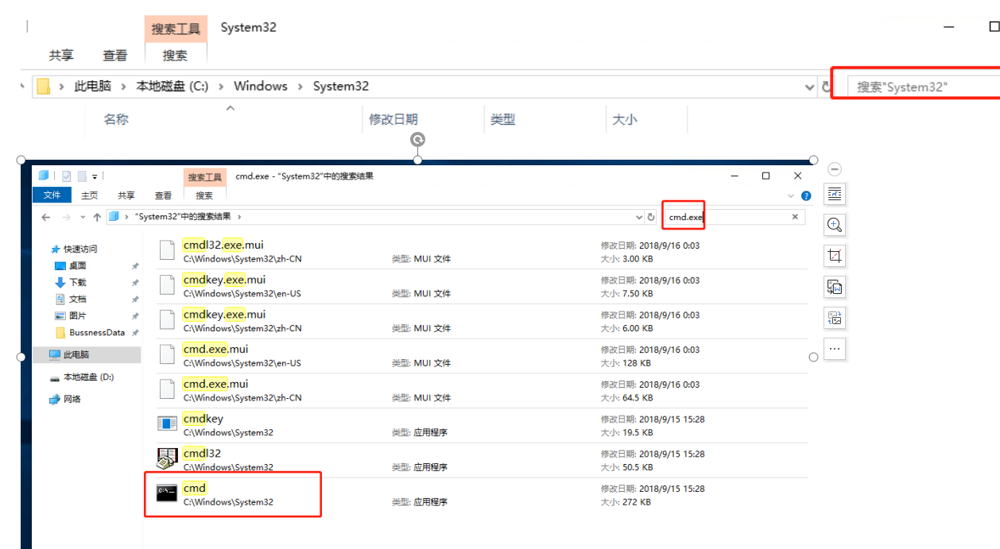


（2）执行下方语句（图2-2）

25版本

执行get-pip.py文件

```python
python -m pip install xlrd==1.2.0 -i https://pypi.douban.com/simple/
python -m pip install xlwt==1.3.0 -i https://pypi.douban.com/simple/
python -m pip install numpy==1.15.4 -i https://pypi.douban.com/simple/
python -m pip install requests==2.18.4 -i https://pypi.douban.com/simple/
python -m pip install matplotlib==2.2.5 -i https://pypi.douban.com/simple/
python -m pip install openpyxl==2.5.14 -i https://pypi.douban.com/simple/
python -m pip install typing -i https://pypi.douban.com/simple/
python -m pip install pyparsing==2.1.4 -i https://pypi.douban.com/simple/
python -m pip install scikit-learn -i https://pypi.douban.com/simple/
```


<font style="color:rgb(0,0,0);">手动安装模块：pandas-0.20.3-cp34-none-win_amd64.whl</font>

<font style="color:rgb(0,0,0);">进入模块文件目录，打开</font><font style="color:rgb(0,0,0);">cmd</font>

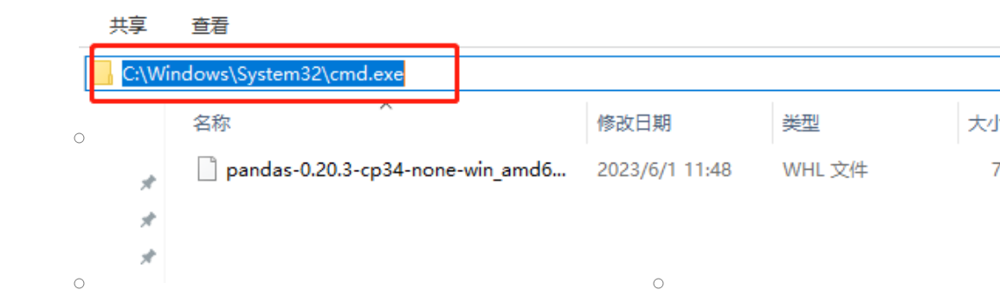


<font style="color:rgb(0,0,0);">输入命令：</font>

```python
python -m pip install pandas-0.20.3-cp34-none-win_amd64.whl
```

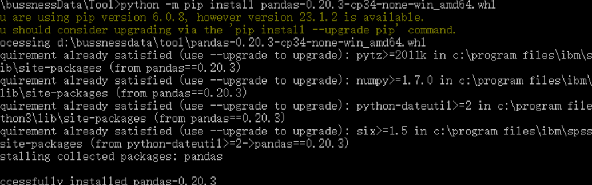

<font style="color:rgb(0,0,0);">27版本</font>

```python
python -m pip install xlwt -i https://pypi.douban.com/simple/
python -m pip install numpy -i https://pypi.douban.com/simple/
python -m pip install requests -i https://pypi.douban.com/simple/
python -m pip install matplotlib -i https://pypi.douban.com/simple/
python -m pip install openpyxl -i https://pypi.douban.com/simple/
python -m pip install typing -i https://pypi.douban.com/simple/
python -m pip install pyparsing -i https://pypi.douban.com/simple/
python -m pip install scikit-learn -i https://pypi.douban.com/simple/
python -m pip install matplotlib -i https://pypi.douban.com/simple/
python -m pip install pandas -i https://pypi.douban.com/simple/
```


（3）查看安装结果

命令提示符（cmd）中输入命令：statisticspython3.bat -m pip list，查看包是否安装成功

python -m pip list

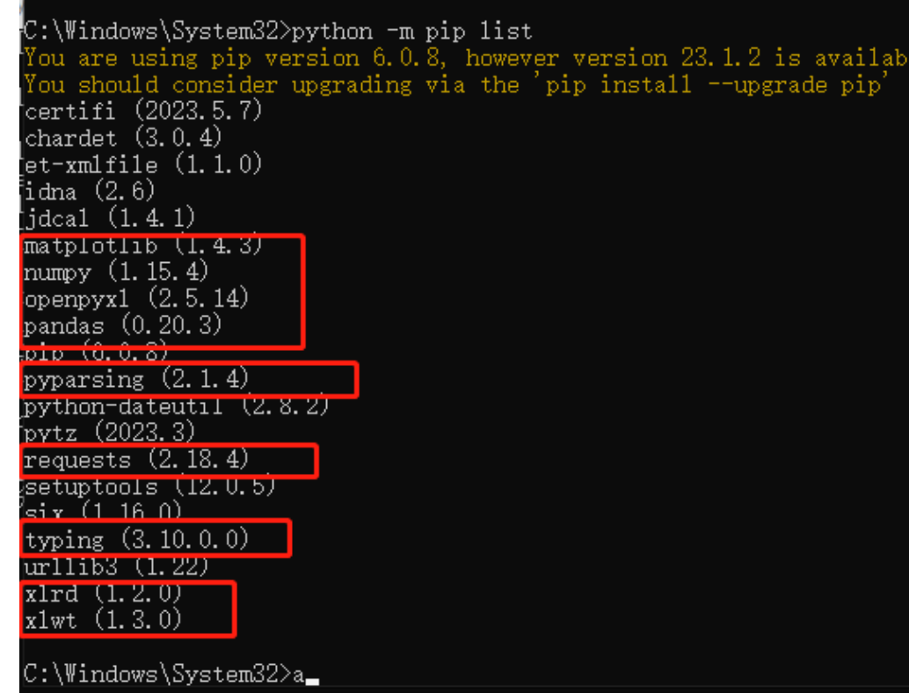

三、PythonTool工具启动，及配置

（1）修改API网站的appsettings文件，修改如下：

C:\dianyue\商务数据分析\shanxiyanshixiangmu\publish

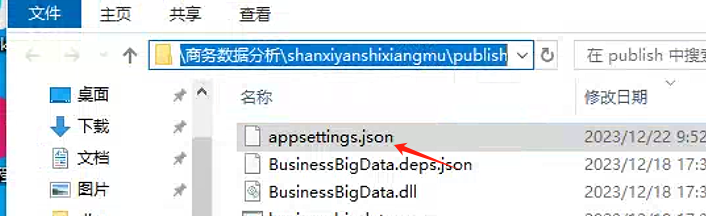

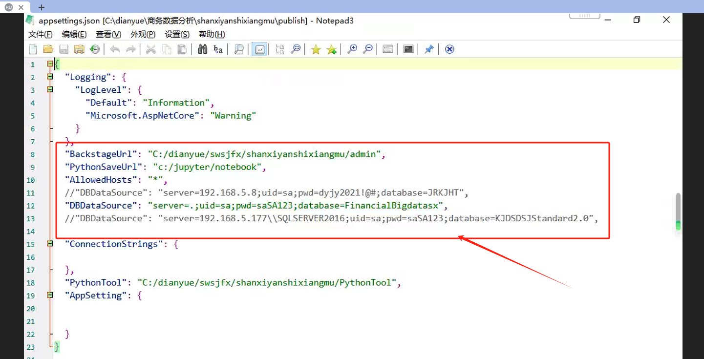

Pythontool的地址更新当前PythonTool的目录，Python地址更新

后台配置

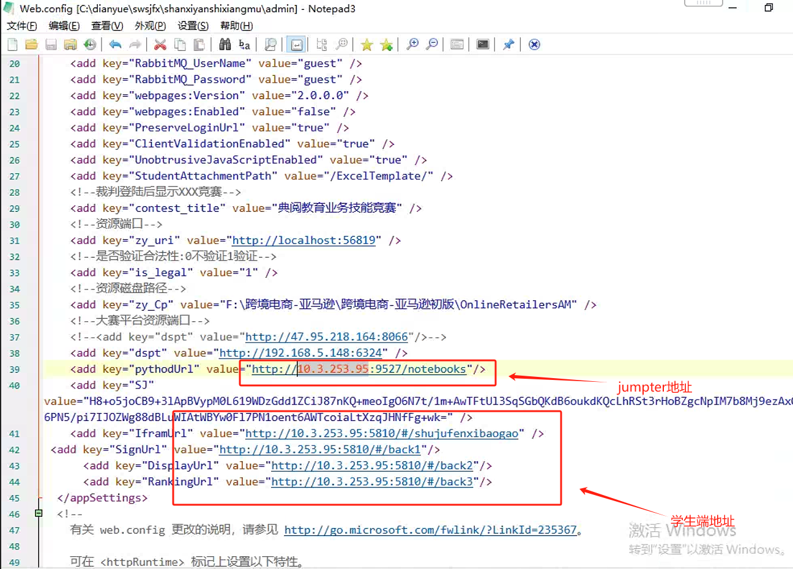

#### 更改成管理后台地址
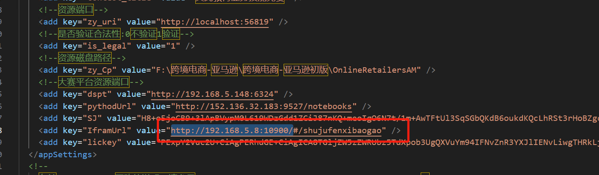

（2）工具目录权限赋予：

右键PythonTool文件夹，点击属性，进入安全选项卡，点击“编辑”按钮


点击添加，输入：Network Service;IIS_IUSRS并点击检查名称


确定后，对所有组或用户名权限赋予完全控制权限，点击应用后生效


（3）配置自启动

win+R键，输入shell:startup回车后，在打开的文件夹创建快捷方式

关联对应的PythonTool.exe文件


（4）双击运行PythonTool.exe ，看到start代表运行成功


**部署****jupyter**

1,安装python 3.9版本

2，安装jupyter 

c:\Users\Administartor\AppData\Local\Programs\Python\Python39\Scripts  
  
在这个目录下执行pip

执行<font style="color:rgb(91,155,213);">pip install jupyter</font>

c:\Users\Administartor\AppData\Local\Programs\Python\Python39


<font style="color:rgb(91,155,213);">在这个目录下执行安装</font><font style="color:rgb(91,155,213);">python</font><font style="color:rgb(91,155,213);">库</font>

<font style="color:rgb(91,155,213);">pip install -i https://pypi.tuna.tsinghua.edu.cn/simple pandas</font>

<font style="color:rgb(91,155,213);">pip install -i https://pypi.tuna.tsinghua.edu.cn/simple matplotlib</font>

<font style="color:rgb(91,155,213);">pip install -i https://pypi.tuna.tsinghua.edu.cn/simple datetime</font>

<font style="color:rgb(91,155,213);">pip install -i https://pypi.tuna.tsinghua.edu.cn/simple requests</font>

<font style="color:rgb(91,155,213);">pip install -i https://pypi.tuna.tsinghua.edu.cn/simple openpyxl</font>

<font style="color:rgb(91,155,213);">pip install -i https://pypi.tuna.tsinghua.edu.cn/simple beautifulsoup4</font>

<font style="color:rgb(91,155,213);">pip install -i https://pypi.tuna.tsinghua.edu.cn/simple scikit-learn</font>

<font style="color:rgb(91,155,213);">pip install -i https://pypi.tuna.tsinghua.edu.cn/simple Seaborn</font>

<font style="color:rgb(91,155,213);">pip install -i https://pypi.tuna.tsinghua.edu.cn/simple TensorFlow</font>

<font style="color:rgb(91,155,213);">pip install -i https://pypi.tuna.tsinghua.edu.cn/simple  Keras</font>

<font style="color:rgb(91,155,213);"></font>

3,<font style="color:rgb(0,0,0);">生成本地配置文件</font>

c:\Users\Administartor\AppData\Local\Programs\Python\Python39\Scripts  
在这个目录下执行

<font style="color:rgb(91,155,213);">jupyter server --generate-config </font>

<font style="color:rgb(91,155,213);">jupyter notebook --generate-config</font>

<font style="color:rgb(91,155,213);">配置文件所在目录</font>

<font style="color:rgb(91,155,213);">C:\Users\sxkd\.jupyter</font>

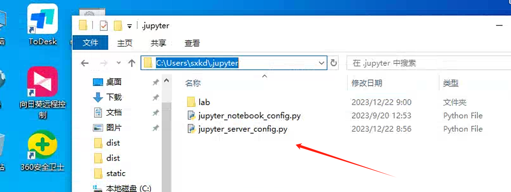


jupyter_server_config配置需要顶格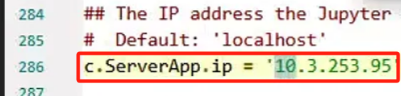

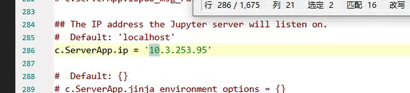


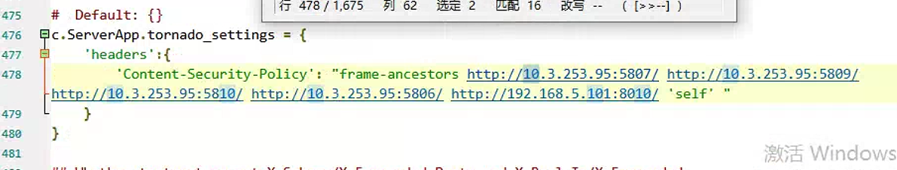

 陕西开放_数字金融实训工具系统  5807  5004

陕西开放-数字金融实训教学系统 5809   5006

陕西开放_数字金融实训管理系统 5810 5005

商务数据分析后台      5806

学生端配置

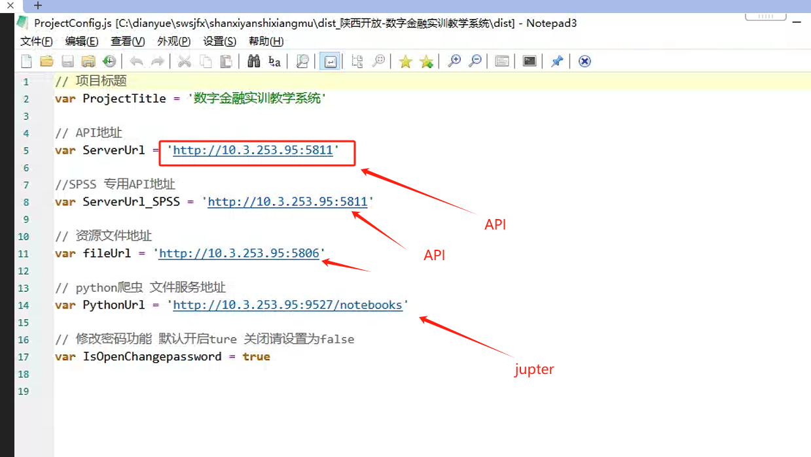

5806后台网址


<font style="color:rgb(91,155,213);">4,</font><font style="color:rgb(0,0,0);">修改</font><font style="color:rgb(0,0,0);">notebook </font><font style="color:rgb(0,0,0);">运行时的</font><font style="color:rgb(0,0,0);">IP </font><font style="color:rgb(0,0,0);">和端口</font>

<font style="color:rgb(0,0,0);">把安装包中的</font><font style="color:rgb(0,0,0);">jupyter_notebook_config</font><font style="color:rgb(0,0,0);">和</font><font style="color:rgb(0,0,0);">jupyter_server_config复制到C:\Users\Administrator\.jupyter覆盖原文件，并修改相应的IP和端口。</font>

<font style="color:rgb(0,0,0);"></font>

<font style="color:rgb(0,0,0);">5，</font><font style="color:rgb(0,0,0);">在目标目录启动</font><font style="color:rgb(0,0,0);">notebook</font>

<font style="color:rgb(0,0,0);">复制</font><font style="color:rgb(0,0,0);">jupyter文件夹到服务器指定的位置，把文件夹里面的notebook设置开机启动快捷方式，步骤同python，并给jupyter赋予权限。</font>

<font style="color:rgb(0,0,0);">启动</font><font style="color:rgb(0,0,0);">jupyter目录下的可执行文件 notebook</font>

<font style="color:rgb(0,0,0);"></font>

### <font style="color:rgb(0,0,0);">2.DATAAPI 无法访问需要安装重写模块</font>
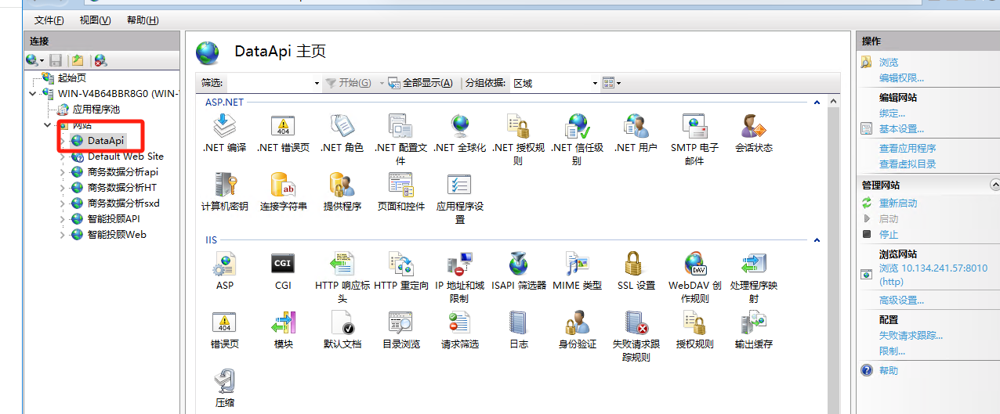


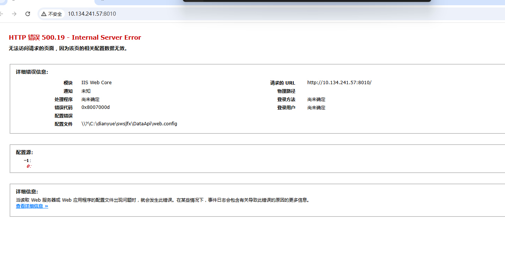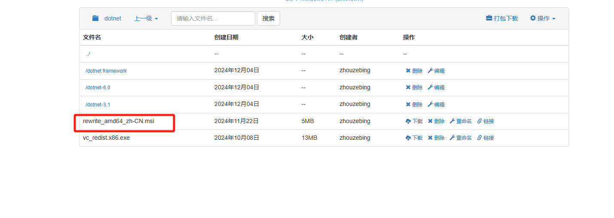

### jupyter 从C:\jupyter\.jupyter配置文件拷贝到C:\Users\Administrator\.jupyter 重新启动jupyter.bat
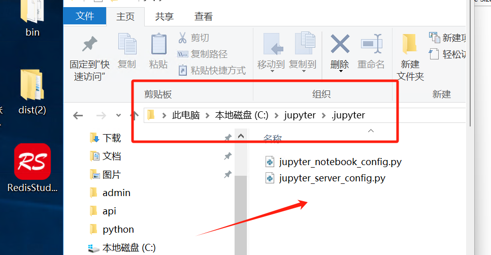


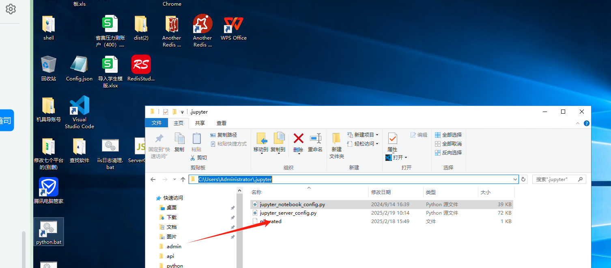


### 此处调用 python 服务配置
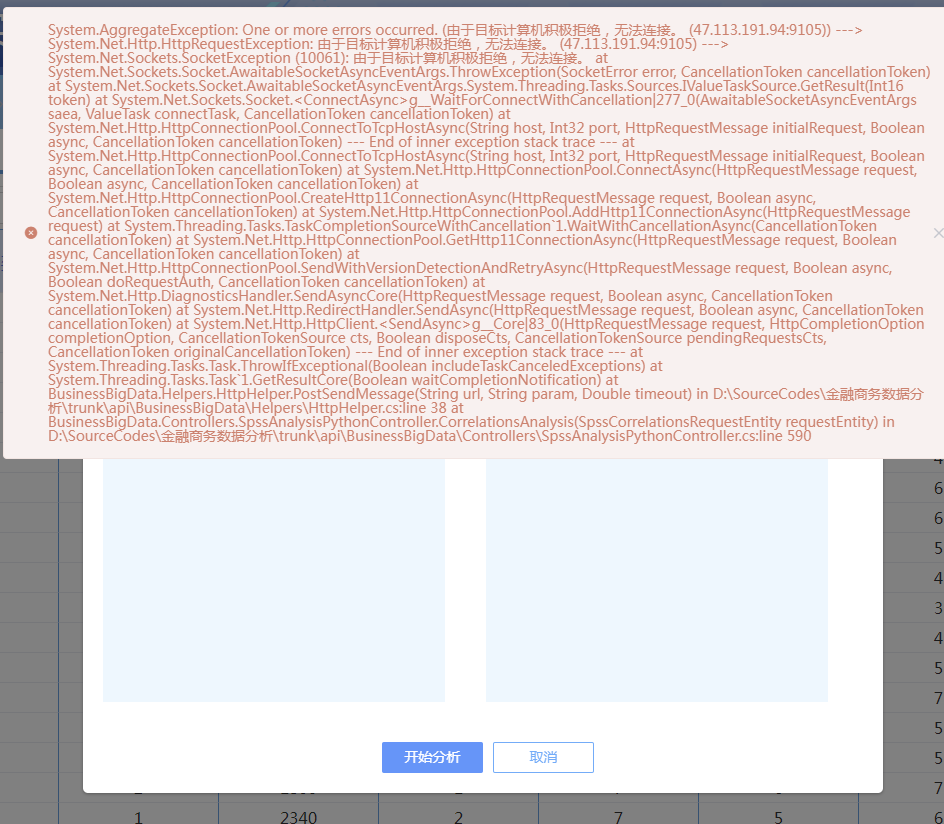


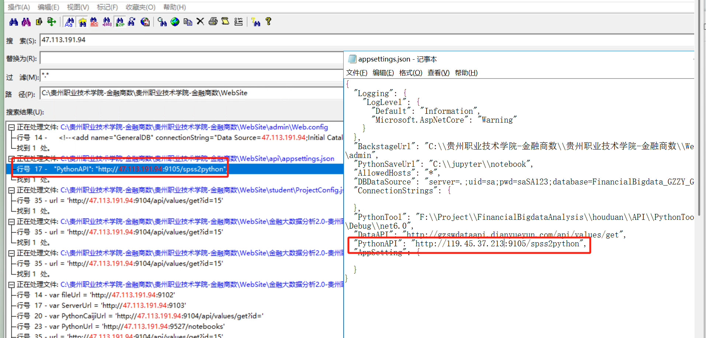


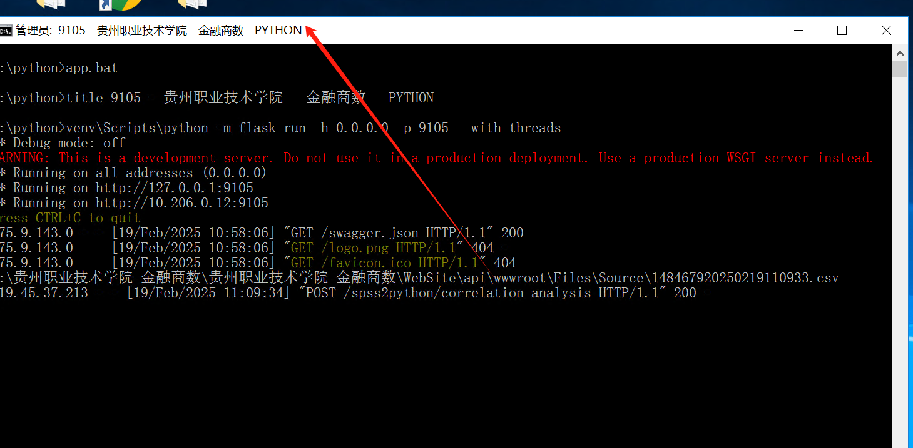


> 更新: 2025-07-13 08:37:57  
> 原文: <https://www.yuque.com/lixinsi/hntyk2/plmz1gc0rai23yfg>