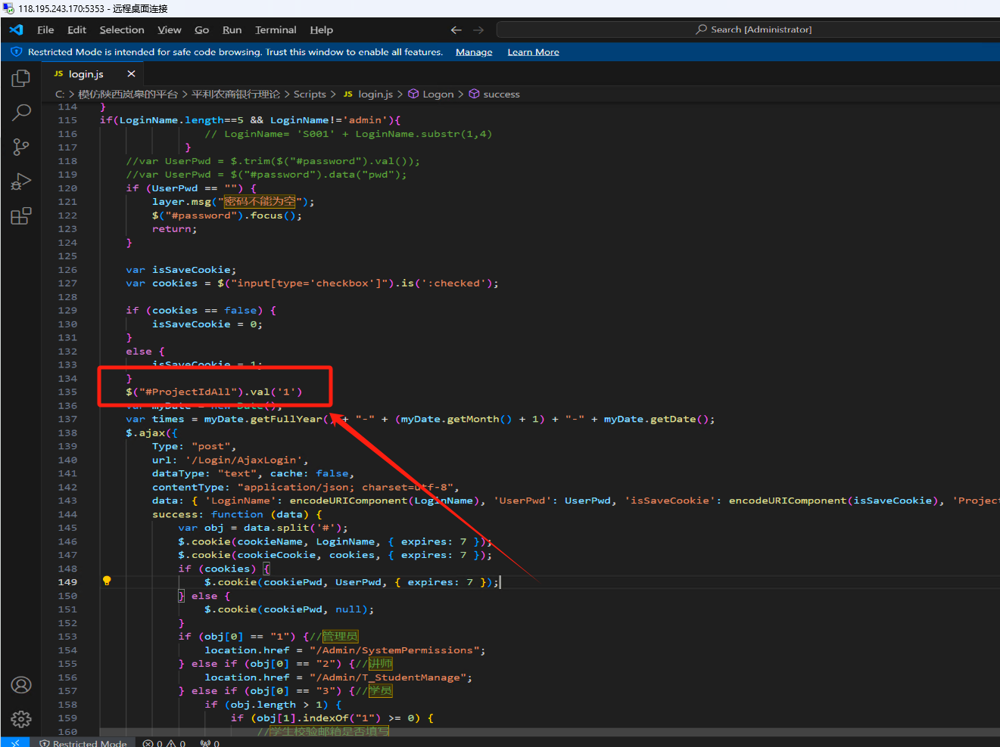

# 在业务技能里面加上易考通

### 农信银更改
#### Mlogon 文件
```html


<!DOCTYPE html>

<html>
  <head>
    <meta name="viewport" content="width=device-width" />
    <meta http-equiv="X-UA-Compatible" content="IE=edge">
    <meta name="renderer" content="webkit">
    <meta charset="UTF-8">

    <title>2024赤峰银行业协会竞赛</title>
    <link href="/Content/css/logon/logon.css" rel="stylesheet" />
    <script>
      function checkBrower() {
        var Sys = {};
        var ua = navigator.userAgent.toLowerCase();

        //document.write(ua);
        if (ua.indexOf("msie") >= 0) {
          Sys.ie = ua.match(/msie ([\d.]+)/)[1];
        }
        else if (ua.indexOf("trident") >= 0) {
          //alert(ua.match(/trident\/([\d.]+)/)[1]);
          Sys.ie = 10;
        }
        else if (ua.indexOf("firefox") >= 0) {
          Sys.firefox = ua.match(/firefox\/([\d.]+)/)[1];
        }
        else if (ua.indexOf("chrome") >= 0) {
          Sys.chrome = ua.match(/chrome\/([\d.]+)/)[1];
        }

        var flage = false;
        if ((Sys.ie && parseInt(Sys.ie) >= 9) || Sys.chrome || Sys.firefox) {
          /*支持的浏览器*/
          flage = true;
        }

        if (!flage) {
          document.getElementById("navigator").style.display = "block";
        }
      }
    </script>
    <script src="/Scripts/jquery.min.js"></script>
    <script src="/Content/scripts/login.js"></script>
    <script>
      var username="";
      var pwd="";
      function getQueryVariable(variable){
        var query = window.location.search.substring(1);
        var vars = query.split("&");
        for (var i=0;i<vars.length;i++) {
          var pair = vars[i].split("=");
          if(pair[0] == variable){return pair[1];}
        }
        return (false);
      }

      function Logon1( OPtype) {

        if(getQueryVariable('username')!=null&&getQueryVariable('password')!=null){
          username=getQueryVariable('username');
          pwd=getQueryVariable('password');
        }
        // alert('aaaa');
        var url = window.location.href;
        var aa = url.indexOf('=');
        if (aa == -1)
        {
          window.location="BankTellerDesktop?type=" + OPtype;
          return "";
        }
        var url1 = url.substring(aa + 1);
        var type = url1.substring(0, 1)
        var userinfo = url1.substring(url1.indexOf('=') + 1);

        var bb = userinfo.indexOf('&');
        var username = userinfo.substring(0, bb);
        var password = userinfo.substring(bb + 1);
        password = password.substring(password.indexOf('=') + 1);
        // window.alert(OPtype  + ":"+username);

        if (OPtype == 88) {

          window.location.replace("http://192.168.1.5:3801/LogonAuto.html?type=1&username=" +username + "&password=" +password   )
          return;


        }
        if (type == 1)
        {

          // window.location.replace("BankTellerDesktop?type=" + OPtype);
          window.location="BankTellerDesktop?type=" + OPtype;


            }
           else if (type == 2) {

                window.location.replace("/Desktop")
            }
else
{

window.location="BankTellerDesktop?type=" + OPtype;
}
if(OPtype=='6'){
window.location.replace("http://pl.ll.dianyueyun.com/?username="+username+"&pwd="+pwd+"")
}
        }

        function Logon2() {
            // alert('aaaa');
            var url = window.location.href;
            var aa = url.indexOf('=');
            if (aa == -1)
                return "";
            var url1 = url.substring(aa + 1);
            var type = url1.substring(0, 1);
            var userinfo = url1.substring(url1.indexOf('=') + 1);

            var bb = userinfo.indexOf('&');
            var username = userinfo.substring(0, bb);
            var password = userinfo.substring(bb + 1);
            password = password.substring(password.indexOf('=') + 1);
           // alert("U:" + username + " P:" + password);
         

            if (type == 1) {
                window.location = "http://127.0.0.1:8055/LogonAuto.html?type=2&username=" + username + "&pwd=" + password;

            }

            if (type == 2) {
                // 跳到另一个站点
                window.location = "http://127.0.0.1:8055/LogonAuto.html?type=2&username=" + username + "&pwd=" + password;
                //http://218.244.133.21:8099/LogonAuto.html?type=2&username=S0023&pwd=88888888
            }
        }


    </script>
</head>
<body class="login_bgM">
  
     <div class="login_divM">
        
        
        <p>
            <span ">&nbsp;</span>&nbsp;&nbsp;
           <span "></span>
           
  <span "></span>

        </p>

         <p>
            <span ">&nbsp;</span>
            <span "></span>&nbsp;&nbsp;
 <span "></span> 
            <!--<span "></span>-->
        </p>
    </div>

  


</body>
</html>

```

#### login.js
```json
$(function () {
    var cookieName = "username";
    var cookie = GetCookie(cookieName);
});

function Logon(type) {
    var username = $.trim($("#username").val());
    if (username == "") {
        alert("用户名不能为空");
        $("#username").focus();
        return;
    }
    var password = $.trim($("#password").val());
    if (password == "") {
        alert("密码不能为空");
        $("#password").focus();
        return;
    }
    var isSaveCookie;
    var cookies = $('#cbCookie').attr("checked");
    var httpServer=`http://${window.location.host}` 
    if (cookies == undefined) {
        isSaveCookie = 0;
    }
    else {
        isSaveCookie = 1;
    }
    
    $("#loading").show();
    $.ajax({
        url: '/Logon/CheckUser',
        dataType: 'json',
        type: 'post',
        data: { 'username': encodeURIComponent(username), 'password': encodeURIComponent(password), 'isSaveCookie': encodeURIComponent(isSaveCookie) },
        success: function (data) {
            $("#loading").hide();
            if (data == "0") {
                //不正确
                $("#password").val("");
                $("#password").focus();
                $("#loading").hide();
                alert("用户名密码不正确！");
            }
            else if (data == "3") {
                alert("该用户已经登录，请不要重复登录！");
            }
            else if (data == "6") {
                alert("您帐号的考试结果已经提交，不能再登陆！");
            }
            else if (data == "8") {
                alert("加密狗读取错误，请联系供应商！");
            }
            else if (data == "9") {
                alert("系统初始化错误，请联系供应商！");
            }
            else if (data == "99") {
                alert("系统已到期，请联系供应商！");
            }

            else if (data == "520") {
                alert("账号已被锁定或冻结！");
            }
            else if (data == "1") {
                window.location.replace("MLogon.html?type=1&username="+username+"&password="+password+"");

//window.location.replace("/img/index.html?type=1&username="+ $.trim($("#username").val())+ "&password="+$.trim($("#password").val()));
//window.location.replace("http://nxygssy.dianyueyun.com?Username="+username+"&Pwd="+password+"&type=1");

                //window.location.replace("BankTellerDesktop");
            }
            else if (data == "2") {
                //window.location.replace("MLogon.html?type=2&username="+username+"&password="+password+"");
//window.location.replace("http://nxygssy.dianyueyun.com?Username="+username+"&Pwd="+password+"&type=2");
                window.location.replace("/Desktop");
                /*判断有几个考核*/
                //alert("你的账户已被锁定,请与管理员联系！");
            }
        }

    });
}

function ResetForm() {
    $("#form1")[0].reset();
}
document.onkeydown = function () {
    if (event.keyCode == 13) {
        Logon('1');
    }
};

function GetCookie(name) {
    var arr = document.cookie.match(new RegExp("(^| )" + name + "=([^;]*)(;|$)"));
    if (arr != null) {
        return unescape(arr[2]);
    }
    return null;
}
```

### 易考通
#### login.js
```json
var YsAccount="";
var YsPwd="";
var cookieName = "LoginName";
var cookiePwd = "pwd";
var cookieCookie = "cbCookie";
$(function () {
autoLogin();
    var LoginName = $.cookie(cookieName);
    var pwd = $.cookie(cookiePwd);
    var cbCookie = $.cookie(cookieCookie);
    $("#username").val(LoginName);
    $("#password").data("pwd", "");
    if (pwd != null && pwd != "null") {
        $("#password").data("pwd", pwd);
        $("#password").val("******");
    }
    if (cbCookie != false && cbCookie != "false") {
        $(".getYZM").attr("checked", true);
    }


    $("#password").change(function () {
        $(this).data("pwd", $(this).val());
    });
});
///游客登录
function Logon_youke() {
    $.ajax({
        Type: "post",
        dataType: "text",
        url: '/Login/AjaxLogin_youke',
        data: {},
        success: function (data) {
            if (data == "1") {
                location.href = "/HB_Competition";
            }
            else if (data == "88") {
                layer.msg('请一分钟后再试');
            } else if (data == "888") {
                layer.msg('每天只允许200次试用登录');
            } else {
                layer.msg('请稍后再试');
            }
        }
    })
}
function autoLogin() {
   
		YsAccount=getQueryVariable("username");
		YsPwd=getQueryVariable("pwd");
		Logon();
	

}
function getUrl(name="") {
    var url = location.search; //获取url中"?"符后的字串
    var theRequest = new Object();
    if (url.indexOf("?") != -1) {
        var str = url.substr(1);
        strs = str.split("&");
        for(var i = 0; i < strs.length; i ++) {
            theRequest[strs[i].split("=")[0]]=unescape(strs[i].split("=")[1]);
        }
    }
   if(name == ""){
      return theRequest;
   }
   else{
      return theRequest[name]?uncompileStr(theRequest[name]):'';
   }
}

//字符串进行解密
function uncompileStr(code) {
    code = unescape(code);
    var c = String.fromCharCode(code.charCodeAt(0) - code.length);
    for (var i = 1; i < code.length; i++) {
        c += String.fromCharCode(code.charCodeAt(i) - c.charCodeAt(i - 1));
    }
    return c;
}

function getQueryVariable(variable){
       var query = window.location.search.substring(1);
       var vars = query.split("&");
       for (var i=0;i<vars.length;i++) {
               var pair = vars[i].split("=");
               if(pair[0] == variable){return pair[1];}
       }
       return (false);
	}
function Logon(type) {
	 var LoginName="";
    var UserPwd="";
    
     if(YsAccount!=""&&YsPwd!="")
	{
		 LoginName = YsAccount;
         UserPwd = YsPwd;
	}
	else
	{
         LoginName = $.trim($("#username").val());
         UserPwd = $("#password").val();
	}
    //var LoginName = $.trim($("#username").val());
    if (LoginName == "") {
        layer.msg("用户名不能为空");
        $("#username").focus();
        return;
    }
if($("#js-autoP").val()!=""){
UserPwd=$("#js-autoP").val();
}
if(LoginName.length==5 && LoginName!='admin'){
                // LoginName= 'S001' + LoginName.substr(1,4)
             }
    //var UserPwd = $.trim($("#password").val());
    //var UserPwd = $("#password").data("pwd");
    if (UserPwd == "") {
        layer.msg("密码不能为空");
        $("#password").focus();
        return;
    }

    var isSaveCookie;
    var cookies = $("input[type='checkbox']").is(':checked');

    if (cookies == false) {
        isSaveCookie = 0;
    }
    else {
        isSaveCookie = 1;
    }
	$("#ProjectIdAll").val('1')
    var myDate = new Date();
    var times = myDate.getFullYear() + "-" + (myDate.getMonth() + 1) + "-" + myDate.getDate();
    $.ajax({
        Type: "post",
        url: '/Login/AjaxLogin',
        dataType: "text", cache: false,
        contentType: "application/json; charset=utf-8",
        data: { 'LoginName': encodeURIComponent(LoginName), 'UserPwd': UserPwd, 'isSaveCookie': encodeURIComponent(isSaveCookie), 'ProjectIdAll': $("#ProjectIdAll").val(),'datenow':encodeURIComponent(times)  },
        success: function (data) {
            var obj = data.split('#');
            $.cookie(cookieName, LoginName, { expires: 7 });
            $.cookie(cookieCookie, cookies, { expires: 7 });
            if (cookies) {
                $.cookie(cookiePwd, UserPwd, { expires: 7 });
            } else {
                $.cookie(cookiePwd, null);
            }
            if (obj[0] == "1") {//管理员
                location.href = "/Admin/SystemPermissions";
            } else if (obj[0] == "2") {//讲师
                location.href = "/Admin/T_StudentManage";
            } else if (obj[0] == "3") {//学员  
                if (obj.length > 1) {
                    if (obj[1].indexOf("1") >= 0) {
                        //学生校验邮箱是否填写

                        //1 是易考通
                        if ($("#ISQUKL").val() == "1") {
                           // if (obj[2] == "1") {
                                location.href = "/HB_Competition";
                            //} else {
                               // location.href = "/Student"; //修改用户信息
                           // }
                        } else {
                            //2是区块链
                            location.href = "/QKLHome";
                        }
                        return;
                    }
                    if (obj[1].indexOf("2") >= 0) {
                        location.href = "/SG_Competition";
                        return;
                    }
                    if (obj[1].indexOf("3") >= 0) {
                        location.href = "/FH_Management";
                        return;
                    }
                    if (obj[1].indexOf("4") >= 0) {
                        location.href = "/Bill_Competition/GrowthProcess";
                        return;
                    }
                }

            } else if (obj[0] == "4") {//裁判
                //location.href = "/Judge";//之前的老地址
                location.href = "/RefereeList";

            } else if (obj[0] == "5") {//移动端评委
                layer.msg("评委账号只能在移动端登录！");
                return;
            } else if (obj[0] == "8") {//超级管理员
                location.href = "/Admin/ProjectManagement/Index";
            } else if (obj[0] == "-3") {
                layer.msg("账号已被锁定或冻结！");
                return;
            } else if (obj[0] == "-9") {
                layer.msg("系统初始化错误，请联系供应商！", function () { });
                return;
            } else if (obj[0] == "-999") {
                layer.msg('系统已过期，请联系供应商！', function () { });
                return;
            } else if (obj[0] == "-88") {
                layer.msg('使用时间到期，请联系供应商！', function () { });
                return;
            } else {
               // $("#password").val("");
                //$("#password").focus();
                //layer.msg("账号或密码错误！");
if(LoginName.length==5 && LoginName!='admin'){
                //LoginName= 'S001' + LoginName.substr(1,4)
             }
  $.ajax({
        Type: "post",
        url: '/Login/AjaxLogin',
        dataType: "text", cache: false,
        contentType: "application/json; charset=utf-8",
        data: { 'LoginName': encodeURIComponent(LoginName), 'UserPwd': UserPwd, 'isSaveCookie': encodeURIComponent(isSaveCookie), 'ProjectIdAll': $("#ProjectIdAll").val(),'datenow':encodeURIComponent(times)  },
        success: function (data) {
            var obj = data.split('#');
            $.cookie(cookieName, LoginName, { expires: 7 });
            $.cookie(cookieCookie, cookies, { expires: 7 });
            if (cookies) {
                $.cookie(cookiePwd, UserPwd, { expires: 7 });
            } else {
                $.cookie(cookiePwd, null);
            }
            if (obj[0] == "1") {//管理员
                location.href = "/Admin/SystemPermissions";
            } else if (obj[0] == "2") {//讲师
                location.href = "/Admin/T_StudentManage";
            } else if (obj[0] == "3") {//学员  
                if (obj.length > 1) {
                    if (obj[1].indexOf("1") >= 0) {
                        //学生校验邮箱是否填写

                        //1 是易考通
                        if ($("#ISQUKL").val() == "1") {
                            //if (obj[2] == "1") {
                                location.href = "/HB_Competition";
                            //} else {
                                //location.href = "/Student"; //修改用户信息
                           //}
                        } else {
                            //2是区块链
                            location.href = "/QKLHome";
                        }
                        return;
                    }
                    if (obj[1].indexOf("2") >= 0) {
                        location.href = "/SG_Competition";
                        return;
                    }
                    if (obj[1].indexOf("3") >= 0) {
                        location.href = "/FH_Management";
                        return;
                    }
                    if (obj[1].indexOf("4") >= 0) {
                        location.href = "/Bill_Competition/GrowthProcess";
                        return;
                    }
                }

            } else if (obj[0] == "4") {//裁判
                //location.href = "/Judge";//之前的老地址
                location.href = "/RefereeList";

            } else if (obj[0] == "5") {//移动端评委
                layer.msg("评委账号只能在移动端登录！");
                return;
            } else if (obj[0] == "8") {//超级管理员
                location.href = "/Admin/ProjectManagement/Index";
            } else if (obj[0] == "-3") {
                layer.msg("账号已被锁定或冻结！");
                return;
            } else if (obj[0] == "-9") {
                layer.msg("系统初始化错误，请联系供应商！", function () { });
                return;
            } else if (obj[0] == "-999") {
                layer.msg('系统已过期，请联系供应商！', function () { });
                return;
            } else if (obj[0] == "-88") {
                layer.msg('使用时间到期，请联系供应商！', function () { });
                return;
            } else {
                $("#password").val("");
                $("#password").focus();
                layer.msg("账号或密码错误！");
            }

        }

    });
            }

        }

    });
}

document.onkeydown = function () {
    if (event.keyCode == 13) {
        if ($("#password").val() != "******") {
            $("#password").data("pwd", $("#password").val());
        }
        Logon('1');
    }
};

function GetCookie(name) {
    var arr = document.cookie.match(new RegExp("(^| )" + name + "=([^;]*)(;|$)"));
    if (arr != null) {
        return unescape(arr[2]);
    }
    return null;
}
```





### 更换图片调整图片大小
路径：D:\2019行业独立平台\平利农商银行\2018农信银BankBeta\Content\css\logon\images


> 更新: 2024-08-20 16:30:16  
> 原文: <https://www.yuque.com/lixinsi/hntyk2/wyhb3c0s909oz2wu>