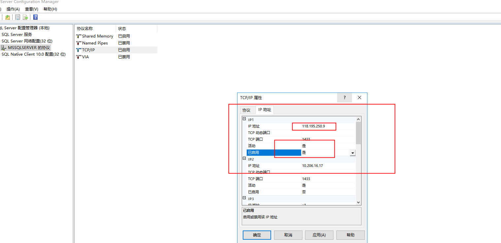
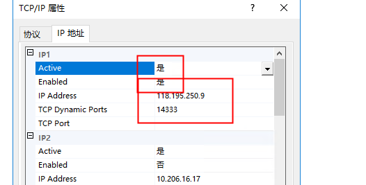
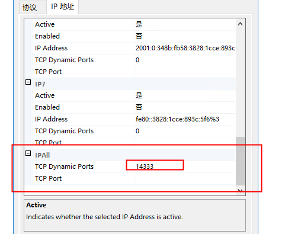
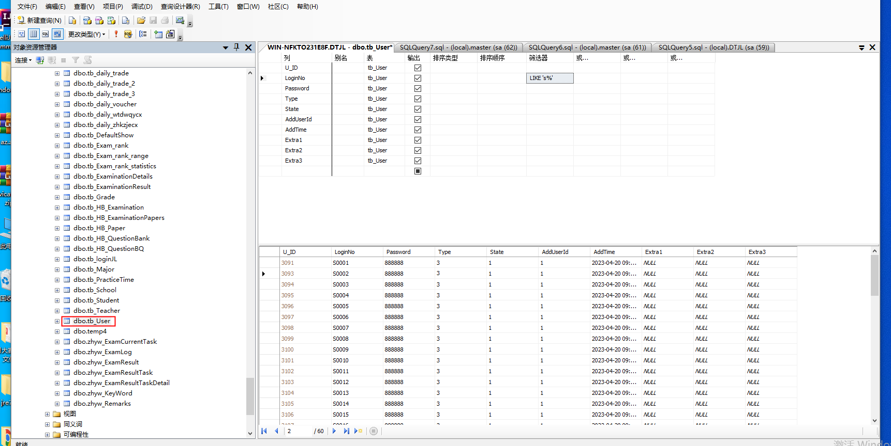
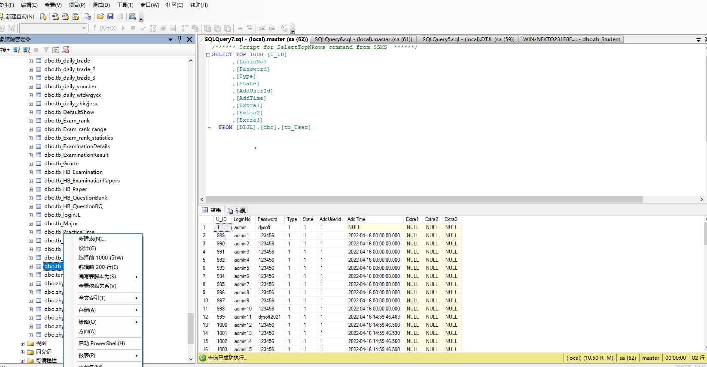
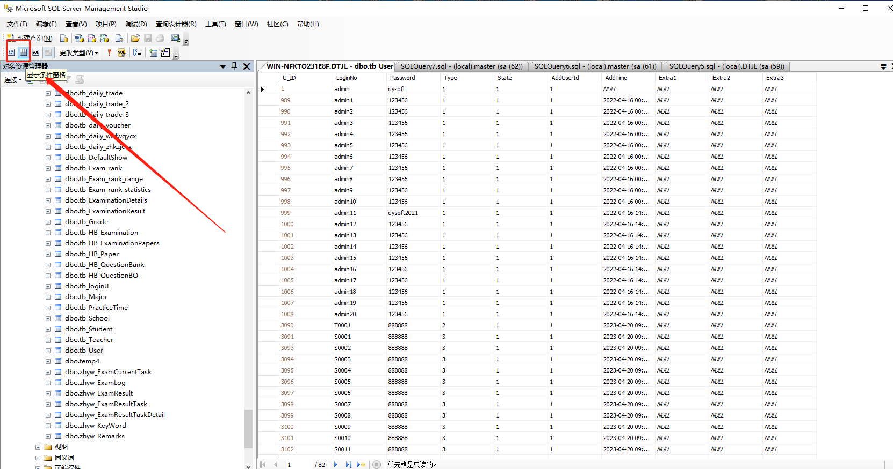
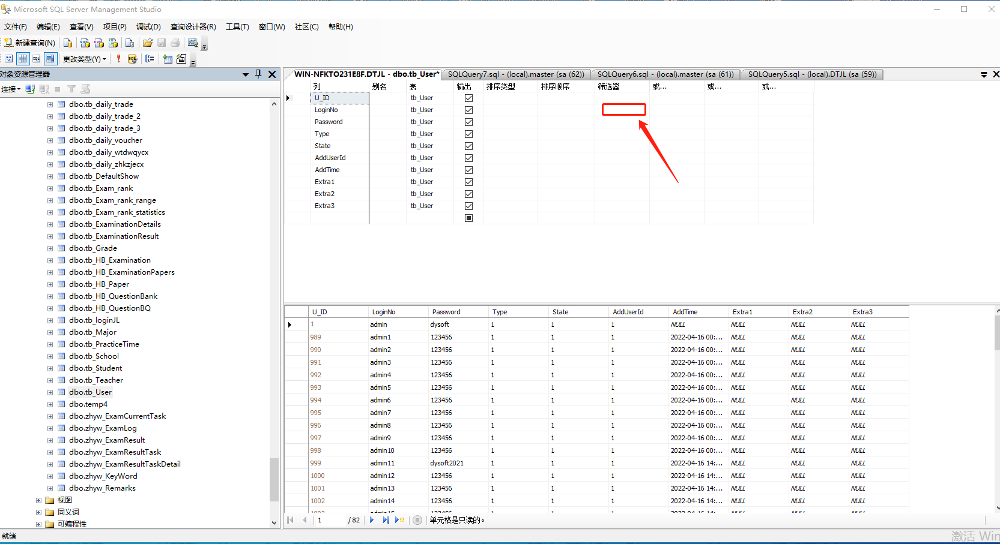

# 多个sql server实列筛选表格

单个实列

启用远程连接实列




多个实列找到运行的实列



设置ip地址端口号，开启active



设置端口

重启服务

远程连接ip地址+端口号加实列名字

118.195.250.9,14333\MSSQLSERVER1\

1.13.3.158,15000\MSSQLSERVER2019


# 筛选特定数据
打开sql server management studio

打开需要筛选的表格如图





选择编辑前200行





```dockerfile
like 's%'以s开头的所有数据
like '%s'以s结尾的所有数据
like '%s%'包含s所有数据
```


> 更新: 2023-05-23 18:08:20  
> 原文: <https://www.yuque.com/lixinsi/hntyk2/uqk0uw>