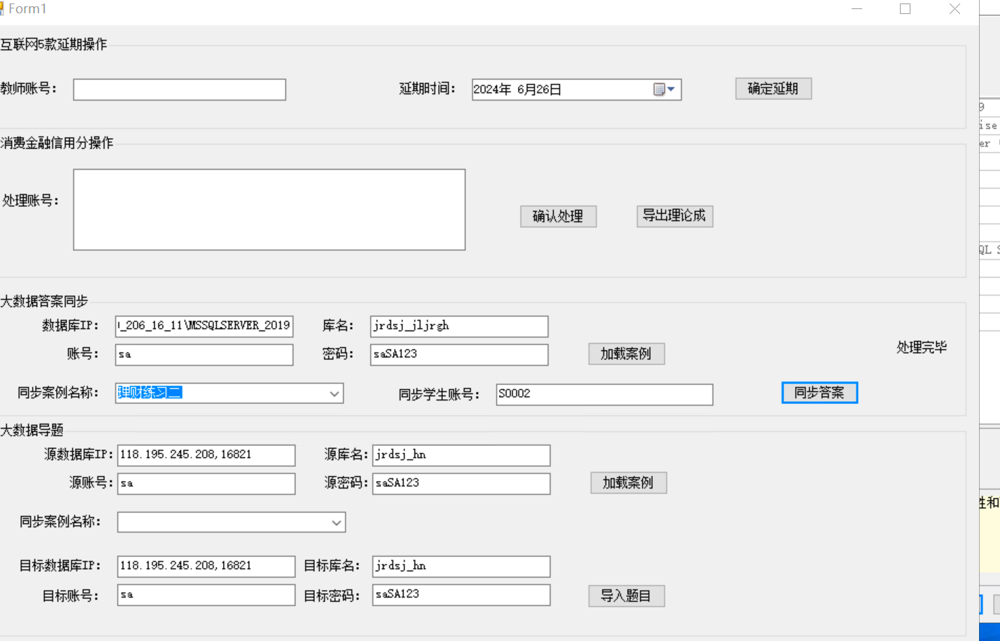

# 大数据金融

```powershell
select * from ExamInfo

--答案汇总表
SELECT *
  FROM [tb_answer] where mid=101 and type=1  order by formid 

  delete  [tb_answer] where mid=101 and type =1 and TestPaperToExamID=78 and id>=178905 and id<=178922
```

```powershell
select * from tb_UserInfo

select * from RT_FinancingExamResult where UserID=119240

select * from tb_answer where uid=119239 and mid=101 and formid=18

select * from RT_FinancingExamCheckedSource where TaskID=68 and UserType=1 order by SourceID
select * from RT_FinancingExamCheckedSource where TaskID=68 and UserID=119240  order by SourceID

update RT_FinancingExamCheckedSource set JYDataVerify=0,YQDataVerify=0,JDJGVerify=0 where TaskID=68 and UserID=119240

INSERT INTO [RT_FinancingExamCheckedSource]([ExamResultID],[UserID],[SourceID],[TaskID],[UserType],[Creater],[CrateDate],[EnterpriseName],[SocialCreditCode],
[RegCapital],[LegalPerson],[RegDate],[Industry],[LegalSffairs],[Finance],[BasicVerify],[JYDataVerify],[YQDataVerify],[FYDataVerify],
[NSDataVerify] ,[JDJGVerify] ) select 12,119240,[SourceID],[TaskID],3,
[Creater],[CrateDate],[EnterpriseName],[SocialCreditCode],[RegCapital],[LegalPerson],[RegDate],[Industry],[LegalSffairs],[Finance],
[BasicVerify],[JYDataVerify],[YQDataVerify],[FYDataVerify],[NSDataVerify] ,[JDJGVerify] from RT_FinancingExamCheckedSource where 
 TaskID=68 and UserType=1


select *,TaskID from ExamInfo where id=77
select * from TB_TestPaperToExam where TestPaperID=(select id from TB_TestPaper where TestPaperName='理财练习二')


select * from tb_UserInfo where UserNo='S0001'
```





```powershell

update tb_Rule_PersonCustomInfo  set MaxCount=1 where JobType=6 


select*from tb_Rule_PersonCustomInfo where Industry=1

select*from tb_Rule_PersonCustomInfo where Industry=17

select*from tb_Student
```


```powershell
SELECT   Id, NickName, Industry, IndustryName, EnterpriseNature, EnterpriseNatureName, JobType, JobTypeName, 
                AnnualIncomeBase, AnnualIncomeFloor, AnnualIncomeCeiling, AnnualIncomeQ1, AnnualIncomeQ2, AnnualIncomeQ3, 
                AnnualIncomeQ4, YearEndBonus, ExpenditureFloor, ExpenditureCeiling, ExpenditureQ1, ExpenditureQ2, ExpenditureQ3, 
                ExpenditureQ4, AccountsPayable, Rent, TaxDues, WaterFee, OtherCurrentLiability, HousingLoans, ConsumerLoans, 
                CreditInvestment, PolicyLoan, BusinessLoan, Collateral, OtherLongLiabilities, WorkExperienceFloor, 
                WorkExperienceCeiling, Education, AgeFloor, AgeCeiling, SocialSkills, JobGrade, InvestmentExperienceFloor, 
                InvestmentExperienceCeiling, UnrealizedLossFloor, UnrealizedLossCeiling, MaxCount
FROM      tb_Rule_PersonCustomInfo
WHERE   (Industry = 17)
```


> 更新: 2024-06-28 11:35:34  
> 原文: <https://www.yuque.com/lixinsi/hntyk2/br5ff89h9b5pi01i>