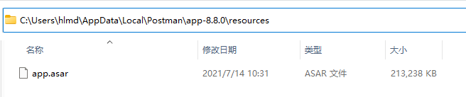
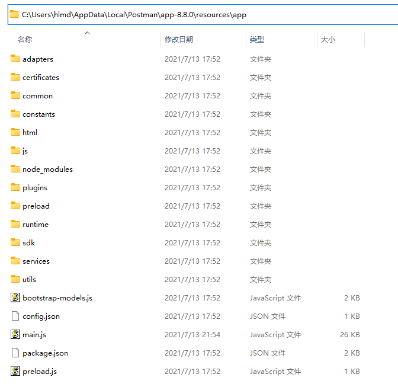

# 安装postman

### <font style="color:#000000;background-color:#FFFFFF;">Windows</font>

1. **<font style="color:#000000;background-color:#FFFFFF;">下载对应版本的</font>**<font style="color:#000000;background-color:#FFFFFF;"> </font>[<font style="color:#000000;background-color:#FFFFFF;">app.zip</font>](https://github.com/hlmd/Postman-cn/releases)
2. **<font style="color:#000000;background-color:#FFFFFF;">进入</font>**<code><font style="color:#000000;background-color:#FFFFFF;">Postman安装地址/版本/resources</font></code>**<font style="color:#000000;background-color:#FFFFFF;">目录</font>**

<font style="color:#000000;background-color:#FFFFFF;">桌面找到Postman应用程序右键 -> 打开文件所在位置 再进入</font><code><font style="color:#000000;background-color:#FFFFFF;">app-*.*.*/resources</font></code><font style="color:#000000;background-color:#FFFFFF;">\ </font><font style="color:#000000;background-color:#FFFFFF;">默认安装地址：</font><code><font style="color:#000000;background-color:#FFFFFF;">C:/Users/用户名/AppData/Local/Postman</font></code><font style="color:#000000;background-color:#FFFFFF;">\ </font><font style="color:#000000;background-color:#FFFFFF;">示例：</font><code><font style="color:#000000;background-color:#FFFFFF;">C:/Users/用户名/AppData/Local/Postman/app-8.8.0/resources</font></code><font style="color:#000000;background-color:#FFFFFF;">\ </font>

3. <font style="color:#000000;background-color:#FFFFFF;">复制</font><code><font style="color:#000000;background-color:#FFFFFF;">app.zip</font></code><font style="color:#000000;background-color:#FFFFFF;">到</font><code><font style="color:#000000;background-color:#FFFFFF;">resources</font></code><font style="color:#000000;background-color:#FFFFFF;">目录</font>

<font style="color:#000000;background-color:#FFFFFF;">将</font><code><font style="color:#000000;background-color:#FFFFFF;">app.zip</font></code><font style="color:#000000;background-color:#FFFFFF;">解压到当前文件夹 会生成一个</font><code><font style="color:#000000;background-color:#FFFFFF;">app</font></code><font style="color:#000000;background-color:#FFFFFF;">目录\ </font><font style="color:#000000;background-color:#FFFFFF;">进入</font><code><font style="color:#000000;background-color:#FFFFFF;">app</font></code><font style="color:#000000;background-color:#FFFFFF;">目录看到以下图就可以了\ </font>

4. <font style="color:#000000;background-color:#FFFFFF;">重启Postman就可以了</font>

### <font style="color:#000000;background-color:#FFFFFF;">操作GIF</font>


### <font style="color:#000000;background-color:#FFFFFF;">Mac</font>

1. **<font style="color:#000000;background-color:#FFFFFF;">下载对应版本的</font>**<font style="color:#000000;background-color:#FFFFFF;"> </font>[<font style="color:#000000;background-color:#FFFFFF;">app.zip</font>](https://github.com/hlmd/Postman-cn/releases)
2. **<font style="color:#000000;background-color:#FFFFFF;">解压</font>**<font style="color:#000000;background-color:#FFFFFF;"> </font><code><font style="color:#000000;background-color:#FFFFFF;">app.zip</font></code>
3. **<font style="color:#000000;background-color:#FFFFFF;">进入</font>**<font style="color:#000000;background-color:#FFFFFF;"> </font><code><font style="color:#000000;background-color:#FFFFFF;">访达/应用程序/Postman.app/Contents/Resources/</font></code>

<font style="color:#000000;background-color:#FFFFFF;">进入</font><code><font style="color:#000000;background-color:#FFFFFF;">访达/应用程序</font></code><font style="color:#000000;background-color:#FFFFFF;">找到</font><code><font style="color:#000000;background-color:#FFFFFF;">Postman.app</font></code><font style="color:#000000;background-color:#FFFFFF;">右键查看包内容，再进入</font><code><font style="color:#000000;background-color:#FFFFFF;">Contents/Resources</font></code>

4. **<font style="color:#000000;background-color:#FFFFFF;">替换</font>**<code>**<font style="color:#000000;background-color:#FFFFFF;">app</font>**</code>**<font style="color:#000000;background-color:#FFFFFF;">文件夹</font>**

<font style="color:#000000;background-color:#FFFFFF;">如果目录下没有</font><font style="color:#000000;background-color:#FFFFFF;"> </font><code><font style="color:#000000;background-color:#FFFFFF;">app</font></code><font style="color:#000000;background-color:#FFFFFF;"> </font><font style="color:#000000;background-color:#FFFFFF;">文件夹，那么直接解压</font><font style="color:#000000;background-color:#FFFFFF;"> </font><code><font style="color:#000000;background-color:#FFFFFF;">app.zip</font></code><font style="color:#000000;background-color:#FFFFFF;"> </font><font style="color:#000000;background-color:#FFFFFF;">得到</font><font style="color:#000000;background-color:#FFFFFF;"> </font><code><font style="color:#000000;background-color:#FFFFFF;">app</font></code><font style="color:#000000;background-color:#FFFFFF;"> </font><font style="color:#000000;background-color:#FFFFFF;">文件夹即可\ </font><font style="color:#000000;background-color:#FFFFFF;">将</font><code><font style="color:#000000;background-color:#FFFFFF;">app.zip</font></code><font style="color:#000000;background-color:#FFFFFF;">解压出来的</font><code><font style="color:#000000;background-color:#FFFFFF;">app</font></code><font style="color:#000000;background-color:#FFFFFF;">文件夹复制到</font><code><font style="color:#000000;background-color:#FFFFFF;">Resources</font></code><font style="color:#000000;background-color:#FFFFFF;">目录，替换原本的</font><code><font style="color:#000000;background-color:#FFFFFF;">app</font></code><font style="color:#000000;background-color:#FFFFFF;">文件夹\ </font><font style="color:#000000;background-color:#FFFFFF;">可以先删除或重命名原本的</font><code><font style="color:#000000;background-color:#FFFFFF;">app</font></code><font style="color:#000000;background-color:#FFFFFF;">文件夹</font>

5. <font style="color:#000000;background-color:#FFFFFF;">重启Postman就可以了</font>

### <font style="color:#000000;background-color:#FFFFFF;">Linux</font>

1. **<font style="color:#000000;background-color:#FFFFFF;">下载对应版本的</font>**<font style="color:#000000;background-color:#FFFFFF;"> </font>[<font style="color:#000000;background-color:#FFFFFF;">app.zip</font>](https://github.com/hlmd/Postman-cn/releases)

```plain
# 下方为Github地址 将版本号替换为对应版本号，例如：8.8.0
wget https://github.com/hlmd/Postman-cn/releases/download/版本号/app.zip
```

1. **<font style="color:#000000;background-color:#FFFFFF;">解压&&替换</font>**<code>**<font style="color:#000000;background-color:#FFFFFF;">app</font>**</code>**<font style="color:#000000;background-color:#FFFFFF;">文件夹</font>**

```plain
# Postman安装地址 自行替换
unzip -o -d Postman安装地址/app/resources app.zip
```

## <font style="color:#000000;background-color:#FFFFFF;">禁用自动更新</font><font style="color:#000000;background-color:#FFFFFF;">❗❗❗</font>

<font style="color:#000000;background-color:#FFFFFF;">这是一项危险操作，将会使你的电脑无法与Postman下载服务器连接，当然这就可以使你的Postman应用程序不再更新\ </font><font style="color:#000000;background-color:#FFFFFF;">如果想更新请将此解析注释或移除\ </font><font style="color:#000000;background-color:#FFFFFF;">Windows 删除安装目录的update.exe即可</font>

<font style="color:#000000;background-color:#FFFFFF;">将此解析加入你电脑的主机文件hosts</font>

```plain
0.0.0.0         dl.pstmn.io
```

**<font style="color:#000000;background-color:#FFFFFF;">hosts文件在</font>**

**<font style="color:#000000;background-color:#FFFFFF;">Windows</font>**<font style="color:#000000;background-color:#FFFFFF;">：</font><code><font style="color:#000000;background-color:#FFFFFF;">C:/Windows/System32/drivers/etc/hosts</font></code><font style="color:#000000;background-color:#FFFFFF;">\ </font>**<font style="color:#000000;background-color:#FFFFFF;">窗口 </font>**<font style="color:#000000;background-color:#FFFFFF;">： </font><code><font style="color:#000000;background-color:#FFFFFF;">C:/Windows/System32/drivers/etc/hosts</font></code><font style="color:#000000;background-color:#FFFFFF;">\ </font>**<font style="color:#000000;background-color:#FFFFFF;">Linux & Mac</font>**<font style="color:#000000;background-color:#FFFFFF;">：</font><code><font style="color:#000000;background-color:#FFFFFF;">/etc/hosts</font></code><font style="color:#000000;background-color:#FFFFFF;">\ </font>**<font style="color:#000000;background-color:#FFFFFF;">Linux Mac</font>**<font style="color:#000000;background-color:#FFFFFF;">：</font><code><font style="color:#000000;background-color:#FFFFFF;">/etc/hosts</font></code>


> 更新: 2025-07-28 17:50:42  
> 原文: <https://www.yuque.com/lixinsi/hntyk2/tp3o6nmg9n7ilzdw>