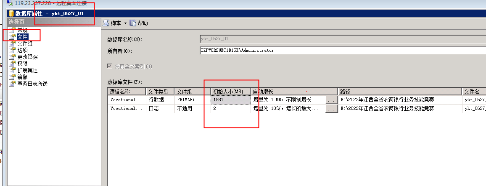
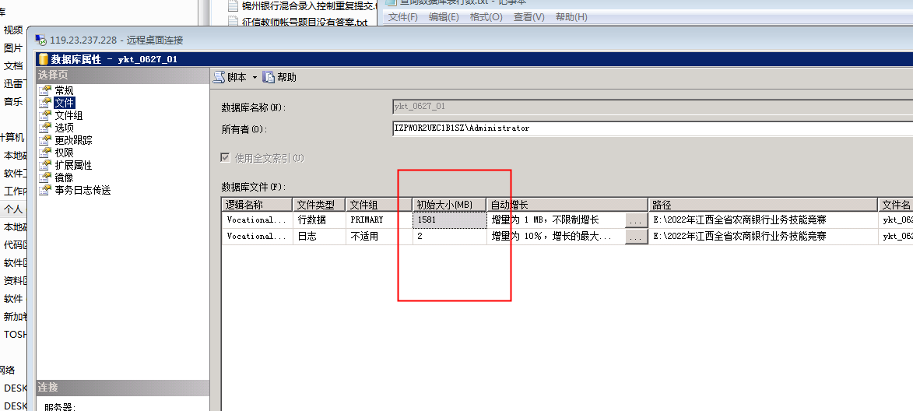

# 安装比赛平台数据查看以及清除

 安装比赛平台，查一下数据库每个表的数据行数，看看有没有数据量多的。  练习平台也一样   

```plsql
SELECT a.name, b.rows
FROM sysobjects AS a INNER JOIN sysindexes AS b ON a.id = b.id
WHERE (a.type = 'u') AND (b.indid IN (0, 1))
ORDER BY b.rows desc,a.name DESC
```






 清完数据后，直接所这两个值，都为0，确认就行  


> 更新: 2023-07-19 12:47:03  
> 原文: <https://www.yuque.com/lixinsi/hntyk2/dglixk99ybhmz9es>