# 客户经理-个人压力测手册

**在压力测之前需要先检查：**

①鼠标、键盘、excel、wrod文档正常使用  
②桌面快捷访问系统是谷歌浏览器

  
**压力测开始（进入系统后）：**③做题不能复制粘贴

**如有问题请举手示意老师**

1、在电脑上打开谷歌浏览器，登录平台网址 ，点击‘金融综合技能业务岗位操作’[在弹出的登录框中点击‘](http://qgdly.occupationedu.com/)[客户经理](http://qgdly.occupationedu.com/)[’，](http://qgdly.occupationedu.com/) 输入账号和密码，点击登录进入操作界面。

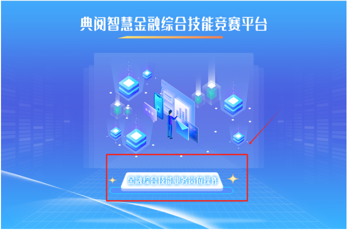

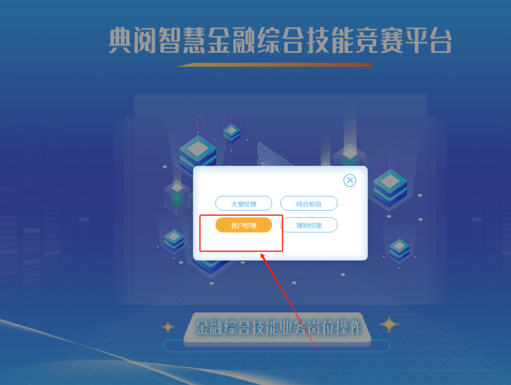

2、点击‘个人信贷’

3、鼠标双击比赛试卷

**4、信息公告**

点击小锁开启‘信息公告’，信息公告内容涉及一整套题目的操作，请仔细阅读。

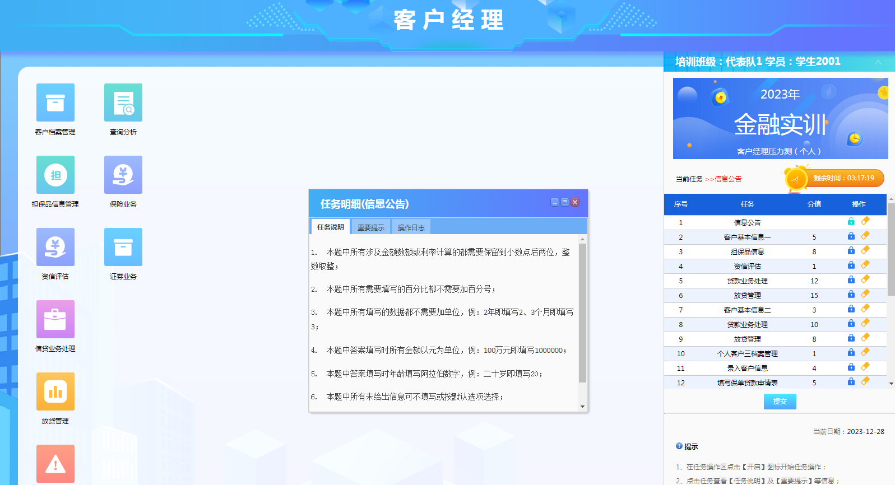

**5、客户基本信息一**

点击小锁开启‘客户基本信息一’,根据任务说明点击“ 客户档案管理”→“ 个人客户 ”→“ 新增 ”（根据题目描述填写相关信息），再点击“ 锁定客户 ”，进入对应业务操作页面，并依据任务说明及重要提示信息填写页面信息，根据任务说明填写表单

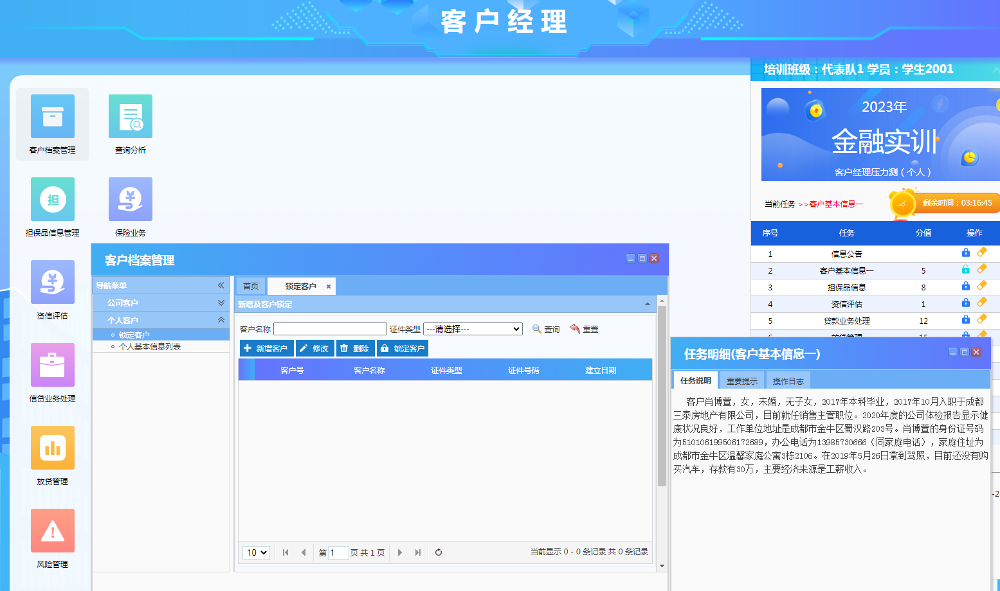

1. **担保品信息录入**

点击小锁开启‘担保品信息录入’,根据任务说明点击“ 担保品信息管理”→“ 抵质押品信息录入 ”→“ 商业汇票列表 ”→“ 新增 ”，进入对应业务操作页面，并依据任务说明及重要提示信息填写页面信息，根据任务说明填写表单

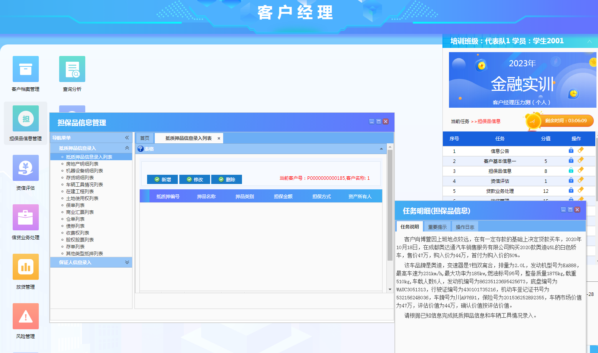

**7、资信评估**

点击小锁开启‘资信评估’,根据任务说明点击“ 资信评估”→“ 资信评估 ”→“ 个人信用等级评定表列表 ”→“ 新增 ”，进入对应业务操作页面，并依据任务说明及重要提示信息填写页面信息，根据任务说明填写表单

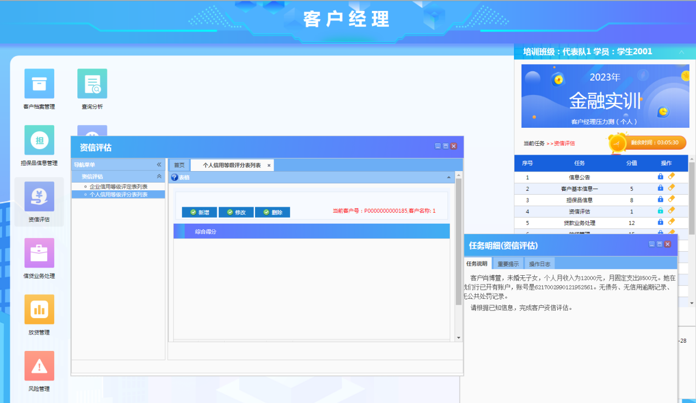

**8、贷款业务处理**

点击小锁开启‘贷款业务处理’,根据任务说明点击“ 信贷业务处理”→“ 业务申请 ”→“ 个人汽车消费贷款业务 ”→“ 新增 ”，进入对应业务操作页面，并依据任务说明及重要提示信息填写页面信息，根据任务说明填写表单

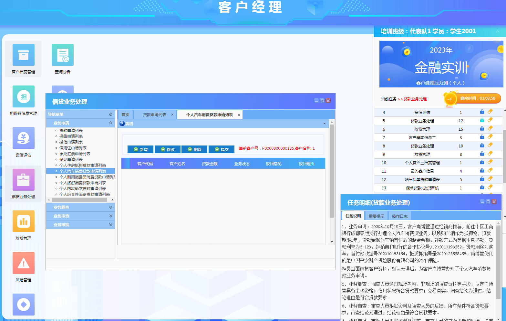

**9、放贷管理**

点击小锁开启‘放贷管理’,根据任务说明点击“ 放贷管理”→“ 放贷管理 ”→“ 合同登记 ”，进入对应业务操作页面，并依据任务说明及重要提示信息填写页面信息，根据任务说明填写表单

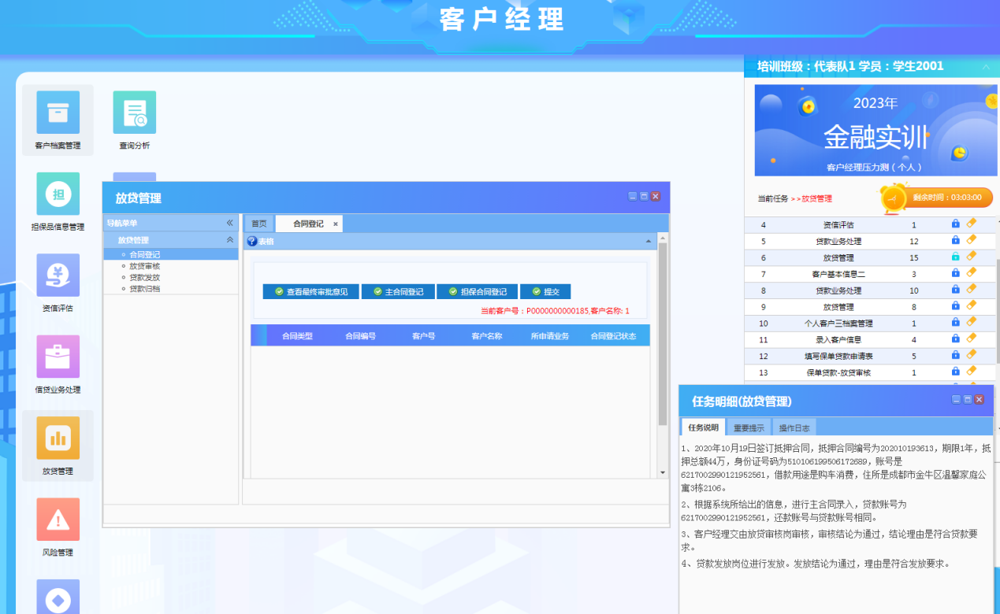

**10、客户基本信息二**

点击小锁开启‘客户基本信息二’,根据任务说明点击“ 客户档案管理”→“ 个人客户 ”→“ 新增 ”（根据题目描述填写相关信息），再点击“ 锁定客户 ”，进入对应业务操作页面，并依据任务说明及重要提示信息填写页面信息，根据任务说明填写表单

**11、贷款业务处理**

点击小锁开启‘贷款业务处理’,根据任务说明点击“ 信贷业务处理”→“ 业务申请 ”→“ 个人国家助学贷款申请列表 ”→‘业务调查’→“ 新增” →‘业务审查’→‘业务审批’，进入对应业务操作页面，并依据任务说明及重要提示信息填写页面信息，根据任务说明填写表单

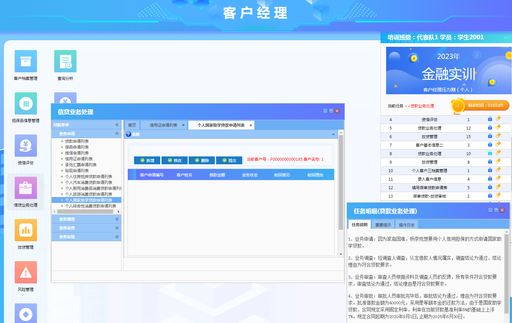

**12、放贷管理**

点击小锁开启‘放贷管理’,根据任务说明点击“ 放贷管理”→“ 放贷管理 ”→“ 合同登记 ”→“ 放贷审核 ”→“ 放贷发放 ”，进入对应业务操作页面，并依据任务说明及重要提示信息填写页面信息，根据任务说明填写表单

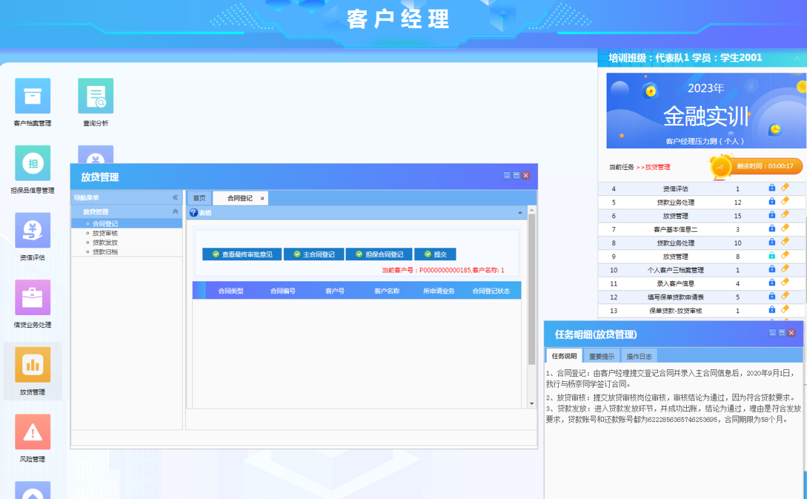

**13、个人客户三档案管理**

点击小锁开启‘个人客户三档案管理’,根据任务说明点击“ 客户档案管理”→“ 个人客户 ”→“ 新增”（根据题目描述填写相关信息），再点击“ 锁定客户 ”，进入对应业务操作页面，并依据任务说明及重要提示信息填写页面信息，根据任务说明填写表单

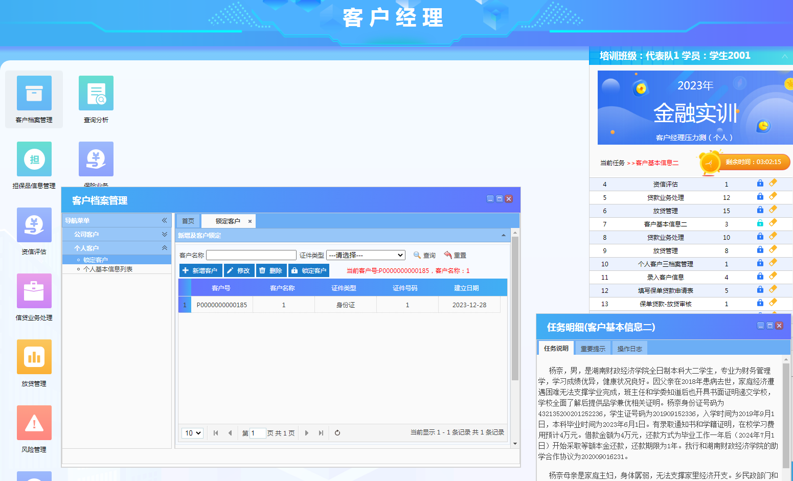

1. **录入客户信息**

点击小锁开启‘录入客户信息’,根据任务说明点击“保险业务”→“ 保单贷款 ”→“ 客户信息 ”→“ 新增”，进入对应业务操作页面，并依据任务说明及重要提示信息填写页面信息，根据任务说明填写表单

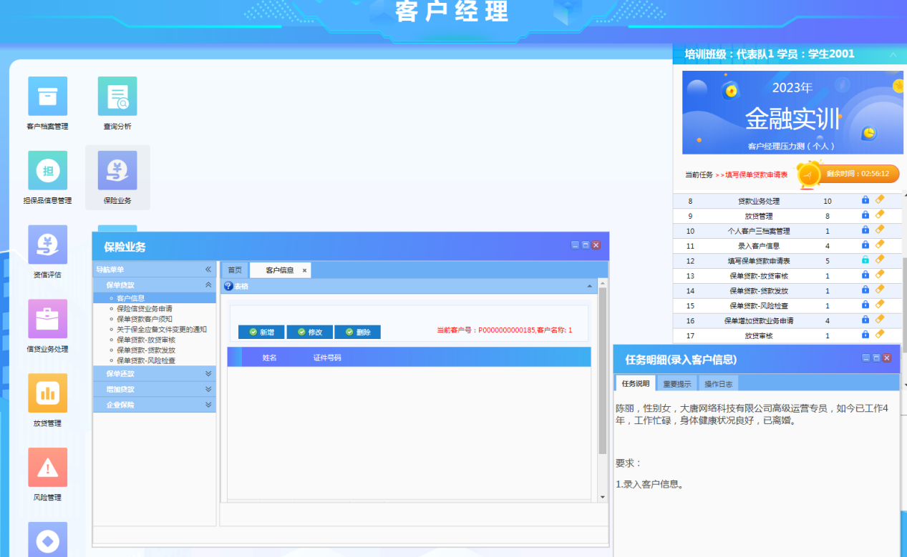

**15、填写保单贷款申请表**

点击小锁开启‘填写保单贷款申请表’,根据任务说明点击“保险业务”→“ 保单贷款 ”→“ 保险信贷业务申请 ”→“ 新增”，进入对应业务操作页面，并依据任务说明及重要提示信息填写页面信息，根据任务说明填写表单

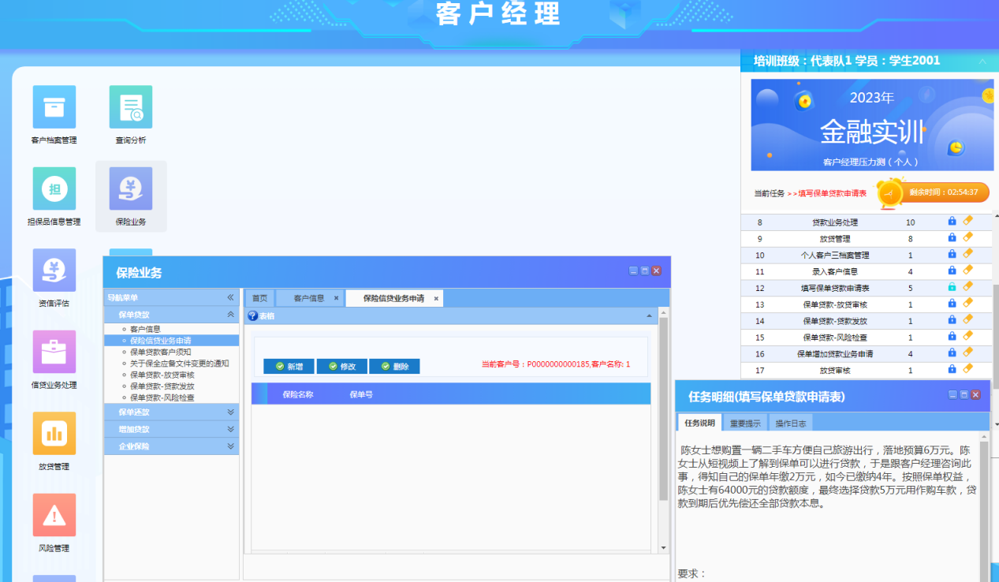

**16、保单贷款-放款审核**

点击小锁开启‘保单贷款-放款审核’,根据任务说明点击“保险业务”→“ 保单贷款 ”→“ 保单贷款-放款审核 ”→“新增”，进入对应业务操作页面，并依据任务说明及重要提示信息填写页面信息，根据任务说明填写表单

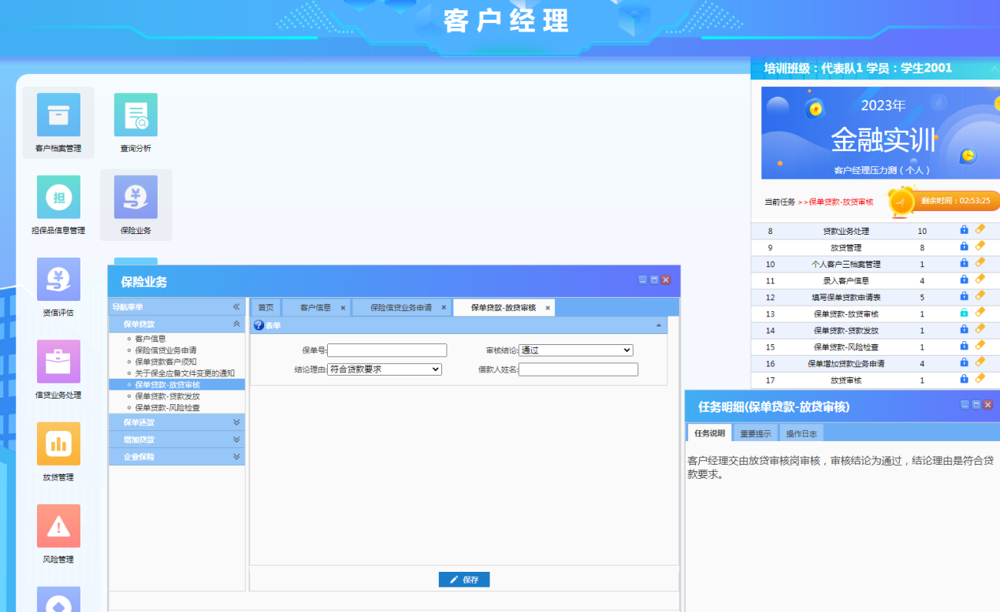

**17、保单贷款-贷款发放**

点击小锁开启‘保单贷款-贷款发放’,根据任务说明点击“保险业务”→“ 保单贷款 ”→“ 保单贷款-贷款发放 ”，进入对应业务操作页面，并依据任务说明及重要提示信息填写页面信息，根据任务说明填写表单

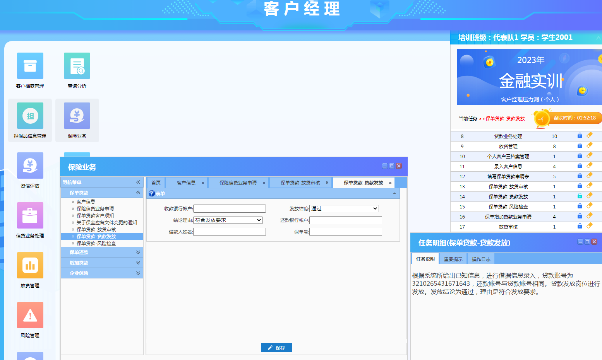

**18、保单贷款-风险检查**

点击小锁开启‘保单贷款-风险检查’,根据任务说明点击“保险业务”→“ 保单贷款 ”→“ 保单贷款-风险检查 ”，进入对应业务操作页面，并依据任务说明及重要提示信息填写页面信息，根据任务说明填写表单

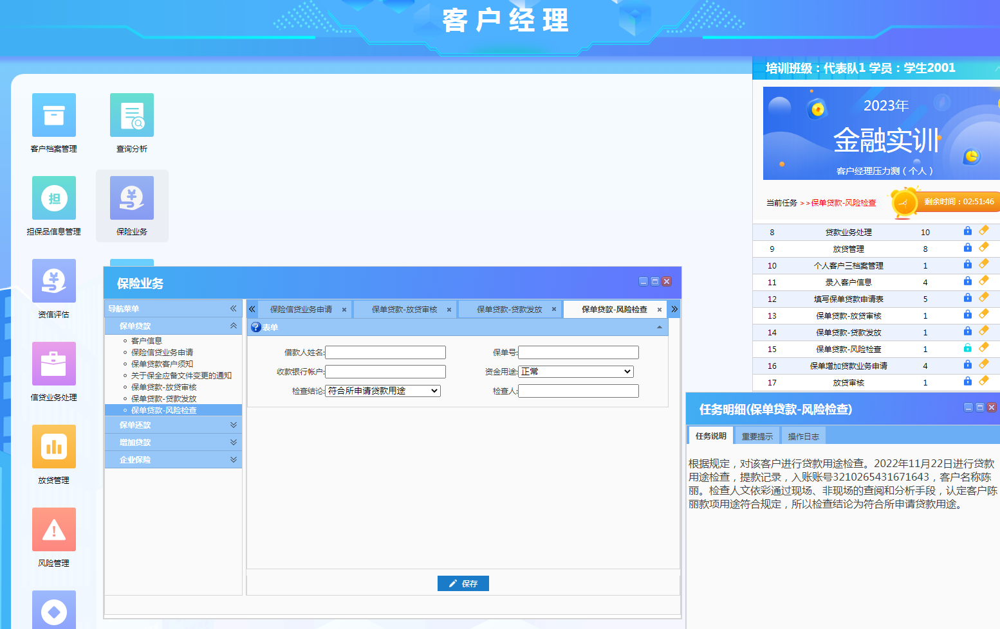

**19、保单增加贷款业务申请**

点击小锁开启‘保单增加贷款业务申请’,根据任务说明点击“保险业务”→“ 增加贷款 ”→“ 保单增加贷款 ”→“新增”，进入对应业务操作页面，并依据任务说明及重要提示信息填写页面信息，根据任务说明填写表单

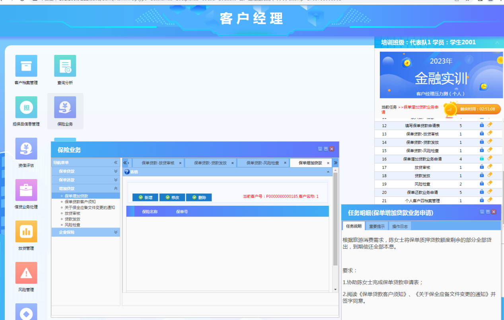

**20、放贷审核**

点击小锁开启‘放贷审核’,根据任务说明点击“保险业务”→“ 增加贷款 ”→“ 放贷审核 ”，进入对应业务操作页面，并依据任务说明及重要提示信息填写页面信息，根据任务说明填写表单

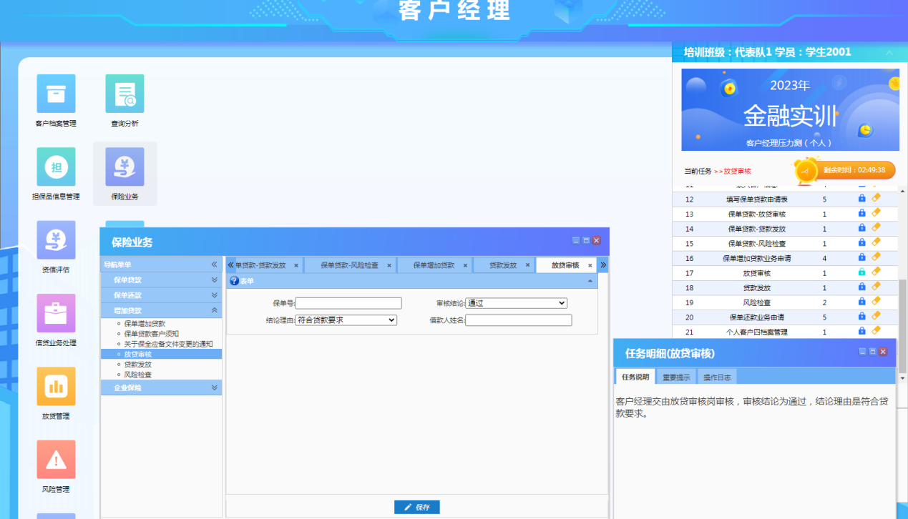

**21、贷款发放**

点击小锁开启‘贷款发放’,根据任务说明点击“保险业务”→“ 增加贷款 ”→“ 贷款发放 ”，进入对应业务操作页面，并依据任务说明及重要提示信息填写页面信息，根据任务说明填写表单

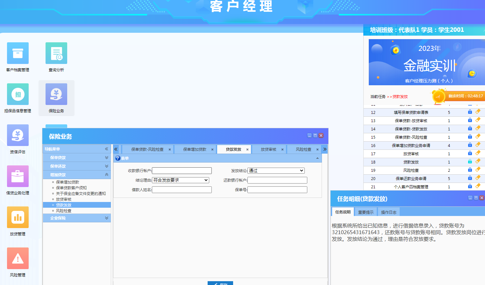

**22、风险检查**

点击小锁开启‘风险检查’,根据任务说明点击“保险业务”→“ 增加贷款 ”→“ 风险检查”，进入对应业务操作页面，并依据任务说明及重要提示信息填写页面信息，根据任务说明填写表单

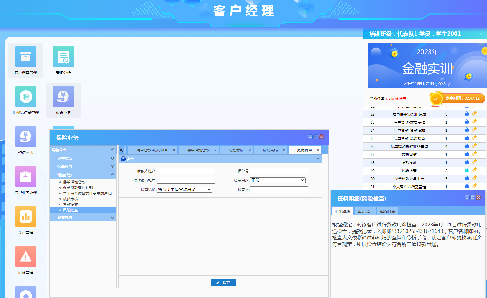

**23、保单还款业务申请**

点击小锁开启‘保单还款业务申请’,根据任务说明点击“保险业务”→“ 保单还款 ”→“ 保单还款”→“新增”，进入对应业务操作页面，并依据任务说明及重要提示信息填写页面信息，根据任务说明填写表单

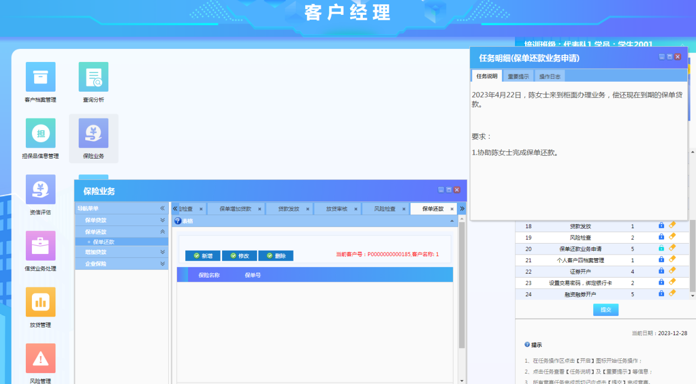

**24、个人客户四档案管理**

点击小锁开启‘个人客户四档案管理’,根据任务说明点击“ 客户档案管理”→“ 个人客户 ”→“新增”（根据题目描述填写相关信息），再点击“ 锁定客户 ”，进入对应业务操作页面，并依据任务说明及重要提示信息填写页面信息，根据任务说明填写表单

**25、证券开户**

点击小锁开启‘证券开户’,根据任务说明点击“证券业务”→“ 证券开户业务 ”→“ 填写开户信息”→“新增”，进入对应业务操作页面，并依据任务说明及重要提示信息填写页面信息，根据任务说明填写表单

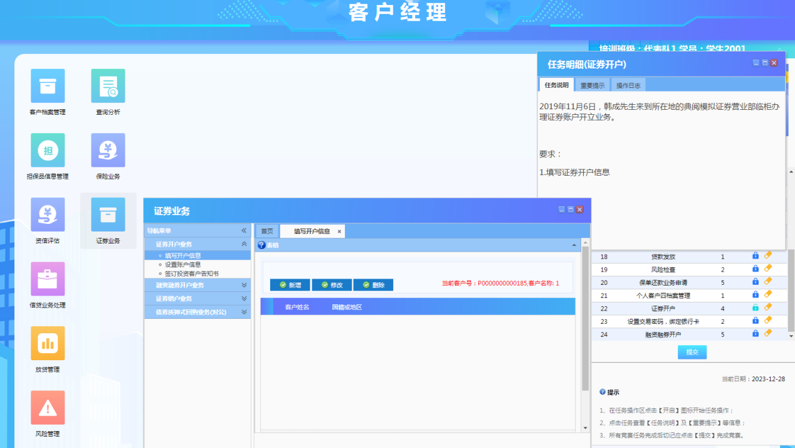

**26、设置交易密码，绑定银行卡**

点击小锁开启‘设置交易密码，绑定银行卡’,根据任务说明点击“证券业务”→“ 证券开户业务 ”→“ 设置账号信息”，进入对应业务操作页面，并依据任务说明及重要提示信息填写页面信息，根据任务说明填写表单

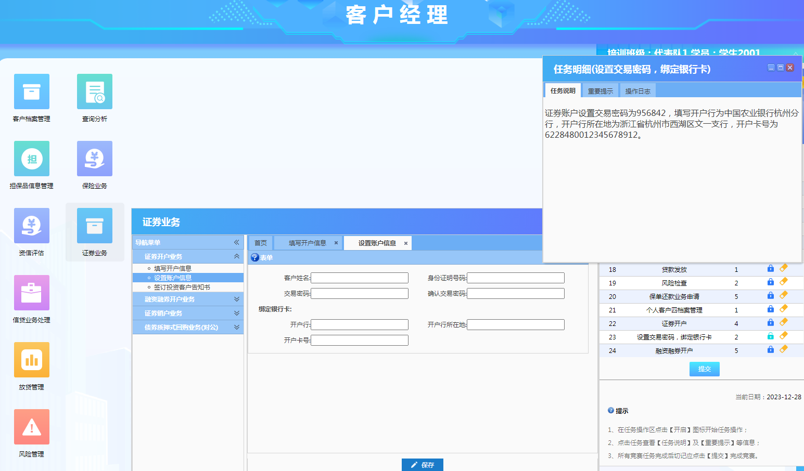

1. **融资融券开户**

点击小锁开启‘融资融券开户’,根据任务说明点击“证券业务”→“ 融资融券开户业务 ”→“ 办理融资融券开户业务”，进入对应业务操作页面，并依据任务说明及重要提示信息填写页面信息，根据任务说明填写表单

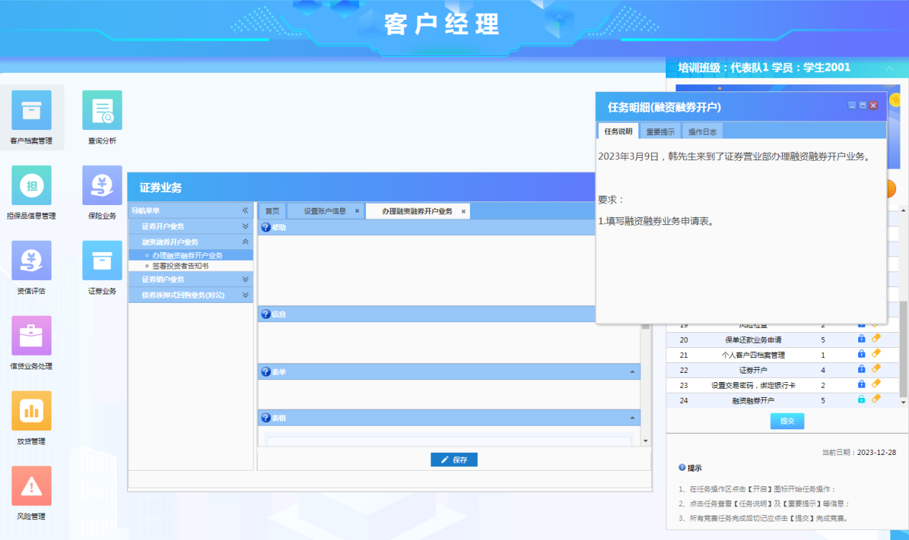

**28、提交**

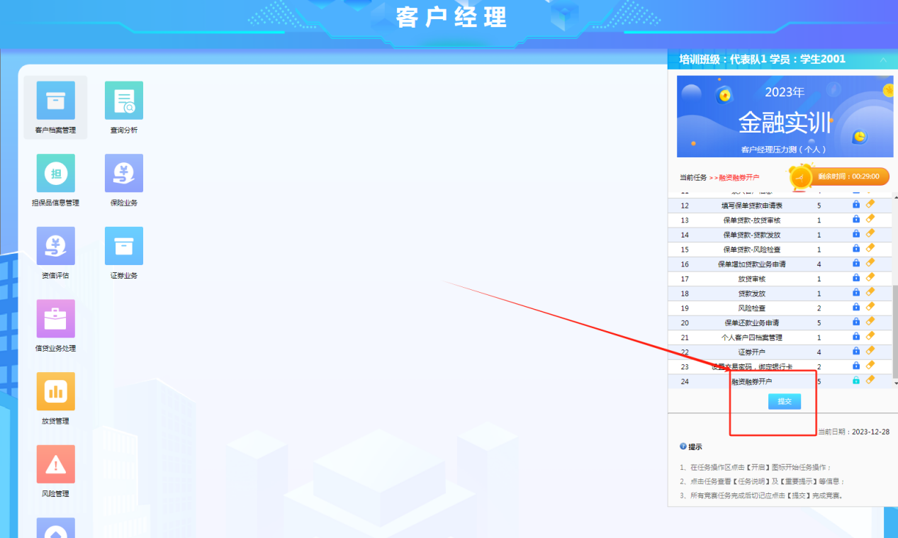

> 更新: 2025-11-26 23:07:45  
> 原文: <https://www.yuque.com/lixinsi/hntyk2/wz1g7rrouwuzf1z1>