# 客户经理-对公压力测手册 

**在压力测之前需要先检查：**

①鼠标、键盘、excel、wrod文档正常使用  
②桌面快捷访问系统是谷歌浏览器

  
**压力测开始（进入系统后）：**③做题不能复制粘贴

**如有问题请举手示意老师**

1、在电脑上打开谷歌浏览器，登录平台网址 ，点击‘金融综合技能业务岗位操作’[在弹出的登录框中点击‘](http://qgdly.occupationedu.com/)[客户经理](http://qgdly.occupationedu.com/)[’，](http://qgdly.occupationedu.com/) 输入账号和密码，点击登录进入操作界面。

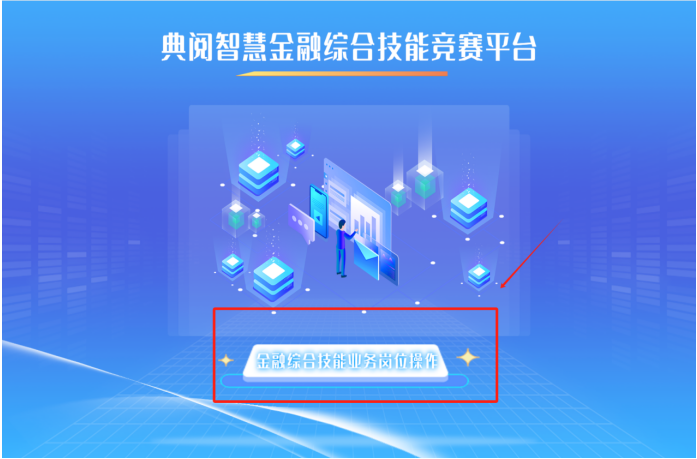

2、点击‘公司信贷’

3、鼠标双击比赛试卷

**4、信息公告**

点击小锁开启‘信息公告’，信息公告内容涉及一整套题目的操作，请仔细阅读。

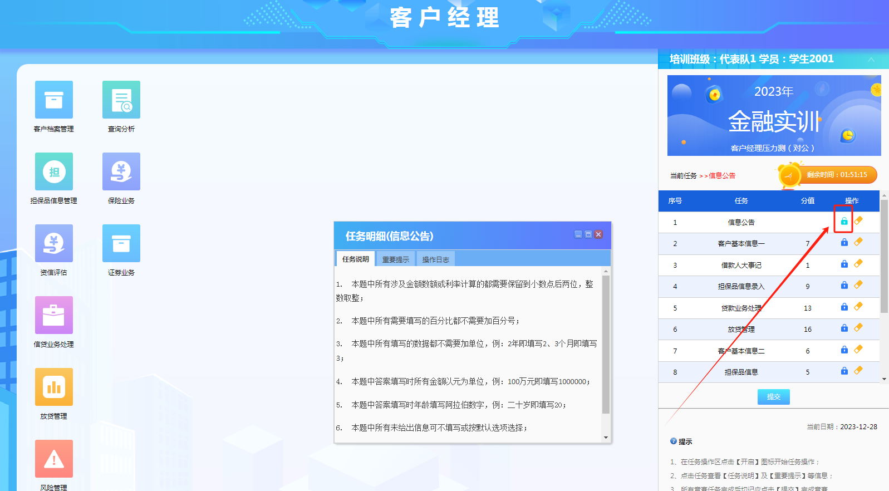

**5、客户基本信息一**

点击小锁开启‘客户基本信息一’,根据任务说明点击“ 客户档案管理”→“ 公司客户 ”→“ 新增 ”（根据题目填写相关信息），再点击“ 锁定客户 ”，进入对应业务操作页面，并依据任务说明及重要提示信息填写页面信息，根据任务说明填写表单

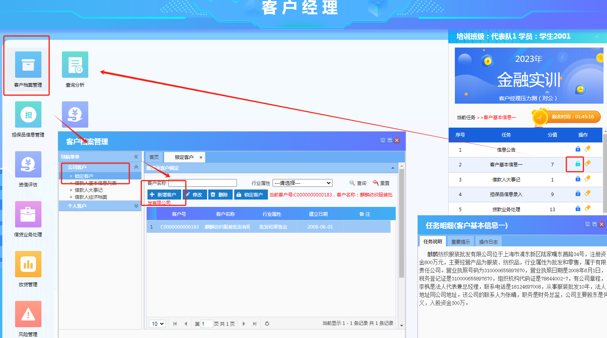

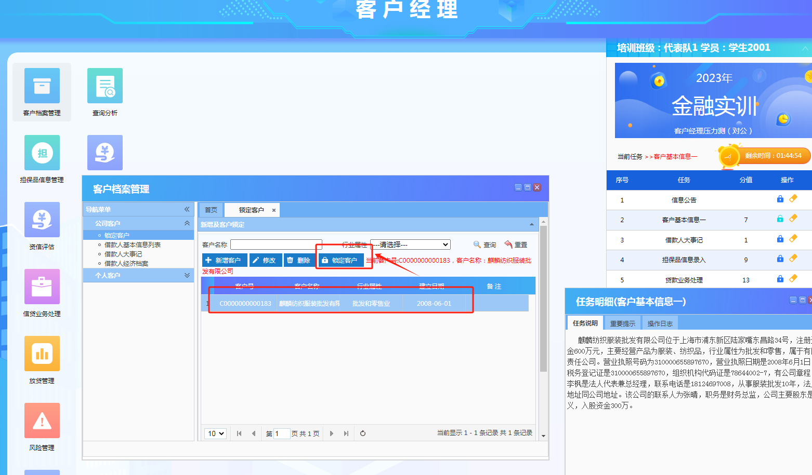

1. **借款人大事记**

点击小锁开启‘借款人大事记’,根据任务说明点击“ 客户档案管理”→“ 公司客户 ”→“ 借款人大事记 ”→“ 新增 ”，进入对应业务操作页面，并依据任务说明及重要提示信息填写页面信息，根据任务说明填写表单

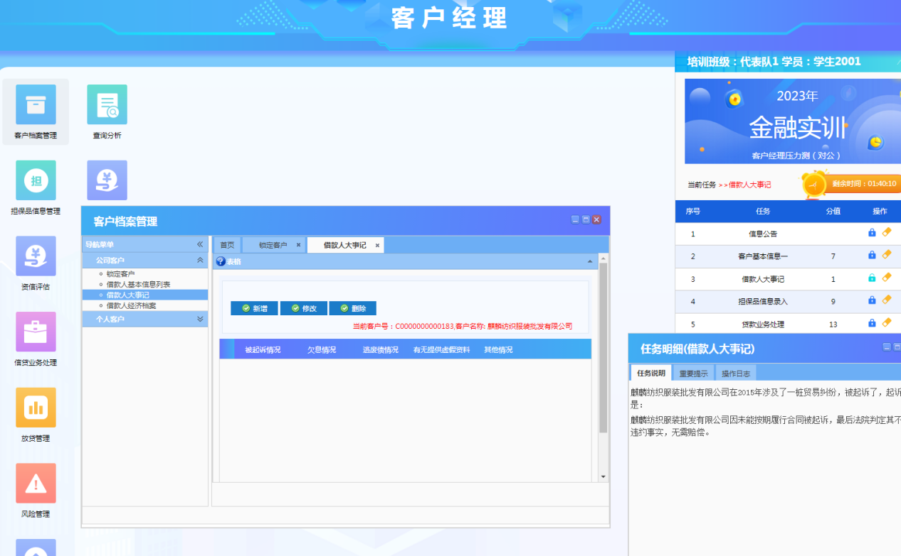

1. **担保品信息录入**

点击小锁开启‘担保品信息录入’,根据任务说明点击“ 担保品信息管理”→“ 抵质押品信息录入 ”→“ 商业汇票列表 ”→“ 新增 ”，进入对应业务操作页面，并依据任务说明及重要提示信息填写页面信息，根据任务说明填写表单

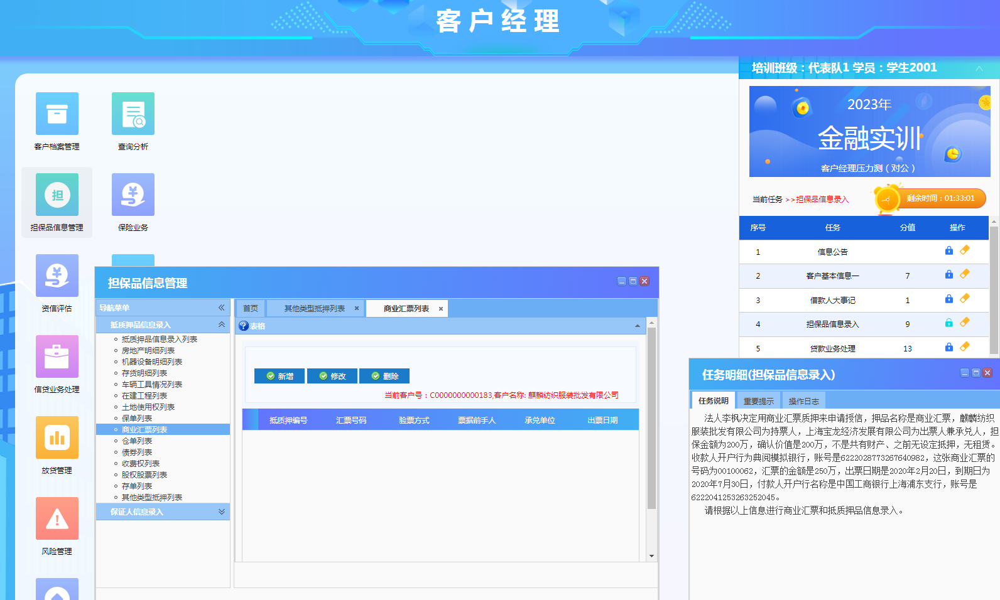

**8、贷款业务处理**

点击小锁开启‘贷款业务处理’,根据任务说明点击“ 信贷业务处理”→“ 业务申请 ”→“ 贷款申请列表 ”→“ 新增 ”，进入对应业务操作页面，并依据任务说明及重要提示信息填写页面信息，根据任务说明填写表单

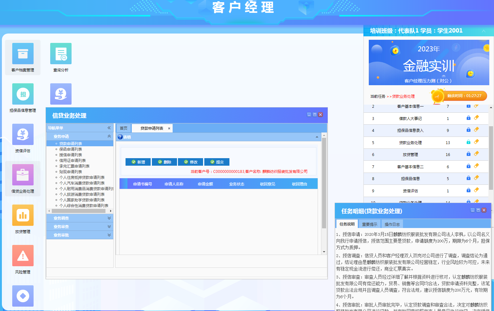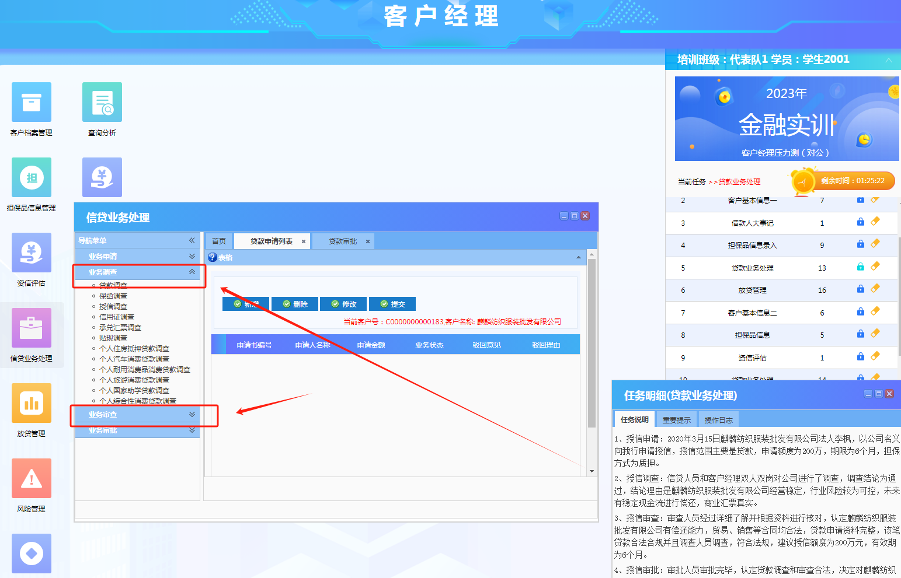

**9、放贷管理**

点击小锁开启‘放贷管理’,根据任务说明点击“ 放贷管理”→“ 放贷管理 ”→“ 合同登记 ”，进入对应业务操作页面，并依据任务说明及重要提示信息填写页面信息，根据任务说明填写表单

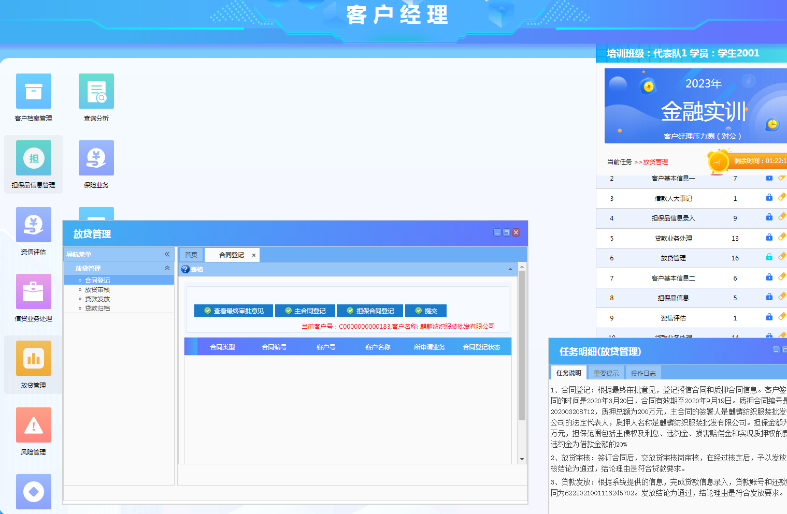

**10、客户基本信息二**

点击小锁开启‘客户基本信息二’,根据任务说明点击“ 客户档案管理”→“ 公司客户 ”→“ 新增 ”（根据题目描述填写相关信息），再点击“ 锁定客户 ”，进入对应业务操作页面，并依据任务说明及重要提示信息填写页面信息，根据任务说明填写表单

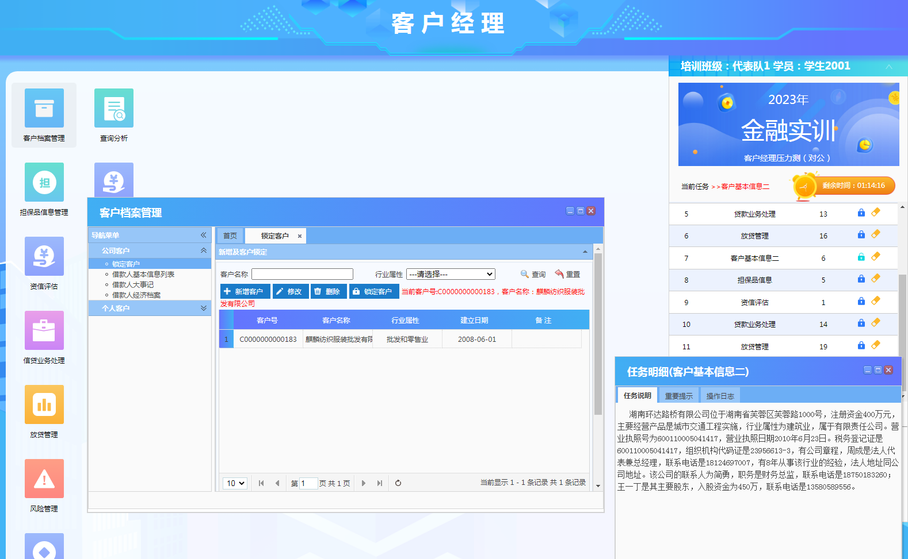

1. **担保品信息**

点击小锁开启‘担保品信息’,根据任务说明点击“ 担保品信息管理”→“ 保证人信息录入 ”→“ 对公保证人信息录入 ”→“ 新增 ”，进入对应业务操作页面，并依据任务说明及重要提示信息填写页面信息，根据任务说明填写表单

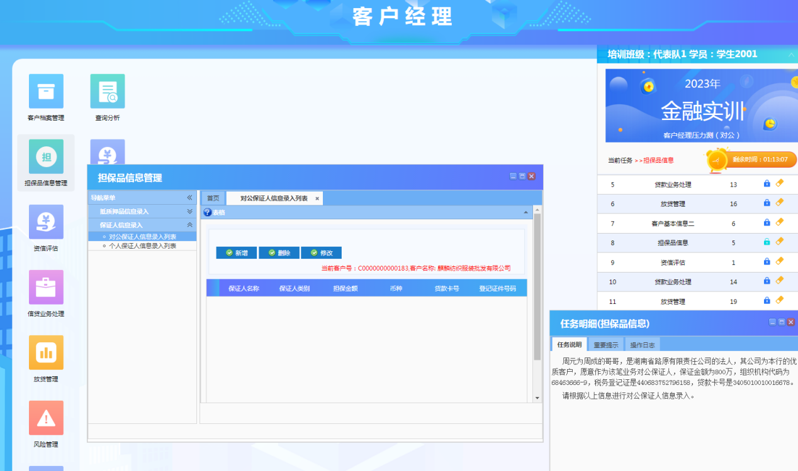

1. **资信评估**

点击小锁开启‘资信评估’,根据任务说明点击“ 资信评估”→“ 资信评估 ”→“ 企业信用等级评定表列表 ”→“ 新增 ”，进入对应业务操作页面，并依据任务说明及重要提示信息填写页面信息，根据任务说明填写表单

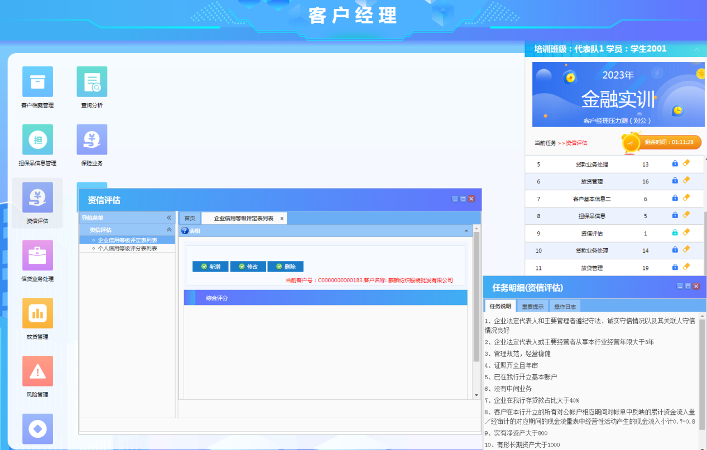

**13、贷款业务处理**

点击小锁开启‘贷款业务处理’,根据任务说明点击“ 信贷业务处理”→“ 业务申请 ”→“ 贷款申请列表 ”→‘业务调查’→‘业务审查’→‘业务审批’，进入对应业务操作页面，并依据任务说明及重要提示信息填写页面信息，根据任务说明填写表单

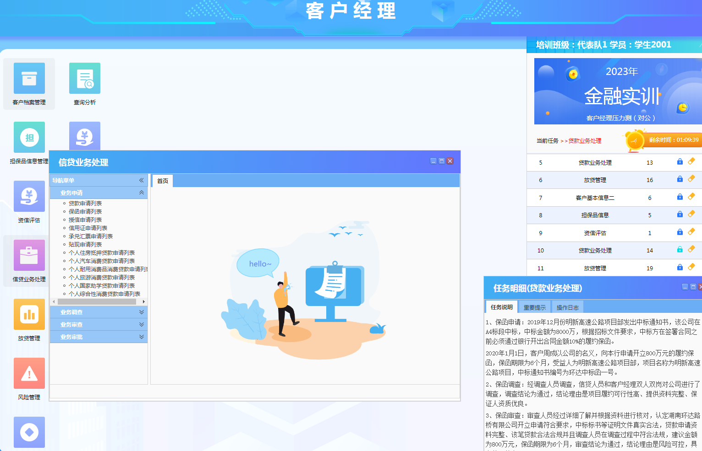

**14、放贷管理**

点击小锁开启‘放贷管理’,根据任务说明点击“ 放贷管理”→“ 放贷管理 ”→“ 合同登记 ”→“ 放贷审核 ”→“ 放贷发放 ”，进入对应业务操作页面，并依据任务说明及重要提示信息填写页面信息，根据任务说明填写表单

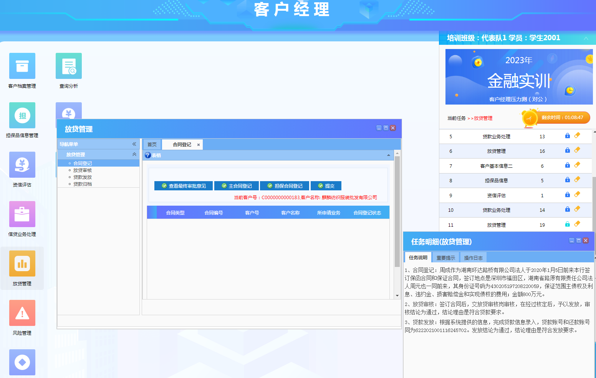

**15、客户基本信息三**

点击小锁开启‘客户基本信息三’,根据任务说明点击“ 客户档案管理”→“ 公司客户 ”→“ 新增 ”（根据题目描述填写相关信息），再点击“ 锁定客户 ”，进入对应业务操作页面，并依据任务说明及重要提示信息填写页面信息，根据任务说明填写表单

**16、填写债券质押式回购成交申请表**

点击小锁开启‘填写债券质押式回购成交申请表’,根据任务说明点击“ 证券业务”→“ 债券质押式回购业务（对公） ”→“ 填写债券质押式回购成交申请表 ”→“ 新增 ”，进入对应业务操作页面，并依据任务说明及重要提示信息填写页面信息，根据任务说明填写表单

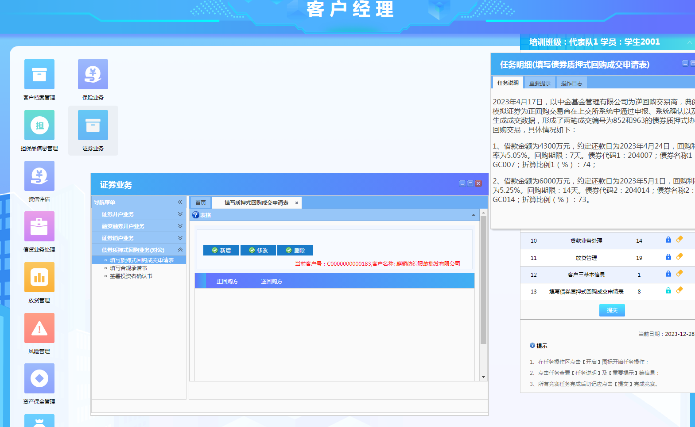**17、提交**

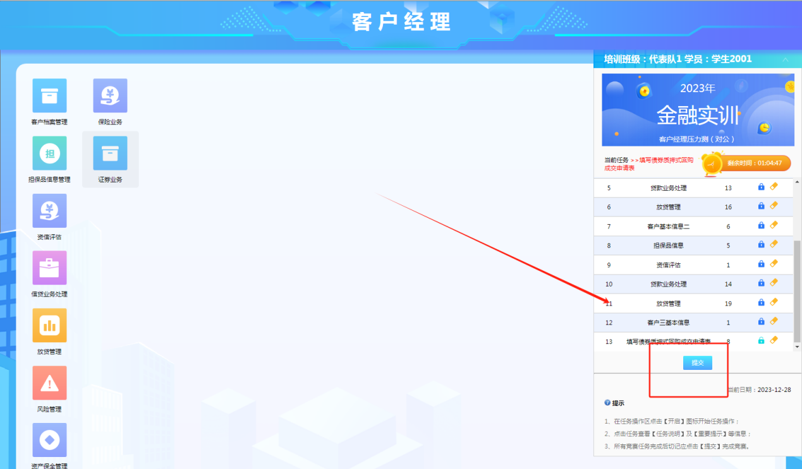

> 更新: 2025-11-26 23:07:48  
> 原文: <https://www.yuque.com/lixinsi/hntyk2/exufo07he6ermogh>