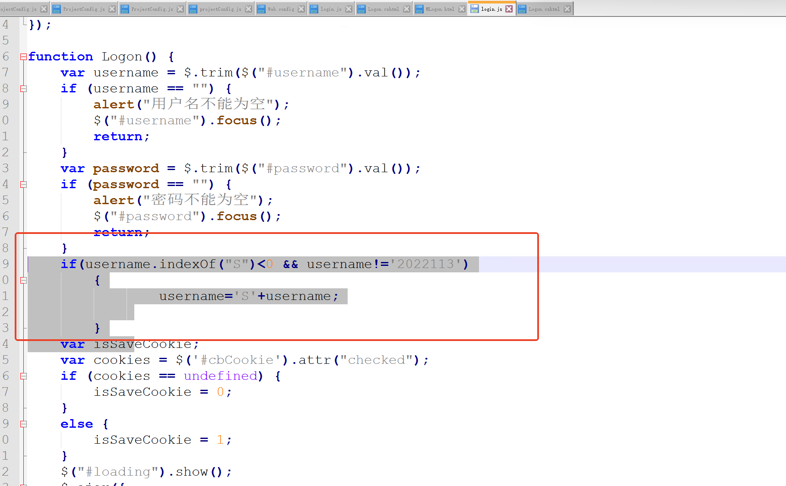
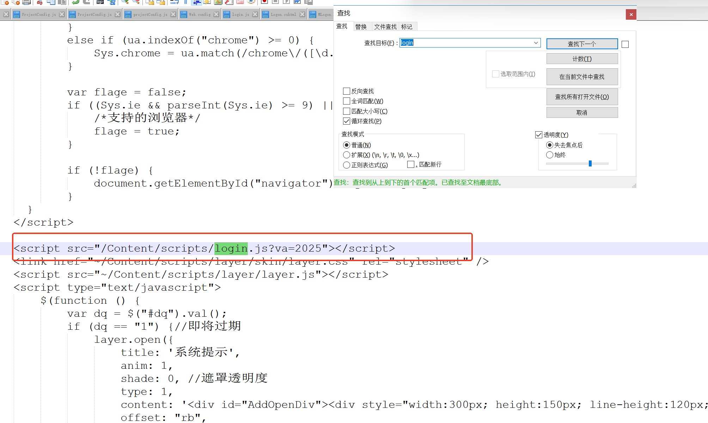

# 客户经理理财经理处理s+s

```sql
UPDATE  [jxsllcjl].[dbo].[bi_BankTeller]  SET [Teller_No]='S' +[Teller_No] where  substring([Teller_No],0,2) <>'S'
```

```sql
/****** SSMS 的 SelectTopNRows 命令的脚本  ******/
SELECT TOP (1000) [Id],substring([Teller_No],0,2)
      ,[BankSite_Id]
      ,[Teller_No]
      ,[Student_No]
      ,[Teller_Name]
      ,[Password]
      ,[Telephone]
      ,[QQ]
      ,[Team_Id]
      ,[Teller_Status]
      ,[AddTime]
      ,[LastLoginTime]
      ,[CalculateDate]
      ,[NetUserNo]
  FROM [jxsllcjl].[dbo].[bi_BankTeller]  --SET [Teller_No]='S' +[Teller_No] where  substring([Teller_No],0,2) <>'S'
```

改 login.js

```sql
    if(username.indexOf("S")<0 && username!='2022113')
        {
                username='S'+username;
            
        }
```




更改 login.js 版本




> 更新: 2025-11-04 15:22:23  
> 原文: <https://www.yuque.com/lixinsi/hntyk2/ut5y5ebnc6xilfle>