# 客服系统操作手册汇总

目录

跨境电商语言与客户服务实训系统管理员端	1

第一章 系统概述	2

第二章 系统介绍	3

跨境电商语言与客户服务实训系统教师端	24

第一章 系统概述	25

第二章 系统介绍	26

跨境电商语言与客户服务实训系统学生端	35

第一章 系统概述	36

第二章 系统介绍	38

**跨境电商语言与客户服务 **

**实训系统**

**操作手册-管理端**

# 第一章 系统概述
## 1.1前言
跨境电商语言与客户服务实训系统V1.0---管理员端！使用本产品前，请务必仔细阅读该使用手册。此文档是为了帮助后台管理员更好的学习并掌握对平台的操作流程和使用方法。我们尽可能通过案例的设置，让学生在操作手册的帮助下完成每一个步骤的操作和所有分支功能的案例，并掌握每一步操作时是基于怎么样的目的和思考分析的结果。

本操作手册的所有版权属于湖南典阅教育科技有限公司，未经公司许可情况下，任何人不得为其他任何目的使用、复制或传播该手册的内容。

## 1.2可能出现的情况
在我们软件进步的过程中，我相信难免会有一些我们很难留意到的问题，在这里非常欢迎各位师生向我们反馈您在使用平台中遇见的错误或者是不能理解的情况。

# 第二章 系统介绍
| 登录平台 | 请使用老师提供的访问地址打开平台 |
| :--- | :--- |

## **2.1首页**
#### **2.1.1左侧菜单栏**
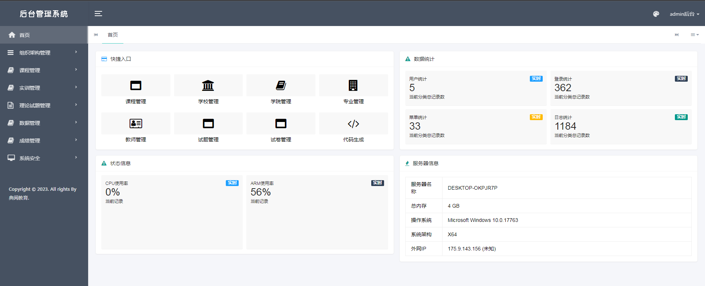

| 左侧菜单栏分别包括组织架构管理、课程管理、实训管理、理论试题管理、数据管理、成绩管理。 |
| :--- |

## **2.2组织架构管理**
#### 2.2.1系统配置
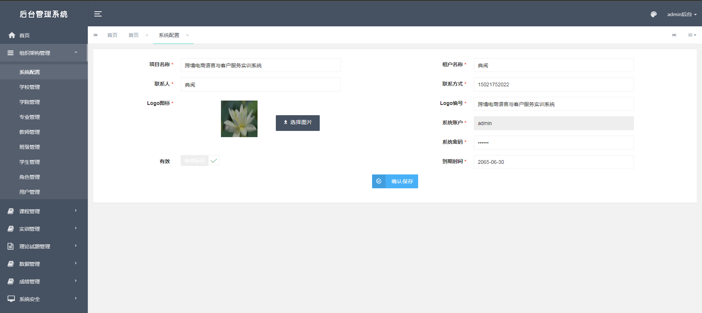

| 系统配置页面里可以修改登录页的项目名称、管理账号的密码、及平台的到期时间。 |
| :--- |

#### 2.2.2学校管理
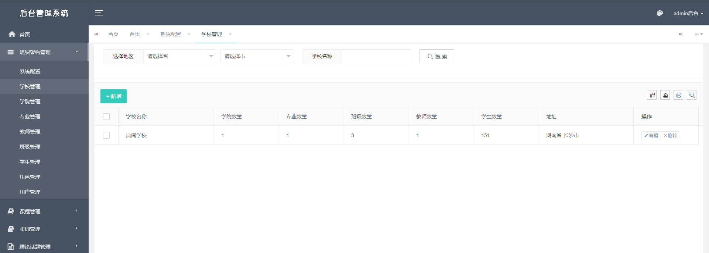

| 学校管理页面里可以选择城市和输入学校名称进行搜索，可以新增不同的学校、批量删除选中的学校，可以对已有的学校进行编辑和删除。 |
| :--- |

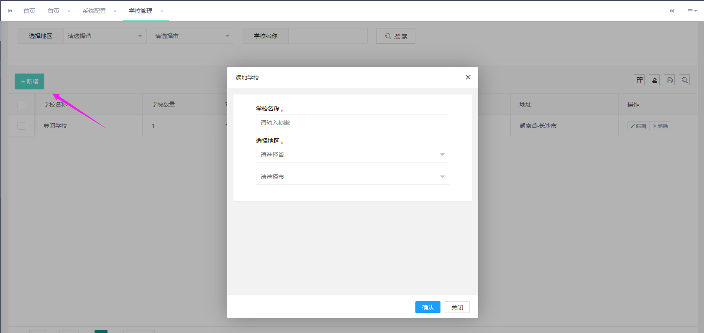

| 点击‘新增’，填写学校名称以及选择地区后点确认即可。 |
| :--- |

#### 2.2.3学院管理
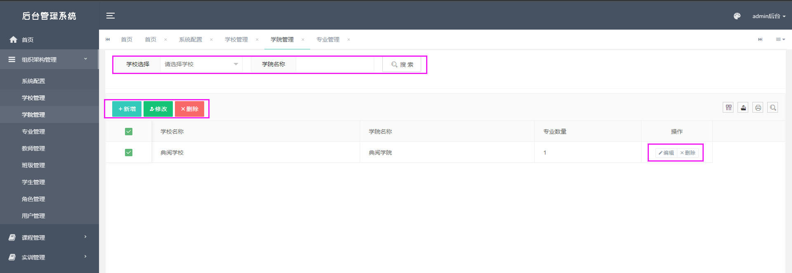

| 学院管理页面里可以选择学校和输入学院名称进行搜索，可以新增不同的学院、删除选中的学院，可以对已有的学院进行编辑和删除。 |
| :--- |

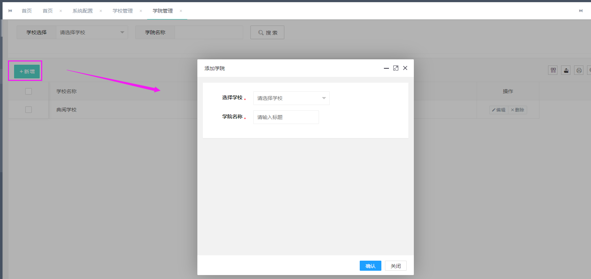

| 点击‘新增’，选择学校以及填写学院名称点确定即可。 |
| :--- |

#### 2.2.4专业管理
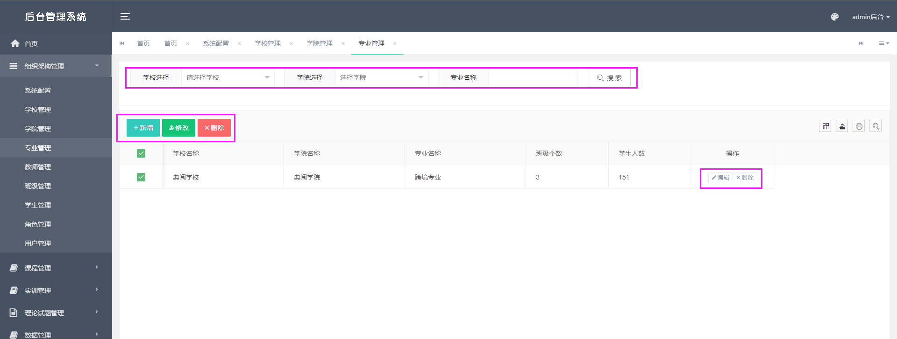

| 专业管理页面里可以选择学校、选择学院以及输入专业名称进行搜索，可以新增不同的专业、删除选中的专业，可以对已有的专业进行编辑和删除。 |
| :--- |

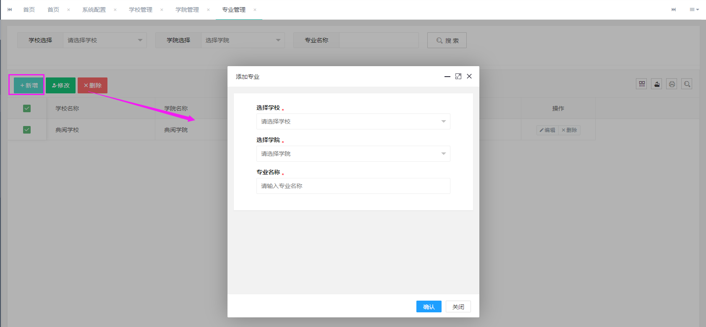

| 点击‘新增专业’，选择学校、学院以及填写专业名称后点确定即可。 |
| :--- |

#### 2.2.5教师管理
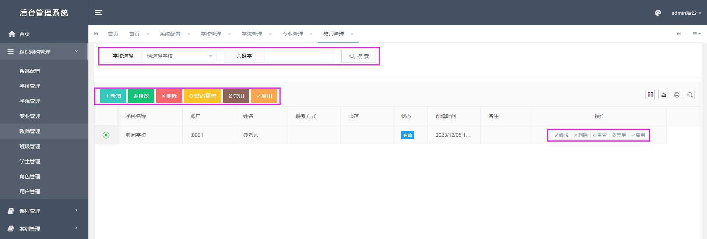

| 教师管理页面里可以选择学校和输入关键字搜索，可以添加新的教师，对已有的教师进行启用、禁用、重置密码及删除。 |
| :--- |

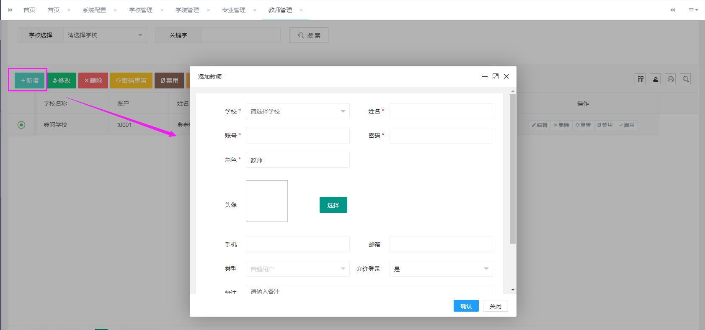

| 点击‘新增’，选择学校，填写名称、账号、密码、选择头像、填写手机、邮箱、选择类型点确定即可。 |
| :--- |

#### 2.2.6班级管理
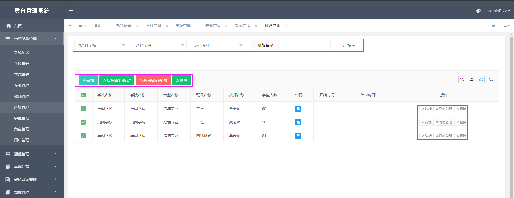

| 班级管理页面里可以选择学校、选择学院、选择专业以及输入班级名称进行搜索，可以新增不同的班级、删除选中的班级，可以对已有的班级进行编辑和删除以及学生管理、对班级进行限时管理、允许或禁用学生修改密码。 |
| :--- |

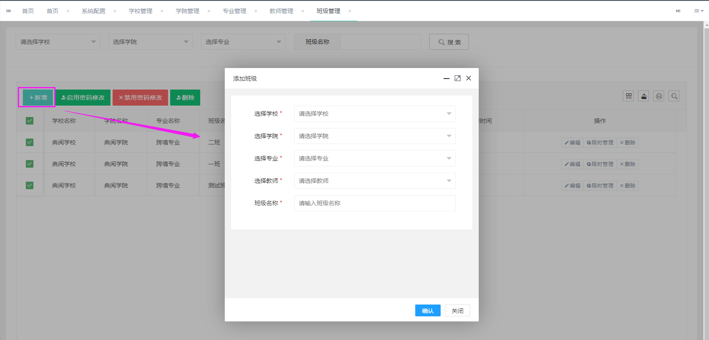

| 点击‘新增’，选择学校、学院、专业、教师以及填写班级名称后点确定即可。 |
| :--- |

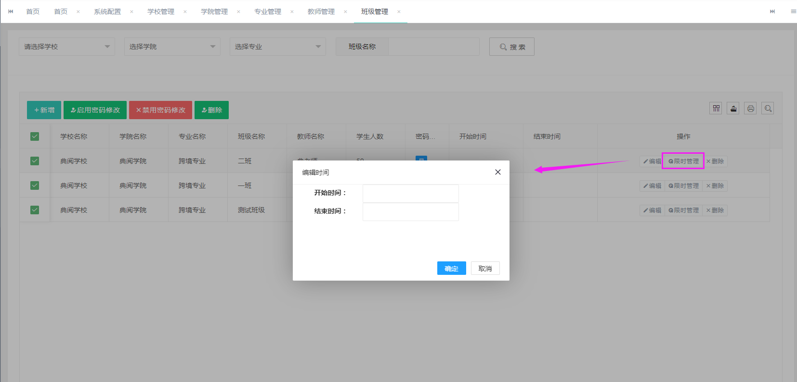

| 班级管理页面点击‘限时管理’，进入编辑时间页面，选择对应的时间点击确定，设置时间后，对应班级中的学生仅可在设置的时间内登陆操作。 |
| :--- |

#### 2.2.7学生管理
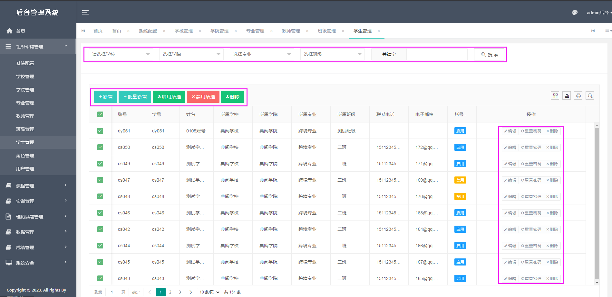

| 学生管理页面里可以选择学校、学院、专业、班级和输入关键字搜索，可以单个添加新的学生，也可以批量添加新的学生，对已有的学生进行启用和禁用以及删除和重置密码；可以对已有的学生进行修改以及批量修改。 |
| :--- |

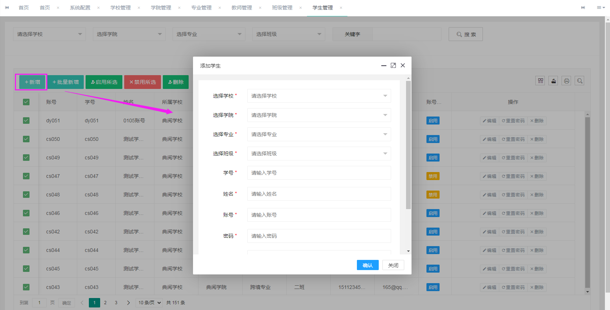

| 点击‘新增’，选择学校、学院、专业、班级，填写学生学号、姓名、账号、密码后点确定即可。 |
| :--- |

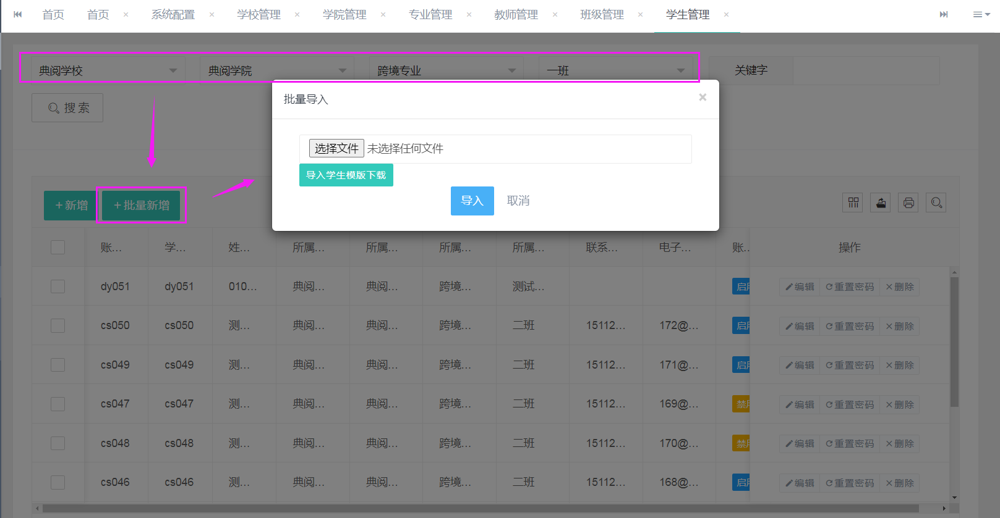

| 批量新增学生时需要先选择班级，选择学校、学院、专业、班级，点击‘批量新增’，点击选择文件，选择已按模板编辑好的学生信息表，点击导入。 |
| :--- |

#### 2.2.8角色管理
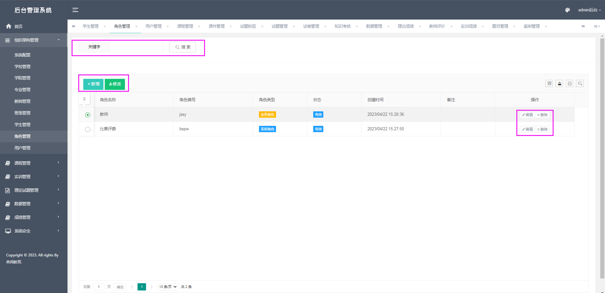

| 角色管理页面里可以对角色进行关键字搜索，可以添加新的角色信息，也可以对已有的角色进行修改。所有角色的功能菜单可在此配置及修改。 |
| :--- |

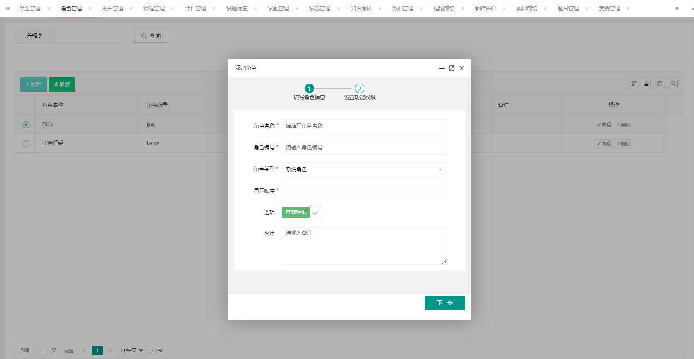

| 点击新增，在弹窗中输入角色名称、角色编号、角色类型、显示顺序、有效标识、填写上备注。 |
| :--- |

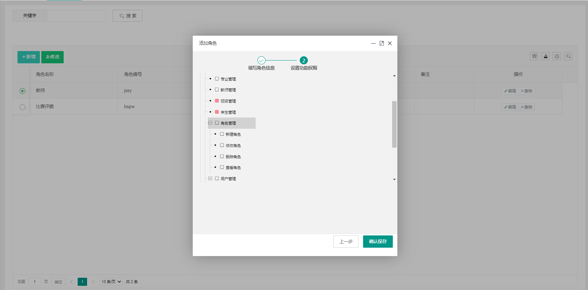

| 点击下一步，勾选该角色对应的权限，点击确认保存。 |
| :--- |

## **2.3课程资源**
#### 2.3.1课程管理
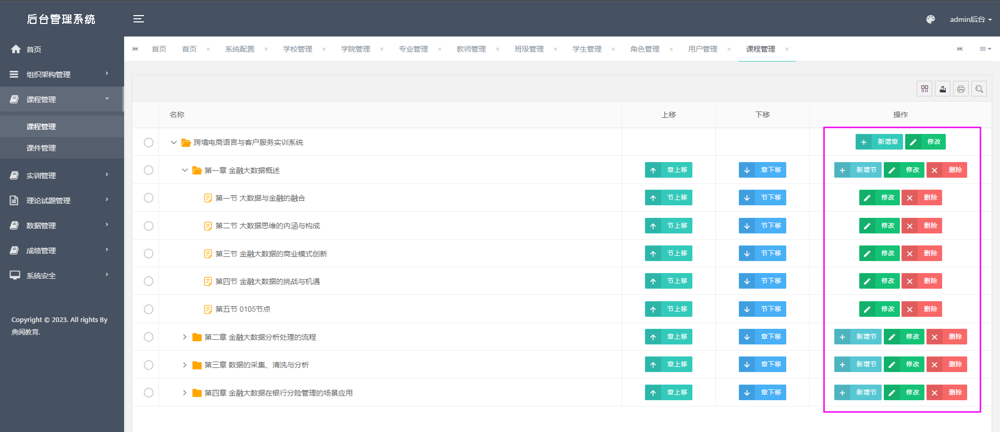

| 课程管理页可修改模块名；新增章、修改章、删除章；新增节、修改节、删除节；章或节上移及下移。 |
| :--- |

#### 2.3.2课件管理  
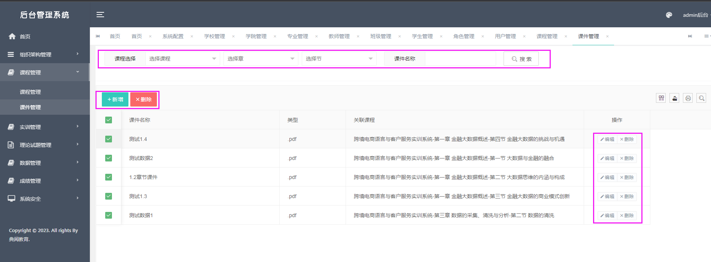

| 课件管理页可以通过课程名称、章、节或者课件名称进行搜索查询，可新增课件、删除所选课件以及编辑已有课件。 |
| :--- |

#### 2.3.2.1新增课件
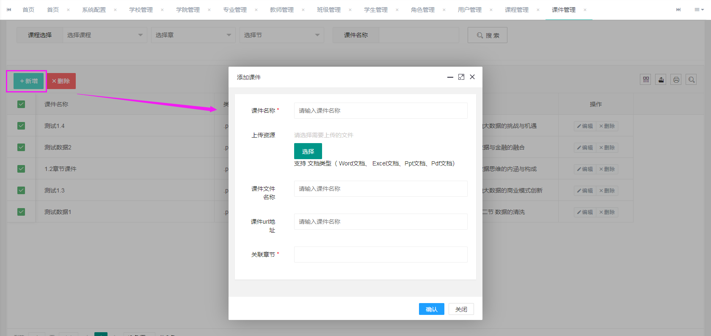

| 点击‘新增’，根据提示填写课件名称、上传资源、填写课件文件名称、课件url 地址、选择关联的章节课程，点保存即可新增课件成功。 |
| :--- |

#### 2.3.2.2编辑课件
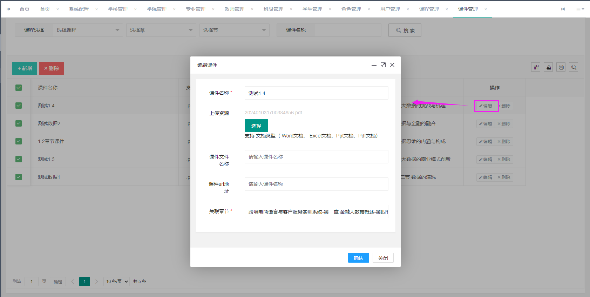

| 点击‘编辑’，根据提示把内容更改成自己需要的课件。 |
| :--- |

## 2.4 实训管理
### 2.4.1题目管理
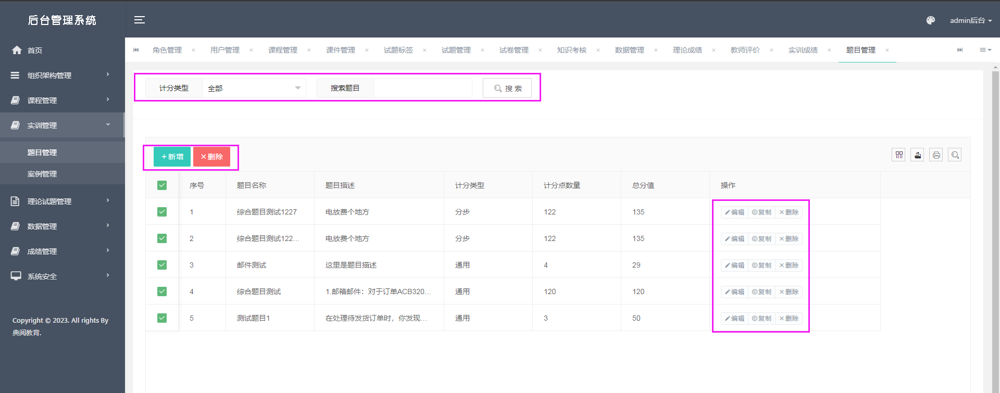

| 题目设置页面可以根据计分类型或题目名称来搜索，可以新增题目、删除题目；对已有的题目进行编辑、复制、删除。 |
| :--- |

| 点击新增，在添加题目页面输入题目名称、选择计分类型、输入题目描述；点击添加得分点，通过选择模块、得分类型、得分点位、及得分关键字、和每个得分点的分值，来设置题目的得分点。所有得分点填写完成后，点击右下角的“确认”按钮。 |
| :--- |

### 2.4.2案例管理
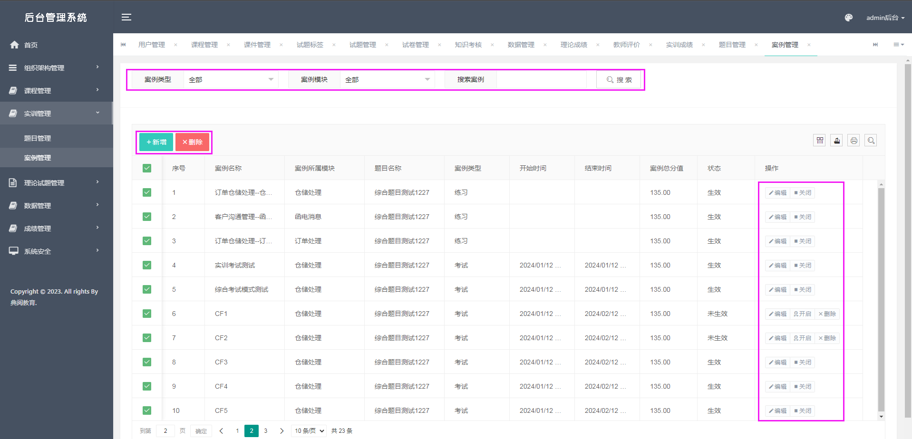

| 案例管理页可以根据案例类型、案例模块、或案例名称来搜索，可以新增案例、删除案例；对已有的案例进行编辑、开启或关闭、删除。 |
| :--- |

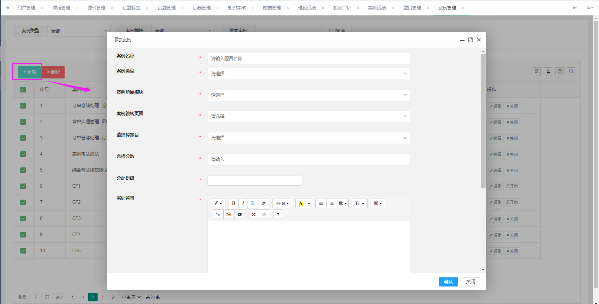

| 点击新增，在添加案例页面输入案例名称、选择案例类型、案例所属模块、案例跳转页面、选择题目、输入合格分数、分配班级、输入实训背景及操作要求；全部完成后点击右下角的“确认”按钮。 |
| :--- |

## **2.5理论试题管理**
#### 2.5.1试题标签
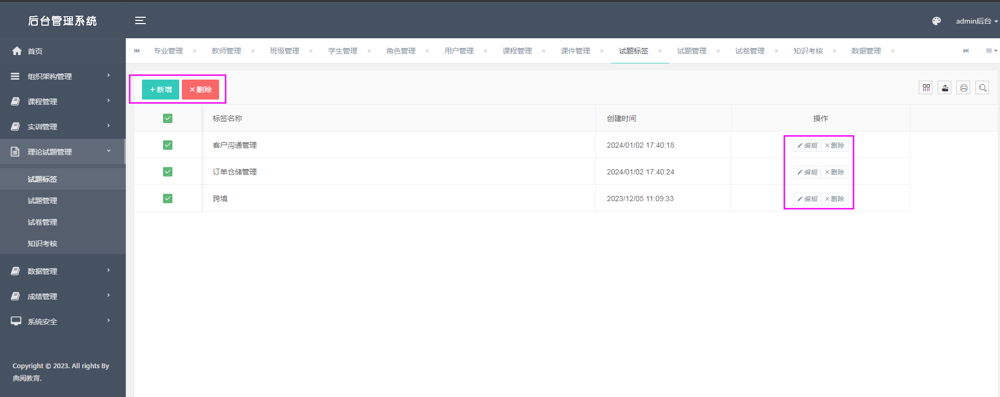

| 试题标签页可根据标签名称来搜索，可增加，删除或修改试题标签。 |
| :--- |

#### 2.6.2题库管理
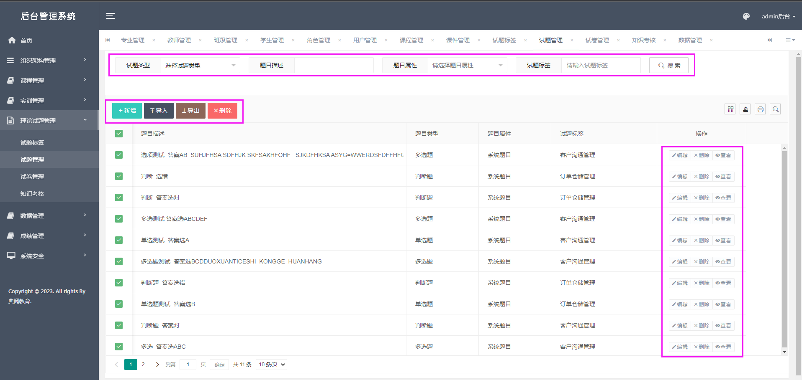

| 题库管理页可选择题型、输入关键字进行搜索，可单个新增试题，也可以以表格形式批量导入，查看已有的题目，对已有的题目进行编辑和删除。 |
| :--- |

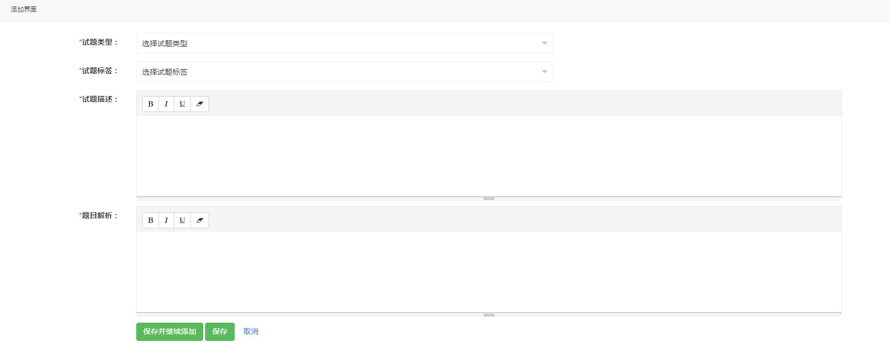

| 点击‘新增’，选择试题类型和试题标签，填写试题描述和题目解析后点保存即可。 |
| :--- |

#### 2.6.3试卷管理
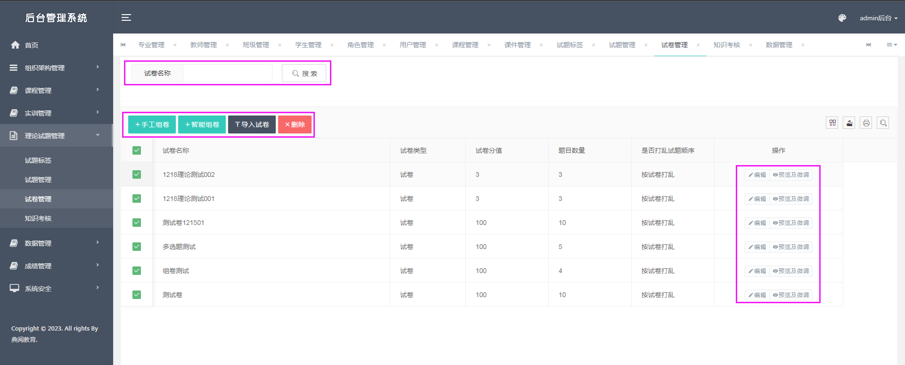

| 试卷管理页可根据试卷名称来搜索，可手工组卷、智能组卷，试卷可以以表格的形式导入，对已有的试卷进行编辑和删除、预览及微调，导出试卷。 |
| :--- |

#### 2.6.4知识考核
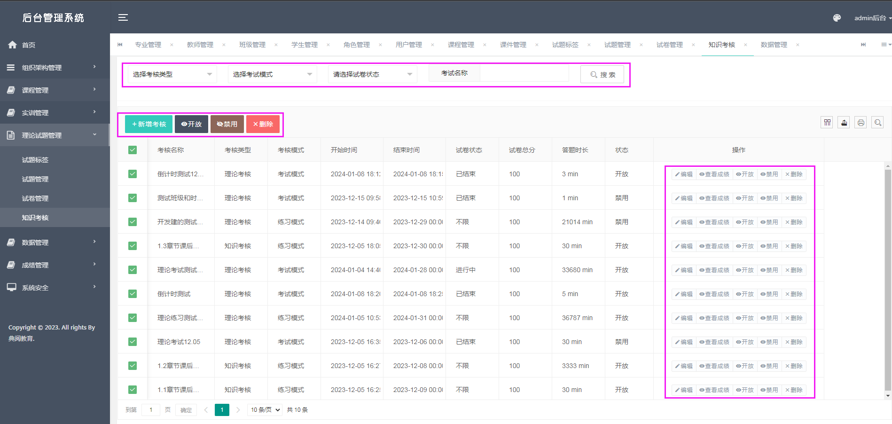

| 知识考核页可根据考核模式、试卷状态或关键字来搜索，可开放或禁用所选考核，可添加新的考核以及对已有的考核进行编辑和删除；可查看此考核下的学生做答成绩。 |
| :--- |

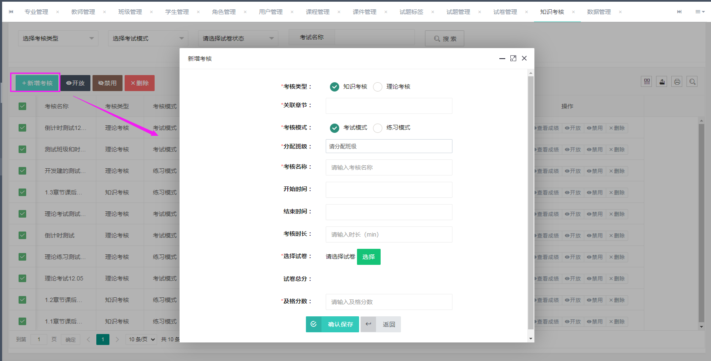

| 点击‘新增考核’，选择考核模式，根据提示填写信息，选择考核班级后点保存即可。 |
| :--- |

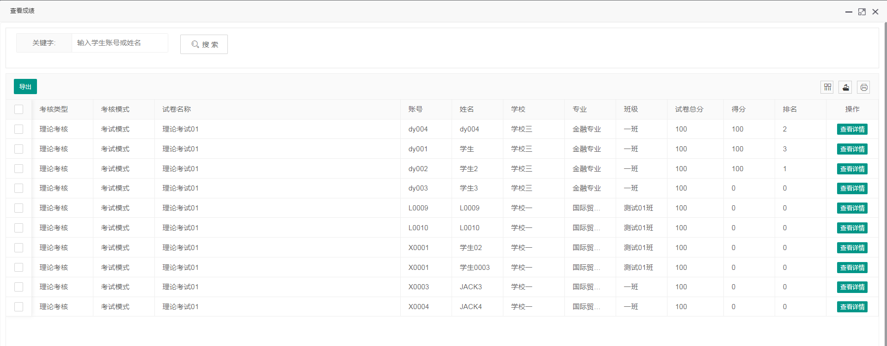

| 点击‘查看成绩’，进入到对应理论考核的成绩界面，可通过学生账号或姓名搜索；点击‘查看成绩’可查看学生详情的作答记录；点击‘导出’可导出理论成绩列表信息。 |
| :--- |

## **2.6数据管理**
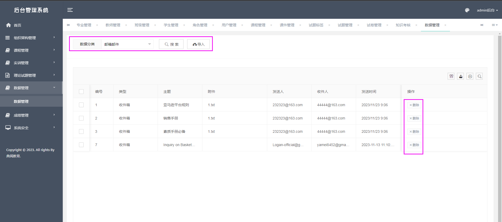

| 数据管理页可导入系统所需要的内置数据，导入后可通过模块搜索对应的模块的数据；可删除单条数据。 |
| :--- |

## **2.7成绩管理**
#### 2.7.1教师评价
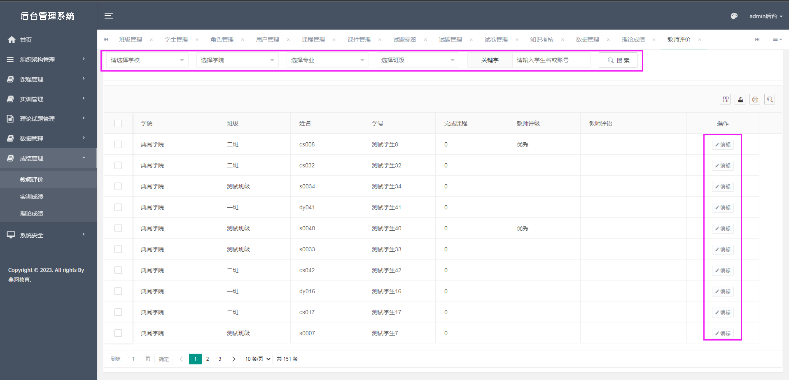

| 教师评价页可查看所有学生课程的完成情况及教师评价情况，选择学校学院、专业、班级或关键字来搜索，点击编辑可对该学生进行评价。 |
| :--- |

#### 2.7.2实训成绩
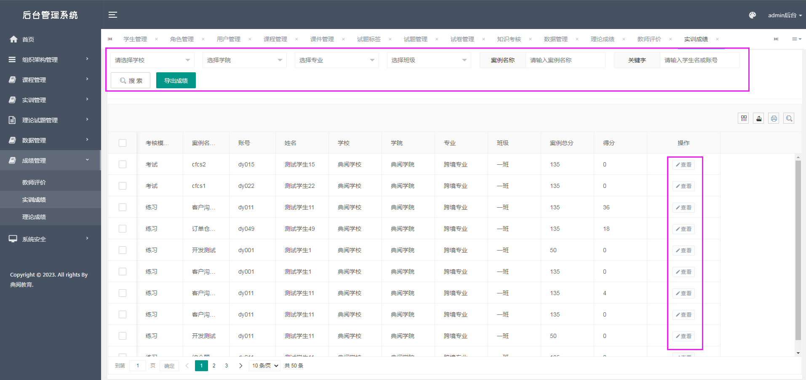

| 实训成绩页可查看所有学生的实训成绩，包含练习模式和竞赛模式；选择学校、学院、专业、班级或关键字来搜索，点击查看按钮可以查看每个学生账号每个实训案例的得分明细；点击导出成绩可导出列表中的实训成绩。 |
| :--- |

#### 2.7.3理论成绩
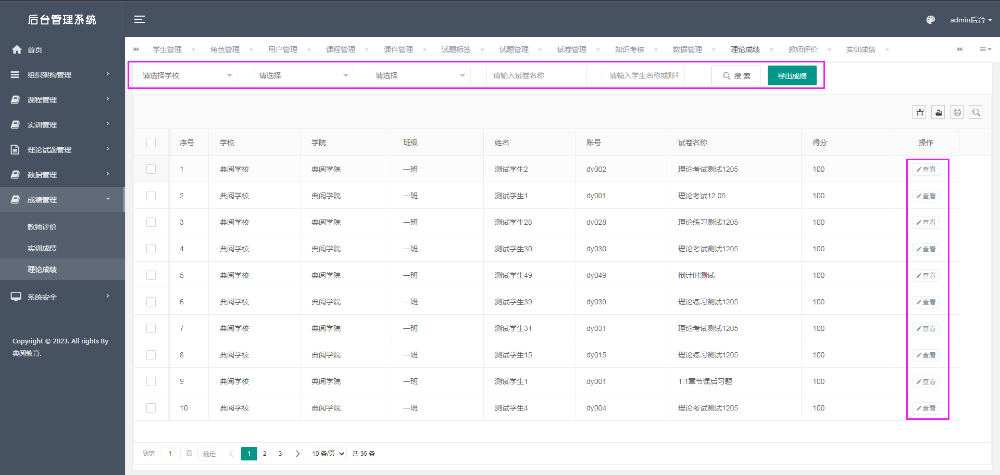

| 理论成绩页可查看所有学生的理论成绩，包含练习模式和竞赛模式；选择学校、学院、班级、试卷名称或学生账号及姓名来搜索，点击查看按钮可以查看每个学生账号每个实训案例的得分明细；点击导出成绩可导出列表中的实训成绩。 |
| :--- |

**跨境电商语言与客户服务实训系统V1.0**

**操作手册-教师端**

# 第一章 系统概述
## 1.1前言
跨境电商语言与客户服务实训系统V1.0---管理员端！使用本产品前，请务必仔细阅读该使用手册。此文档是为了帮助后台管理员更好的学习并掌握对平台的操作流程和使用方法。我们尽可能通过案例的设置，让学生在操作手册的帮助下完成每一个步骤的操作和所有分支功能的案例，并掌握每一步操作时是基于怎么样的目的和思考分析的结果。

本操作手册的所有版权属于湖南典阅教育科技有限公司，未经公司许可情况下，任何人不得为其他任何目的使用、复制或传播该手册的内容。

## 1.2可能出现的情况
在我们软件进步的过程中，我相信难免会有一些我们很难留意到的问题，在这里非常欢迎各位师生向我们反馈您在使用平台中遇见的错误或者是不能理解的情况。

# 第二章 系统介绍
| 登录平台 | 请使用老师提供的访问地址打开平台 |
| :--- | :--- |

## **2.1首页**
#### **2.1.1左侧菜单栏**
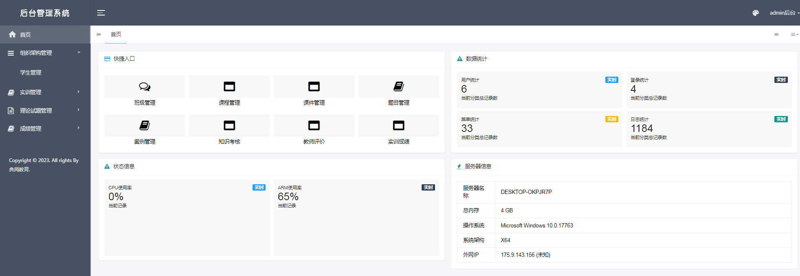

| 左侧菜单栏分别包括组织架构管理、实训管理、理论试题管理、成绩管理。 |
| :--- |

## **2.2组织架构管理**
#### 2.2.2学生管理
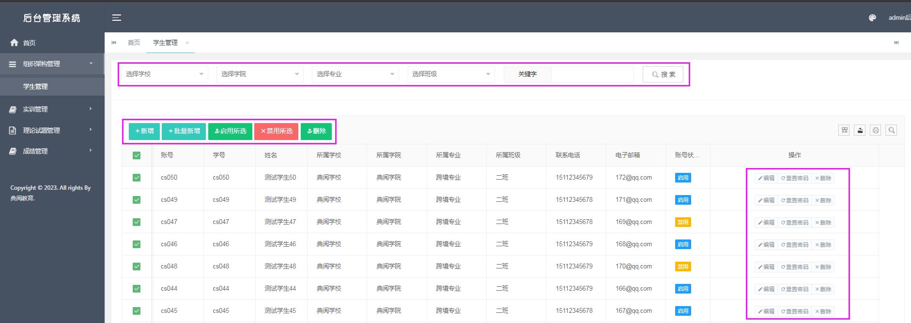

| 学生管理页面里可以选择学校、学院、专业、班级和输入关键字搜索，可以单个添加新的学生，也可以批量添加新的学生，对已有的学生进行启用和禁用以及删除和重置密码；可以对已有的学生进行修改以及批量修改。 |
| :--- |

| 点击‘新增’，选择学校、学院、专业、班级，填写学生学号、姓名、账号、密码后点确定即可。 |
| :--- |

| 批量新增学生时需要先选择班级，选择学校、学院、专业、班级，点击‘批量新增’，点击选择文件，选择已按模板编辑好的学生信息表，点击导入。 |
| :--- |

## 2.3 实训管理
### 2.3.1题目管理
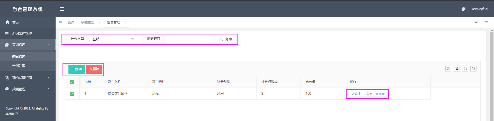

| 题目设置页面可以根据计分类型或题目名称来搜索，可以新增题目、删除题目；对已有的题目进行编辑、复制、删除。 |
| :--- |

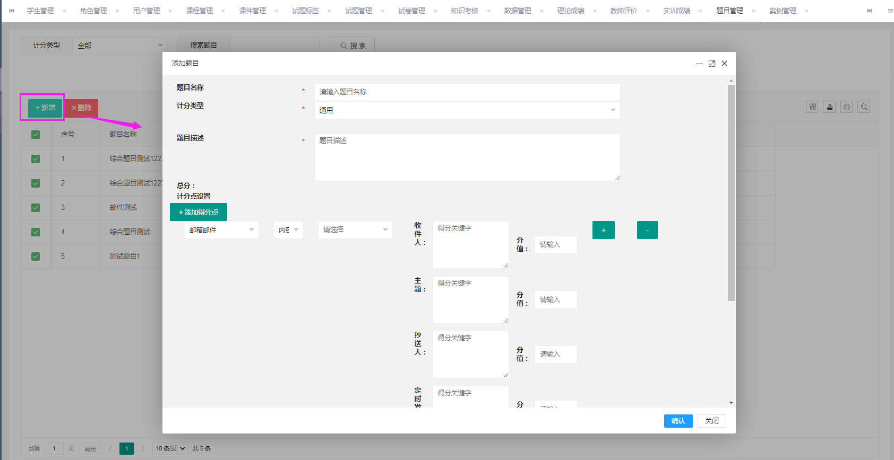

| 点击新增，在添加题目页面输入题目名称、选择计分类型、输入题目描述；点击添加得分点，通过选择模块、得分类型、得分点位、及得分关键字、和每个得分点的分值，来设置题目的得分点。所有得分点填写完成后，点击右下角的“确认”按钮。 |
| :--- |

### 2.3.2案例管理
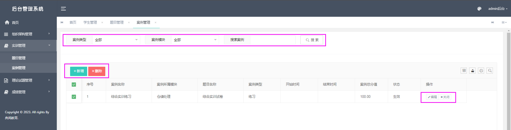

| 案例管理页可以根据案例类型、案例模块、或案例名称来搜索，可以新增案例、删除案例；对已有的案例进行编辑、开启或关闭、删除。 |
| :--- |

| 点击新增，在添加案例页面输入案例名称、选择案例类型、案例所属模块、案例跳转页面、选择题目、输入合格分数、分配班级、输入实训背景及操作要求；全部完成后点击右下角的“确认”按钮。 |
| :--- |

## **2.4理论试题管理**
#### 2.4.1题库管理
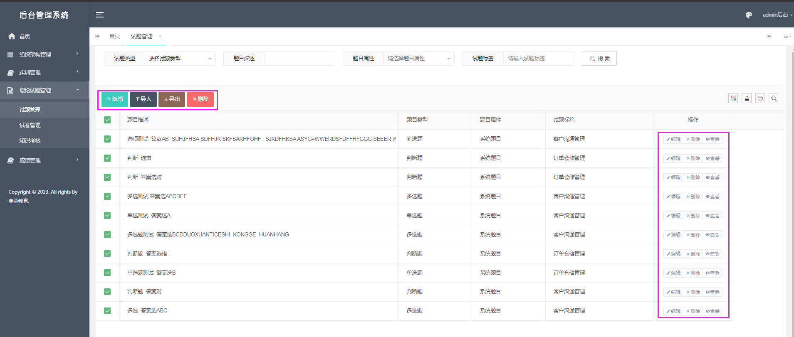

| 题库管理页可选择题型、输入关键字进行搜索，可单个新增试题，也可以以表格形式批量导入，查看已有的题目，对已有的题目进行编辑和删除。 |
| :--- |

| 点击‘新增’，选择试题类型和试题标签，填写试题描述和题目解析后点保存即可。 |
| :--- |

#### 2.4.2试卷管理
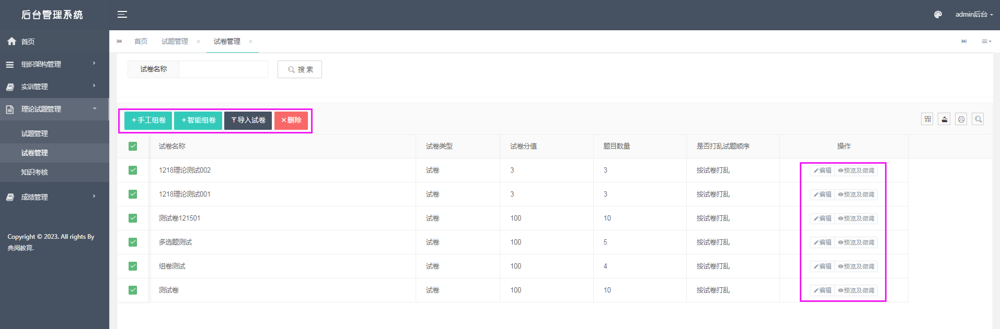

| 试卷管理页可根据试卷名称来搜索，可手工组卷、智能组卷，试卷可以以表格的形式导入，对已有的试卷进行编辑和删除、预览及微调，导出试卷。 |
| :--- |

#### 2.4.3知识考核
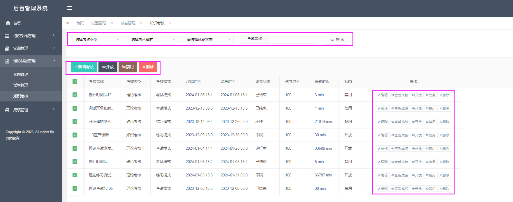

| 知识考核页可根据考核模式、试卷状态或关键字来搜索，可开放或禁用所选考核，可添加新的考核以及对已有的考核进行编辑和删除；可查看此考核下的学生做答成绩。 |
| :--- |

| 点击‘新增考核’，选择考核模式，根据提示填写信息，选择考核班级后点保存即可。 |
| :--- |

| 点击‘查看成绩’，进入到对应理论考核的成绩界面，可通过学生账号或姓名搜索；点击‘查看成绩’可查看学生详情的作答记录；点击‘导出’可导出理论成绩列表信息。 |
| :--- |

## **2.5成绩管理**
#### 2.5.1教师评价
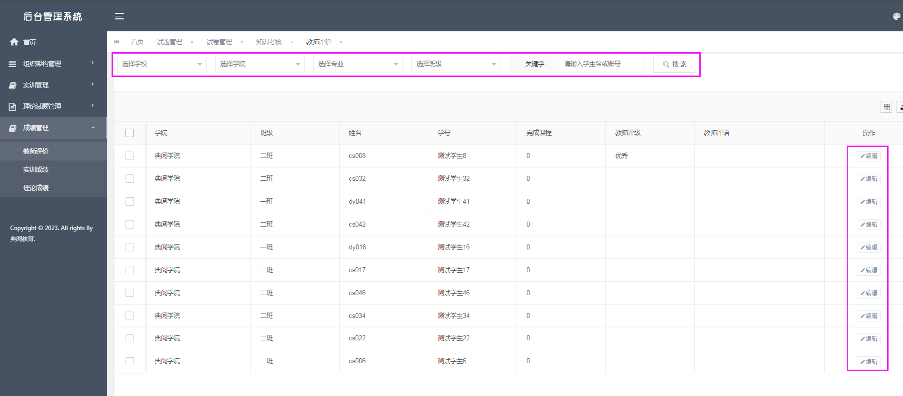

| 教师评价页可查看所有学生课程的完成情况及教师评价情况，选择学校学院、专业、班级或关键字来搜索，点击编辑可对该学生进行评价。 |
| :--- |

#### 2.5.2实训成绩
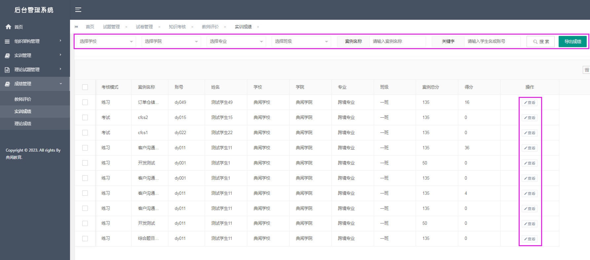

| 实训成绩页可查看所有学生的实训成绩，包含练习模式和竞赛模式；选择学校、学院、专业、班级或关键字来搜索，点击查看按钮可以查看每个学生账号每个实训案例的得分明细；点击导出成绩可导出列表中的实训成绩。 |
| :--- |

#### 2.5.3理论成绩
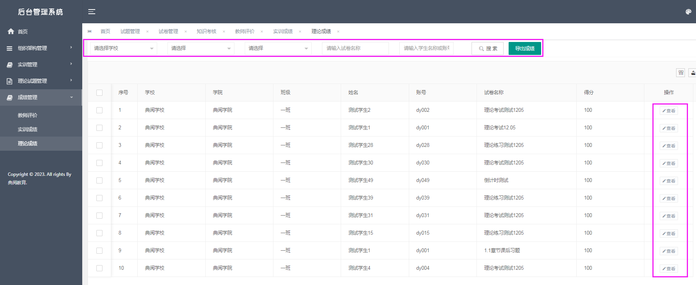

| 理论成绩页可查看所有学生的理论成绩，包含练习模式和竞赛模式；选择学校、学院、班级、试卷名称或学生账号及姓名来搜索，点击查看按钮可以查看每个学生账号每个实训案例的得分明细；点击导出成绩可导出列表中的实训成绩。 |
| :--- |

**跨境电商语言与客户服务实训**

**操作手册**

**     ****操作手册-学生端**

## 1 **系统概述**
### 1.1前言
欢迎使用典阅跨境电商语言与客户服务实训平台---学生端！使用本产品前，请务必仔细阅读该使用手册。此文档是为了帮助学生更好的学习并掌握对平台的操作流程和使用方法。我们尽可能通过案例的设置，让学生在操作手册的帮助下完成每一个步骤的操作和所有分支功能的案例，并掌握每一步操作时是基于怎么样的目的和思考分析的结果。

本操作手册的所有版权属于湖南典阅教育科技有限公司，未经公司许可情况下，任何人不得为其他任何目的使用、复制或传播该手册的内容。本系统是通过真实的实训案例让学生来体验，为在以后真实工作中面对不同的案例情形时做好准备。

### 1.2使用环境
系统支持的浏览器有哪些：

IE浏览器		版本10.0及以上正常运行

Chrome浏览器	版本60以上正常运行

360浏览器		可以正常运行

注意：支持使用任何极速、飞速版本的浏览器。

### 1.3可能出现的情况
目前各大跨境电商平台客服系统处于一个快速发展的阶段，我们的团队也在紧盯着行业的发展，尽力在第一时间将各大平台的最新调整在软件中体现出来，让用户体验感更好。

在我们软件进步的过程中，相信难免会有一些我们很难留意到的问题，在这里非常欢迎各位师生向我们反馈您在使用平台中遇见的错误或者是不能理解的情况。

## 2 **系统介绍**
**注意：学生在参考实训指导书操作过程中请注意：所有图片内的温情提示。**

| 登录平台 | 请使用老师提供的访问地址打开平台 |
| :--- | :--- |

### 2.1首页
温情提示：请注意不要多个学生使用同一账号，会在操作中发生错误。

#### **2.1.1顶部菜单栏**
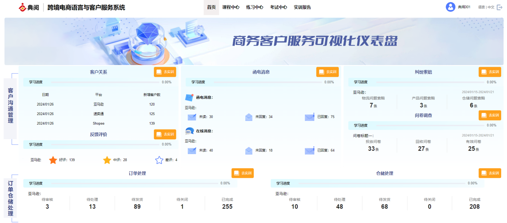

| 顶部菜单栏分别包括首页（实训中心）、课程中心、练习中心、考试中心、实训报告。 |
| :---: |

**2.2.1 实训中心**

| 实训中心一共分为7个模块，分别是客户关系、反馈评价、函电消息、纠纷索赔、问卷调查、订单处理、仓储处理。请选择想要练习的模块，点击右上角对应的‘去实训’。 |
| :--- |

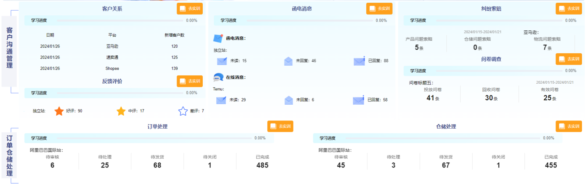

**2.2.2 选择案例**

| 进入实训模块后，需要选择案例，并点击“开始案例”，这里以“反馈评价”模块为例说明，其他模块类似。 |
| :--- |

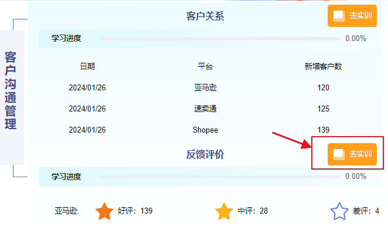

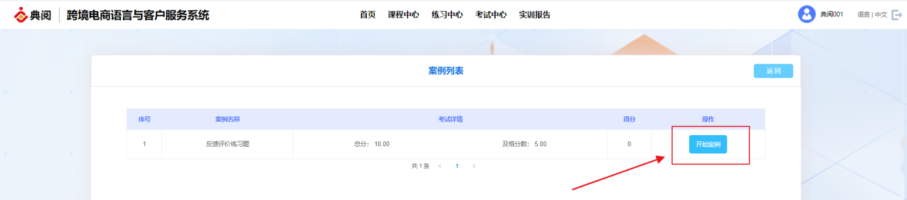

**2.2.3 查看题目，完成任务**

| 进入案例后，点击右下角实训助手中的“查看当前题目”，可以看到题目说明，根据题目中的要求完成对应操作任务。 |
| :--- |

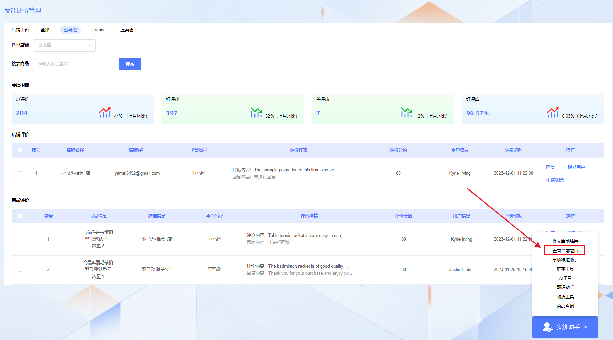

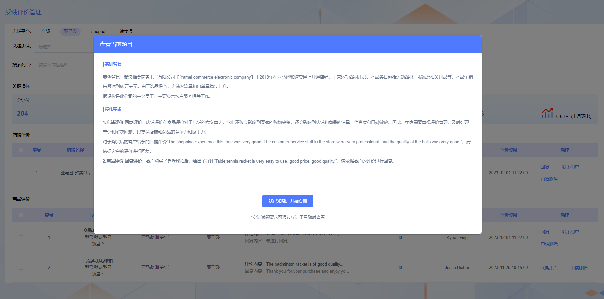

**2.2.4 提交当前案例结果**

| 完成操作后，点击实训助手的“提交当前结果”，点击“确认”，即提交成功本案例页面的结果。 |
| :--- |

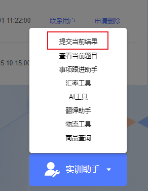

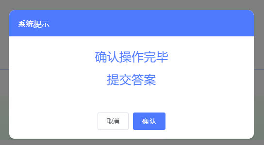

**2.2.4 查看结果及解析**

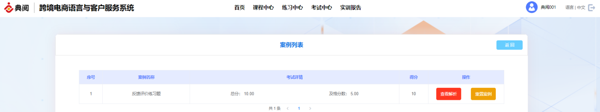

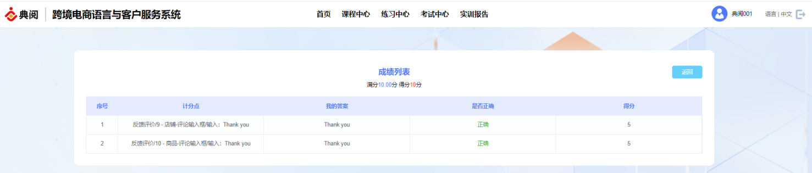

**2.3课程中心**

| 点击顶部菜单栏里的‘课程中心’，可以进行跨境电商语言与客户服务系统相关知识课件的学习。点击页面中间的“去学习”，可以进入课件查看页面。 |
| :--- |

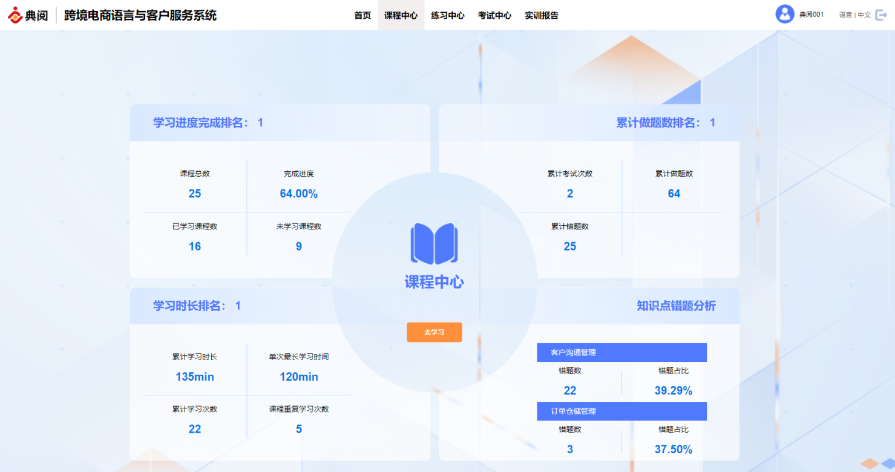

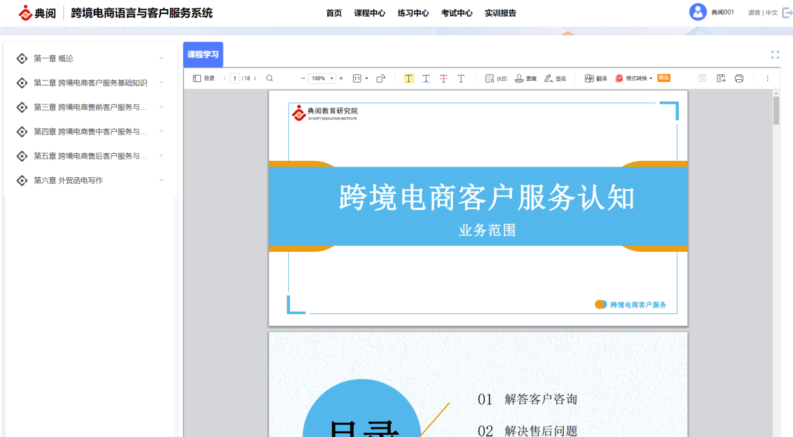

**2.4练习中心**

**2.4.1理论练习**

| 点击顶部菜单栏里的‘练习中心’，选择‘理论练习’可以进行理论题目的练习。每套题目做完后可以查看得分，并且练习模式下点击‘重置任务’还能重复练习。 |
| :--- |

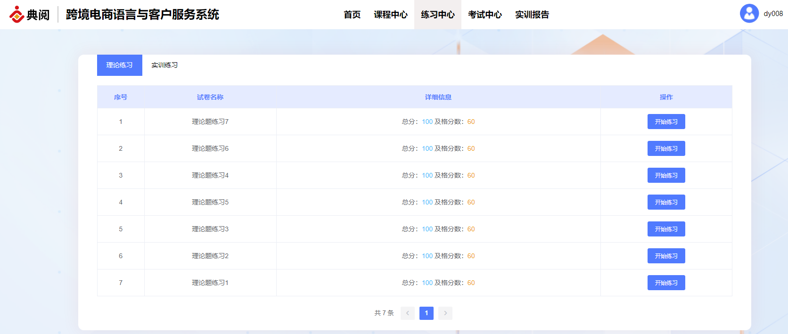

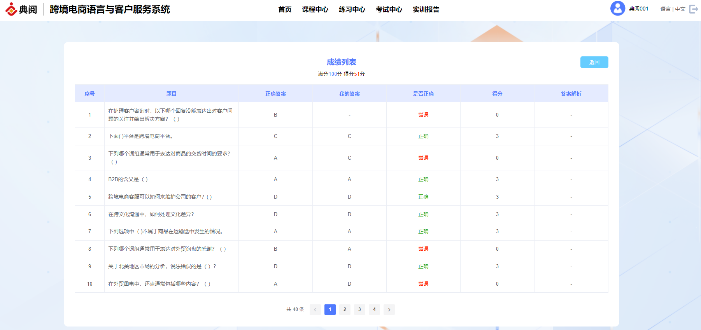

**2.4.2实训练习**

| 点击顶部菜单栏里的‘练习中心’，选择‘实训练习’可以进行实训操作的练习，每个模块的实操做完后可以查看得分及解析，并且练习模式下点击‘重置任务’还能重复练习。 |
| :--- |

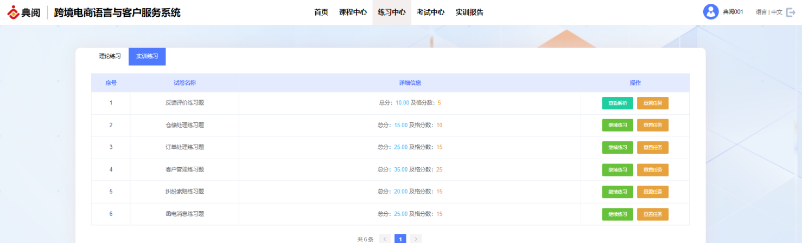

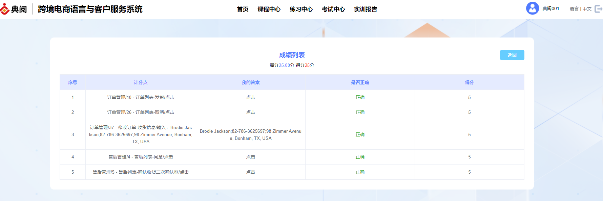

### **2.5考试中心**
| 点击顶部菜单栏里的‘考试中心’，可以进入考试，包含‘理论考试’和‘实训考试’两个模块，提交后能够立即查看得分（理论考试和实训考试学生只能看到得分，具体正误解析需要在教师管理端查看）。 |
| :--- |

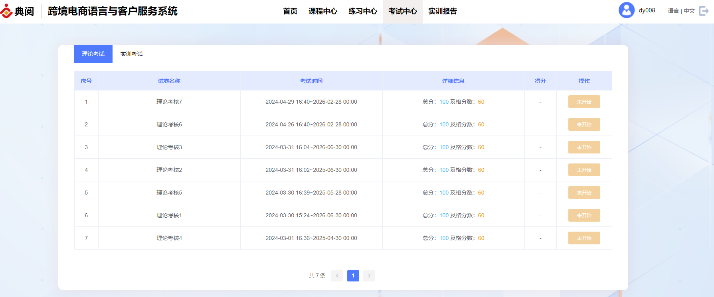

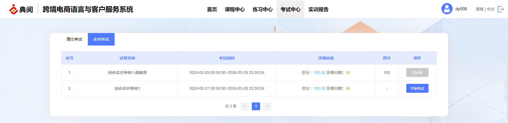

### 2.6 实训报告
| 可以生成实训报告。实训报告包括基本信息、实训任务明细、考核成绩、教师评价。点击右上角“导出”，可导出实训报告。 |
| :--- |

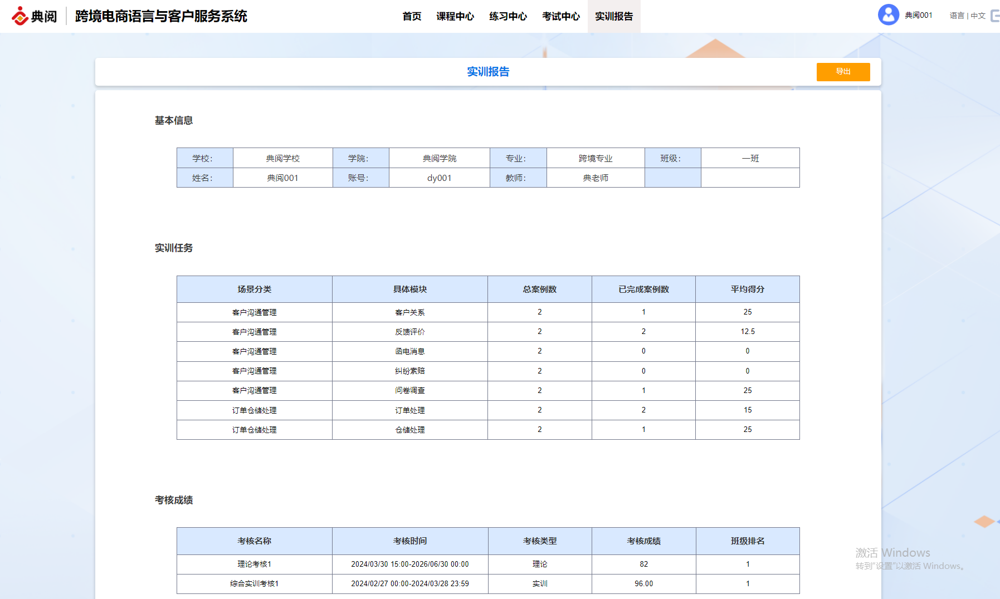

### 2.7 个人中心

| 点击图标或用户名，可修改密码。点击语言，可切换其他语种；点击右上角退出图标，可退出当前账号。 |
| :--- |

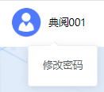      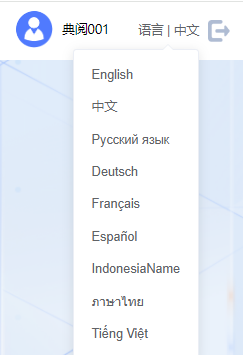

### 2.8 实训助手
| 实训页面右下角实训助手，提供常用的操作小工具。 |
| :--- |

**2.8.1事项跟进助手**

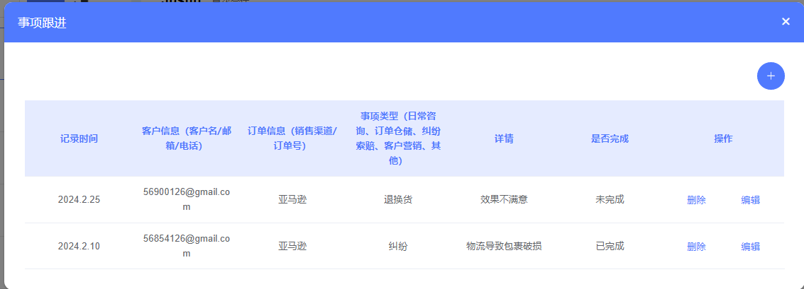

**2.8.2汇率工具**

**2.8.3 AI智能助手**

**2.8.4 翻译助手**

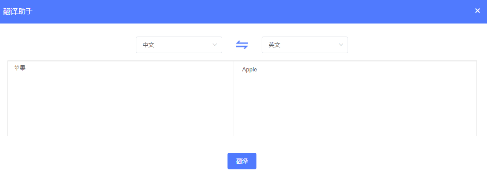

**2.8.5 物流查询工具**

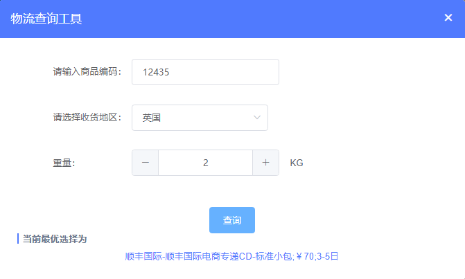

**2.8.6 商品查询工具**

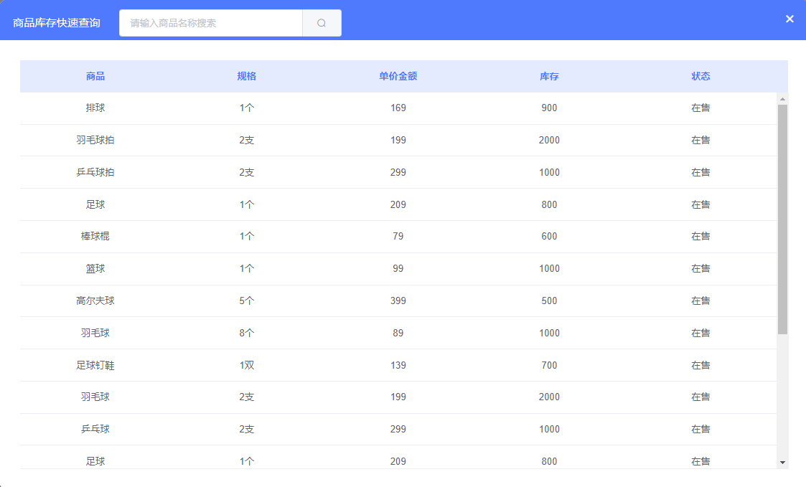

> 更新: 2026-01-05 13:20:46  
> 原文: <https://www.yuque.com/lixinsi/hntyk2/qbp7ggwwgdlatd5i>