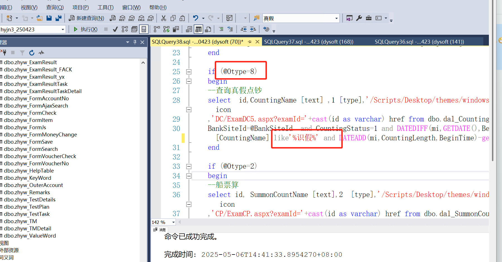
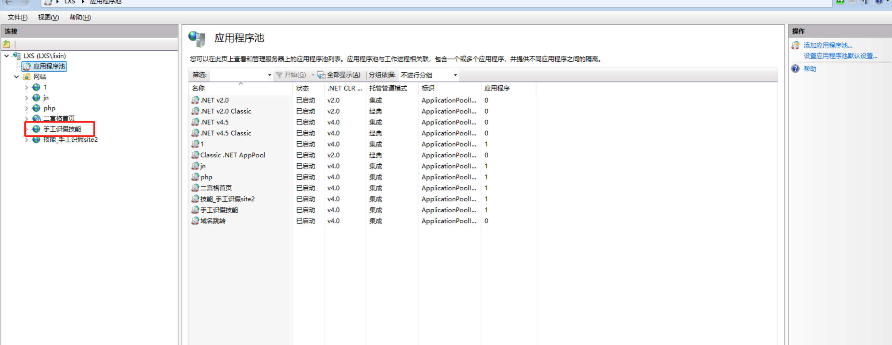
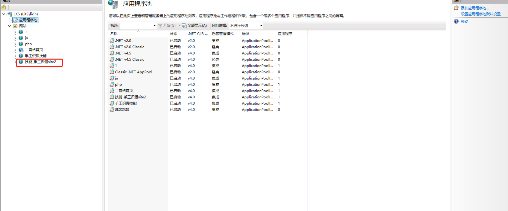
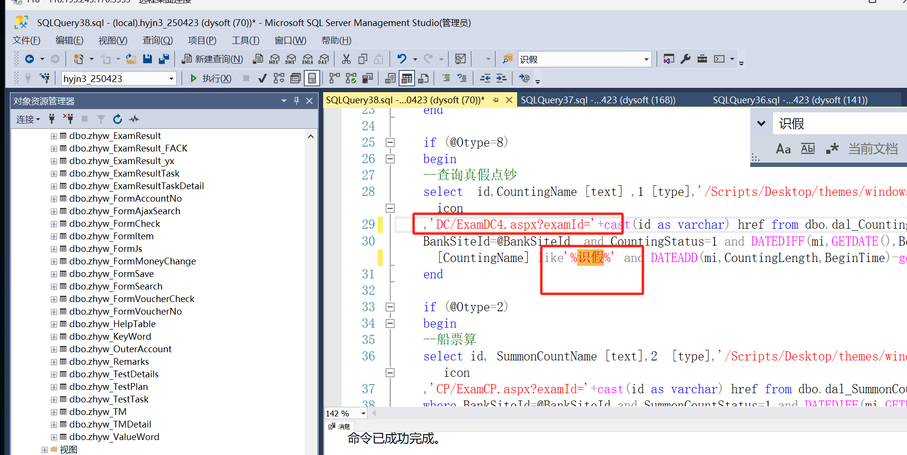
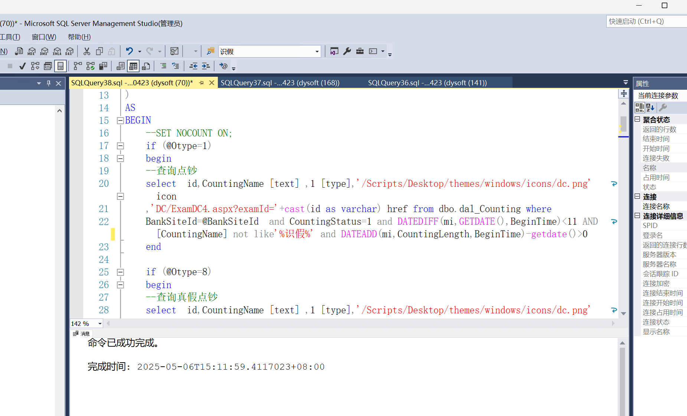
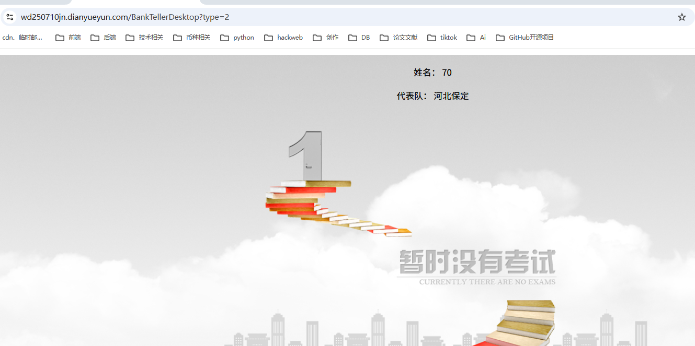
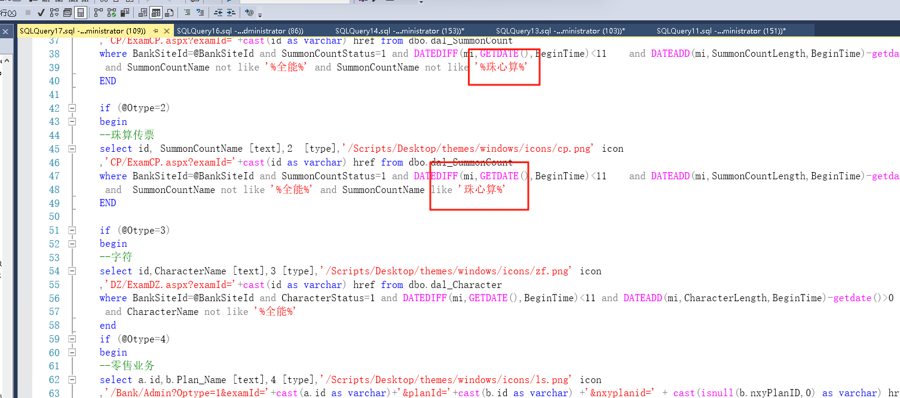

# 手工识假和珠心算

### 1.共用一个数据库
```json
$(function() {
    var cookieName = "username";
    var cookie = GetCookie(cookieName);
	
});
function getQueryVariable(variable){
       var query = window.location.search.substring(1);
       var vars = query.split("&");
       for (var i=0;i<vars.length;i++) {
               var pair = vars[i].split("=");
               if(pair[0] == variable){return pair[1];}
       }
       return (false);
	}
	
function Logon(type) {
	var uname=getQueryVariable('username');
	var upwd=getQueryVariable('pwd');
	var username;
	var password;
	if(uname){
		username=uname;
	}else{
		username = $.trim($("#username").val());
	}
     
    if (username == "") {
        alert("用户名不能为空");
        $("#username").focus();
        return;
    }
	if(uname){
		password=upwd;
	}else{
		password = $.trim($("#password").val());
	}
     
    if (password == "") {
        alert("密码不能为空");
        $("#password").focus();
        return;
    }
    var isSaveCookie;
    var cookies = $('#cbCookie').attr("checked");
    var httpServer=`http://${window.location.host}` 
    if (cookies == undefined) {
        isSaveCookie = 0;
    }
    else {
       isSaveCookie = 1;
    }
    
    $("#loading").show();
    $.ajax({
        url: '/Logon/CheckUser',
        dataType: 'json',
        type: 'post',
        data: { 'username': encodeURIComponent(username), 'password': encodeURIComponent(password), 'isSaveCookie': encodeURIComponent(isSaveCookie) },
        success: function (data) {
            $("#loading").hide();
            if (data == "0") {
                //不正确
                $("#password").val("");
                $("#password").focus();
                $("#loading").hide();
                alert("用户名密码不正确！");
            }
            else if (data == "3") {
                alert("该用户已经登录，请不要重复登录！");
            }
            else if (data == "6") {
                alert("您帐号的考试结果已经提交，不能再登陆！");
            }
            else if (data == "8") {
                alert("加密狗读取错误，请联系供应商！");
            }
            else if (data == "9") {
                alert("系统初始化错误，请联系供应商！");
            }
            else if (data == "99") {
                alert("系统已到期，请联系供应商！");
            }

            else if (data == "520") {
                alert("账号已被锁定或冻结！");
            }
            else if (data == "1") {
                //window.location.replace("MLogon.html?type=1&username="+username+"&password="+password+"");
				window.location.replace("BankTellerDesktop?type=8");
//window.location.replace("/img/index.html?type=1&username="+ $.trim($("#username").val())+ "&password="+$.trim($("#password").val()));
//window.location.replace("http://nxygssy.dianyueyun.com?Username="+username+"&Pwd="+password+"&type=1");

                //window.location.replace("BankTellerDesktop");
            }
            else if (data == "2") {
                //window.location.replace("MLogon.html?type=2&username="+username+"&password="+password+"");
//window.location.replace("http://nxygssy.dianyueyun.com?Username="+username+"&Pwd="+password+"&type=2");
                window.location.replace("/Desktop");
                /*判断有几个考核*/
                //alert("你的账户已被锁定,请与管理员联系！");
            }
        }

    });
}

function ResetForm() {
    $("#form1")[0].reset();
}
document.onkeydown = function () {
    if (event.keyCode == 13) {
        Logon('1');
    }
};

function GetCookie(name) {
    var arr = document.cookie.match(new RegExp("(^| )" + name + "=([^;]*)(;|$)"));
    if (arr != null) {
        return unescape(arr[2]);
    }
    return null;
}
```

### 2.站点 Mlogin
```json


<!DOCTYPE html>

<html>
<head>
    <meta name="viewport" content="width=device-width" />
<meta http-equiv="X-UA-Compatible" content="IE=edge">
    <meta name="renderer" content="webkit">
    <meta charset="UTF-8">

    <title>全国农信机构职业技能大赛</title>
    <link href="/Content/css/logon/logon.css" rel="stylesheet" />
    <script>
        function checkBrower() {
            var Sys = {};
            var ua = navigator.userAgent.toLowerCase();


            //document.write(ua);
            if (ua.indexOf("msie") >= 0) {
                Sys.ie = ua.match(/msie ([\d.]+)/)[1];
            }
            else if (ua.indexOf("trident") >= 0) {
                //alert(ua.match(/trident\/([\d.]+)/)[1]);
                Sys.ie = 10;
            }
            else if (ua.indexOf("firefox") >= 0) {
                Sys.firefox = ua.match(/firefox\/([\d.]+)/)[1];
            }
            else if (ua.indexOf("chrome") >= 0) {
                Sys.chrome = ua.match(/chrome\/([\d.]+)/)[1];
            }

            var flage = false;
            if ((Sys.ie && parseInt(Sys.ie) >= 9) || Sys.chrome || Sys.firefox) {
                /*支持的浏览器*/
                flage = true;
            }

            if (!flage) {
                document.getElementById("navigator").style.display = "block";
            }
        }
    </script>
    <script src="/Scripts/jquery.min.js"></script>
    <script src="/Content/scripts/login.js"></script>
    <script>
var username="";
var pwd="";
function getQueryVariable(variable){
       var query = window.location.search.substring(1);
       var vars = query.split("&");
       for (var i=0;i<vars.length;i++) {
               var pair = vars[i].split("=");
               if(pair[0] == variable){return pair[1];}
       }
       return (false);
	}

        function Logon1( OPtype) {

if(getQueryVariable('username')!=null&&getQueryVariable('password')!=null){
username=getQueryVariable('username');
pwd=getQueryVariable('password');
}
           // alert('aaaa');
            var url = window.location.href;
            var aa = url.indexOf('=');
            //if (aa == -1)
//{
//window.location="BankTellerDesktop?type=" + OPtype;
   //             return "";
//}
            var url1 = url.substring(aa + 1);
            var type = url1.substring(0, 1)
             var userinfo = url1.substring(url1.indexOf('=') + 1);

            var bb = userinfo.indexOf('&');
            var username = userinfo.substring(0, bb);
            var password = userinfo.substring(bb + 1);
            password = password.substring(password.indexOf('=') + 1);
           // window.alert(OPtype  + ":"+username);
if(OPtype=='6'){
window.open("http://hz.sgdc.dianyueyun.com/Logon?username="+username+"&pwd="+pwd+"")
}else{
window.location="BankTellerDesktop?type=" + OPtype;
}
   

     }

        function Logon2() {
            // alert('aaaa');
            var url = window.location.href;
            var aa = url.indexOf('=');
            if (aa == -1)
                return "";
            var url1 = url.substring(aa + 1);
            var type = url1.substring(0, 1);
            var userinfo = url1.substring(url1.indexOf('=') + 1);

            var bb = userinfo.indexOf('&');
            var username = userinfo.substring(0, bb);
            var password = userinfo.substring(bb + 1);
            password = password.substring(password.indexOf('=') + 1);
           // alert("U:" + username + " P:" + password);
         

            if (type == 1) {
                window.location = "http://127.0.0.1:8055/LogonAuto.html?type=2&username=" + username + "&pwd=" + password;

            }

            if (type == 2) {
                // 跳到另一个站点
                window.location = "http://127.0.0.1:8055/LogonAuto.html?type=2&username=" + username + "&pwd=" + password;
                //http://218.244.133.21:8099/LogonAuto.html?type=2&username=S0023&pwd=88888888
            }
        }


    </script>
</head>
<body class="login_bgM">
  
     <div class="login_divM">
        
        
        <p>
            <span ">&nbsp;</span>&nbsp;&nbsp;
           <span "></span>
           
  <span "></span>
		
        </p>

         <p>
            <span ">&nbsp;</span>
            <span "></span>&nbsp;&nbsp;
				
 <span "></span>
				
            <span "></span>
        </p>
    </div>

  


</body>
</html>

```



like 识假就可以了










### 珠心算管理端设置后学生端不显示，查对应存储过程的名字是不是和题目名字匹配。
### 珠心算设置的题目必须和存储过程一模一样。


存储过程需要



### 珠心算
```plain
1. 定位倒计时核心变量
在页面JavaScript代码中，testMinutes变量控制考试总时长（分钟数）。其值通过读取隐藏字段TestTime获取：

javascript
下载
复制
testMinutes = parseInt($("#TestTime").val()); // 从隐藏字段获取考试分钟数
2. 修改考试时长为20分钟
方法一：直接修改JavaScript变量（前端强制设置）
如果无法修改后台代码，可在前端直接强制设置testMinutes为20。找到window.onload函数中的testMinutes赋值行，替换为：  

javascript
下载
复制
// 将原始代码：testMinutes = parseInt($("#TestTime").val());
// 修改为：
testMinutes = 20; // 强制设置考试时长为20分钟
方法二：修改后台代码（推荐，更可靠）
TestTime是服务器端隐藏字段（<input runat="server" ...>），其值通常在后台.cs文件中设置。找到后台代码（如ExamCP.aspx.cs）的Page_Load事件，将TestTime的值设为"20"：  

csharp
下载
复制
protected void Page_Load(object sender, EventArgs e)
{
    if (!IsPostBack)
    {
        // 其他初始化代码...
        TestTime.Value = "20"; // 设置考试时长为20分钟（单位：分钟）
    }
}
3. 验证时间调整逻辑（可选）
页面中存在一段时间校准代码，若leaveSecond1（初始剩余秒数）大于2000秒，会动态调整testMinutes。若需强制20分钟，确保此逻辑不干扰：  

javascript
下载
复制
var leaveSecond1 = testMinutes * 60 - (currentTime - startTestTime) / 1000;
// 若testMinutes=20，则leaveSecond1=20*60=1200秒（<2000），不会进入以下if块，无需修改
if (leaveSecond1 > 2000) { 
    var addtime = parseInt(leaveSecond1 / 60) - 20;
    testMinutes = testMinutes - addtime;
}
4. 测试效果
保存修改后刷新页面，倒计时区域（Label3）会显示20分00秒，并每秒递减，直至结束。

总结
前端快速修改：直接在JavaScript中设置testMinutes = 20。  
后台彻底修改：在.cs文件中设置TestTime.Value = "20"（推荐，避免后台覆盖前端值）。
```

### 珠心算学生端样式
```plain
<body class="login_bgM">
  
     <div class="login_divM">
        
        
        <p>
            <span ">&nbsp;</span>&nbsp;&nbsp;
           <span ">&nbsp;</span>&nbsp;&nbsp;
            <span "></span>&nbsp;&nbsp;
        </p>

         <p>
              
           <span ">&nbsp;</span>&nbsp;&nbsp;
             <span "></span>
             <!--<span "></span>-->

              <!--<span "></span>-->
             
              <span "></span>
             
              <!--<span "></span>
             <span "></span>-->
</p>
<p>
    <span ">&nbsp;</span>&nbsp;&nbsp;
</p>
    </div>

  


</body>
```


> 更新: 2025-07-14 15:54:54  
> 原文: <https://www.yuque.com/lixinsi/hntyk2/neewaafttwv1phpg>