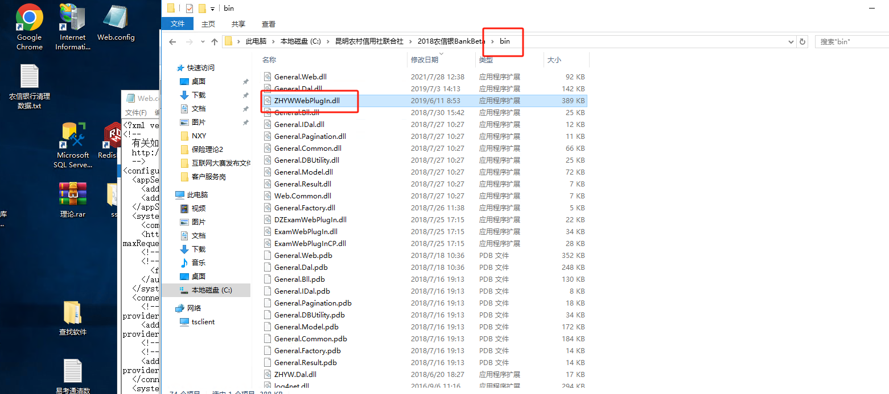
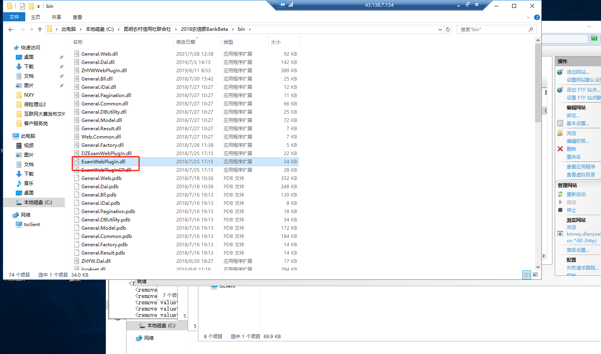
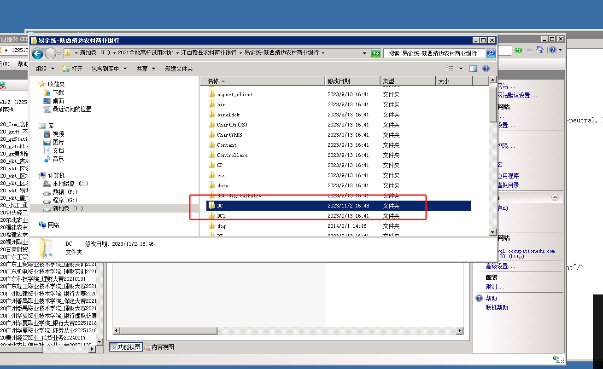
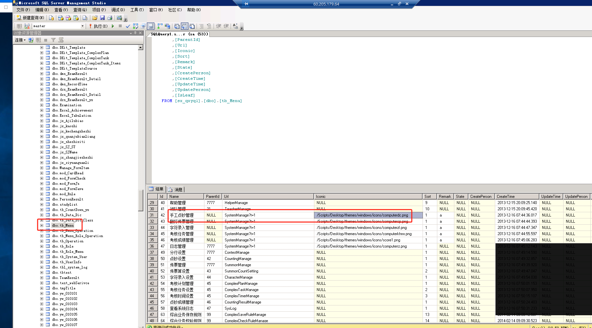
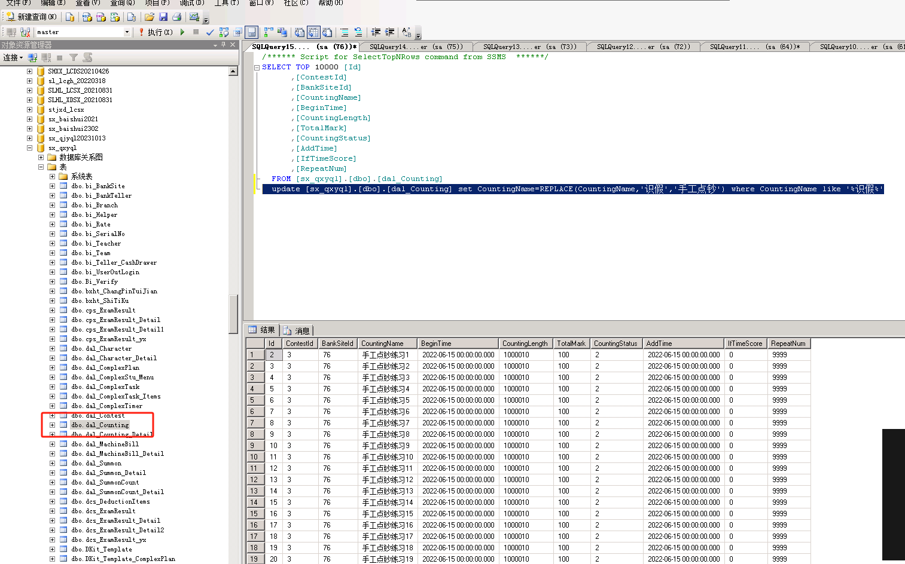

# 手工识假改手工点钞


[附件: 手工识假.rar](./attachments/vr17zluWQUdNd_ac/手工识假.rar)所需要更新的文件

1.目录拷贝






2.拷贝dc文件夹到手工识假对应目录




3.更换手工点钞图片

```csharp
C:\昆明农村信用社联合社\2018农信银BankBeta\Content\css\logon\images\03.png
```




4、更改考试名称



```plsql
  update [sx_qxyql].[dbo].[dal_Counting] set CountingName=REPLACE(CountingName,'识假','手工点钞') where CountingName like '%识假%'
```


```plsql
1. 替换字符
使用函数REPLACE(s,s1,s2)，将字符串s中的 s1替换成s2，可以实现批量的列操作，同时可以保留原始数据，非常适合我遇到的场景。

update 表 set 列 = replace(列, 待替换的字符串, 替换为的字符串) where 列 like '%待替换的字符串%';;
update table_name set column_name = replace(column_name, str_1 , str_2) where column_name like '%str_1%';
2. 新增
新增的列默认是在表的最后，但是也可以使用 first、after关键字来声明具体位置。

ALTER TABLE 语句用于在已有的表中添加、修改或删除列

1. 新增列默认是在表的最后
alter table 表名 add 列名 列属性;
alter table table_name add column_name tinyint unsigned not null default 100;
—— default 100(设置列的默认值)
 
2. 用first，声明新增的列在最前面
alter table 表名 add 列名 列属性 first;
alter table table_name add column_name int primary key auto_increment first;
—— primary key auto_increment(设为主键，并自动增加)
 
3.用after，声明新增的列在哪个字段的后面
alter table 表名 add 列名 列属性 after 另一个已存在的列名;
alter table table_name add column_name tinyint unsigned not null default 100 after other_exist_column_name;
3. 修改
change：既可以只修改列属性——列名和原来的相同但属性不同，也可以同时修改列名和属性——列名和和属性都不同；
modify：只能用于字段类型的修改
1. change可以修改名称和属性
alter table 表名 change 被修改的列名 新的列名 新列的属性;
alter table table_name change column_name column_name smallint unsigned not null default 100;
alter table table_name change column_name other_column_name int unsigned not null default 110;
 
2. alter 只能用于修改字段类型
alter table 表名 modify 列名 列类型;
alter table table_name modify column_name int;
4. 删除/清空
使用update清空某一列数据时，注意该列的属性是不为null才可以，否则可以用''替代。

1. 删除某列（机构上删除）
alter table 表名 drop column 列名;
alter table table_name drop column column_name;
 
2.清空某列（删除改列所有数据）
update 表名 set 列名 = '';
update table_name set column_name = null;
```


> 更新: 2024-04-12 11:05:46  
> 原文: <https://www.yuque.com/lixinsi/hntyk2/vgbx3ym39x021g5t>