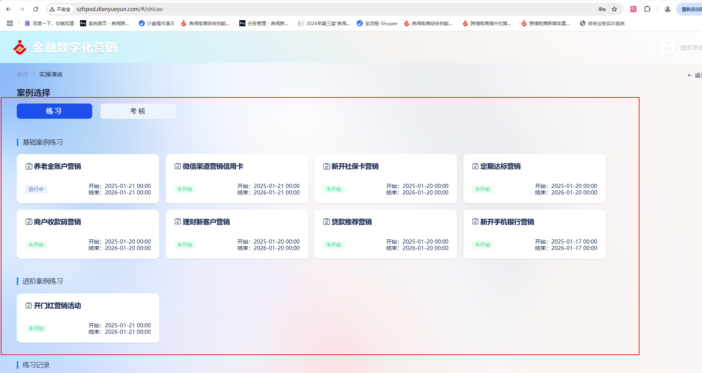
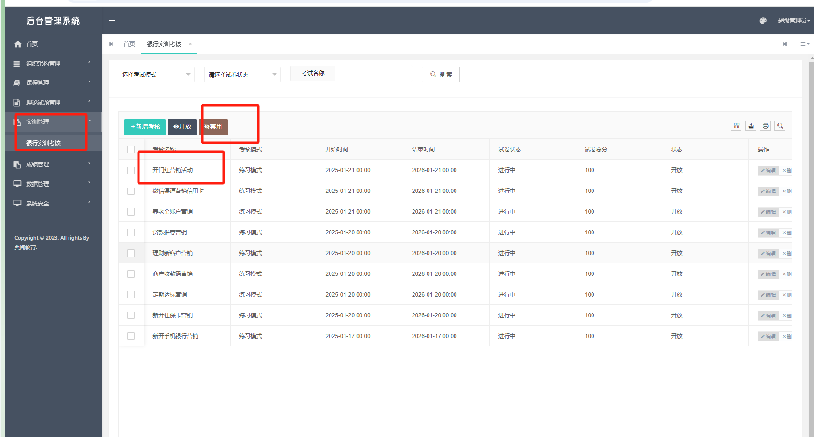
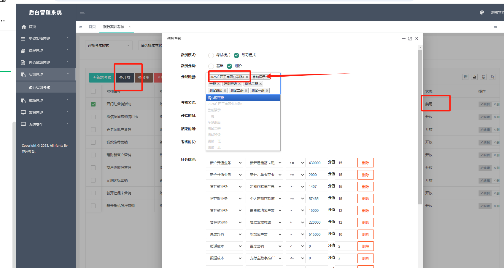

# 数字化营销清理脚本以及设置案列

### 1.在管理员账号里面关闭开放案列








添加班级后在开放教师账号就有案列了

```sql
 
--学校 F_SchoolName：学校名称
delete tb_org_school

-- 学院  F_SchoolName：学校名称 F_CollegeName：学院名称
delete tb_org_college where 1=1

-- 专业 F_SchoolName:学校名称 F_CollegeName:学院名称 F_SpecialtyName:专业名称
delete tb_org_specialty where 1=1

--学生 F_NO:学号 F_StudentName:学生姓名 F_UserName:学生账号 F_UserStatus:账号状态(1:启用 0:禁用)
delete tb_org_student where 1=1

--用户 F_Account:账户 F_RealName:姓名 jssy:教师Code
delete sys_user where F_RoleId in(select F_Id from sys_role where F_EnCode='jssy')

--用户考核实训成绩 F_ClassName:班级名称 F_UserId:用户ID F_LoginNoName:用户账户 F_SchoolName:学校名称
delete tb_user_test_achievement  where 1=1

--用户考核实训成绩详情 UserId:用户ID TestName:实训名称
delete tb_user_test_achievementDetailed  where 1=1

--银行-数据分析  UserId:用户Id
delete tb_Bank_DataAnalysis

--银行-指标数据 F_UserId:用户Id
delete tb_Bank_IndicatorData

--银行-营销记录 F_UserId:用户Id
delete tb_Bank_MarketingRecords

--删除班级数据
delete tb_org_grade
```


> 更新: 2026-03-11 09:49:44  
> 原文: <https://www.yuque.com/lixinsi/hntyk2/uizlgrxn5ko9sfc2>