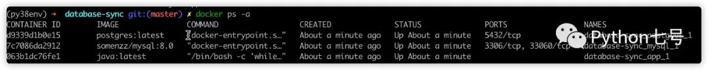
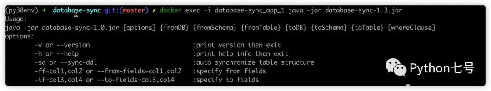
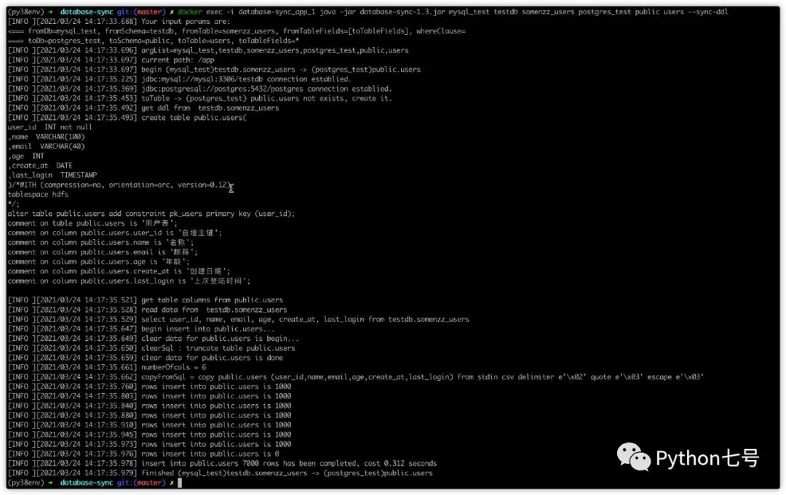
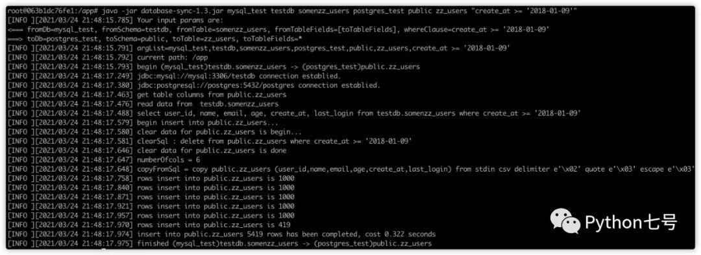
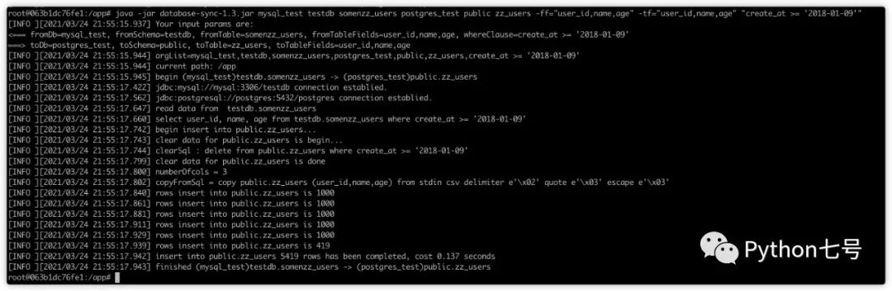

# 数据库复制

<font style="color:rgb(89, 87, 87);">求背景：</font>

<font style="color:rgb(89, 87, 87);">有很多业务系统，他们的数据库是相互独立的，俗称数据孤岛，为了做数据统计分析，就需要把这些数据归集在一个数据库中，比如数据仓库，然后多表关联查询，方便开发数据应用。希望能有这样的工具，指定两个数据库和表名，就可以将表从源数据库拷贝到目标数据库中。具体需求如下：</font>

+ <font style="color:rgb(89, 87, 87);">能自动同步表结构，如：源表加字段，目标表自动加字段。</font>
+ <font style="color:rgb(89, 87, 87);">支持增量或全量复制数据，比如按日期进行复制数据。</font>
+ <font style="color:rgb(89, 87, 87);">支持指定字段同步，只同步关心的那些字段。</font>
+ <font style="color:rgb(89, 87, 87);">支持主流的关系型数据库: mysql、db2、postgresql、oracle、sqlserver</font>
+ <font style="color:rgb(89, 87, 87);">源表和目标表表名可以不同，字段名也可以不同（已存在目标表的情况下）</font>

<font style="color:rgb(89, 87, 87);">因为自己要用，我就自己写了一个，顺便熟悉下 java 开发（之前一直用 Python，不得不说，Java 真浪费时间），本程序的最大用处就是构建集市或数仓所需要的基础层数据源，欢迎感兴趣的朋友一起加入。</font>

## <font style="color:rgb(63, 63, 63);">程序的使用方法</font>
### <font style="color:rgb(63, 63, 63);">Docker 方式：</font>
<font style="color:rgb(89, 87, 87);">这里用到三个容器:</font>

+ <font style="color:rgb(89, 87, 87);">app 也就是主程序本身，app 容器使用的程序文件就是 release 目录下的文件，已经做了绑定。</font>
+ <font style="color:rgb(89, 87, 87);">mysql 测试用的，作为源数据库，已提前放好了有 7000 条测试数据的表 somenzz_users。</font>
+ <font style="color:rgb(89, 87, 87);">postgres 测试用的，作为目标数据库，没有数据。</font>

<font style="color:rgb(89, 87, 87);">先部署，执行 </font><font style="color:rgb(255, 53, 2);background-color:rgb(248, 245, 236);">docker-compose up -d</font><font style="color:rgb(89, 87, 87);"> 就会自动完成应用和数据库的部署：</font>

```bash
$ git clone https://github.com/somenzz/database-sync.git
$ cd database-sync
$ docker-compose up -d
Creating database-sync_postgres_1 ... done
Creating database-sync_app_1      ... done
Creating database-sync_mysql_1    ... done
```

<font style="color:rgb(89, 87, 87);">这样三个容器就启动了，使用 </font><font style="color:rgb(255, 53, 2);background-color:rgb(248, 245, 236);">docker ps -a |grep database-sync</font><font style="color:rgb(89, 87, 87);"> 可以查看到三个正在运行的容器：</font>



<font style="color:rgb(89, 87, 87);">现在直接使用 </font><font style="color:rgb(255, 53, 2);background-color:rgb(248, 245, 236);">docker exec -i database-sync_app_1 java -jar database-sync-1.3.jar</font><font style="color:rgb(89, 87, 87);"> 来执行程序：</font>



<font style="color:rgb(89, 87, 87);">mysql 容器已有测试数据，</font><font style="color:rgb(255, 53, 2);background-color:rgb(248, 245, 236);">release/config/config.json</font><font style="color:rgb(89, 87, 87);"> 已经配置好了数据库的连接，因此可以直接试用，以下演示的是从 mysql 复制表和数据到 postgres：</font>

### <font style="color:rgb(89, 87, 87);">全量复制，自动建表：</font>
```dockerfile
docker exec -i database-sync_app_1 java -jar database-sync-1.3.jar mysql_test testdb somenzz_users postgres_test public users --sync-ddl
```




<font style="color:rgb(89, 87, 87);">如果你不想每次都敲 </font><font style="color:rgb(255, 53, 2);background-color:rgb(248, 245, 236);">docker exec -i database-sync_app_1</font><font style="color:rgb(89, 87, 87);"> ，可以进入容器内部执行：</font>

```dockerfile
(py38env) ➜  database-sync git:(master) ✗ docker exec -it database-sync_app_1 /bin/bash
root@063b1dc76fe1:/app# ls
config database-sync-1.3.jar  lib  logs
root@063b1dc76fe1:/app# java -jar database-sync-1.3.jar mysql_test testdb somenzz_users postgres_test public users -sd
```

### <font style="color:black;">2. 增量复制</font>
```dockerfile
root@063b1dc76fe1:/app# java -jar database-sync-1.3.jar mysql_test testdb somenzz_users postgres_test public zz_users "create_at >= '2018-01-09'"
```




### <font style="color:black;">3. 指定字段：</font>
```dockerfile
root@063b1dc76fe1:/app# java -jar database-sync-1.3.jar mysql_test testdb somenzz_users postgres_test public zz_users -ff="user_id,name,age" -tf="user_id,name,age" "create_at >= '2018-01-09'"
```




### <font style="color:rgb(63, 63, 63);">普通方式  
</font>
<font style="color:rgb(89, 87, 87);">程序运行前确保已安装 java 1.8 或后续版本，已经安装 maven，然后 clone 源码，打包：</font>

<font style="color:rgb(89, 87, 87);"></font>

```dockerfile
git clone https://gitee.com/somenzz/database-sync.git
cd database-sync
mvn package
```

<font style="color:rgb(89, 87, 87);">此时你会看到 target 目录，将 target 下的 lib 目录 和 database-sync-1.3.jar 复制出来，放在同一目录下，然后再创建一个 config 目录，在 config 下新建一个 config.json 文件写入配置信息，然后将这个目录压缩，就可以传到服务器运行了，请注意先充分测试，jdk 要求 1.8+</font>


```dockerfile
[aaron@hdp002 /home/aaron/App/Java/database-sync]$ ls -ltr
total 48
drwxr-xr-x 2 aaron aaron  4096 Apr 23  2020 lib
-rwxrw-r-- 1 aaron aaron   157 Jun 23  2020 run.sh
drwxrwxr-x 2 aaron aaron  4096 Jul  3  2020 logs
-rw-rw-r-- 1 aaron aaron 24773 Mar 16  2021 database-sync-1.3.jar
drwxr-xr-x 7 aaron aaron  4096 Aug  3  2020 jdk1.8.0_231
drwxrwxr-x 2 aaron aaron  4096 Feb 19 17:07 config
```


<font style="color:rgb(89, 87, 87);">你也可以直接下载我打包好的使用。</font>

<font style="color:rgb(89, 87, 87);"></font>

<font style="color:rgb(89, 87, 87);">程序名称叫 database-sync，运行方式是这样的：</font>

```dockerfile
py38env) ➜  target git:(master) ✗ java -jar database-sync-1.3.jar -h      
Usage: 
java -jar database-sync-1.0.jar [options] {fromDB} {fromSchema} {fromTable} {toDB} {toSchema} {toTable} [whereClause]
options:
        -v or --version                            :print version then exit
        -h or --help                               :print help info then exit
        -sd or --sync-ddl                          :auto synchronize table structure
        -ff=col1,col2 or --from-fields=col1,col2   :specify from fields
        -tf=col3,col4 or --to-fields=col3,col4     :specify to fields
        --no-feature or -nf                        :will not use database's feature
```


<font style="color:rgb(89, 87, 87);">帮助说明：</font>

<font style="color:rgb(89, 87, 87);">[] 中括号里的内容表示选填，例如 [options] 表示 options 下的参数不是必须的。</font>

<font style="color:rgb(89, 87, 87);">1、其中 options 参数解释如下：</font>

+ <font style="color:rgb(255, 53, 2);background-color:rgb(248, 245, 236);">--sync-ddl</font><font style="color:rgb(89, 87, 87);"> </font><font style="color:rgb(89, 87, 87);">或者</font><font style="color:rgb(89, 87, 87);"> </font><font style="color:rgb(255, 53, 2);background-color:rgb(248, 245, 236);">-sd</font><font style="color:rgb(89, 87, 87);"> </font><font style="color:rgb(89, 87, 87);">: 加入该参数会自动同步表结构。</font>
+ <font style="color:rgb(255, 53, 2);background-color:rgb(248, 245, 236);">--from_fields=col1,col2</font><font style="color:rgb(89, 87, 87);"> </font><font style="color:rgb(89, 87, 87);">或者</font><font style="color:rgb(89, 87, 87);"> </font><font style="color:rgb(255, 53, 2);background-color:rgb(248, 245, 236);">-ff=col1,col2</font><font style="color:rgb(89, 87, 87);"> </font><font style="color:rgb(89, 87, 87);">: 指定原表的字段序列，注意 = 前后不能有空格。</font>
+ <font style="color:rgb(255, 53, 2);background-color:rgb(248, 245, 236);">--to_fields=col3,col4</font><font style="color:rgb(89, 87, 87);"> </font><font style="color:rgb(89, 87, 87);">或者</font><font style="color:rgb(89, 87, 87);"> </font><font style="color:rgb(255, 53, 2);background-color:rgb(248, 245, 236);">-tf=col3,col4</font><font style="color:rgb(89, 87, 87);"> </font><font style="color:rgb(89, 87, 87);">: 指定目标表的字段序列，注意 = 前后不能有空格。</font>

<font style="color:rgb(89, 87, 87);">2、whereClause 表示 where 条件，用于增量更新，程序再插入数据前先按照 where 条件进行清理数据，然后按照 where 条件从原表进行读取数据。whereClause 最好使用双引号包起来，表示一个完整的参数。如："jyrq='2020-12-31'"</font>

<font style="color:rgb(89, 87, 87);">{} 大括号里的内容表示必填。</font>

<font style="color:rgb(255, 53, 2);background-color:rgb(248, 245, 236);">fromDb</font><font style="color:rgb(89, 87, 87);"> 是指配置在 config.json 的数据库信息的键，假如有以下配置文件：</font>

<font style="color:rgb(89, 87, 87);"></font>

```dockerfile
{
      "postgres":{
        "type":"postgres",
        "driver":"org.postgresql.Driver",
        "url":"jdbc:postgresql://localhost:5432/apidb",
        "user": "postgres",
        "password":"aaron",
        "encoding": "utf-8"
    },


    "aarondb":{
        "type":"mysql",
        "driver":"com.mysql.cj.jdbc.Driver",
        "url":"jdbc:mysql://localhost:3306/aarondb?useSSL=false&characterEncoding=utf8&serverTimezone=UTC",
        "user": "aaron",
        "password":"aaron"
    }
}
```


<font style="color:rgb(89, 87, 87);">fromDb、toDb 可以是 aarondb 或者 postgres。</font>

+ <font style="color:rgb(255, 53, 2);background-color:rgb(248, 245, 236);">fromSchema</font><font style="color:rgb(89, 87, 87);"> </font><font style="color:rgb(89, 87, 87);">读取数据的表的模式名，可以填写 "".</font>
+ <font style="color:rgb(255, 53, 2);background-color:rgb(248, 245, 236);">fromTable</font><font style="color:rgb(89, 87, 87);"> </font><font style="color:rgb(89, 87, 87);">读取数据的表明，必须提供。</font>
+ <font style="color:rgb(255, 53, 2);background-color:rgb(248, 245, 236);">toSchema</font><font style="color:rgb(89, 87, 87);"> </font><font style="color:rgb(89, 87, 87);">写入数据表的模式名，可以填写 ""，可以和 fromSchema 不同.</font>
+ <font style="color:rgb(255, 53, 2);background-color:rgb(248, 245, 236);">toTable</font><font style="color:rgb(89, 87, 87);"> </font><font style="color:rgb(89, 87, 87);">写入数据表的表名，必须提供，当写入表不存在时，自动按读取表的表结构创建，可以和 fromTable 不同。</font>

**<font style="color:rgb(255, 53, 2);">全量、增量、指定字段的使用样例请参考 Docker 方式。</font>**

**<font style="color:rgb(255, 53, 2);"></font>**

## <font style="color:rgb(63, 63, 63);">配置文件说明</font>
<font style="color:rgb(89, 87, 87);">配置文件位于 config/config.json，如下所示：</font>

```dockerfile
{
    "sjwb":{
        "type":"db2",
        "driver":"com.ibm.db2.jcc.DB2Driver",
        "url":"jdbc:db2://192.168.1.*:50000/wbsj",
        "user": "****",
        "password":"****",
        "tbspace_ddl": "/*这里可以放置指定表空间的语句*/",
        "encoding":"utf-8"
    },

    "dw_test":{
        "type":"db2",
        "driver":"com.ibm.db2.jcc.DB2Driver",
        "url":"jdbc:db2://192.168.169.*:60990/dwdb",
        "user": "****",
        "password":"****",
        "encoding":"gbk"
    },

    "postgres":{
        "type":"postgres",
        "driver":"org.postgresql.Driver",
        "url":"jdbc:postgresql://10.99.**.**:5432/apidb",
        "user": "****",
        "password":"****",
        "tbspace_ddl": "WITH (compression=no, orientation=orc, version=0.12)\ntablespace hdfs\n",
        "encoding":"utf-8"
    },


    "aarondb":{
        "type":"mysql",
        "driver":"com.mysql.cj.jdbc.Driver",
        "url":"jdbc:mysql://localhost:3306/aarondb?useSSL=false&characterEncoding=utf8&serverTimezone=UTC",
        "user": "****",
        "password":"****",
        "encoding":"utf-8"
    },

    "buffer-rows": 100000
```


<font style="color:rgb(89, 87, 87);">配置文件说明：</font>

<font style="color:rgb(255, 53, 2);background-color:rgb(248, 245, 236);">type</font><font style="color:rgb(89, 87, 87);"> </font><font style="color:rgb(89, 87, 87);"> 表示数据库类型，均为小写：</font>

+ <font style="color:rgb(89, 87, 87);">mysql</font>
+ <font style="color:rgb(89, 87, 87);">postgres</font>
+ <font style="color:rgb(89, 87, 87);">db2</font>
+ <font style="color:rgb(89, 87, 87);">oracle</font>
+ <font style="color:rgb(89, 87, 87);">sqlserver</font>

<font style="color:rgb(255, 53, 2);background-color:rgb(248, 245, 236);">tbspace_ddl</font><font style="color:rgb(89, 87, 87);"> </font><font style="color:rgb(89, 87, 87);">表示自动建表时指定的表空间，该选项不是必需的，可以删除。</font>

<font style="color:rgb(255, 53, 2);background-color:rgb(248, 245, 236);">buffer-rows</font><font style="color:rgb(89, 87, 87);"> </font><font style="color:rgb(89, 87, 87);">表示读取多少行时一块写入目标数据库，根据服务器内存大小自己做调整，100000 行提交一次满足大多数情况了。</font>

<font style="color:rgb(255, 53, 2);background-color:rgb(248, 245, 236);">encoding</font><font style="color:rgb(89, 87, 87);"> 用于表结构同步时确定字段长度，比如说源库的字段是 gbk varchar(10)，目标库是 utf-8，那么就应该为 varchar(15)，这样字段有中文就不会出现截断或插入失败问题，程序这里 2 倍，也就是 varchar(20) ，这样字段长度不会出现小数位。</font>

<font style="color:rgb(89, 87, 87);"></font>

## <font style="color:rgb(63, 63, 63);">最后的话</font>
<font style="color:rgb(89, 87, 87);">提高数据库间表的复制效率，如果不需要对源表字段进行转换，就丢掉低效的 datastage 和 kettle 吧。</font>


> 更新: 2024-01-18 16:37:30  
> 原文: <https://www.yuque.com/lixinsi/hntyk2/ltgm01l094qb9w4d>