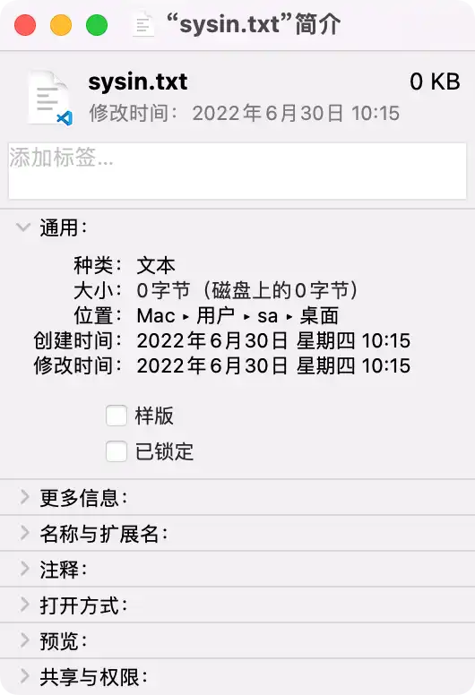
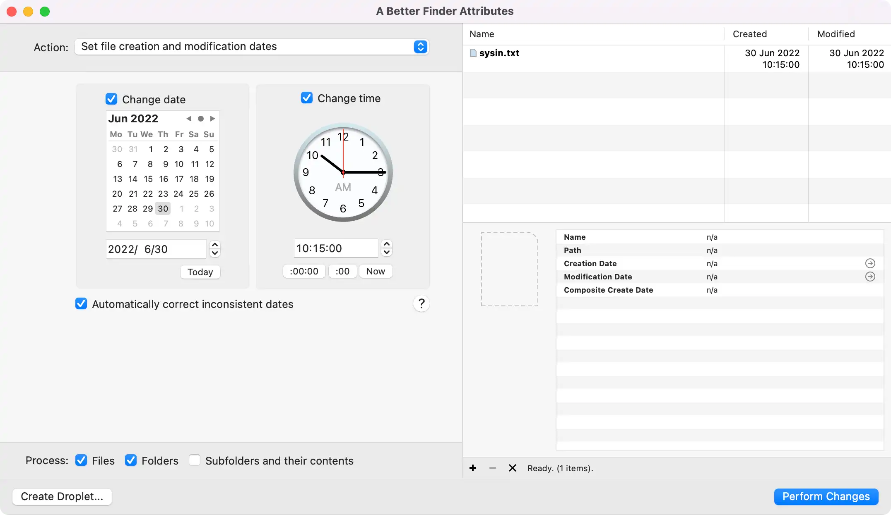
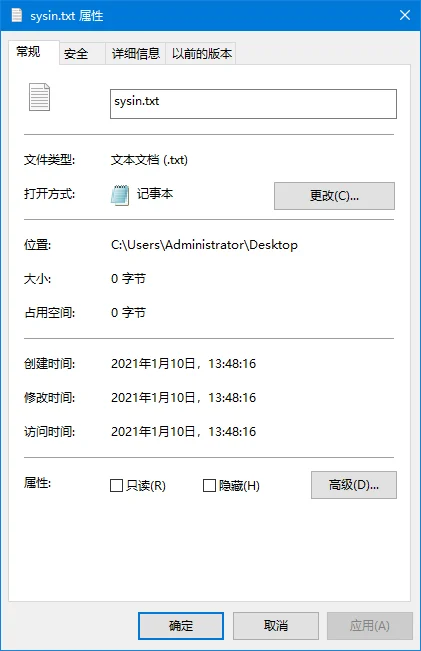
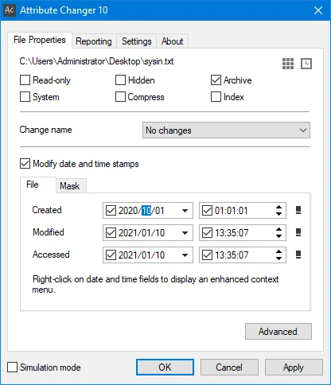

# 文件操作

*Posted by sysin on 2023-02-01Estimated Reading Time 13 MinutesWords 2.8k In Total*

# 如何修改文件的 “创建时间” 和 “修改时间” (macOS, Linux, Windows)

## 2023 修正版

[Veeam Backup & Replication 11 (Windows) - 虚拟、物理和云备份软件 - sysin | SYStem INside | 软件与技术分享](https://sysin.org/blog/veeam-backup-11/)

***

## 1. macOS（创建时间，修改时间）

### 图形界面（GUI）

在 macOS 中，点击文件右键 “显示简介”，显示 “创建时间” 和 “修改时间”。

在 Finder（访达）中，除了上述两个时间，同时会有 “上次打开日期” 和 “添加日期” 这两个特殊的文件属性。“上次打开日期” 记录了上次打开这个文件的最后时间，无论是否编辑和更改文件内容。“添加日期” 记录了文件在当前位置产生的时间，比如是新创建的一个文件，该时间等于创建时间，如果是复制的文件，或者通过网络下载的文件，该时间只是在当前位置产生的时间，与创建时间无关。这两个特殊的文件属性默认无法修改。

**修改 “创建时间” 和 “修改时间”**：

推荐使用这个 App：A Better Finder Attributes（商业软件，自行搜索），操作简单便捷。

### 终端（Terminal）

在 Darwin 系统部分（Darwin 一般是指 macOS 的命令行部分），类似于 Linux 有 atime、mtime 和 ctime，但是还多了 birthtime 即创建时间。

直接使用 stat 命令可以查看文件时间属性，可以看到有 4 个时间，但是不友好，没法直接辨别。其实分别是：Access、Modify、Change 和 Birth。

但作为正统 Unix 系统，Darwin 的 stat 命令有额外的参数：

现在加上 -x 参数可以看到 Access、Modify、Change 和 Birth 四个时间。

*之前的旧版系统中需要 -s 参数才能显示 birthtime。*

| <code>plain # sysin @ macOS in ~/Desktop [17:32:20] $ stat sysin.txt 16777225 9617704 -rw-r--r-- 1 sysin staff 0 0 "Feb  2 17:32:28 2023" "Feb  2 17:32:28 2023" "Feb  2 17:32:28 2023" "Feb  2 17:32:28 2023" 4096 0 0 sysin.txt  # sysin @ macOS in ~/Desktop [17:32:32] $ stat -x sysin.txt   File: "sysin.txt"   Size: 0            FileType: Regular File   Mode: (0644/-rw-r--r--)         Uid: (  501/      sysin)  Gid: (   20/   staff) Device: 1,9   Inode: 9617704    Links: 1 Access: Thu Feb  2 17:32:28 2023 Modify: Thu Feb  2 17:32:28 2023 Change: Thu Feb  2 17:32:28 2023  Birth: Thu Feb  2 17:32:28 2023  # sysin @ macOS in ~/Desktop [17:32:39] $ stat -s sysin.txt st_dev=16777225 st_ino=9617704 st_mode=0100644 st_nlink=1 st_uid=501 st_gid=20 st_rdev=0 st_size=0 st_atime=1675330348 st_mtime=1675330348 st_ctime=1675330348 st_birthtime=1675330348 st_blksize=4096 st_blocks=0 st_flags=0 </code>  |
| --- |

修改时间可以使用 touch 和 setfile 命令

touch（同 Linux，修改时间 atime 和访问时间 mtime，无 “创建时间”）

| `plain # 修改 “修改时间” touch -m -t YYYYMMDDhhmm filename # 例如 touch -mt 202305181505 sysin.txt  # 修改 “访问时间和修改时间” touch -t YYYYMMDDhhmm filename # 例如 touch -t 202305191505 sysin.txt  # 释义 YYYY  年 - 四位数 MM    月 - 两位数 DD    日 - 两位数 hh    小时 - 两位数 mm    分钟 - 两位数 `  |
| --- |

实例

| `plain # sysin @ macOS in ~/Desktop [17:32:50] $ touch -mt 202305181505 sysin.txt  # sysin @ macOS in ~/Desktop [17:34:18] $ stat -x sysin.txt   File: "sysin.txt"   Size: 0            FileType: Regular File   Mode: (0644/-rw-r--r--)         Uid: (  501/      sysin)  Gid: (   20/   staff) Device: 1,9   Inode: 9617704    Links: 1 Access: Thu Feb  2 17:32:28 2023 #没有变化 Modify: Thu May 18 15:05:00 2023 Change: Thu Feb  2 17:34:18 2023 #变更为命令执行的时间  Birth: Thu Feb  2 17:32:28 2023 #没有变化  # sysin @ macOS in ~/Desktop [17:34:24] $ touch -t 202305191505 sysin.txt  # sysin @ macOS in ~/Desktop [17:36:13] $ stat -x sysin.txt   File: "sysin.txt"   Size: 0            FileType: Regular File   Mode: (0644/-rw-r--r--)         Uid: (  501/      sysin)  Gid: (   20/   staff) Device: 1,9   Inode: 9617704    Links: 1 Access: Fri May 19 15:05:00 2023 Modify: Fri May 19 15:05:00 2023 Change: Thu Feb  2 17:36:13 2023 #变更为命令执行的时间  Birth: Thu Feb  2 17:32:28 2023 #没有变化 `  |
| --- |

setfile（创建时间和修改时间）

需要安装 Xcode command line tools（命令：xcode-select --install）

| `plain setfile Usage: SetFile [option...] file...     -a attributes     # attributes (lowercase = 0, uppercase = 1)*     -c creator        # file creator     -d date           # creation date (mm/dd/[yy]yy [hh:mm[:ss] [AM | PM]])*     -m date           # modification date (mm/dd/[yy]yy [hh:mm[:ss] [AM | PM]])*     -P                # perform action on symlink instead of following it     -t type           # file type `  |
| --- |

* 修改创建日期：setfile -d mm/dd/yy hh:mm:ss filename\
  示例：setfile -d '1/1/2023 18:18:0' sysin.txt
* 修改修改日期：setfile -m mm/dd/yy hh:mm:ss filename\
  示例：setfile -m '1/1/2023 20:18:0' sysin.txt

实例

| `plain # sysin @ macOS in ~/Desktop [17:44:44] $ setfile -d '1/1/2023 18:18:0' sysin.txt  # sysin @ macOS in ~/Desktop [17:44:49] $ stat -x sysin.txt   File: "sysin.txt"   Size: 0            FileType: Regular File   Mode: (0644/-rw-r--r--)         Uid: (  501/      sysin)  Gid: (   20/   staff) Device: 1,9   Inode: 9617704    Links: 1 Access: Fri May 19 15:05:00 2023 #无变化 Modify: Fri May 19 15:05:00 2023 #无变化 Change: Thu Feb  2 17:44:49 2023 #变更为命令执行的时间  Birth: Sun Jan  1 18:18:00 2023  # sysin @ macOS in ~/Desktop [17:44:51] $ setfile -m '1/1/2023 20:18:0' sysin.txt  # sysin @ macOS in ~/Desktop [17:45:09] $ stat -x sysin.txt   File: "sysin.txt"   Size: 0            FileType: Regular File   Mode: (0644/-rw-r--r--)         Uid: (  501/      sysin)  Gid: (   20/   staff) Device: 1,9   Inode: 9617704    Links: 1 Access: Fri May 19 15:05:00 2023 #无变化 Modify: Sun Jan  1 20:18:00 2023 Change: Thu Feb  2 17:45:09 2023 #变更为命令执行的时间  Birth: Sun Jan  1 18:18:00 2023 #无变化 `  |
| --- |

## 2. Linux（修改时间，访问时间）

*这里仅描述 shell 中的情形，图形界面中未有关注。*

注意：Linux（包括传统 Unix）中没有 “创建（creation）” 时间的概念。

查看文件时间信息（stat 命令）

现代 Linux 已经可以显示 Birth，即 “创建（creation）” 时间。

| `plain # 创建一个测试文件 # root @ A9 in ~ [17:59:07] $ touch sysin.txt  # 使用 stat 命令查看文件时间信息 # root @ A9 in ~ [17:59:12] $ stat sysin.txt   File: sysin.txt   Size: 0               Blocks: 0          IO Block: 4096   regular empty file Device: 802h/2050d      Inode: 201327432   Links: 1 Access: (0644/-rw-r--r--)  Uid: (    0/    root)   Gid: (    0/    root) Access: 2023-02-02 17:59:12.688566820 +0800 Modify: 2023-02-02 17:59:12.688566820 +0800 Change: 2023-02-02 17:59:12.688566820 +0800  Birth: 2023-02-02 17:59:12.688566820 +0800 `  |
| --- |

有如下三种时间

* Access: ATime —— 文件的最近访问时间。只要读取时间，ATime 就会更新。
* Modify: MTime —— 文件的内容最近修改的时间当文件进行被写的时候，CTime 就会更新。
* Change: CTime —— 文件属性最近修改的时间当文件的目录被修改，或者文件的所有者，权限等（包括文件内容被修改）被修改时 CTime 也就会更新。

touch 修改时间

| `plain touch 不仅可以创建文件，还可以对其进行时间的一些修改 格式：touch 参数 文件名 参数： -a: 修改访问时间，或 -–time=atime 或 -–time=access 或 -–time=use -c: 或 -–no-creat，如果文件不存在则不创建文件 -d: 使用指定的日期时间，可以使用不同的格式 -m: 或 -–time=mtime 或 -–time=modify，改变修改时间 -r: 把指定的文件日期更设成和参考文档或目录日期相同的时间 -t: 使用指定的日期时间，格式与 date 指令相同 `  |
| --- |

命令格式：

| `plain # 修改 “修改时间” touch -mt YYYYMMDDhhmm filename # 例如 touch -mt 202305181505 sysin.txt  # 修改 “访问时间和修改时间” touch -t YYYYMMDDhhmm filename # 例如 touch -t 202205191505 sysin.txt  # 释义 YYYY  年 - 四位数 MM    月 - 两位数 DD    日 - 两位数 hh    小时 - 两位数 mm    分钟 - 两位数 `  |
| --- |

实例：

| `plain # root @ A9 in ~ [17:59:18] $ touch -mt 202305181505 sysin.txt  # root @ A9 in ~ [18:00:19] $ stat sysin.txt   File: sysin.txt   Size: 0               Blocks: 0          IO Block: 4096   regular empty file Device: 802h/2050d      Inode: 201327432   Links: 1 Access: (0644/-rw-r--r--)  Uid: (    0/    root)   Gid: (    0/    root) Access: 2023-02-02 17:59:12.688566820 +0800 #无变化 Modify: 2023-05-18 15:05:00.000000000 +0800 Change: 2023-02-02 18:00:19.020083479 +0800 #变更为命令执行时间  Birth: 2023-02-02 17:59:12.688566820 +0800 #无变化  # root @ A9 in ~ [18:00:21] $ touch -t 202205191505 sysin.txt  # root @ A9 in ~ [18:01:00] $ stat sysin.txt   File: sysin.txt   Size: 0               Blocks: 0          IO Block: 4096   regular empty file Device: 802h/2050d      Inode: 201327432   Links: 1 Access: (0644/-rw-r--r--)  Uid: (    0/    root)   Gid: (    0/    root) Access: 2022-05-19 15:05:00.000000000 +0800 Modify: 2022-05-19 15:05:00.000000000 +0800 Change: 2023-02-02 18:01:00.226404438 +0800 #变更为命令执行时间  Birth: 2023-02-02 17:59:12.688566820 +0800 #无变化 `  |
| --- |

Change: CTime 没有直接修改方法，最简单的办法是修改系统时间：

| `plain NOW=$(date) && date -s "2023-09-05 08:00:00" && touch sysin.txt && date -s "$NOW" `  |
| --- |

**示例，修改当前目录下所有文件和目录的三个时间为指定时间**：

| `plain NOW=$(date) && date -s "2023-09-05 08:00:00" && touch * && date -s "$NOW" `  |
| --- |

注意：

* 不包含隐藏文件和目录，如要包含使用 .\*
* * 包含 *.*，*.\* 表示文件名中有 . 的文件，或称有扩展名。
* 如果当前目录下仅有隐藏文件和目录，或者没有任何文件和目录，此命令将创建一个名称为 \* 的特殊文件。

## 3. Windows（创建时间，修改时间，访问时间）

### 图形界面

点击一个文件右键 “属性” 即可查看文件的时间属性，可以看到有 “创建时间”、“修改时间” 和 “访问时间” 三个属性。

* 创建时间：该文件在本载体本地址上创建的时间
* 修改时间：在属性中保存的最后一次修改的时间
* 访问时间：在属性中保存的最后一次访问的时间

“创建时间” 和 “修改时间” 比较好理解，但 “访问时间” 似乎有点特殊，查看文件属性、打开文件查看，甚至设置 “只读”、“隐藏” 属性都不会改变 “访问时间”。只有在对文件进行编辑后访问时间才会改变。这也就是我们会发现访问时间与修改时间是一样的原因。

**修改时间的工具**：

* [Attribute Changer](https://www.petges.lu/download/)（免费）
* [BulkFileChanger](https://www.nirsoft.net/utils/bulk_file_changer.html)（免费）
* [NewFileTime](http://www.softwareok.com/?Download=NewFileTime)（免费，UI 略逊）

百度网盘链接：<https://pan.baidu.com/s/1753tq2vPgHdZ7SfPXQGPLg> 提取码：phrb

### 命令行修改

**CMD**：

| `plain #修改当前系统时间 date 2021/01/01 time 10:59:30  #修改时间，注意是连续两个英文逗号 copy 文件名 +,,  #修改时间和访问时间，注意是连续两个英文句号 copy 文件名 +..  # 注意修改完毕需要将系统时间修改过来（或者等待 NTP 同步） `  |
| --- |

小技巧：在文件夹上添加 “命令提示符” 右键快捷访问菜单

| <code>plain echo Shell Menu: Command Prompt reg add "HKEY_CLASSES_ROOT\Folder\shell\CmdPrompt" /v "" /t REG_SZ /d "Command Prompt" /f reg add "HKEY_CLASSES_ROOT\Folder\shell\CmdPrompt\command" /v "" /t REG_SZ /d "cmd.exe /k cd %%l" /f </code>  |
| --- |

**Powershell**（推荐）

| <code>plain set t '01/01/202 01:01:01' # 时间格式：MM/DD/YYYY hh:mm:ss echo $t ls 'sysin.txt' | foreach-object {$_.LastWriteTime = $t; $_.CreationTime = $t; $_.LastAccessTime = $t}  # 也可以单独设置不同的时间 ls 'sysin.txt' | foreach-object {$_.LastWriteTime = '01/01/2021 01:01:01'; $_.CreationTime = '02/02/2021 01:01:01'; $_.LastAccessTime = '03/03/2021 01:01:01'} </code>  |
| --- |

小技巧：在文件夹上添加 “PowerShell” 右键快捷访问菜单

| <code>plain echo Shell Menu: PowerShell reg add "HKEY_CLASSES_ROOT\Folder\shell\PowerShellMenu" /v "" /t REG_SZ /d "PowerShell" /f reg add "HKEY_CLASSES_ROOT\Folder\shell\PowerShellMenu\command" /v "" /t REG_SZ /d "powershell.exe -NoExit -Command Set-Location -LiteralPath '%%L'" /f </code>  |
| --- |

## 讨论

讨论：文件的时间属性存储在哪里？

* 如果存储在文件本身之中，那么修改文件时间属性，为什么 hash 不会变化？
* 如果存储在当前系统的文件系统之中，那为什么文件经过传输，时间属性却没有变化，或者有时候时间属性都改变了？
* 压缩包或者可以包含文件及目录的载体如 iso 文件，时间属性变更了，其中包含的文件时间属性为什么可以保持不变？

> 更新: 2023-04-22 22:36:26  
> 原文: <https://www.yuque.com/lixinsi/hntyk2/mvntl1g4hfvd6k5m>