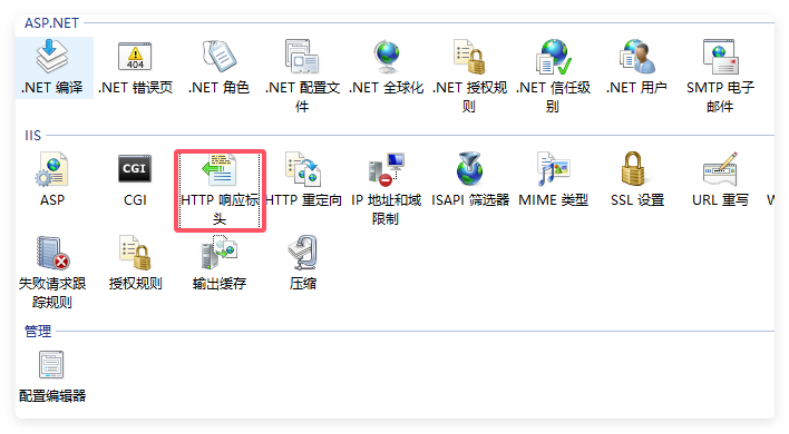
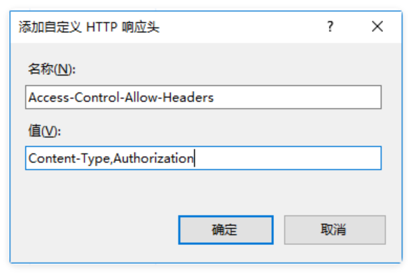
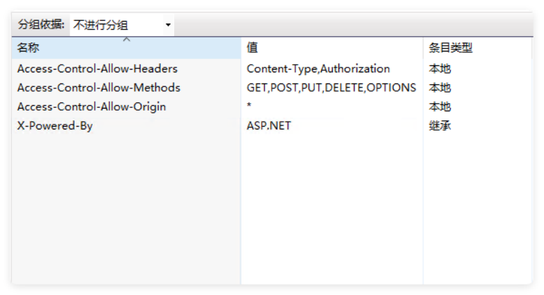
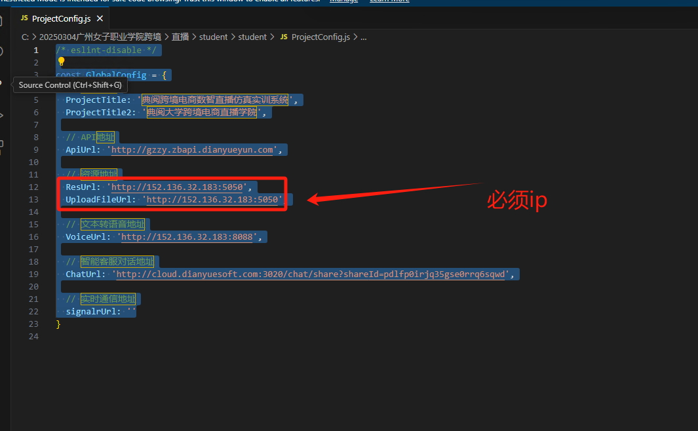

# 新直播系统部署

《典阅跨境电商数智直播仿真实训系统部署安装手册》由湖南典阅科技有限公司于2025年2月发布，内容如下：  
1.	准备环境  
○	服务器：Windows Server。  
○	数据库：Server sql 2016。  
○	软件环境：asp.net core3.1、iis7，推荐客户端Google61。  
2.	基础软件安装  
○	Google浏览器安装：安装包chrome - 64.exe，双击安装。  
○	ASP.NET CORE安装：安装包dotnet - hosting - 3.1.32 - win.exe，优先安装IIS后安装，已安装会提示。  
3.	安装说明  
○	IIS：支持Windows 10操作系统，通过“计算机”右键“管理”添加；Windows 7等可在程序和功能下开启。  
○	数据库安装说明：在Windows server 2016安装SQL Server 2016，输入产品密钥，接受许可条款，按步骤选择功能、配置实例名、服务器账户、身份验证方式等，忽略部分告警安装。  
4.	项目部署  
○	Web项目部署：三个IIS项目（api、管理后台、学生端），管理后台需在IIS配置http响应标头，添加文件夹有要求，API搭建后替换appsettings.json文件夹标识。  
○	项目文件准备：在D盘新建LiveBroadcast文件夹并添加Everyone权限，内部建db和soft文件夹，拷贝系统安装包目录到soft。  
○	IIS项目部署细节：打开IIS管理器添加网站，分别设置api接口、管理后台、学生端的部署路径和端口。  
○	数据库部署：启动SQL Server Management Studio，连接本地数据库，右键还原数据库。  
○	数据库配置修改：在api、后台、学生端的相关配置文件中更改数据库连接信息。  
○	管理员页面检查：用Google浏览器输入网址登录，检查页面功能。  
○	学生端实训中心和考试中心页面检查：打开登录页面，输入账号密码进入系统检查。  
5.	数据库备份  
○	数据库定期备份：利用SQL Server 2016自带维护计划创建备份计划，可选择备份时间、任务、数据库、存放目录等，注意启动SQLSERVER代理服务。  
○	备份数据定期清除：通过批处理脚本删除指定天数前的备份文件。  
6.	Windwos防火墙策略：在Windows防火墙高级设置中新建入站规则，针对特定端口开放。  
7.	错误：针对win7(64)上“Microsoft.Jet.OLEDB.4.0未注册”错误，在IIS应用程序池设置启用32位应用程序为true，发布路径不能有中文，jenkins自动发布版本时X64版本dll无需勾选。

## **<font style="color:rgb(192,80,77);">4.1、Web项目部署</font>**
三个IIS项目（api,管理后台,学生端）

管理后台需要针对IIS进行配置，配置情况如下（如果该站点后续有更新，也需要重复操作该步骤）：

1、选中管理后台网站，选择【http响应标头】



2、点击右键【打开功能】，并添加一下三条配置数据

Access-Control-Allow-Headers：Content-Type,Authorization

Access-Control-Allow-Methods：GET,POST,PUT,DELETE,OPTIONS

Access-Control-Allow-Origin：*

填写完成后如下图所示






添加三个文件夹的说明：文件夹不能是中文。

API搭建完成后，需要对appsettings.json文件夹中的标识进行替换


两个标识都是四位数字，两个标识不能一致，第一个标识建议以5开始，第二标识建议以6开始。每次搭建的站点编码都要不同。

## **<font style="color:rgb(192,80,77);">4.2</font>****<font style="color:rgb(192,80,77);">、项目文件准备</font>**
1.在D盘新建LiveBroadcast文件夹。右击属性添加Everyone权限

<font style="color:rgb(255,0,0);"></font>

2.在LiveBroadcast文件夹建db,soft文件夹（db放数据库，soft放程序）

将安装包中的系统安装包下的目录拷贝到soft目录下


```xml
/* eslint-disable */

const GlobalConfig = {
  // 系统名称
  ProjectTitle: '典阅跨境电商数智直播仿真实训系统',
  ProjectTitle2: '典阅大学跨境电商直播学院',

  // API地址
  ApiUrl: 'http://gzzy.zbapi.dianyueyun.com',

  // 后台地址必须ip地址配置
  ResUrl: 'http://152.136.32.183:5050',
  UploadFileUrl: 'http://152.136.32.183:5050',

  // 文本转语音地址python服务地址
  VoiceUrl: 'http://152.136.32.183:8088',

  // 智能客服对话地址fastapi映射地址
  ChatUrl: 'http://cloud.dianyuesoft.com:3020/chat/share?shareId=pdlfp0irjq35gse0rrq6sqwd',

  // 实时通信地址
  signalrUrl: ''
```




> 更新: 2025-10-29 11:46:40  
> 原文: <https://www.yuque.com/lixinsi/hntyk2/fg91m7v6t9tvtu6h>