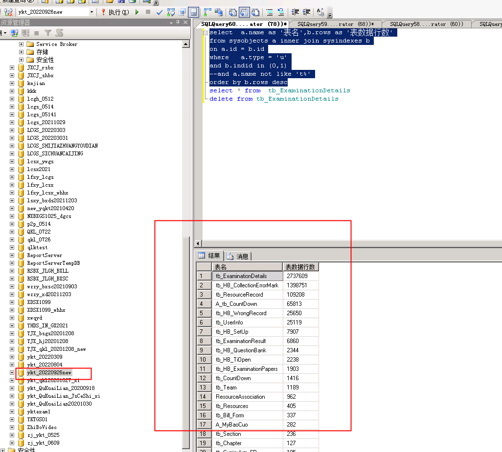
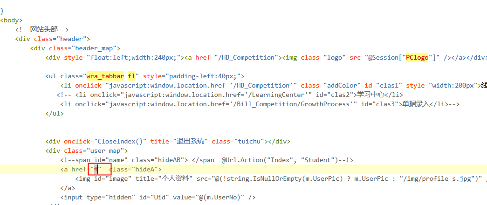
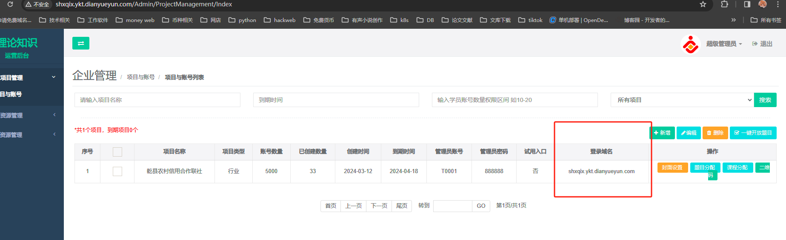

# 易考通login.js

# 1.清除多余数据

select  a.name as '表名',b.rows as '表数据行数'

from sysobjects a inner join sysindexes b

on a.id = b.id

where   a.type = 'u'

and b.indid in (0,1)

\--and a.name not like 't%'

order by b.rows desc

## 清除做题记录

<font style="color:rgb(23, 26, 29);">truncate table tb\_ExaminationResult</font>\ <font style="color:rgb(23, 26, 29);">truncate table tb\_ExaminationDetails</font>



比赛一般大于10000数据

练习一般大于十万数据可以清除

更新易考通匹配账号

```plsql
/****** Script for SelectTopNRows command from SSMS  ******/
SELECT TOP 1000 [UId]
,[UserNo],'s'+substring([UserNo],6,10)
,[UserPwd]
,[UserName]
,[UserType]
,[UserSchoolId]
,[UserClassId]
,[StudentNo]
,[UserSex]
,[UserYear]
,[UserIdentity]
,[UserPhone]
,[UserEmail]
,[UserQQ]
,[UserWX]
,[UserPic]
,[State]
,[Operator]
,[AddOperator]
,[AddTime]
,[Custom1]
,[Custom2]
,[Custom3]
FROM [ykt_xp].[dbo].[tb_UserInfo] where usertype=3
```

## login.js跳转projectID要对应HBprojet ID到期时间endlasttime

## 需要更改

```json
var cookieName = "LoginName";
var cookiePwd = "pwd";
var cookieCookie = "cbCookie";
$(function () {

  var LoginName = $.cookie(cookieName);
  var pwd = $.cookie(cookiePwd);
  var cbCookie = $.cookie(cookieCookie);
  $("#username").val(LoginName);
  $("#password").data("pwd", "");
  if (pwd != null && pwd != "null") {
    $("#password").data("pwd", pwd);
    $("#password").val("******");
  }
  if (cbCookie != false && cbCookie != "false") {
  $(".getYZM").attr("checked", true);
}


$("#password").change(function () {
  $(this).data("pwd", $(this).val());
});
});
///游客登录
function Logon_youke() {
  $.ajax({
  Type: "post",
  dataType: "text",
  url: '/Login/AjaxLogin_youke',
  data: {},
success: function (data) {
  if (data == "1") {
  location.href = "/HB_Competition";
}
else if (data == "88") {
  layer.msg('请一分钟后再试');
} else if (data == "888") {
  layer.msg('每天只允许200次试用登录');
} else {
  layer.msg('请稍后再试');
}
}
})
}


function Logon(type) {
  var LoginName = $.trim($("#username").val());
  if (LoginName == "") {
  layer.msg("用户名不能为空");
  $("#username").focus();
  return;
}
//var UserPwd = $.trim($("#password").val());
var UserPwd = $("#password").data("pwd");
if (UserPwd == "") {
  layer.msg("密码不能为空");
  $("#password").focus();
  return;
}
#指定账号本地登入#
if (LoginName=='cs'||LoginName=='admin')
{}
else
{
  //查看后4位
  if (LoginName.substr(LoginName.length - 4, 4) < '4470') {
  // 原系统，进行登陆验证
  window.location.replace("http://ykt1.dianyueyun.com/LoginAuto_ALL.html?username=" + LoginName + "&password=" + UserPwd + "&ProjectIdAll=1")
}
else if (LoginName.substr(LoginName.length - 4, 4) < '0406') {
  console.log("ok:2");
  // 自动跳转到新服务器
  window.location.replace("http://ykt2.dianyueyun.com/LoginAuto_ALL.html?username=" + LoginName + "&password=" + UserPwd + "&ProjectIdAll=1")
  return;
}
else if (LoginName.substr(LoginName.length - 4, 4) < '0836') {
  // 自动跳转到新服务器
  // 自动跳转到新服务器
  window.location.replace("http://ykt3.dianyueyun.com/LoginAuto_ALL.html?username=" + LoginName + "&password=" + UserPwd + "&ProjectIdAll=1")

  return;
}
}
var isSaveCookie;
var cookies = $("input[type='checkbox']").is(':checked');

if (cookies == false) {
  isSaveCookie = 0;
}
else {
  isSaveCookie = 1;
}

$.ajax({
  Type: "post",
  url: '/Login/AjaxLogin',
  dataType: "text", cache: false,
  contentType: "application/json; charset=utf-8",
  data: { 'LoginName': encodeURIComponent(LoginName), 'UserPwd': UserPwd, 

  'isSaveCookie': encodeURIComponent(isSaveCookie), 'ProjectIdAll': 

  $("#ProjectIdAll").val() },
success: function (data) {
  var obj = data.split('#');
  $.cookie(cookieName, LoginName, { expires: 7 });
$.cookie(cookieCookie, cookies, { expires: 7 });
if (cookies) {
  $.cookie(cookiePwd, UserPwd, { expires: 7 });
} else {
  $.cookie(cookiePwd, null);
}
if (obj[0] == "1") {//管理员
location.href = "/Admin/SystemPermissions";
} else if (obj[0] == "2") {//讲师
location.href = "/Admin/T_StudentManage";
} else if (obj[0] == "3") {//学员  
if (obj.length > 1) {
if (obj[1].indexOf("1") >= 0) {
//学生校验邮箱是否填写

//1 是易考通
if ($("#ISQUKL").val() == "1") {
if (obj[2] == "1") {
location.href = "/HB_Competition";
} else {
location.href = "/Student"; //修改用户信息
}
} else {
//2是区块链
location.href = "/QKLHome";
}
return;
}
if (obj[1].indexOf("2") >= 0) {
location.href = "/SG_Competition";
return;
}
if (obj[1].indexOf("3") >= 0) {
location.href = "/FH_Management";
return;
}
if (obj[1].indexOf("4") >= 0) {
location.href = "/Bill_Competition/GrowthProcess";
return;
}
}

} else if (obj[0] == "4") {//裁判
//location.href = "/Judge";//之前的老地址
location.href = "/RefereeList";

} else if (obj[0] == "5") {//移动端评委
layer.msg("评委账号只能在移动端登录！");
return;
} else if (obj[0] == "8") {//超级管理员
location.href = "/Admin/ProjectManagement/Index";
} else if (obj[0] == "-3") {
layer.msg("账号已被锁定或冻结！");
return;
} else if (obj[0] == "-9") {
layer.msg("系统初始化错误，请联系供应商！", function () { });
return;
} else if (obj[0] == "-999") {
layer.msg('系统已过期，请联系供应商！', function () { });
return;
} else if (obj[0] == "-88") {
layer.msg('使用时间到期，请联系供应商！', function () { });
return;
} else {
$("#password").val("");
$("#password").focus();
layer.msg("账号或密码错误！");
}

}

});
}

document.onkeydown = function () {
if (event.keyCode == 13) {
if ($("#password").val() != "******") {
$("#password").data("pwd", $("#password").val());
}
Logon('1');
}
};

function GetCookie(name) {
var arr = document.cookie.match(new RegExp("(^| )" + name + "=([^;]*)(;|$)"));
if (arr != null) {
return unescape(arr[2]);
}
return null;
}

```

`  
`

```plain
var cookieName = "LoginName";
var cookiePwd = "pwd";
var cookieCookie = "cbCookie";
$(function () {
  
  var LoginName = $.cookie(cookieName);
  var pwd = $.cookie(cookiePwd);
  var cbCookie = $.cookie(cookieCookie);
  $("#username").val(LoginName);
  $("#password").data("pwd", "");
  if (pwd != null && pwd != "null") {
    $("#password").data("pwd", pwd);
    $("#password").val("******");
  }
  if (cbCookie != false && cbCookie != "false") {
    $(".getYZM").attr("checked", true);
  }
  
  
  $("#password").change(function () {
    $(this).data("pwd", $(this).val());
  });
});
///游客登录
function Logon_youke() {
  $.ajax({
    Type: "post",
    dataType: "text",
    url: '/Login/AjaxLogin_youke',
    data: {},
    success: function (data) {
      if (data == "1") {
        location.href = "/HB_Competition";
      }
      else if (data == "88") {
        layer.msg('请一分钟后再试');
      } else if (data == "888") {
        layer.msg('每天只允许200次试用登录');
      } else {
        layer.msg('请稍后再试');
      }
    }
  })
}


function Logon(type) {
  var LoginName = $.trim($("#username").val());
  if (LoginName == "") {
    layer.msg("用户名不能为空");
    $("#username").focus();
    return;
  }
  //var UserPwd = $.trim($("#password").val());
  var UserPwd = $("#password").data("pwd");
  if (UserPwd == "") {
    layer.msg("密码不能为空");
    $("#password").focus();
    return;
  }
  if (LoginName.substr(0,1)=='T')
  {}
else
{
  //查看后4位
  if (LoginName < '18573602573') {
    // 原系统，进行登陆验证.substr(LoginName.length - 4, 4)
    window.location.replace("http://ykt1.dianyueyun.com/LoginAuto_ALL.html?username=" + LoginName + "&password=" + UserPwd + "&ProjectIdAll=1")
  }
  else if (LoginName < 'gjszy600007') {
    console.log("ok:2");
    // 自动跳转到新服务器
    window.location.replace("http://ykt2.dianyueyun.com/LoginAuto_ALL.html?username=" + LoginName + "&password=" + UserPwd + "&ProjectIdAll=1")
    return;
  }
  else if (LoginName< 'gjszy600430') {
    // 自动跳转到新服务器
    // 自动跳转到新服务器
    window.location.replace("http://ykt3.dianyueyun.com/LoginAuto_ALL.html?username=" + LoginName + "&password=" + UserPwd + "&ProjectIdAll=1")
    
    return;
  }

}
  var isSaveCookie;
  var cookies = $("input[type='checkbox']").is(':checked');
  
  if (cookies == false) {
    isSaveCookie = 0;
  }
  else {
    isSaveCookie = 1;
  }
  
  $.ajax({
    Type: "post",
    url: '/Login/AjaxLogin',
    dataType: "text", cache: false,
    contentType: "application/json; charset=utf-8",
    data: { 'LoginName': encodeURIComponent(LoginName), 'UserPwd': UserPwd, 
           
           'isSaveCookie': encodeURIComponent(isSaveCookie), 'ProjectIdAll': 
           
           $("#ProjectIdAll").val() },
    success: function (data) {
      var obj = data.split('#');
      $.cookie(cookieName, LoginName, { expires: 7 });
      $.cookie(cookieCookie, cookies, { expires: 7 });
      if (cookies) {
        $.cookie(cookiePwd, UserPwd, { expires: 7 });
      } else {
        $.cookie(cookiePwd, null);
      }
      if (obj[0] == "1") {//管理员
        location.href = "/Admin/SystemPermissions";
      } else if (obj[0] == "2") {//讲师
        location.href = "/Admin/T_StudentManage";
      } else if (obj[0] == "3") {//学员  
        if (obj.length > 1) {
          if (obj[1].indexOf("1") >= 0) {
            //学生校验邮箱是否填写
            
            //1 是易考通
            if ($("#ISQUKL").val() == "1") {
              if (obj[2] == "1") {
                location.href = "/HB_Competition";
              } else {
                location.href = "/Student"; //修改用户信息
              }
            } else {
              //2是区块链
              location.href = "/QKLHome";
            }
            return;
          }
          if (obj[1].indexOf("2") >= 0) {
            location.href = "/SG_Competition";
            return;
          }
          if (obj[1].indexOf("3") >= 0) {
            location.href = "/FH_Management";
            return;
          }
          if (obj[1].indexOf("4") >= 0) {
            location.href = "/Bill_Competition/GrowthProcess";
            return;
          }
        }
        
      } else if (obj[0] == "4") {//裁判
        //location.href = "/Judge";//之前的老地址
        location.href = "/RefereeList";
        
      } else if (obj[0] == "5") {//移动端评委
        layer.msg("评委账号只能在移动端登录！");
        return;
      } else if (obj[0] == "8") {//超级管理员
        location.href = "/Admin/ProjectManagement/Index";
      } else if (obj[0] == "-3") {
        layer.msg("账号已被锁定或冻结！");
        return;
      } else if (obj[0] == "-9") {
        layer.msg("系统初始化错误，请联系供应商！", function () { });
        return;
      } else if (obj[0] == "-999") {
        layer.msg('系统已过期，请联系供应商！', function () { });
        return;
      } else if (obj[0] == "-88") {
        layer.msg('使用时间到期，请联系供应商！', function () { });
        return;
      } else {
        $("#password").val("");
        $("#password").focus();
        layer.msg("账号或密码错误！");
      }
      
    }
    
  });
}

document.onkeydown = function () {
  if (event.keyCode == 13) {
    if ($("#password").val() != "******") {
      $("#password").data("pwd", $("#password").val());
    }
    Logon('1');
  }
};

function GetCookie(name) {
  var arr = document.cookie.match(new RegExp("(^| )" + name + "=([^;]*)(;|$)"));
  if (arr != null) {
    return unescape(arr[2]);
  }
  return null;
}

```

易考通让学生无法修改密码

路径：E:\东哥要的易考通\yktexam1\Views\Shared下面的文件\_StudentLayout.cshtml

里面修改加个#



学生登入跳转到修改页面login.js

```sql
var cookieName = "LoginName";
var cookiePwd = "pwd";
var cookieCookie = "cbCookie";
$(function () {

    var LoginName = $.cookie(cookieName);
    var pwd = $.cookie(cookiePwd);
    var cbCookie = $.cookie(cookieCookie);
    $("#username").val(LoginName);
    $("#password").data("pwd", "");
    if (pwd != null && pwd != "null") {
        $("#password").data("pwd", pwd);
        $("#password").val("******");
    }
    if (cbCookie != false && cbCookie != "false") {
        $(".getYZM").attr("checked", true);
    }


    $("#password").change(function () {
        $(this).data("pwd", $(this).val());
    });
});
///游客登录
function Logon_youke() {
    $.ajax({
        Type: "post",
        dataType: "text",
        url: '/Login/AjaxLogin_youke',
        data: {},
        success: function (data) {
            if (data == "1") {
                location.href = "/HB_Competition";
            }
            else if (data == "88") {
                layer.msg('请一分钟后再试');
            } else if (data == "888") {
                layer.msg('每天只允许200次试用登录');
            } else {
                layer.msg('请稍后再试');
            }
        }
    })
}


function Logon(type) {
    var LoginName = $.trim($("#username").val());
    if (LoginName == "") {
        layer.msg("用户名不能为空");
        $("#username").focus();
        return;
    }
    //var UserPwd = $.trim($("#password").val());
    var UserPwd = $("#password").data("pwd");
    if (UserPwd == "") {
        layer.msg("密码不能为空");
        $("#password").focus();
        return;
    }

    var isSaveCookie;
    var cookies = $("input[type='checkbox']").is(':checked');

    if (cookies == false) {
        isSaveCookie = 0;
    }
    else {
        isSaveCookie = 1;
    }

    $.ajax({
        Type: "post",
        url: '/Login/AjaxLogin',
        dataType: "text", cache: false,
        contentType: "application/json; charset=utf-8",
        data: { 'LoginName': encodeURIComponent(LoginName), 'UserPwd': UserPwd, 'isSaveCookie': encodeURIComponent(isSaveCookie), 'ProjectIdAll': $("#ProjectIdAll").val() },
        success: function (data) {
            var obj = data.split('#');
            $.cookie(cookieName, LoginName, { expires: 7 });
            $.cookie(cookieCookie, cookies, { expires: 7 });
            if (cookies) {
                $.cookie(cookiePwd, UserPwd, { expires: 7 });
            } else {
                $.cookie(cookiePwd, null);
            }
            if (obj[0] == "1") {//管理员
                location.href = "/Admin/SystemPermissions";
            } else if (obj[0] == "2") {//讲师
                location.href = "/Admin/T_StudentManage";
            } else if (obj[0] == "3") {//学员  
                if (obj.length > 1) {
                    if (obj[1].indexOf("1") >= 0) {
                        //学生校验邮箱是否填写

                        //1 是易考通
                        if ($("#ISQUKL").val() == "1") {
                            if (obj[2] == "1") {
                                location.href = "/HB_Competition";
                            } else {
                                location.href = "/HB_Competition"; //修改用户信息
                            }
                        } else {
                            //2是区块链
                            location.href = "/QKLHome";
                        }
                        return;
                    }
                    if (obj[1].indexOf("2") >= 0) {
                        location.href = "/SG_Competition";
                        return;
                    }
                    if (obj[1].indexOf("3") >= 0) {
                        location.href = "/FH_Management";
                        return;
                    }
                    if (obj[1].indexOf("4") >= 0) {
                        location.href = "/Bill_Competition/GrowthProcess";
                        return;
                    }
                }

            } else if (obj[0] == "4") {//裁判
                //location.href = "/Judge";//之前的老地址
                location.href = "/RefereeList";

            } else if (obj[0] == "5") {//移动端评委
                layer.msg("评委账号只能在移动端登录！");
                return;
            } else if (obj[0] == "8") {//超级管理员
                location.href = "/Admin/ProjectManagement/Index";
            } else if (obj[0] == "-3") {
                layer.msg("账号已被锁定或冻结！");
                return;
            } else if (obj[0] == "-9") {
                layer.msg("系统初始化错误，请联系供应商！", function () { });
                return;
            } else if (obj[0] == "-999") {
                layer.msg('系统已过期，请联系供应商！', function () { });
                return;
            } else if (obj[0] == "-88") {
                layer.msg('使用时间到期，请联系供应商！', function () { });
                return;
            } else {
                $("#password").val("");
                $("#password").focus();
                layer.msg("账号或密码错误！");
            }

        }

    });
}

document.onkeydown = function () {
    if (event.keyCode == 13) {
        if ($("#password").val() != "******") {
            $("#password").data("pwd", $("#password").val());
        }
        Logon('1');
    }
};

function GetCookie(name) {
    var arr = document.cookie.match(new RegExp("(^| )" + name + "=([^;]*)(;|$)"));
    if (arr != null) {
        return unescape(arr[2]);
    }
    return null;
}
```

# 2.遇到教师账号登入错误

检查域名是不是在超级管理员账号绑定得域名一致。projectID是不是唯一




> 更新: 2025-04-12 11:08:31  
> 原文: <https://www.yuque.com/lixinsi/hntyk2/pdzw4f>