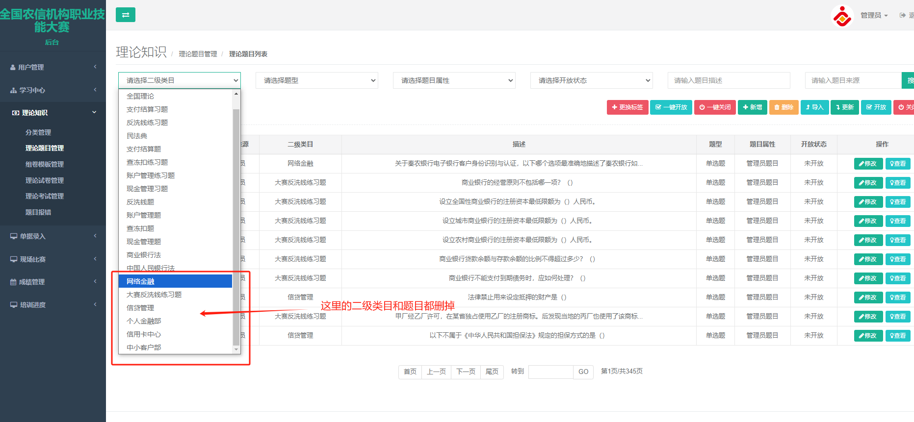
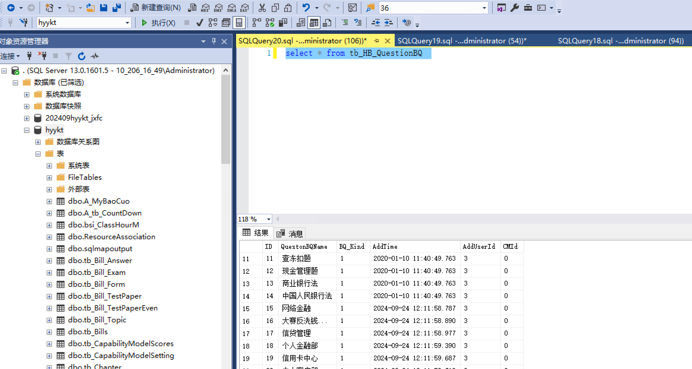
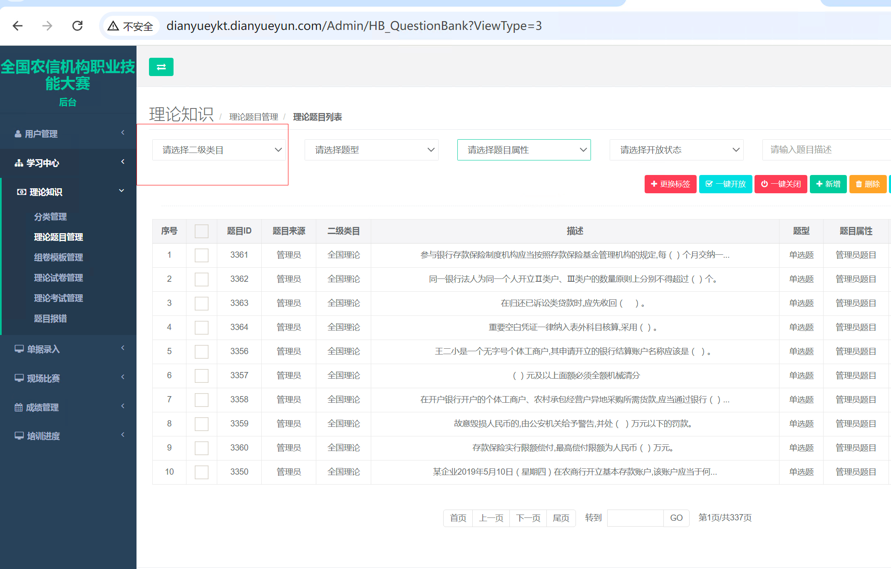
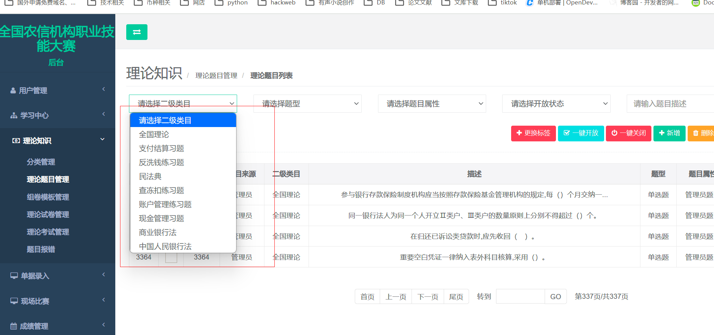
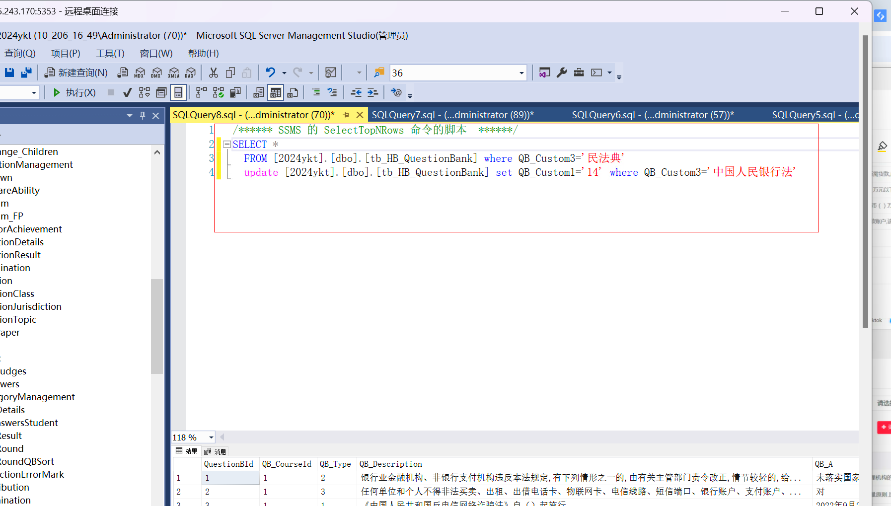
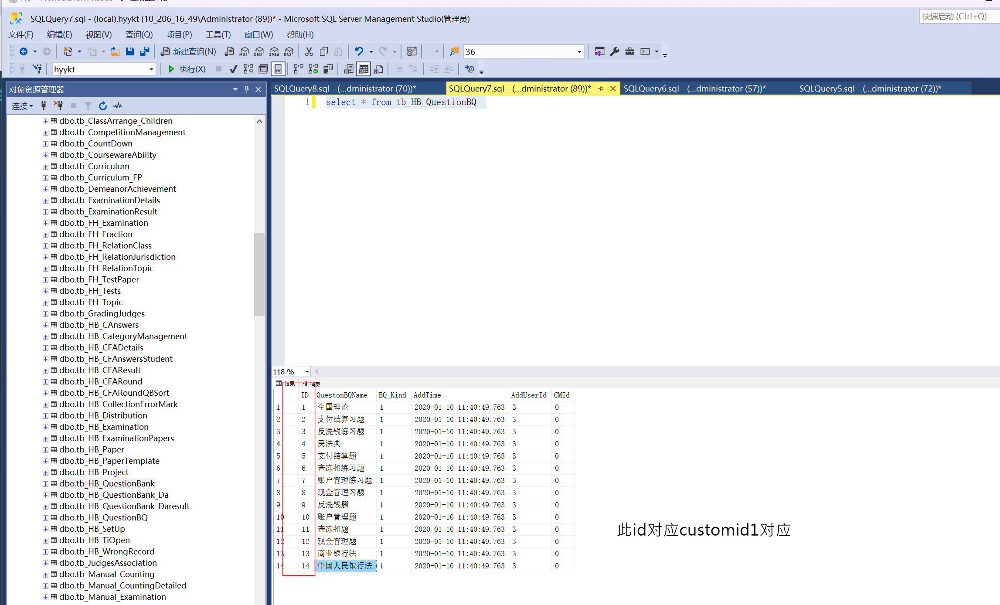

# 易考通删除二级类目栏目以及理论题都变成未使用过的题目题目

删除题目

```plain
delete * from [hyykt].[dbo].[tb_HB_QuestionBank] 
```



### 删除特定的二级类目题目
```plain
select * from tb_HB_QuestionBQ
delete from tb_HB_QuestionBQ where ID=49

select * from tb_HB_QuestionBank where QB_Custom1=49

delete from tb_HB_QuestionBank  where QB_Custom1=49 
```

```python
--题目关联表格tb_HB_QuestionBank关联字段QB_Custom1
select * from [hyykt].[dbo].[tb_HB_QuestionBank] where  [QB_Custom1]='18'

```

```python
DELETE a
FROM tb_HB_QuestionBank a
INNER JOIN tb_UserInfo b ON a.QB_AddOperator = b.UId
INNER JOIN tb_HB_QuestionBQ c ON a.QB_Custom1 = c.ID
LEFT JOIN tb_HB_CategoryManagement d ON d.Id = c.CMId
LEFT JOIN tb_HB_Project e ON a.QB_ProjectId = e.Id
WHERE QB_State = 1 
  AND QB_Custom1 = '24' 
  AND (QB_AddOperator = 3 
       OR (QB_Custom1 IN (
           SELECT DISTINCT QuestionBQID 
           FROM tb_HB_Distribution 
           WHERE ProjectId = 6
       ) AND QB_Kind = 8));

```



```python
delete from [tb_HB_QuestionBank] 
truncate table tb_HB_QuestionBQ
```

```python
delete * from [hyykt].[dbo].[tb_HB_QuestionBank] 
select * from tb_HB_QuestionBQ  
delete from  tb_HB_QuestionBQ where ID='1'
delete from  tb_HB_QuestionBQ where ID='2'
delete from  tb_HB_QuestionBQ where ID='3'
delete from  tb_HB_QuestionBQ where ID='4'
delete from  tb_HB_QuestionBQ where ID='5'
delete from  tb_HB_QuestionBQ where ID='6'
delete from  tb_HB_QuestionBQ where ID='7'
delete from  tb_HB_QuestionBQ where ID='8'
delete from  tb_HB_QuestionBQ where ID='9'
delete from  tb_HB_QuestionBQ where ID='10'
delete from  tb_HB_QuestionBQ where ID='11'
delete from  tb_HB_QuestionBQ where ID='12'
delete from  tb_HB_QuestionBQ where ID='13'
delete from  tb_HB_QuestionBQ where ID='14'
delete from  tb_HB_QuestionBQ where ID='15'
```










### 理论题都变成未使用过的题目
truncate  table [2024_sm].[dbo].[tb_HB_ExaminationPapers]


> 更新: 2026-02-27 08:54:13  
> 原文: <https://www.yuque.com/lixinsi/hntyk2/stxdmcesbqps0vlg>