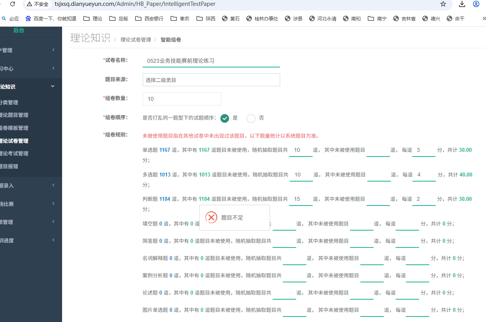
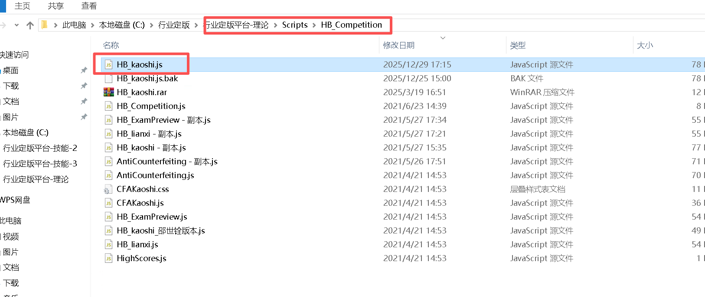

# 易考通显示题目不足



更新 bin 目录以及

[附件: HB_kaoshi.js](./attachments/2_0Q259cOWkrHbnQ/HB_kaoshi.js)

### 学生端没有题目显示




```json
/***************************************************************
FileName:理论知识 做题 javascript
Copyright（c）2017-金融教育在线技术开发部
Author:袁学
Create Date:2017-4-12
******************************************************************/

function getQueryString(name) {
  var reg = new RegExp("(^|&)" + name + "=([^&]*)(&|$)", "i");
  var r = window.location.search.substr(1).match(reg);
  if (r != null) return unescape(r[2]); return null;
}
var timeExam;
var currentTime;
var startTestTime;
var AddStartDateTime;
var E_StartTime;
var E_EndTime;

var Pid = "";
var Eid = "";
$(function () {
  Eid = getQueryString('Eid');
  Pid = getQueryString('Pid');

  if (Pid == null || Eid == null || Pid == "" || Eid == "") {
  return;
}

//考试模式下已经提交过了直接跳转到成绩页面
if ($("#Isallow").val() == "1") {
  window.location.href = "/HB_kaoshi/GetScoresIndex?Pid=" + Pid + "&Eid=" + Eid + "&Type=1";
  return;
}

currentTime = stringToDate($("#CurrentTime").val());//当前时间
AddStartDateTime = stringToDate($("#AddStartDateTime").val());//当前进入时间 算开始 开始时间
startTestTime = stringToDate($("#TestStartDateTime").val()); //考试结束时间结束时间
E_StartTime = stringToDate($("#E_StartTime").val());//有效开始时间
E_EndTime = stringToDate($("#E_EndTime").val());//有效结束时间

$.ajax({
  url: '/ashx/TimeHandler.ashx',
  cache: false,
  success: function (data) {

  if (data.length > 16) {
  $("#CurrentTime").val(data);
  currentTime = stringToDate(data);

}
}
});

//标记
$(".shoucang_map").click(function () {
  if ($(this).hasClass("shouhui")) {
  $(this).html("<div class='qieti_fx'></div><div class='qieti_hr'>-------------</div><div>已标记</div>");
  $(this).removeClass("shouhui");
  Isshouchang(1);
} else {
  $(this).html("<div class='qieti_fx'></div><div class='qieti_hr'>-------------</div><div>标记</div>");
  $(this).addClass("shouhui");
  Isshouchang(0);
}
});

// currentTime当前时间 
if (E_StartTime > currentTime) {//如果有效开始时间大于当前时间 那么 还是倒计时页面
  $("#MinDiv").css('display', 'none');
  var bodyWidth = document.documentElement.clientWidth;
  var bodyHeight = Math.max(document.documentElement.clientHeight, document.body.scrollHeight);

  $("<div class='wrapTime'><iframe src='/HB_kaoshi/TimeIndex?Eid=" + Eid + "&Pid=" + Pid + "' id='ifmhtml' style='width:" + bodyWidth + "px; height:" + bodyHeight + "px' scrolling='no'></iframe></div>").appendTo("body");
  $(".wrapTime").width(bodyWidth);
  $(".wrapTime").height(bodyHeight);

} else {
  $("#MinDiv").css('display', 'blcok');
}

//如果没有提交 当前时间大于学员实际剩余做题时间
if (currentTime > startTestTime) {
  //数据提交
  $.ajax({
  Type: "post",
  dataType: "json",
  url: '/HB_kaoshi/UpDateTime?Eid=' + Eid + '&Pid=' + Pid + '&Type=1',
            async: false,
            success: function (data) {
                Add();
            }
        })

    }
    //var Second = $("#Second").val();
    //timer(Second);
    timeExam = setInterval("Time()", 1000);
    selectType(1);//题型选择


})

var aixi = 0;
//头部12种题型选择
function selectType(type) {
    
    
    if (xTid != 0) {
        InsertIntoResult(xTid);
    }
    //头部题型选择样式控制
    for (var i = 1; i < 14; i++) {
        $("#Typeli" + i).css("display", "none");//所有的先隐藏
        $("#Typeli" + i).removeClass('active');
    }

    var alltype = 0;
    //控制当前是什么题型
    $.ajax({
        url: "/HB_kaoshi/GetTypeNum",
        data: { "Pid": Pid },
        type: 'POST',
        async: false,
        dataType: 'json',
        success: function (data) {
            $("#titleScore").html('');
            if (data.length > 0) {
                //获取本次考试第一个类型题目
                if (parseInt(data[0]["QB_Type"]) != 1 && aixi == 0) {
                    alltype = parseInt(data[0]["QB_Type"]);

                }

                for (var i = 0; i < data.length; i++) {
                    $("#Typeli" + data[i]["QB_Type"]).css("display", "block");
                    //与题型当前相等的时候
                    if (aixi == 0) { //首次刷新
                        $("#titleScore").html(GetTiType(data[0]["QB_Type"]) + '（共' + data[0]["Tnum"] + '题，总计' + parseFloat(data[0]["Tscoers"]).toFixed(2) + '分，当前题<span id="newQBId"></span>分）');

                    } else {
                        if (type == parseInt(data[i]["QB_Type"])) {
                            $("#titleScore").html(GetTiType(type) + '（共' + data[i]["Tnum"] + '题，总计' + parseFloat(data[i]["Tscoers"]).toFixed(2) + '分，当前题<span id="newQBId"></span>分）');
                        }
                    }
                }

            } else {
                layer.alert('试卷不存在', {
                    skin: 'layui-layer-lan' //样式类名  自定义样式
                    , closeBtn: 1    // 是否显示关闭按钮
                    , anim: 1 //动画类型
                    , btn: ['确认'] //按钮
                    , icon: 7    // icon
                    , yes: function () {
                        window.close();//确认按钮

                    }, cancel: function () {
                        window.close();//关闭提示
                    }

                });
            }
        }
    });

    //如果类型题目不是单选题 那就冲洗为类型赋值
    if (alltype != 0) {
        type = alltype;
    }

    //题型选择样式
    $("#Typeli" + type).addClass('active');

    //数据清理
    xTid = 0;
    xT_type = 0;
    yx_bianliang = ",";
    yx_bianliang_biaoji = ",";
    quanjuY = 0;
    quanjuQBIdALL = "";

    BindQuestionNo(type);//题号加载
    Bindinfo(quanjuQBIdALL[0]);//做题内容加载
    //题型默认第一个
    $("#YXthxz" + xTid).removeClass('color_no'); //移除未回答样式
    $("#YXthxz" + xTid).removeClass('color_sure'); //移除已回答样式
    $("#YXthxz" + xTid).removeClass('color_now active'); //移除选中
    $("#YXthxz" + xTid).removeClass('color_biaoji'); //移除标记样式
    //当前题添加选中样式
    $("#YXthxz" + xTid).addClass('color_now active');

    GOtiColor(type);//样式加载
    aixi = 1;
}

//返回题型中文名
function GetTiType(type) {
    if (type == 1) {
        return "单选题";
    }
    if (type == 2) {
        return "多选题";
    }
    if (type == 3) {
        return "判断题";
    }
    if (type == 4) {
        return "填空题";
    }
    if (type == 5) {
        return "简答题";
    }
    if (type == 6) {
        return "名词解释题";
    }
    if (type == 7) {
        return "案例分析题";
    }
    if (type == 8) {
        return "论述题";
    }
    if (type == 9) {
        return "图片单选题";
    }
    if (type == 10) {
        return "图片多选题";
    }
    if (type == 11) {
        return "动画单选题";
    }
    if (type == 12) {
        return "动画多选题";
    }
    if (type == 13) {
        return "实务题";
    }
    return "";
}


//绑定加载左边题号 type=试题类型
function BindQuestionNo(type) {
    $.ajax({
        url: "/HB_kaoshi/KaoShiByPId_ZQList",
        data: { "Pid": Pid, "isto": "1", "Eid": Eid, "QB_Type": type },
        type: 'POST',
        async: false,
        dataType: 'json',
        success: function (data) {
            var html = "";
            if (data != null && data.length > 0) {
                var ALLQBId = "";//题id拼接
                //总长度
                zongcounnum = data.length;

                for (var y = 0; y < data.length; y++) {
                    var T_Type = parseInt(data[y]["QB_Type"]);//题型
                    var QBId = data[y]["QuestionBId"];//题id

                    ALLQBId += QBId + ","
                    //题号
                    var thNum = (y + 1) + "";
                    if (y < 9) {
                        thNum = "0" + (y + 1);
                    }

                    html += '<li class="num_sty"  onclick="djth(' + QBId + ',' + y + ')"><span class="num_bj color_no" id="YXthxz' + QBId + '">' + thNum + '</span></li>';
                }
                quanjuQBIdALL = ALLQBId.split(',');
            }

            $("#thdiv").html(html);
        }
    });
}


var xTid = 0; //当前qbid
var xT_type = 0;
var yx_bianliang = ",";
var yx_bianliang_biaoji = ",";
var quanjuY = 0;//全局游标
var zongcounnum = 0;//总长度
//全局 存了当前题型试题ID 
var quanjuQBIdALL; //

//绑定右边试题数据
function Bindinfo(QBId) {
    $.ajax({
        url: "/HB_kaoshi/GetQuestionBankByIdAndPidGet",
        data: { "QuestionBId": QBId, "Pid": Pid },
        type: 'POST',
        async: false,
        dataType: 'json',
        success: function (data) {
            $("#titleDescription").html('');
            $("#daanContent").html('');
            $("#daanContent").removeClass("sjzsss")
            if (data != null && data.length > 0) {
                var T_Type = parseInt(data[0]["QB_Type"]); //题型
                var xuhao = 0;//序号
                if (quanjuY == 0) {
                    xuhao = 1;
                } else {
                    xuhao = quanjuY + 1;
                }
                //是否标记
                var shouchang = data[0]["shouchang"];

                if (shouchang == 1) {
                    $(".shoucang_map").html("<div class='qieti_fx'></div><div class='qieti_hr'>-------------</div><div>已标记</div>");
                    $(".shoucang_map").removeClass("shouhui");
                } else {
                    $(".shoucang_map").html("<div class='qieti_fx'></div><div class='qieti_hr'>-------------</div><div>标记</div>");
                    $(".shoucang_map").addClass("shouhui");
                }

                //当前题多少分
                $("#newQBId").html(data[0]["EP_Score"]);
                $("#titleDescription").html(xuhao + "、" + HTMLDecode(data[0]["QB_Description"]));//题目描述

                var daanHtml = "";

                xTid = data[0]["QuestionBId"];
                xT_type = parseInt(data[0]["QB_Type"]);

                if (T_Type == 1) { //单选题
                    if (data[0]["QB_A"] != "" && data[0]["QB_A"].length > 0) {
                        daanHtml += "<div class=\"state_xz\"><span class=\"bt_xz\" id=\"danxA" + xTid + "\"  onclick=\"BindTNum('" + xTid + "','1','A')\">A</span><span>" + data[0]["QB_A"] + "</span></div>";
                    }
                    if (data[0]["QB_B"] != "" && data[0]["QB_B"].length > 0) {
                        daanHtml += "<div class=\"state_xz\"><span class=\"bt_xz\" id=\"danxB" + xTid + "\"  onclick=\"BindTNum('" + xTid + "','1','B')\">B</span><span>" + data[0]["QB_B"] + "</span></div>";
                    }
                    if (data[0]["QB_C"] != "" && data[0]["QB_C"].length > 0) {
                        daanHtml += "<div class=\"state_xz\"><span class=\"bt_xz\" id=\"danxC" + xTid + "\"  onclick=\"BindTNum('" + xTid + "','1','C')\">C</span><span>" + data[0]["QB_C"] + "</span></div>";
                    }
                    if (data[0]["QB_D"] != "" && data[0]["QB_D"].length > 0) {
                        daanHtml += "<div class=\"state_xz\"><span class=\"bt_xz\" id=\"danxD" + xTid + "\"  onclick=\"BindTNum('" + xTid + "','1','D')\">D</span><span>" + data[0]["QB_D"] + "</span></div>";
                    }
                }

                //图片单选题 动画单选题
                if (T_Type == 9 || T_Type == 11) {

                    //图片单选题
                    if (T_Type == 9) {
                        //题干图片
                        var Subjecttrunk = data[0]["Subjecttrunk"] + "";
                        //存在题干图片
                        if (Subjecttrunk.length > 0) {
                            var tturl = '';
                            var SubjecttrunkList = Subjecttrunk.split('|');
                            for (var r = 0; r < SubjecttrunkList.length; r++) {
                                if (SubjecttrunkList[r] != "" && SubjecttrunkList[r].length > 0) {
                                    tturl += "<div style='margin:10px; cursor:pointer;'></div>";
                                }
                            }

                            $("#titleDescription").append(tturl);
                        }
                    }
                    //动画单选
                    if (T_Type == 11) {

                        //题干图片
                        var Subjecttrunk = data[0]["Subjecttrunk"] + "";
                        //存在题干图片
                        if (Subjecttrunk.length > 0) {
                            var tturl = "<div style='margin:10px; cursor:pointer;'><video id=\"myVideo\"  controls preload=\"auto\" style=\"max-width: 90%;\"" +
                                "poster=\"\" " +
                                "src=\"" + Subjecttrunk + "\"></video></div>";

                            $("#titleDescription").append(tturl);
                        }

                    }

                    if (data[0]["QB_A"] != "" && data[0]["QB_A"].length > 0) {
                        daanHtml += "<div class=\"state_xz\"><span class=\"bt_xz\" id=\"danxA" + xTid + "\"  onclick=\"BindTNum('" + xTid + "','1','A')\">A</span><span>" + data[0]["QB_A"] + "</span></div> ";

                        //选项图片
                        if (data[0]["OptionA"] != "" && data[0]["OptionA"].length > 0) {

                            daanHtml += "<div style='margin:10px; cursor:pointer;'></div>";


                        }
                    }
                    if (data[0]["QB_B"] != "" && data[0]["QB_B"].length > 0) {
                        daanHtml += "<div class=\"state_xz\"><span class=\"bt_xz\" id=\"danxB" + xTid + "\"  onclick=\"BindTNum('" + xTid + "','1','B')\">B</span><span>" + data[0]["QB_B"] + "</span></div>  ";
                        //选项图片
                        if (data[0]["OptionB"] != "" && data[0]["OptionB"].length > 0) {
                            daanHtml += "<div style='margin:10px; cursor:pointer;'></div>";
                        }
                    }
                    if (data[0]["QB_C"] != "" && data[0]["QB_C"].length > 0) {
                        daanHtml += "<div class=\"state_xz\"><span class=\"bt_xz\" id=\"danxC" + xTid + "\"  onclick=\"BindTNum('" + xTid + "','1','C')\">C</span><span>" + data[0]["QB_C"] + "</span></div>  ";
                        //选项图片
                        if (data[0]["OptionC"] != "" && data[0]["OptionC"].length > 0) {
                            daanHtml += "<div style='margin:10px; cursor:pointer;'></div>";
                        }
                    }
                    if (data[0]["QB_D"] != "" && data[0]["QB_D"].length > 0) {
                        daanHtml += "<div class=\"state_xz\"><span class=\"bt_xz\" id=\"danxD" + xTid + "\"  onclick=\"BindTNum('" + xTid + "','1','D')\">D</span><span>" + data[0]["QB_D"] + "</span></div> ";
                        //选项图片
                        if (data[0]["OptionD"] != "" && data[0]["OptionD"].length > 0) {
                            daanHtml += "<div style='margin:10px; cursor:pointer;'></div>";
                        }
                    }
                }


                if (T_Type == 2) { //多选题

                    if (data[0]["QB_A"] != "" && data[0]["QB_A"].length > 0) {
                        daanHtml += "<div class=\"state_xz\"><span class=\"bt_xz\" id=\"duoxA" + xTid + "\"  onclick=\"BindTNum('" + xTid + "','2','A')\">A</span><span>" + data[0]["QB_A"] + "</span></div>";
                    }
                    if (data[0]["QB_B"] != "" && data[0]["QB_B"].length > 0) {
                        daanHtml += "<div class=\"state_xz\"><span class=\"bt_xz\" id=\"duoxB" + xTid + "\"  onclick=\"BindTNum('" + xTid + "','2','B')\">B</span><span>" + data[0]["QB_B"] + "</span></div>";
                    }
                    if (data[0]["QB_C"] != "" && data[0]["QB_C"].length > 0) {

                        daanHtml += "<div class=\"state_xz\"><span class=\"bt_xz\" id=\"duoxC" + xTid + "\"  onclick=\"BindTNum('" + xTid + "','2','C')\">C</span><span>" + data[0]["QB_C"] + "</span></div>";
                    }
                    if (data[0]["QB_D"] != "" && data[0]["QB_D"].length > 0) {

                        daanHtml += "<div class=\"state_xz\"><span class=\"bt_xz\" id=\"duoxD" + xTid + "\"  onclick=\"BindTNum('" + xTid + "','2','D')\">D</span><span>" + data[0]["QB_D"] + "</span></div>";
                    }
                    if (data[0]["QB_E"] != null && data[0]["QB_E"].length > 0) {
                        daanHtml += "<div class=\"state_xz\"><span class=\"bt_xz\" id=\"duoxE" + xTid + "\"  onclick=\"BindTNum('" + xTid + "','2','E')\">E</span><span>" + data[0]["QB_E"] + "</span></div>";
                    }
                }

                //
                if (T_Type == 10 || T_Type == 12) { //图片多选题 动画u多选题
                    if (T_Type == 10) {
                        //题干图片
                        var Subjecttrunk = data[0]["Subjecttrunk"] + "";
                        //存在题干图片
                        if (Subjecttrunk.length > 0) {
                            var tturl = '';
                            var SubjecttrunkList = Subjecttrunk.split('|');
                            for (var r = 0; r < SubjecttrunkList.length; r++) {
                                if (SubjecttrunkList[r] != "" && SubjecttrunkList[r].length > 0) {
                                    tturl += "<div style='margin:10px; cursor:pointer;'></div>";
                                }
                            }

                            $("#titleDescription").append(tturl);
                        }
                    }

                    //动画单选
                    if (T_Type == 12) {

                        //题干图片
                        var Subjecttrunk = data[0]["Subjecttrunk"] + "";
                        //存在题干图片
                        if (Subjecttrunk.length > 0) {
                            var tturl = "<div style='margin:10px; cursor:pointer;'><video id=\"myVideo\"  controls preload=\"auto\" style=\"max-width: 90%;\"" +
                                "poster=\"\" " +
                                "src=\"" + Subjecttrunk + "\"></video></div>";

                            $("#titleDescription").append(tturl);
                        }

                    }

                    if (data[0]["QB_A"] != "" && data[0]["QB_A"].length > 0) {
                        daanHtml += "<div class=\"state_xz\"><span class=\"bt_xz\" id=\"duoxA" + xTid + "\"  onclick=\"BindTNum('" + xTid + "','2','A')\">A</span><span>" + data[0]["QB_A"] + "</span></div>";
                        //选项图片
                        if (data[0]["OptionA"] != "" && data[0]["OptionA"].length > 0) {
                            daanHtml += "<div style='margin:10px; cursor:pointer;'></div>";
                        }
                    }
                    if (data[0]["QB_B"] != "" && data[0]["QB_B"].length > 0) {
                        daanHtml += "<div class=\"state_xz\"><span class=\"bt_xz\" id=\"duoxB" + xTid + "\"  onclick=\"BindTNum('" + xTid + "','2','B')\">B</span><span>" + data[0]["QB_B"] + "</span></div>";
                        //选项图片
                        if (data[0]["OptionB"] != "" && data[0]["OptionB"].length > 0) {
                            daanHtml += "<div style='margin:10px; cursor:pointer;'></div>";
                        }
                    }
                    if (data[0]["QB_C"] != "" && data[0]["QB_C"].length > 0) {

                        daanHtml += "<div class=\"state_xz\"><span class=\"bt_xz\" id=\"duoxC" + xTid + "\"  onclick=\"BindTNum('" + xTid + "','2','C')\">C</span><span>" + data[0]["QB_C"] + "</span></div>";
                        //选项图片
                        if (data[0]["OptionC"] != "" && data[0]["OptionC"].length > 0) {
                            daanHtml += "<div style='margin:10px; cursor:pointer;'></div>";
                        }
                    }
                    if (data[0]["QB_D"] != "" && data[0]["QB_D"].length > 0) {

                        daanHtml += "<div class=\"state_xz\"><span class=\"bt_xz\" id=\"duoxD" + xTid + "\"  onclick=\"BindTNum('" + xTid + "','2','D')\">D</span><span>" + data[0]["QB_D"] + "</span></div>";
                        //选项图片
                        if (data[0]["OptionD"] != "" && data[0]["OptionD"].length > 0) {
                            daanHtml += "<div style='margin:10px; cursor:pointer;'></div>";
                        }
                    }
                    if (data[0]["QB_E"] != null && data[0]["QB_E"].length > 0) {
                        daanHtml += "<div class=\"state_xz\"><span class=\"bt_xz\" id=\"duoxE" + xTid + "\"  onclick=\"BindTNum('" + xTid + "','2','E')\">E</span><span>" + data[0]["QB_E"] + "</span></div>";
                        //选项图片
                        if (data[0]["OptionE"] != "" && data[0]["OptionE"].length > 0) {
                            daanHtml += "<div style='margin:10px; cursor:pointer;'></div>";
                        }
                    }
                }

                if (T_Type == 13) {
                    $("#daanContent").toggleClass("sjzsss")
                    $("#daanContent").attr("xTid", xTid)
                    daanHtml += getSWTStr()
                    
                }


                if (T_Type == 3) { //判断题
                    daanHtml += "<div class=\"state_xz\"><span class=\"bt_xz\" id=\"pduanA" + xTid + "\"  onclick=\"BindTNum('" + xTid + "','3','A')\">A</span><span>对</span></div>";
                    daanHtml += "<div class=\"state_xz\"><span class=\"bt_xz\" id=\"pduanB" + xTid + "\"  onclick=\"BindTNum('" + xTid + "','3','B')\">B</span><span>错</span></div>";

                }

                var T_typeName = "";

                var falg = false;
                if (T_Type == 4) { falg = true; T_typeName = "tiankT"; }
                if (T_Type == 5) { falg = true; T_typeName = "jiandT"; }
                if (T_Type == 6) { falg = true; T_typeName = "mingcjs"; }
                if (T_Type == 7) { falg = true; T_typeName = "anlifxT"; }
                if (T_Type == 8) { falg = true; T_typeName = "lunsT"; }


                if (falg == true) {
                    daanHtml += "<div style=\"margin:10px;\"><textarea style=\"width:90%; height:140px;\" id=\"" + T_typeName + xTid  +"\"  oncopy=\"return false\" onpaste=\"return false\" "+ " onkeyup=\"BindTNum('" + xTid + "','" + T_Type + "','" + T_typeName + "')\" placeholder=\"请输入标准答案....\" ></textarea></div>";
                }
                //显示 绑定答案ABCD
                $("#daanContent").html(daanHtml);
                if (T_Type == 13){
                    setDataFor()
                }
                //再赋值

                BindDaan();


                //图片单选题 动画单选题
                if (T_Type == 9 || T_Type == 11) {
                    for (var i = 1; i < 5; i++) {
                        var imgh = $("#tpdx" + i).height();
                        if (imgh > 150) {
                            $("#tpdx" + i).css('max-width', '90%');
                        }
                    }
                }
                if (T_Type == 10 || T_Type == 12) { //图片多选题 动画u多选题
                    for (var i = 1; i < 6; i++) {
                        var imgh = $("#dhdx" + i).height();
                        if (imgh > 150) {
                            $("#dhdx" + i).css('max-width', '90%');
                        }
                    }
                }
            } else {
                layer.alert('试卷不存在', {
                    skin: 'layui-layer-lan' //样式类名  自定义样式
                    , closeBtn: 1    // 是否显示关闭按钮
                    , anim: 1 //动画类型
                    , btn: ['确认'] //按钮
                    , icon: 7    // icon
                    , yes: function () {
                        window.close();//确认按钮

                    }, cancel: function () {
                        window.close();//关闭提示
                    }

                });
            }
        }
    });
}

//所有id样式去除
function ALLbai() {
    for (var m = 0; m < quanjuQBIdALL.length; m++) {

        $("#YXthxz" + quanjuQBIdALL[m]).removeClass('color_no'); //移除未回答样式
        $("#YXthxz" + quanjuQBIdALL[m]).removeClass('color_sure'); //移除已回答样式
        $("#YXthxz" + quanjuQBIdALL[m]).removeClass('color_now active'); //移除选中
        $("#YXthxz" + quanjuQBIdALL[m]).removeClass('color_biaoji'); //移除标记样式
    }

    var yx_bianliangSpli = yx_bianliang.split(',');
    //所有做过的样式给上
    if (yx_bianliangSpli.length > 0 && yx_bianliang.length > 0) {
        for (var m = 0; m < yx_bianliangSpli.length - 1; m++) {
            $("#YXthxz" + yx_bianliangSpli[m]).addClass('color_sure');
        }
    }

    //有做过的样式就不管了 
    for (var m = 0; m < quanjuQBIdALL.length; m++) {
        if (!$("#YXthxz" + quanjuQBIdALL[m]).is('.color_sure') && quanjuQBIdALL[m] != xTid) {//没有做//不给当前选中的题添加样式
            $("#YXthxz" + quanjuQBIdALL[m]).addClass('color_no');//给其添加未做样式
        }
    }

    //最牛牛逼的给 标记上样式
    var yx_bianliang_biaojiSpli = yx_bianliang_biaoji.split(',');
    //所有做过的样式给上
    if (yx_bianliang_biaojiSpli.length > 0 && yx_bianliang_biaoji.length > 0) {
        for (var m = 0; m < yx_bianliang_biaojiSpli.length - 1; m++) {
         
            $("#YXthxz" + yx_bianliang_biaojiSpli[m]).removeClass("color_no");//移除 未做样式
           
            $("#YXthxz" + yx_bianliang_biaojiSpli[m]).addClass('color_biaoji');
        }
    }
    $("#YXthxz" + xTid).removeClass("color_no");
    $("#YXthxz" + xTid).removeClass("color_sure");
    $("#YXthxz" + xTid).removeClass("color_biaoji");

    //给选中题目 加选中样式
    $("#YXthxz" + xTid).addClass('color_now active');
}

//选中颜色控制 active Options=选项 做过的题拼接 yx_bianliang
function BindTNum(Tid, T_type, Options) {

    //单选
    if (T_type == 1 || T_type == 9 || T_type == 11) {

        ///////控制选项样式////////////////////////////
        var srr = "A,B,C,D";
        var spsrr = srr.split(',');

        //先移除所有的样式
        for (var k = 0; k < spsrr.length; k++) {
            $("#danx" + spsrr[k] + Tid).removeClass('active');
        }

        //给当选中的加载样式
        $("#danx" + Options + Tid).addClass('active');

        //该题否已经做过 拼接已经做过的试题Id
        var mvx = yx_bianliang.split(',');
        var flagu = false;
        for (var numto = 0; numto < mvx.length; numto++) {
            if (mvx[numto] == Tid && mvx[numto] != "" && mvx[numto].length > 0) {
                flagu = true;

            }

        }
        if (flagu == false) {
            yx_bianliang += Tid + ",";
        }

    }

    //多选题
    if (T_type == 2 || T_type == 10 || T_type == 12) {
        ///////控制选项样式////////////////////////////
        //验证当前选项是否被选择过
        if ($("#duox" + Options + Tid).is('.active')) {//已经被选中 就取消
            $("#duox" + Options + Tid).removeClass('active');
        } else {
            //题号未被选中就添加样式
            $("#duox" + Options + Tid).addClass('active');
        }
        var a = 0;
        var srr = "A,B,C,D,E";
        var spsrr = srr.split(',');

        for (var k = 0; k < spsrr.length; k++) {
            var duoxName = document.getElementById("duox" + spsrr[k] + Tid);

            if (duoxName != null || duoxName != "null") {
                if ($("#duox" + spsrr[k] + Tid).is('.active')) {
                    a++;
                }
            }
        }

        if (a == 0) {//没有勾选
            var xxaiyz = yx_bianliang.split(',');
            for (var i = 0; i < xxaiyz.length; i++) {
                yx_bianliang = yx_bianliang.replace("," + Tid + ",", ",");
            }

        } else {
            //有做多选题
            var mvx = yx_bianliang.split(',');
            var flagu = false;
            for (var numto = 0; numto < mvx.length; numto++) {
                if (mvx[numto] == Tid && mvx[numto] != "" && mvx[numto].length > 0) {
                    flagu = true;

                }

            }
            if (flagu == false) {
                yx_bianliang += Tid + ",";
            }

        }
    }

    //判断题
    if (T_type == 3) {
        if (Options == "A") {
            $("#pduanB" + Tid).removeClass('active');
        }
        if (Options == "B") {
            $("#pduanA" + Tid).removeClass('active');
        }

        $("#pduan" + Options + Tid).addClass('active');

        //该题否已经做过 拼接已经做过的试题Id
        var mvx = yx_bianliang.split(',');
        var flagu = false;
        for (var numto = 0; numto < mvx.length; numto++) {
            if (mvx[numto] == Tid && mvx[numto] != "" && mvx[numto].length > 0) {
                flagu = true;

            }

        }
        if (flagu == false) {
            yx_bianliang += Tid + ",";
        }


    }
    //其他题型
    if (T_type == 4 || T_type == 5 || T_type == 6 || T_type == 7 || T_type == 8) {

        var contentdiv = $("#" + Options + Tid).val();

        if (contentdiv != null && contentdiv.length > 0) {
            //该题否已经做过 拼接已经做过的试题Id
            var mvx = yx_bianliang.split(',');
            var flagu = false;
            for (var numto = 0; numto < mvx.length; numto++) {
                if (mvx[numto] == Tid && mvx[numto] != "" && mvx[numto].length > 0) {
                    flagu = true;

                }

            }
            if (flagu == false) {
                yx_bianliang += Tid + ",";
            }

        } else {

            var xxaiyz = yx_bianliang.split(',');
            for (var i = 0; i < xxaiyz.length; i++) {
                yx_bianliang = yx_bianliang.replace("," + Tid + ",", ",");
            }

        }

    }
    if (T_type == 13) {
        //该题否已经做过 拼接已经做过的试题Id
        var mvx = yx_bianliang.split(',');
        var flagu = false;
        for (var numto = 0; numto < mvx.length; numto++) {
            if (mvx[numto] == Tid && mvx[numto] != "" && mvx[numto].length > 0) {
                flagu = true;

            }

        }
        if (flagu == false) {
            yx_bianliang += Tid + ",";
        }
    }
    InsertIntoResult(Tid);

}

//上一题
function clickshangyiti() {
    InsertIntoResult(xTid);//单前试题保存
    if (quanjuY != 0) {
        //获取上一题的下标
        var yxidx = 0;
        for (var m = 0; m < quanjuQBIdALL.length; m++) {
            if (quanjuQBIdALL[m] == xTid) {
                yxidx = m - 1;
                break;
            }

        }


        quanjuY = yxidx;
        //加载上一题
        Bindinfo(quanjuQBIdALL[yxidx]);
        //题号样式变化
        ALLbai();
    }

}

//下一题
function clickxiayiti() {

    InsertIntoResult(xTid);//单前试题保存
    if (zongcounnum - 1 != quanjuY) {//最后一题
        //获取下一题的下标
        var yxidx = 0;
        for (var m = 0; m < quanjuQBIdALL.length; m++) {
            if (quanjuQBIdALL[m] == xTid) {
                yxidx = m + 1;
                break;
            }

        }

        quanjuY = yxidx;
        //加载下一题
        Bindinfo(quanjuQBIdALL[yxidx]);
        //题号样式变化
        ALLbai();


    }
}

//首题
function clickshouti() {
    InsertIntoResult(xTid);//单前试题保存
    var yxidx = 0;
    quanjuY = yxidx;
    //加载上一题
    Bindinfo(quanjuQBIdALL[yxidx]);
    //题号样式变化
    ALLbai();
}

//尾题
function clickweiti() {
    InsertIntoResult(xTid);//单前试题保存
    var yxidx = 0;
    yxidx = zongcounnum - 1
    quanjuY = yxidx;
    //加载上一题
    Bindinfo(quanjuQBIdALL[yxidx]);
    //题号样式变化
    ALLbai();
}

//序号点击
function djth(QBId, y) {

    //InsertIntoResult(xTid);//单前试题保存
    //y 当前题号的 下标
    quanjuY = y;
    Bindinfo(QBId);//qbid 为当前选中的题号
    ALLbai();
}
function conDa(oldstr) {
    //console.log(oldstr);
    if (oldstr.length > 1) {
        if (oldstr.indexOf('A,') > -1) {
            oldstr=oldstr.substr(2);
        }
        else {
            oldstr = "A," + oldstr;
        }
    }
    else
    {
        if (oldstr.indexOf('A') > -1) {
            oldstr = oldstr.replace("A", "D");
        }
        else if (oldstr.indexOf('B') > -1) {
            oldstr = oldstr.replace("B", "C");
        }
        else if (oldstr.indexOf('C') > -1) {
            oldstr = oldstr.replace("C", "A");
        }
        else if (oldstr.indexOf('D') > -1) {
            oldstr = oldstr.replace("D", "B");
        }
    }
    //console.log(oldstr);
    return oldstr;

}

//单题保存
function InsertIntoResult(QBId) {
    var xsDA = "";
    var con1 = "";
    var con2 = "";
    var con3 = "";
    $.ajax({
        url: "/HB_kaoshi/GetQuestionBankByIdAndPidInsert",
        data: { "QuestionBId": QBId, "Pid": Pid },
        type: 'POST',
        async: false,
        dataType: 'json',
        success: function (data) {
            if (data != null && data.length > 0) {
                var QBType = parseInt(data[0]["QB_Type"]);
                con3 = data[0]["QB_Type"];
                con1 = data[0]["QB_Answer"];
                con2 = data[0]["EP_Score"];
                if (QBType == 1 || QBType == 9 || QBType == 11) { //单选题
                    var srr = "A,B,C,D";
                    var spsrr = srr.split(',');
                    //console.log("dd1:" + spsrr)
                    for (var k = 0; k < spsrr.length; k++) {

                        if ($("#danx" + spsrr[k] + QBId).is('.active')) {//有已经被选中 就取消
                            xsDA = spsrr[k];
                        }
                    }
                }
                //
                //多选题
                if (QBType == 2 || QBType == 10 || QBType == 12) {
                    var a = 0;
                    var srr = "A,B,C,D,E";
                    var spsrr = srr.split(',');
                    for (var k = 0; k < spsrr.length; k++) {
                        var duoxName = document.getElementById("duox" + spsrr[k] + QBId);

                        if (duoxName != null || duoxName != "null") {
                            if ($("#duox" + spsrr[k] + QBId).is('.active')) {
                                if (a == 0) {
                                    xsDA = spsrr[k];
                                    a = 1;
                                } else {
                                    xsDA += "," + spsrr[k];
                                }
                            }
                        }
                    }
                }
                //
                //判断题
                if (QBType == 3) {
                    var Isdx = document.getElementById("pddui" + QBId);
                    var Isdx1 = document.getElementById("pdcuo" + QBId);

                    if ($("#pduanA" + QBId).is('.active')) {
                        xsDA = "对";
                    }
                    if ($("#pduanB" + QBId).is('.active')) {
                        xsDA = "错";
                    }

                }
                if (QBType == 13) {
                    xsDA = `${topYUAN}&&${leftSelet.join(",")}&&${contentSelect.join(",")}`
                }
                //
                if (QBType == 4) { xsDA = $("#tiankT" + xTid).val(); }
                if (QBType == 5) { xsDA = $("#jiandT" + xTid).val(); }
                if (QBType == 6) { xsDA = $("#mingcjs" + xTid).val(); }
                if (QBType == 7) { xsDA = $("#anlifxT" + xTid).val(); }
                if (QBType == 8) { xsDA = $("#lunsT" + xTid).val(); }

                var ED_Content = xsDA; //学员答案
                var ED_OkNo = "";//单题操作做题 正确 错误
                var ED_Goal = 0;//得分

                //得分计算分为两种 有关键字和无关键字的
                if (QBType == 1 || QBType == 2 || QBType == 3 || QBType == 4 || QBType == 9 || QBType == 11 || QBType == 10 || QBType == 12 || QBType == 13) {
                    //学员操作答案 等于 标准答案
                    function formatStr(data) {
                        data = data ? data : "";
                        var sArray = data.split("&&");
                        if (sArray.length == 3) {
                            var [j, k, l] = sArray
                            k = (k ? k : "").split(",")
                            k.sort();
                            k = k.join(",")
                            l = (l ? l : "").split(",")
                            l.sort();
                            l = l.join(",")
                            return `${j}&&${k}&&${l}`
                        } else {
                            return "";
                        }
                        
                    }
                    if (QBType == 13){
                        ED_Content = formatStr(ED_Content)
                        data[0]["QB_Answer"] = formatStr(conDa(data[0]["QB_Answer"]))
                    }
                    //console.log("dd2:" + ED_Content + ":dd3:" + conDa(data[0]["QB_Answer"]) );，、｜. ;:$@#-&* 
					
					if(QBType == 4)
					{
						
						var contentcon = ED_Content.replace(/[,，、;；。\.:：$@#&\-\s]/g, "");
						if (contentcon == data[0]["QB_Answer"].replace(/[,，、;；。\.:：$@#&\-\s]/g, "")) {
							ED_OkNo = "正确";
							ED_Goal = data[0]["EP_Score"];//得分
						}
						else {
							ED_OkNo = "错误";
						}
					}
					else
					{
						if (ED_Content == conDa(data[0]["QB_Answer"])) {
							ED_OkNo = "正确";
							ED_Goal = data[0]["EP_Score"];//得分
						}
						else {
							ED_OkNo = "错误";
						}
					}
                } else {
                    //如果答案 正确
                    if (ED_Content == conDa(data[0]["QB_Answer"])) {
                        ED_OkNo = "正确";
                        ED_Goal = data[0]["EP_Score"];//得分
                    } else {
                        //二种 需要计算每个关键字多少分 对了几个关键字
                        var QB_Keyword = data[0]["QB_Keyword"];
                        if (QB_Keyword != null && QB_Keyword.length > 0) {
                            //根据； 得到有多少个关键字
                            var reg = new RegExp(";", "g"); //创建正则RegExp对象  
                            var stringObj = QB_Keyword;
                            var newstr = stringObj.replace(reg, "；");

                            var keyzhi = newstr.split('；');

                            var keynum = 0;//多少个关键字
                            for (var i = 0; i < keyzhi.length; i++) {
                                if (keyzhi[i] != "" && keyzhi[i].length > 0) {
                                    keynum++;
                                }

                            }

                            var yxaxf = 0;//得分
                            // 分数 除以 关键字个数 得到单个得分
                            if (keynum > 0) {
                                //计算每个关键字分值
                                var keyfs = parseFloat(data[0]["EP_Score"]) / keynum;
                                for (var i = 0; i < keyzhi.length; i++) {
                                    if (keyzhi[i] != "" && keyzhi[i].length > 0) {
                                        //学员填写的操作答案里面是否存在这些关键字
                                        if (ED_Content.indexOf(keyzhi[i]) != -1) {
                                            ED_Goal += keyfs;//分值累加
                                            yxaxf++;
                                        }

                                    }
                                }
                            }

                            if (yxaxf != 0 && yxaxf == keynum) { //全对
                                ED_OkNo = "正确";
                            } else {
                                ED_OkNo = "错误";
                            }
                        } else {
                            //没有关键字
                            //与标准答案相对
                            if (ED_Content == conDa(data[0]["QB_Answer"])) {
                                ED_OkNo = "正确";
                                ED_Goal = data[0]["EP_Score"];//得分
                            }
                        }
                    }
                }

                //////////////////数据计算结束存入数据库////////////////////////////////
                var dctijiao = $("#E_Type").val();//竞赛模式

                $.ajax({
                    url: "/HB_kaoshi/AddExaminationDetails",
                    data: { "dctijiao": dctijiao, "Pid": Pid, "Eid": Eid, "QBId": QBId, "ED_OkNo": ED_OkNo, "ED_Content": ED_Content, "ED_Goal": ED_Goal, "ED_Content1": con1, "ED_Content2": con2, "ED_Content3": con3 },
                    type: 'POST',
                    dataType: 'json',
                    async: false,
                    success: function (d) {
                        if (parseInt(d) == 88) {
                            window.location.href = "/HB_kaoshi/GetScoresIndex?Pid=" + Pid + "&Eid=" + Eid + "&Type=1";
                            return;

                        }
                    }
                })
            }
        }
    });
}

//总提交按钮
function btnOk() {
    // InsertIntoResult(xTid);
    //一种时间到了自动提交
    if (timeEnd == 0) {

        Add();

    } else {
        //一种手动点击提交
        layer.confirm('您的成绩将被记录，是否确认提交试卷？', {
            title: '系统提示',
            btn: ['确定', '取消'],
            shadeClose: true, //开启遮罩关闭
            skin: 'layui-layer-lan'
            //按钮
        }, function () {
            Add();
        });
    }
}

function Add() {
    //不自动关闭 time:-1  亮度页面不可点击 shade:0.01
    layer.msg('试卷正在提交，请稍等......', {
        icon: 16, shade: 0.1, time: -1
    });

    clearInterval(timeExam);
    //数据提交
    var dctijiao = $("#E_Type").val();//竞赛模式
    var E_IsTimeBonus = $("#E_IsTimeBonus").val();//是否时间加分
    var P_Score = $("#P_Score").val();//试卷分值
    var E_Whenlong = $("#E_Whenlong").val();//时长
    $.ajax({
        url: "/HB_kaoshi/AddExaminationResult",
        data: { "dctijiao": dctijiao, "Eid": Eid, "Pid": Pid, "E_IsTimeBonus": E_IsTimeBonus, "P_Score": P_Score, "E_Whenlong": E_Whenlong, "Time": $("#daojishi").html(), "E_EndTime": $("#E_EndTime").val() },
        type: 'POST',
        dataType: 'json',
        // async: false,
        success: function (d) {

            if (d == "1") {//交卷成功

                layer.closeAll();
                $("#daojishi").html('00:00:00');
                //定时器停止

                if (dctijiao == "1") {//如果是考试模式
                    window.location.href = "/HB_kaoshi/GetScoresIndex?Pid=" + Pid + "&Eid=" + Eid + "&Type=1";
                    return;
                }
                //练习模式 弹框
                //查看本次练习分数
                showScore();


            }
            if (d == "521") {
                //练习模式次数上限到了
                layer.msg('交卷失败，已达到练习次数上限！', { icon: 2, time: 2000 }, function () {
                    window.location.href = "/HB_Competition/tasklistIndex?E_Type=2";
                    return;
                });
                
            }
            if (d == "88") {
                //考试模式下已经提交过 返回到成绩页面
                window.location.href = "/HB_kaoshi/GetScoresIndex?Pid=" + Pid + "&Eid=" + Eid + "&Type=1";
                return;
            }
            if (d == "99") {
                layer.alert('交卷失败，请刷新或重新登录再试！', { skin: 'layui-layer-lan' }, function () {
                    layer.closeAll();//关闭所有弹出框
                });
            }
        }
    });
}

//重新绑定答案
function BindDaan() {

    $.ajax({
        url: "/HB_kaoshi/GetExaminationDetailsbys?Pid=" + Pid + "&Eid=" + Eid + "&QBId=" + xTid,
        type: 'POST',
        dataType: 'json',
        async: false,
        success: function (d) {

            if (d != null && d.length > 0) {
                var QBType = parseInt(d[0]["QB_Type"]);

                if (QBType == 1 || QBType == 9 || QBType == 11) {//单选题
                    if (d[0]["ED_Content"] != "" && d[0]["ED_Content"].length > 0) {
                        $("#danx" + d[0]["ED_Content"] + xTid).addClass('active');
                    }
                }

                if (QBType == 2 || QBType == 10 || QBType == 12) {//多选题
                    if (d[0]["ED_Content"] != "" && d[0]["ED_Content"].length > 0) {
                        var str = d[0]["ED_Content"] + "";
                        var spstr = str.split(',');
                        for (var i = 0; i < spstr.length; i++) {
                            $("#duox" + spstr[i] + xTid).addClass('active');
                        }
                    }
                }

                if (QBType == 3) {//判断题
                    if (d[0]["ED_Content"] == "对") {
                        $("#pduanA" + xTid).addClass('active');

                    }
                    if (d[0]["ED_Content"] == "错") {
                        $("#pduanB" + xTid).addClass('active');

                    }
                }

                if (QBType == 13){
                    setData(d[0]["ED_Content"])
                }

                var T_type = "";
                var falg = false;
                if (QBType == 4) { T_type = "tiankT"; falg = true; }
                if (QBType == 5) { T_type = "jiandT"; falg = true; }
                if (QBType == 6) { T_type = "mingcjs"; falg = true; }
                if (QBType == 7) { T_type = "anlifxT"; falg = true; }
                if (QBType == 8) { T_type = "lunsT"; falg = true; }
                if (falg == true) {
                    $("#" + T_type + xTid).val(d[0]["ED_Content"]);
                }
            }
        }
    })
}

//页面刷绑定做过的题上色
function GOtiColor(type) {
    $.ajax({
        url: "/HB_kaoshi/GetGotiColor",
        data: { "Pid": Pid, "Eid": Eid, "QB_Type": type },
        type: 'POST',
        async: false,
        dataType: 'json',
        success: function (data) {

            if (data != null && data.length > 0) {

                for (var m = 0; m < data.length; m++) {
                    yx_bianliang += data[m]["ED_QBId"] + ","
                }

            }
        }
    });
    //标记
    $.ajax({
        url: "/HB_kaoshi/GetBiaoji",
        data: { "Pid": Pid, "Eid": Eid, "QB_Type": type },
        type: 'POST',
        async: false,
        dataType: 'json',
        success: function (data) {
            if (data != null && data.length > 0) {

                for (var m = 0; m < data.length; m++) {
                    //标记
                    yx_bianliang_biaoji += data[m]["CEM_QBId"] + ","
                }

            }
        }
    })

    ALLbai();
}

//退出按钮
function tuichukaoshi() {
    layer.confirm('您的成绩将不会被记录，是否确认退出？', {
        title: '系统提示',
        btn: ['确定', '取消'],
        shadeClose: true, //开启遮罩关闭
        skin: 'layui-layer-lan'
        //按钮
    },
   function () {
       //1清掉成绩记录
       $.ajax({
           url: "/HB_kaoshi/DelExamResult",
           data: { "Pid": Pid, "Eid": Eid },
           type: 'POST',
           async: false,
           dataType: 'json',
           success: function (data) {
               if (data == "1") {
                   window.close();
               }
           }
       })

   }
  );
}

//查案试卷事件
function ckjx() {
   
    window.location.href='/HB_ExamPreview?Eid=' + Eid + '&Pid=' + Pid + '&Type=1';
}
//关闭
function closegb() {
    window.close();
}
//查看分数
function showScore() {
    layer.open({
        type: 1,
        title: '考试详情',
        skin: 'layui-layer-lan', //样式类名
        anim: 2,
        shadeClose: false, //开启遮罩关闭
        area: ['420px', '250px'], //宽高
        content: $("#Edit"),
        end: function () {
            closegb();//关闭
        }
    });
    //获取本次做题成绩分数
    $.ajax({
        url: "/HB_kaoshi/GetExaminationResultBys",
        data: { "Pid": Pid, "Eid": Eid },
        type: 'POST',
        async: false,
        dataType: 'json',
        success: function (data) {
            if (data != null && data.length > 0) {
                $("#bcreuslt").html(data[0]["ER_Score"]);
            }
        }
    });


}

var timeEnd = 1;//全局倒计时是否结束
var Mtime = 1;
//倒计时
function Time() {

    //当前时间应该大于有效开始时间 去除阴影
    if (currentTime >= E_StartTime && Mtime == 1) {
        $(".wrapTime").remove();
        this.document.body.scrollTop = 0;
        $("#MinDiv").css('display', 'block');

        $.ajax({
            Type: "post",
            dataType: "json",
            url: '/HB_kaoshi/UpDateTime?Eid=' + Eid + '&Pid=' + Pid + '&Type=1',
            async: false,
            success: function (data) {

            }
        })

        Mtime = 0;
    }
    var leaveSecond = (startTestTime - currentTime) / 1000;//秒

    if (leaveSecond <= 0) {
        timeEnd = 0;
        $("#daojishi").html('00:00:00');
        clearInterval(timeExam);
        btnOk();

    }
    else {

        var theTime = parseInt(leaveSecond);// 秒
        var theTime1 = 0;// 分
        var theTime2 = 0;// 小时
        if (theTime > 60) {
            theTime1 = parseInt(theTime / 60);
            theTime = parseInt(theTime % 60);
            if (theTime1 > 60) {
                theTime2 = parseInt(theTime1 / 60);
                theTime1 = parseInt(theTime1 % 60);
            }
        }
        var result = "" + parseInt(theTime);//秒
        if (theTime1 > 0) {
            result = "" + parseInt(theTime1) + "分" + result;
        }
        if (theTime2 > 0) {
            result = "" + parseInt(theTime2) + "小时" + result;
        }

        var ss = theTime;//秒
        if (ss < 10) {
            ss = "0" + ss;
        }
        var mm = theTime1;//分钟
        if (mm < 10) {
            mm = "0" + mm;
        }
        var hh = theTime2;
        if (hh < 10) {
            hh = "0" + hh;
        }

      //  document.getElementById("daojishi").innerText = hh + ":" + mm + ":" + ss;
        $("#daojishi").html(hh + ":" + mm + ":" + ss + "");

        if (leaveSecond == 1200) {
            layer.msg('本次考试剩余时间为20分钟，请考生把握好做题进度！', { time: 2500 });
        }

    }
    currentTime.setSeconds(currentTime.getSeconds() + 1);

    var leaveYu = leaveSecond % 30;
    if (leaveYu == 0) {
        // ----------------异步获取时间-------------------------
        $.ajax({
            url: '/ashx/TimeHandler.ashx',
            cache: false,
            success: function (data) {

                if (data.length > 16) {
                    $("#CurrentTime").val(data);
                    currentTime = stringToDate(data);

                }
            }
        });
        // ----------------异步获取时间--------------------------
    }

}


var intDiff;//倒计时总秒数量
var TimeOut;

//倒计时
function timer(intDiff) {
    TimeOut = window.setInterval(function () {
        var day = 0,
            hour = 0,
            minute = 0,
            second = 0;//时间默认值		

        //当前时间应该大于有效开始时间 去除阴影
        if (currentTime >= E_StartTime && Mtime == 1) {

            $(".wrapTime").remove();
            this.document.body.scrollTop = 0;
            $("#MinDiv").css('display', 'block');

            $.ajax({
                Type: "post",
                dataType: "json",
                cache: false,
                url: '/HB_kaoshi/UpDateTime?Eid=' + Eid + '&Pid=' + Pid + '&Type=1',//随机函数'&dateTime=' + Math.random()
                async: false,
                success: function (data) {

                }
            })

            Mtime = 0;
        }

        if (intDiff > 0) {
            day = Math.floor(intDiff / (60 * 60 * 24));
            hour = Math.floor(intDiff / (60 * 60)) - (day * 24);
            minute = Math.floor(intDiff / 60) - (day * 24 * 60) - (hour * 60);
            second = Math.floor(intDiff) - (day * 24 * 60 * 60) - (hour * 60 * 60) - (minute * 60);
            if (hour <= 9) hour = '0' + hour;
            if (minute <= 9) minute = '0' + minute;
            if (second <= 9) second = '0' + second;

            $("#Time").html(hour + ":" + minute + ":" + second + "");


        } else {
            timeEnd = 0;
            $("#Time").html('00:00:00');
            clearInterval(TimeOut);
            btnOk();
        }
        currentTime.setSeconds(currentTime.getSeconds() + 1);
        var leaveYu = intDiff % 10;
        if (leaveYu == 0) {
            // ----------------异步获取时间-------------------------
            $.ajax({
                url: '/ashx/TimeHandler.ashx',
                cache: false,
                success: function (data) {

                    if (data.length > 16) {
                        $("#CurrentTime").val(data);
                        currentTime = stringToDate(data);

                    }
                }
            });
            // ----------------异步获取时间--------------------------
        }

        intDiff--;
    }, 1000);
}

//字符串转时间
function stringToDate(str) {
    var arr = str.split(/\s|-|:/);
    var year = parseInt(arr[0]);
    var month = parseInt(arr[1].charAt(0)) * 10 + parseInt(arr[1].charAt(1));
    var date = parseInt(arr[2].charAt(0)) * 10 + parseInt(arr[2].charAt(1));

    var hour = parseInt(arr[3].charAt(0)) * 10 + parseInt(arr[3].charAt(1));
    var minute = parseInt(arr[4].charAt(0)) * 10 + parseInt(arr[4].charAt(1));
    var second = parseInt(arr[5].charAt(0)) * 10 + parseInt(arr[5].charAt(1));

    return new Date(year, month - 1, date, hour, minute, second);
}

//标记
function Isshouchang(states) {
    $.ajax({
        url: "/HB_lianxi/Isshouchang",
        data: { "Pid": Pid, "Eid": Eid, "states": states, "QBId": xTid,"CEM_Type":"2" },
        type: 'POST',
        async: false,
        dataType: 'json',
        success: function (data) {
            if (data == "1") {
                if (states == 1) {
                    //该题否已经做过 拼接已经做过的试题Id
                    var mvx = yx_bianliang_biaoji.split(',');
                    var flagu = false;
                    for (var numto = 0; numto < mvx.length; numto++) {
                        if (mvx[numto] == xTid && mvx[numto] != "" && mvx[numto].length > 0) {
                            flagu = true;

                        }

                    }
                    if (flagu == false) {
                        yx_bianliang_biaoji += xTid + ",";
                    }
                } else {
                    //取消标记
                    var xxaiyz = yx_bianliang_biaoji.split(',');
                    for (var i = 0; i < xxaiyz.length; i++) {
                        yx_bianliang_biaoji = yx_bianliang_biaoji.replace("," + xTid + ",", ",");
                    }
                }
               
                ALLbai();//样式重新加载

                layer.msg('操作成功', { icon: 1 });
            } else {
                layer.msg('操作失败', { icon: 2 });
            }
        }
    });
}

function getSWTStr() {
    var l = `<div id="FangWei">
        <ul style="list-style-type: none; padding-left: 0px; margin-left: 0px;">
            <li>
                <div style="height:50px;">&nbsp;</div>
            </li>
            <li style="height:80px;">
                <a href="javascript:void(0)" onclick="YinGuangTouShi(1,this)">
                    <div style="color:rgb(51, 122, 183);">
                        <br />
                        <div s>迎光透视</div>
                    </div>
                </a>
            </li>
            <li style="height:80px;">
                <a href="javascript:void(0)" onclick="YinGuangTouShi(2,this)">
                    <div style="color:rgb(51, 122, 183);">
                        <br />
                        <div >水平30度</div>
                    </div>
                </a>
            </li>
            <li style="height:80px;">
                <a href="javascript:void(0)" onclick="YinGuangTouShi(3,this)">
                    <div style="color:rgb(51, 122, 183);">
                        <br />
                        <div >用手触碰</div>
                    </div>
                </a>
            </li>
            <li style="height:80px;">
                <a href="javascript:void(0)" onclick="YinGuangTouShi(4,this)">
                    <div style="color:rgb(51, 122, 183);">
                        <br />
                        <div >&nbsp;放大镜</div>
                    </div>
                </a>
            </li>
            <li style="height:80px;">
                <a href="javascript:void(0)" onclick="YinGuangTouShi(5,this)">
                    <div style="color:rgb(51, 122, 183);">
                        <br />
                        <div >&nbsp;紫外灯</div>
                    </div>
                </a>
            </li>
        </ul>
    </div>

        <div class="row">
            <div class="col-lg-12">
                <ul class="nav nav-tabs" id="mytab">
                    <li class="active">
                        <a href="#home" data-toggle="tab" onclick="clickinfo(100)">
                            <span class="visible-xs"><i class="fa-home"></i></span>
                            <span class="hidden-xs">100元</span>
                        </a>
                    </li>
                    <li>
                        <a href="#profile" data-toggle="tab" onclick="clickinfo(50)">
                            <span class="visible-xs"><i class="fa-user"></i></span>
                            <span class="hidden-xs">50元</span>
                        </a>
                    </li>
                    <li>
                        <a href="#messages" data-toggle="tab" onclick="clickinfo(20)">
                            <span class="visible-xs"><i class="fa-envelope-o"></i></span>
                            <span class="hidden-xs">20元</span>
                        </a>
                    </li>
                    <li>
                        <a href="#settings" data-toggle="tab" onclick="clickinfo(10)">
                            <span class="visible-xs"><i class="fa-cog"></i></span>
                            <span class="hidden-xs">10元</span>
                        </a>
                    </li>

                    <li>
                        <a href="#wu" data-toggle="tab" onclick="clickinfo(5)">
                            <span class="visible-xs"><i class="fa-cog"></i></span>
                            <span class="hidden-xs">5元</span>
                        </a>
                    </li>

                    <li>
                        <a href="#yi" data-toggle="tab" onclick="clickinfo(1)">
                            <span class="visible-xs"><i class="fa-cog"></i></span>
                            <span class="hidden-xs">1元</span>
                        </a>
                    </li>
                </ul>

                <div class="tab-content">
                    <div class="tab-pane active" id="home">
                        <table>
                            <tr>
                                <td>
                                    <div id="RMB100zheng" style="background: url(/img/防伪特征/2005版100块人民币/100正面小图.png); width: 450px; height: 223px; margin-left: 10px; margin-right: 10px;position:relative;">
                                    </div>
                                    <br />
                                    <div id="RMB100fang" style="background: url(/img/防伪特征/2005版100块人民币/100块背面小图.png); width: 450px; height: 223px; margin-left: 10px; margin-right: 10px;position:relative;">
                                    </div>

                                </td>
                                <td style="width:10px;">&nbsp;</td>
                                <td>
                                    
                                    <br />
                                    
                                    
                                    
                                    
                                    
                                    
                                    
                                    
                                    
                                    
                                    
                                    
                                </td>
                            </tr>
                        </table>
                    </div>

                    <div class="tab-pane" id="profile">
                        <table>
                            <tr>
                                <td>
                                    <div id="RMB50zheng" style="background: url(/img/防伪特征/2005版50块人民币/50正面小图.png); width: 430px; height: 210px; margin-left: 10px;position:relative;">
                                    </div>
                                    <br />
                                    <div id="RMB50fang" style="background: url(/img/防伪特征/2005版50块人民币/50背面小图.png); width: 430px; height: 210px; margin-left: 10px;position:relative;">
                                    </div>
                                </td>
                                <td style="width:10px;">&nbsp;</td>
                                <td>
                                    
                                    <br />
                                    
                                    
                                    
                                    
                                    
                                    
                                    
                                    
                                    
                                    
                                    
                                    
                                </td>
                            </tr>
                        </table>

                    </div>

                    <div class="tab-pane" id="messages">
                        <table>
                            <tr>
                                <td>
                                    <div id="RMB20zheng" style="background: url(/img/防伪特征/2005版20块钱/20元正面原图.png); width: 420px; height: 205px; margin-left: 10px;position:relative;">
                                    </div>
                                    <br />
                                    <div id="RMB20fang" style="background: url(/img/防伪特征/2005版20块钱/20元背面原图.png); width: 420px; height: 205px; margin-left: 10px;position:relative;">
                                    </div>
                                </td>
                                <td style="width:10px;">&nbsp;</td>
                                <td>
                                    
                                    <br />
                                    
                                    
                                    
                                    
                                    
                                    
                                    
                                    

                                    
                                    
                                    
                                    

                                </td>
                            </tr>
                        </table>
                    </div>

                    <div class="tab-pane" id="settings">
                        <table>
                            <tr>
                                <td>
                                    <div id="RMB10zheng" style="background: url(/img/防伪特征/2005版10块钱人民币/10元正面原图.png); width: 420px; height: 205px; margin-left: 10px;position:relative;">
                                    </div>
                                    <br />
                                    <div id="RMB10fang" style="background: url(/img/防伪特征/2005版10块钱人民币/10背面原图.png); width: 420px; height: 205px; margin-left: 10px;position:relative;">
                                    </div>
                                </td>
                                <td style="width:10px;">&nbsp;</td>
                                <td>
                                    
                                    <br />
                                    
                                    
                                    
                                    
                                    
                                    
                                    
                                    

                                    
                                    
                                    
                                    

                                </td>
                            </tr>
                        </table>
                    </div>

                    <div class="tab-pane" id="wu">
                        <table>
                            <tr>
                                <td>
                                    <div id="RMB5zheng" style="background: url(/img/防伪特征/2005版5块钱人民币/5元正面小图.png); width: 392px; height: 195px; margin-left: 10px;position:relative;">
                                    </div>
                                    <br />
                                    <div id="RMB5fang" style="background: url(/img/防伪特征/2005版5块钱人民币/5背面原图.png); width: 392px; height: 195px; margin-left: 10px;position:relative;">
                                    </div>
                                </td>
                                <td style="width:10px;">&nbsp;</td>
                                <td>
                                    
                                    <br />

                                    
                                    
                                    
                                    

                                    
                                    
                                    
                                    

                                    
                                    
                                    

                                </td>
                            </tr>
                        </table>
                    </div>

                    <div class="tab-pane" id="yi">
                        <table>
                            <tr>
                                <td>
                                    <div id="RMB1zheng" style="background: url(/img/防伪特征/1999版1块钱人民币/1正面小图.png); width: 392px; height: 195px; margin-left: 10px;position:relative;">
                                    </div>
                                    <br />
                                    <div id="RMB1fang" style="background: url(/img/防伪特征/1999版1块钱人民币/1元背面原图.png); width: 392px; height: 195px; margin-left: 10px;position:relative;">
                                    </div>
                                </td>
                                <td style="width:10px;">&nbsp;</td>
                                <td>
                                    
                                    <br />


                                    
                                    
                                    
                                    
                                    
                                    
                                    
                                    

                                </td>
                            </tr>
                        </table>
                    </div>
                </div>

            </div>

        </div>`
    return l;
}
```


> 更新: 2026-02-04 15:40:30  
> 原文: <https://www.yuque.com/lixinsi/hntyk2/uifbsgompofk8s7b>