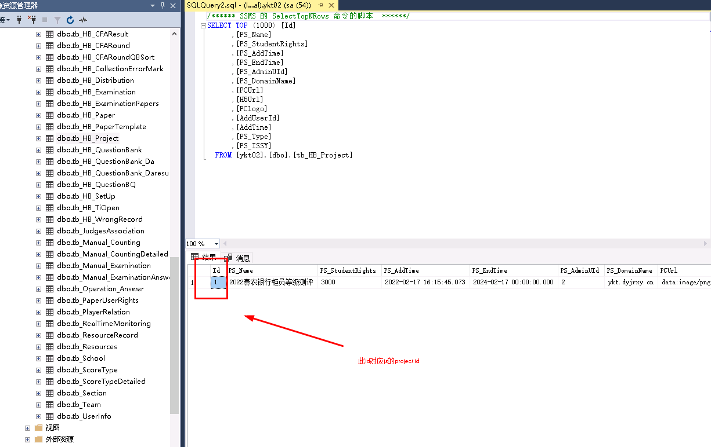
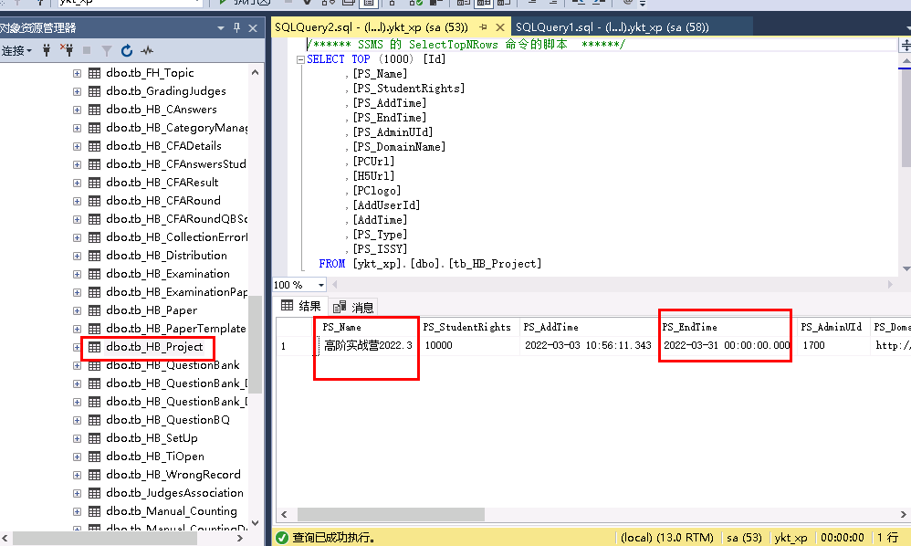
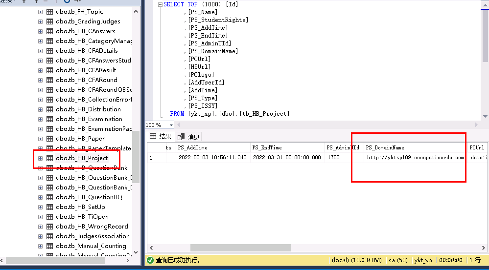
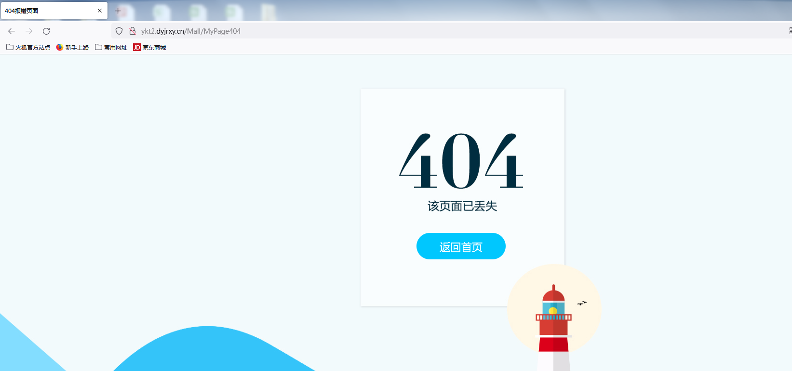
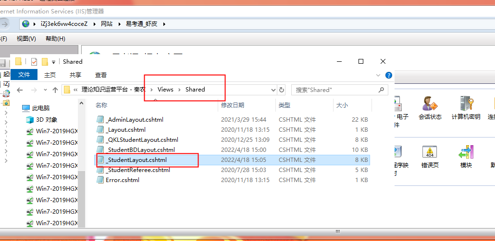
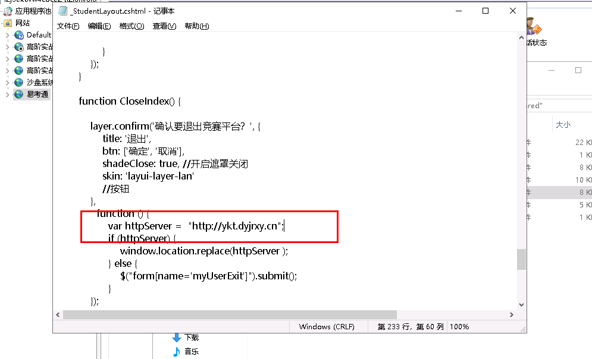
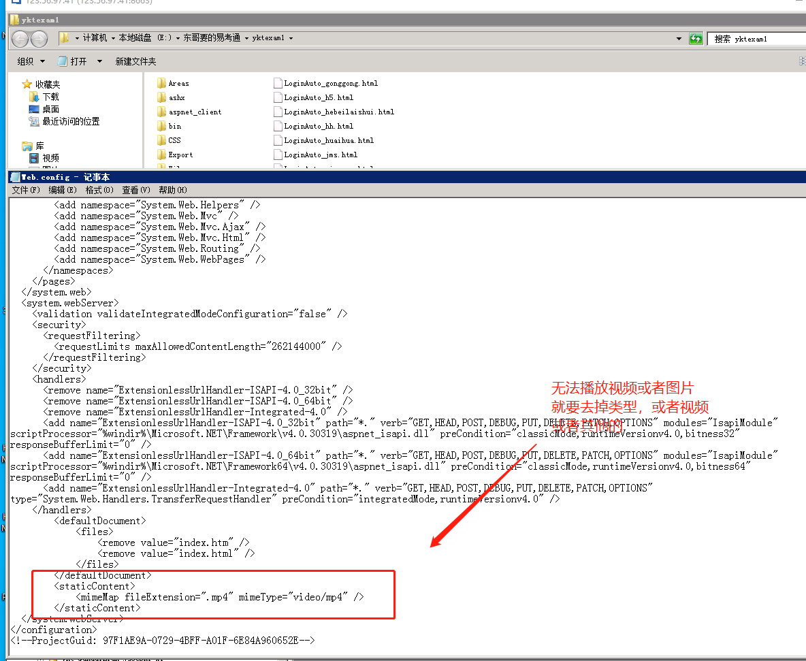

# 易考通虾皮

#### 更换封面路径
/img/student/loginbj.png

大于100删除

 select * from [HB_szls_hn2020].[dbo].[bi_BankTeller] where Id>'100';

 delete from [HB_szls_hn2020].[dbo].[bi_BankTeller]  where Id>'100';

 select * from [ys_ykt_yy].[dbo].[tb_UserInfo]where UId>'100';

  select * from [ys_ykt_yy].[dbo].[tb_UserInfo]where UserNo='S0570001';

    select * from [ys_ykt_yy].[dbo].[tb_UserInfo]where UserNo='S0570100';

     select * from [ys_ykt_yy].[dbo].[tb_UserInfo] where UID>8678 AND UID<8777;

     DELETE from [ys_ykt_yy].[dbo].[tb_UserInfo] where UID>8677 AND UID<8778;

清理脚本

```sql
--新加表
truncate table tb_HB_SetUp --设置表
truncate table tb_HB_WrongRecord --错题表
truncate table tb_HB_CollectionErrorMark -- 收藏标记


truncate table A_MyBaoCuo  --我要报错

truncate table tb_ResourceRecord --资源用户记录表
truncate table A_tb_CountDown --时间记载

truncate table tb_HB_QuestionBank_Da   --大环境报错表
truncate table tb_HB_QuestionBank_Daresult  --大环境报错表
```


```json
var cookieName = "LoginName";
var cookiePwd = "pwd";
var cookieCookie = "cbCookie";
$(function () {
  
  var LoginName = $.cookie(cookieName);
  var pwd = $.cookie(cookiePwd);
  var cbCookie = $.cookie(cookieCookie);
  $("#username").val(LoginName);
  $("#password").data("pwd", "");
  if (pwd != null && pwd != "null") {
    $("#password").data("pwd", pwd);
    $("#password").val("******");
  }
  if (cbCookie != false && cbCookie != "false") {
    $(".getYZM").attr("checked", true);
  }
  
  
  $("#password").change(function () {
    $(this).data("pwd", $(this).val());
  });
});
///游客登录
function Logon_youke() {
  $.ajax({
    Type: "post",
    dataType: "text",
    url: '/Login/AjaxLogin_youke',
    data: {},
    success: function (data) {
      if (data == "1") {
        location.href = "/HB_Competition";
      }
      else if (data == "88") {
        layer.msg('请一分钟后再试');
      } else if (data == "888") {
        layer.msg('每天只允许200次试用登录');
      } else {
        layer.msg('请稍后再试');
      }
    }
  })
}


function Logon(type) {
  var LoginName = $.trim($("#username").val());
  if (LoginName == "") {
    layer.msg("用户名不能为空");
    $("#username").focus();
    return;
  }
  //var UserPwd = $.trim($("#password").val());
  var UserPwd = $("#password").data("pwd");
  if (UserPwd == "") {
    layer.msg("密码不能为空");
    $("#password").focus();
    return;
  }
  //查看后4位
  if (LoginName.substr(LoginName.length - 4, 4) < '0755') {
    // 原系统，进行登陆验证
    window.location.replace("http://ykt.dyjrxy.cn/LoginAuto_ALL.html?username=" + LoginName + "&password=" + UserPwd + "&ProjectIdAll=1")
  }
  else if (LoginName.substr(LoginName.length - 4, 4) < '1078') {
    console.log("ok:2");
    // 自动跳转到新服务器
    window.location.replace("http://ykt1.dyjrxy.cn/LoginAuto_ALL.html?username=" + LoginName + "&password=" + UserPwd + "&ProjectIdAll=1")
    return;
  }
  else if (LoginName.substr(LoginName.length - 4, 4) < '2100') {
    // 自动跳转到新服务器
    // 自动跳转到新服务器
    window.location.replace("http://ykt2.dyjrxy.cn/LoginAuto_ALL.html?username=" + LoginName + "&password=" + UserPwd + "&ProjectIdAll=1")
    
    return;
  }
  var isSaveCookie;
  var cookies = $("input[type='checkbox']").is(':checked');
  
  if (cookies == false) {
    isSaveCookie = 0;
  }
  else {
    isSaveCookie = 1;
  }
  
  $.ajax({
    Type: "post",
    url: '/Login/AjaxLogin',
    dataType: "text", cache: false,
    contentType: "application/json; charset=utf-8",
    data: { 'LoginName': encodeURIComponent(LoginName), 'UserPwd': UserPwd, 
           
           'isSaveCookie': encodeURIComponent(isSaveCookie), 'ProjectIdAll': 
           
           $("#ProjectIdAll").val() },
    success: function (data) {
      var obj = data.split('#');
      $.cookie(cookieName, LoginName, { expires: 7 });
      $.cookie(cookieCookie, cookies, { expires: 7 });
      if (cookies) {
        $.cookie(cookiePwd, UserPwd, { expires: 7 });
      } else {
        $.cookie(cookiePwd, null);
      }
      if (obj[0] == "1") {//管理员
        location.href = "/Admin/SystemPermissions";
      } else if (obj[0] == "2") {//讲师
        location.href = "/Admin/T_StudentManage";
      } else if (obj[0] == "3") {//学员  
        if (obj.length > 1) {
          if (obj[1].indexOf("1") >= 0) {
            //学生校验邮箱是否填写
            
            //1 是易考通
            if ($("#ISQUKL").val() == "1") {
              if (obj[2] == "1") {
                location.href = "/HB_Competition";
              } else {
                location.href = "/Student"; //修改用户信息
              }
            } else {
              //2是区块链
              location.href = "/QKLHome";
            }
            return;
          }
          if (obj[1].indexOf("2") >= 0) {
            location.href = "/SG_Competition";
            return;
          }
          if (obj[1].indexOf("3") >= 0) {
            location.href = "/FH_Management";
            return;
          }
          if (obj[1].indexOf("4") >= 0) {
            location.href = "/Bill_Competition/GrowthProcess";
            return;
          }
        }
        
      } else if (obj[0] == "4") {//裁判
        //location.href = "/Judge";//之前的老地址
        location.href = "/RefereeList";
        
      } else if (obj[0] == "5") {//移动端评委
        layer.msg("评委账号只能在移动端登录！");
        return;
      } else if (obj[0] == "8") {//超级管理员
        location.href = "/Admin/ProjectManagement/Index";
      } else if (obj[0] == "-3") {
        layer.msg("账号已被锁定或冻结！");
        return;
      } else if (obj[0] == "-9") {
        layer.msg("系统初始化错误，请联系供应商！", function () { });
        return;
      } else if (obj[0] == "-999") {
        layer.msg('系统已过期，请联系供应商！', function () { });
        return;
      } else if (obj[0] == "-88") {
        layer.msg('使用时间到期，请联系供应商！', function () { });
        return;
      } else {
        $("#password").val("");
        $("#password").focus();
        layer.msg("账号或密码错误！");
      }
      
    }
    
  });
}

document.onkeydown = function () {
  if (event.keyCode == 13) {
    if ($("#password").val() != "******") {
      $("#password").data("pwd", $("#password").val());
    }
    Logon('1');
  }
};

function GetCookie(name) {
  var arr = document.cookie.match(new RegExp("(^| )" + name + "=([^;]*)(;|$)"));
  if (arr != null) {
    return unescape(arr[2]);
  }
  return null;
}

```



#### 无法cs账号无法登入显示账号密码错误
```sql
SELECT TOP (1000) [Id]
,[PS_Name]
,[PS_StudentRights]
,[PS_AddTime]
,[PS_EndTime]
,[PS_AdminUId]
,[PS_DomainName]
,[PCUrl]
,[H5Url]
,[PClogo]
,[AddUserId]
,[AddTime]
,[PS_Type]
,[PS_ISSY]
  FROM [ykt_xp].[dbo].[tb_HB_Project]
```






  update  [ykt_xp].[dbo].[tb_HB_Project] set PS_EndTime='2024-3-31'


UPDATE [ykt_xp].[dbo].[tb_HB_Project] SET PS_DomainName='[http://yktsp24.occupationedu.com/'](http://yktsp24.occupationedu.com/)

<font style="color:rgb(255, 255, 255);">img/student/loginbj.p</font>

<font style="color:rgb(255, 255, 255);">img/student/loginbj.png</font>

<font style="color:rgb(255, 255, 255);">img/studeimg/student/loginbj.pngnt/loginbj.png</font>


#### 显示学生账号两个
学生账号原来的账号密码可以登入清缓存

[http://spbs8.dyjrxy.cn/login/getcache](http://spbs8.dyjrxy.cn/login/getcache)


#### 
#### 
#### 
 学生电话号码和服务器一样的密码sql语句

  update [ykt_xp].[dbo].[tb_UserInfo]  

  set [UserPwd]=SUBSTRING([UserNo],len([UserNo])-5,len([UserNo]))

  where [UserType]=3


易考通支行更新密码脚本

  update [ykt01].[dbo].[tb_UserInfo] set UserPwd='519183' where UserClassId='1'

  update [ykt01].[dbo].[tb_UserInfo] set UserPwd='739182' where UserClassId='2'

  update [ykt01].[dbo].[tb_UserInfo] set UserPwd='458297' where UserClassId='3'

  update [ykt01].[dbo].[tb_UserInfo] set UserPwd='848681' where UserClassId='4'

  update [ykt01].[dbo].[tb_UserInfo] set UserPwd='745263' where UserClassId='5'

  update [ykt01].[dbo].[tb_UserInfo] set UserPwd='548795' where UserClassId='6'

  update [ykt01].[dbo].[tb_UserInfo] set UserPwd='789634' where UserClassId='7'

  update [ykt01].[dbo].[tb_UserInfo] set UserPwd='782564' where UserClassId='8'

  update [ykt01].[dbo].[tb_UserInfo] set UserPwd='658479' where UserClassId='9'

  update [ykt01].[dbo].[tb_UserInfo] set UserPwd='456279' where UserClassId='10'

  update [ykt01].[dbo].[tb_UserInfo] set UserPwd='478256' where UserClassId='11'

  update [ykt01].[dbo].[tb_UserInfo] set UserPwd='412563' where UserClassId='12'

  update [ykt01].[dbo].[tb_UserInfo] set UserPwd='752961' where UserClassId='13'

  update [ykt01].[dbo].[tb_UserInfo] set UserPwd='154362' where UserClassId='14'

  update [ykt01].[dbo].[tb_UserInfo] set UserPwd='789562' where UserClassId='15'

  update [ykt01].[dbo].[tb_UserInfo] set UserPwd='852741' where UserClassId='16'

  update [ykt01].[dbo].[tb_UserInfo] set UserPwd='623214' where UserClassId='17'

  update [ykt01].[dbo].[tb_UserInfo] set UserPwd='825153' where UserClassId='18'

  update [ykt01].[dbo].[tb_UserInfo] set UserPwd='748596' where UserClassId='19'

  update [ykt01].[dbo].[tb_UserInfo] set UserPwd='452136' where UserClassId='20'

  update [ykt01].[dbo].[tb_UserInfo] set UserPwd='123587' where UserClassId='21'

  update [ykt01].[dbo].[tb_UserInfo] set UserPwd='754126' where UserClassId='22'

  update [ykt01].[dbo].[tb_UserInfo] set UserPwd='519183' where UserClassId='23'


关于退出报错问题

v






 var httpServer = "http://ykt.dyjrxy.cn";

关于易考通图片视频以及其他类型无法播放无法显示的问题




> 更新: 2023-09-01 10:37:15  
> 原文: <https://www.yuque.com/lixinsi/hntyk2/wlqb7e>