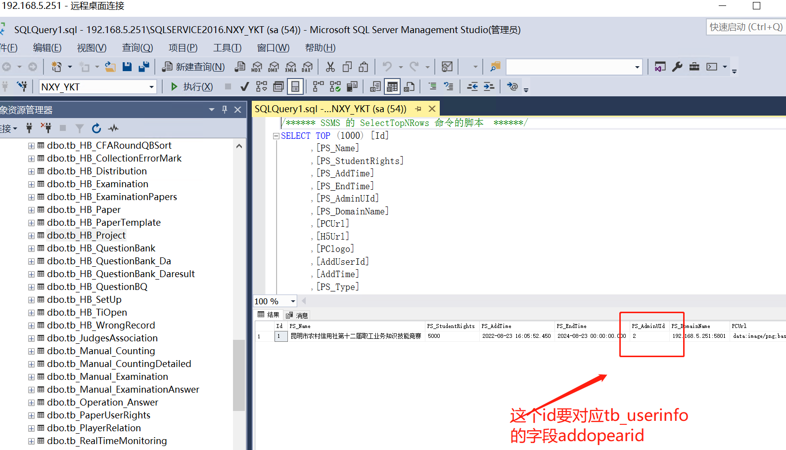
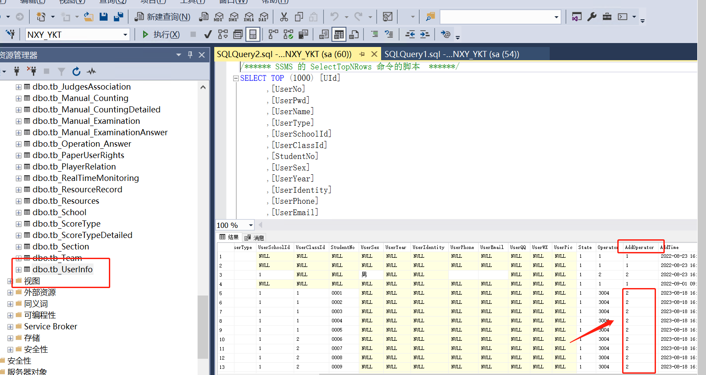

# 易考通账号同步清理脚本

```sql
/***********     理论知识综合竞赛数据库清理 *************/
/**** 单据内置不能清理tb_Bill_Form，tb_Bills ****/
--单据
truncate table tb_Bill_Answer
truncate table tb_Bill_Exam
truncate table tb_Bill_TestPaper
truncate table tb_Bill_TestPaperEven
truncate table tb_Bill_Topic
truncate table tb_Operation_Answer
--时间记载
truncate table tb_CountDown
--总分明细
truncate table tb_ExaminationResult
truncate table tb_ExaminationDetails
--复核
truncate table tb_FH_Examination
truncate table tb_FH_Fraction
truncate table tb_FH_RelationClass
truncate table tb_FH_RelationJurisdiction
truncate table tb_FH_RelationTopic
truncate table tb_FH_TestPaper
truncate table tb_FH_Tests
truncate table tb_FH_Topic

--手工
truncate table tb_Manual_Counting
truncate table tb_Manual_CountingDetailed
truncate table tb_Manual_Examination
truncate table tb_Manual_ExaminationAnswer

--风采展示
truncate table tb_CompetitionManagement
truncate table tb_PlayerRelation
truncate table tb_JudgesAssociation 
truncate table tb_DemeanorAchievement
truncate table tb_GradingJudges
truncate table tb_ScoreType
truncate table tb_ScoreTypeDetailed
truncate table tb_RealTimeMonitoring

--新加表
truncate table tb_HB_SetUp
truncate table tb_HB_WrongRecord
truncate table tb_HB_CollectionErrorMark
--truncate tabletb_HB_PaperTemplate
--select * from tb_HB_QuestionBQ

--平台运营 新加表
--truncate table tb_HB_Project
--truncate table tb_HB_Distribution
--truncate table tb_HB_TiOpen
--truncate table tb_HB_CategoryManagement


--试卷用户权限
--runcate table tb_PaperUserRights


--学校班级
--truncate table tb_School
--truncate table tb_Team

--用户表
--truncate table tb_UserInfo
--插入管理员
--insert into tb_UserInfo(UserNo,UserPwd,UserName,UserType,UserPic,State,Operator,AddOperator,AddTime)
--values('admin','dysoft123','超级管理员',8,null,1,1,1,GETDATE())


------抢答必答
truncate table tb_HB_CAnswers   --比赛表
truncate table tb_HB_CFAnswersStudent --参赛学生
truncate table tb_HB_CFARound   --轮次设置
truncate table tb_HB_CFARoundQBSort   --随机题目序号
truncate table tb_HB_CFAResult  --主成绩
truncate table tb_HB_CFADetails  --明细


truncate table A_MyBaoCuo  --我要报错


truncate table A_tb_CountDown --时间记载
delete from tb_UserInfo where UId>1
  truncate table [dbo].[tb_Team]
    truncate table [dbo].[tb_School]
     truncate table[dbo].[tb_HB_Project]

```





大堂经理批量新增账号

在用execl表格批量生成sql语句

然后update一下


> 更新: 2026-04-14 16:53:45  
> 原文: <https://www.yuque.com/lixinsi/hntyk2/ubk0tvtibbylg3ou>