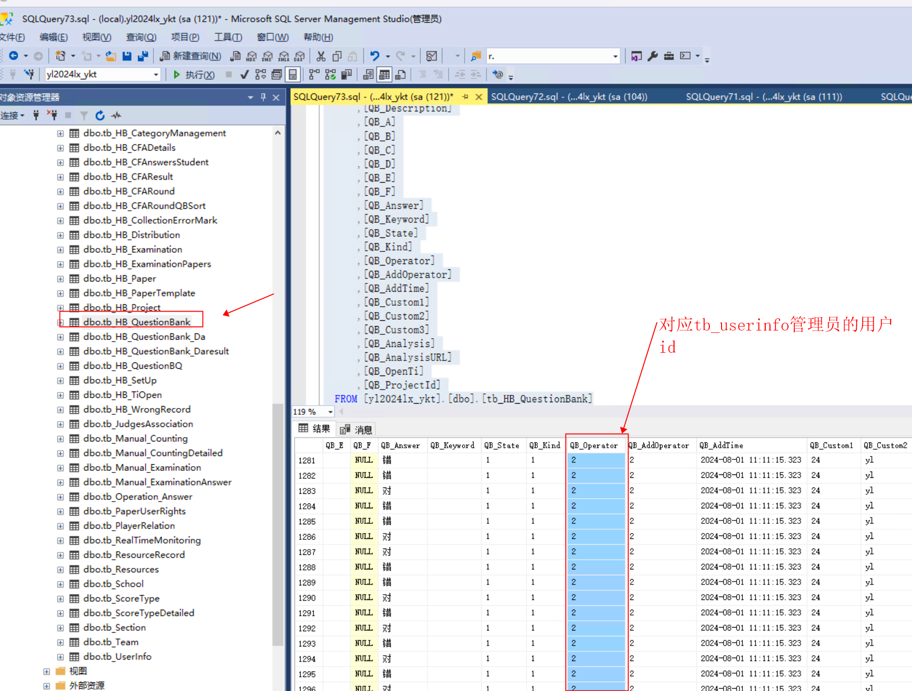
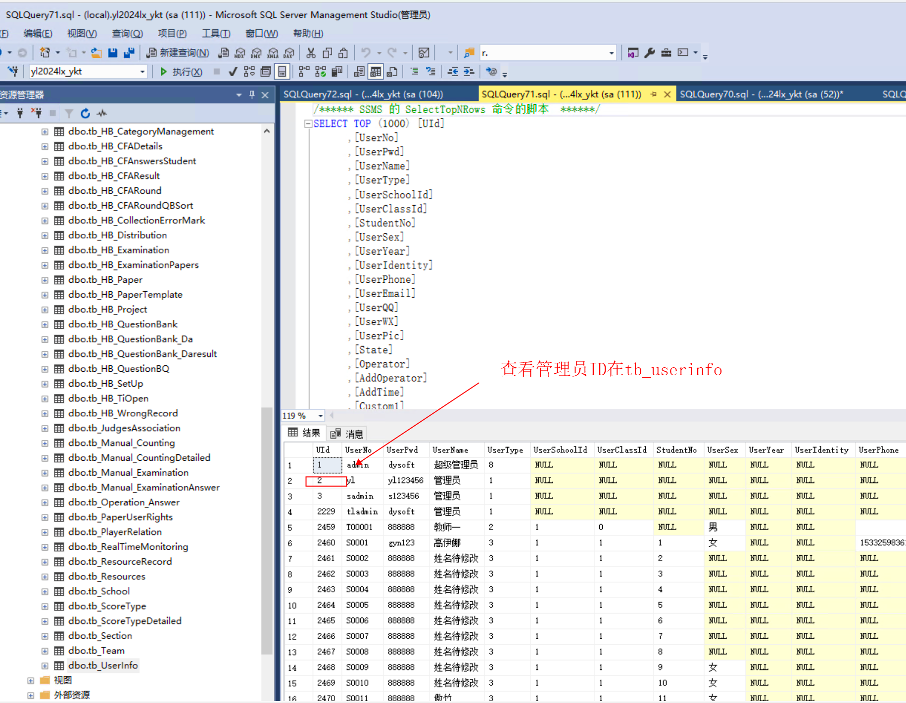
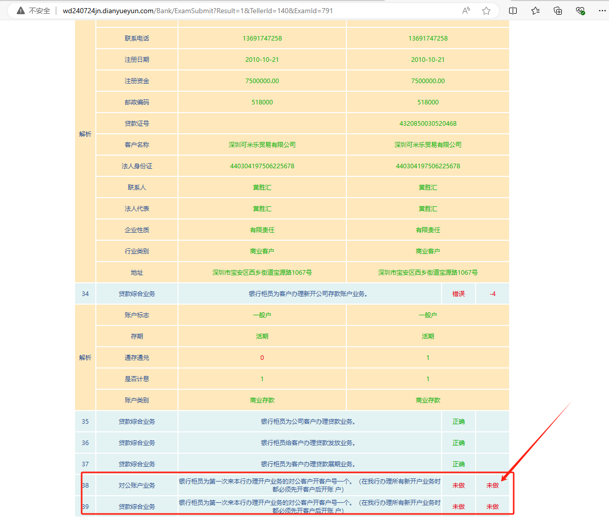
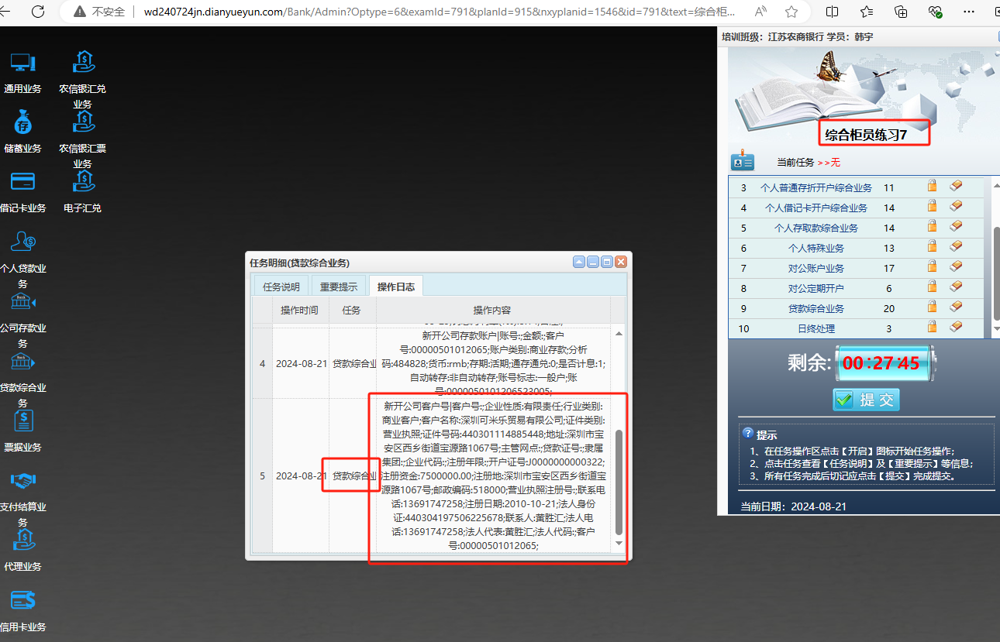
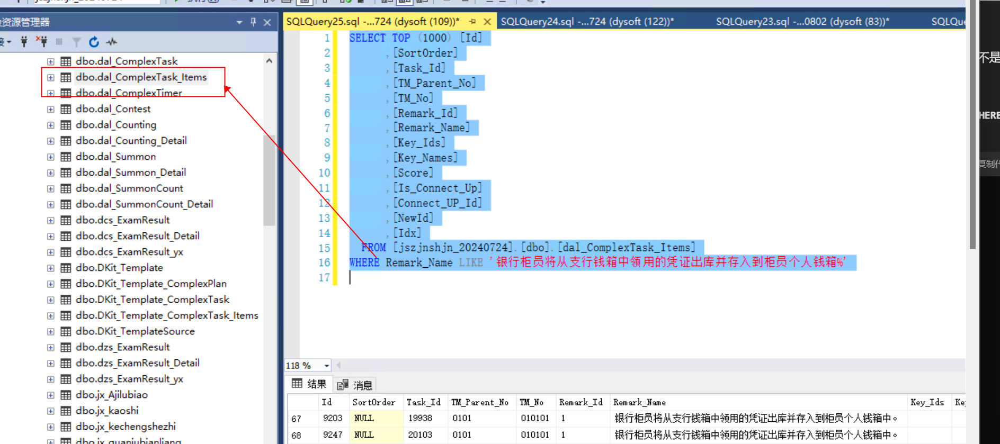

# 易考通题目查看以及显示

## 查看题目表格
```plsql
/****** SSMS 的 SelectTopNRows 命令的脚本  ******/
SELECT TOP (10000) [QuestionBId]
      ,[QB_CourseId]
      ,[QB_Type]
      ,[QB_Description]
      ,[QB_A]
      ,[QB_B]
      ,[QB_C]
      ,[QB_D]
      ,[QB_E]
      ,[QB_F]
      ,[QB_Answer]
      ,[QB_Keyword]
      ,[QB_State]
      ,[QB_Kind]
      ,[QB_Operator]
      ,[QB_AddOperator]
      ,[QB_AddTime]
      ,[QB_Custom1]
      ,[QB_Custom2]
      ,[QB_Custom3]
      ,[QB_Analysis]
      ,[QB_AnalysisURL]
      ,[QB_OpenTi]
      ,[QB_ProjectId]
  FROM [yl2024lx_ykt].[dbo].[tb_HB_QuestionBank]
```





```plsql
/****** SSMS 的 SelectTopNRows 命令的脚本  ******/
SELECT TOP (1000) [UId]
      ,[UserNo]
      ,[UserPwd]
      ,[UserName]
      ,[UserType]
      ,[UserSchoolId]
      ,[UserClassId]
      ,[StudentNo]
      ,[UserSex]
      ,[UserYear]
      ,[UserIdentity]
      ,[UserPhone]
      ,[UserEmail]
      ,[UserQQ]
      ,[UserWX]
      ,[UserPic]
      ,[State]
      ,[Operator]
      ,[AddOperator]
      ,[AddTime]
      ,[Custom1]
      ,[Custom2]
      ,[Custom3]
  FROM [yl2024lx_ykt].[dbo].[tb_UserInfo]
```




### 农信银的答案和题目显示未作答







```plsql
SELECT TOP (1000) [Id]
      ,[SortOrder]
      ,[Task_Id]
      ,[TM_Parent_No]
      ,[TM_No]
      ,[Remark_Id]
      ,[Remark_Name]
      ,[Key_Ids]
      ,[Key_Names]
      ,[Score]
      ,[Is_Connect_Up]
      ,[Connect_UP_Id]
      ,[NewId]
      ,[Idx]
  FROM [jszjnshjn_20240724].[dbo].[dal_ComplexTask_Items]
WHERE Remark_Name LIKE '银行柜员将从支行钱箱中领用的凭证出库并存入到柜员个人钱箱%'

```


> 更新: 2024-08-21 17:57:10  
> 原文: <https://www.yuque.com/lixinsi/hntyk2/tle5ggi0udqfb0fz>