# 智慧金融-金融综合技能（机具版）

对接流程&系统检查

1. 需要和学校对接的事情
2. 比赛场地以及每间机房的开考人数
3. 每个岗位的座位安排
4. 压力测的时间以及学校可以提供的志愿者人数
5. 如果使用外网，确定学校的带宽是多少（最好是千兆带宽）
6. 使用内网需要提前确认可以搭服务器的机房以及学校可以使用的IP网段并查看
7. 确认大堂岗位的位置后提前检查耳机插上后是否有声音
8. 确认学校对视频、音频是否有拦截
9. 确认比赛时间和参赛队伍是否有变动
10. 确认是否需要实时成绩，实时成绩网址提供给哪个老师
11. 需要和裁判长对接的事情
12. 确认是否需要实时成绩，需要告知实时成绩在哪显示
13. 学生点击提交后是否需要直接显示成绩
14. 确认正式账户如何封装什么时候怎么给到裁判长
15. 系统检查的内容以及对应修改的地方
16. 客户经理、理财经理的大赛模式：

检查SQL ：select * from Bi_Verify   
isShowDetail=0表示练习模式，isShowDetail=1表示比赛模式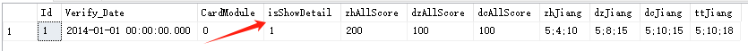

1. 检查系统的复制粘贴功能

综合柜员：ZHGY\Views\Shared\_StutentLayoutIsNull.cshtml  
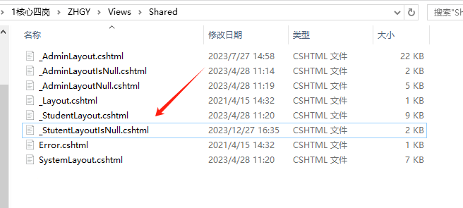

即为关闭复制粘贴。如果需要打开即需要全部注释掉这段话。

客户经理（理财经理需要修改地方与客户经理一致，只需要更换根目录即可找到相关修改位置）：①KHJL\Areas\Bank\Views\ComplexTask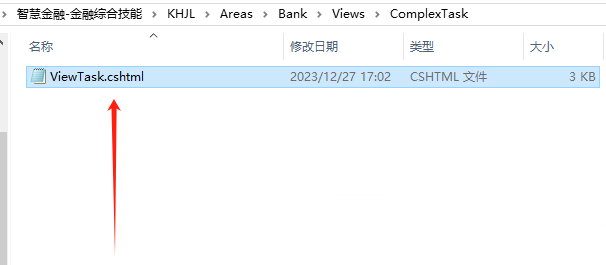

需要修改的地方如下图所示，当onselectstart="return false"和document.ondragstart = function () { return false; } 的返回值都为false时即为把内容表单选中功能关闭,图中所指代码块处没有时则添加相应的代码。

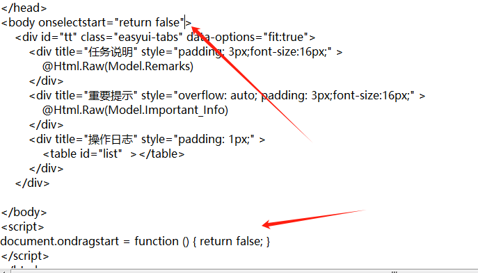

②KHJL\Areas\Bank\Views\Tick（目录位置）

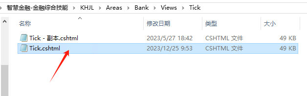

**document.oncontextmenu = new Function("event.returnValue=false;");**

**document.onselectstart = new Function("event.returnValue=false;");  
****为false时即为关闭，为true时则为打开**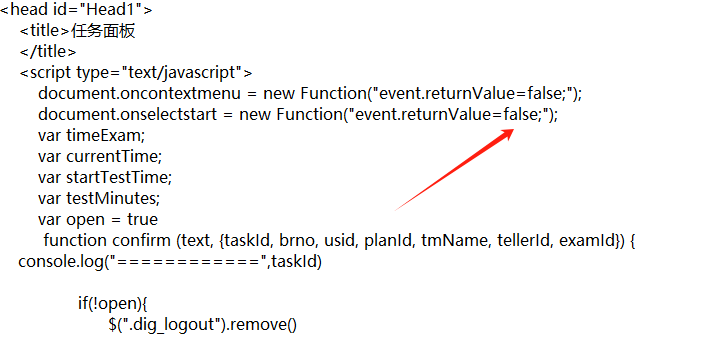

③KHJL\Form（目录位置）  
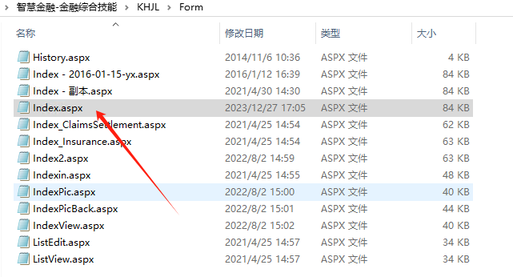

如果下图处缺失则添加ondragleave='return false;' ondragenter='return false;' ondragover='return false;' onpaste='return false' 即可关闭。

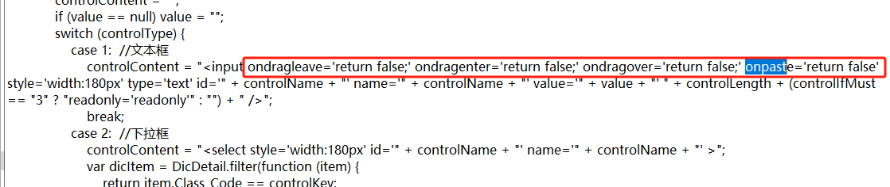

	大堂经理：DTJL\Views\Shared（目录位置）

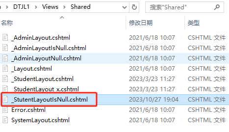

当返回的值为false时则为复制粘贴关闭（具体代码块如下图所示）。

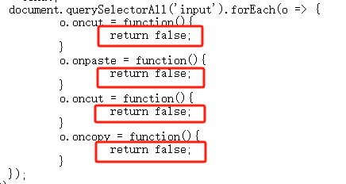

1. 综合柜员dbconfig配置

对应的数据库连接名、数据库名称以及数据库的账户密码修改成对应的。

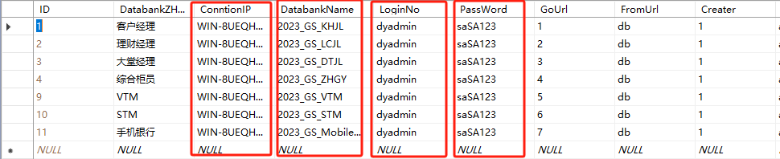

1. 导入名单

综合柜员界面通过管理员账户登录之后，在比赛设置-数据库配置中的创建平台账户中下载账户导入模板，需要注意的下载的模板中的客户经理和理财经理网点名称需要和数据库bi_BankSite表中的BankSiteName字段的内容相对应，然后再将模板进行导入。

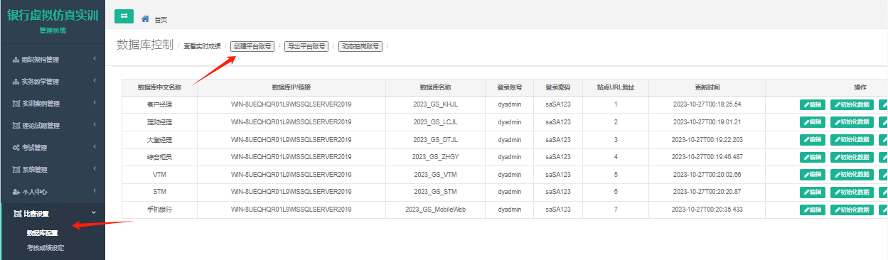

需注意，在通过该界面统一导入名单成功之后，手机银行不会添加教师端，我们需要登录教师端后台通过管理员新增教师，通过select * from P2P_Users where U_UserType=2查出UID的值为（假设值为4211），再用select * from P2P_UserInfo where UI_UID=4211查询出UIID（假设值为4502），最后通过update P2P_ClassAssign set CA_TeacherID=4502进行修改，成功的条数与代表队的数量是一致的。

手机银行的修改是否成功可以在开题的时候体现出来，如果成功在进行开题代表队选中时可以查看到导入名单所有的代表队。

1. 开题注意事项
2. 首先对所有需要开设的考题进行激活，否则在开题时会开不到考题，通过管理员登录方可进行操作；
3. 大堂经理通过教师账户进行登录进行开题操作，STM、VTM、手机银行的考核名称都需要和大堂经理的考核名称保持一致；

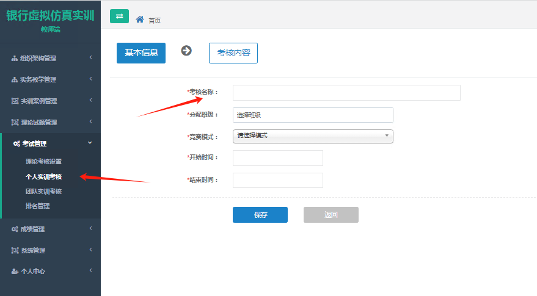

1. 综合柜员开题是通过教师端进行开题操作，需注意设置的练习时长应该为7200；

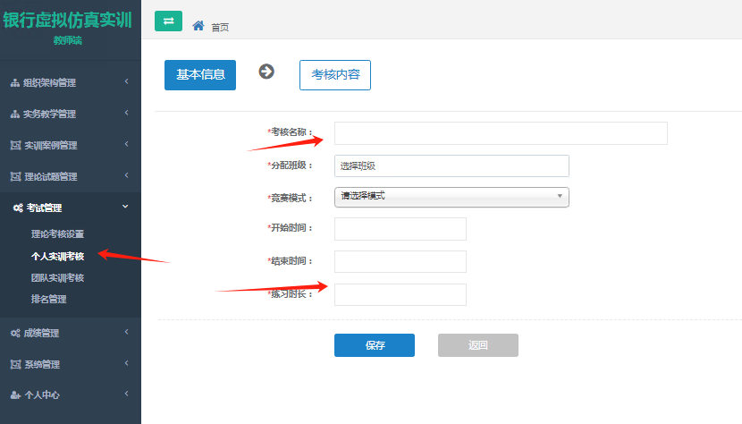

1. 客户经理是直接通过管理员账户进行开题操作，开设考题时网点名称需要和导入账户的网点名称一样，否则就会出现考生登录考试系统看不见题目客户经理的专业选择信贷部门，任务名称为相应的考题，开始时间为对应的考试考试时间，考试时间是120分钟，允许考试次数为（1）次，是否允许加分为否需要注意，客户经理分为个人和对公两套考题，两套考题都需要设置，考试时间都是120分钟。

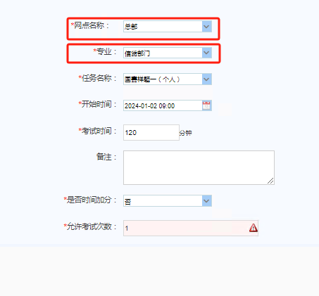

1. 理财经理也是通过管理员登录，银行网点需要和导入账户的网点名称一样，赛区是选择理财比赛，竞赛计划选择对应的考题，开始时间为对应的考试开始时间，竞赛时间为120分钟，是否时间加分为否，允许考试次数为1。

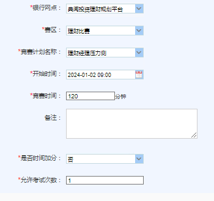

1. 考试提交后学生成绩显示

大堂经理：DTJL\Views\PracticeResult里面的Index.cshtml

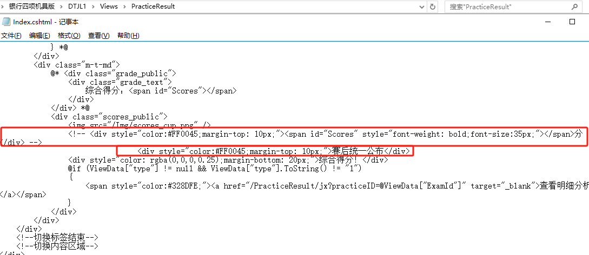

**注**：注释掉的为提交后显示成绩，下面的为不显示提交后的成绩，根据需求可进行选择。

综合柜员：DTJL\Views\PracticeResult里面的Index.cshtml

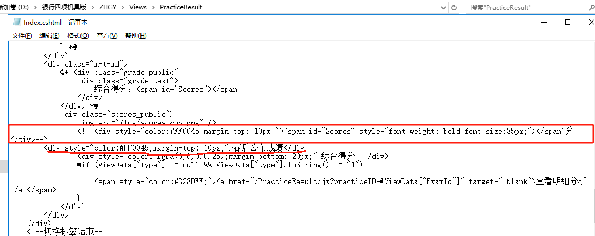

**注**：注释掉的为提交后显示成绩，下面的为不显示提交后的成绩，根据需求可进行选择。

客户经理：KHJL\Areas\Bank\Views\Shared里面ExamResult.cshtml

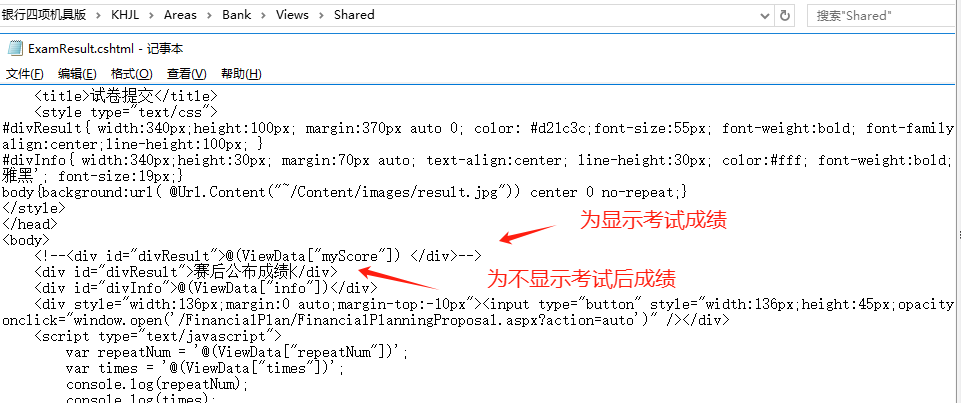

**注**：注释掉的为提交后显示成绩，下面的为不显示提交后的成绩，根据需求可进行选择。

理财经理：LCJL\Areas\Bank\Views\Shared里面ExamResult.cshtml

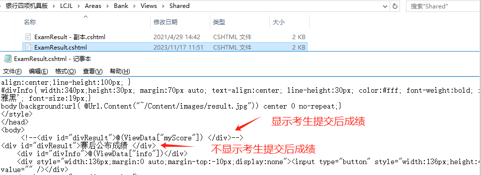

**注**：注释掉的为提交后显示成绩，下面的为不显示提交后的成绩，根据需求可进行选择。

1. caseid检查

在完成开题后，防止出现机具跳转没有题目的情况，对于机具（stm、vtm、手机银行）开题后的题目进行caseid的重复值进行检查

stm、vtm都是通过select * from tb_task_main进行查询：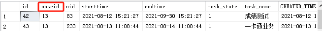

	手机银行使用select * from tb_Assessment进行查询：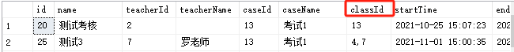

1. 倒计时设置（只有大堂经理和综合柜员需要设置）

1. 成绩绑定

注意：如果所有的配置都已经配置好的情况下，caseid没有重复，但是机具跳转没有显示题目，则检查以下图片的内容。

管理员登录后选择案例管理，找到对应的案例关闭激活之后点击编辑后，找到是否整合金融机具并选择开启即可，这样在跳转之后即可看见题目。

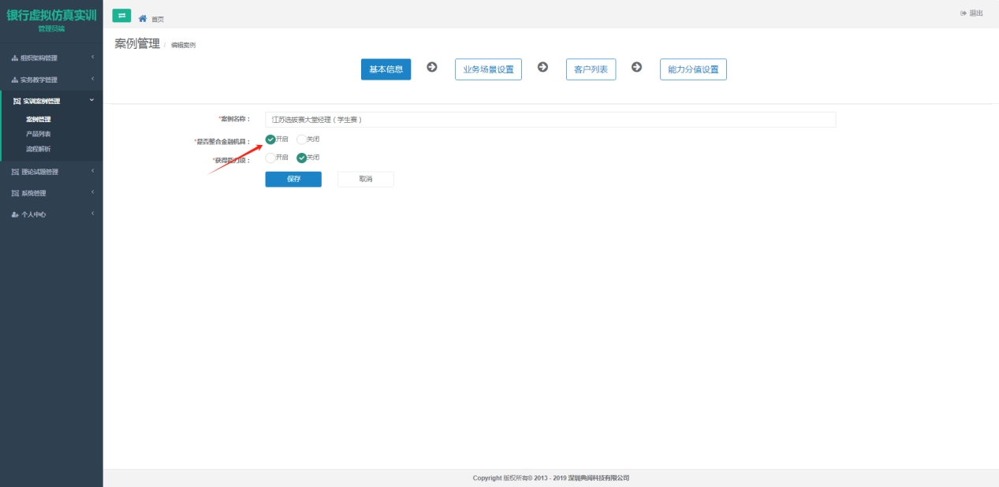

> 更新: 2026-01-07 11:31:57  
> 原文: <https://www.yuque.com/lixinsi/hntyk2/pizw0p95h4ow732a>