# 智能投顾机器人猎户星空部署培训指导

1、猎户星空部署培训指导

部署文档，说明书，教学视频等[https://cheeth-mobile.feishu.cn/docx/LgyUdUQsGoNLwuxixqRcMkK7nVb](https://cheeth-mobile.feishu.cn/docx/LgyUdUQsGoNLwuxixqRcMkK7nVb)

2、猎户星空机器人软件后台

机器人后台网址：[https://jiedai.ainirobot.com](https://jiedai.ainirobot.com)

机器人后台主要用于机器人页面、问答、讲解、人员管理等内容配置

代理商平台：[https://eo.ainirobot.com/](https://eo.ainirobot.com/)

代理商平台可以管理公司旗下所有的机器人

3、猎户开发者平台

需要做二次开发参考这里[https://doc.orionstar.com/](https://doc.orionstar.com/)

天津轻工序列号：K13ECN3L23025125Y7AA

天津电子序列号：K13ECN3K23025034Q95E


同屏设置

开机设置智能投顾

进入开发者模式应用找到猎小豹强行停止


三指下拉→地图工具→高级设置→导航配置-巡线行走


### 1.填表，提交申请表给猎户星空。
#### 提交表格后激活设备。然后绑定管理用户
### 2.绑定，管理员手机号
### 3.推送 app
## 方法一：代理商后台EO远程推送（<font style="background-color:rgba(255, 246, 122, 0.8);">推荐</font>） 
<font style="background-color:rgb(255, 245, 235);">使用此方式的前提，需要您有代理商后台EO权限 </font>

1. 进入您的EO后台：eo.ainirobot.com

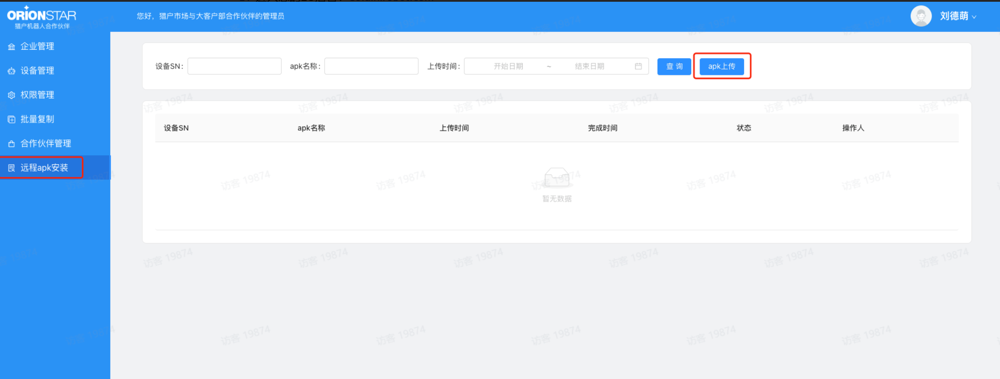

2. 点击远程apk安装：选择apk上传，**<font style="color:rgb(216, 57, 49);background-color:rgba(255, 246, 122, 0.8);">复制需要推送的设备sn，多个sn请用回车键分割</font>**，点击提交

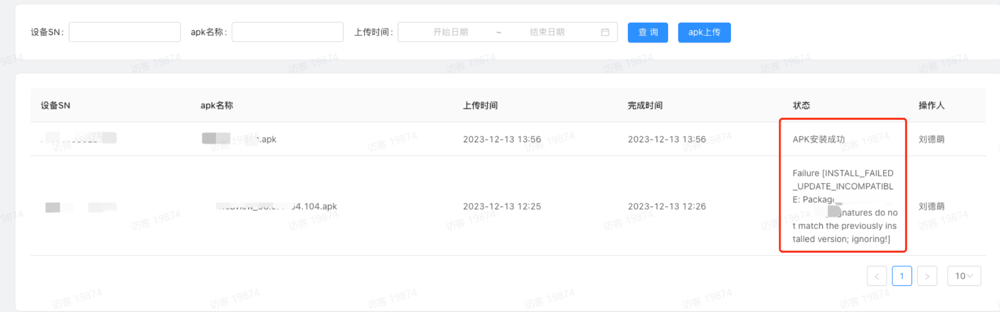

3. 等待片刻，查看状态

[https://cheetah-mobile.feishu.cn/docs/doccn1zRmZ5w5yHgbMOkbq4SS5g](https://cheetah-mobile.feishu.cn/docs/doccn1zRmZ5w5yHgbMOkbq4SS5g)  卸载安装apk


### 人脸采集需要开通给供应商
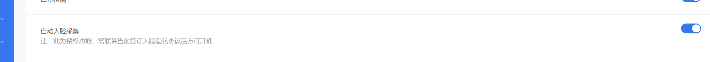


### 语音指令
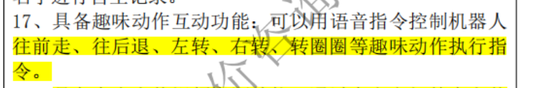

小豹小豹唤醒之后，跟机器人说往前走、往后退。。。


### 机器人巡线
巡线设置，地图工具，高级设置，导航配置，巡线行走开关是打开还是关闭状态，接待点位置改下就行了

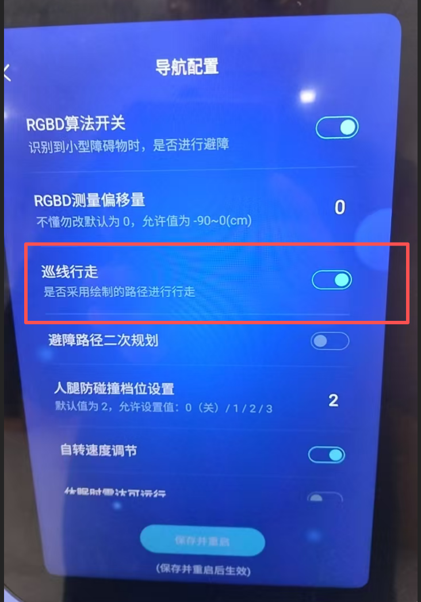


关闭后，保存并重启


### 视频播放
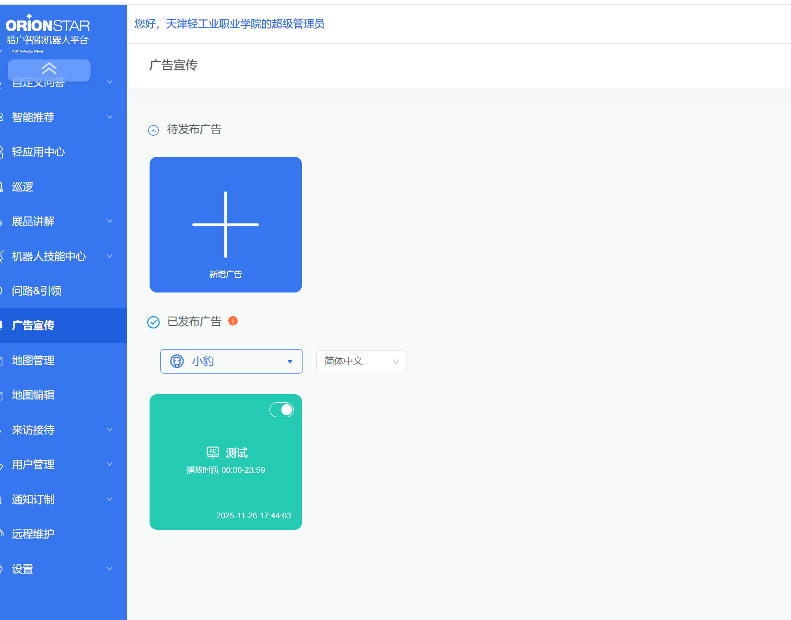


在时间点内，闲时没人交互，它会自己播放的


### 微信扫码绑定了一个豹小秘，现在需要解绑。去你们EO后台解绑，解绑后如何重新激活呢


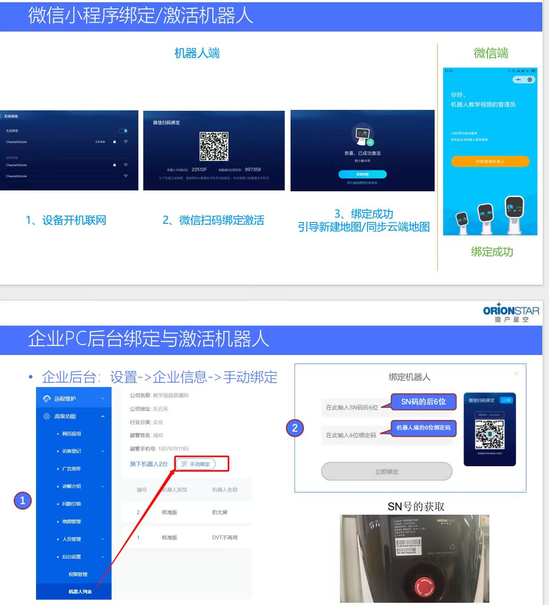

### plus识别的时候默认提示戴口罩这个怎么去掉
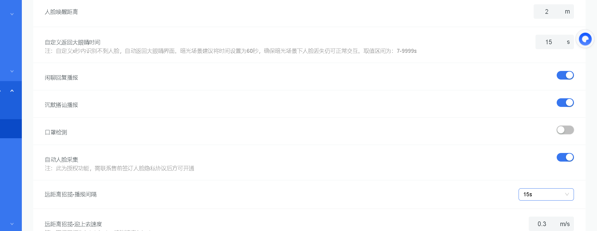

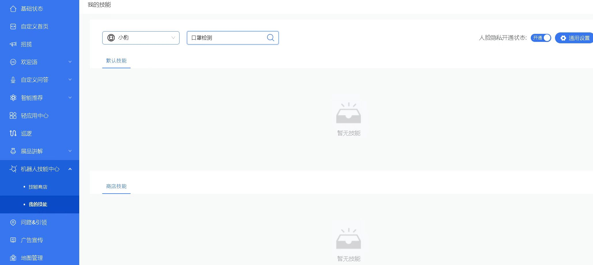

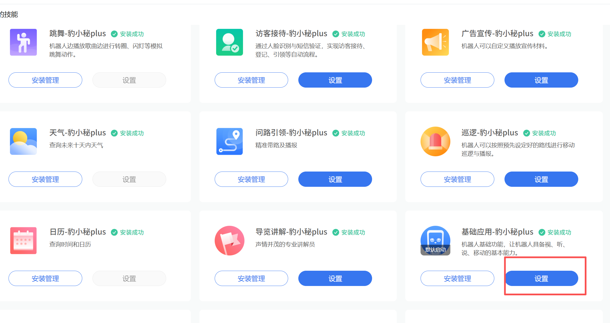

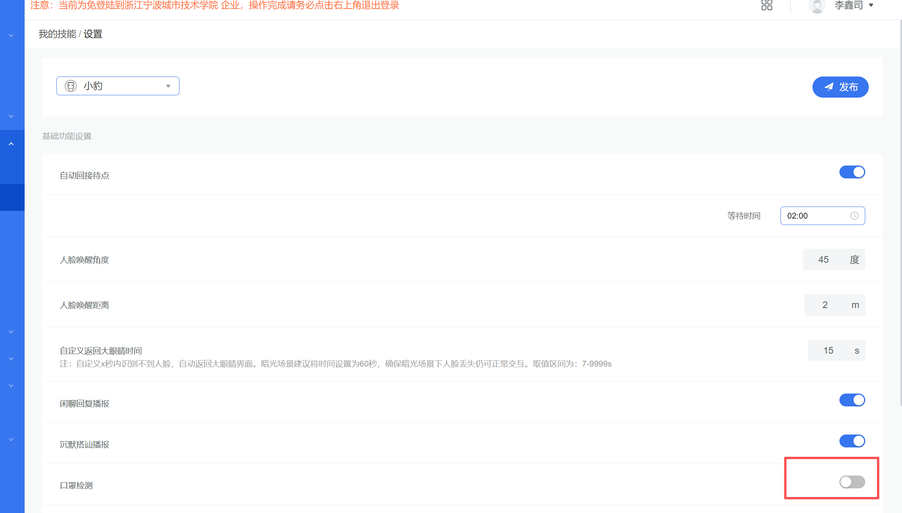

### 持久调试上下显示一致
[https://cheetah-mobile.feishu.cn/docs/doccnVaO3TjB6KMNMPOqosmfYYd](https://cheetah-mobile.feishu.cn/docs/doccnVaO3TjB6KMNMPOqosmfYYd)

1. 大家好，服务端已经上线通用大模型接入能力，目前开放大模型的有聚言、猎户星空通用大模型和Deepseek，用户可以在后台自行选择接入
2. 适配机器：豹小秘、豹小秘mini、豹小秘2、豹小秘plus，招财豹
3. 版本要求：ROM需要支持聚言/流式版本，版本号≥10.3
4. **若用户需求只有通用大模型**
    1. 按照[自助开通方式](https://cheetah-mobile.feishu.cn/docx/OeEWdUNABoBGiCxx8kwc6vY2nqd#share-TdOMd2Hv8otohZxE5xwclOIYnhf)免费开通通用大模型
5. **若用户需求只有聚言**
    1. 按照目前政策豹小秘2和新采购的豹小秘mini免费赠送聚言1999套餐
    2. 不符上述政策需单独采购聚言
6. **若用户需求是聚言+通用大模型**

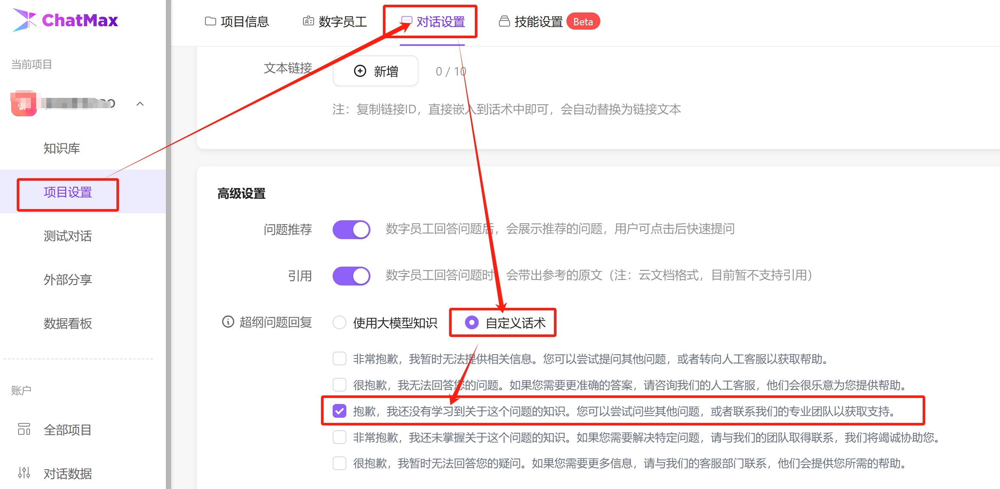

    - 将聚言超纲问题回复选择为：抱歉xxx，在机器人上对于超纲的问题可以通过大模型回&#x590D;**（Deepseek兜底）**

**总结：**

+ 相当于聚言和通用大模型单独解耦，使得用户可以按照实际的需求进行开通配置，简化终端用户的操作，提高使用者的交互体验
+ 开通聚言可以自己上传文档资料训练，使得模型优先回复资料中的内容[ 聚言国内版（chatmax.net）快速上手指南-V2.5](https://orionstar.feishu.cn/docx/IfSRdX24XoQYBux9jn3cnQUXnEe)

# 1. 注意事项
+ 适配机器：豹小秘、豹小秘mini、豹小秘2、豹小秘plus，招财豹
+ 按照SN维度开通生效
+ 大模型领域

|  | 聚言 | 猎户通用大模型 | Deepseek |
| --- | --- | --- | --- |
| 领域 | chat | chat | chat |
| 意图 | characterai | chatmax | deepseekv3 |


+ 支持多轮

# 2. 自助开通方式
## 2.1 接待后台配置
1. 进入接待后台：jiedai.ainirobot.com   在左侧项目栏点击**自定义问答**
2. **智能学习**--->大模型接入 或 **待配置答案**--->大模型接入
3. 点击大模型接入界面“新增”，填入机器人的 SN、选择通用大模型或者Deepseek
4. 点击保存后，机器人端大模型的接入立即生效

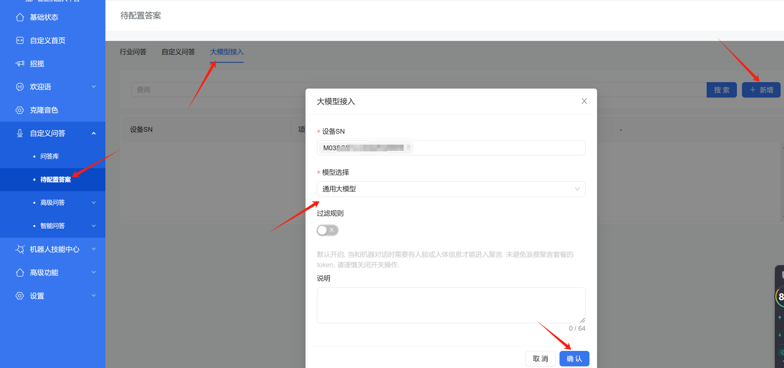

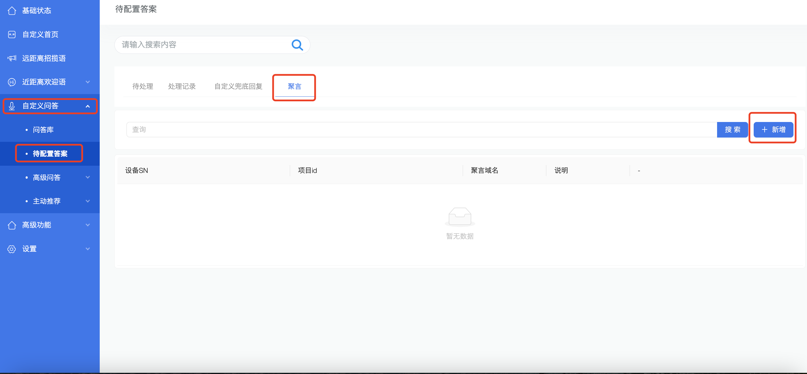

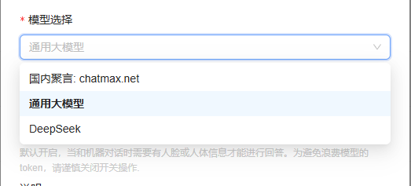

# 3. 接入第三方流式大模型方式
[ 三方模型流式接口文档](https://cheetah-mobile.feishu.cn/docx/OlG4dGsCfo0BjGxgPFncKjx2n6c)


#### 去充电暗号
```bash
我是管理员去充电
```

1. 大家好，服务端已经上线通用大模型接入能力，目前开放大模型的有聚言、猎户星空通用大模型和Deepseek，用户可以在后台自行选择接入
2. 适配机器：豹小秘、豹小秘mini、豹小秘2、豹小秘plus，招财豹
3. 版本要求：ROM需要支持聚言/流式版本，版本号≥10.3
4. **若用户需求只有通用大模型**
    1. 按照[自助开通方式](https://cheetah-mobile.feishu.cn/docx/OeEWdUNABoBGiCxx8kwc6vY2nqd#share-TdOMd2Hv8otohZxE5xwclOIYnhf)免费开通通用大模型
5. **若用户需求只有聚言**
    1. 按照目前政策豹小秘2和新采购的豹小秘mini免费赠送聚言1999套餐
    2. 不符上述政策需单独采购聚言
6. **若用户需求是聚言+通用大模型**


    - 将聚言超纲问题回复选择为：抱歉xxx，在机器人上对于超纲的问题可以通过大模型回&#x590D;**（Deepseek兜底）**

**总结：**

+ 相当于聚言和通用大模型单独解耦，使得用户可以按照实际的需求进行开通配置，简化终端用户的操作，提高使用者的交互体验
+ 开通聚言可以自己上传文档资料训练，使得模型优先回复资料中的内容[ 聚言国内版（chatmax.net）快速上手指南-V2.5](https://orionstar.feishu.cn/docx/IfSRdX24XoQYBux9jn3cnQUXnEe)

# 1. 注意事项
+ 适配机器：豹小秘、豹小秘mini、豹小秘2、豹小秘plus，招财豹
+ 按照SN维度开通生效
+ 大模型领域

|  | 聚言 | 猎户通用大模型 | Deepseek |
| --- | --- | --- | --- |
| 领域 | chat | chat | chat |
| 意图 | characterai | chatmax | deepseekv3 |


+ 支持多轮

# 2. 自助开通方式
## 2.1 接待后台配置
1. 进入接待后台：jiedai.ainirobot.com   在左侧项目栏点击**自定义问答**
2. **智能学习**--->大模型接入 或 **待配置答案**--->大模型接入
3. 点击大模型接入界面“新增”，填入机器人的 SN、选择通用大模型或者Deepseek
4. 点击保存后，机器人端大模型的接入立即生效


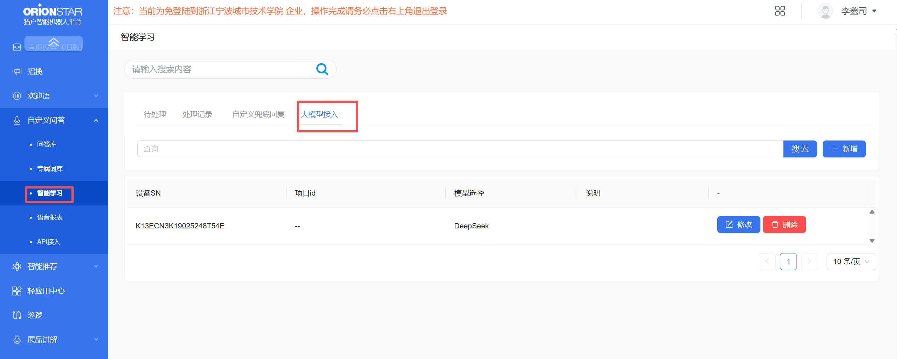


# 3. 接入第三方流式大模型方式
[ 三方模型流式接口文档](https://cheetah-mobile.feishu.cn/docx/OlG4dGsCfo0BjGxgPFncKjx2n6c)

### 配置唤醒功能视频
需要配置广告上传视频或者图片如截图

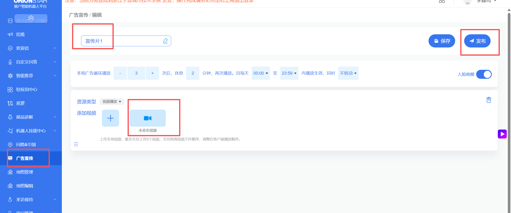

### 配置巡逻编辑巡逻路线必须要设置两个地点一个是接待点另外一个是另外一个地点最后勾选播报四字广告资源就关联上了如截图
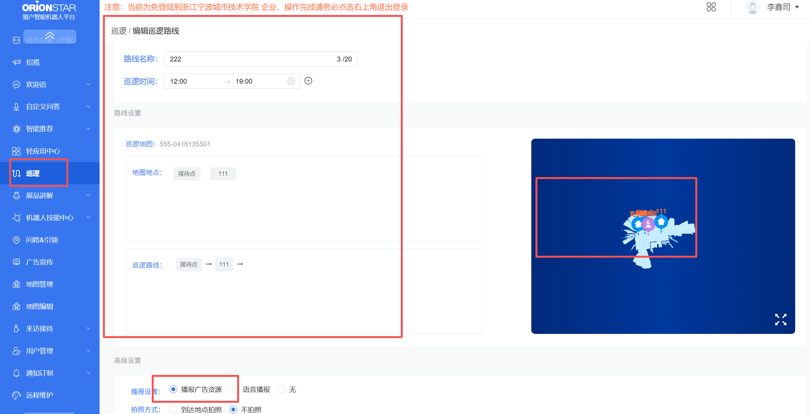

唤醒词是小报小报去巡逻

### 接待后台，技能中心，闲聊问答，设置里，打开上下同屏
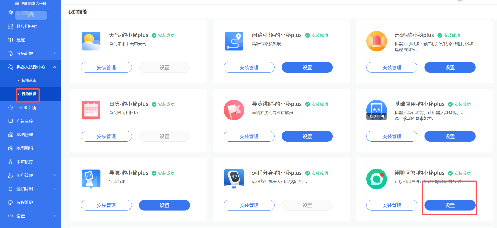

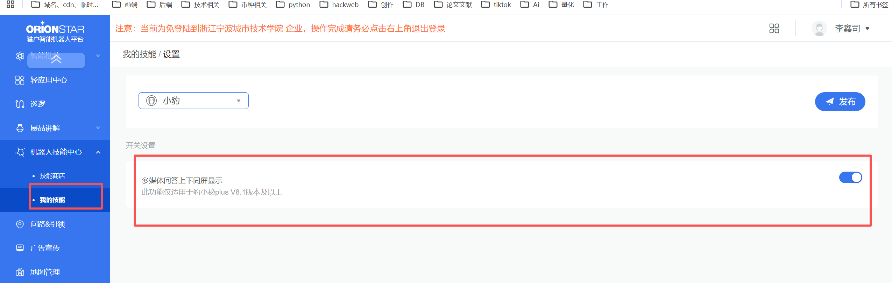

### 自定义唤醒视频
自定义唤醒视频比如说播放视频，可以通过问答的形式来播放视频，在问答库里面企业级学生添加一条问答具体配置如下面

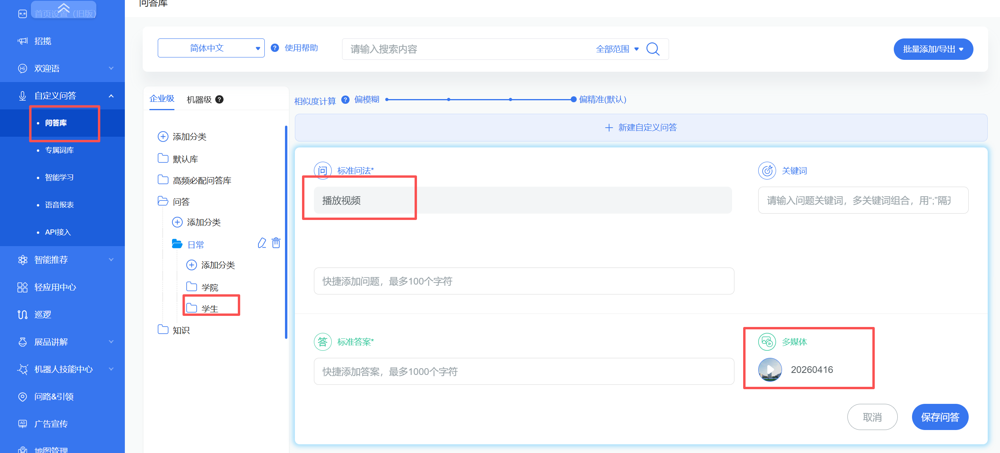

### 招揽功能
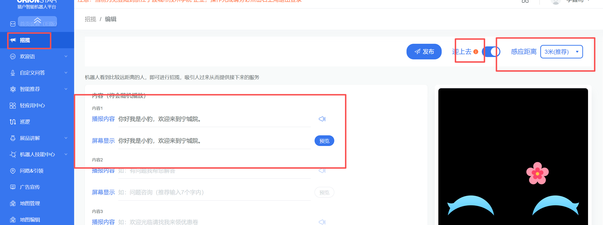

用到 deepseek 大模型对话显示不行需要厂家推送最新版本的OTC 更新系统

点击添加充电桩点位，提示请把我推到充电桩，连续点击屏幕7次就可以设置一个虚拟充电桩

### 广告一直显示不是来了人就没有了设置
广告设置的时候有人脸唤醒开关 关掉

接待后台，技能中心，我的技能，基础应用，设置里口罩识别关掉

# 1. 修改后台、小程序、机器人设置里显示的名字
登录接待后台——设置——企业信息中修改机器人的名字

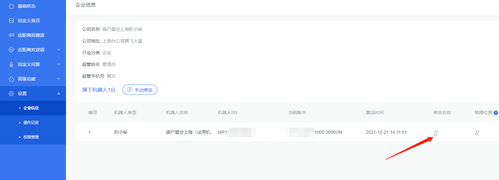

或者登录小程序修改

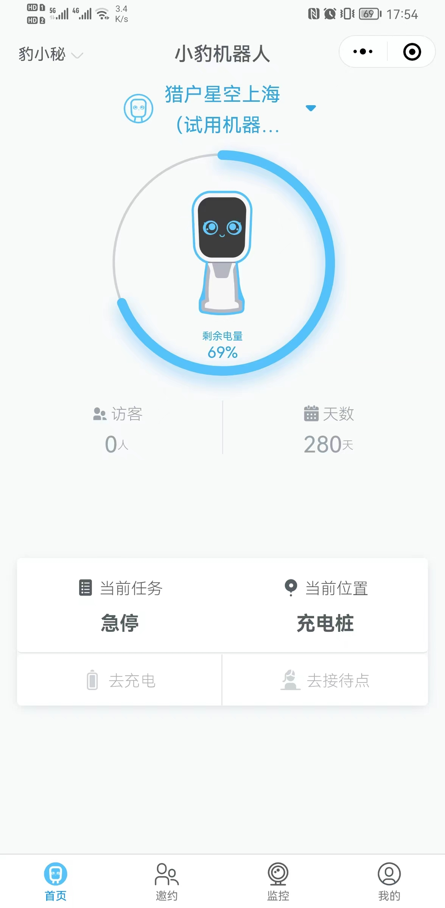

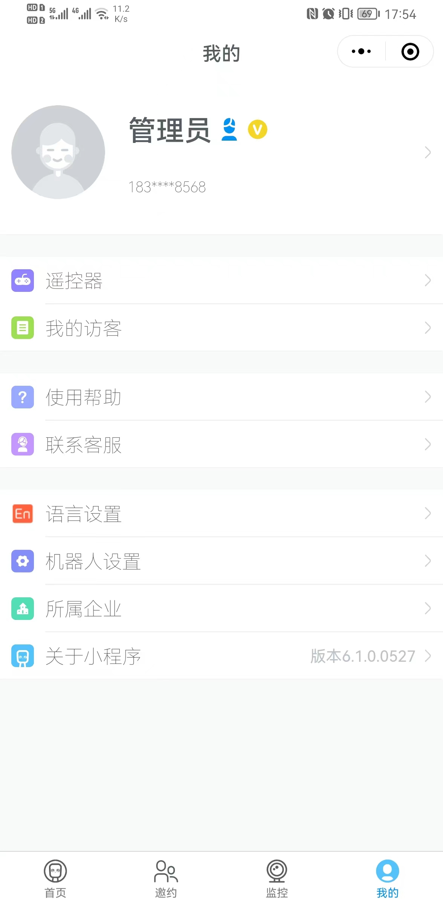

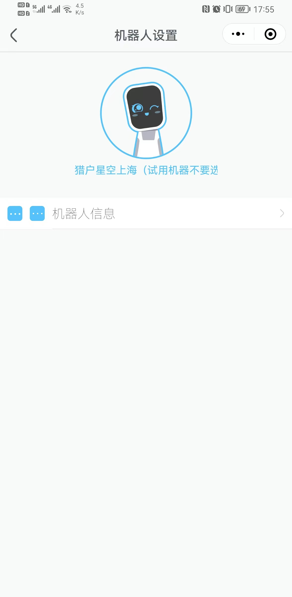

# 2. 增加机器人的唤醒词
机器人端——三指下拉（密码是SN号的后四位）——设置——自定义唤醒词


1. 对于唤醒词的选择，建议是“ABAB”型的叠词，识别率较高，可以使用百度的唤醒词评估功能检测唤醒词的识别率：[https://ai.baidu.com/tech/speech/wake#tech-demo](https://ai.baidu.com/tech/speech/wake#tech-demo)
2. 唤醒词改了后，**小豹小豹的默认唤醒还是起作用的**，相当于**同时存在两个唤醒词**，默认“小豹小豹”和自定义唤醒词；
3. 默认唤醒词有经过模型训练，识别率比自定义唤醒词识别率高些，如果要做自定义唤醒词的训练，费用预计10W+；
4. 默认唤醒词唤醒率95%，自定义唤醒词的唤醒率为70%左右，为了使唤醒失败时机器人有回复，请在后台的问答库中增加该唤醒词的问答

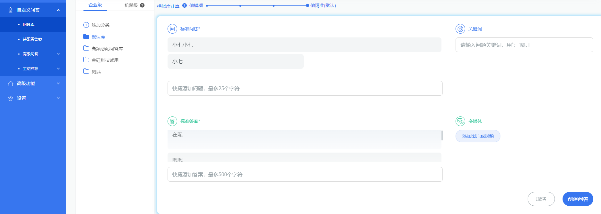

# 3. 修改机器人的自称（人设）[ 修改机器人的自称（人设）](https://orionstar.feishu.cn/docs/doccn3lmg86xEj1uFHY05kiWhsb#)&#x20;
1. 提供机器人的**SN号**和**要修改的名字**至少提前一天提供给您的技术支持人员
2. 该方法无法完全修改，同时在后台问答库中添加关于人设的问答做兜底，如果发现仍然含有“小豹”的回复，可以将此问题加入到问答库中
3. 下载下面的表格，**将名字修改为您机器的名字后导入进去**

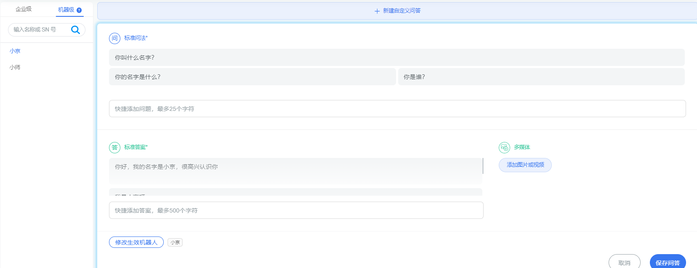

[附件: 企业级问答批量导入模版 (1).xlsx](./attachments/3DCysQSCf4wBq5Ms/企业级问答批量导入模版 (1).xlsx)[附件: 智能投顾机器人_语料库.xlsx](./attachments/3DCysQSCf4wBq5Ms/智能投顾机器人_语料库.xlsx)


> 更新: 2026-04-16 22:41:22  
> 原文: <https://www.yuque.com/lixinsi/hntyk2/ykk6p9ptgs7o0nbe>