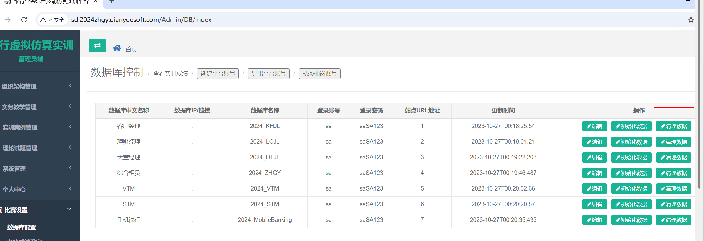

# 比赛银行四项根据清理数据

### 比赛综合柜员清理数据保留账号是清理数据按钮



```powershell
 --信贷数据清理
truncate table BalanceSheet

/**--删除综合成绩--**/
delete from zhyw_ExamCurrentTask    
delete from zhyw_ExamLog where LogDate < '2024-01-01 00:00:00.000'
delete from zhyw_ExamResult where SubmitTime < '2024-01-01 00:00:00.000'
delete FROM zhyw_ExamResultForm  where ExamResultId in (
select Id from zhyw_ExamResult where SubmitTime < '2024-01-01 00:00:00.000'
)
delete from zhyw_ExamResultTask WHERE SubmitTime < '2024-01-01 00:00:00.000'
delete from zhyw_ExamResultTaskDetail where DetailsId in (
select Id from zhyw_ExamResultTask WHERE SubmitTime < '2024-01-01 00:00:00.000'
)

-- 清理操作记录和成绩
DECLARE @tablename NVARCHAR(128)  
DECLARE @sql NVARCHAR(MAX)  
DECLARE test_Cursor CURSOR LOCAL FOR  
SELECT name   
FROM sys.tables   
WHERE name LIKE 'yw_%' AND OBJECTPROPERTY(OBJECT_ID(name), 'IsMSShipped') = 0 -- 排除系统表和Microsoft提供的表  
ORDER BY name  
OPEN test_Cursor  
FETCH NEXT FROM test_Cursor INTO @tablename  
WHILE @@FETCH_STATUS = 0  
BEGIN  
    -- 构建DELETE语句的字符串  
    SET @sql = 'DELETE FROM ' + QUOTENAME(@tablename) + ' WHERE CreateDate < ''2024-01-01 00:00:00.000'''  
    -- 执行DELETE语句  
    EXEC sp_executesql @sql   
    FETCH NEXT FROM test_Cursor INTO @tablename  
END  
CLOSE test_Cursor  
DEALLOCATE test_Cursor  
GO
```

```powershell
 --信贷数据清理
truncate table BalanceSheet
truncate table BalanceSheet1
truncate table BalanceSheet
truncate table BalanceSheet
truncate table xd_Customer_RiskClassification  
truncate table xd_Individual_RiskClassification

truncate table xd_WorkFlow_BadDebt_Affirm 
truncate table xd_WorkFlow_BadDebt_Approve
truncate table xd_WorkFlow_BadDebt_Cancel
truncate table xd_WorkFlow_BadDebt_Scrutiny
truncate table xd_WorkFlow_CreditBiz_Approve
truncate table xd_WorkFlow_CreditBiz_Research 
truncate table xd_WorkFlow_CreditBiz_Scrutiny 
truncate table xd_WorkFlow_Lending_Examine 
truncate table xd_WorkFlow_Lending_Extend 
truncate table xd_WorkFlow_Lending_RegistContract 

/**--删除综合成绩--**/
delete from zhyw_ExamCurrentTask    
delete from zhyw_ExamLog where LogDate < '2024-01-01 00:00:00.000'
delete from zhyw_ExamResult where SubmitTime < '2024-01-01 00:00:00.000'
delete FROM zhyw_ExamResultForm  where ExamResultId in (
select Id from zhyw_ExamResult where SubmitTime < '2024-01-01 00:00:00.000'
)
delete from zhyw_ExamResultTask WHERE SubmitTime < '2024-01-01 00:00:00.000'
delete from zhyw_ExamResultTaskDetail where DetailsId in (
select Id from zhyw_ExamResultTask WHERE SubmitTime < '2024-01-01 00:00:00.000'
)

-- 清理操作记录和成绩
DECLARE @tablename NVARCHAR(128)  
DECLARE @sql NVARCHAR(MAX)  
DECLARE test_Cursor CURSOR LOCAL FOR  
SELECT name   
FROM sys.tables   
WHERE name LIKE 'yw_%' AND OBJECTPROPERTY(OBJECT_ID(name), 'IsMSShipped') = 0 -- 排除系统表和Microsoft提供的表  
ORDER BY name  
OPEN test_Cursor  
FETCH NEXT FROM test_Cursor INTO @tablename  
WHILE @@FETCH_STATUS = 0  
BEGIN  
    -- 构建DELETE语句的字符串  
    SET @sql = 'DELETE FROM ' + QUOTENAME(@tablename) + ' WHERE CreateDate < ''2024-01-01 00:00:00.000'''  
    -- 执行DELETE语句  
    EXEC sp_executesql @sql   
    FETCH NEXT FROM test_Cursor INTO @tablename  
END  
CLOSE test_Cursor  
DEALLOCATE test_Cursor  
GO
```

```powershell
----清理操作日志表
truncate table zhyw_ExamLog
----清理当前锁定任务表
truncate table zhyw_ExamCurrentTask
----清理业务数据
truncate table bsi_resourceRecord
truncate table bsi_stuAbilityScore
truncate table bsi_StuTotalAbilityScore
delete from bsi_TotalResult where AddTime< '2024-01-01 00:00:00.000'
delete from bsi_TotalResultDetailed where AddTime< '2024-01-01 00:00:00.000'
delete from bsi_TotalResultTask where UpdateTime < '2024-01-01 00:00:00.000'
delete from tb_CountDown where CD_Time < '2024-01-01 00:00:00.000'
truncate table tb_ExaminationDetails
truncate table tb_ExaminationResult

delete from bsi_010001 where AddTime< '2024-01-01 00:00:00.000'
delete from bsi_010101 where AddTime< '2024-01-01 00:00:00.000'
delete from bsi_010102 where AddTime< '2024-01-01 00:00:00.000'
delete from bsi_010103 where AddTime< '2024-01-01 00:00:00.000'
delete from bsi_010104 where AddTime< '2024-01-01 00:00:00.000'
delete from bsi_010105 where AddTime< '2024-01-01 00:00:00.000'
delete from bsi_010106 where AddTime< '2024-01-01 00:00:00.000'
delete from bsi_010107 where AddTime< '2024-01-01 00:00:00.000'
delete from bsi_010108 where AddTime< '2024-01-01 00:00:00.000'
delete from bsi_010109 where AddTime< '2024-01-01 00:00:00.000'
delete from bsi_010110 where AddTime< '2024-01-01 00:00:00.000'
delete from bsi_010114 where AddTime< '2024-01-01 00:00:00.000'
delete from bsi_010302 where AddTime< '2024-01-01 00:00:00.000'
delete from bsi_010303 where AddTime< '2024-01-01 00:00:00.000'
delete from bsi_010401 where AddTime< '2024-01-01 00:00:00.000'
delete from bsi_010402 where AddTime< '2024-01-01 00:00:00.000'
delete from bsi_010501 where AddTime< '2024-01-01 00:00:00.000'
delete from bsi_010601 where AddTime< '2024-01-01 00:00:00.000'
delete from bsi_010702 where AddTime< '2024-01-01 00:00:00.000'
delete from bsi_010901 where AddTime< '2024-01-01 00:00:00.000'
delete from bsi_010902 where AddTime< '2024-01-01 00:00:00.000'
delete from bsi_010903 where AddTime< '2024-01-01 00:00:00.000'
delete from bsi_010904 where AddTime< '2024-01-01 00:00:00.000'
delete from bsi_010905 where AddTime< '2024-01-01 00:00:00.000'
delete from bsi_010906 where AddTime< '2024-01-01 00:00:00.000'
delete from bsi_010907 where AddTime< '2024-01-01 00:00:00.000'
delete from bsi_010910 where AddTime< '2024-01-01 00:00:00.000'
delete from bsi_020501 where AddTime< '2024-01-01 00:00:00.000'
delete from bsi_020502 where AddTime< '2024-01-01 00:00:00.000'
delete from bsi_020704 where AddTime< '2024-01-01 00:00:00.000'
delete from bsi_030101 where AddTime< '2024-01-01 00:00:00.000'
delete from bsi_030104 where AddTime< '2024-01-01 00:00:00.000'
delete from bsi_030107 where AddTime< '2024-01-01 00:00:00.000'
delete from bsi_030601 where AddTime< '2024-01-01 00:00:00.000'
delete from bsi_030602 where AddTime< '2024-01-01 00:00:00.000'
delete from bsi_030603 where AddTime< '2024-01-01 00:00:00.000'
delete from bsi_030604 where AddTime< '2024-01-01 00:00:00.000'
delete  from bsi_030605 where AddTime< '2024-01-01 00:00:00.000'
delete from bsi_030606 where AddTime< '2024-01-01 00:00:00.000'
delete from bsi_030607 where AddTime< '2024-01-01 00:00:00.000'
delete from bsi_030608 where AddTime< '2024-01-01 00:00:00.000'
delete from bsi_030609 where AddTime< '2024-01-01 00:00:00.000'
delete from bsi_030610 where AddTime< '2024-01-01 00:00:00.000'
delete from bsi_030611 where AddTime< '2024-01-01 00:00:00.000'
delete from bsi_030612 where AddTime< '2024-01-01 00:00:00.000'
delete from bsi_050503 where AddTime< '2024-01-01 00:00:00.000'
delete from bsi_050504 where AddTime< '2024-01-01 00:00:00.000'
delete from bsi_050510 where AddTime< '2024-01-01 00:00:00.000'
delete from bsi_050511 where AddTime< '2024-01-01 00:00:00.000'
delete from bsi_060201 where AddTime< '2024-01-01 00:00:00.000'
delete from bsi_060202 where AddTime< '2024-01-01 00:00:00.000'
delete from bsi_060302 where AddTime< '2024-01-01 00:00:00.000'
delete from bsi_060501 where AddTime< '2024-01-01 00:00:00.000'
delete from bsi_060505 where AddTime< '2024-01-01 00:00:00.000'
delete from bsi_060701 where AddTime< '2024-01-01 00:00:00.000'
delete from bsi_060702 where AddTime< '2024-01-01 00:00:00.000'
delete from bsi_060703 where AddTime< '2024-01-01 00:00:00.000'
delete from bsi_060704 where AddTime< '2024-01-01 00:00:00.000'
delete from bsi_060707 where AddTime< '2024-01-01 00:00:00.000'
delete from bsi_062001 where AddTime< '2024-01-01 00:00:00.000'
delete from bsi_062002 where AddTime< '2024-01-01 00:00:00.000'
delete from bsi_062003 where AddTime< '2024-01-01 00:00:00.000'
delete from bsi_062004 where AddTime< '2024-01-01 00:00:00.000'
delete from bsi_062005 where AddTime< '2024-01-01 00:00:00.000'
delete from bsi_062301 where AddTime< '2024-01-01 00:00:00.000'
delete from bsi_062801 where AddTime< '2024-01-01 00:00:00.000'
delete from bsi_062804 where AddTime< '2024-01-01 00:00:00.000'
delete from bsi_063101 where AddTime< '2024-01-01 00:00:00.000'
delete from bsi_063201 where AddTime< '2024-01-01 00:00:00.000'
delete from bsi_063202 where AddTime< '2024-01-01 00:00:00.000'
delete from bsi_063301 where AddTime< '2024-01-01 00:00:00.000'
delete from bsi_063901 where AddTime< '2024-01-01 00:00:00.000'
delete from bsi_063902 where AddTime< '2024-01-01 00:00:00.000'
delete from bsi_065401 where AddTime< '2024-01-01 00:00:00.000'
delete from bsi_065501 where AddTime< '2024-01-01 00:00:00.000'
delete from bsi_080101 where AddTime< '2024-01-01 00:00:00.000'
delete from bsi_080102 where AddTime< '2024-01-01 00:00:00.000'
delete from bsi_080201 where AddTime< '2024-01-01 00:00:00.000'
delete from bsi_080204 where AddTime< '2024-01-01 00:00:00.000'
delete from bsi_080205 where AddTime< '2024-01-01 00:00:00.000'
delete from bsi_080701 where AddTime< '2024-01-01 00:00:00.000'
delete from bsi_080702 where AddTime< '2024-01-01 00:00:00.000'
delete from bsi_080703 where AddTime< '2024-01-01 00:00:00.000'
delete from bsi_080704 where AddTime< '2024-01-01 00:00:00.000'
delete from bsi_080705 where AddTime< '2024-01-01 00:00:00.000'
delete from bsi_080706 where AddTime< '2024-01-01 00:00:00.000'
delete from bsi_080707 where AddTime< '2024-01-01 00:00:00.000'
delete from bsi_080708 where AddTime< '2024-01-01 00:00:00.000'
delete from bsi_080803 where AddTime< '2024-01-01 00:00:00.000'
delete from bsi_081001 where AddTime< '2024-01-01 00:00:00.000'
delete from bsi_081003 where AddTime< '2024-01-01 00:00:00.000'
delete from bsi_081004 where AddTime< '2024-01-01 00:00:00.000'
delete from bsi_081005 where AddTime< '2024-01-01 00:00:00.000'
delete from bsi_081010 where AddTime< '2024-01-01 00:00:00.000'
delete from bsi_081201 where AddTime< '2024-01-01 00:00:00.000'
delete from bsi_090201 where AddTime< '2024-01-01 00:00:00.000'
delete from bsi_090202 where AddTime< '2024-01-01 00:00:00.000'
delete from bsi_090203 where AddTime< '2024-01-01 00:00:00.000'
delete from bsi_090204 where AddTime< '2024-01-01 00:00:00.000'
delete from bsi_090206 where AddTime< '2024-01-01 00:00:00.000'
delete from bsi_090207 where AddTime< '2024-01-01 00:00:00.000'
delete from bsi_091001 where AddTime< '2024-01-01 00:00:00.000'
delete from bsi_091003 where AddTime< '2024-01-01 00:00:00.000'
delete from bsi_091004 where AddTime< '2024-01-01 00:00:00.000'
delete from bsi_091005 where AddTime< '2024-01-01 00:00:00.000'
delete from bsi_091006 where AddTime< '2024-01-01 00:00:00.000'
delete from bsi_091007 where AddTime< '2024-01-01 00:00:00.000'
delete from bsi_091008 where AddTime< '2024-01-01 00:00:00.000'
delete from bsi_091009 where AddTime< '2024-01-01 00:00:00.000'
delete from bsi_091010 where AddTime< '2024-01-01 00:00:00.000'
delete from bsi_091012 where AddTime< '2024-01-01 00:00:00.000'
delete from bsi_091101 where AddTime< '2024-01-01 00:00:00.000'
delete from bsi_091104 where AddTime< '2024-01-01 00:00:00.000'
delete from bsi_091105 where AddTime< '2024-01-01 00:00:00.000'
delete from bsi_091106 where AddTime< '2024-01-01 00:00:00.000'
delete from bsi_091107 where AddTime< '2024-01-01 00:00:00.000'
delete from bsi_100101 where AddTime< '2024-01-01 00:00:00.000'
delete from bsi_100102 where AddTime< '2024-01-01 00:00:00.000'
delete from bsi_100103 where AddTime< '2024-01-01 00:00:00.000'
delete from bsi_100104 where AddTime< '2024-01-01 00:00:00.000'
delete from bsi_110101 where AddTime< '2024-01-01 00:00:00.000'
delete from bsi_110201 where AddTime< '2024-01-01 00:00:00.000'
delete from bsi_110202 where AddTime< '2024-01-01 00:00:00.000'
delete from bsi_110203 where AddTime< '2024-01-01 00:00:00.000'
delete from bsi_110204 where AddTime< '2024-01-01 00:00:00.000'
delete from bsi_110205 where AddTime< '2024-01-01 00:00:00.000'
delete from bsi_110206 where AddTime< '2024-01-01 00:00:00.000'
delete from bsi_110208 where AddTime< '2024-01-01 00:00:00.000'
delete from bsi_110209 where AddTime< '2024-01-01 00:00:00.000'
delete from bsi_110210 where AddTime< '2024-01-01 00:00:00.000'
delete from bsi_110211 where AddTime< '2024-01-01 00:00:00.000'
delete from bsi_110212 where AddTime< '2024-01-01 00:00:00.000'
delete from bsi_110301 where AddTime< '2024-01-01 00:00:00.000'
delete from bsi_110302 where AddTime< '2024-01-01 00:00:00.000'
delete from bsi_110303 where AddTime< '2024-01-01 00:00:00.000'
delete from bsi_110304 where AddTime< '2024-01-01 00:00:00.000'
delete from bsi_110305 where AddTime< '2024-01-01 00:00:00.000'
delete from bsi_110306 where AddTime< '2024-01-01 00:00:00.000'
delete from bsi_110308 where AddTime< '2024-01-01 00:00:00.000'
delete from bsi_110309 where AddTime< '2024-01-01 00:00:00.000'
delete from bsi_110310 where AddTime< '2024-01-01 00:00:00.000'
delete from bsi_110311 where AddTime< '2024-01-01 00:00:00.000'
delete from bsi_110312 where AddTime< '2024-01-01 00:00:00.000'
delete from bsi_120101 where AddTime< '2024-01-01 00:00:00.000'
delete from bsi_120102 where AddTime< '2024-01-01 00:00:00.000'
delete from bsi_120103 where AddTime< '2024-01-01 00:00:00.000'
delete from bsi_120104 where AddTime< '2024-01-01 00:00:00.000'
delete from bsi_120201 where AddTime< '2024-01-01 00:00:00.000'
delete from bsi_120202 where AddTime< '2024-01-01 00:00:00.000'
delete from bsi_120203 where AddTime< '2024-01-01 00:00:00.000'
delete from bsi_120204 where AddTime< '2024-01-01 00:00:00.000'
delete from bsi_120205 where AddTime< '2024-01-01 00:00:00.000'
delete from bsi_120206 where AddTime< '2024-01-01 00:00:00.000'
delete from bsi_120207 where AddTime< '2024-01-01 00:00:00.000'
delete from bsi_120208 where AddTime< '2024-01-01 00:00:00.000'
delete from bsi_120209 where AddTime< '2024-01-01 00:00:00.000'
delete from bsi_120210 where AddTime< '2024-01-01 00:00:00.000'
delete from bsi_120211 where AddTime< '2024-01-01 00:00:00.000'
delete from bsi_120212 where AddTime< '2024-01-01 00:00:00.000'
delete from bsi_120213 where AddTime< '2024-01-01 00:00:00.000'
delete from bsi_120214 where AddTime< '2024-01-01 00:00:00.000'
delete from bsi_120215 where AddTime< '2024-01-01 00:00:00.000'
delete from bsi_120216 where AddTime< '2024-01-01 00:00:00.000'
delete from bsi_120217 where AddTime< '2024-01-01 00:00:00.000'
delete from bsi_120218 where AddTime< '2024-01-01 00:00:00.000'
delete from bsi_120219 where AddTime< '2024-01-01 00:00:00.000'
delete from bsi_120220 where AddTime< '2024-01-01 00:00:00.000'
delete from bsi_120221 where AddTime< '2024-01-01 00:00:00.000'
delete from bsi_120222 where AddTime< '2024-01-01 00:00:00.000'
delete from bsi_120223 where AddTime< '2024-01-01 00:00:00.000'
delete from bsi_120224 where AddTime< '2024-01-01 00:00:00.000'
delete from bsi_120225 where AddTime< '2024-01-01 00:00:00.000'
delete from bsi_120226 where AddTime< '2024-01-01 00:00:00.000'
delete from bsi_120234 where AddTime< '2024-01-01 00:00:00.000'
delete from bsi_120235 where AddTime< '2024-01-01 00:00:00.000'
delete from bsi_130101 where AddTime< '2024-01-01 00:00:00.000'
delete from bsi_130102 where AddTime< '2024-01-01 00:00:00.000'
delete from bsi_130103 where AddTime< '2024-01-01 00:00:00.000'
delete from bsi_130104 where AddTime< '2024-01-01 00:00:00.000'
delete from bsi_130105 where AddTime< '2024-01-01 00:00:00.000'
delete from bsi_130106 where AddTime< '2024-01-01 00:00:00.000'
delete from bsi_130107 where AddTime< '2024-01-01 00:00:00.000'
delete from bsi_140101 where AddTime< '2024-01-01 00:00:00.000'
delete from bsi_140102 where AddTime< '2024-01-01 00:00:00.000'
delete from bsi_140103 where AddTime< '2024-01-01 00:00:00.000'
delete from bsi_140104 where AddTime< '2024-01-01 00:00:00.000'
delete from bsi_140105 where AddTime< '2024-01-01 00:00:00.000'
delete from bsi_140106 where AddTime< '2024-01-01 00:00:00.000'
delete from bsi_140107 where AddTime< '2024-01-01 00:00:00.000'
delete from bsi_140108 where AddTime< '2024-01-01 00:00:00.000'
delete from bsi_140109 where AddTime< '2024-01-01 00:00:00.000'
delete from bsi_140201 where AddTime< '2024-01-01 00:00:00.000'
delete from bsi_140202 where AddTime< '2024-01-01 00:00:00.000'
delete from bsi_140203 where AddTime< '2024-01-01 00:00:00.000'
delete from bsi_140301 where AddTime< '2024-01-01 00:00:00.000'
```

```powershell
---------------------综合柜员----------------------
----清理业务数据
delete from bsi_resourceRecord where AddTime < '2024-01-01 00:00:00.000'
delete from bsi_stuAbilityScore where AddTime < '2024-01-01 00:00:00.000'
delete from bsi_StuTotalAbilityScore where AddTime < '2024-01-01 00:00:00.000'
delete from bsi_TotalResult where AddTime < '2024-01-01 00:00:00.000'
delete from bsi_TotalResultDetailed where AddTime < '2024-01-01 00:00:00.000'
delete from bsi_TotalResultTask where UpdateTime < '2024-01-01 00:00:00.000'
delete from tb_CountDown where CD_Time < '2024-01-01 00:00:00.000'
delete from tb_ExaminationDetails where ED_AddTime < '2024-01-01 00:00:00.000'
delete from tb_ExaminationResult where ER_AddTime < '2024-01-01 00:00:00.000'
----清理操作日志表
delete from zhyw_ExamLog where LogDate < '2024-01-01 00:00:00.000'
----清理当前锁定任务表
truncate table zhyw_ExamCurrentTask
----清理做题记录表
delete from tb_TaskResultDesc where AddDate < '2024-01-01 00:00:00.000'
delete from  bsi_010115 where AddTime < '2024-01-01 00:00:00.000'
delete from  bsi_010301 where AddTime < '2024-01-01 00:00:00.000'
delete from  bsi_091014 where AddTime < '2024-01-01 00:00:00.000'
delete from  bsi_091015 where AddTime < '2024-01-01 00:00:00.000'
delete from  bsi_150001 where AddTime < '2024-01-01 00:00:00.000'
delete from  bsi_150002 where AddTime < '2024-01-01 00:00:00.000'
delete from  bsi_150003 where AddTime < '2024-01-01 00:00:00.000'
delete from  bsi_150004 where AddTime < '2024-01-01 00:00:00.000'
delete from  bsi_150005 where AddTime < '2024-01-01 00:00:00.000'
delete from  bsi_150006 where AddTime < '2024-01-01 00:00:00.000'
delete from  bsi_150007 where AddTime < '2024-01-01 00:00:00.000'
delete from  bsi_160001 where AddTime < '2024-01-01 00:00:00.000'
delete from  bsi_160002 where AddTime < '2024-01-01 00:00:00.000'
delete from  bsi_160003 where AddTime < '2024-01-01 00:00:00.000'
delete from  bsi_170001 where AddTime < '2024-01-01 00:00:00.000'
delete from  bsi_170003 where AddTime < '2024-01-01 00:00:00.000'
delete from  bsi_170004 where AddTime < '2024-01-01 00:00:00.000'
delete from  bsi_170005 where AddTime < '2024-01-01 00:00:00.000'
delete from  bsi_170006 where AddTime < '2024-01-01 00:00:00.000'
delete from  bsi_170007 where AddTime < '2024-01-01 00:00:00.000'
delete from  bsi_170009 where AddTime < '2024-01-01 00:00:00.000'
delete from  bsi_170010 where AddTime < '2024-01-01 00:00:00.000'
delete from  bsi_170011 where AddTime < '2024-01-01 00:00:00.000'
delete from  bsi_170012 where AddTime < '2024-01-01 00:00:00.000'
delete from  bsi_170013 where AddTime < '2024-01-01 00:00:00.000'
delete from  bsi_170014 where AddTime < '2024-01-01 00:00:00.000'
delete from  bsi_170015 where AddTime < '2024-01-01 00:00:00.000'
delete from  bsi_170016 where AddTime < '2024-01-01 00:00:00.000'
delete from  bsi_170017 where AddTime < '2024-01-01 00:00:00.000'
delete from  bsi_170018 where AddTime < '2024-01-01 00:00:00.000'
delete from  bsi_170019 wh ere AddTime < '2024-01-01 00:00:00.000'
delete from  bsi_170020 where AddTime < '2024-01-01 00:00:00.000'
delete from  bsi_170021 where AddTime < '2024-01-01 00:00:00.000'
delete from  bsi_170022 where AddTime < '2024-01-01 00:00:00.000'
delete from  bsi_170023 where AddTime < '2024-01-01 00:00:00.000'
delete from  bsi_170024 where AddTime < '2024-01-01 00:00:00.000'
delete from  bsi_170025 where AddTime < '2024-01-01 00:00:00.000'
delete from  bsi_170026 where AddTime < '2024-01-01 00:00:00.000'
delete from  bsi_170027 where AddTime < '2024-01-01 00:00:00.000'
delete from  bsi_170028 where AddTime < '2024-01-01 00:00:00.000'
delete from  bsi_170029 where AddTime < '2024-01-01 00:00:00.000'
delete from  bsi_170030 where AddTime < '2024-01-01 00:00:00.000'
delete from  bsi_180001 where AddTime < '2024-01-01 00:00:00.000'
delete from  bsi_180003 where AddTime < '2024-01-01 00:00:00.000'
delete from  bsi_180004 where AddTime < '2024-01-01 00:00:00.000'
delete from  bsi_180005 where AddTime < '2024-01-01 00:00:00.000'
delete from  bsi_180006 where AddTime < '2024-01-01 00:00:00.000'
delete from  bsi_180007 where AddTime < '2024-01-01 00:00:00.000'
delete from  bsi_180008 where AddTime < '2024-01-01 00:00:00.000'
delete from  bsi_180009 where AddTime < '2024-01-01 00:00:00.000'
delete from  bsi_180010 where AddTime < '2024-01-01 00:00:00.000'
delete from  bsi_190001 where AddTime < '2024-01-01 00:00:00.000'
delete from  bsi_190002 where AddTime < '2024-01-01 00:00:00.000'
delete from  bsi_190003 where AddTime < '2024-01-01 00:00:00.000'
delete from  bsi_190004 where AddTime < '2024-01-01 00:00:00.000'
delete from  bsi_190005 where AddTime < '2024-01-01 00:00:00.000'
delete from  bsi_190006 where AddTime < '2024-01-01 00:00:00.000'
delete from  bsi_200001 where AddTime < '2024-01-01 00:00:00.000'
delete from  bsi_210001 where AddTime < '2024-01-01 00:00:00.000'
delete from  bsi_210002 where AddTime < '2024-01-01 00:00:00.000'
delete from  bsi_210003 where AddTime < '2024-01-01 00:00:00.000'
delete from  bsi_210004 where AddTime < '2024-01-01 00:00:00.000'
delete from  bsi_210005 where AddTime < '2024-01-01 00:00:00.000'
delete from  bsi_210006 where AddTime < '2024-01-01 00:00:00.000'
delete from  bsi_210007 where AddTime < '2024-01-01 00:00:00.000'
delete from  bsi_210008 where AddTime < '2024-01-01 00:00:00.000'
delete from  bsi_220001 where AddTime < '2024-01-01 00:00:00.000'
delete from  bsi_220002 where AddTime < '2024-01-01 00:00:00.000'
delete from  bsi_220003 where AddTime < '2024-01-01 00:00:00.000'
delete from  bsi_220004 where AddTime < '2024-01-01 00:00:00.000'
delete from  bsi_230001 where AddTime < '2024-01-01 00:00:00.000'
delete from  bsi_230002 where AddTime < '2024-01-01 00:00:00.000'
delete from  bsi_230003 where AddTime < '2024-01-01 00:00:00.000'
delete from  bsi_230004 where AddTime < '2024-01-01 00:00:00.000'
delete from  bsi_230005 where AddTime < '2024-01-01 00:00:00.000'
delete from  bsi_230006 where AddTime < '2024-01-01 00:00:00.000'
delete from  bsi_230007 where AddTime < '2024-01-01 00:00:00.000'
delete from  bsi_230008 where AddTime < '2024-01-01 00:00:00.000'
delete from  bsi_240001 where AddTime < '2024-01-01 00:00:00.000'
delete from  bsi_240002 where AddTime < '2024-01-01 00:00:00.000'
delete from  bsi_240003 where AddTime < '2024-01-01 00:00:00.000'
delete from  bsi_240004 where AddTime < '2024-01-01 00:00:00.000'
delete from  bsi_240005 where AddTime < '2024-01-01 00:00:00.000'
delete from  bsi_240006 where AddTime < '2024-01-01 00:00:00.000'
delete from  bsi_240007 where AddTime < '2024-01-01 00:00:00.000'
delete from  bsi_250001 where AddTime < '2024-01-01 00:00:00.000'
delete from  bsi_260001 where AddTime < '2024-01-01 00:00:00.000'
delete from  bsi_260002 where AddTime < '2024-01-01 00:00:00.000'
delete from  bsi_260003 where AddTime < '2024-01-01 00:00:00.000'
delete from  bsi_260004 where AddTime < '2024-01-01 00:00:00.000'
delete from  bsi_260005 where AddTime < '2024-01-01 00:00:00.000'
delete from  bsi_270001 where AddTime < '2024-01-01 00:00:00.000'
delete from  bsi_270002 where AddTime < '2024-01-01 00:00:00.000'
delete from  bsi_270003 where AddTime < '2024-01-01 00:00:00.000'
delete from  bsi_270004 where AddTime < '2024-01-01 00:00:00.000'
delete from  bsi_270005 where AddTime < '2024-01-01 00:00:00.000'
delete from  bsi_280001 where AddTime < '2024-01-01 00:00:00.000'
delete from  bsi_290001 where AddTime < '2024-01-01 00:00:00.000'
delete from  bsi_290002 where AddTime < '2024-01-01 00:00:00.000'
delete from  bsi_290003 where AddTime < '2024-01-01 00:00:00.000'
delete from  bsi_290004 where AddTime < '2024-01-01 00:00:00.000'
delete from  bsi_290005 where AddTime < '2024-01-01 00:00:00.000'
delete from  bsi_290006 where AddTime < '2024-01-01 00:00:00.000'
delete from  bsi_300001 where AddTime < '2024-01-01 00:00:00.000'
delete from  bsi_010001 where AddTime < '2024-01-01 00:00:00.000'
delete from  bsi_010101 where AddTime < '2024-01-01 00:00:00.000'
delete from  bsi_010102 where AddTime < '2024-01-01 00:00:00.000'
delete from  bsi_010103 where AddTime < '2024-01-01 00:00:00.000'
delete from  bsi_010104 where AddTime < '2024-01-01 00:00:00.000'
delete from  bsi_010105 where AddTime < '2024-01-01 00:00:00.000'
delete from  bsi_010106 where AddTime < '2024-01-01 00:00:00.000'
delete from  bsi_010107 where AddTime < '2024-01-01 00:00:00.000'
delete from  bsi_010108 where AddTime < '2024-01-01 00:00:00.000'
delete from  bsi_010109 where AddTime < '2024-01-01 00:00:00.000'
delete from  bsi_010110 where AddTime < '2024-01-01 00:00:00.000'
delete from  bsi_010114 where AddTime < '2024-01-01 00:00:00.000'
delete from  bsi_010302 where AddTime < '2024-01-01 00:00:00.000'
delete from  bsi_010303 where AddTime < '2024-01-01 00:00:00.000'
delete from  bsi_010401 where AddTime < '2024-01-01 00:00:00.000'
delete from  bsi_010402 where AddTime < '2024-01-01 00:00:00.000'
delete from  bsi_010501 where AddTime < '2024-01-01 00:00:00.000'
delete from  bsi_010601 where AddTime < '2024-01-01 00:00:00.000'
delete from  bsi_010702 where AddTime < '2024-01-01 00:00:00.000'
delete from  bsi_010901 where AddTime < '2024-01-01 00:00:00.000'
delete from  bsi_010902 where AddTime < '2024-01-01 00:00:00.000'
delete from  bsi_010903 where AddTime < '2024-01-01 00:00:00.000'
delete from  bsi_010904 where AddTime < '2024-01-01 00:00:00.000'
delete from  bsi_010905 where AddTime < '2024-01-01 00:00:00.000'
delete from  bsi_010906 where AddTime < '2024-01-01 00:00:00.000'
delete from  bsi_010907 where AddTime < '2024-01-01 00:00:00.000'
delete from  bsi_010910 where AddTime < '2024-01-01 00:00:00.000'
delete from  bsi_020501 where AddTime < '2024-01-01 00:00:00.000'
delete from  bsi_020502 where AddTime < '2024-01-01 00:00:00.000'
delete from  bsi_020704 where AddTime < '2024-01-01 00:00:00.000'
delete from  bsi_030101 where AddTime < '2024-01-01 00:00:00.000'
delete from  bsi_030104 where AddTime < '2024-01-01 00:00:00.000'
delete from  bsi_030107 where AddTime < '2024-01-01 00:00:00.000'
delete from  bsi_030601 where AddTime < '2024-01-01 00:00:00.000'
delete from  bsi_030602 where AddTime < '2024-01-01 00:00:00.000'
delete from  bsi_030603 where AddTime < '2024-01-01 00:00:00.000'
delete from  bsi_030604 where AddTime < '2024-01-01 00:00:00.000'
delete from  bsi_030605 where AddTime < '2024-01-01 00:00:00.000'
delete from  bsi_030606 where AddTime < '2024-01-01 00:00:00.000'
delete from  bsi_030607 where AddTime < '2024-01-01 00:00:00.000'
delete from  bsi_030608 where AddTime < '2024-01-01 00:00:00.000'
delete from  bsi_030609 where AddTime < '2024-01-01 00:00:00.000'
delete from  bsi_030610 where AddTime < '2024-01-01 00:00:00.000'
delete from  bsi_030611 where AddTime < '2024-01-01 00:00:00.000'
delete from  bsi_030612 where AddTime < '2024-01-01 00:00:00.000'
delete from  bsi_050503 where AddTime < '2024-01-01 00:00:00.000'
delete from  bsi_050504 where AddTime < '2024-01-01 00:00:00.000'
delete from  bsi_050510 where AddTime < '2024-01-01 00:00:00.000'
delete from  bsi_050511 where AddTime < '2024-01-01 00:00:00.000'
delete from  bsi_060201 where AddTime < '2024-01-01 00:00:00.000'
delete from  bsi_060202 where AddTime < '2024-01-01 00:00:00.000'
delete from  bsi_060302 where AddTime < '2024-01-01 00:00:00.000'
delete from  bsi_060501 where AddTime < '2024-01-01 00:00:00.000'
delete from  bsi_060505 where AddTime < '2024-01-01 00:00:00.000'
delete from  bsi_060701 where AddTime < '2024-01-01 00:00:00.000'
delete from  bsi_060702 where AddTime < '2024-01-01 00:00:00.000'
delete from  bsi_060703 where AddTime < '2024-01-01 00:00:00.000'
delete from  bsi_060704 where AddTime < '2024-01-01 00:00:00.000'
delete from  bsi_060707 where AddTime < '2024-01-01 00:00:00.000'
delete from  bsi_062001 where AddTime < '2024-01-01 00:00:00.000'
delete from  bsi_062002 where AddTime < '2024-01-01 00:00:00.000'
delete from  bsi_062003 where AddTime < '2024-01-01 00:00:00.000'
delete from  bsi_062004 where AddTime < '2024-01-01 00:00:00.000'
delete from  bsi_062005 where AddTime < '2024-01-01 00:00:00.000'
delete from  bsi_062301 where AddTime < '2024-01-01 00:00:00.000'
delete from  bsi_062801 where AddTime < '2024-01-01 00:00:00.000'
delete from  bsi_062804 where AddTime < '2024-01-01 00:00:00.000'
delete from  bsi_063101 where AddTime < '2024-01-01 00:00:00.000'
delete from  bsi_063201 where AddTime < '2024-01-01 00:00:00.000'
delete from  bsi_063202 where AddTime < '2024-01-01 00:00:00.000'
delete from  bsi_063301 where AddTime < '2024-01-01 00:00:00.000'
delete from  bsi_063901 where AddTime < '2024-01-01 00:00:00.000'
delete from  bsi_063902 where AddTime < '2024-01-01 00:00:00.000'
delete from  bsi_065401 where AddTime < '2024-01-01 00:00:00.000'
delete from  bsi_065501 where AddTime < '2024-01-01 00:00:00.000'
delete from  bsi_080101 where AddTime < '2024-01-01 00:00:00.000'
delete from  bsi_080102 where AddTime < '2024-01-01 00:00:00.000'
delete from  bsi_080201 where AddTime < '2024-01-01 00:00:00.000'
delete from  bsi_080204 where AddTime < '2024-01-01 00:00:00.000'
delete from  bsi_080205 where AddTime < '2024-01-01 00:00:00.000'
delete from  bsi_080701 where AddTime < '2024-01-01 00:00:00.000'
delete from  bsi_080702 where AddTime < '2024-01-01 00:00:00.000'
delete from  bsi_080703 where AddTime < '2024-01-01 00:00:00.000'
delete from  bsi_080704 where AddTime < '2024-01-01 00:00:00.000'
delete from  bsi_080705 where AddTime < '2024-01-01 00:00:00.000'
delete from  bsi_080706 where AddTime < '2024-01-01 00:00:00.000'
delete from  bsi_080707 where AddTime < '2024-01-01 00:00:00.000'
delete from  bsi_080708 where AddTime < '2024-01-01 00:00:00.000'
delete from  bsi_080803 where AddTime < '2024-01-01 00:00:00.000'
delete from  bsi_081001 where AddTime < '2024-01-01 00:00:00.000'
delete from  bsi_081003 where AddTime < '2024-01-01 00:00:00.000'
delete from  bsi_081004 where AddTime < '2024-01-01 00:00:00.000'
delete from  bsi_081005 where AddTime < '2024-01-01 00:00:00.000'
delete from  bsi_081010 where AddTime < '2024-01-01 00:00:00.000'
delete from  bsi_081201 where AddTime < '2024-01-01 00:00:00.000'
delete from  bsi_090201 where AddTime < '2024-01-01 00:00:00.000'
delete from  bsi_090202 where AddTime < '2024-01-01 00:00:00.000'
delete from  bsi_090203 where AddTime < '2024-01-01 00:00:00.000'
delete from  bsi_090204 where AddTime < '2024-01-01 00:00:00.000'
delete from  bsi_090206 where AddTime < '2024-01-01 00:00:00.000'
delete from  bsi_090207 where AddTime < '2024-01-01 00:00:00.000'
delete from  bsi_091001 where AddTime < '2024-01-01 00:00:00.000'
delete from  bsi_091003 where AddTime < '2024-01-01 00:00:00.000'
delete from  bsi_091004 where AddTime < '2024-01-01 00:00:00.000'
delete from  bsi_091005 where AddTime < '2024-01-01 00:00:00.000'
delete from  bsi_091006 where AddTime < '2024-01-01 00:00:00.000'
delete from  bsi_091007 where AddTime < '2024-01-01 00:00:00.000'
delete from  bsi_091008 where AddTime < '2024-01-01 00:00:00.000'
delete from  bsi_091009 where AddTime < '2024-01-01 00:00:00.000'
delete from  bsi_091010 where AddTime < '2024-01-01 00:00:00.000'
delete from  bsi_091012 where AddTime < '2024-01-01 00:00:00.000'
delete from  bsi_091101 where AddTime < '2024-01-01 00:00:00.000'
delete from  bsi_091104 where AddTime < '2024-01-01 00:00:00.000'
delete from  bsi_091105 where AddTime < '2024-01-01 00:00:00.000'
delete from  bsi_091106 where AddTime < '2024-01-01 00:00:00.000'
delete from  bsi_091107 where AddTime < '2024-01-01 00:00:00.000'
delete from  bsi_100101 where AddTime < '2024-01-01 00:00:00.000'
delete from  bsi_100102 where AddTime < '2024-01-01 00:00:00.000'
delete from  bsi_100103 where AddTime < '2024-01-01 00:00:00.000'
delete from  bsi_100104 where AddTime < '2024-01-01 00:00:00.000'
delete from  bsi_110101 where AddTime < '2024-01-01 00:00:00.000'
delete from  bsi_110201 where AddTime < '2024-01-01 00:00:00.000'
delete from  bsi_110202 where AddTime < '2024-01-01 00:00:00.000'
delete from  bsi_110203 where AddTime < '2024-01-01 00:00:00.000'
delete from  bsi_110204 where AddTime < '2024-01-01 00:00:00.000'
delete from  bsi_110205 where AddTime < '2024-01-01 00:00:00.000'
delete from  bsi_110206 where AddTime < '2024-01-01 00:00:00.000'
delete from  bsi_110208 where AddTime < '2024-01-01 00:00:00.000'
delete from  bsi_110209 where AddTime < '2024-01-01 00:00:00.000'
delete from  bsi_110210 where AddTime < '2024-01-01 00:00:00.000'
delete from  bsi_110211 where AddTime < '2024-01-01 00:00:00.000'
delete from  bsi_110212 where AddTime < '2024-01-01 00:00:00.000'
delete from  bsi_110301 where AddTime < '2024-01-01 00:00:00.000'
delete from  bsi_110302 where AddTime < '2024-01-01 00:00:00.000'
delete from  bsi_110303 where AddTime < '2024-01-01 00:00:00.000'
delete from  bsi_110304 where AddTime < '2024-01-01 00:00:00.000'
delete from  bsi_110305 where AddTime < '2024-01-01 00:00:00.000'
delete from  bsi_110306 where AddTime < '2024-01-01 00:00:00.000'
delete from  bsi_110308 where AddTime < '2024-01-01 00:00:00.000'
delete from  bsi_110309 where AddTime < '2024-01-01 00:00:00.000'
delete from  bsi_110310 where AddTime < '2024-01-01 00:00:00.000'
delete from  bsi_110311 where AddTime < '2024-01-01 00:00:00.000'
delete from  bsi_110312 where AddTime < '2024-01-01 00:00:00.000'
delete from  bsi_120101 where AddTime < '2024-01-01 00:00:00.000'
delete from  bsi_120102 where AddTime < '2024-01-01 00:00:00.000'
delete from  bsi_120103 where AddTime < '2024-01-01 00:00:00.000'
delete from  bsi_120104 where AddTime < '2024-01-01 00:00:00.000'
delete from  bsi_120201 where AddTime < '2024-01-01 00:00:00.000'
delete from  bsi_120202 where AddTime < '2024-01-01 00:00:00.000'
delete from  bsi_120203 where AddTime < '2024-01-01 00:00:00.000'
delete from  bsi_120204 where AddTime < '2024-01-01 00:00:00.000'
delete from  bsi_120205 where AddTime < '2024-01-01 00:00:00.000'
delete from  bsi_120206 where AddTime < '2024-01-01 00:00:00.000'
delete from  bsi_120207 where AddTime < '2024-01-01 00:00:00.000'
delete from  bsi_120208 where AddTime < '2024-01-01 00:00:00.000'
delete from  bsi_120209 where AddTime < '2024-01-01 00:00:00.000'
delete from  bsi_120210 where AddTime < '2024-01-01 00:00:00.000'
delete from  bsi_120211 where AddTime < '2024-01-01 00:00:00.000'
delete from  bsi_120212 where AddTime < '2024-01-01 00:00:00.000'
delete from  bsi_120213 where AddTime < '2024-01-01 00:00:00.000'
delete from  bsi_120214 where AddTime < '2024-01-01 00:00:00.000'
delete from  bsi_120215 where AddTime < '2024-01-01 00:00:00.000'
delete from  bsi_120216 where AddTime < '2024-01-01 00:00:00.000'
delete from  bsi_120217 where AddTime < '2024-01-01 00:00:00.000'
delete from  bsi_120218 where AddTime < '2024-01-01 00:00:00.000'
delete from  bsi_120219 where AddTime < '2024-01-01 00:00:00.000'
delete from  bsi_120220 where AddTime < '2024-01-01 00:00:00.000'
delete from  bsi_120221 where AddTime < '2024-01-01 00:00:00.000'
delete from  bsi_120222 where AddTime < '2024-01-01 00:00:00.000'
delete from  bsi_120223 where AddTime < '2024-01-01 00:00:00.000'
delete from  bsi_120224 where AddTime < '2024-01-01 00:00:00.000'
delete from  bsi_120225 where AddTime < '2024-01-01 00:00:00.000'
delete from  bsi_120226 where AddTime < '2024-01-01 00:00:00.000'
delete from  bsi_120234 where AddTime < '2024-01-01 00:00:00.000'
delete from  bsi_120235 where AddTime < '2024-01-01 00:00:00.000'
delete from  bsi_130101 where AddTime < '2024-01-01 00:00:00.000'
delete from  bsi_130102 where AddTime < '2024-01-01 00:00:00.000'
delete from  bsi_130103 where AddTime < '2024-01-01 00:00:00.000'
delete from  bsi_130104 where AddTime < '2024-01-01 00:00:00.000'
delete from  bsi_130105 where AddTime < '2024-01-01 00:00:00.000'
delete from  bsi_130106 where AddTime < '2024-01-01 00:00:00.000'
delete from  bsi_130107 where AddTime < '2024-01-01 00:00:00.000'
delete from  bsi_140101 where AddTime < '2024-01-01 00:00:00.000'
delete from  bsi_140102 where AddTime < '2024-01-01 00:00:00.000'
delete from  bsi_140103 where AddTime < '2024-01-01 00:00:00.000'
delete from  bsi_140104 where AddTime < '2024-01-01 00:00:00.000'
delete from  bsi_140105 where AddTime < '2024-01-01 00:00:00.000'
delete from  bsi_140106 where AddTime < '2024-01-01 00:00:00.000'
delete from  bsi_140107 where AddTime < '2024-01-01 00:00:00.000'
delete from  bsi_140108 where AddTime < '2024-01-01 00:00:00.000'
delete from  bsi_140109 where AddTime < '2024-01-01 00:00:00.000'
delete from  bsi_140201 where AddTime < '2024-01-01 00:00:00.000'
delete from  bsi_140202 where AddTime < '2024-01-01 00:00:00.000'
delete from  bsi_140203 where AddTime < '2024-01-01 00:00:00.000'
delete from  bsi_140301 where AddTime < '2024-01-01 00:00:00.000'
delete from  bsi_091013 where AddTime < '2024-01-01 00:00:00.000'
```


> 更新: 2025-03-31 23:13:12  
> 原文: <https://www.yuque.com/lixinsi/hntyk2/qro3nxsozqm16yl5>