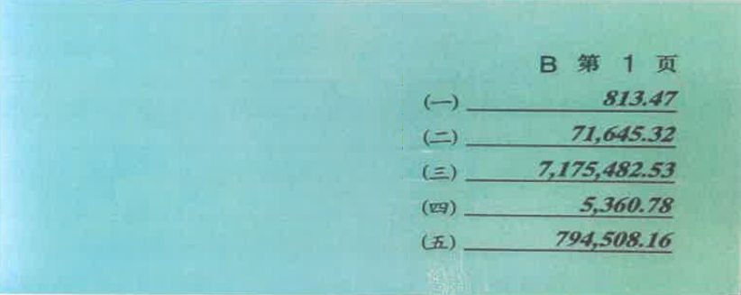

# 河北承德秩序册2025年

承德农信系统

第四届职工业务技能大赛

秩序册

**主办单位：河北省农村信用社联合社承德审计中心**

**协办单位：河北滦平农村商业银行股份有限公司**

**   2025年8月**

目   录

第一章  赛程安排.....................................2

第二章  赛场组织.....................................3

第三章  奖项设置.....................................5

第四章  比赛规则.....................................7

第五章  参赛人员....................................19

第六章  食宿安排....................................24

第七章  注意事项....................................25

第一章  赛程安排

| 日期 | 时间 | 项目 | 参加人员 | 地点 | 备注 |
| :---: | :---: | :---: | :---: | :---: | :---: |
| 8.21 | 14:00-16:00 | 报道 | 各代表队参赛人员 | 滦平庄普凯莱大饭店一楼大厅 | |
| | 16:30-17:00 | 赛前预备会 | 各代表队领队、 工作人员 | | 参会人员需提前10分钟到场 |
| | 17:00-17:30 | 裁判培训会 | 各代表队工作人员 | | |
| | 17:30-20:00 | 晚餐 | | 庄普饭店1楼自助餐厅 | |
| 8.22 | 8:00-8:30 | 开幕式 | 审计中心领导，各代表队领队、工作人员、选手 | 庄普饭店 | 各代表队需提前20分钟就位 |
| | 9:00-9:30 | 零售业务 | 零售业务参赛选手 | | 机器点钞选手及裁判候场 |
| | 9:50-10:00 | 手工点钞 | 手工点钞选手 | | 传票算选手候场 |
| | 10:20-10:50 | 传票算 | 传票算选手 | | 手工点钞选手及裁判候场 |
| | 11:10-11:30 | 机器点钞 | 机器点钞选手 | | |
| | 11:40-13:00 | 午餐 | | 庄普饭店1楼自助餐厅 | 对公业务选手于12:30候场 |
| | 13:00-13:30 | 对公业务 | 对公业务选手 | | 厅堂服务选手候场 |
| | 13:40-14:40 | 厅堂服务 | 厅堂服务选手 | | 理论考试第一场选手候场 |
| | 14:50-15:20 | 理论考试第一场 | 理论考试第一场选手 | | 理论考试第二场选手候场 |
| | 15:30-16:00 | 理论考试第二场 | 理论考试第二场选手 | | 理论考试第三场选手候场 |
| | 16:10-16:40 | 理论考试第三场 | 理论考试第三场选手 | | 理论考试第四场选手候场 |
| | 16:50-17:20 | 理论考试第四场 | 理论考试第四场选手 | | |
| | 17:30-18:00 | 闭幕式 | 审计中心领导，各代表队领队、工作人员、选手 | | |

注：候场地址统一设置在主会场。

第二章  赛场须知

为保证此次大赛公平、公正开展，有效规范各比赛项目内容及比赛流程，特制定比赛规则与评分标准如下：

一、比赛要求

（一）参赛选手不得携带与竞赛无关的电子设备、通讯设备及其他相关资料与用品。

（二）参赛选手座次凭抽签决定，每场竞赛选手须提前30分钟到达指定检录地点，凭有效身份证件检录，按要求入场，不得迟到。

（三）在比赛过程中，参赛选手如有疑问，应举手示意，裁判人员按照有关要求应及时予以答疑。确因计算机软件或硬件故障致使操作无法进行，经确认同意后予以启动备用计算机。

（四）参赛代表队若对竞赛结果有异议的，须由领队按规程提出书面申诉，裁判组调查后予以回复。

二、比赛环境设施

（一）手工点钞赛项选手可自带点钞油、点钞蜡、印泥、蘸水盒等，自带名章（章质不限，可以使用原子印章，不得使用滚轮章和指章）；传票算赛项传票采用70g翻打传票专用纸印制，选手自带计算器（不得使用插电计算器和Excel软件，不得携带夹子、口取纸等辅助工具）。

（二）参加机器点钞比赛的选手，须自带统一品牌统一型号的点钞机（型号:跃创JBYD-YC088(A)，该品牌为全省农信社招投标入围品牌）。

（三）竞赛统一提供装有相同操作系统的电脑以及鼠标键盘，鼠标、键盘不允许选手自带。每台电脑配备Windows自带计算器软件并预装搜狗五笔、极品五笔、86五笔、王码五笔、陈桥五笔、全拼、智能abc及搜狗拼音等8种输入法。

（四）零售业务和对公业务赛项可以使用自带计算器（非插电型号）、Windows计算器和Excel做相关计算。竞赛时除电脑自带快捷功能外，参赛选手不得通过键盘、输入法等自行设置词组、词条等快捷方式进行操作，一经发现取消比赛成绩。

（五）每个座位上配备1支笔和2张草稿纸，参赛选手在竞赛过程中如确需更多草稿纸可向裁判人员举手索取。

第三章  奖项设置

一、个人奖。理论考试、零售业务、对公业务、传票算、手工点钞、机器点钞、厅堂服务等7个赛项，根据成绩排名分别设置一等奖1名、二等奖2名、三等奖3名，优秀奖6名。各选手单项赛分数排名如相同，根据各选手比赛用时排名，如比赛用时仍相同，名次并列（个人单项不得出现并列第一名，需加赛决出最终胜负），下一名次按单项名次并列个数顺延，如：有两个并列第二名，则没有第三名，下一名为第四名，依此类推。

各选手在单项赛中如有因比赛失误、缺席、弃权、严重犯规被取消比赛成绩的，该选手在该单项得分按0分计算。

二、团体奖。团体成绩根据参赛选手理论考试、零售业务、对公业务、传票算、手工点钞、机器点钞、厅堂服务人均排名之和计算，排名之和少者在前。分别设一等奖1名、二等奖2名、三等奖3名。各赛项人均排名计算方法：每队理论考试人均排名为该队参赛选手排名之和除以12；每队零售业务、对公业务、手工点钞、机器点钞、传票算、厅堂服务赛项人均排名为该队该赛项参赛选手排名之和除以2。如各团体排名出现并列，按照获个人奖第一名的人数之和区分先后；仍有并列，按照获个人奖第二名的人数之和区分先后，以此类推。

三、优秀组织奖。设优秀组织奖1名，表彰在本次比赛筹备和组织过程中组织得力、准备充分、精神面貌突出的代表队。

（四）奖励标准。为鼓励先进，表彰优秀，根据相关规定并参照往届承德市农信系统职工业务技能大赛惯例，对各类奖项获得者颁发获奖证书、奖杯等，并给予一定奖金奖励。

第四章  比赛规则

一、理论考试

（一）竞赛分值：100分。

（二）竞赛时间：30分钟。

（三）评分标准：比赛环节成绩评定由系统自动评分，题型为单选题、多选题、判断题，共160道考题，其中单选80题（每题0.5分）、多选40题（每题1分）、判断40题（每题0.5分），多选题答案少选、多选或错选均不计分。比赛提前完成的可得奖励分（在全部正确的基础上，每提前一秒奖励0.01分）。若出现分数相同者，提交时间靠前者排名靠前。

（四）项目任务：主要考核民法典、中国人民银行法、商业银行法、银行业监督管理办法等相关法条，以及反洗钱管理、司法查冻扣管理、现金管理、账户管理和支付结算管理等基础知识。结合相关文件形成理论考试题库，正式比赛中理论考试题目从理论考试题库中随机抽取。

（五）操作流程：

1.选手提前进入考场，按照提前发放的选手账号和密码登陆比赛平台，点击理论知识考试图标后，系统进入倒计时界面；

2.倒计时为“0”时自行开始答题；

3.提前完成的选手可以提前“提交”，比赛时间结束时，系统会自动“提交”。

二、零售业务赛项

（一）竞赛分值：100分。

（二）竞赛时间：30分钟。

（三）评分标准：竞赛环节成绩评定由计算机系统自动评分，在全部正确的基础上，每提前提交1秒奖励0.01分，若出现分数相同者，提交时间靠前者排名靠前。

（四）项目任务：零售业务操作包括通用业务、借记卡业务、储蓄业务、个人贷款业务、信用卡业务和农信银支付业务等。具体如下表所示：

| **序号** | **竞赛任务** | **具体内容** |
| :---: | :---: | --- |
| 1 | 通用业务 | 凭证出库、换存单、密码修改、凭证挂失与解挂、账户销户、凭证入库、现金入库 |
| 2 | 储蓄业务 | 客户管理、普通活期、零存整取、整存零取、存本取息、通知存款 |
| 3 | 借记卡业务 | 客户管理、借记卡活期、借记卡整存整取、借记卡零存整取、借记卡定活两便、借记卡通知存款 |
| 4 | 个人贷款业务 | 个人贷款合同维护、个人贷款发放、提前全部还款 |
| 5 | 信用卡业务 | 激活信用卡、柜面缴款、预借现金 |
| 6 | 支付结算业务 | 汇兑来账、汇兑往账 |

（五）操作流程：

（1）选手提前进入考场，按照提前发放的选手账号和密码登陆比赛系统，点击零售业务图标后，系统进入倒计时界面。

（2）倒计时为“0”时自行开始答题操作。

（3）提前完成的选手可以提前“提交”，比赛时间结束时，系统将自动“提交”。

三、对公业务赛项

（一）竞赛分值：100分。

（二）竞赛时间：30分钟。

（三）评分标准：竞赛环节成绩评定由系统自动评分，在全部正确的基础上，每提前提交一秒奖励0.01分，若出现分数相同者，提交时间靠前者排名靠前。

（四）项目任务：对公业务操作包括对公贷款业务、公司存款业务、结算业务、联行业务、代理业务、农信银支付业务等。具体如下表所示：

| **序号** | **竞赛任务** | **具体内容** |
| :---: | :---: | --- |
| 1 | 通用业务 | 凭证出库、支票出售、支票挂失与解挂、凭证入库、现金入库 |
| 2 | 公司存款业务 | 新开公司客户号、新开公司存款账户、现金存款、现金取款、新开户现金存款、新开户转账存款、部分提取转账 |
| 3 | 票据业务 | 银行承兑汇票承兑、银行承兑汇票注销、银行承兑汇票到期付款 |
| 4 | 支付结算业务 | 同城提出代付、同城提出代收、汇兑来账、汇兑往账 |
| 5 | 代理业务 | 代理合同管理、代理批量管理、批量托收、批量托付 |

（五）操作流程：

1.选手提前进入考场，按照提前发放的选手账号和密码登陆比赛系统，点击对公业务图标后，系统进入倒计时界面。

2.倒计时为“0”时自行开始答题操作。

3.提前完成的选手可以提前“提交”，比赛时间结束时，系统将自动“提交”。

四、传票算赛项

（一）竞赛分值：100分。

（二）竞赛时间：10分钟。

（三）评分标准：该项目采用计算机系统自动评分，按正确答案数记分，选手每提交一组正确数字可得5分，提交不正确的则不得分;在全部正确的基础上，每提前提交一秒奖励0.01分，若出现分数相同者，提交时间靠前者排名靠前。传票算赛项选手拥有2次机会，取每名选手最好成绩记为最终成绩。禁止选手心算累加后录入数据，一经发现选手成绩按0分计算。

（四）项目任务：汇总票据数值、录入汇总票据数值、提交结果。

（五）传票说明：

练习和比赛使用五行式百张传票（手写体），每组传票十本，编号分别为(A)、(B)、(C)、(D)、(E)、(F)、(G)、(H)、(I)、(J)。每张传票上各印有编号为（一）、（二）、（三）、（四）、（五）的五排4-9位数字；传票右上角字符表示传票本编号及其页码。传票样式如图所示：

（六）操作流程：

1.选手提前进入考场，按照提前发放的选手账号和密码登陆比赛平台，点击传票算赛项图标后，系统进入倒计时界面。

2.倒计时结束后，系统随机在十本传票中选择四本，指定每本连续20页传票中排序号相同的数字为一组，共20组数。选手10分钟翻打20组数（使用计算器将每组20个数字相加），并按“凭证汇总结果提交表”指定的传票编号和页码顺序将每组数字计算结果填入表中提交。选手无需填写千分位号和小数点，计算结果小数点后数字为“0”时需要补“0”。竞赛平台中“凭证汇总结果提交表”样式如下（比赛时的编号和页码范围由系统随机指定）：

 凭证汇总结果提交表

| 编号和页码范围 | 数字顺序号 | 汇总结果 | | | | | | | | |
| :---: | :---: | --- | --- | --- | --- | --- | --- | --- | --- | --- |
| (E)第80-99页 | （一） |  |  |  |  |  |  |  |  |  |
| | （二） |  |  |  |  |  |  |  |  |  |
| | （三） |  |  |  |  |  |  |  |  |  |
| | （四） |  |  |  |  |  |  |  |  |  |
| | （五） |  |  |  |  |  |  |  |  |  |
| (G)第2-21页 | （一） |  |  |  |  |  |  |  |  |  |
| | （二） |  |  |  |  |  |  |  |  |  |
| | （三） |  |  |  |  |  |  |  |  |  |
| | （四） |  |  |  |  |  |  |  |  |  |
| | （五） |  |  |  |  |  |  |  |  |  |
| (H)第62-81页 | （一） |  |  |  |  |  |  |  |  |  |
| | （二） |  |  |  |  |  |  |  |  |  |
| | （三） |  |  |  |  |  |  |  |  |  |
| | （四） |  |  |  |  |  |  |  |  |  |
| | （五） |  |  |  |  |  |  |  |  |  |
| (J)第10-29页 | （一） |  |  |  |  |  |  |  |  |  |
| | （二） |  |  |  |  |  |  |  |  |  |
| | （三） |  |  |  |  |  |  |  |  |  |
| | （四） |  |  |  |  |  |  |  |  |  |
| | （五） |  |  |  |  |  |  |  |  |  |

3.提前完成的选手可以提前“提交”，比赛时间结束时系统将自动“提交”。

五、手工点钞

（一）竞赛分值：100分。

（二）竞赛时间：10分钟。

（三）竞赛方法：参赛选手对不同面额的点钞券进行点数、扎把、盖章，将每种面额的张数和金额录入系统中，全部完成后提交。

（四）竞赛要求：

1.选手提前进入考场，按照提前发放的选手账号和密码登陆比赛系统，点击手工点钞赛项图标进入比赛平台后，系统进入倒计时界面。

倒计时为“0”时开始点钞，提前拿取点钞券的按作弊处理，本项目记“0”分。

2.参赛选手使用的点钞券、扎把条由组委会统一提供，点钞券为全新未使用过的专用练功券，包括四种面额，分别是100元、50元、20元、10元，每种面额钞券数量在500--599范围内不等；本人名章、蘸水盒、印台等用具由参赛选手自备。

3.参赛选手一律使用单指单张指法点钞；扎把要求必须为100张/把，扎把位置在钞券二分之一或三分之一处，扎把方式不限、圈数不限；盖章要求必须盖在扎把腰条侧面，任一侧面均可；同一面额点钞券剩余不足100张的扎把后在腰条正面写清张数并盖章。

4.参赛选手点钞时一律不准使用胶套、甘油或其它粘液。

5.提前完成竞赛的参赛选手可以提前“提交”，竞赛时间结束时系统自动“提交”；“提交”后参赛选手应向裁判员举手示意，不得有任何其他操作，等待现场裁判员复核确认并登记成绩。

（五）评分标准：

1.本项目采用系统自动评分与现场裁判员评分相结合的方法评分，现场裁判员当场裁判后，确定扣分项及扣分数，在系统自动评分基础上进行扣分，最低为零分。

2.系统自动评分：点钞数量采用系统自动评分，竞赛时间内以录入每种面额的张数和金额为计分依据，每正确录入一种面额的张数或金额得12.5分，未录入或录入不正确的不得分；提前完成的，在全部正确的基础上，每提前一秒奖励0.01分。

3.未扎把或扎把不符要求的每把扣1分，最高扣20分；未盖章或盖章不符要求的每把扣1分，最高扣20分；现场裁判员当场复核评定并填写成绩单，由参赛人员签字确认，交裁判组汇总。现场裁判员评分细则如下：

①扎把不符合要求分为三种情况：a.散把或能自然抽张；b.扎把过紧呈船型；c.成把券未墩齐，露头部分上下或左右错开超过5毫米。

②盖章不符合要求分为二种情况：a.未盖在指定位置；b.盖章不清晰，不能分辨文字。

六、机器点钞赛项

（一）比赛分值：100分。

（二）比赛时间：5分钟。

（三）项目任务：

比赛使用统一的竞赛系统，选手自带点钞机（型号：跃创JBYD-YC088(A)），在规定时间内清点完所放置的40个钞把，按照钞把顺序进行拆把、机器点数、扎把、标记答数及盖章，将每把的差错进行机器答数，确认无误后点击提交。 

练功券差错设置方式：练功券在比赛前预先设置若干个差错钞把，差错率低于40%。参赛选手应按序逐把清点练功券，一把一清。捆扎时需将原缠钱条置于首张练功券上方一并扎把，同时标记答数。

差错钞把标记答数方式：每把练功券的清点结果减去100即为答数。答数写在缠钱条有骑缝处（即腰条缠绕处）的一面。以“+”表示多，以“-”表示少。如钞把为100张，则无需答数；如钞把为101张，则表示为“+1”；如钞把为98张，则表示为“-2”。挑出的差错钞把应单独摆放。

（四）评分标准：

1.该项目采用系统自动评分与现场裁判评分。

2.系统自动评分：

①按系统事先设置的正确数值，在规定时间内未录入或录入不正确的，该采分点不得分。

②在全对的情况下提前完成可获得奖励分，每提前1秒钟加0.01分。

3.现场裁判评分：

①不听比赛口令、使用手指章及滚轮章等特殊印章的不计成绩（可以使用原子章）。

②钞把未敦齐的，即露头部分上下错开超过 3毫米以上的扣1分。

③扎把腰条应扎在钞票的二分之一或三分之一处，扎把方式不限，扎把不宜过紧，如呈船形，以考场签字笔为准，如能穿过，则视为扎把不合格，每把扣1分；扎把也不宜过松，如已扎把好的钞票裁判员随意拿起任意一张，有散把出现的情况，视为扎把不合格，每把扣1分。

④个人名章盖在扎把条侧面，如若不清，允许二次补盖（每把钞票上最多允许出现两个章印），文字清晰可见，模糊不清者，视为盖章不合格，每把扣1分。

（五）操作流程：

①选手入场后，应听从裁判长指挥，在裁判扣分表各栏如实填写个人信息，登录比赛系统进入倒计时，准备时间为10分钟。准备期间确认验钞机是否调整为仅计数不识别假币状态，移动捆扎条、个人名章等可将其摆放至习惯的位置，并可做移动钞票及墩齐等动作，但不可进行点算，倒计时结束自行开始比赛。

②使用点钞机清点面额50元的钞票。张数范围为3950-4000张，以钞把形式放置在指定区域，比赛开始，选手拿练功券进行点数，必须完成拆把、机器点数、扎把、标记答数、盖章五道工序，并将数据填入对应区域才能点击提交。

③“提交”后选手应立即起立，不得有任何操作，否则按照违规处理。

七、厅堂服务

（一）竞赛分值：100分。

（二）竞赛时间：60分钟。

（三）评分标准：厅堂服务竞赛成绩由系统自动评分。若出现分数相同者，提交时间靠前者排名靠前。 

（四）项目任务：包含客户引导与分流、客户问询处理、单据填写、假币鉴别、残/污损币的兑换、异议及投诉处理、签名与盖章、营销转介等日常厅堂服务业务技能知识。

（五）操作流程：

1.选手按照比赛前发放的用户名和密码登陆系统，选择厅堂服务图标至倒计时界面。

2.倒计时为“0”时自行开始操作；

3.提前完成的选手可以提前“提交”。比赛时间结束时，系统将自动“提交”。

第五章  参赛人员

郊区联社代表队

| 序号 | **人员** | | **姓  名** | **性别** | **民族** | **单位（简称）** | **职务（或岗位）** |
| :---: | :---: | --- | :---: | :---: | :---: | :---: | :---: |
| 1 | **领队** | | 侯冬雪 | 男 | 汉族 | 郊区联社 | 工会主席 |
| 2 | **工作人员** | | 孙丽丽 | 女 | 汉族 | 郊区联社工会 | 科员 |
| 3 | **参赛选手** | **零售业务** | 李俊红 | 女 | 满族 | 火神庙信用社 | 委派会计 |
| 4 | | | 施亚楠 | 女 | 满族 | 大石庙信用社 | 委派会计 |
| 5 | | **对公业务** | 户川泓 | 男 | 汉族 | 偏桥子信用社 | 柜员 |
| 6 | | | 张鹏 | 男 | 蒙古族 | 牛圈子沟信用社 | 柜员 |
| 7 | | **传票算** | 王琨 | 女 | 满族 | 晨阳分社 | 柜员 |
| 8 | | | 雒奕涵 | 女 | 蒙古族 | 小佟沟信用社 | 客户经理 |
| 9 | | **手工点钞** | 张金 | 男 | 回族  | 晨阳分社 | 柜员 |
| 10 | | | 张立佳 | 女 | 满族 | 小佟沟信用社 | 柜员 |
| 11 | | **机器点钞** | 石川 | 男 | 汉族 | 双桥区小贷中心 | 客户经理 |
| 12 | | | 祁迹 | 女 | 满族 | 陈栅子信用社 | 柜员 |
| 13 | | **厅堂服务** | 赵智勇   | 男 | 满族 | 老西营信用社 | 委派会计 |
| 14 | | | 康称新 | 男 | 汉族 | 竹林寺分社 | 柜员 |

围场农商行代表队

| 序号 | **人员** | | 姓  名 | **性别** | **民族** | **单位（简称）** | **职务（或岗位）** |
| :---: | :---: | --- | :---: | :---: | :---: | :---: | :---: |
| 1 | **领队** | | 于志彬 | 男 | 满族 | 围场农商银行 | 副行长、工会主席 |
| 2 | **工作人员** | | 姚丽娜 | 女 | 满族 | 围场农商银行 | 工会副主席 |
| 3 | **参赛选手** | **零售业务** | 丁赛楠 | 女 | 满族 | 哈里哈支行 | 委派会计 |
| 4 | | | 梁磊 | 女 | 满族 | 新 地支行 | 委派会计 |
| 5 | | **对公业务** | 闫冰 | 女 | 满族 | 围场镇支行 | 分社负责人 |
| 6 | | | 崔昊 | 男 | 满族 | 道坝子支行 | 前台柜员 |
| 7 | | **传票算** | 孙洋 | 女 | 满族 | 腰站支行 | 前台柜员 |
| 8 | | | 杨永凤 | 女 | 满族 | 营业部 | 委派会计 |
| 9 | | **手工点钞** | 李莹 | 女 | 满族 | 木兰绿色支行 | 副行长 |
| 10 | | | 徐冉 | 女 | 满族 | 广发永支行 | 委派会计 |
| 11 | | **机器点钞** | 赵妍 | 女 | 满族 | 围场镇支行 | 分社负责人 |
| 12 | | | 毕文萱 | 女 | 满族 | 姜家店支行 | 前台柜员 |
| 13 | | **厅堂服务** | 孟祥磊 | 男 | 满族 | 牌  楼支行 | 委派会计 |
| 14 | | | 孟渤宇 | 男 | 满族 | 四合永支行 | 客户经理 |

丰宁农商行代表队

| 序号 | **人员** | | 姓  名 | **性别** | **民族** | **单位（简称）** | **职务（或岗位）** |
| :---: | :---: | --- | --- | :---: | :---: | --- | :---: |
| 1 | **领队** | | 张海旺 | 男 | 满 | 丰宁农商行 | 工会主席 |
| 2 | **工作人员** | | 张特 | 女 | 满 | 综合办公室 | 科员 |
| 3 | **参赛选手** | **零售业务** | 苏英莹 | 女 | 满 | 营业部 | 委派会计 |
| 4 | | | 孙经纬 | 女 | 满 | 白塔支行 | 柜员 |
| 5 | | **对公业务** | 赵莹 | 女 | 满 | 大阁支行 | 委派会计 |
| 6 | | | 郭丽楠 | 女 | 汉 | 营业部 | 柜员 |
| 7 | | **传票算** | 李登泰 | 男 | 汉 | 信贷管理部 | 科员 |
| 8 | | | 王雪 | 女 | 满 | 南辛营支行 | 柜员 |
| 9 | | **手工点钞** | 石馨雨 | 女 | 满 | 大阁支行 | 柜员 |
| 10 | | | 陈雪 | 女 | 满 | 西官营支行 | 委派会计 |
| 11 | | **机器点钞** | 鲍韵昕 | 女 | 满 | 新型小贷中心 | 客户经理 |
| 12 | | | 孔媛 | 女 | 满 | 凤山支行 | 柜员 |
| 13 | | **厅堂服务** | 马东旭 | 女 | 满 | 金融市场部 | 科员 |
| 14 | | | 李奇祺 | 男 | 满 | 天桥支行 | 柜员 |

隆化县联社代表队

| 序号 | **人员** | | 姓  名 | **性别** | **民族** | **单位（简称）** | **职务（或岗位）** |
| :---: | :---: | --- | :---: | :---: | :---: | :---: | :---: |
| 1 | **领队** | | 于小明 | 男 | 满族 | 隆化联社 | 联社副主任 |
| 2 | **工作人员** | | 迟晓燕 | 女 | 满族 | 隆化联社 | 职员 |
| 3 | **参赛选手** | **零售业务** | 王宝鑫 | 男 | 满 | 汤头沟信用社 | 客户经理 |
| 4 | | | 董乾坤 | 男 | 满 | 庙子沟信用社 | 客户经理 |
| 5 | | **对公业务** | 何珊 | 女 | 满 | 存瑞信用社 | 柜员 |
| 6 | | | 程妍 | 女 | 汉族 | 营业部 | 柜员 |
| 7 | | **传票算** | 安刚 | 男 | 满族 | 荒地信用社 | 客户经理 |
| 8 | | | 温东昊 | 男 | 汉 | 郭家屯信用社 | 柜员 |
| 9 | | **手工点钞** | 衡菲 | 女 | 满 | 隆化镇信用社 | 客户经理 |
| 10 | | | 张燕慧 | 女 | 汉 | 茅荆坝信用社 | 柜员 |
| 11 | | **机器点钞** | 杨佳杰 | 女 | 蒙古 | 八达营信用社 | 柜员 |
| 12 | | | 周明宇 | 女 | 汉 | 七家信用社 | 柜员 |
| 13 | | **厅堂服务** | 李浩然 | 男 | 满 | 张三营信用社 | 柜员 |
| 14 | | | 杨柳 | 女 | 满 | 四道营信用社 | 客户经理 |

热河农商行代表队

| 序号 | **人员** | | 姓  名 | **性别** | **民族** | **单位（简称）** | **职务（或岗位）** |
| :---: | :---: | --- | :---: | :---: | :---: | :---: | :---: |
| 1 | **领队** | | 白鹏 | 男 | 汉族 | 热河农商银行 | 副行长、工会主席 |
| 2 | **工作人员** | | 计志强 | 男 | 满族 | 工会 | 经审委主任 |
| 3 | **参赛选手** | **零售业务** | 于宏宇 | 男 | 汉族 | 大郭杖子支行 | 委派会计 |
| 4 | | | 赵暖 | 男 | 满族 | 新杖子支行 | 综合柜员 |
| 5 | | **对公业务** | 宁鑫 | 女 | 蒙古族 | 综合办公室 | 科员 |
| 6 | | | 赵冬雪 | 女 | 汉族 | 上谷支行 | 综合柜员 |
| 7 | | **传票算** | 张小玉 | 女 | 满族 | 大平台支行 | 副行长 |
| 8 | | | 冯梦月 | 女 | 汉族 | 营业部 | 综合柜员 |
| 9 | | **手工点钞** | 高继丽 | 女 | 汉族 | 营业部 | 综合柜员 |
| 10 | | | 赵鑫 | 女 | 汉族 | 岔沟支行 | 综合柜员 |
| 11 | | **机器点钞** | 刘帅 | 男 | 满族 | 大营子支行 | 综合柜员 |
| 12 | | | 李爽 | 女 | 汉族 | 石灰窑支行 | 综合柜员 |
| 13 | | **厅堂服务** | 王维佳 | 女 | 满族 | 营业部 | 综合柜员 |
| 14 | | | 梁馨月 | 女 | 汉族 | 科技部 | 科员 |

平泉市联社代表队

| 序号 | **人员** | | 姓  名 | **性别** | **民族** | **单位（简称）** | **职务（或岗位）** |
| :---: | :---: | --- | :---: | :---: | :---: | :---: | :---: |
| 1 | **领队** | | 王占山 | 男 | 汉族 | 平泉联社 | 副主任 |
| 2 | **工作人员** | | 高立平 | 男 | 满族 | 综合办公室 | 科员 |
| 3 | **参赛选手** | **零售业务** | 张跃 | 男 | 满族 | 双旺信用社 | 副主任 |
| 4 | | | 金熙辰 | 男 | 满族 | 平北信用社 | 柜员 |
| 5 | | **对公业务** | 王静楠 | 女 | 满族 | 财务会计部 | 科员 |
| 6 | | | 徐子月 | 女 | 满族 | 南岭信用社 | 柜员 |
| 7 | | **传票算** | 王佳琦 | 女 | 满族 | 财务会计部 | 副经理 |
| 8 | | | 王宇坤 | 女 | 汉族 | 黄土梁子信用社 | 客户经理 |
| 9 | | **手工点钞** | 杜亚新 | 女 | 满族 | 综合办公室 | 科员 |
| 10 | | | 李菲 | 女 | 汉族 | 西坝信用社 | 柜员 |
| 11 | | **机器点钞** | 鲍晓娟 | 女 | 汉族 | 府佑信用社 | 柜员 |
| 12 | | | 高鹏飞 | 男 | 满族 | 台头山信用社 | 委派会计 |
| 13 | | **厅堂服务** | 刘佳 | 女 | 汉族 | 城北信用社 | 柜员 |
| 14 | | | 蓝冠达 | 男 | 壮族 | 山子后信用社 | 柜员 |

滦平农商行代表队

| 序号 | **人员** | | 姓  名 | **性别** | **民族** | **单位（简称）** | **职务（或岗位）** |
| :---: | :---: | --- | :---: | :---: | :---: | :---: | :---: |
| 1 | **领队** | | 王明松 | 男 | 满 | 滦平农商银行 | 总行副行长、工会主席 |
| 2 | **工作人员** | | 谭琪 | 女 | 满 | 滦平农商银行 | 工会副主席 |
| 3 | **参赛选手** | **零售业务** | 赵振 | 男 | 满 | 滦平镇支行 | 委派会计 |
| 4 | | | 张俊恺 | 男 | 满 | 滦平镇支行 | 副行长 |
| 5 | | **对公业务** | 钱子琪 | 男 | 满族 | 付家店支行 | 副行长 |
| 6 | | | 高雨桐 | 女 | 满族 | 巴克什营支行 | 柜员 |
| 7 | | **传票算** | 李敏 | 女 | 满族 | 营业部 | 柜员 |
| 8 | | | 王夏萌 | 女 | 满族 | 鞍匠屯支行 | 委派会计 |
| 9 | | **手工点钞** | 陈新雨 | 男 | 汉族 | 两间房支行 | 委派会计 |
| 10 | | | 袁浩 | 男 | 满族 | 运营管理部 | 科员 |
| 11 | | **机器点钞** | 池天溢 | 男 | 汉族 | 红旗支行 | 柜员 |
| 12 | | | 刘阳 | 男 | 满族 | 巴克什营支行 | 委派会计 |
| 13 | | **厅堂服务** | 吕秀慧 | 女 | 汉语 | 运营管理部 | 科员 |
| 14 | | | 张政 | 女 | 满族 | 大屯支行 | 柜员 |

宽城农商行代表队

| 序号 | **人员** | | 姓  名 | **性别** | **民族** | **单位（简称）** | **职务（或岗位）** |
| :---: | :---: | --- | :---: | :---: | :---: | :---: | :---: |
| 1 | **领队** | | 张继华 | 男 | 满族 | 宽城农商行 | 工会主席 |
| 2 | **工作人员** | | 白志芳 | 女 | 满族 | 宽城农商行 | 科员 |
| 3 | **参赛选手** | **零售业务** | 曾星瑞 | 男 | 满族 | 宽城农商行 | 客户经理 |
| 4 | | | 李同跃 | 男 | 满族 | 宽城农商行 | 客户经理 |
| 5 | | **对公业务** | 殷久振 | 男 | 满族 | 宽城农商行 | 会计 |
| 6 | | | 李辉 | 男 | 满族 | 宽城农商行 | 会计 |
| 7 | | **传票算** | 张惠宁 | 男 | 满族 | 宽城农商行 | 支行行长 |
| 8 | | | 席啸晨 | 男 | 满族 | 宽城农商行 | 会计 |
| 9 | | **手工点钞** | 王岩 | 女 | 满族 | 宽城农商行 | 柜员 |
| 10 | | | 蒋佳妍 | 女 | 满族 | 宽城农商行 | 柜员 |
| 11 | | **机器点钞** | 宁双庆 | 男 | 满族 | 宽城农商行 | 柜员 |
| 12 | | | 韩冰 | 女 | 满族 | 宽城农商行 | 柜员 |
| 13 | | **厅堂服务** | 李嘉伟 | 男 | 满族 | 宽城农商行 | 会计 |
| 14 | | | 张冬伟 | 男 | 满族 | 宽城农商行 | 柜员 |

兴隆县联社代表队

| 序号 | **人员** | | 姓  名 | **性别** | **民族** | **单位（简称）** | **职务（或岗位）** |
| :---: | :---: | --- | :---: | :---: | :---: | :---: | :---: |
| 1 | **领队** | | 于旺 | 男 | 蒙 | 兴隆联社 | 联社主任 |
| 2 | **工作人员** | | 杨德全 | 男 | 汉 | 兴隆联社 | 工 会 |
| 3 | **参赛选手** | **零售业务** | 梁 智   | 男 | 满 | 兴隆联社 | 柜员 |
| 4 | | | 高 悦 | 女 | 汉 | 兴隆联社 | 柜员 |
| 5 | | **对公业务** | 郑 晨 | 女 | 汉 | 兴隆联社 | 柜员 |
| 6 | | |  李娜娜 | 女 | 汉 | 兴隆联社 | 委派会计 |
| 7 | | **传票算** | 王素琴   | 女 | 汉 | 兴隆联社 | 柜员 |
| 8 | | | 张佳琦 | 女 | 汉 | 兴隆联社 | 柜员 |
| 9 | | **手工点钞** | 史晨冉   | 男 | 汉 | 兴隆联社 | 柜员 |
| 10 | | | 白 璐 | 女 | 满 | 兴隆联社 | 柜员 |
| 11 | | **机器点钞** | 李佳鑫   | 女 | 汉 | 兴隆联社 | 客户经理 |
| 12 | | | 郭金梦 | 女 | 汉 | 兴隆联社 | 柜员 |
| 13 | | **厅堂服务** | 郝宗颖  | 女 | 满 | 兴隆联社 | 柜员 |
| 14 | | | 赵雯丽 | 女 | 满 | 兴隆联社 | 柜员 |

第六章  食宿安排

一、住宿安排

各代表队统一听从酒店前台工作人员根据事先安排好的房间凭身份证办理入住。

二、就餐安排

早、午、晚餐地点：庄普饭店一楼自助餐厅

9.28晚自助餐时间为18:00-20:00

9.29早自助餐时间为06:00-07:30

9.29午自助餐时间为11:40-13:00

第七章  注意事项

一、严明纪律

各代表队领队做好参赛准备和组织工作，按照比赛要求组织本队队员按时报到参赛。要严格落实中央八项规定精神，本着节俭节约的原则办赛、参赛，保持艰苦朴素作风，不铺张浪费，不搞特殊化，不参加宴请、聚会，不以各种名义公款请吃、吃请，不出入任何娱乐场所，不公款购物相互馈赠；不以集体为单位组织任何形式的游玩、参观活动，一言一行展现承德农信良好作风和形象。

1. 注意安全

各领队为本代表队安全参赛第一责任人，无论赛前、赛中、赛后，都要时刻注意安全，确保不出任何安全事故。所有司机严禁酒后驾驶、疲劳驾驶、超速驾驶。

三、其他事项

（一）各单位领队及工作人员要熟悉本单位参赛选手的情况，做到心中有数，及时处理解决本队选手比赛中遇到的问题。

（二）抽签登记参赛选手后，不得更换选手序号。

（三）比赛开始后，无关人员不得进入赛场。

（四）本次大赛最终解释权归大赛组委会所有。

> 更新: 2025-11-18 14:35:11  
> 原文: <https://www.yuque.com/lixinsi/hntyk2/bgwlc7wdfb8yqc30>