# 浙江工商漏洞修复

### 1.数据库漏洞补丁修复

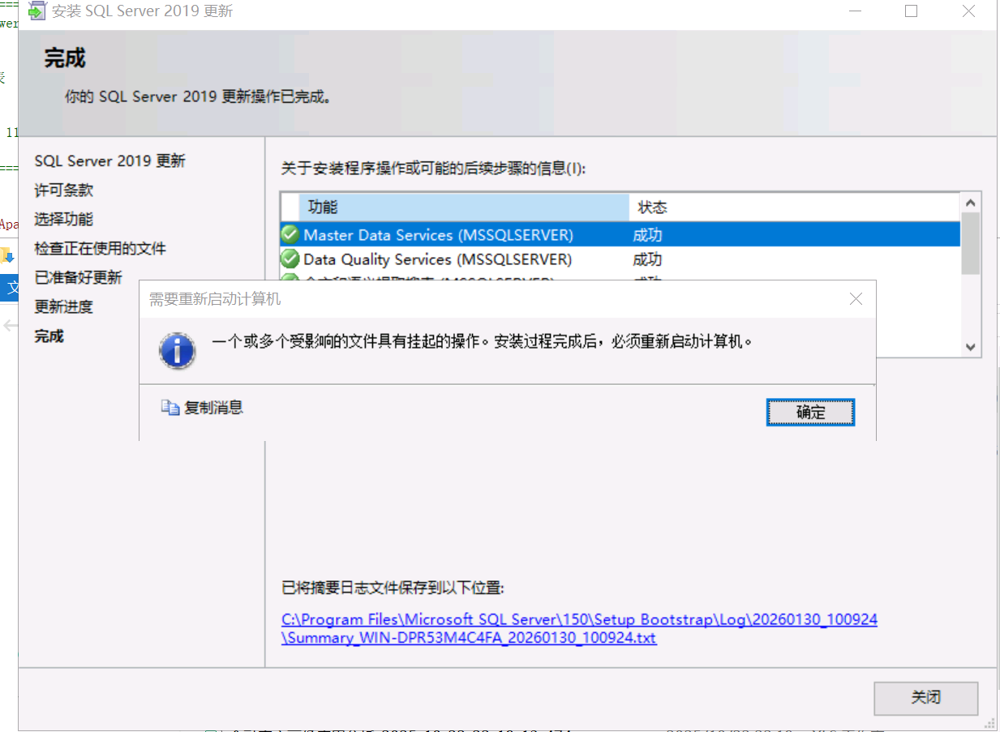

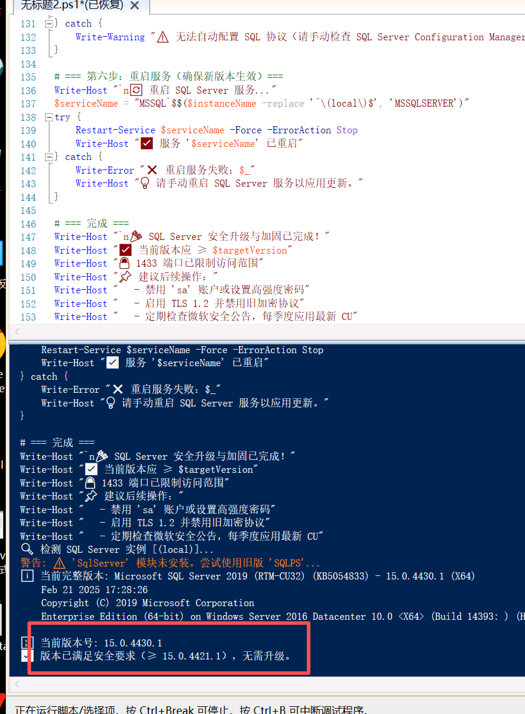

### 2.站点请求头修复

```yaml
Import-Module WebAdministration

$HeadersToAdd = @(
    @{ name = "X-Content-Type-Options"; value = "nosniff" },
    @{ name = "X-Frame-Options";         value = "DENY" },
    @{ name = "X-XSS-Protection";        value = "1; mode=block" }
)

Get-Website | ForEach-Object {
    $siteName = $_.Name
    Write-Host "`n🔧 处理网站: $siteName"
    $configPath = "MACHINE/WEBROOT/APPHOST/$siteName"
    
    $existing = (Get-WebConfigurationProperty -PSPath $configPath -Filter "system.webServer/httpProtocol/customHeaders" -Name Collection -ErrorAction SilentlyContinue)
    $existingNames = if ($existing) { $existing | ForEach-Object { $_.name } } else { @() }

    foreach ($h in $HeadersToAdd) {
        if ($h.name -notin $existingNames) {
            Add-WebConfigurationProperty -PSPath $configPath -Filter "system.webServer/httpProtocol/customHeaders" `
                -Name "." -Value @{name=$h.name; value=$h.value}
            Write-Host "  ✅ 添加 $($h.name)"
        } else {
            Write-Host "  ⚠️  $($h.name) 已存在"
        }
    }
}

Write-Host "`n✅ 所有网站的安全响应头已更新！"
```

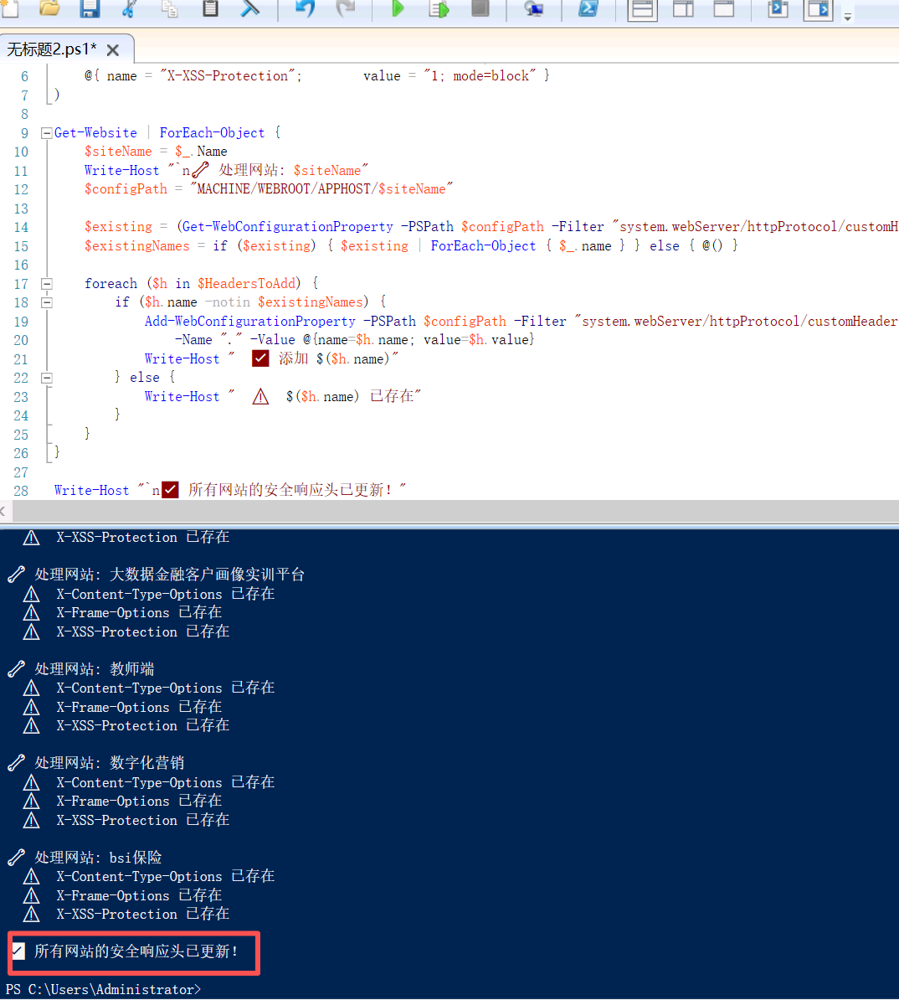

### 3.<font style="color:rgb(0, 128, 0);background-color:rgba(17, 17, 51, 0.02);">Apache Tomcat 升级与安全加固</font>

```yaml
# ===========================================
# Apache Tomcat 安全加固脚本（PowerShell）
# 功能：
#   - 升级提示（需手动下载新版）
#   - 禁用默认应用、AJP、目录列表
#   - 配置安全响应头
#   - 关闭 ICMP 时间戳
#   - 阻止 Traceroute (ICMP Type 11)
#   - 限制 8080 访问源（可选）
# ===========================================

# === 配置参数 ===
$TomcatPath = "C:\apache-tomcat-9.0.50"  # ←←← 请修改为你的实际 Tomcat 路径！
$TrustedIPRange = "10.50.0.0/16"          # ←←← 允许访问 8080 的内网网段

# 检查路径是否存在
if (-not (Test-Path "$TomcatPath\bin\catalina.bat")) {
    Write-Error "❌ 未找到 Tomcat 安装目录: $TomcatPath"
    exit 1
}

# === 第一步：检查当前 Tomcat 版本 ===
$versionFile = "$TomcatPath\RELEASE-NOTES"
if (Test-Path $versionFile) {
    $firstLine = Get-Content $versionFile -TotalCount 1
    Write-Host "ℹ️ 当前 Tomcat 版本: $firstLine"
    
    # 提取版本号（如 9.0.50）
    if ($firstLine -match 'Apache Tomcat/(\d+\.\d+\.\d+)') {
        $currentVer = [version]$matches[1]
        
        # 定义安全版本（截至 2026 年 1 月）
        $safeVer9 = [version]"9.0.94"
        $safeVer10 = [version]"10.1.28"
        $safeVer85 = [version]"8.5.100"

        if (($currentVer.Major -eq 9 -and $currentVer -ge $safeVer9) -or
            ($currentVer.Major -eq 10 -and $currentVer -ge $safeVer10) -or
            ($currentVer.Major -eq 8 -and $currentVer.Minor -eq 5 -and $currentVer -ge $safeVer85)) {
            Write-Host "✅ 版本已安全，无需升级。"
        } else {
            Write-Warning "⚠️ 版本过旧！存在多个 CVE 漏洞。"
            Write-Host "👉 请立即升级到："
            Write-Host "   Tomcat 10.1.28+ (https://tomcat.apache.org/download-10.cgi)"
            Write-Host "   Tomcat 9.0.94+  (https://tomcat.apache.org/download-90.cgi)"
            Write-Host "   Tomcat 8.5.100+ (https://tomcat.apache.org/download-80.cgi)"
            Write-Host "`n💡 升级方法：停止服务 → 替换整个 tomcat 目录 → 同步 conf/webapps"
        }
    }
} else {
    Write-Warning "⚠️ 无法读取版本信息，继续加固配置..."
}

# === 第二步：删除默认示例应用（高危！）===
$defaultApps = @("docs", "examples", "host-manager", "manager", "ROOT")
foreach ($app in $defaultApps) {
    $appPath = "$TomcatPath\webapps\$app"
    if (Test-Path $appPath) {
        Remove-Item -Path $appPath -Recurse -Force
        Write-Host "🗑️ 已删除默认应用: $app"
    }
}

# === 第三步：加固 server.xml ===
$serverXml = "$TomcatPath\conf\server.xml"
if (Test-Path $serverXml) {
    $content = Get-Content $serverXml -Raw

    # 1. 禁用 AJP 连接器（除非使用 Apache httpd）
    if ($content -notmatch '<Connector port="8009" protocol="AJP') {
        Write-Host "✅ AJP 已禁用（未配置）"
    } else {
        # 注释掉 AJP（简单处理：替换为注释）
        $content = $content -replace '(<Connector port="8009".*?/>)', '<!-- $1 -->'
        Write-Host "🔒 已禁用 AJP 连接器（端口 8009）"
    }

    # 2. 禁用目录列表（全局）
    if ($content -notmatch 'listings="false"') {
        $content = $content -replace '(<Context)', '<Context listings="false"'
        Write-Host "🔒 已禁用目录列表"
    }

    # 保存
    Set-Content -Path $serverXml -Value $content -Encoding UTF8
}

# === 第四步：添加安全响应头（通过 web.xml）===
$webXml = "$TomcatPath\conf\web.xml"
if (Test-Path $webXml) {
    $filterContent = @'
    <filter>
        <filter-name>SecurityHeadersFilter</filter-name>
        <filter-class>org.apache.catalina.filters.HttpHeaderSecurityFilter</filter-class>
        <init-param>
            <param-name>antiClickJackingOption</param-name>
            <param-value>SAMEORIGIN</param-value>
        </init-param>
        <init-param>
            <param-name>xssProtectionEnabled</param-name>
            <param-value>true</param-value>
        </init-param>
        <init-param>
            <param-name>blockContentTypeSniffingEnabled</param-name>
            <param-value>true</param-value>
        </init-param>
    </filter>
    <filter-mapping>
        <filter-name>SecurityHeadersFilter</filter-name>
        <url-pattern>/*</url-pattern>
    </filter-mapping>
'@

    $webContent = Get-Content $webXml -Raw

    # 避免重复添加
    if ($webContent -notmatch "SecurityHeadersFilter") {
        # 插入到 </web-app> 之前
        $webContent = $webContent -replace '</web-app>', "$filterContent`n</web-app>"
        Set-Content -Path $webXml -Value $webContent -Encoding UTF8
        Write-Host "🛡️ 已添加安全响应头（X-Frame-Options, XSS-Protection, nosniff）"
    }
}

# === 第五步：系统级防护 ===

# 1. 关闭 ICMP 时间戳响应
Write-Host "🔧 关闭 ICMP 时间戳响应..."
Set-NetFirewallRule -DisplayName "File and Printer Sharing (Echo Request - ICMPv4-In)" -Enabled False -ErrorAction SilentlyContinue
# 更彻底：禁用所有 ICMP 时间戳（Type 13）
New-NetFirewallRule -DisplayName "Block ICMP Timestamp" -Protocol ICMPv4 -ICMPType 13 -Direction Inbound -Action Block -Profile Any

# 2. 阻止 Traceroute（ICMP Type 11 - Time Exceeded）
New-NetFirewallRule -DisplayName "Block Traceroute (ICMP Type 11)" -Protocol ICMPv4 -ICMPType 11 -Direction Inbound -Action Block -Profile Any

# 3. 限制 8080 端口仅允许可信 IP
Write-Host "🌐 限制 8080 端口仅允许: $TrustedIPRange"
New-NetFirewallRule -DisplayName "Allow Tomcat from Trusted LAN" -Protocol TCP -LocalPort 8080 -RemoteAddress $TrustedIPRange -Direction Inbound -Action Allow -Profile Domain
# 阻止其他所有（如果默认策略是允许）
New-NetFirewallRule -DisplayName "Block Tomcat from Internet" -Protocol TCP -LocalPort 8080 -Direction Inbound -Action Block -Profile Domain

# === 第六步：重启 Tomcat（需手动或通过服务）===
Write-Host "`n🔄 请重启 Tomcat 服务以使配置生效！"
Write-Host "   如果是 Windows 服务: Restart-Service Tomcat9"
Write-Host "   如果是手动启动: 运行 $TomcatPath\bin\shutdown.bat && startup.bat"

Write-Host "`n✅ 安全加固完成！但仍强烈建议升级 Tomcat 到最新版本。"
```

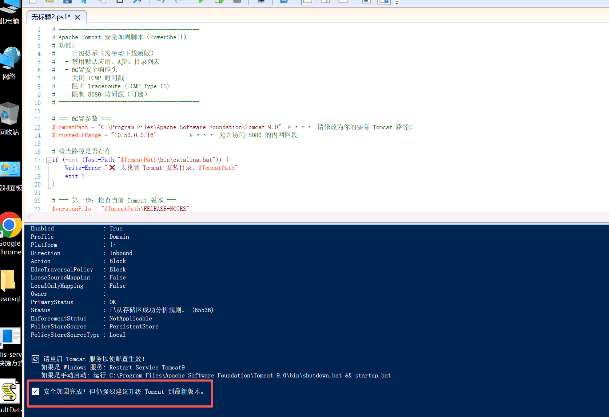

### 4. **探测到jquery 漏洞修复**

#### 探测漏洞站点路径

```yaml
# ===========================================
# 批量隐藏/升级 jQuery（基于已知物理路径）
# ===========================================

# === 从上一步获取的真实路径列表 ===
$SitePaths = @(
    "C:\Web\Portal",
    "C:\Web\HRSystem",
    "D:\Apps\Report",
    # ... 添加所有受影响站点的物理路径
)

# 下载最新 jQuery 3.7.1（安全版）
$JQueryUrl = "https://code.jquery.com/jquery-3.7.1.min.js"
$NewFileName = "js\vendor.js"  # 新文件名（无版本号）

$TempFile = "$env:TEMP\jquery-3.7.1.min.js"
Invoke-WebRequest -Uri $JQueryUrl -OutFile $TempFile -UseBasicParsing

foreach ($path in $SitePaths) {
    if (-not (Test-Path $path)) { continue }

    Write-Host "🔧 处理: $path"

    # 查找旧 jQuery 文件（常见位置）
    $oldFiles = Get-ChildItem -Path $path -Recurse -Include "jquery*.js", "jquery*.min.js" -File -ErrorAction SilentlyContinue

    if ($oldFiles) {
        # 创建新目录
        $newPath = Join-Path $path $NewFileName
        $newDir = Split-Path $newPath -Parent
        if (-not (Test-Path $newDir)) { New-Item -ItemType Directory -Path $newDir -Force | Out-Null }

        # 部署新文件
        Copy-Item -Path $TempFile -Destination $newPath -Force

        # 删除旧文件
        $oldFiles | ForEach-Object {
            Remove-Item $_.FullName -Force
            Write-Host "  🗑️ 删除: $($_.Name)"
        }

        Write-Host "  ✅ 已替换为: $NewFileName"
    } else {
        Write-Host "  ⚪ 未找到 jQuery 文件"
    }
}

Remove-Item $TempFile -Force
Write-Host "`n✅ 所有站点 jQuery 已更新并隐藏版本号！"
```

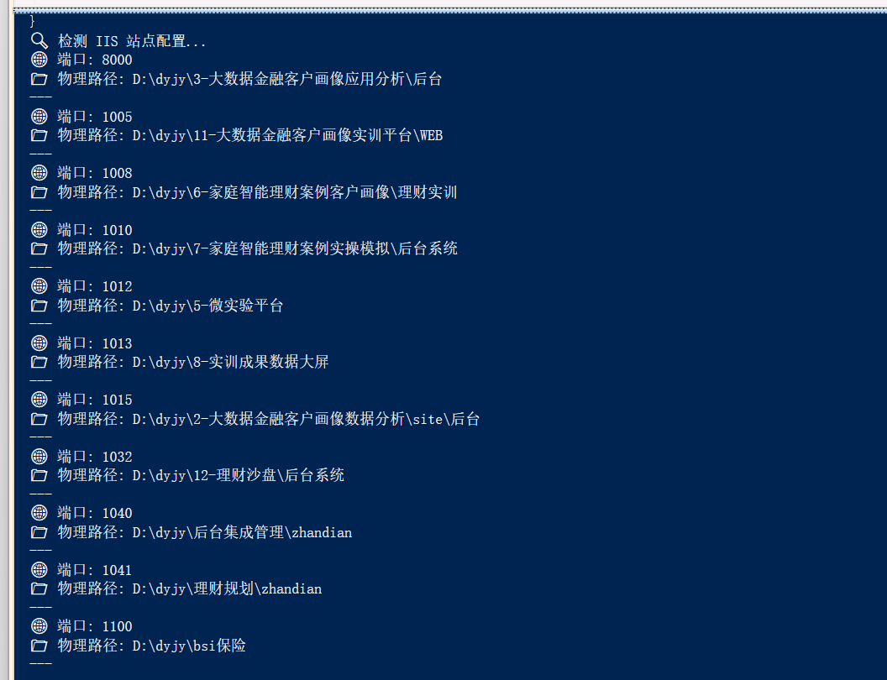

```yaml
# ===========================================
# 批量修复 jQuery 信息泄露漏洞（使用本地 D:\jquery-3.7.1.min.js）
# 作者: 安全助手
# 环境: 已将 jquery-3.7.1.min.js 放在 D:\ 根目录
# ===========================================

# === 配置：本地 jQuery 文件路径 ===
$LocalJQueryPath = "D:\jquery-3.7.1.min.js"
if (-not (Test-Path $LocalJQueryPath)) {
    Write-Error "❌ 未找到 jQuery 文件: $LocalJQueryPath"
    Write-Host "💡 请确保文件已放在 D:\jquery-3.7.1.min.js"
    exit 1
}

# === 所有需要修复的站点物理路径（来自你的 IIS 扫描结果）===
$SitePaths = @(
    "D:\dyjy\3-大数据金融客户画像应用分析\后台",
    "D:\dyjy\11-大数据金融客户画像实训平台\WEB",
    "D:\dyjy\6-家庭智能理财案例客户画像\理财实训",
    "D:\dyjy\7-家庭智能理财案例实操模拟\后台系统",
    "D:\dyjy\5-微实验平台",
    "D:\dyjy\8-实训成果数据大屏",
    "D:\dyjy\2-大数据金融客户画像数据分析\site\后台",
    "D:\dyjy\12-理财沙盘\后台系统",
    "D:\dyjy\后台集成管理\zhandian",
    "D:\dyjy\理财规划\zhandian",
    "D:\dyjy\bsi保险"
)

Write-Host "✅ 使用本地 jQuery 文件: $LocalJQueryPath"
Write-Host "🔄 开始批量修复 $($SitePaths.Count) 个站点..."

# === 遍历每个站点 ===
foreach ($path in $SitePaths) {
    if (-not (Test-Path $path)) {
        Write-Warning "⚠️ 路径不存在，跳过: $path"
        continue
    }

    Write-Host "`n🔧 处理: $path"

    # 查找所有旧版 jQuery 文件（支持子目录）
    $oldFiles = Get-ChildItem -Path $path -Recurse -Include "jquery*.js", "jquery*.min.js" -File -ErrorAction SilentlyContinue

    if ($oldFiles.Count -eq 0) {
        Write-Host "  ⚪ 未发现 jQuery 文件"
        continue
    }

    # 确定新文件存放目录（优先 js/ → Scripts/ → static/js/ → 根目录）
    $targetDir = $null
    foreach ($candidate in @("js", "Scripts", "static\js")) {
        $dir = Join-Path $path $candidate
        if (Test-Path $dir) {
            $targetDir = $dir
            break
        }
    }
    if (-not $targetDir) {
        $targetDir = $path  # 回退到站点根目录
    }

    $newFilePath = Join-Path $targetDir "lib.js"

    # 创建目标目录（如果不存在）
    if (-not (Test-Path $targetDir)) {
        New-Item -ItemType Directory -Path $targetDir -Force | Out-Null
    }

    # 复制新 jQuery 文件
    Copy-Item -Path $LocalJQueryPath -Destination $newFilePath -Force
    Write-Host "  ✅ 已部署: $($newFilePath.Replace($path, '').TrimStart('\'))"

    # 删除所有旧版文件
    foreach ($file in $oldFiles) {
        try {
            Remove-Item $file.FullName -Force
            Write-Host "  🗑️  已删除: $($file.FullName.Replace($path, '').TrimStart('\'))"
        } catch {
            Write-Warning "  ⚠️ 无法删除: $($file.Name)"
        }
    }
}

# === 完成 ===
Write-Host "`n🎉 所有站点修复完成！"
Write-Host "✅ jQuery 已统一升级至 3.7.1 并重命名为 'lib.js'"
Write-Host "🔒 扫描器将无法再识别具体版本号"
Write-Host "`n📌 后续建议："
Write-Host "   - 测试各 Web 应用功能是否正常"
Write-Host "   - 若页面报错 'jQuery not defined'，需更新 HTML 中的 <script> 引用路径"
Write-Host "   - 可通过浏览器 F12 → Network 检查是否加载 lib.js"
```

漏洞站点都替换了<font style="color:rgb(0,0,0);">jquery 3.7.1</font>

#### 下载脚本

```yaml
# ===========================================
# 从官方 CDN 下载指定版本的 jQuery 到 D:\
# 包括: 2.0.0, 2.1.4, 3.2.0, 3.6.4
# ===========================================

# 定义要下载的版本和目标路径
$Versions = @(
    @{ Version = "2.0.0"; Path = "D:\jquery-2.0.0.min.js" },
    @{ Version = "2.1.4"; Path = "D:\jquery-2.1.4.min.js" },
    @{ Version = "3.2.0"; Path = "D:\jquery-3.2.0.min.js" },
    @{ Version = "3.6.4"; Path = "D:\jquery-3.6.4.min.js" }
)

Write-Host "🌐 正在从 jQuery 官方 CDN 下载旧版文件到 D:\ ..."

foreach ($item in $Versions) {
    $url = "https://code.jquery.com/jquery-$($item.Version).min.js"
    $output = $item.Path

    Write-Host "📥 下载 v$($item.Version) → $output"
    try {
        # 使用 TLS 1.2（避免老旧协议问题）
        [Net.ServicePointManager]::SecurityProtocol = [Net.SecurityProtocolType]::Tls12
        Invoke-WebRequest -Uri $url -OutFile $output -UseBasicParsing -TimeoutSec 60
        Write-Host "✅ 成功"
    } catch {
        Write-Error "❌ 失败: $_"
    }
}

# 验证结果
Write-Host "`n🔍 验证 D:\ 下的 jQuery 文件:"
Get-ChildItem "D:\jquery-*.min.js" -ErrorAction SilentlyContinue | ForEach-Object {
    Write-Host "   $($_.Name) ($($_.Length) 字节)"
}

Write-Host "`n💡 现在你可以运行离线还原脚本了！"
```

### 5. **允许Traceroute探测**

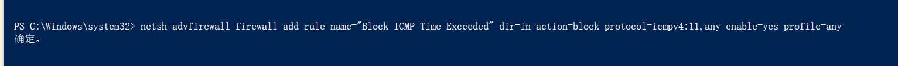

```yaml
netsh advfirewall firewall add rule name="Block ICMP Time Exceeded" dir=in action=block protocol=icmpv4:11,any enable=yes profile=any
```

<font style="color:rgb(6, 10, 38);">对 </font><code><font style="color:rgb(6, 10, 38);">tracert</font></code><font style="color:rgb(6, 10, 38);"> 和 </font><code><font style="color:rgb(6, 10, 38);">ping</font></code><font style="color:rgb(6, 10, 38);"> 都无响应，只需禁用 </font>**<font style="color:rgb(6, 10, 38);">Echo Request（Type 8）</font>**<font style="color:rgb(6, 10, 38);">：</font>

```yaml
netsh advfirewall firewall show rule | findstr /i "ICMP"
```

### 6.**ICMP时间戳检测**

```yaml
# ===========================================
# 禁用 ICMP 时间戳请求 (Type 13) - 修复 CVE-1999-0524
# 适用于 Windows Server / Windows 10/11
# ===========================================

Write-Host "🛡️ 正在配置防火墙规则以阻止 ICMP 时间戳请求 (Type 13)..." -ForegroundColor Cyan

try {
    # 添加入站规则：阻止 ICMPv4 Type 13 (Timestamp Request)
    netsh advfirewall firewall add rule `
        name="Block ICMP Timestamp Request (Type 13)" `
        dir=in `
        action=block `
        protocol=icmpv4:13,any `
        enable=yes `
        profile=any

    Write-Host "✅ 成功创建防火墙规则：'Block ICMP Timestamp Request (Type 13)'" -ForegroundColor Green
}
catch {
    Write-Error "❌ 创建规则失败: $_"
}

# 可选：同时阻止出站的时间戳回复（Type 14）
try {
    netsh advfirewall firewall add rule `
        name="Block ICMP Timestamp Reply (Type 14)" `
        dir=out `
        action=block `
        protocol=icmpv4:14,any `
        enable=yes `
        profile=any

    Write-Host "✅ 成功创建出站规则：'Block ICMP Timestamp Reply (Type 14)'" -ForegroundColor Green
}
catch {
    Write-Warning "⚠️ 出站规则可能已存在或无需配置。"
}

Write-Host "`nℹ️ 验证方法：从其他主机运行 'ping -s 10.50.11.60'（Linux）或使用专用工具测试 ICMP Timestamp。" -ForegroundColor Yellow
Write-Host "📌 注意：Windows 默认不响应 ICMP Timestamp，此规则为加固措施。" -ForegroundColor Gray
```

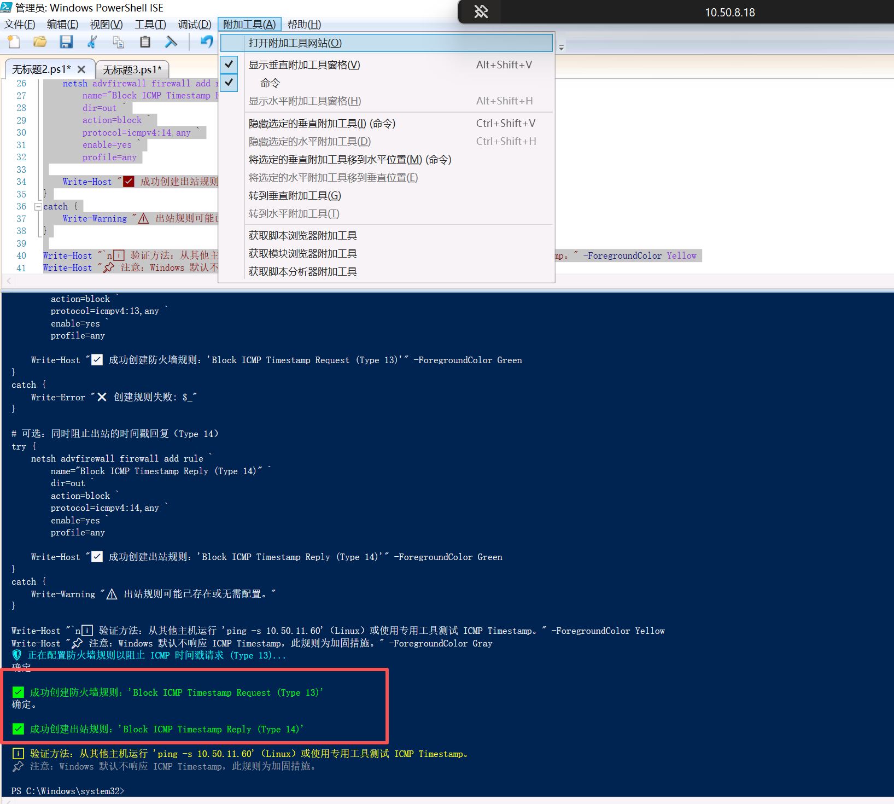

### 7.Swagger API 未授权访问漏洞

```yaml
# ===========================================
# 在 Windows 10/11 上为指定站点添加 Swagger 访问限制
# 要求：已安装 URL Rewrite 模块
# ===========================================

Import-Module WebAdministration -ErrorAction Stop

$TargetSites = @(
    "大数据金融客户画像实训平台PCAPI_20291104c",   # 1006
    "家庭智能理财案例实操模拟API_20291104C",      # 1009
    "理财沙盘_api"                               # 1031
)

foreach ($siteName in $TargetSites) {
    if (-not (Test-Path "IIS:\Sites\$siteName")) {
        Write-Warning "⚠️ 站点 '$siteName' 不存在，跳过。"
        continue
    }

    Write-Host "🔒 正在保护站点: $siteName" -ForegroundColor Cyan

    # 规则 1: 阻止 swagger.json
    try {
        Add-WebConfigurationProperty -PSPath "IIS:\Sites\$siteName" `
            -Filter "/system.webServer/rewrite/rules" `
            -Name "." -Value @{
                name = "Block-Swagger-JSON"
                patternSyntax = "ECMAScript"
                stopProcessing = $true
                match = @{ url = "^swagger/v[0-9]+/swagger\.json$" }
                action = @{ type = "CustomResponse"; statusCode = 403; statusReason = "Forbidden"; statusDescription = "Swagger access denied." }
            }
        Write-Host "  ✅ 已添加 JSON 规则" -ForegroundColor Green
    } catch { Write-Error "规则1失败: $_" }

    # 规则 2: 阻止整个 /swagger 路径
    try {
        Add-WebConfigurationProperty -PSPath "IIS:\Sites\$siteName" `
            -Filter "/system.webServer/rewrite/rules" `
            -Name "." -Value @{
                name = "Block-Swagger-UI"
                patternSyntax = "ECMAScript"
                stopProcessing = $true
                match = @{ url = "^swagger(/.*)?$" }
                action = @{ type = "CustomResponse"; statusCode = 403; statusReason = "Forbidden"; statusDescription = "Swagger UI access denied." }
            }
        Write-Host "  ✅ 已添加 UI 规则" -ForegroundColor Green
    } catch { Write-Error "规则2失败: $_" }
}

# 重启 IIS
iisreset /noforce
Write-Host "`n✅ 所有规则已应用，IIS 已重启。请测试访问是否返回 403。" -ForegroundColor Green
```

### 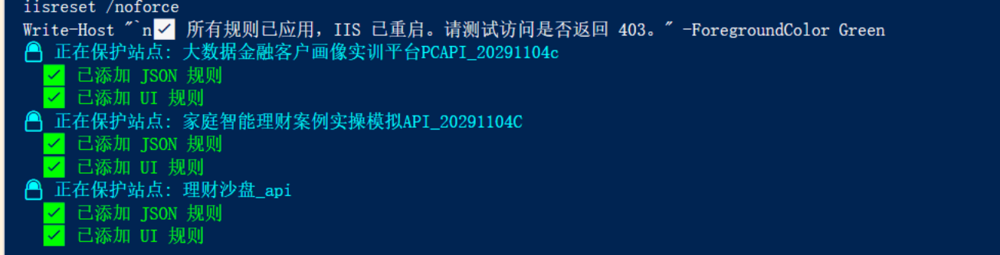

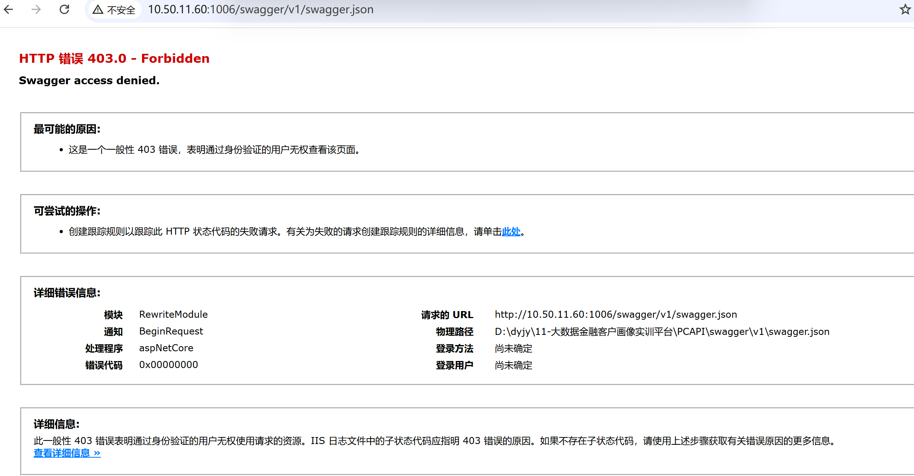

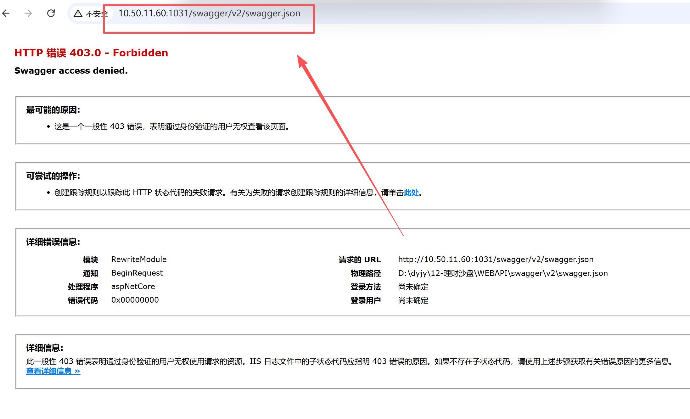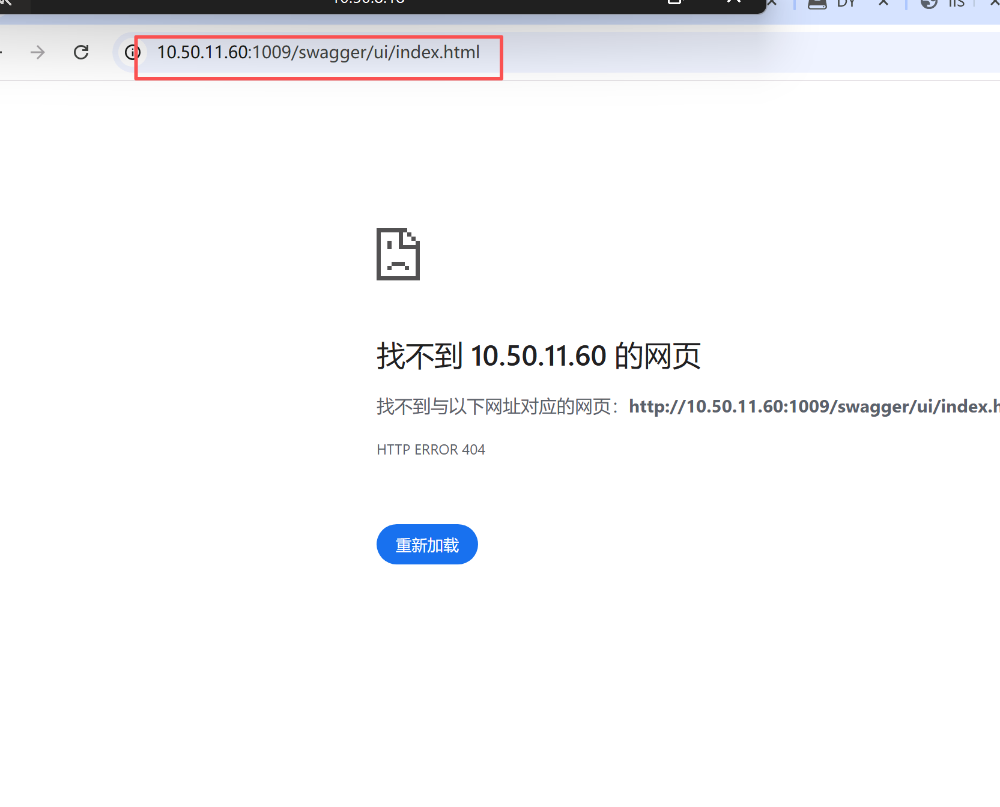

### 浙江工商远程信息

##### vpn 访问客户端：easyconnet

##### <font style="color:rgb(0, 0, 0);"> vpn帐号密码   dianyue  Zjgs@20251126</font>

##### vpn 访问地址：vpn.zjbti.net.cn

##### 堡垒机访问地址：https://10.50.8.18/

<font style="color:rgb(0, 0, 0);">堡垒机帐号密码  dianyue  Aa@#4520123</font>


> 更新: 2026-01-30 15:47:26  
> 原文: <https://www.yuque.com/lixinsi/hntyk2/lybak3wo8pyoi7v6>