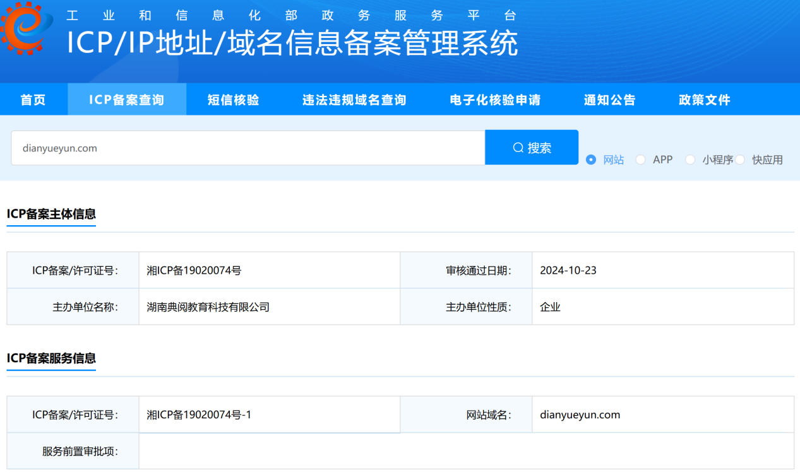
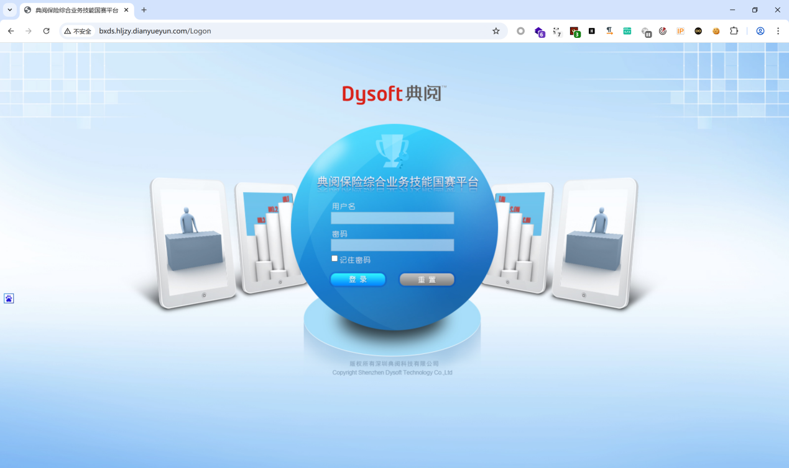
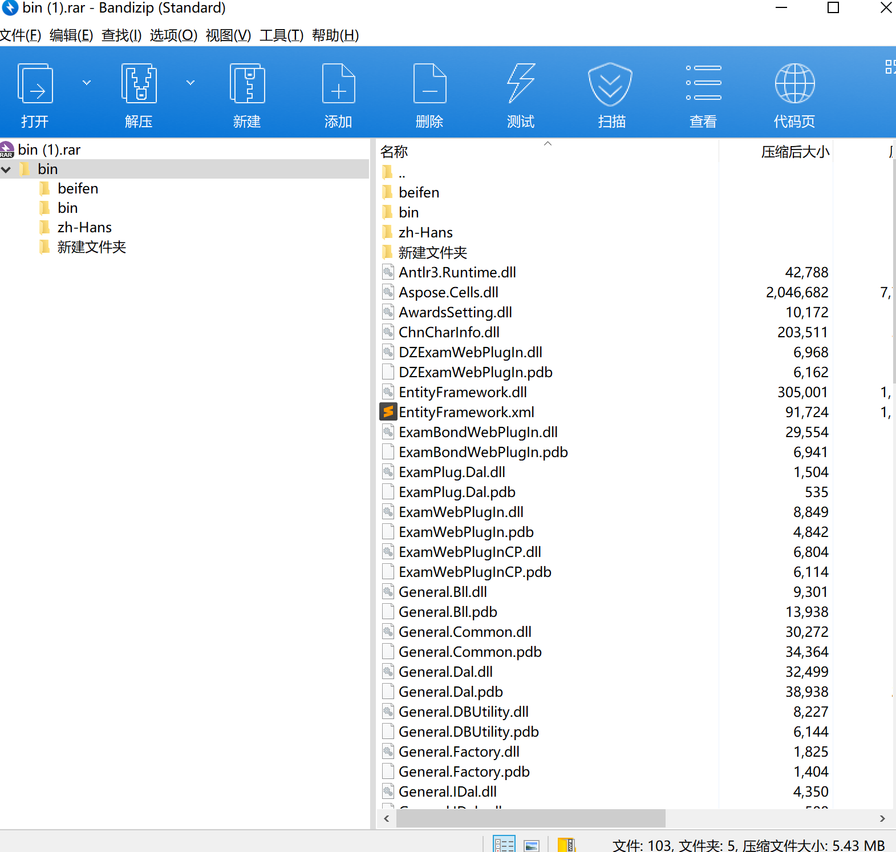

# 湖南典阅教育科技有限公司存在源代码泄漏漏洞

发现湖南典阅教育科技有限公司存在源代码泄漏漏洞

工作发现，湖南典阅教育科技有限公司([http://bxds.hljzy.dianyueyun.com/Logon,ip:118.195.191.23](http://bxds.hljzy.dianyueyun.com/Logon,ip:118.195.191.23))存在源代码泄漏漏洞，攻击者可通过该漏洞直接查看敏感信息，危害大。

湖南典阅教育科技有限公司注册地位于注册地位于长沙高新开发区谷苑路186号湖南大学科技园工程孵化大楼东区第2层228-230，法定代表人为李大立。统一社会信用代码为91430100MA4QADY20H。经营范围包括一般项目：软件开发；人工智能基础软件开发；人工智能应用软件开发；网络与信息安全软件开发；人工智能理论与算法软件开发；软件外包服务；智能机器人的研发；网络技术服务；技术服务、技术开发、技术咨询、技术交流、技术转让、技术推广；信息系统集成服务；信息技术咨询服务；数字技术服务；计算机软硬件及辅助设备零售；计算机系统服务；软件销售；互联网设备销售；电子产品销售；网络设备销售；智能无人飞行器销售；租赁服务（不含许可类租赁服务）；广告设计、代理；对外承包工程；工程管理服务；会议及展览服务；教育咨询服务。

下步，及时处置整改漏洞隐患，加强网络安全防护.

### 漏洞描述
攻击者可通过源代码泄漏漏洞直接查看敏感内容。

### 漏洞详情

网站备案

url：[http://bxds.hljzy.dianyueyun.com/Logon](http://bxds.hljzy.dianyueyun.com/Logon)

网站首页

访问[http://bxds.hljzy.dianyueyun.com/bin.rar](http://bxds.hljzy.dianyueyun.com/bin.rar) 

即可下载源代码备份文件

### 修复建议
将备份文件bin.rar转移到非web目录或删除。

> 更新: 2025-07-16 08:22:06  
> 原文: <https://www.yuque.com/lixinsi/hntyk2/mwpvmvpfhwhotim5>