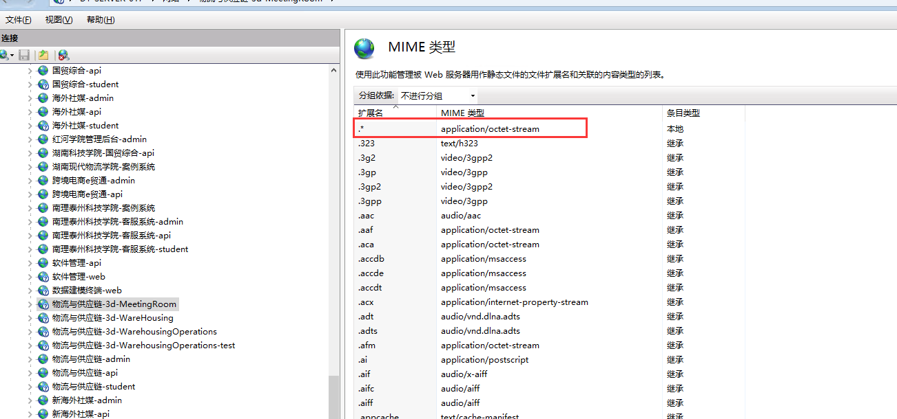

# 物流与供应链需要添加mime

1.物流与供应链-3d-MeetingRoom\ 2.物流与供应链-3d-WareHousing\ 3.物流与供应链-3d-WarehousingOperations

上面三个3D场景的站点都需要加 MIME。

操作步骤：\ 1、选中对应的站点，点击 `MIME 类型`，点击右上方 `添加`按钮

2、\ 文件扩展名输入：.\*\ MIME 类型输入：application/octet-stream

点击`确认`

> 更新: 2025-10-30 14:28:13  
> 原文: <https://www.yuque.com/lixinsi/hntyk2/ipcdckte3zomagd5>