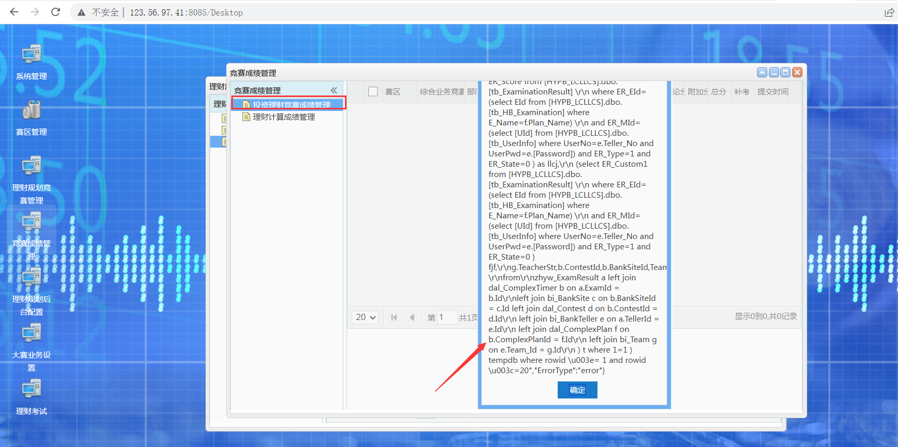
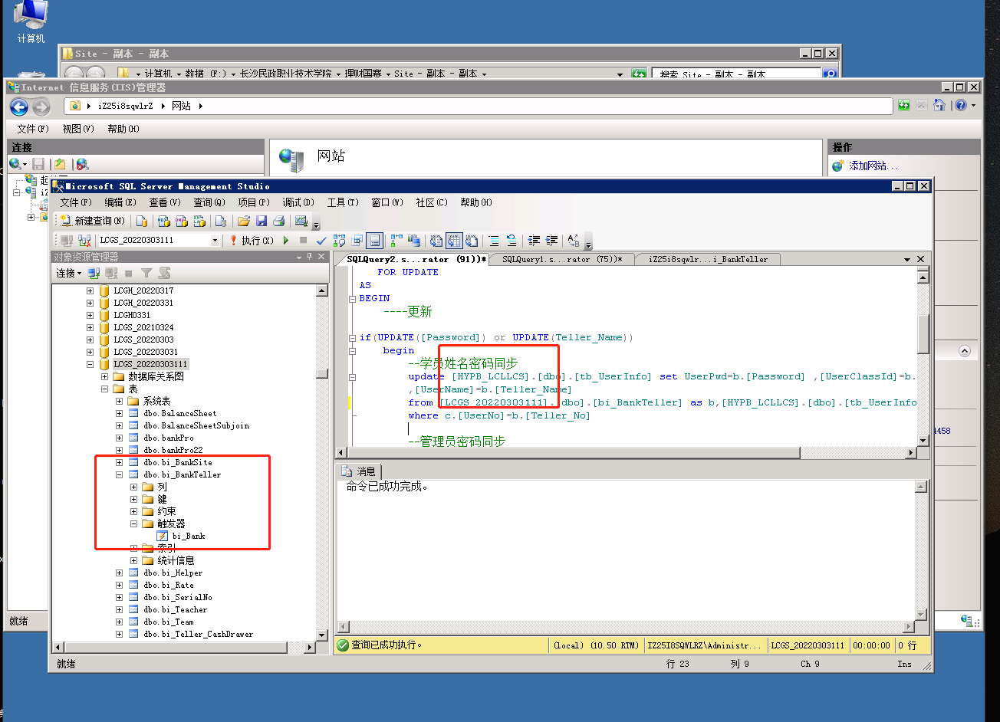
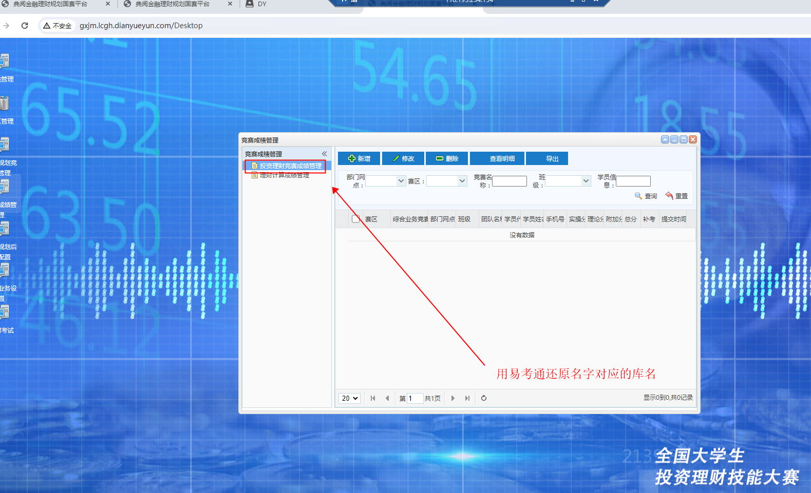

# 理财国赛

清理表格

truncate table

truncate table bi_BankTeller

truncate table bi_Teacher

truncate table bi_Team

truncate table zhyw_ExamCurrentTask

truncate table zhyw_ExamLog

truncate table zhyw_ExamResult

truncate table zhyw_ExamResultForm

truncate table zhyw_ExamResultTask

truncate table zhyw_ExamResultTaskDetail

truncate table zhyw_FormAccountNo

truncate table zhyw_FormMoneyChange

truncate table bi_Teller_CashDrawer

  update bi_SerialNo set Serial_Value='0000' 

账号重复问题

truncate table bi_Teller_CashDrawer

delete from  bi_Teller_CashDrawer where BankSite_Id='1'

修改页面标题在login.html里面

需要新建一个名字为HYPB_LCLLCS的库还原

主要是因为里面有某些表和字段关联了

无法修改密码

理财规划导出题目直接用把理财规划的数据库连接到客户经理的站点导出来

### 3.投资理财规划新
成绩查询报错

随便用个易考通还原一个库HYPB_LCLLCS就可以去除报错

> 更新: 2024-03-13 17:04:52  
> 原文: <https://www.yuque.com/lixinsi/hntyk2/miandr>