# 理财经理压力测手册

**在压力测之前需要先检查：**

①鼠标、键盘、excel、wrod文档正常使用  
②桌面快捷访问系统是谷歌浏览器

  
**压力测开始（进入系统后）：**③做题不能复制粘贴

**如有问题请举手示意老师**

1、在电脑上打开谷歌浏览器，登录平台网址 ，点击‘金融综合技能业务岗位操作’[在弹出的登录框中点击‘](http://qgdly.occupationedu.com/)[理财经理](http://qgdly.occupationedu.com/)[’，](http://qgdly.occupationedu.com/) 输入账号和密码，点击登录进入操作界面。

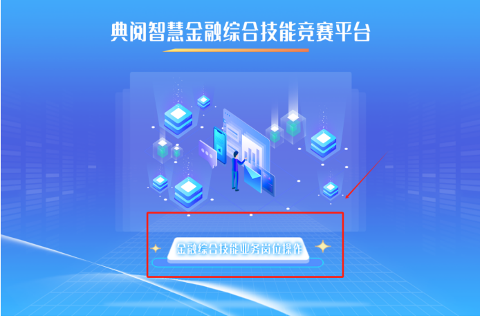

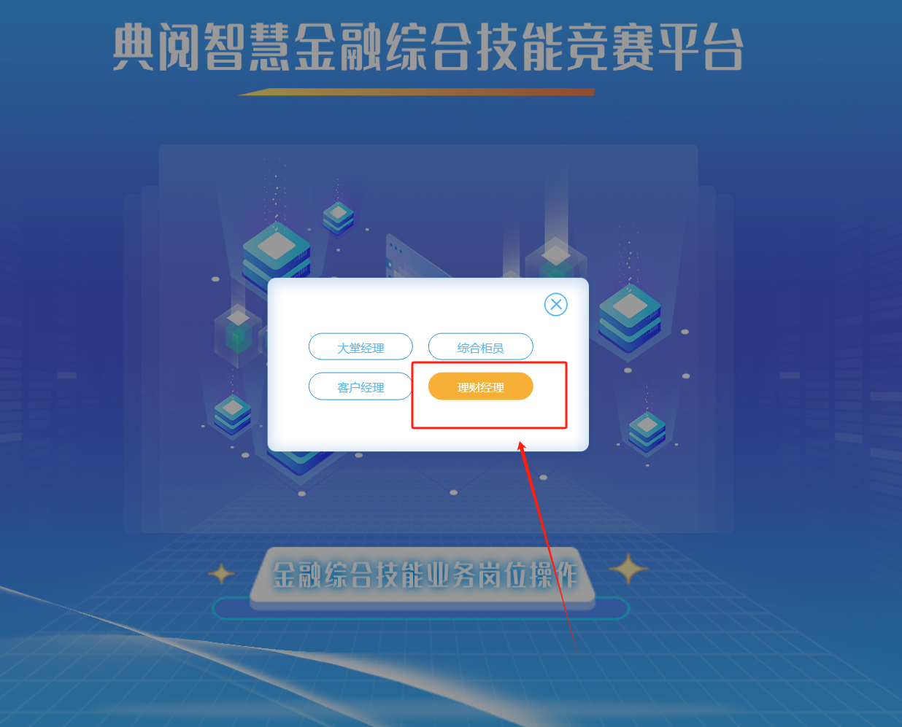

2、鼠标双击比赛试卷

**3、客户信息**

点击小锁开启‘客户信息’,根据任务说明点击“ 客户信息”→“ 客户信息管理 ”→“ 新增 ”，新增客户提交后要在锁定客户点击‘锁定’，进入对应业务操作页面，并依据任务说明及重要提示信息填写页面信息，根据任务说明填写表单

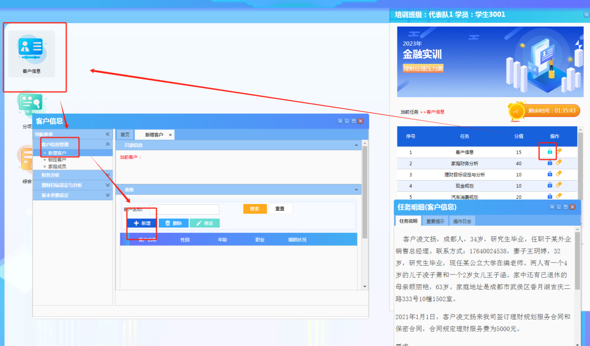

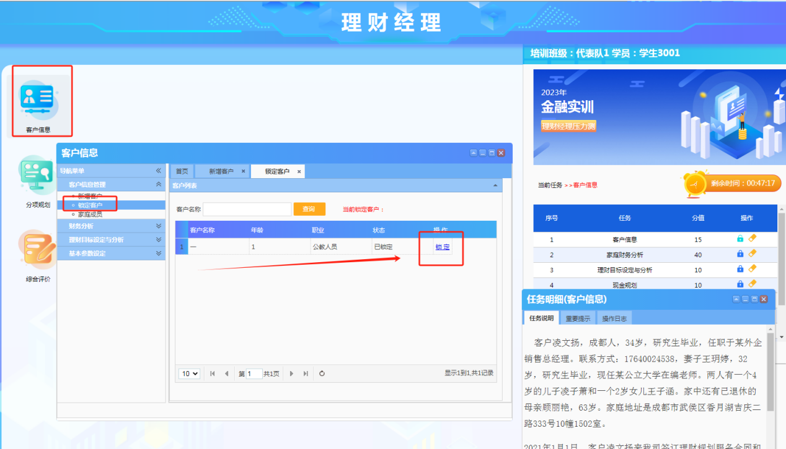

**4、家庭财产分析**

点击小锁开启‘家庭财务分析’,根据任务说明点击“ 客户信息”→“ 财产分析 ”→“ 生命周期分析 ”→“ 新增”，进入对应业务操作页面，并依据任务说明及重要提示信息填写页面信息，根据任务说明填写表单

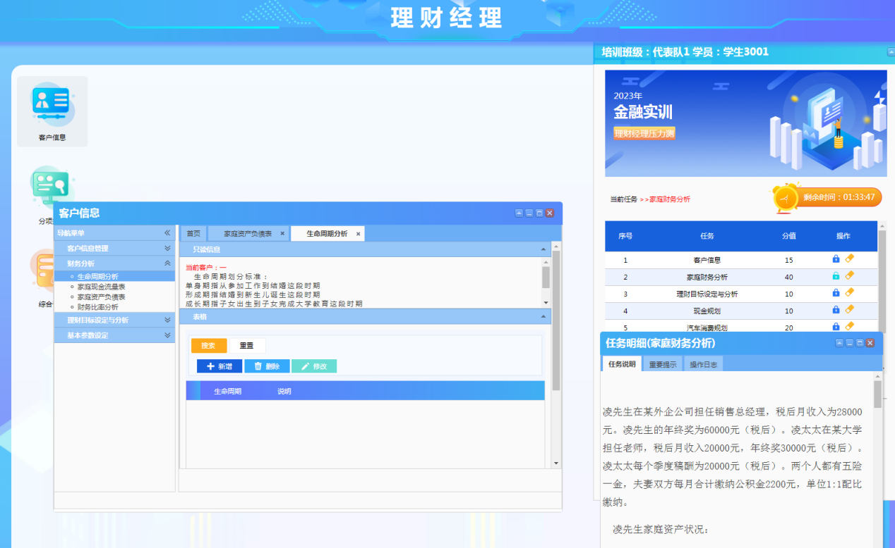

**5、理财目标设定与分析**

点击小锁开启‘理财目标设定与分析’,根据任务说明点击“ 客户信息”→“ 理财目标设定与分析 ”→“ 理财目标可行性分析”→“ 新增”，进入对应业务操作页面，并依据任务说明及重要提示信息填写页面信息，根据任务说明填写表单

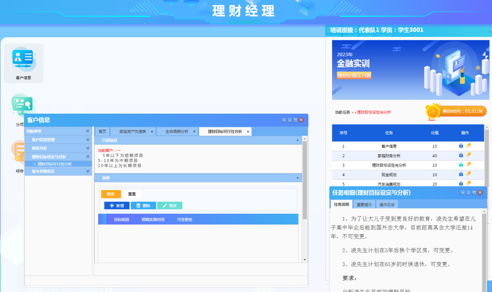

**6、现金规划**

点击小锁开启‘现金规划’,根据任务说明点击“ 分项规划”→“ 现金规划 ”→“ 现金需求分析”，进入对应业务操作页面，并依据任务说明及重要提示信息填写页面信息，根据任务说明填写表单

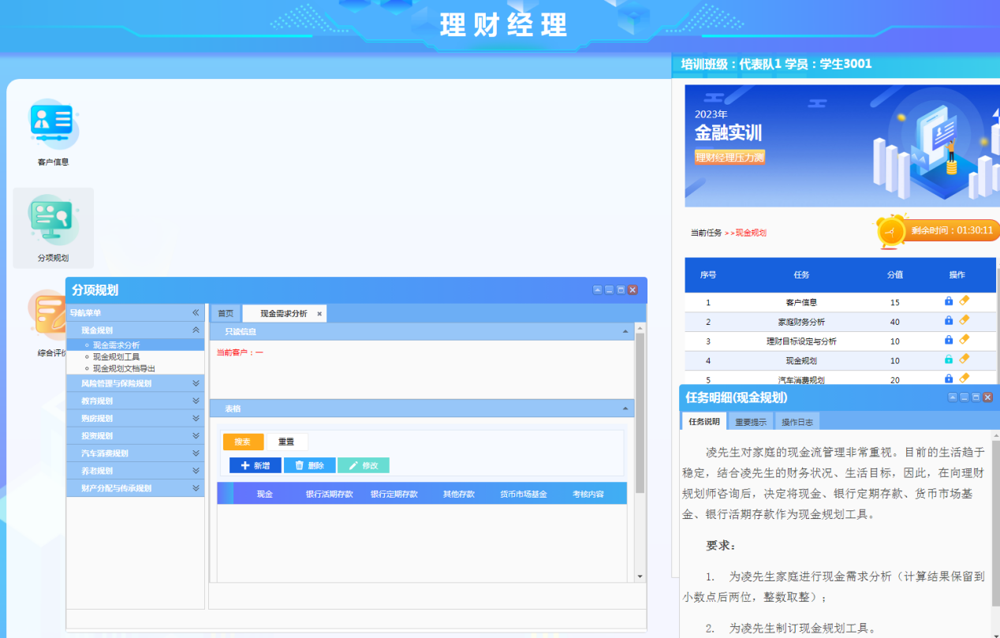

**7、汽车消费规划**

点击小锁开启‘汽车消费规划’,根据任务说明点击“ 分项规划”→“ 汽车消费规划 ”→“ 购车资金总需求”→“ 新增”，进入对应业务操作页面，并依据任务说明及重要提示信息填写页面信息，根据任务说明填写表单

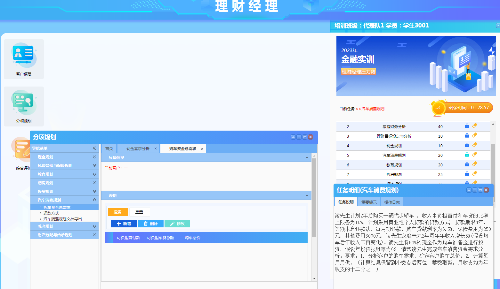

**8、教育规划**

点击小锁开启‘教育规划’,根据任务说明点击“ 分项规划”→“ 教育规划 ”→“ 教育资金缺口分析”→“新增”，进入对应业务操作页面，并依据任务说明及重要提示信息填写页面信息，根据任务说明填写表单

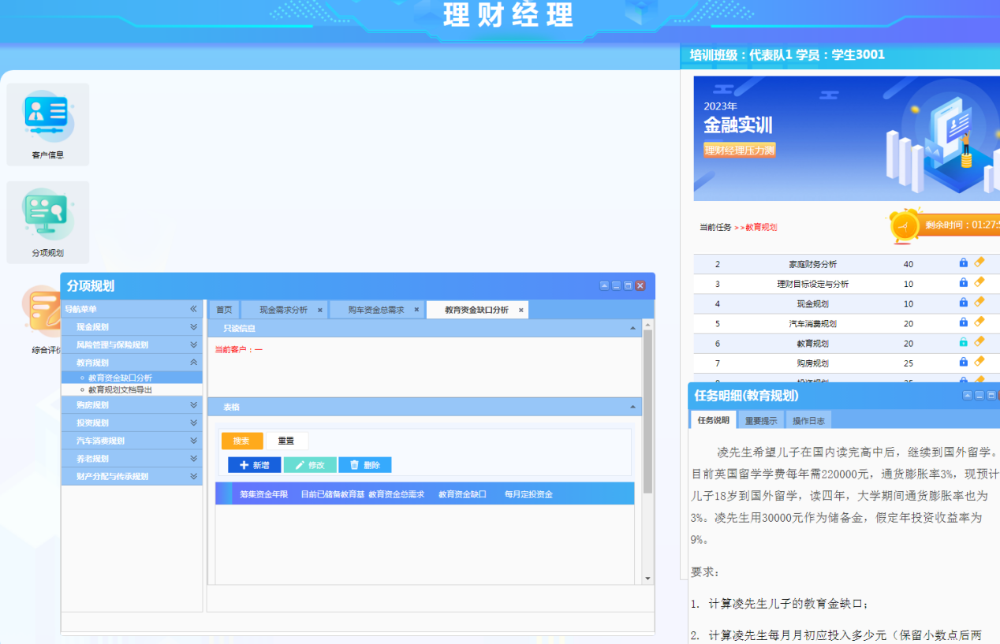

**9、购房规划**

点击小锁开启‘购房规划’,根据任务说明点击“ 分项规划”→“ 购房规划 ”→“ 购房资金总需求”→“新增”，进入对应业务操作页面，并依据任务说明及重要提示信息填写页面信息，根据任务说明填写表单

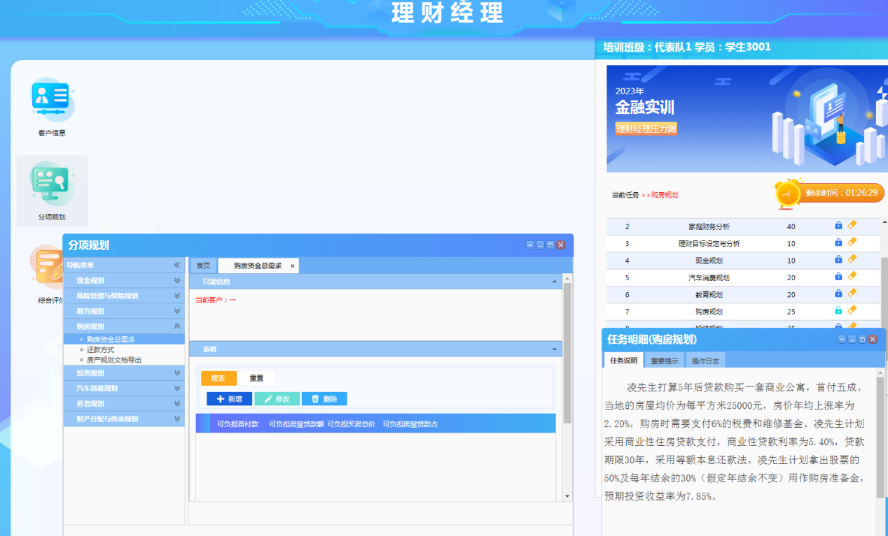

**10、投资规划**

点击小锁开启‘投资规划’,根据任务说明点击“ 分项规划”→“ 投资规划 ”→“ 风险承受能力评分表”→“新增”，进入对应业务操作页面，并依据任务说明及重要提示信息填写页面信息，根据任务说明填写表单

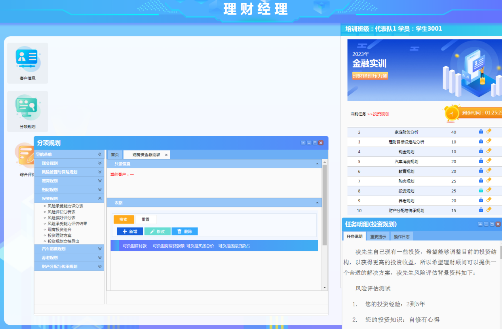

**11、养老规划**

点击小锁开启‘养老规划’,根据任务说明点击“ 分项规划”→“ 养老规划 ”→“ 养老规划定投测算”→，进入对应业务操作页面，并依据任务说明及重要提示信息填写页面信息，根据任务说明填写表

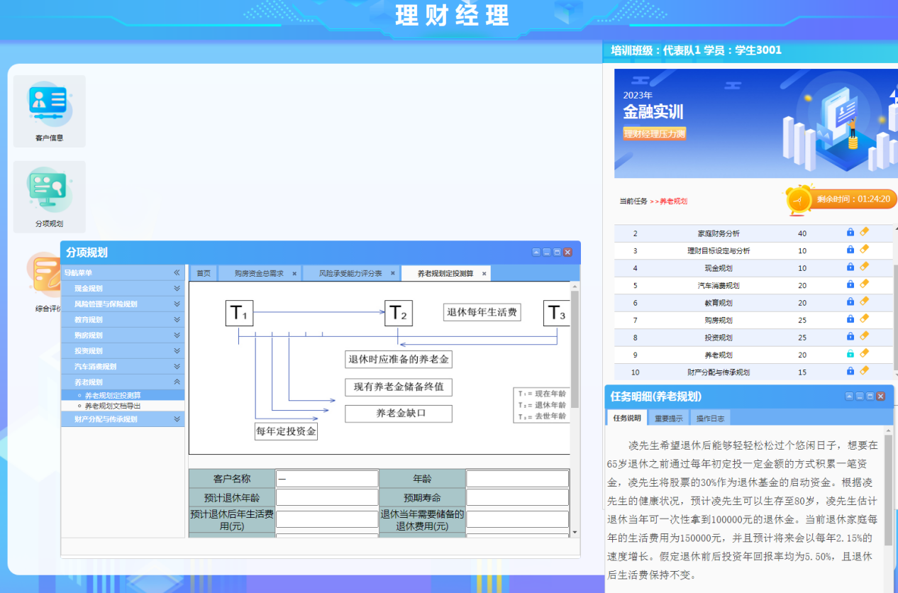

**12、财产分配与传承规划**

点击小锁开启‘财产分配与传承规划’,根据任务说明点击“ 分项规划”→“ 财产分配与传承规划 ”→“ 继承人”→“新增”，进入对应业务操作页面，并依据任务说明及重要提示信息填写页面信息，根据任务说明填写表

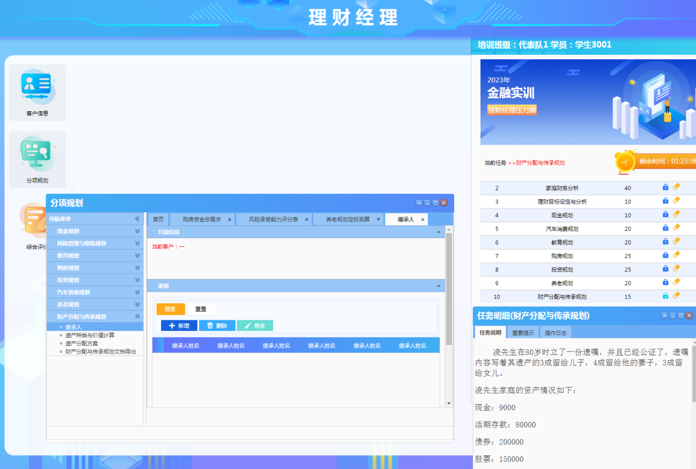

1. **提交**

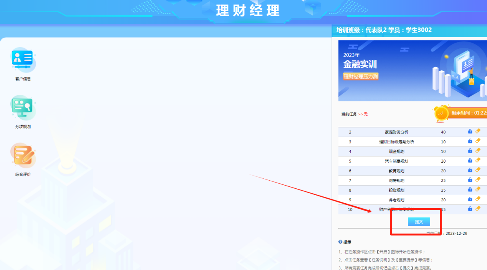

> 更新: 2025-11-26 23:07:26  
> 原文: <https://www.yuque.com/lixinsi/hntyk2/pxe103hv1e7ggng1>