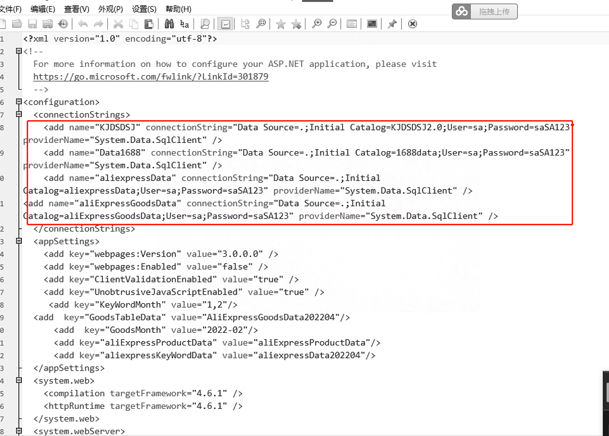
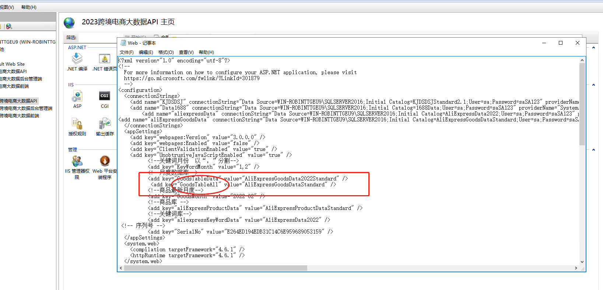
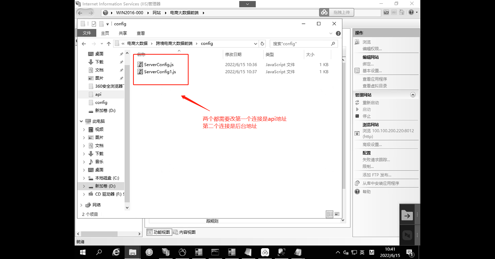
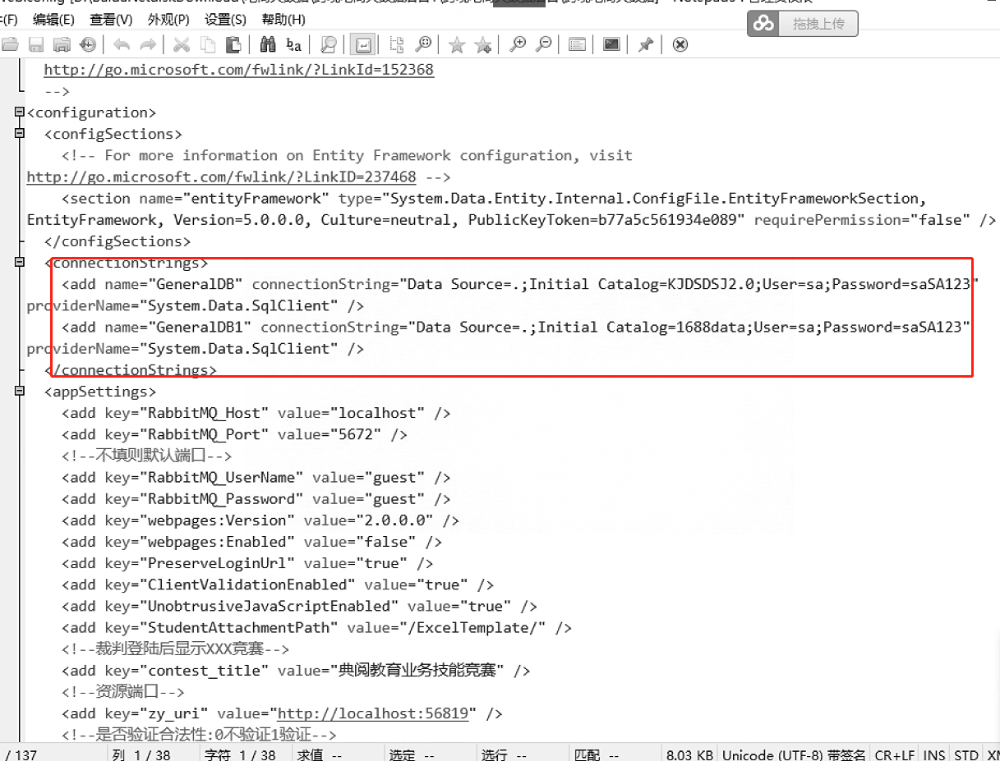
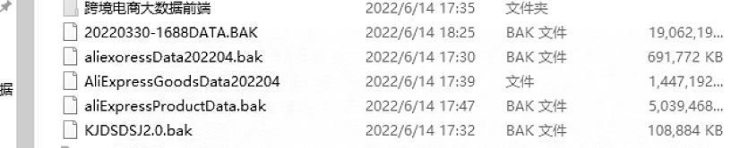
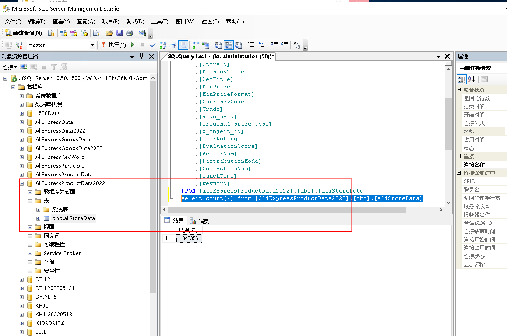

# 电商大数据

搭建环境sql server2016

需要更改配置






电商大数据前端需要更改

第一个连接是api地址

第二个连接是后台地址



电商大数据后台配置



只用俄罗斯的话需要五个数据库



查询抓取数据多少条

```shell
select count(*) from [AliExpressProductData2022].[dbo].[aliStoreData]
```




> 更新: 2023-06-12 10:33:43  
> 原文: <https://www.yuque.com/lixinsi/hntyk2/fpv8k1>