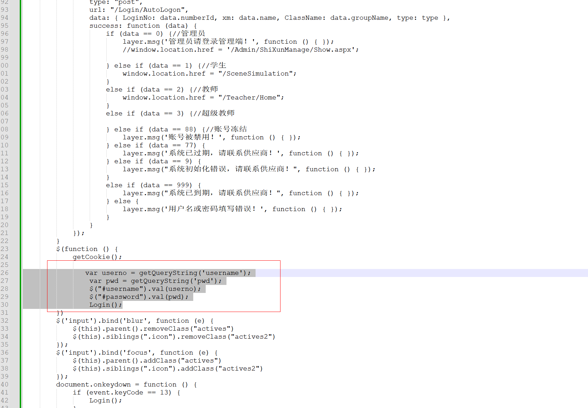
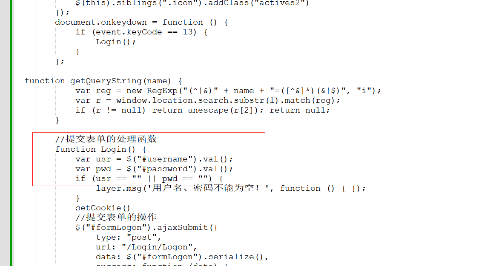

# 统一自动登入

路径：F:\P2P消费金融2021\P2P消费金融2021\Views\Login\Index.cshtml







```html
			   var userno = getQueryString('username');
          var pwd = getQueryString('pwd');
				$("#username").val(userno);
				$("#password").val(pwd);
				Login();
```

```html
   var usr = $("#username").val();
    var pwd = $("#password").val();
```

```html
@{
    Layout = null;
}

<!DOCTYPE html>

<html>
<head>
    <meta name="viewport" content="width=device-width" />
    <title>消费金融</title>
    <link rel="stylesheet" href="~/Content/css/new_p/common.css">
    <link rel="stylesheet" href="~/Content/css/new_p/icon_font.css">
    <link rel="stylesheet" href="~/Content/css/new_p/init.css">
    <link rel="stylesheet" href="~/Content/css/new_p/login.css">
    <script src="~/Scripts/jquery-1.10.2.min.js"></script>
    <script src="~/Scripts/layer/layer.js"></script>
    <script src="~/Scripts/jquery.base64.js"></script>
    <script src="~/Scripts/jquery.form.js"></script>
    <script src="~/Content/plugins/fullavatareditor/scripts/jQuery.Cookie.js"></script>
    <script src="~/Scripts/Base64.js"></script>
</head>
<body id="login" class="page">
    <article id="box" class="main">
        <div class="login_inner">
            <div class="item_box">
                <form id="formLogon">
                    <h2 class="logon_text">欢迎登陆</h2>
                    <div class="item">
                        <div class="icon icon-yonghu"></div>
                        <input type="text" id="username" name="username" placeholder="请输入用户名" autocomplete="off" value="" />
                    </div>
                    <div class="item">
                        <div class="icon icon-lock"></div>
                        <input type="password" id="password" name="password" placeholder="请输入密码" maxlength="15" value="" />
                    </div>
                    <button class="submitBtn" type="button" onclick="Login()">进入系统</button>
                </form>
            </div>
        </div>
        <input type="hidden" value="@ViewData["dq"]" id="dq" />
        <input type="hidden" value="@ViewData["token"]" id="token" />
        <input type="hidden" value="@ViewData["json"]" id="json1" />
      
    </article>
    <script>
	
	 function box() {
                //获取DIV为‘bo’的盒子
                var oBox = document.getElementById('box');
                //获取元素自身的宽度
                var L1 = oBox.offsetWidth;
                //获取元素自身的高度
                var H1 = oBox.offsetHeight;
                //获取实际页面的left值。（页面宽度减去元素自身宽度/2）
                var Left = (document.documentElement.clientWidth - L1) / 2;
                //获取实际页面的top值。（页面宽度减去元素自身高度/2）
                var top = (document.documentElement.clientHeight - H1) / 2;
                oBox.style.left = Left + 'px';
                oBox.style.top = top + 'px';
            }
            box();
            //当浏览器页面发生改变时，DIV随着页面的改变居中。
            window.onresize = function () {
                box();
            }
			
        window.onload = function () {
           

            var token = $("#token").val();
            var jsons = $("#json1").val();

            if (token != "" && jsons != "") {
                var datas = JSON.parse(Base64.decode(jsons));
                if (datas.status == "000") {
                    autoLogin(datas);
                    //{ "status": "000", "eId": "ff8080817c7da597017c81c9014b16de", "userId": "ff8080817c7da597017c7df554f50590", "numberId": "40050", "groupName": "无", "name": "杨娥", "role": "teacher" }
                }
            }


        }

            
        function autoLogin(data) {

            var type = "1";
            if (data.role == "teacher") {
                type = "2";
            }
            $("#formLogon").ajaxSubmit({
                type: "post",
                url: "/Login/AutoLogon",
                data: { LoginNo: data.numberId, xm: data.name, ClassName: data.groupName, type: type },
                success: function (data) {
                    if (data == 0) {//管理员
                        layer.msg('管理员请登录管理端！', function () { });
                        //window.location.href = '/Admin/ShiXunManage/Show.aspx';

                    } else if (data == 1) {//学生
                        window.location.href = "/SceneSimulation";
                    }
                    else if (data == 2) {//教师
                        window.location.href = "/Teacher/Home";
                    }
                    else if (data == 3) {//超级教师

                    } else if (data == 88) {//账号冻结
                        layer.msg('账号被禁用！', function () { });
                    } else if (data == 77) {
                        layer.msg('系统已过期，请联系供应商！', function () { });
                    } else if (data == 9) {
                        layer.msg("系统初始化错误，请联系供应商！", function () { });
                    }
                    else if (data == 999) {
                        layer.msg("系统已到期，请联系供应商！", function () { });
                    } else {
                        layer.msg('用户名或密码填写错误！', function () { });
                    }
                }
            });
        }
        $(function () {
            getCookie();
			
			   var userno = getQueryString('username');
                var pwd = getQueryString('pwd');
				$("#username").val(userno);
				$("#password").val(pwd);
				Login();
        })
        $('input').bind('blur', function (e) {
            $(this).parent().removeClass("actives")
            $(this).siblings(".icon").removeClass("actives2")
        });
        $('input').bind('focus', function (e) {
            $(this).parent().addClass("actives")
            $(this).siblings(".icon").addClass("actives2")
        });
        document.onkeydown = function () {
            if (event.keyCode == 13) {
                Login();
            }
        };

  function getQueryString(name) {
            var reg = new RegExp("(^|&)" + name + "=([^&]*)(&|$)", "i");
            var r = window.location.search.substr(1).match(reg);
            if (r != null) return unescape(r[2]); return null;
        }
		
        //提交表单的处理函数
        function Login() {
            var usr = $("#username").val();
            var pwd = $("#password").val();
            if (usr == "" || pwd == "") {
                layer.msg('用户名、密码不能为空！', function () { });
            }
            setCookie()
            //提交表单的操作
            $("#formLogon").ajaxSubmit({
                type: "post",
                url: "/Login/Logon",
                data: $("#formLogon").serialize(),
                success: function (data) {
                    if (data == 0) {//管理员
                        layer.msg('管理员请登录管理端！', function () { });
                        //window.location.href = '/Admin/ShiXunManage/Show.aspx';

                    } else if (data == 1) {//学生
                        window.location.href = "/SceneSimulation";
                    }
                    else if (data == 2) {//教师
                        window.location.href = "/Teacher/Home";
                    }
                    else if (data == 3) {//超级教师

                    } else if (data == 88) {//账号冻结
                        layer.msg('账号被禁用！', function () { });
                    } else if (data == 77) {
                        layer.msg('系统已过期，请联系供应商！', function () { });
                    } else if (data == 9) {
                        layer.msg("系统初始化错误，请联系供应商！", function () { });
                    }
                    else if (data == 999) {
                        layer.msg("系统已到期，请联系供应商！", function () { });
                    } else {
                        layer.msg('用户名或密码填写错误！', function () { });
                    }
                }
            });
        }

        //设置cookie
        function setCookie() {
            var loginCode = $("#username").val();//获取用户名信息
            var pwd = $("#password").val();//获取登陆密码信息
            var checked = $("[name='remember']:checked");//获取“是否记住密码”复选框
            if (checked && checked.length > 0) {//判断是否选中了“记住密码”复选框
                $.Cookie("username", loginCode); //调用jquery.cookie.js中的方法设置cookie中的用户名
                $.Cookie("password", $.base64.encode(pwd));//调用jquery.cookie.js中的方法设置cookie中的登陆密码，并使用base64（jquery.base64.js）进行加密
            } else {
                $.Cookie("password", null);
            }
        }

        //获取cookie
        function getCookie() {
            var loginCode = $.Cookie("username");//获取cookie中的用户名
            var pwd = $.Cookie("password");//获取cookie中的登陆密码
            if (pwd) {//密码存在的话把“记住用户名和密码”复选框勾选住
                $("[name='remember']").attr("checked", "true");
            }
            if (loginCode) {//用户名存在的话把用户名填充到用户名文本框
                $("#username").val(loginCode);
            }
            if (pwd) {//密码存在的话把密码填充到密码文本框
                $("#password").val($.base64.decode(pwd));
            }
        }

    </script>

    <script type="text/javascript">
        $(function () {
            var dq = $("#dq").val();
            if (dq == "1") {//即将过期
                layer.open({
                    title: '系统提示',
                    anim: 1,
                    shade: 0, //遮罩透明度
                    type: 1,
                    content: '<div id="AddOpenDiv"><div style="width:300px; height:150px; line-height:120px; text-align:center;">系统即将到期，请联系供应商！</div></div>',
                    offset: "rb",

                });
            }

        })
    </script>
</body>
</html>

```


> 更新: 2024-11-01 16:23:42  
> 原文: <https://www.yuque.com/lixinsi/hntyk2/av3lg54l3sf8cee6>