# 综合柜员压力测手册 

**在压力测之前需要先检查：**

①鼠标、键盘、excel、wrod文档正常使用  
②桌面快捷访问系统是谷歌浏览器

  
**压力测开始（进入系统后）：**③做题不能复制粘贴

**如有问题请举手示意老师**

1、在电脑上打开谷歌浏览器，登录平台网址 ，点击‘金融综合技能业务岗位操作’[在弹出的登录框中点击‘](http://qgdly.occupationedu.com/)[综合柜员](http://qgdly.occupationedu.com/)[’，](http://qgdly.occupationedu.com/) 输入账号和密码，点击登录进入操作界面。

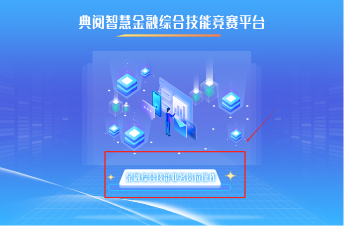

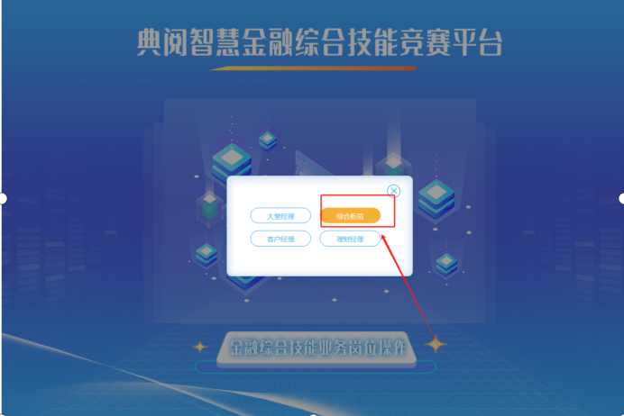

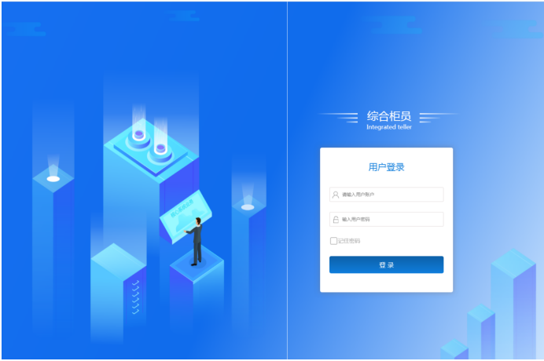

2、点击‘比赛考核’，找到比赛试卷，点击试卷右边的‘’进入试卷

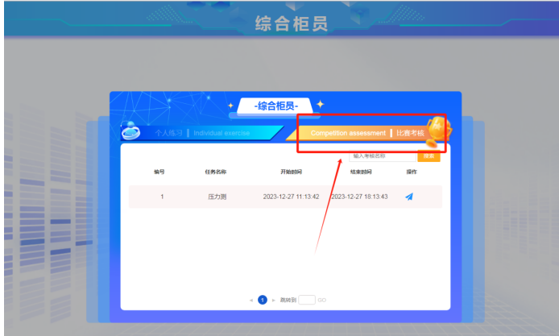

**3、信息公告**

鼠标单击信息公告，信息公告内容涉及一整套题目的操作，请仔细阅读。

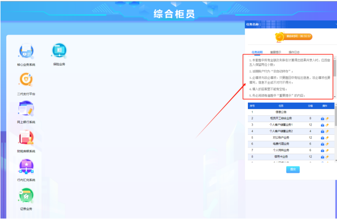

**4、柜员开工综合业务**

点击小锁开启‘[柜员开工综合业务](http://192.168.5.222:1104/ServiceRecord/Index?FormType=1&TotalResultId=null&ExamId=9&LinkId=12&Satisfaction=100)’,根据任务说明点击“ 核心业务系统 ”→“ 开工交接完工管理 ”→“ 机构开工 ”，进入对应业务操作页面，并依据任务说明及重要提示信息填写页面信息，根据任务说明填写表单

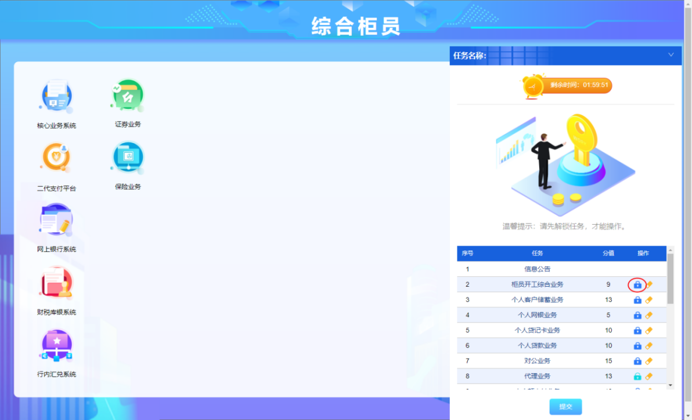

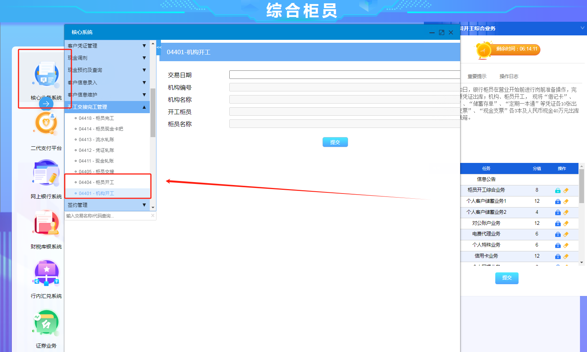

1. **个人客户储蓄业务**

点击小锁开启‘个人客户储蓄业务’，根据任务说明和重要提示点击“核心业务系统 ”→“客户信息维护”，分别点击“个人客户联网核查“和”个人客户身份核实”，进入对应业务操作页面，并依据任务说明及重要提示信息填写页面信息，根据任务说明填写表单

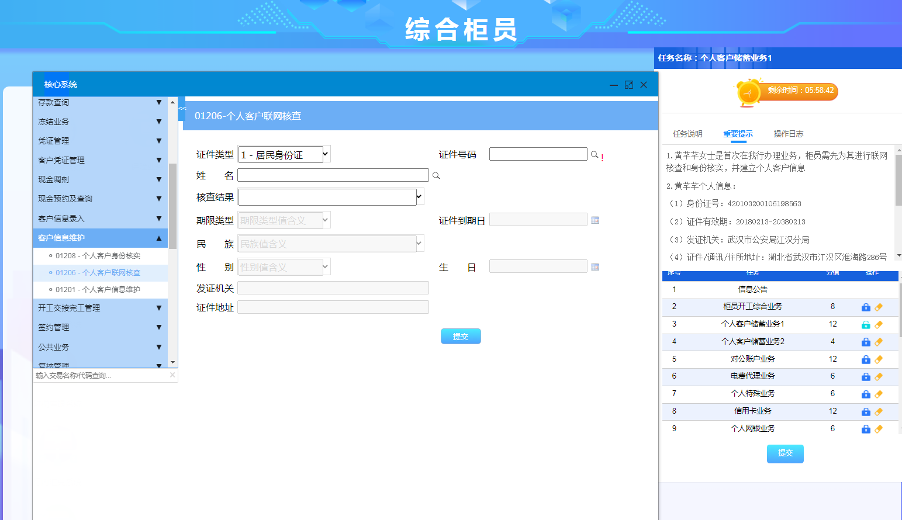

1. **对公账户业务**

根据任务说明点击“核心业务系统”→“客户信息录入”→“建立单位客户信息”，进入对应业务操作页面，并依据任务说明及重要提示信息填写页面信息，根据任务说明填写表单

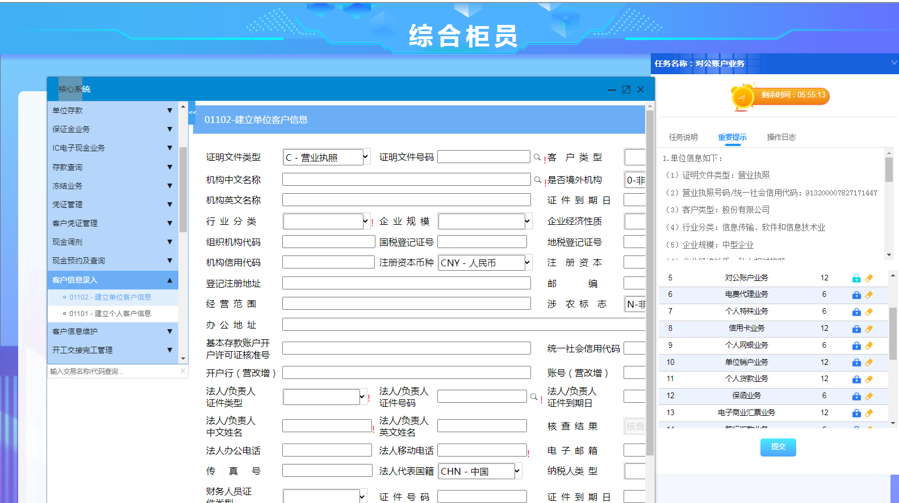**7、电费代理业务**

根据任务说明点击“核心业务系统”→“电费代理业务”→“电费查询客户欠费”，进入对应业务操作页面，并依据任务说明及重要提示信息填写页面信息，根据任务说明填写表单

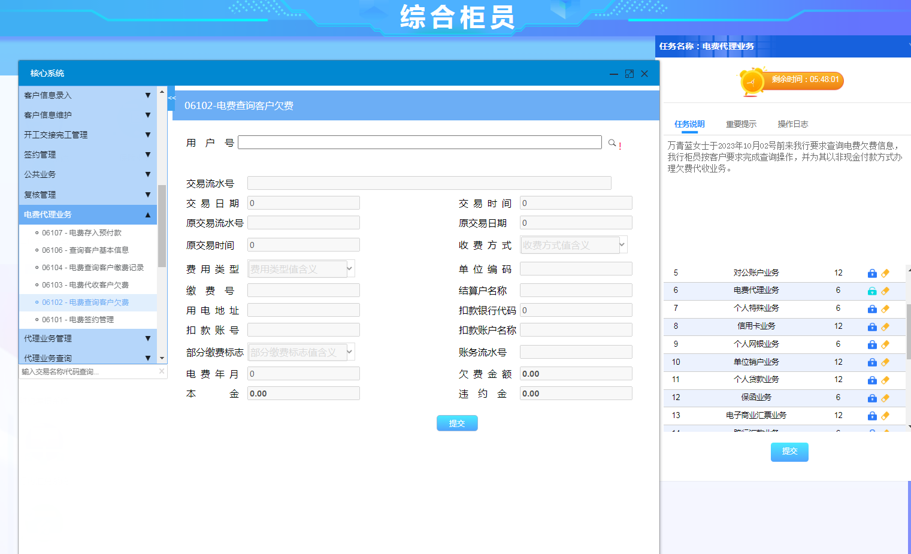

**8、**[**个人特殊业务**](http://192.168.5.222:1104/ServiceRecord/Index?FormType=1&TotalResultId=null&ExamId=9&LinkId=12&Satisfaction=100)

根据任务说明点击“核心业务系统”→“挂失管理”→“个人挂失业务”，进入对应业务操作页面，并依据任务说明及重要提示信息填写页面信息，根据任务说明填写表单

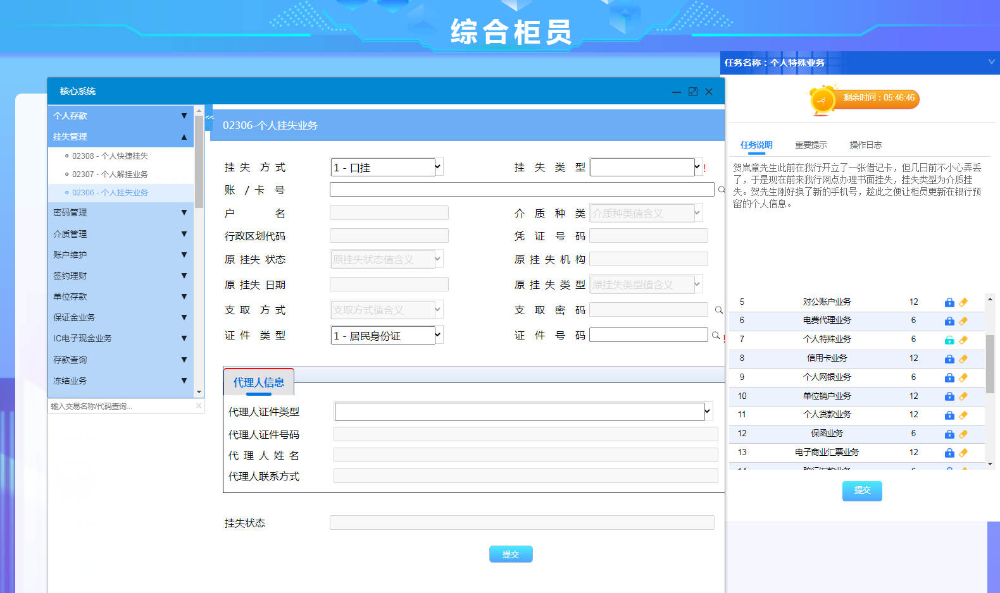

**9、**[**信用卡业务**](http://192.168.5.222:1104/ServiceRecord/Index?FormType=1&TotalResultId=null&ExamId=9&LinkId=12&Satisfaction=100)

根据任务说明点击“核心业务系统”→“信用卡管理”→“开立并激活信用卡”，进入对应业务操作页面，并依据任务说明及重要提示信息填写页面信息，根据任务说明填写表单

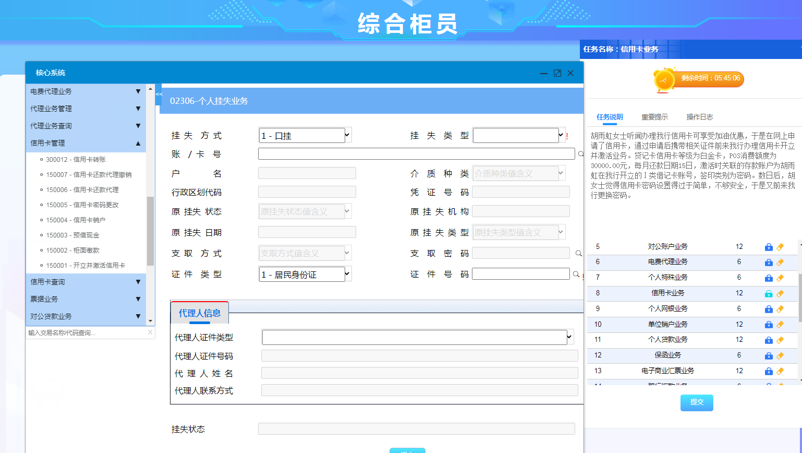

**10、**[**个人网银业务**](http://192.168.5.222:1104/ServiceRecord/Index?FormType=1&TotalResultId=null&ExamId=9&LinkId=12&Satisfaction=100)

根据任务说明点击“网上银行系统”→“个人网银”→“个人网银维护”，进入对应业务操作页面，并依据任务说明及重要提示信息填写页面信息，根据任务说明填写表单

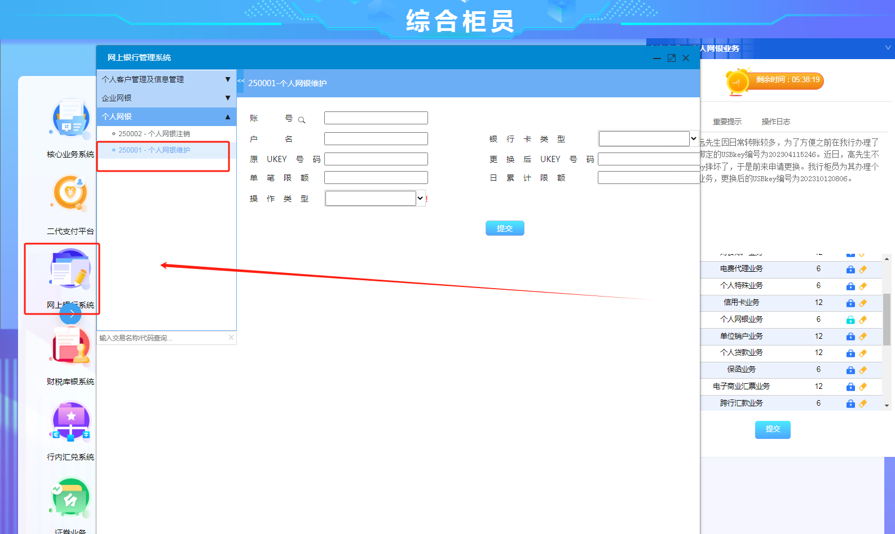

**11、**[**单位销户业务**](http://192.168.5.222:1104/ServiceRecord/Index?FormType=1&TotalResultId=null&ExamId=9&LinkId=12&Satisfaction=100)

根据任务说明点击“核心业务系统”→“单位存款”→“单位活期销户”，进入对应业务操作页面，并依据任务说明及重要提示信息填写页面信息，根据任务说明填写表单

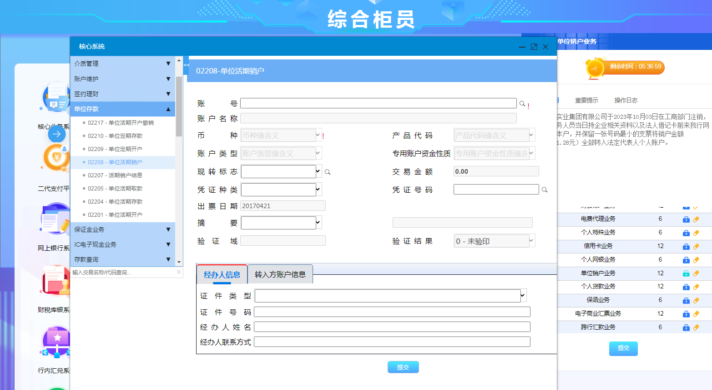

**12、**[**个人贷款业务**](http://192.168.5.222:1104/ServiceRecord/Index?FormType=1&TotalResultId=null&ExamId=9&LinkId=12&Satisfaction=100)

根据任务说明点击“核心业务系统”→“个人贷款业务”→“新增个人贷款合同”，进入对应业务操作页面，并依据任务说明及重要提示信息填写页面信息，根据任务说明填写表单

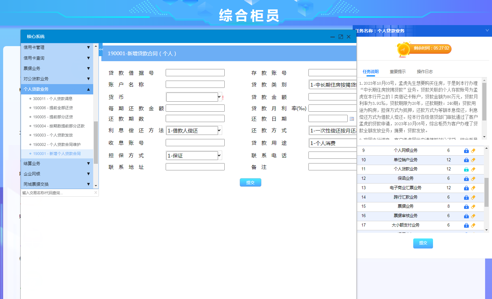

**13、**[**保函业务**](http://192.168.5.222:1104/ServiceRecord/Index?FormType=1&TotalResultId=null&ExamId=9&LinkId=12&Satisfaction=100)

根据任务说明点击“核心业务系统”→“国际结算业务”→“开立保函”，进入对应业务操作页面，并依据任务说明及重要提示信息填写页面信息，根据任务说明填写表单

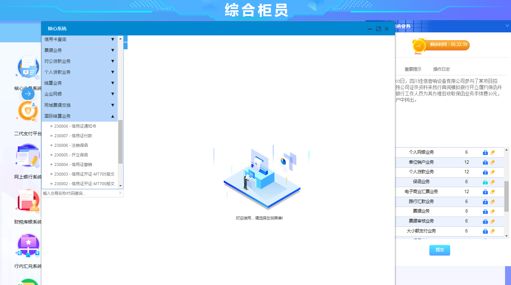

**14、**[**电子商业汇票业务**](http://192.168.5.222:1104/ServiceRecord/Index?FormType=1&TotalResultId=null&ExamId=9&LinkId=12&Satisfaction=100)

根据任务说明点击“核心业务系统”→“电票业务”→“电子银行承兑汇票申请承兑”，进入对应业务操作页面，并依据任务说明及重要提示信息填写页面信息，根据任务说明填写表单

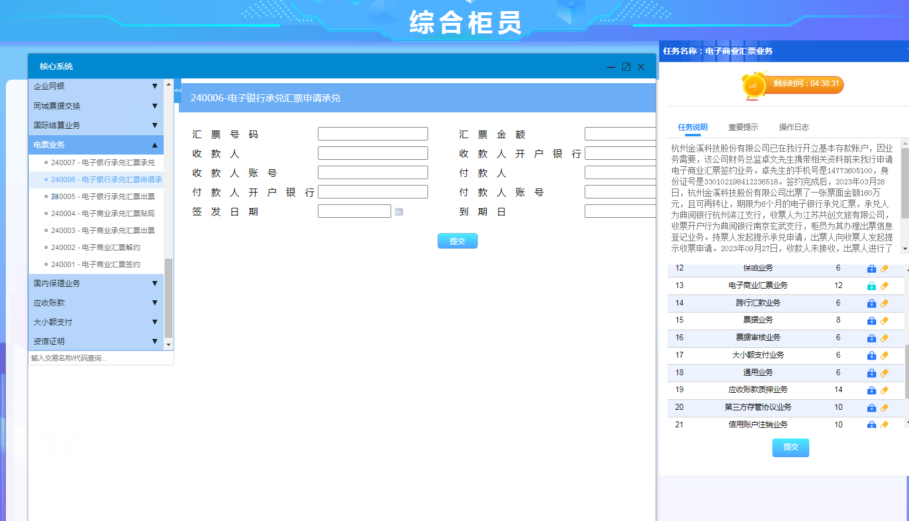

**15、**[**跨行汇款业务**](http://192.168.5.222:1104/ServiceRecord/Index?FormType=1&TotalResultId=null&ExamId=9&LinkId=12&Satisfaction=100)

根据任务说明点击“核心业务系统”→“大小额支付”→“跨行汇款业务”，进入对应业务操作页面，并依据任务说明及重要提示信息填写页面信息，根据任务说明填写表单

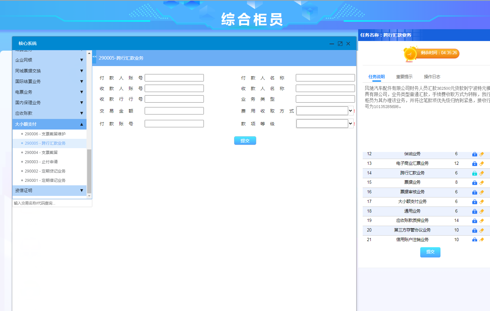

**16、**[**票据业务**](http://192.168.5.222:1104/ServiceRecord/Index?FormType=1&TotalResultId=null&ExamId=9&LinkId=12&Satisfaction=100)

根据任务说明点击“核心业务系统”→“票据业务”→“票据退回”，进入对应业务操作页面，并依据任务说明及重要提示信息填写页面信息，根据任务说明填写表单

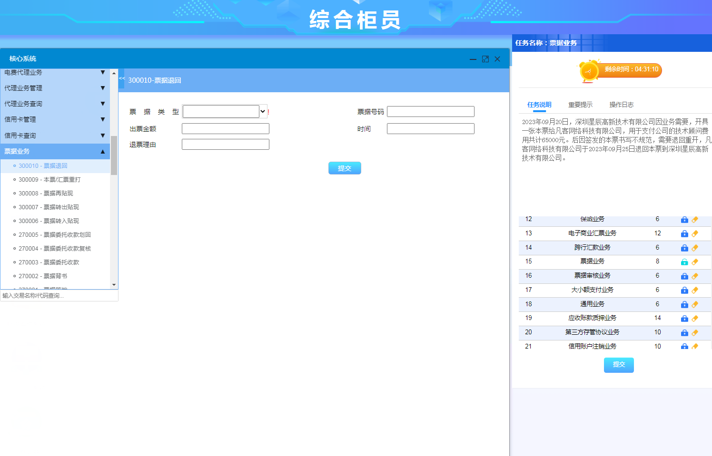

**17、**[**票据审核业务**](http://192.168.5.222:1104/ServiceRecord/Index?FormType=1&TotalResultId=null&ExamId=9&LinkId=12&Satisfaction=100)

根据任务说明点击“核心业务系统”→“票据业务”→“纸质承兑汇票审核”，进入对应业务操作页面，并依据任务说明及重要提示信息填写页面信息，根据任务说明填写表单

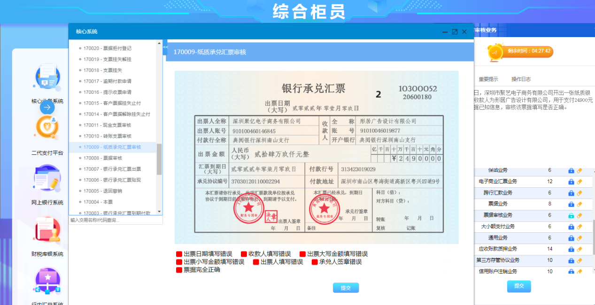

**18、**[**大小额支付业务**](http://192.168.5.222:1104/ServiceRecord/Index?FormType=1&TotalResultId=null&ExamId=9&LinkId=12&Satisfaction=100)

根据任务说明点击“核心业务系统”→“大小额支付”→“定期贷记业务”，进入对应业务操作页面，并依据任务说明及重要提示信息填写页面信息，根据任务说明填写表单

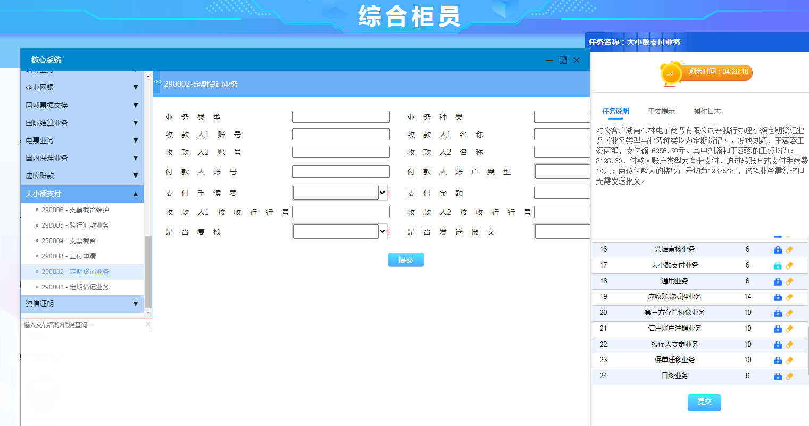

**19、**[**通用业务**](http://192.168.5.222:1104/ServiceRecord/Index?FormType=1&TotalResultId=null&ExamId=9&LinkId=12&Satisfaction=100)

根据任务说明点击“核心业务系统”→“签约管理”→“短信签约”，进入对应业务操作页面，并依据任务说明及重要提示信息填写页面信息，根据任务说明填写表单

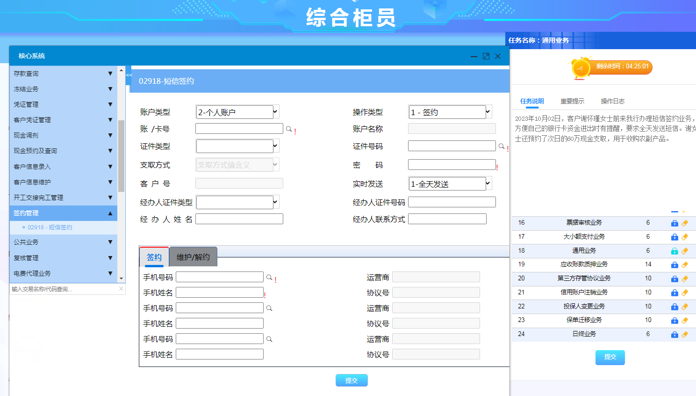

**20、应收账款质押业务**

根据任务说明点击“核心业务系统”→“应收账款”→“应收账款质押”，进入对应业务操作页面，并依据任务说明及重要提示信息填写页面信息，根据任务说明填写表单

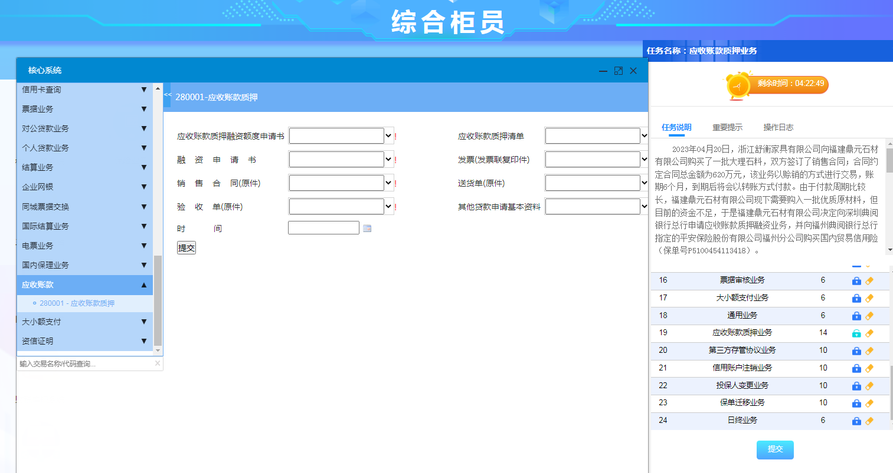

**21、**[**第三方存管协议业务**](http://192.168.5.222:1104/ServiceRecord/Index?FormType=1&TotalResultId=null&ExamId=9&LinkId=12&Satisfaction=100)

根据任务说明点击“证券业务”→“证券柜面”→“第三方存管协议”，进入对应业务操作页面，并依据任务说明及重要提示信息填写页面信息，根据任务说明填写表单

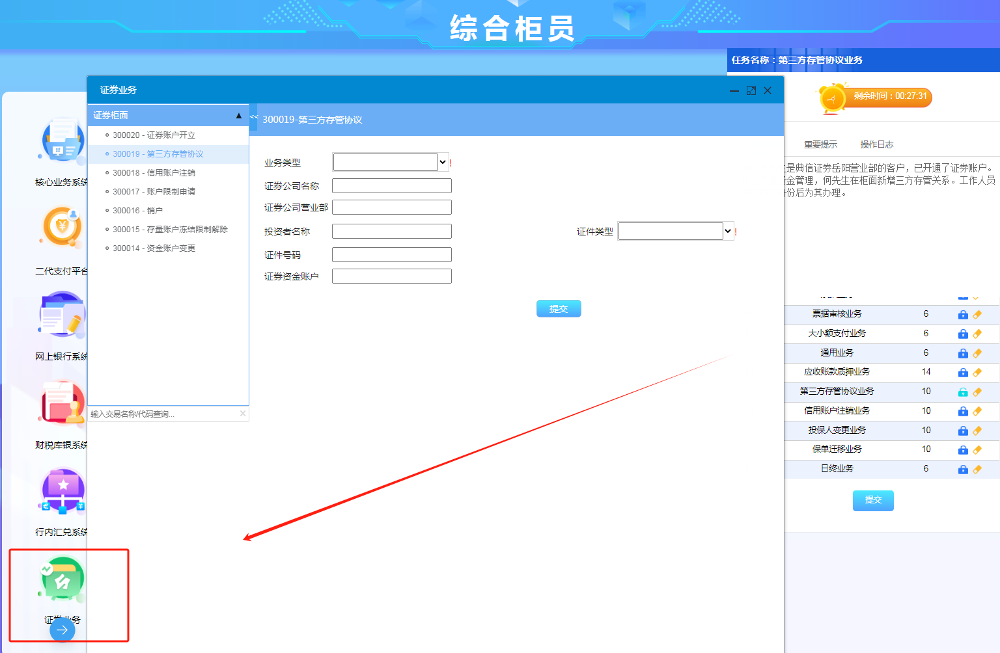

**22、**[**信用卡账户注销业务**](http://192.168.5.222:1104/ServiceRecord/Index?FormType=1&TotalResultId=null&ExamId=9&LinkId=12&Satisfaction=100)

根据任务说明点击“证券业务”→“证券柜面”→“信用卡账户注销”，进入对应业务操作页面，并依据任务说明及重要提示信息填写页面信息，根据任务说明填写表单

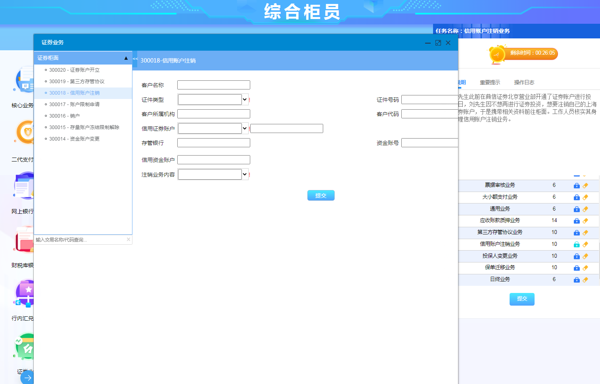

**23、**[**投保人变更业务**](http://192.168.5.222:1104/ServiceRecord/Index?FormType=1&TotalResultId=null&ExamId=9&LinkId=12&Satisfaction=100)

根据任务说明点击“保险业务”→“保险柜面”→“投保人变更”，进入对应业务操作页面，并依据任务说明及重要提示信息填写页面信息，根据任务说明填写表单

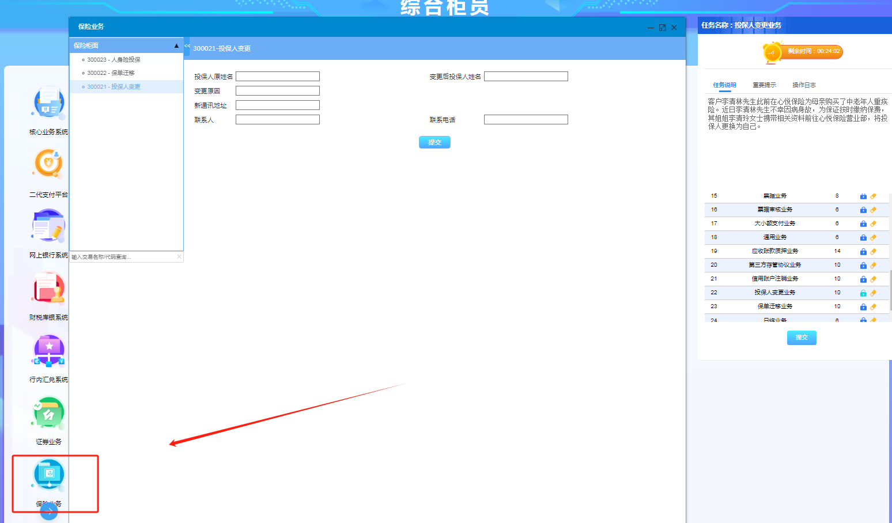

**24、保单迁移业务**

根据任务说明点击“保险业务”→“保险柜面”→“保单迁移”，进入对应业务操作页面，并依据任务说明及重要提示信息填写页面信息，根据任务说明填写表单

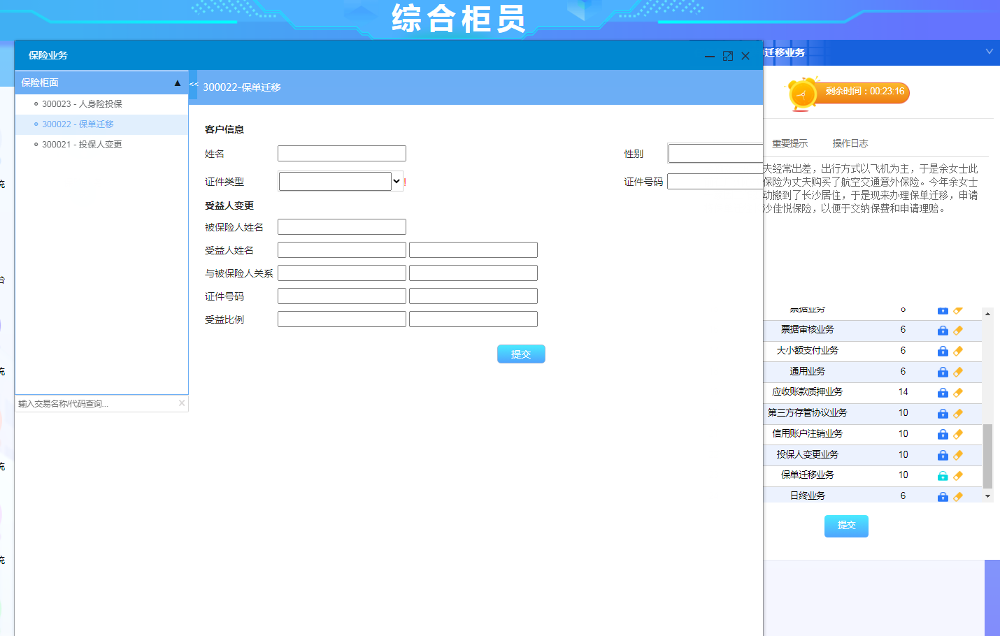

**25、日终业务**

根据任务说明点击“ 核心业务系统 ”→“ 开工交接完工管理 ”→“ 柜员完工 ”，进入对应业务操作页面，并依据任务说明及重要提示信息填写页面信息，根据任务说明填写表单

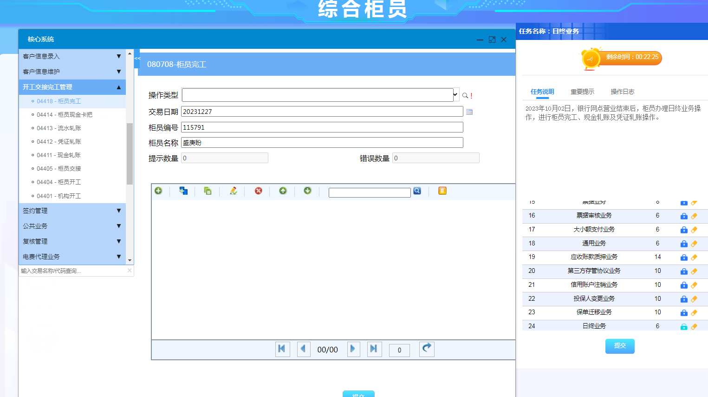

1. **提交**

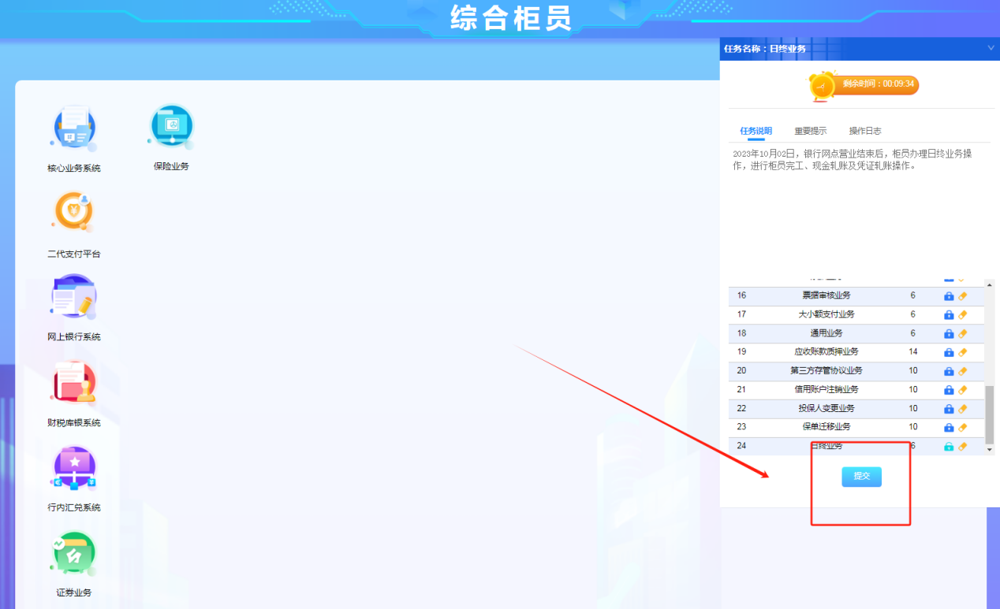

> 更新: 2025-11-26 23:07:24  
> 原文: <https://www.yuque.com/lixinsi/hntyk2/ma2fqrye196gl13b>