# 自签证书Windows信任ssl操作手册

参考连接：

[一键私有化部署开源云操作系统sealos_哔哩哔哩_bilibili](https://www.bilibili.com/video/BV13M411S72L/?spm_id_from=333.1007.top_right_bar_window_history.content.click&vd_source=733e5c5a7c45cb2687458f754fc4dee8)

1.使用自签的证书

如何信任自签证书

mac系统

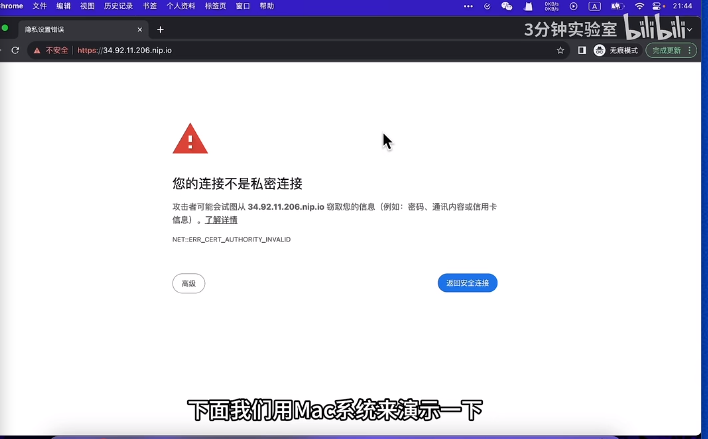

1.1点击不安全

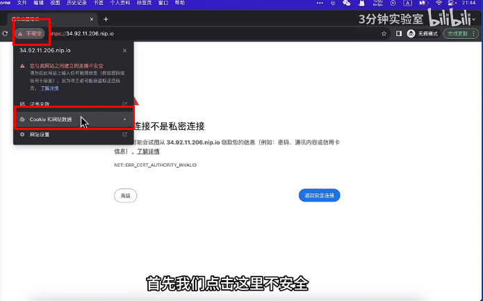

1.2详细信息

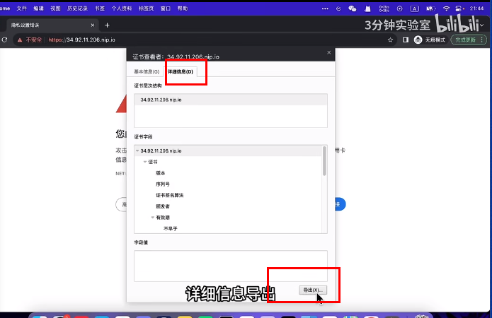

1.3找到证书，右键打开，输入密码

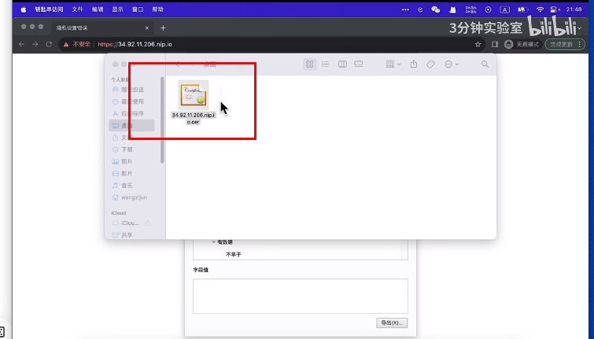

1.4发现没有，保存的证书，退出，重新在打开证书

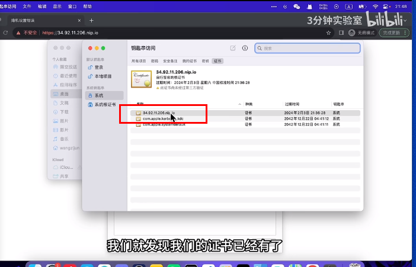

1.5双击证书找到信任，始终信任，关闭，输入密码，回到网页，刷新重新打开。

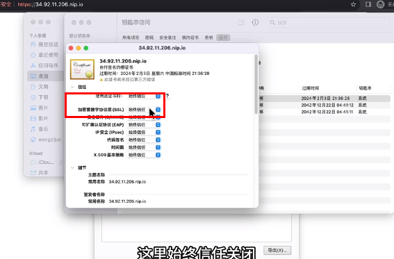

2.Windows自信任自签证书

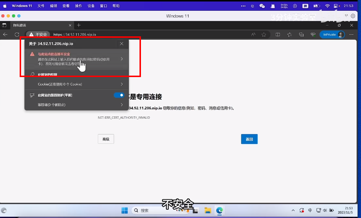

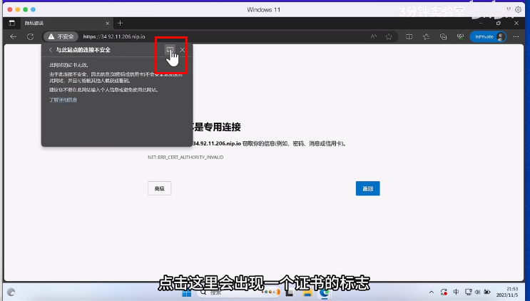

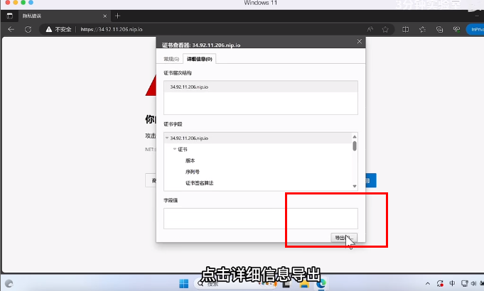

2.1导出到我们需要保存的文件夹后。打开edge浏览器搜索证书

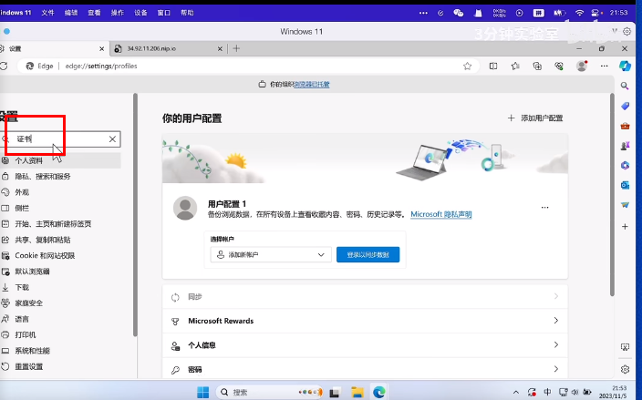 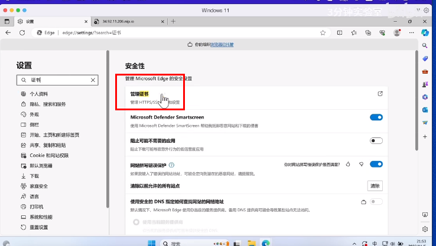

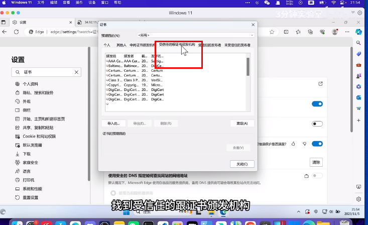

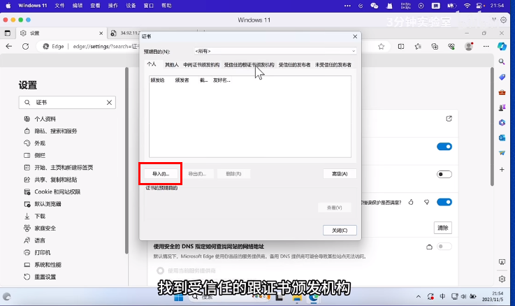

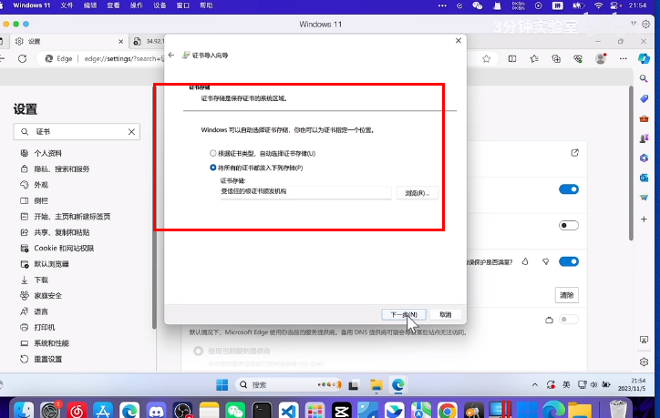

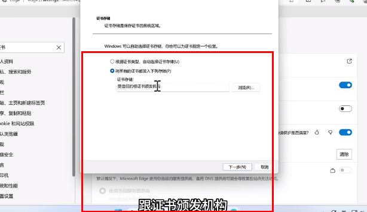

2.2重启浏览器，重新打开

> 更新: 2023-11-19 14:59:16  
> 原文: <https://www.yuque.com/lixinsi/hntyk2/bvqverifnpynkdqe>