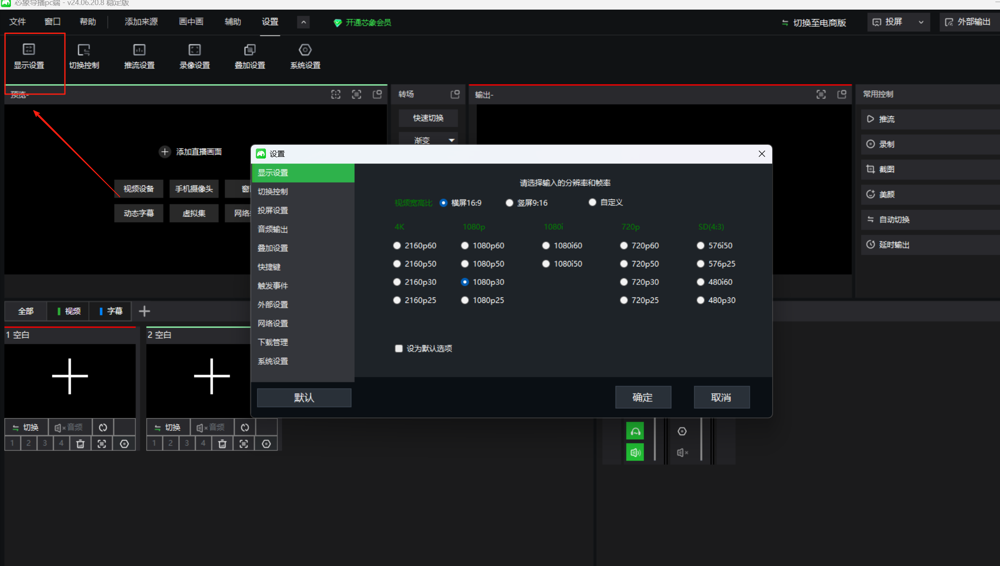
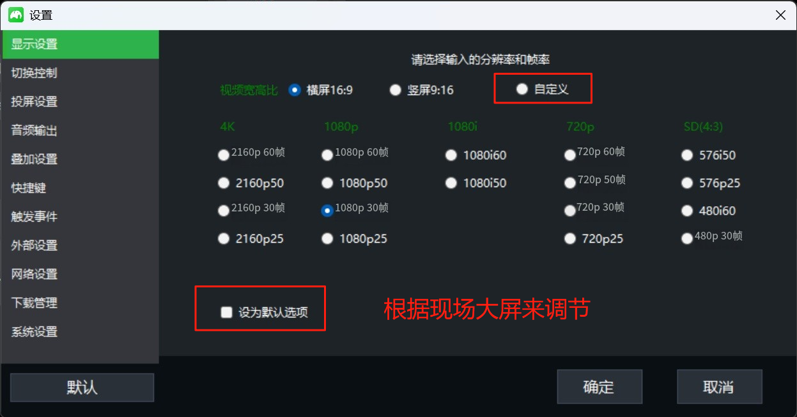
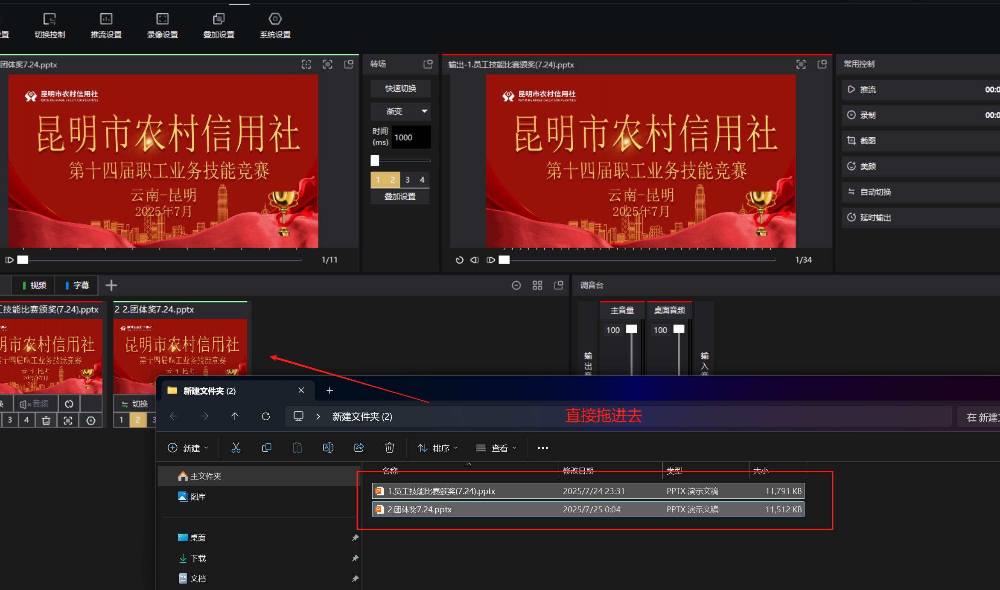
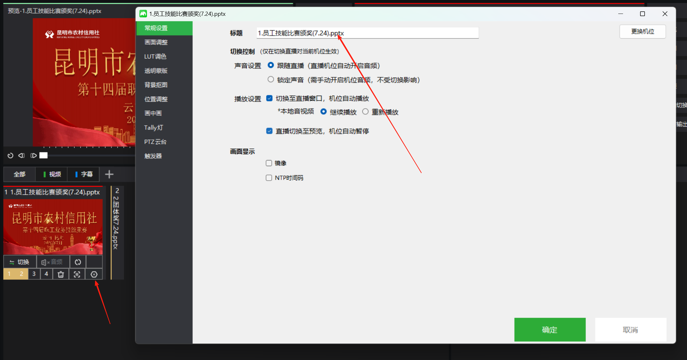
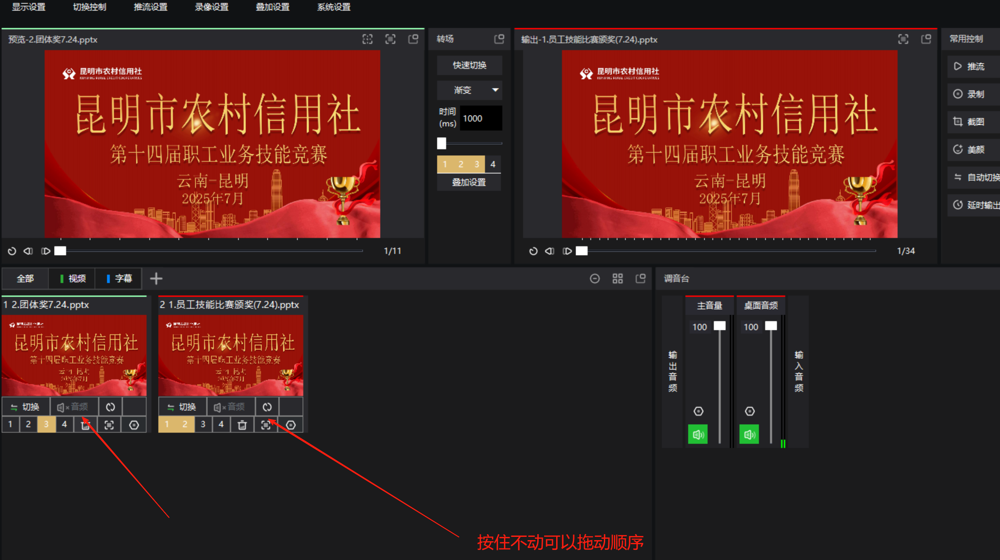
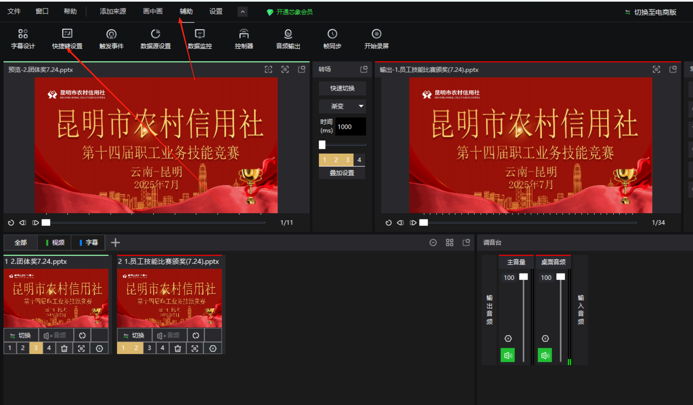
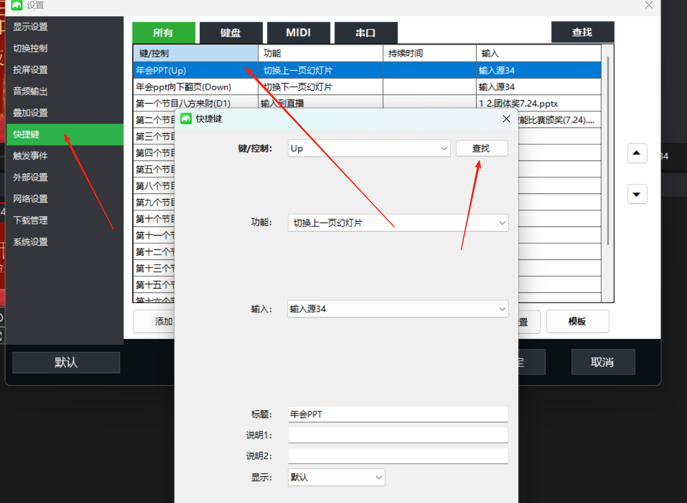
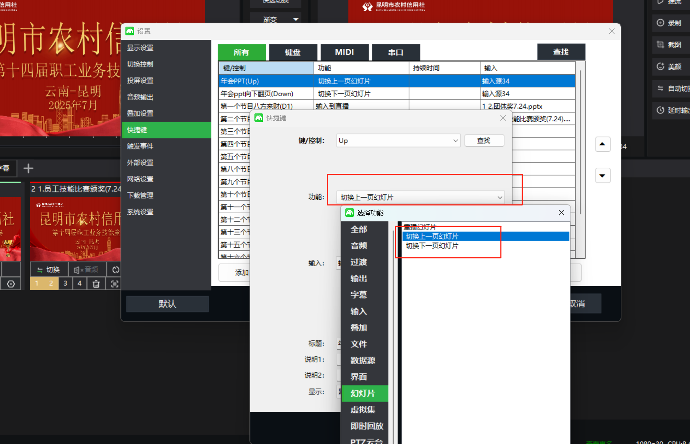

# 芯像软件使用操作手册

### 1.无缝切换
+ 首先把大屏的 hdmi 连接到电脑
+ 把电脑调试到扩展模式（快捷键 win+p）
+ 打开芯像软件，找到显示设置，自定义设置，这里 根据大屏的比列进行调整，今天演示的是台式电脑屏幕比例是 16：9，分辨率 1920*1080 就可以了
+ 
+ 
+ 把素材等拖动到芯象里面
+ 
+ 然后修改标题
+ 
+ 按住不动可以拖动顺序
+ 
+ ppt 翻页笔设置，快捷键设置
+ 
+ 翻页笔快捷键设置
+ 
+ 然后
+ 其它依次设置就可以了
+ 

> 更新: 2025-08-01 10:27:10  
> 原文: <https://www.yuque.com/lixinsi/hntyk2/uthzgylfiiop36sl>