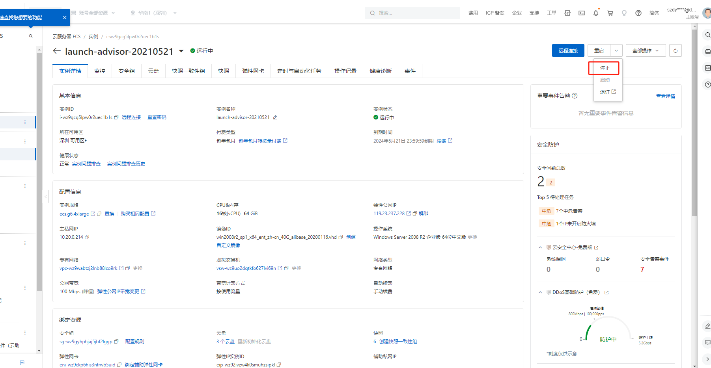
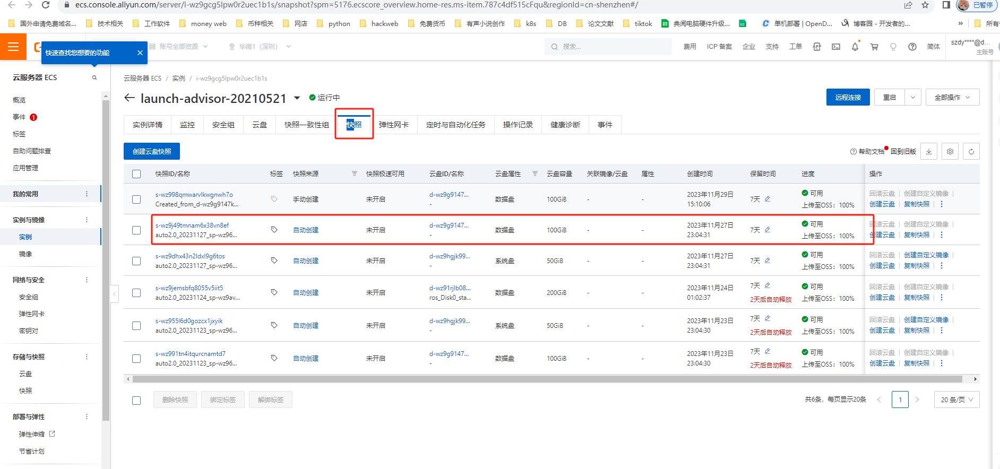
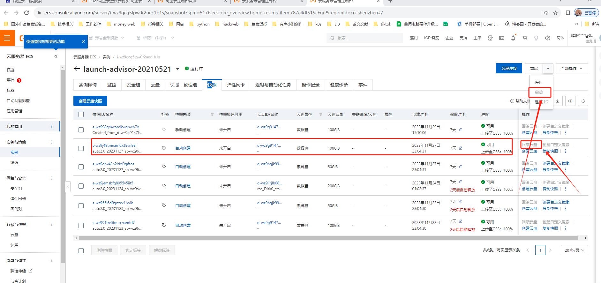

# 误删数据库解决办法

### 1.找到删除的数据库所在的服务器，查看是否有在删除之前的快照确定删除数据库，判断最近的时间。

### 2.现在的盘符做好快照，然后还原到有数据的快照。并且启动。

### 3.启动服务器后重新登入服务器，并且找到相关数据库，复制到另外的数据盘。

### 4.复制完后，重新找到新备份的云盘快照，并且恢复到最开始状态。

### 5.重新附加需要还原的数据库，并且更改webconfig的配置文件

> 更新: 2023-11-29 15:39:09  
> 原文: <https://www.yuque.com/lixinsi/hntyk2/gzbfzw3d6etb7vtr>