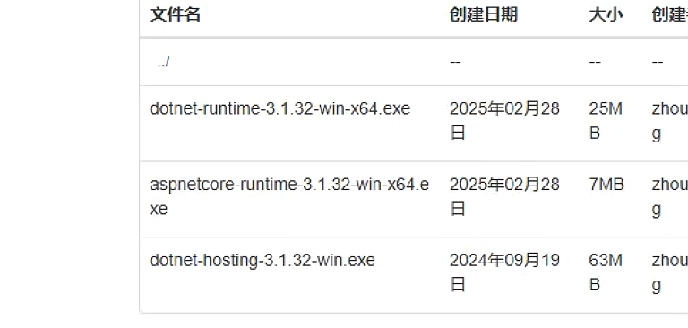

# 跨境客服电商客服系统

```json
电商客服系统查询管理员账号及密码：

select a.F_Account,b.F_UserPassword from sys_user a left join sys_userlogon b on b.F_UserId=a.f_id;

查询学生账号及密码：
select f_NO, F_Password from tb_org_student;
```

```plain
donet3.1.23
```

.NET CLR 版本: 无托管代码

托管管道模式: 集成

启动模式: AlwaysRunning


> 更新: 2025-08-29 16:54:56  
> 原文: <https://www.yuque.com/lixinsi/hntyk2/hzvwfll7xzxr0hlt>