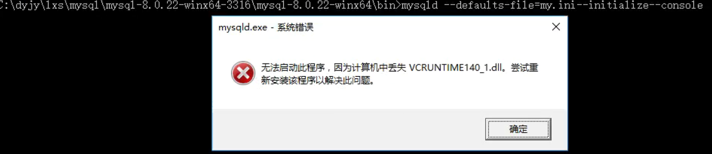
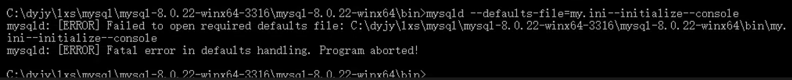
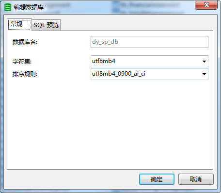
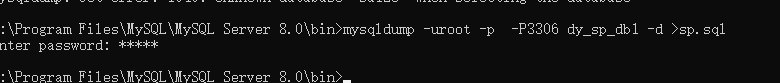
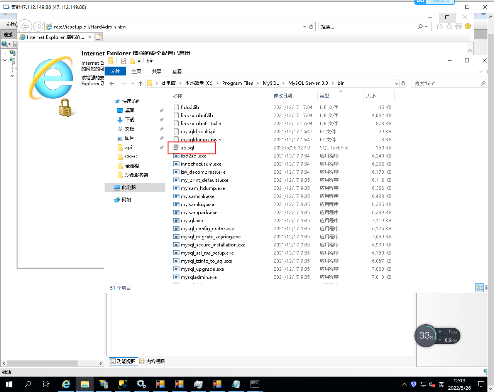
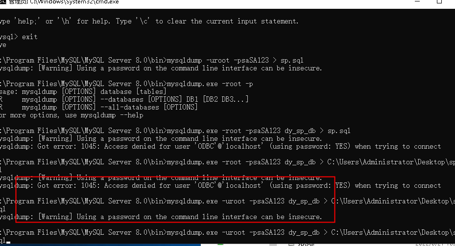
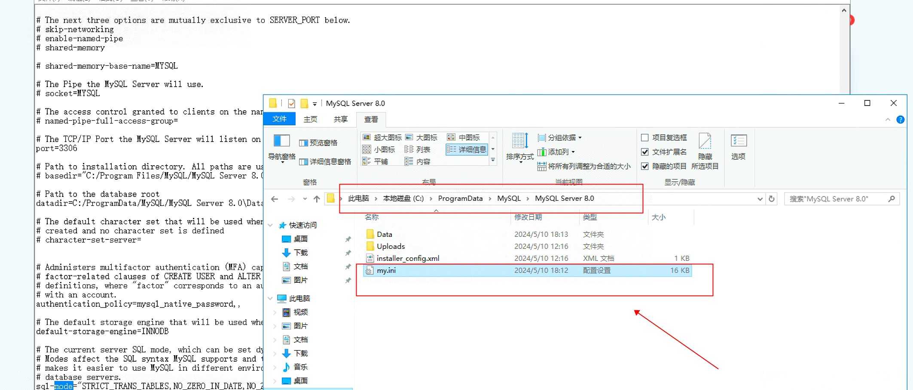
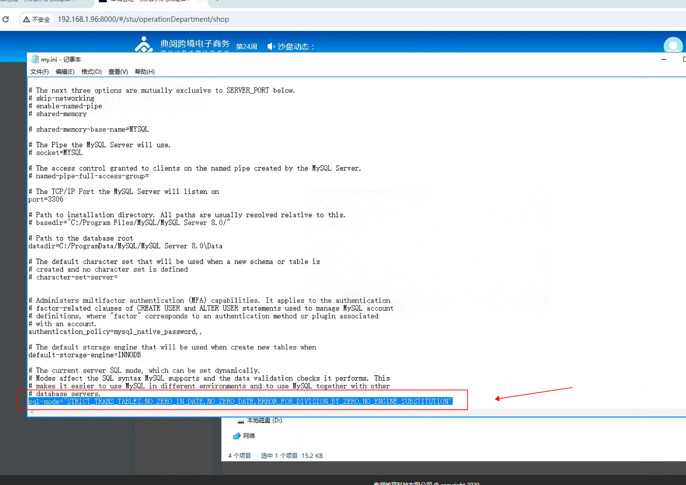
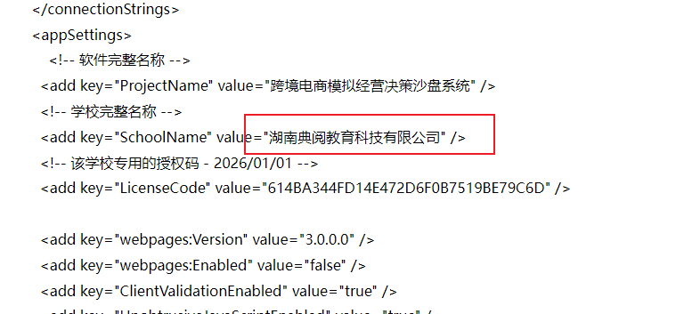
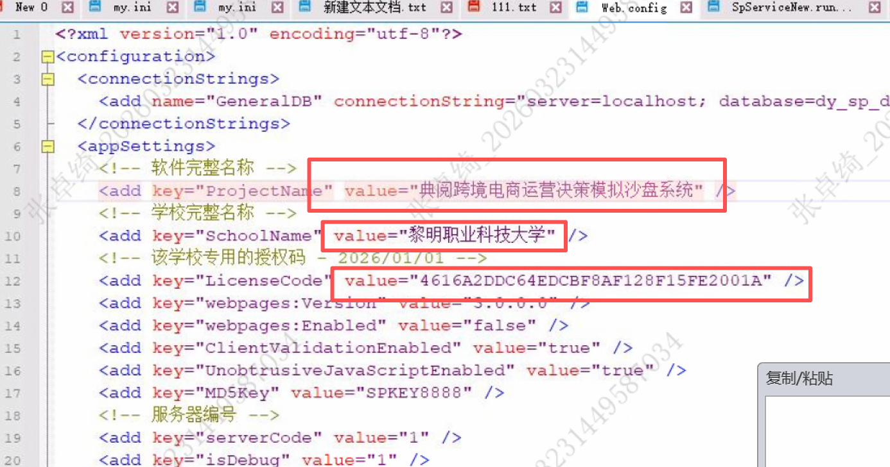

# 跨境沙盘部署



### <font style="color:rgba(0, 0, 0, 0.85) !important;">这是因计算机缺失 </font><code><font style="color:rgba(0, 0, 0, 0.85) !important;">VCRUNTIME140_1.dll</font></code><font style="color:rgba(0, 0, 0, 0.85) !important;"> 文件，导致 </font><code><font style="color:rgba(0, 0, 0, 0.85) !important;">mysqld.exe</font></code><font style="color:rgba(0, 0, 0, 0.85) !important;"> 无法启动的问题，以下是解决办法：</font>

1. **<font style="color:rgb(0, 0, 0) !important;">安装 / 修复 Visual C++ 运行库</font>**<font style="color:rgba(0, 0, 0, 0.85) !important;">：</font><code><font style="color:rgb(0, 0, 0);">VCRUNTIME140_1.dll</font></code><font style="color:rgba(0, 0, 0, 0.85) !important;"> </font><font style="color:rgba(0, 0, 0, 0.85) !important;">是 Microsoft Visual C++ 运行库的一部分。前往</font>[<font style="color:rgb(9, 105, 218);">微软官网</font>](https://learn.microsoft.com/en-us/cpp/windows/latest-supported-vc-redist?view=msvc-170)<font style="color:rgba(0, 0, 0, 0.85) !important;">，根据系统位数（64 位系统选</font><font style="color:rgba(0, 0, 0, 0.85) !important;"> </font><code><font style="color:rgb(0, 0, 0);">vc_redist.x64.exe</font></code><font style="color:rgba(0, 0, 0, 0.85) !important;"> </font><font style="color:rgba(0, 0, 0, 0.85) !important;">，32 位选</font><font style="color:rgba(0, 0, 0, 0.85) !important;"> </font><code><font style="color:rgb(0, 0, 0);">vc_redist.x86.exe</font></code><font style="color:rgba(0, 0, 0, 0.85) !important;"> </font><font style="color:rgba(0, 0, 0, 0.85) !important;">）下载对应版本的 Visual C++ Redistributable（2015 及以上版本，通常 2019、2022 版本也兼容），安装后重启电脑 。若已安装，可尝试修复（安装程序里有修复选项 ）。</font>
2. **<font style="color:rgb(0, 0, 0) !important;">使用 DLL 修复工具</font>**<font style="color:rgba(0, 0, 0, 0.85) !important;">：比如 “DLL 修复管家”（浏览器访问</font><font style="color:rgba(0, 0, 0, 0.85) !important;"> </font><code><font style="color:rgb(0, 0, 0);">dll修复管家.site</font></code><font style="color:rgba(0, 0, 0, 0.85) !important;"> </font><font style="color:rgba(0, 0, 0, 0.85) !important;">，按指引下载安装、修复 ），或 “DirectX 修复工具”（网上搜索下载，运行后检测并修复 ），这类工具能自动扫描、补充缺失的 DLL 文件。</font>
3. **<font style="color:rgb(0, 0, 0) !important;">手动复制替换（需注意来源）</font>**<font style="color:rgba(0, 0, 0, 0.85) !important;">：从其他正常且系统环境相同（同系统位数、版本）的电脑上，找到</font><font style="color:rgba(0, 0, 0, 0.85) !important;"> </font><code><font style="color:rgb(0, 0, 0);">VCRUNTIME140_1.dll</font></code><font style="color:rgba(0, 0, 0, 0.85) !important;"> </font><font style="color:rgba(0, 0, 0, 0.85) !important;">文件（一般在</font><font style="color:rgba(0, 0, 0, 0.85) !important;"> </font><code><font style="color:rgb(0, 0, 0);">C:\Windows\System32</font></code><font style="color:rgba(0, 0, 0, 0.85) !important;"> </font><font style="color:rgba(0, 0, 0, 0.85) !important;">（64 位系统）或</font><font style="color:rgba(0, 0, 0, 0.85) !important;"> </font><code><font style="color:rgb(0, 0, 0);">C:\Windows\SysWOW64</font></code><font style="color:rgba(0, 0, 0, 0.85) !important;"> </font><font style="color:rgba(0, 0, 0, 0.85) !important;">（32 位程序在 64 位系统的目录 ）），复制到你电脑的对应目录，再尝试启动程序 。注意从可靠电脑复制，避免文件本身有问题。</font>
4. **<font style="color:rgb(0, 0, 0) !important;">检查系统更新</font>**<font style="color:rgba(0, 0, 0, 0.85) !important;">：进入 Windows “设置” - “更新和安全” - “Windows 更新”，检查并安装所有可用更新，系统更新可能修复 DLL 相关依赖问题 。</font>
5. <font style="color:rgba(0, 0, 0, 0.85) !important;"></font>



### <font style="color:rgba(0, 0, 0, 0.85) !important;">从报错信息看，是 </font><code><font style="color:rgba(0, 0, 0, 0.85) !important;">mysqld</font></code><font style="color:rgba(0, 0, 0, 0.85) !important;"> 启动时无法正确识别 </font><code><font style="color:rgba(0, 0, 0, 0.85) !important;">my.ini</font></code><font style="color:rgba(0, 0, 0, 0.85) !important;"> 配置文件路径，因为命令里参数拼接有误，导致把 </font><code><font style="color:rgba(0, 0, 0, 0.85) !important;">--initialize --console</font></code><font style="color:rgba(0, 0, 0, 0.85) !important;"> 也当成配置文件路径一部分了。以下是解决步骤：</font>

### <font style="color:rgb(0, 0, 0);">1. 检查命令格式</font>

<font style="color:rgba(0, 0, 0, 0.85) !important;">原命令：</font>

**<font style="color:rgba(0, 0, 0, 0.85);">plaintext</font>**

```plain
mysqld --defaults-file=my.ini--initialize--console
```

<font style="color:rgba(0, 0, 0, 0.85) !important;">问题在于参数之间</font>**<font style="color:rgb(0, 0, 0) !important;">缺少空格</font>**<font style="color:rgba(0, 0, 0, 0.85) !important;">，正确格式应该是参数用空格分隔，修改为：</font>

**<font style="color:rgba(0, 0, 0, 0.85);">plaintext</font>**

```plain
mysqld --defaults-file=my.ini --initialize --console
```

### <font style="color:rgb(0, 0, 0);">2. 确认</font><font style="color:rgb(0, 0, 0);"> </font><code><font style="color:rgb(0, 0, 0);">my.ini</font></code><font style="color:rgb(0, 0, 0);"> </font><font style="color:rgb(0, 0, 0);">路径</font>

<font style="color:rgba(0, 0, 0, 0.85) !important;">如果</font><font style="color:rgba(0, 0, 0, 0.85) !important;"> </font><code><font style="color:rgba(0, 0, 0, 0.85) !important;">my.ini</font></code><font style="color:rgba(0, 0, 0, 0.85) !important;"> </font><font style="color:rgba(0, 0, 0, 0.85) !important;">不在当前</font><font style="color:rgba(0, 0, 0, 0.85) !important;"> </font><code><font style="color:rgba(0, 0, 0, 0.85) !important;">bin</font></code><font style="color:rgba(0, 0, 0, 0.85) !important;"> </font><font style="color:rgba(0, 0, 0, 0.85) !important;">目录下，需要写</font>**<font style="color:rgb(0, 0, 0) !important;">完整绝对路径</font>**<font style="color:rgba(0, 0, 0, 0.85) !important;">，比如</font><font style="color:rgba(0, 0, 0, 0.85) !important;"> </font><code><font style="color:rgba(0, 0, 0, 0.85) !important;">my.ini</font></code><font style="color:rgba(0, 0, 0, 0.85) !important;"> </font><font style="color:rgba(0, 0, 0, 0.85) !important;">在</font><font style="color:rgba(0, 0, 0, 0.85) !important;"> </font><code><font style="color:rgba(0, 0, 0, 0.85) !important;">C:\dyjy\lxs\mysql\mysql-8.0.22-winx64-3316\</font></code><font style="color:rgba(0, 0, 0, 0.85) !important;"> </font><font style="color:rgba(0, 0, 0, 0.85) !important;">目录，命令要改成：</font>

**<font style="color:rgba(0, 0, 0, 0.85);">plaintext</font>**

```plain
mysqld --defaults-file=C:\dyjy\lxs\mysql\mysql-8.0.22-winx64-3316\my.ini --initialize --console
```

### <font style="color:rgb(0, 0, 0);">3. 验证</font><font style="color:rgb(0, 0, 0);"> </font><code><font style="color:rgb(0, 0, 0);">my.ini</font></code><font style="color:rgb(0, 0, 0);"> </font><font style="color:rgb(0, 0, 0);">内容</font>

<font style="color:rgba(0, 0, 0, 0.85) !important;">打开</font><font style="color:rgba(0, 0, 0, 0.85) !important;"> </font><code><font style="color:rgba(0, 0, 0, 0.85) !important;">my.ini</font></code><font style="color:rgba(0, 0, 0, 0.85) !important;">，确保基础配置正确，比如：</font>

**<font style="color:rgba(0, 0, 0, 0.85);">ini</font>**

```plain
[mysqld]
# 设置基于的端口，默认3306
port = 3306  
# MySQL 安装目录
basedir = C:\dyjy\lxs\mysql\mysql-8.0.22-winx64-3316  
# 数据存放目录，需提前创建好文件夹
datadir = C:\dyjy\lxs\mysql\mysql-8.0.22-winx64-3316\data  
# 允许最大连接数
max_connections=200  
# 字符集
character-set-server=utf8mb4  
# 数据库引擎
default-storage-engine=INNODB
```

### <font style="color:rgb(0, 0, 0);">1. 命令格式修正与解析</font>

#### <font style="color:rgb(0, 0, 0);">（1）安装服务命令</font>

<font style="color:rgba(0, 0, 0, 0.85) !important;">原命令格式有误，正确的安装服务命令应该是（假设要安装服务名为</font><font style="color:rgba(0, 0, 0, 0.85) !important;"> </font><code><font style="color:rgba(0, 0, 0, 0.85) !important;">MySQL_3316</font></code><font style="color:rgba(0, 0, 0, 0.85) !important;"> </font><font style="color:rgba(0, 0, 0, 0.85) !important;">，配置文件为</font><font style="color:rgba(0, 0, 0, 0.85) !important;"> </font><code><font style="color:rgba(0, 0, 0, 0.85) !important;">d:\MYSQL\mysql-8.0.22-3316\bin\my.ini</font></code><font style="color:rgba(0, 0, 0, 0.85) !important;"> </font><font style="color:rgba(0, 0, 0, 0.85) !important;">）：</font>

**<font style="color:rgba(0, 0, 0, 0.85);">cmd</font>**

```plain
d:\MYSQL\mysql-8.0.22-3316\bin\mysqld.exe install MySQL_3316 --defaults-file="d:\MYSQL\mysql-8.0.22-3316\bin\my.ini"
```

**<font style="color:rgb(0, 0, 0) !important;">参数说明</font>**<font style="color:rgba(0, 0, 0, 0.85) !important;">：</font>

* <code><font style="color:rgb(0, 0, 0);">mysqld.exe install</font></code><font style="color:rgba(0, 0, 0, 0.85) !important;"> </font><font style="color:rgba(0, 0, 0, 0.85) !important;">：这是告诉系统要安装 MySQL 服务 。</font>
* <code><font style="color:rgb(0, 0, 0);">MySQL_3316</font></code><font style="color:rgba(0, 0, 0, 0.85) !important;"> </font><font style="color:rgba(0, 0, 0, 0.85) !important;">：自定义的服务名称，方便区分不同实例（比如你要装多个 MySQL ，端口不同，服务名也不同），后续管理服务（启动、停止等）会用到这个名称 。</font>
* <code><font style="color:rgb(0, 0, 0);">--defaults-file</font></code><font style="color:rgba(0, 0, 0, 0.85) !important;"> </font><font style="color:rgba(0, 0, 0, 0.85) !important;">：指定 MySQL 启动时加载的配置文件路径，这里要确保</font><font style="color:rgba(0, 0, 0, 0.85) !important;"> </font><code><font style="color:rgb(0, 0, 0);">my.ini</font></code><font style="color:rgba(0, 0, 0, 0.85) !important;"> </font><font style="color:rgba(0, 0, 0, 0.85) !important;">配置文件存在且内容正确，配置里一般要指定</font><font style="color:rgba(0, 0, 0, 0.85) !important;"> </font><code><font style="color:rgb(0, 0, 0);">basedir</font></code><font style="color:rgba(0, 0, 0, 0.85) !important;">（MySQL 安装目录）、</font><code><font style="color:rgb(0, 0, 0);">datadir</font></code><font style="color:rgba(0, 0, 0, 0.85) !important;">（数据存放目录 ，需提前创建好空文件夹 ）、</font><code><font style="color:rgb(0, 0, 0);">port</font></code><font style="color:rgba(0, 0, 0, 0.85) !important;">（端口，如 3316 ，要和服务名里的端口对应，且确保端口未被占用 ）等关键配置 。</font>

#### <font style="color:rgb(0, 0, 0);">（2）启动服务操作</font>

<font style="color:rgba(0, 0, 0, 0.85) !important;">安装好服务后，在 Windows 系统服务中找到</font><font style="color:rgba(0, 0, 0, 0.85) !important;"> </font><code><font style="color:rgba(0, 0, 0, 0.85) !important;">MySQL_3316</font></code><font style="color:rgba(0, 0, 0, 0.85) !important;"> </font><font style="color:rgba(0, 0, 0, 0.85) !important;">服务（可以通过 “运行” 输入</font><font style="color:rgba(0, 0, 0, 0.85) !important;"> </font><code><font style="color:rgba(0, 0, 0, 0.85) !important;">services.msc</font></code><font style="color:rgba(0, 0, 0, 0.85) !important;"> </font><font style="color:rgba(0, 0, 0, 0.85) !important;">回车打开服务列表查找 ），然后右键选择 “启动”；也可以用命令行启动，以管理员身份打开命令提示符，执行：</font>

**<font style="color:rgba(0, 0, 0, 0.85);">cmd</font>**

```plain
net start MySQL_3316
```

### <font style="color:rgb(0, 0, 0);">2. 常见问题及解决</font>

#### <font style="color:rgb(0, 0, 0);">（1）安装报错 “服务已存在”</font>

<font style="color:rgba(0, 0, 0, 0.85) !important;">如果执行安装命令时提示服务已存在，先执行</font><font style="color:rgba(0, 0, 0, 0.85) !important;"> </font><code><font style="color:rgba(0, 0, 0, 0.85) !important;">sc delete MySQL_3316</font></code><font style="color:rgba(0, 0, 0, 0.85) !important;">（以管理员权限执行 ）删除已存在的同名服务，再重新执行安装命令 。</font>

#### <font style="color:rgb(0, 0, 0);">（2）启动报错 “系统错误 1067” 等</font>

<font style="color:rgba(0, 0, 0, 0.85) !important;">通常是</font><font style="color:rgba(0, 0, 0, 0.85) !important;"> </font><code><font style="color:rgba(0, 0, 0, 0.85) !important;">my.ini</font></code><font style="color:rgba(0, 0, 0, 0.85) !important;"> </font><font style="color:rgba(0, 0, 0, 0.85) !important;">配置有问题，比如</font><font style="color:rgba(0, 0, 0, 0.85) !important;"> </font><code><font style="color:rgba(0, 0, 0, 0.85) !important;">datadir</font></code><font style="color:rgba(0, 0, 0, 0.85) !important;"> </font><font style="color:rgba(0, 0, 0, 0.85) !important;">指定的目录不存在、路径写错（有中文或特殊字符 ），或者</font><font style="color:rgba(0, 0, 0, 0.85) !important;"> </font><code><font style="color:rgba(0, 0, 0, 0.85) !important;">port</font></code><font style="color:rgba(0, 0, 0, 0.85) !important;"> </font><font style="color:rgba(0, 0, 0, 0.85) !important;">被其他程序占用。检查</font><font style="color:rgba(0, 0, 0, 0.85) !important;"> </font><code><font style="color:rgba(0, 0, 0, 0.85) !important;">my.ini</font></code><font style="color:rgba(0, 0, 0, 0.85) !important;"> </font><font style="color:rgba(0, 0, 0, 0.85) !important;">配置，确认目录存在、路径正确，且端口未被占用（可通过</font><font style="color:rgba(0, 0, 0, 0.85) !important;"> </font><code><font style="color:rgba(0, 0, 0, 0.85) !important;">netstat -ano | findstr "3316"</font></code><font style="color:rgba(0, 0, 0, 0.85) !important;"> </font><font style="color:rgba(0, 0, 0, 0.85) !important;">查看端口占用情况 ），修正后重新尝试启动服务 。</font>

#### <font style="color:rgb(0, 0, 0);">（3）命令执行权限不足</font>

<font style="color:rgba(0, 0, 0, 0.85) !important;">安装和启动服务的命令，需要以</font>**<font style="color:rgb(0, 0, 0) !important;">管理员身份</font>**<font style="color:rgba(0, 0, 0, 0.85) !important;">打开命令提示符来执行，否则可能因权限不够导致操作失败 。</font>

<font style="color:rgba(0, 0, 0, 0.85) !important;">从报错来看，</font><code><font style="color:rgba(0, 0, 0, 0.85) !important;">mysqld</font></code><font style="color:rgba(0, 0, 0, 0.85) !important;"> </font><font style="color:rgba(0, 0, 0, 0.85) !important;">启动时无法打开指定的</font><font style="color:rgba(0, 0, 0, 0.85) !important;"> </font><code><font style="color:rgba(0, 0, 0, 0.85) !important;">my.ini</font></code><font style="color:rgba(0, 0, 0, 0.85) !important;"> </font><font style="color:rgba(0, 0, 0, 0.85) !important;">配置文件，以下是排查和解决步骤：</font>

### <font style="color:rgb(0, 0, 0);">1. 检查</font><font style="color:rgb(0, 0, 0);"> </font><code><font style="color:rgb(0, 0, 0);">my.ini</font></code><font style="color:rgb(0, 0, 0);"> </font><font style="color:rgb(0, 0, 0);">文件实际路径</font>

<font style="color:rgba(0, 0, 0, 0.85) !important;">确认</font><font style="color:rgba(0, 0, 0, 0.85) !important;"> </font><code><font style="color:rgba(0, 0, 0, 0.85) !important;">my.ini</font></code><font style="color:rgba(0, 0, 0, 0.85) !important;"> </font><font style="color:rgba(0, 0, 0, 0.85) !important;">确实在</font><font style="color:rgba(0, 0, 0, 0.85) !important;"> </font><code><font style="color:rgba(0, 0, 0, 0.85) !important;">C:\dyjy\lxs\mysql\mysql-8.0.22-winx64-3317\mysql-8.0.22-winx64\bin</font></code><font style="color:rgba(0, 0, 0, 0.85) !important;"> </font><font style="color:rgba(0, 0, 0, 0.85) !important;">目录下 。可以直接打开该路径，查看是否存在</font><font style="color:rgba(0, 0, 0, 0.85) !important;"> </font><code><font style="color:rgba(0, 0, 0, 0.85) !important;">my.ini</font></code><font style="color:rgba(0, 0, 0, 0.85) !important;"> </font><font style="color:rgba(0, 0, 0, 0.85) !important;">文件，若不存在，需要创建或从其他正确的 MySQL 配置中拷贝过来（配置要适配当前环境 ）。</font>

### <font style="color:rgb(0, 0, 0);">2. 修正命令里的文件路径</font>

<font style="color:rgba(0, 0, 0, 0.85) !important;">当前命令中</font><font style="color:rgba(0, 0, 0, 0.85) !important;"> </font><code><font style="color:rgba(0, 0, 0, 0.85) !important;">--defaults-file</font></code><font style="color:rgba(0, 0, 0, 0.85) !important;"> </font><font style="color:rgba(0, 0, 0, 0.85) !important;">参数的路径写得混乱，正确的命令应该明确指定</font><font style="color:rgba(0, 0, 0, 0.85) !important;"> </font><code><font style="color:rgba(0, 0, 0, 0.85) !important;">my.ini</font></code><font style="color:rgba(0, 0, 0, 0.85) !important;"> </font><font style="color:rgba(0, 0, 0, 0.85) !important;">的完整路径，示例（根据实际路径调整，确保路径准确 ）：</font>

<font style="color:rgba(0, 0, 0, 0.85) !important;">  
</font>

**<font style="color:rgba(0, 0, 0, 0.85);">cmd</font>**

```plain
mysqld --defaults-file=C:\dyjy\lxs\mysql\mysql-8.0.22-winx64-3317\mysql-8.0.22-winx64\bin\my.ini --initialize --console
```

<font style="color:rgba(0, 0, 0, 0.85) !important;">  
</font>

<font style="color:rgba(0, 0, 0, 0.85) !important;">要保证路径里的斜杠是</font><font style="color:rgba(0, 0, 0, 0.85) !important;"> </font><code><font style="color:rgba(0, 0, 0, 0.85) !important;">\</font></code><font style="color:rgba(0, 0, 0, 0.85) !important;">（Windows 系统下路径分隔符 ），且整个路径正确对应</font><font style="color:rgba(0, 0, 0, 0.85) !important;"> </font><code><font style="color:rgba(0, 0, 0, 0.85) !important;">my.ini</font></code><font style="color:rgba(0, 0, 0, 0.85) !important;"> </font><font style="color:rgba(0, 0, 0, 0.85) !important;">所在位置 。</font>

### <font style="color:rgb(0, 0, 0);">3. 检查</font><font style="color:rgb(0, 0, 0);"> </font><code><font style="color:rgb(0, 0, 0);">my.ini</font></code><font style="color:rgb(0, 0, 0);"> </font><font style="color:rgb(0, 0, 0);">配置语法</font>

<font style="color:rgba(0, 0, 0, 0.85) !important;">打开</font><font style="color:rgba(0, 0, 0, 0.85) !important;"> </font><code><font style="color:rgba(0, 0, 0, 0.85) !important;">my.ini</font></code><font style="color:rgba(0, 0, 0, 0.85) !important;"> </font><font style="color:rgba(0, 0, 0, 0.85) !important;">文件，检查配置内容是否正确，基础配置示例（需根据实际情况修改，比如</font><font style="color:rgba(0, 0, 0, 0.85) !important;"> </font><code><font style="color:rgba(0, 0, 0, 0.85) !important;">datadir</font></code><font style="color:rgba(0, 0, 0, 0.85) !important;"> </font><font style="color:rgba(0, 0, 0, 0.85) !important;">要指向实际数据存放目录，且该目录需提前创建好 ）：</font>

<font style="color:rgba(0, 0, 0, 0.85) !important;">  
</font>

**<font style="color:rgba(0, 0, 0, 0.85);">ini</font>**

```plain
[mysqld]
# MySQL 安装目录，注意路径要和实际一致，用双反斜杠或单斜杠（Windows 下）
basedir = C:\dyjy\lxs\mysql\mysql-8.0.22-winx64-3317\mysql-8.0.22-winx64 
# 数据存放目录，需提前创建空文件夹
datadir = C:\dyjy\lxs\mysql\mysql-8.0.22-winx64-3317\mysql-8.0.22-winx64\data 
port = 3317
character-set-server = utf8mb4
default-storage-engine = INNODB
```

<font style="color:rgba(0, 0, 0, 0.85) !important;">根据你提供的步骤，我将为你整理和修正创建用户、授权、配置主从复制的完整流程。以下是针对 MySQL 3316 和 3317 实例的配置指南：</font>

### <font style="color:rgb(0, 0, 0);">一、创建远程访问用户（在主库 3316 上执行）</font>

**<font style="color:rgba(0, 0, 0, 0.85);">sql</font>**

```sql
-- 创建可远程访问的用户 'sa'，密码为 'saSA123'
CREATE USER 'sa'@'%' IDENTIFIED BY 'saSA123';

-- 授予该用户所有权限
GRANT ALL PRIVILEGES ON *.* TO 'sa'@'%';

-- 刷新权限使生效
FLUSH PRIVILEGES;
```

### <font style="color:rgb(0, 0, 0);">二、配置主从复制（假设 3316 为主库，3317 为从库）</font>

#### <font style="color:rgb(0, 0, 0);">1.</font><font style="color:rgb(0, 0, 0);"> </font>**<font style="color:rgb(0, 0, 0) !important;">主库配置（3316）</font>**

**<font style="color:rgb(0, 0, 0) !important;">步骤 1：修改主库配置文件</font>\*\*\*\*<font style="color:rgb(0, 0, 0) !important;"> </font>**<code>**<font style="color:rgb(0, 0, 0);">my.ini</font>**</code>

<font style="color:rgba(0, 0, 0, 0.85) !important;">  
</font>

**<font style="color:rgba(0, 0, 0, 0.85);">ini</font>**

```plain
[mysqld]
server-id = 1               # 主库唯一ID
log-bin = mysql-bin         # 启用二进制日志
binlog-do-db = your_database  # 指定需要复制的数据库（可选）
expire-logs-days = 10       # 二进制日志保留天数
```

<font style="color:rgba(0, 0, 0, 0.85) !important;">  
</font>

<font style="color:rgba(0, 0, 0, 0.85) !important;">修改后重启主库服务：</font>

<font style="color:rgba(0, 0, 0, 0.85) !important;">  
</font>

**<font style="color:rgba(0, 0, 0, 0.85);">batch</font>**

```plain
net stop MySQL_3316
net start MySQL_3316
```

<font style="color:rgba(0, 0, 0, 0.85) !important;">  
</font>

**<font style="color:rgb(0, 0, 0) !important;">步骤 2：查看主库状态（记录 File 和 Position）</font>**

<font style="color:rgba(0, 0, 0, 0.85) !important;">  
</font>

**<font style="color:rgba(0, 0, 0, 0.85);">sql</font>**

```sql
SHOW MASTER STATUS;
```

<font style="color:rgba(0, 0, 0, 0.85) !important;">  
</font>

<font style="color:rgba(0, 0, 0, 0.85) !important;">输出示例：</font>

<font style="color:rgba(0, 0, 0, 0.85) !important;">  
</font>

**<font style="color:rgba(0, 0, 0, 0.85);">plaintext</font>**

```plain
+------------------+----------+--------------+------------------+
| File             | Position | Binlog_Do_DB | Binlog_Ignore_DB |
+------------------+----------+--------------+------------------+
| mysql-bin.000001 | 120      | your_database|                  |
+------------------+----------+--------------+------------------+
```

#### <font style="color:rgb(0, 0, 0);">2.</font><font style="color:rgb(0, 0, 0);"> </font>**<font style="color:rgb(0, 0, 0) !important;">从库配置（3317）</font>**

**<font style="color:rgb(0, 0, 0) !important;">步骤 1：修改从库配置文件</font>\*\*\*\*<font style="color:rgb(0, 0, 0) !important;"> </font>**<code>**<font style="color:rgb(0, 0, 0);">my.ini</font>**</code>

<font style="color:rgba(0, 0, 0, 0.85) !important;">  
</font>

**<font style="color:rgba(0, 0, 0, 0.85);">ini</font>**

```plain
[mysqld]
server-id = 2               # 从库唯一ID（不能与主库重复）
relay-log = mysql-relay-bin # 中继日志名称
log-bin = mysql-bin         # 从库也可以作为其他库的主库时需要
read-only = 1               # 从库设为只读（可选）
```

<font style="color:rgba(0, 0, 0, 0.85) !important;">  
</font>

<font style="color:rgba(0, 0, 0, 0.85) !important;">修改后重启从库服务：</font>

<font style="color:rgba(0, 0, 0, 0.85) !important;">  
</font>

**<font style="color:rgba(0, 0, 0, 0.85);">batch</font>**

```plain
net stop MySQL_3317
net start MySQL_3317
```

<font style="color:rgba(0, 0, 0, 0.85) !important;">  
</font>

**<font style="color:rgb(0, 0, 0) !important;">步骤 2：配置从库连接主库</font>**

<font style="color:rgba(0, 0, 0, 0.85) !important;">  
</font>

**<font style="color:rgba(0, 0, 0, 0.85);">sql</font>**

```sql
-- 连接到3317数据库，执行以下命令
CHANGE MASTER TO 
MASTER_HOST='127.0.0.1',      -- 主库IP
MASTER_PORT=3316,             -- 主库端口
MASTER_USER='sa',             -- 主库授权的用户名
MASTER_PASSWORD='saSA123',    -- 主库授权的密码
MASTER_LOG_FILE='mysql-bin.000001',  -- 主库SHOW MASTER STATUS的File值
MASTER_LOG_POS=120;           -- 主库SHOW MASTER STATUS的Position值

-- 启动从库复制线程
START SLAVE;

-- 检查从库状态
SHOW SLAVE STATUS\G;
```

<font style="color:rgba(0, 0, 0, 0.85) !important;">  
</font>

**<font style="color:rgb(0, 0, 0) !important;">关键检查项</font>**<font style="color:rgba(0, 0, 0, 0.85) !important;">：</font>

<font style="color:rgba(0, 0, 0, 0.85) !important;">  
</font>

* <code><font style="color:rgb(0, 0, 0);">Slave_IO_Running</font></code><font style="color:rgba(0, 0, 0, 0.85) !important;"> </font><font style="color:rgba(0, 0, 0, 0.85) !important;">和</font><font style="color:rgba(0, 0, 0, 0.85) !important;"> </font><code><font style="color:rgb(0, 0, 0);">Slave_SQL_Running</font></code><font style="color:rgba(0, 0, 0, 0.85) !important;"> </font><font style="color:rgba(0, 0, 0, 0.85) !important;">都应为</font><font style="color:rgba(0, 0, 0, 0.85) !important;"> </font><code><font style="color:rgb(0, 0, 0);">Yes</font></code>
* <code><font style="color:rgb(0, 0, 0);">Seconds_Behind_Master</font></code><font style="color:rgba(0, 0, 0, 0.85) !important;"> </font><font style="color:rgba(0, 0, 0, 0.85) !important;">应为</font><font style="color:rgba(0, 0, 0, 0.85) !important;"> </font><code><font style="color:rgb(0, 0, 0);">0</font></code><font style="color:rgba(0, 0, 0, 0.85) !important;">（表示主从同步正常）</font>

### <font style="color:rgb(0, 0, 0);">三、验证主从复制</font>

1. **<font style="color:rgb(0, 0, 0) !important;">在主库（3316）创建测试数据库</font>**<font style="color:rgba(0, 0, 0, 0.85) !important;">：</font>

<font style="color:rgba(0, 0, 0, 0.85) !important;">  
</font>

**<font style="color:rgba(0, 0, 0, 0.85);">sql</font>**

```sql
CREATE DATABASE test_replication;
USE test_replication;
CREATE TABLE test (id INT PRIMARY KEY, name VARCHAR(50));
INSERT INTO test VALUES (1, 'test');
```

<font style="color:rgba(0, 0, 0, 0.85) !important;">  
</font>

1. **<font style="color:rgb(0, 0, 0) !important;">在从库（3317）检查同步情况</font>**<font style="color:rgba(0, 0, 0, 0.85) !important;">：</font>

<font style="color:rgba(0, 0, 0, 0.85) !important;">  
</font>

**<font style="color:rgba(0, 0, 0, 0.85);">sql</font>**

```sql
SHOW DATABASES;  -- 应看到 test_replication
USE test_replication;
SELECT * FROM test;  -- 应显示 (1, 'test')
```

### <font style="color:rgb(0, 0, 0);">四、常见问题排查</font>

1. **<font style="color:rgb(0, 0, 0) !important;">从库状态异常</font>**<font style="color:rgba(0, 0, 0, 0.85) !important;">：</font>
   * <font style="color:rgba(0, 0, 0, 0.85) !important;">检查主从库时间是否同步（时间差过大可能导致复制中断）</font>
   * <font style="color:rgba(0, 0, 0, 0.85) !important;">检查防火墙是否允许 3316 和 3317 端口通信</font>
   * <font style="color:rgba(0, 0, 0, 0.85) !important;">确认主库</font><font style="color:rgba(0, 0, 0, 0.85) !important;"> </font><code><font style="color:rgb(0, 0, 0);">my.ini</font></code><font style="color:rgba(0, 0, 0, 0.85) !important;"> </font><font style="color:rgba(0, 0, 0, 0.85) !important;">中</font><font style="color:rgba(0, 0, 0, 0.85) !important;"> </font><code><font style="color:rgb(0, 0, 0);">bind-address=0.0.0.0</font></code><font style="color:rgba(0, 0, 0, 0.85) !important;"> </font><font style="color:rgba(0, 0, 0, 0.85) !important;">允许外部连接</font>
2. **<font style="color:rgb(0, 0, 0) !important;">权限问题</font>**<font style="color:rgba(0, 0, 0, 0.85) !important;">：</font>
   * <font style="color:rgba(0, 0, 0, 0.85) !important;">确保用户</font><font style="color:rgba(0, 0, 0, 0.85) !important;"> </font><code><font style="color:rgb(0, 0, 0);">sa</font></code><font style="color:rgba(0, 0, 0, 0.85) !important;"> </font><font style="color:rgba(0, 0, 0, 0.85) !important;">有</font><font style="color:rgba(0, 0, 0, 0.85) !important;"> </font><code><font style="color:rgb(0, 0, 0);">REPLICATION SLAVE</font></code><font style="color:rgba(0, 0, 0, 0.85) !important;"> </font><font style="color:rgba(0, 0, 0, 0.85) !important;">权限</font>
   * <font style="color:rgba(0, 0, 0, 0.85) !important;">从库能通过网络访问主库（可通过</font><font style="color:rgba(0, 0, 0, 0.85) !important;"> </font><code><font style="color:rgb(0, 0, 0);">telnet 127.0.0.1 3316</font></code><font style="color:rgba(0, 0, 0, 0.85) !important;"> </font><font style="color:rgba(0, 0, 0, 0.85) !important;">测试）</font>
3. **<font style="color:rgb(0, 0, 0) !important;">二进制日志问题</font>**<font style="color:rgba(0, 0, 0, 0.85) !important;">：</font>
   * <font style="color:rgba(0, 0, 0, 0.85) !important;">主库</font><font style="color:rgba(0, 0, 0, 0.85) !important;"> </font><code><font style="color:rgb(0, 0, 0);">log-bin</font></code><font style="color:rgba(0, 0, 0, 0.85) !important;"> </font><font style="color:rgba(0, 0, 0, 0.85) !important;">参数必须正确配置</font>
   * <font style="color:rgba(0, 0, 0, 0.85) !important;">从库 </font><code><font style="color:rgb(0, 0, 0);">CHANGE MASTER TO</font></code><font style="color:rgba(0, 0, 0, 0.85) !important;"> 中的 </font><code><font style="color:rgb(0, 0, 0);">MASTER_LOG_FILE</font></code><font style="color:rgba(0, 0, 0, 0.85) !important;"> 和 </font><code><font style="color:rgb(0, 0, 0);">MASTER_LOG_POS</font></code><font style="color:rgba(0, 0, 0, 0.85) !important;"> 必须与主库当前状态一致</font>

### <font style="color:rgba(0, 0, 0, 0.85) !important;">

</font><font style="color:rgba(0, 0, 0, 0.85) !important;">从数据库配置主数据库的 bin</font>

### <font style="color:rgb(0, 0, 0);">一、修正后的</font><font style="color:rgb(0, 0, 0);"> </font><code><font style="color:rgb(0, 0, 0);">CHANGE MASTER TO</font></code><font style="color:rgb(0, 0, 0);"> </font><font style="color:rgb(0, 0, 0);">命令</font>

**<font style="color:rgba(0, 0, 0, 0.85);">sql</font>**

```sql
CHANGE MASTER TO 
  MASTER_HOST = '127.0.0.1',
  MASTER_USER = 'sa',
  MASTER_PASSWORD = 'saSA123',
  MASTER_PORT = 3316,
  MASTER_LOG_FILE = 'DESKTOP-PU1BQOD-bin.000002',
  MASTER_LOG_POS = 8459330;
```

**<font style="color:rgb(0, 0, 0) !important;">关键调整</font>**<font style="color:rgba(0, 0, 0, 0.85) !important;">：</font>

1. <font style="color:rgba(0, 0, 0, 0.85) !important;">每个参数独占一行（非必需，但提高可读性）</font>
2. <font style="color:rgba(0, 0, 0, 0.85) !important;">参数名和值之间用</font><font style="color:rgba(0, 0, 0, 0.85) !important;"> </font><code><font style="color:rgb(0, 0, 0);">=</font></code><font style="color:rgba(0, 0, 0, 0.85) !important;"> </font><font style="color:rgba(0, 0, 0, 0.85) !important;">连接，且两边各留一个空格</font>
3. <font style="color:rgba(0, 0, 0, 0.85) !important;">参数之间用英文逗号</font><font style="color:rgba(0, 0, 0, 0.85) !important;"> </font><code><font style="color:rgb(0, 0, 0);">,</font></code><font style="color:rgba(0, 0, 0, 0.85) !important;"> </font><font style="color:rgba(0, 0, 0, 0.85) !important;">分隔</font>
4. <font style="color:rgba(0, 0, 0, 0.85) !important;">字符串值（如主机名、日志文件名）用单引号</font><font style="color:rgba(0, 0, 0, 0.85) !important;"> </font><code><font style="color:rgb(0, 0, 0);">'</font></code><font style="color:rgba(0, 0, 0, 0.85) !important;"> </font><font style="color:rgba(0, 0, 0, 0.85) !important;">包裹</font>
5. <font style="color:rgba(0, 0, 0, 0.85) !important;">数字值（如端口号、日志位置）无需引号</font>

### <font style="color:rgb(0, 0, 0);">二、执行命令前的准备</font>

1. **<font style="color:rgb(0, 0, 0) !important;">确保主库状态未变化</font>**<font style="color:rgba(0, 0, 0, 0.85) !important;">：</font>
   * <font style="color:rgba(0, 0, 0, 0.85) !important;">在从库执行</font><font style="color:rgba(0, 0, 0, 0.85) !important;"> </font><code><font style="color:rgb(0, 0, 0);">CHANGE MASTER TO</font></code><font style="color:rgba(0, 0, 0, 0.85) !important;"> </font><font style="color:rgba(0, 0, 0, 0.85) !important;">前，不要在主库执行任何写操作（如插入、更新数据），否则</font><font style="color:rgba(0, 0, 0, 0.85) !important;"> </font><code><font style="color:rgb(0, 0, 0);">MASTER_LOG_POS</font></code><font style="color:rgba(0, 0, 0, 0.85) !important;"> </font><font style="color:rgba(0, 0, 0, 0.85) !important;">会变化。</font>
   * <font style="color:rgba(0, 0, 0, 0.85) !important;">如果主库已执行新操作，需重新执行</font><font style="color:rgba(0, 0, 0, 0.85) !important;"> </font><code><font style="color:rgb(0, 0, 0);">SHOW MASTER STATUS</font></code><font style="color:rgba(0, 0, 0, 0.85) !important;"> </font><font style="color:rgba(0, 0, 0, 0.85) !important;">获取最新的</font><font style="color:rgba(0, 0, 0, 0.85) !important;"> </font><code><font style="color:rgb(0, 0, 0);">File</font></code><font style="color:rgba(0, 0, 0, 0.85) !important;"> </font><font style="color:rgba(0, 0, 0, 0.85) !important;">和</font><font style="color:rgba(0, 0, 0, 0.85) !important;"> </font><code><font style="color:rgb(0, 0, 0);">Position</font></code><font style="color:rgba(0, 0, 0, 0.85) !important;">。</font>
2. **<font style="color:rgb(0, 0, 0) !important;">验证主库日志文件存在</font>**<font style="color:rgba(0, 0, 0, 0.85) !important;">：</font>
   * <font style="color:rgba(0, 0, 0, 0.85) !important;">登录主库，检查</font><font style="color:rgba(0, 0, 0, 0.85) !important;"> </font><code><font style="color:rgb(0, 0, 0);">DESKTOP-PU1BQOD-bin.000002</font></code><font style="color:rgba(0, 0, 0, 0.85) !important;"> </font><font style="color:rgba(0, 0, 0, 0.85) !important;">是否存在：</font>**<font style="color:rgba(0, 0, 0, 0.85);">sql</font>**

```sql
SHOW BINARY LOGS;
```

<font style="color:rgba(0, 0, 0, 0.85) !important;">  
</font>

```
- <font style="color:rgba(0, 0, 0, 0.85) !important;">如果日志文件已过期或被删除，需重新配置主从复制。</font>
```

### <font style="color:rgb(0, 0, 0);">三、配置从库复制</font>

1. **<font style="color:rgb(0, 0, 0) !important;">执行修正后的命令</font>**<font style="color:rgba(0, 0, 0, 0.85) !important;">：</font>**<font style="color:rgba(0, 0, 0, 0.85);">sql</font>**

```sql
CHANGE MASTER TO 
  MASTER_HOST = '127.0.0.1',
  MASTER_USER = 'sa',
  MASTER_PASSWORD = 'saSA123',
  MASTER_PORT = 3316,
  MASTER_LOG_FILE = 'DESKTOP-PU1BQOD-bin.000002',
  MASTER_LOG_POS = 8459330;
```

<font style="color:rgba(0, 0, 0, 0.85) !important;">  
</font>

2. **<font style="color:rgb(0, 0, 0) !important;">启动复制线程</font>**<font style="color:rgba(0, 0, 0, 0.85) !important;">：</font>**<font style="color:rgba(0, 0, 0, 0.85);">sql</font>**

```sql
START SLAVE;
```

<font style="color:rgba(0, 0, 0, 0.85) !important;">  
</font>

3. **<font style="color:rgb(0, 0, 0) !important;">检查复制状态</font>**<font style="color:rgba(0, 0, 0, 0.85) !important;">：</font>**<font style="color:rgba(0, 0, 0, 0.85);">sql</font>**

```sql
SHOW SLAVE STATUS\G;
```

<font style="color:rgba(0, 0, 0, 0.85) !important;">  
</font>

```
- <font style="color:rgba(0, 0, 0, 0.85) !important;">关键参数：</font>
    * `<font style="color:rgb(0, 0, 0);">Slave_IO_Running</font>`<font style="color:rgba(0, 0, 0, 0.85) !important;">:</font><font style="color:rgba(0, 0, 0, 0.85) !important;"> </font>**<font style="color:rgb(0, 0, 0) !important;">Yes</font>**<font style="color:rgba(0, 0, 0, 0.85) !important;">（表示从库能连接主库并读取二进制日志）</font>
    * `<font style="color:rgb(0, 0, 0);">Slave_SQL_Running</font>`<font style="color:rgba(0, 0, 0, 0.85) !important;">:</font><font style="color:rgba(0, 0, 0, 0.85) !important;"> </font>**<font style="color:rgb(0, 0, 0) !important;">Yes</font>**<font style="color:rgba(0, 0, 0, 0.85) !important;">（表示从库能执行中继日志中的 SQL）</font>
    * `<font style="color:rgb(0, 0, 0);">Seconds_Behind_Master</font>`<font style="color:rgba(0, 0, 0, 0.85) !important;">: </font>**<font style="color:rgb(0, 0, 0) !important;">0</font>**<font style="color:rgba(0, 0, 0, 0.85) !important;">（表示主从同步正常）</font>
```

<font style="color:rgba(0, 0, 0, 0.85) !important;">如果配置里有语法错误（比如路径写错、关键字拼写错 ），也会导致加载失败，仔细核对每一项配置 。</font>

<font style="color:rgba(0, 0, 0, 0.85) !important;">如果路径、语法写错（比如目录没创建、路径有中文 / 空格），也会导致加载失败。</font>



### 沙盘需要安装重写模块，是前后端分离urlrewrite2

###

```sql
沙盘查询在线人数
show OPEN TABLES where In_use > 0;
show processlist;

SELECT * FROM INFORMATION_SCHEMA.INNODB_TRX;
SELECT * FROM INFORMATION_SCHEMA.INNODB_LOCKS;
SELECT * FROM INFORMATION_SCHEMA.INNODB_LOCK_WAITS;

select Count(*) from  tb_team where AddTime>DATE_FORMAT(NOW(),'%Y-%m-%d')

select Count(*) from  tb_team where AddTime>DATE_FORMAT(NOW(),'%Y-%m-%d');   --查询在线组队情况

select Count(*) from tb_teammembers where AddTime>DATE_FORMAT(NOW(),'%Y-%m-%d');  --查询在线人数情况

select Count(*) from  tb_team where AddTime>'2022-04-13';   ---查询某天在线人数情况

select Count(*) from tb_teammembers where AddTime>'2022-04-14 14:00';   ---查询某天某小时在线情况
```

```sql
create database dy_sp;
use database dy_sp;
Windows导入sql文件
source F:/08CompanyDocs/2020项目/data01/a.sql


mysql备份数据库
mysqldump
mysqldump -uroot -p  -P3306 dy_sp_db1 -d >sp.sql
```



生成的文件

C:\Program Files\MySQL\MySQL Server 8.0\bin



备份数据库

C:\Program Files\MySQL\MySQL Server 8.0\bin><font style="color:#E8323C;">mysqldump.exe -uroot -psaSA123 dy\_sp\_db > C:\Users\Administrator\Desktop\sp.sql</font>

<font style="color:#E8323C;"></font>



```sql
沙盘改密码
select * from tb_user UPDATE tb_user set `Password`=RIGHT(LoginNo,6)
where U_ID>3592
保留密码后六位
update tb_User set Password=RIGHT(LoginNo,6) where Type=3
select * from tb_User order by U_ID desc
update tb_User set Password=RIGHT(LoginNo,6) where type=3

大数据密码取后六位
select * from tb_user where U_ID>1744
update tb_user set Password=RIGHT(LoginNo,6) where U_ID>1744
```

### 沙盘自建站无法显示的问题



更改配置文件，编码为 ansi 码

```sql
sql-mode="STRICT_TRANS_TABLES,NO_ZERO_IN_DATE,NO_ZERO_DATE,ERROR_FOR_DIVISION_BY_ZERO,NO_ENGINE_SUBSTITUTION"
```



<https://www.cnblogs.com/zzb-yp/p/11239016.html>

### 沙盘部署 api 授权配置



学校名称要改成“珠海城市职业技术学院”后面加密都会带上学校的名称，防止授权码串着用

配置好只有释放一下应用池，重启IIS站点





> 更新: 2026-03-23 15:12:34  
> 原文: <https://www.yuque.com/lixinsi/hntyk2/tnev8c>