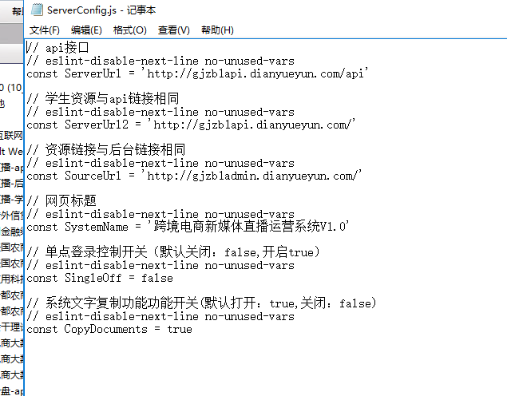
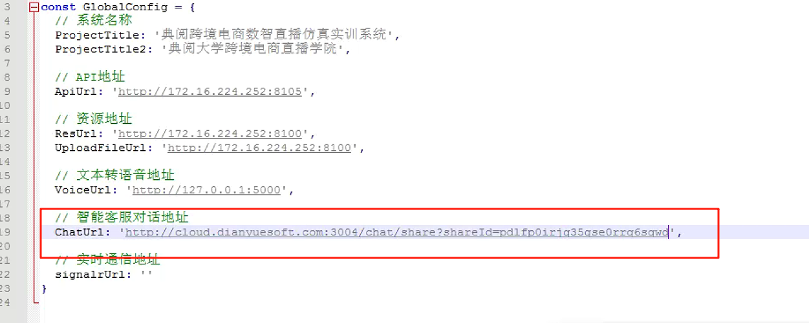

# 跨境直播系统

### 清除锁定 ip
```plain
delete  from [New_LiveBroadcast_Init].[dbo].[sys_filterip]
```

### 查询密码


### 清理组织架构
```sql
-- 学校
DELETE tb_org_school
-- 学院
DELETE tb_org_college
-- 专业
DELETE tb_org_specialty
-- 班级
DELETE tb_org_grade
-- 学生
DELETE tb_org_student
-- 教师及管理员
DELETE sys_user where F_Id<>'9f2ec079-7d0f-4fe2-90ab-8b09a8302aba'
DELETE sys_userlogon where F_UserId<>'9f2ec079-7d0f-4fe2-90ab-8b09a8302aba'
```

dysoft123*

### 清理做题记录
```sql
delete tb_Training_Info 
delete tb_Training_Info_History
delete tb_Training_PolicyExam 
delete tb_Training_PolicyExam_Detail 
delete tb_Training_Broadcast_Device 
delete tb_Training_Broadcast_Test 
delete tb_Training_Shopee_GlobalProduct_Info 
delete tb_Training_Shopee_GlobalProduct_Image
delete tb_Training_Shopee_GlobalProduct_Publish 
delete tb_Training_Shopee_Product 
delete tb_Training_Shopee_Product_Image
delete tb_Training_Shopee_Coupon 
delete tb_Training_Shopee_Coupon_Product 
delete tb_Training_Shopee_Broadcasting 
delete tb_Training_AliExpress_Discount 
delete tb_Training_AliExpress_Product 
delete tb_Training_Alibaba_Coupon 
delete tb_Training_Alibaba_Product 
delete tb_Training_Market_Research 
delete tb_Training_Theme_Planning 
delete tb_Training_Live_Title 
delete tb_Training_Live_Script 
delete tb_Training_Live_Promotion 
delete tb_Training_Promotion_Preheating 
delete tb_Training_Promotion_Preheating_Product 
delete tb_Training_Live_Digital_Person 
delete tb_Training_Product_Rack_Order 
delete tb_Training_Product_Rack 
delete tb_Training_LiveBroadcast
delete tb_Training_LiveBroadcast_GetCoupons 
delete tb_Training_Achievement 
delete tb_Training_Shopee_OrderDetail 
delete tb_Training_Shopee_Order 
delete tb_Training_LiveBroadcast_Sale 
delete tb_Training_LiveBroadcast_Listing_Products 
delete tb_Training_Source_MaterialImage_Check 
delete tb_Training_TikTok_GlobalProduct_Info 
delete tb_Training_TikTok_GlobalProduct_Image
delete tb_Training_TikTok_GlobalProduct_Publish 
delete tb_Training_TikTok_Product_Info 
delete tb_Training_TikTok_Product_Image
delete tb_Training_LiveBroadcast_Estoppe 
delete tb_Training_LiveBroadcast_Blacklist 
delete tb_Training_LiveBroadcast_KickOut 
delete tb_Training_LiveBroadcast_KeyWord 
delete tb_Training_LiveBroadcast_Collect_Person 
delete tb_Training_LiveBroadcast_Comment 
delete tb_Training_LiveBroadcast_RoomID 
```


```plsql
6.2、清除数据库脚本
/**--用户表--*/
Truncatetable P2P_Users 
/**用户关联表--*/
Truncatetabledbo.sys_P2P_UserInfo

/**--实训中心--*/
Truncatetable CaseTestPaper
Truncatetable T_UserTaskSituation
Truncatetable TestPaperSituation
/**--理论知识--*/
Truncatetable T_TestPaper
Truncatetable T_TestResults
Truncatetable IntelligentTestPaper
/**--题库--*/
Truncatetable T_Questions
Truncatetable T_QuestionItems

6.3、日志清理
USE[gzSLS171023]
GO
ALTERDATABASE[gzSLS171023]SETRECOVERYSIMPLEWITHNO_WAIT
GO
ALTERDATABASE[gzSLS171023]SETRECOVERYSIMPLE
GO
USE[gzSLS171023]
GO
DBCCSHRINKFILE(IndustrySimulationDB_log,0,TRUNCATEONLY)
GO
USE[master]
GO
ALTERDATABASE[gzSLS171023]SETRECOVERYFULLWITHNO_WAIT
GO
ALTERDATABASE[gzSLS171023]SETRECOVERYFULL
GO
USE[gzSLS171023]
GO
SELECTnameFROMSYS.database_filesWHEREtype_desc='LOG'
```

[附件: 直播系统部署文档 (1).docx](./attachments/I0GO_ToPfoyUU_sh/直播系统部署文档 (1).docx)

安装直播系统需要更新.net core环境

[附件: asp.net core 坏境.zip](./attachments/I0GO_ToPfoyUU_sh/asp.net core 坏境.zip)

```sql
delete from tb_School where S_ID>0
delete from tb_College where C_ID>0
delete from tb_Major where  M_ID>0
  truncate table [LiveBroadcast].[dbo].[tb_Class]
    delete from tb_Teacher
    delete from  tb_LiveBroadcastingRoom
    delete from tb_HB_Examination
     delete from [tb_User] where U_ID>1
   delete from  [tb_Login_Log]   
    
```

直播系统如果pdf如果没有显示，安装wps或者换个浏览器试试

学生端配置



直播系统客服地址

[http://cloud.dianyuesoft.com:3004/chat/share?shareId=pdlfp0irjq35gse0rrq6sqwd](http://cloud.dianyuesoft.com:3004/chat/share?shareId=pdlfp0irjq35gse0rrq6sqwd)



### 直播系统后台无法导入学生表格上传修改后台的 webconfig 文件
```plain
<?xml version="1.0" encoding="utf-8"?>
<configuration>
  <location path="." inheritInChildApplications="false">
    <system.webServer>
      <handlers>
        <add name="aspNetCore" path="*" verb="*" modules="AspNetCoreModuleV2" resourceType="Unspecified" />
      </handlers>
      <aspNetCore processPath=".\LiveBroadcast.Web.exe" stdoutLogEnabled="false" stdoutLogFile=".\logs\stdout" hostingModel="inprocess" />
      
      <!-- 新增：请求内容长度配置 -->
      <security>
        <requestFiltering>
          <requestLimits maxAllowedContentLength="100000000" /> <!-- 设为100MB，可根据需求调整 -->
        </requestFiltering>
      </security>
    </system.webServer>
  </location>
  
  <system.webServer>
    <httpProtocol>
      <customHeaders>
        <add name="Access-Control-Allow-Headers" value="Content-Type,Authorization" />
        <add name="Access-Control-Allow-Methods" value="GET,POST,PUT,DELETE,OPTIONS" />
        <add name="Access-Control-Allow-Origin" value="*" />
      </customHeaders>
    </httpProtocol>
  </system.webServer>
</configuration>
<!--ProjectGuid: 20905110-C61E-4E2E-9685-2577FE38766B-->
```


> 更新: 2026-03-26 15:44:45  
> 原文: <https://www.yuque.com/lixinsi/hntyk2/cw50kg5exs6uugpc>