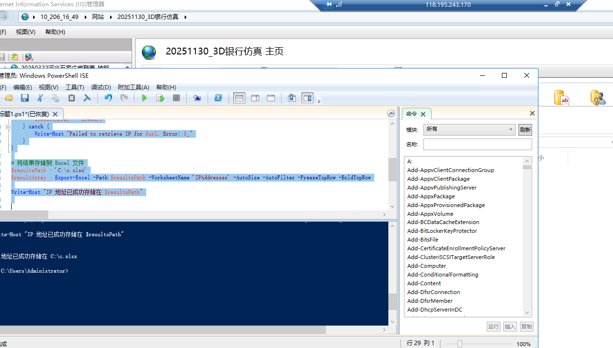

# 遍历网址

```bash
Import-Module ImportExcel

# 输入网址列表
$urlList = @("sxyl.nxyykt.occupationedu.com","nxy.nznc.occupationedu.com","nxy.nqnsh.occupationedu.com","nxy.sxhz.occupationedu.com","nxy.qxnsh.occupationedu.com","hynsh.occupationedu.com","nxy.sxqn.occupationedu.com","nxy.sxbz.occupationedu.com","sxls.nsh.occupationedu.com","nxy.sxzy.occupationedu.com","sxannsh.occupationedu.com","nxy.qinnong.occupationedu.com","qinnong.occupationedu.com","qnykt.occupationedu.com","sx.xpnsh.occupationedu.com","sxsyx.occupationedu.com","sxsls.occupationedu.com","sls.ykt.occupationedu.com","weinan.occupationedu.com","shanyang.occupationedu.com","baishui.occupationedu.com","xszn.occupationedu.com","sxxy.nxy.occupationedu.com","xyykt.occupationedu.com","cayh.occupationedu.com","sx.xynsh.occupationedu.com","sx.yktxynsh.occupationedu.com","sxannsh.occupationedu.com","sx.hy.nxy.occupationedu.com","nxy.sxhync.occupationedu.com","baishui.occupationedu.com")

# 创建一个空的数组来存储结果
$resultArray = @()

# 遍历每个网址并获取对应的 IP 地址
foreach ($url in $urlList) {
    try {
        $ip = [System.Net.Dns]::GetHostAddresses($url) | Select-Object -ExpandProperty IPAddressToString
        $result = [PSCustomObject]@{
            'URL' = $url
            'IPAddress' = $ip -join ', '
        }
        $resultArray += $result
    } catch {
        Write-Host "Failed to retrieve IP for $url. Error: $_"
    }
}

# 将结果存储到 Excel 文件
$resultsPath = 'C:\c.xlsx'
$resultArray | Export-Excel -Path $resultsPath -WorksheetName 'IPAddresses' -AutoSize -AutoFilter -FreezeTopRow -BoldTopRow

Write-Host "IP 地址已成功存储在 $resultsPath"


```




> 更新: 2024-02-02 08:38:36  
> 原文: <https://www.yuque.com/lixinsi/hntyk2/pollau0uzmr83imn>