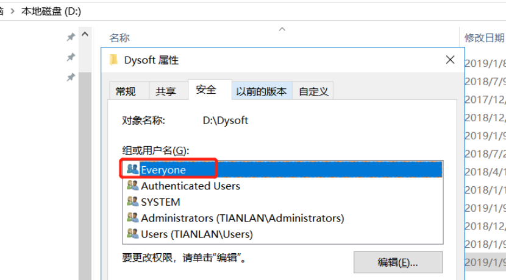
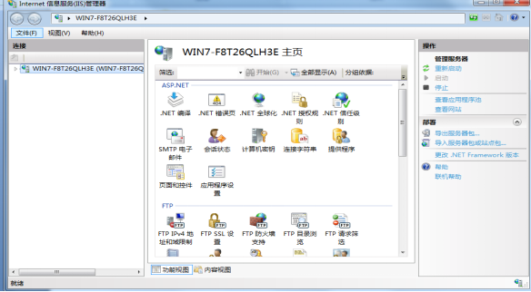
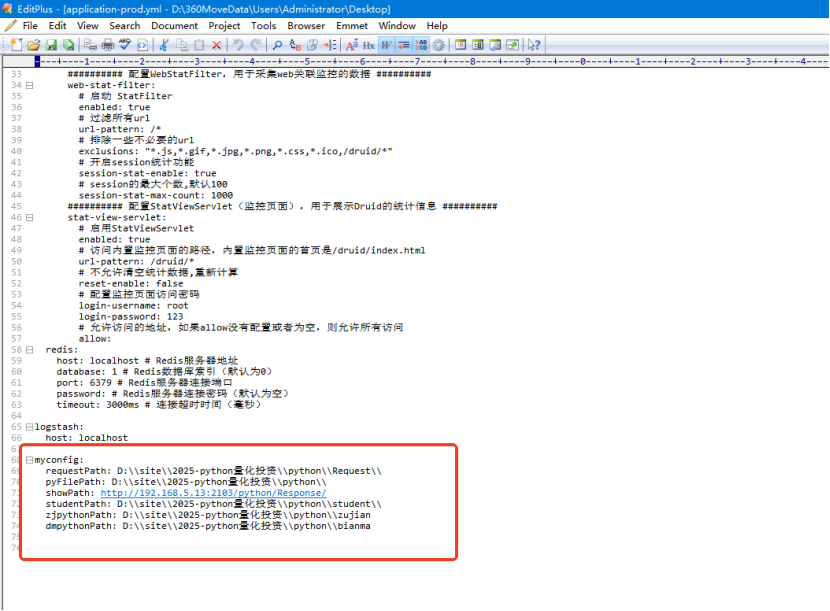
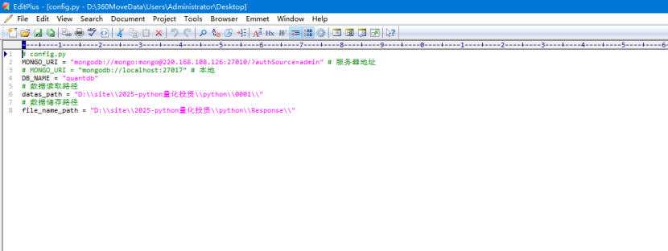
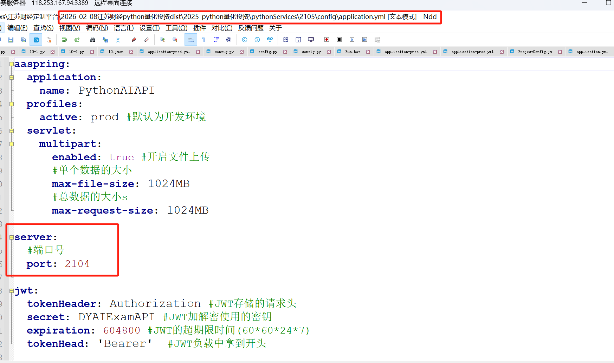

# 量化投资部署

**Python量化投资系统**

**部署****安装手册**

****

****

****

****

****

****

****

****

****

****

**湖南****典阅科技有限公司**

**202****5****年****0****4****月**

**  
**

****

**目****  ****录**

[**一准备环境**](#_Toc29709 )

[**二、基础软件安装**](#_Toc8106 )

[2.1、Google浏览器安装](#_Toc3116 )

[2.2、ASP.NET CORE安装](#_Toc9350 )

[**三、安装说明**](#_Toc32261 )

[3.1、IIS](#_Toc5459 )

[3.2、数据库安装说明](#_Toc438 )

[四、项目部署](#_Toc3221 )

[4.1、Web项目部署](#_Toc1806 )

[4.2、项目文件准备](#_Toc25813 )

[4.3、IIS项目部署细节](#_Toc18588 )

[4.4、数据库部署](#_Toc14306 )

[4.5、数据库配置修改：](#_Toc9322 )

[4.6、管理员页面检查](#_Toc20792 )

[4.7、学生端实训中心和考试中心页面检查](#_Toc20308 )

[**五、数据库备份**](#_Toc29788 )

[6.1、数据库定期备份](#_Toc24670 )

[6.2、备份数据定期清除](#_Toc8055 )

[**七、Windwos防火墙策略**](#_Toc23417 )

[**七错误**](#_Toc29564 )

[7.1、Microsoft.Jet.OLEDB.4.0错误处理](#_Toc24459 )

  

# **一准备环境**
**1)**** ****服务器**

Windows server2016

**2)**** ****数据库**

Server sql 2019

Mongodb8.0.9

**3)**** ****软件环境**

asp.net core6

asp.net core3.1

iis7

Python3.13.1

OpenJDK17U-jdk_x64_windows_hotspot_17.0.1_12

**4)**** ****推荐客户端**

Google61

  

# **二、**** ****基础软件安装**
## **2.1****、****Google****浏览器安装**
安装包名称为：chrome-64.exe，双击安装即可。

## **2.2、**** ****ASP.NET CORE****安装**
（注：优先安装IIS然后在安装ASP.NET CORE）

安装包名称: dotnet-hosting-6.0.11-win.exe，dotnet-sdk-6.0.403-win-x64.exe，双击安装，如系统已安装此插件，会提示已安装，即可以不用再另行安装。

## **2.3、**** ****python****安装**
安装包名称为：python-3.13.1-amd64.exe，双击安装即可。

需要安装python组件，执行CMD-》python组件安装命令.txt文件内的组件命令即可

## **2.4、**** ****JDK****安装**
安装包名称为：OpenJDK17U-jdk_x64_windows_hotspot_17.0.1_12.msi，双击安装即可

# **三****、****安装说明**
## **3.1 ****、****IIS****  **
系统要求：

· 支持的操作系统：Windows server 2016

·  安装IIS:“计算机”右键，选择“管理”――〉在“添加角色向导”] 对话框中选择“Web 服务器(IIS)

对于可能搭建在windows 7等个人操作系统上的临时测试环境，可在程序和功能下面，点击打开和关闭windows功能。按照：[https://jingyan.baidu.com/article/219f4bf723bcb2de442d38ed.html](https://jingyan.baidu.com/article/219f4bf723bcb2de442d38ed.html)去开启IIS服务

## **3.2****、数据库****安装说明**
Windows server 2016 操作系统上安装SQL Server 2019数据库，安装图解和配置过程如下图(可直接双击相关的SETUP.EXE)

点击全新安装或向现有安装添加功能之后，会进行安装程序支持规则检查，检查完毕进入产品密钥输入界面，请选择输入产品密钥，密钥为：R88PF-GMCFT-KM2KR-4R7GB-43K4B

然后点击下一步，选择我接受许可条款，继续点击下一步进入安装界面，点击安装

进入安装界面，会提示有部分告警，如.NET告警，提示没有网络会造成延迟，提示防火墙告警，请忽略此告警，继续安装。继续点击下一步，进入SQL Server功能安装界面

SQL Server功能安装界面，点击下一步：

进入安装界面选择页面，选择数据库引擎服务下的全部和管理工具两个选项，进入下一步：

填写数据库实例名，请选择默认实例就行，进行下一步操作，进入服务器配置页面：

服务器配置页面，账户名选择为本地系统账户（下拉选项中选中*\SYSTEM即可）

继续点击下一步，进入数据库引擎配置页面，身份证验证方式选择混合模式，密码输入后请一定要记得密码（此密码无法查询找回），可添加当前用户为数据库管理员，也可另行添加

然后继续点击下一步，直到进入安装界面，开始安装:

安装完成，点击关闭即可。  

## **四、****项目部署**
## **4.1****、****W****eb****项目部署**
三个IIS项目（api,管理后台,学生端）

一个java项目（python解析）

## **4.2****、项目文件准备**
1.在D盘新建2025-python量化投资文件夹。右击属性添加Everyone权限

2.在2025-python量化投资文件夹建API，Management，Web，python文件夹（API放api，Management放学生端，Web放管理后台，python放python算法文件）

## **4.3、**** ****IIS****项目部署细节**
1).打开IIS管理器

2).网站右击添加，输入你的网站名称，找到你要部署路径分别是：

(C:\site\2025-python量化投资\API)  api接口à 2102（端口自定义）

(C:\site\2025-python量化投资\Web))  管理后台à2101（端口自定义）

(C:\site\2025-python量化投资\Management))   学生端à2103（端口自定义）

D:\site\2025-python量化投资\python 挂在到(C:\site\2025-python量化投资\Web))   学生端作为虚拟目录，命名为python

2）java服务端配置端口号配置

C:\site\2025-python量化投资\config\application-prod.yml

requestPath：python请求地址文件夹目录

pyFilePath：python算法文件文件地址

showPath：执行结果文件夹地址

studentPath： python算法文件student的文件地址

ZjpythonPath：python算法文件zujian的文件地址

dmpythonPath：python算法文件bianma的文件地址

3）python算法文件

根目录下的student、zujian、bianma文件夹下的config.py文件

Mongo_uri：mongodb的链接（基本不需要修改，内网自建mongoDB的话就修改）

Db_Name：mongodb数据库名称（基本不需要修改，内网自建mongoDB的话就修改）

Datas_path：python算法文件下数据读取的地址（只修改到0001之前的文件位置路径即可）

File_name_path：python算法文件下结果存放地址（只修改到response之前的文件位置路径即可）

5) 安装python3.13.1环境

安装压缩包中的python-3.13.1-amd64.exe

安装组件安装命令文件python组件安装命令.txt  进行第三方插件安装即可

配置完成以上后，

执行Run.bat运行JAR包

## **4.4****、数据库部署**
启动SQL Server Management Studio,连接到本地数据库

右键点击数据库，选择还原数据库：

从原设备中选择目标文件，选择之后再选择目标数据库

选中目标数据库：

点击确定进行还原

## **4.5****、数据库配置修改：**
DataSource(数据库连接地址),InitialCatalog(数据库名),User(数据库用户),Password(数据库密码)

1.api (appsettings.json)根目录，更改数据库连接信息，只需更改IP地址，密码即可（如其他信息有变动，也可同步修改）

2. 后台 (appsetting.json) 根目录，更改数据库连接信息，只需更改IP地址，密码即可（如其他信息有变动，也可同步修改）

3. 学生端（根目录\ProjectConfig.js）配置对应的地址

ProjectTitle :项目标题

ServerUrl ：接口地址

ServerUrl2：Java服务地址

fileUrl ：管理后台地址

## **4.****6****、管理员页面检查**
打开Google浏览器，输入部署的IP地址及端口，例如后台网址能看到登录界面如下：

输入账号及其密码，点击登录，进入管理员界面：

点击快捷入口或左边导航栏菜单，确认各个页面是否能正常打开，正常点击；

## **4.****7****、****学生端实训中心和考试中心****页面检查**
打开登录页面，输入账号及其密码

进入系统，点击去实训

选择一套实训，点击进入

点击考核进入考核

# **五、****数据库备份**
## **6.1****、数据库定期备份**
利用SQL Server 2016数据库可以实现数据库的定期自动备份。方法是用SQLSERVER2016自带的维护计划创建一个计划对数据库进行备份。

单机版建议备份在目录**:D:\CarbonFinance\db**下，多机部署情况可备份在备份服务器的共享文件夹下面

首先需要启动SQL Server Agent服务，这个服务如果不启动是无法运行新建作业的，点击“开始”–“所有程序”–“Microsoft SQL Server 2019”–“启动SQL Server Management Studio”登录数据库，点击管理–维护计划–右击维护计划向导如图所示：

点击“维护计划向导”后跳出对话框，如图所示：

点击“下一步”如图所示：

填写好名称及相关说明作个记号，点击“更改”来设定维护计划，如图所示：

可以为选择执的时间段，每天、每周、每月可以根据你相应的需求来制定备份的时间，这里作演示就选择在每周星期三，星期日的0：00进行，点击“确定”再点“下一步”如图所示：

选择你需要备份的任务，我这里就先择“备份数据库（完整）”，很明了点击“下一步”如图所示：

出现刚刚所选择的三项你可以选择他们所执行的顺序，选好后点击“下一步”如图所示：

选择需要备份的数据库，在数据库那一列选择相关数据库点击（确定）如图所示（由于这张图片较大您可以点击图片查看原图）：

选择备份的数据库存放的目录，设置备份压缩：有默认服务器设置，压缩备份等选项，因为我的数据库较大所以就选择压缩，根据您的实际情况进行操作：点击”下一步”，下面的操作是对于这前我们所选择的“维护任务”操作和“上一步”一样这里就不截图说明，最后点击“下一步”如图所示：

选择SQLSERVER2016自动备份维护计划的报告文件所存放位置点击“下一步”如图所示:

点击“完成”这样就完成了SQLSERVER2019自动备份。

注意：在利用SQLSERVER2019的维护计划对数据库进行定期的备份时要启动“SQLSERVER代理”服务。

## **6.****2****、备份数据定期清除**
@echooff

title清理数据库文件

::IIS日志文件目录

setdir="D:\数据库备份"

::保留备份天数

setbak_date=4

::删除备份文件

forfiles/p%dir%/S/M*.bak/D-%bak_date%/C"cmd/cecho正在删除@relpath文件&echo.&del@file"

# **七、****Windwos****防火墙策略**
1) Windows防火墙->高级设置->入站规则->新建入站规则向导->端口

2) tcp->特定本地端口-（需要对外开放的端口2101,2102,2103,2104）

  

# **七错误**
## **7.1****、**[Microsoft.Jet.OLEDB.4.0错误](https://www.cnblogs.com/Herzog3/p/6728066.html)**处理**
在安装的系统中，有时候会遇到问题提示:

[win7(64)未在本地计算机上注册 Microsoft.Jet.OLEDB.4.0 提供程序](https://www.cnblogs.com/Herzog3/p/6728066.html)

处理方式如下：

在对应的IIS 应用程序池中，“设置应用程序池默认属性”/“常规”/”启用32位应用程序”，设置为 true。

打开IIS，在程序池中找到对应的程序，

右边有一个高级设置，启用32位应用程序，设置成true

保存即可。

> 更新: 2026-02-09 08:35:05  
> 原文: <https://www.yuque.com/lixinsi/hntyk2/bnfvook4mv59zwya>