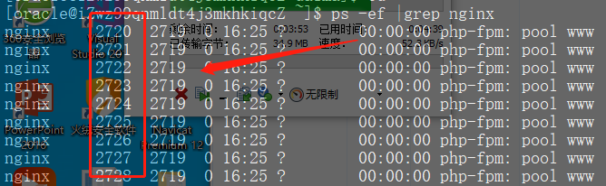
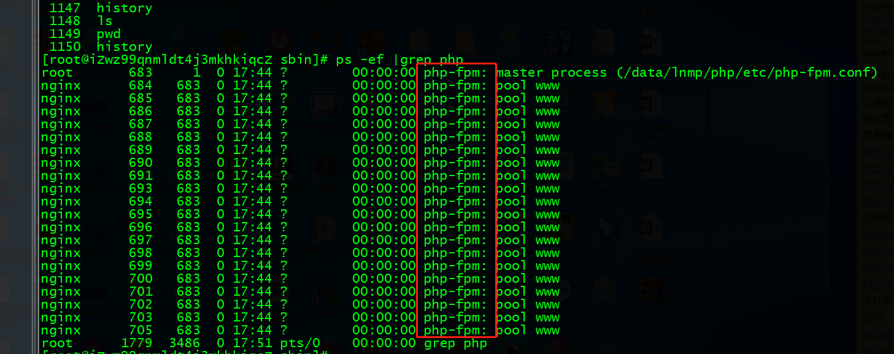
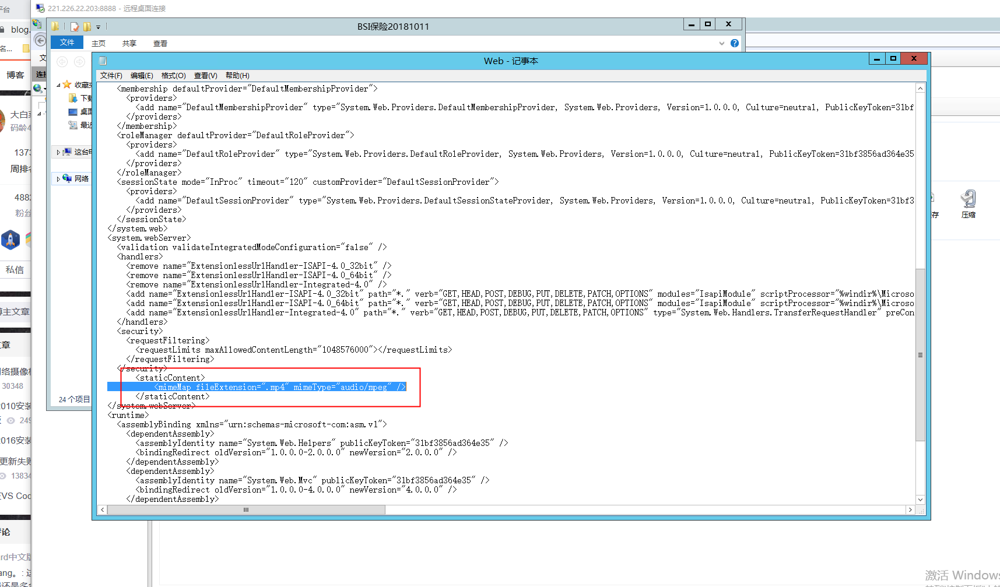

# 金融CRM启动教程

centos服务器地址：120.77.61.91

           服务器密码：dyjy!@#$%^.91

### CRM系统
#### 查看nginx进程


```bash
kill -9 nginx杀掉5个进程
cd /data/lnmp/nginx/sbin
./nignx
```

<font style="color:rgb(56, 58, 66);">删除所有日志文件</font>

<font style="color:rgb(56, 58, 66);">find / -name "*.log" -type f -delete</font>

### **<font style="color:rgb(0, 0, 0);">典阅金融学院</font>**
<font style="color:rgb(0, 0, 0);">启动PHP服务</font>

```bash

./php-fpm
```

#### <font style="color:rgb(0, 0, 0);">启动oracle</font>
```bash
su - oracle
sqlplus /as sysdba
startup
```

查看目录大小

```bash
du -h --max-depth=1 
```

典阅高校金融crm

杀掉相关全部Nginx进程

```sql
----切到ngnix目录-----
cd /data/lnmp/nginx/sbin
----查看Nginx进程------
 ps -ef | grep nginx
 ----杀掉Nginx进程----
killall -9 php-fpm
---启动Nginx------
./nginx 

--编译php-fpm---
cd /data/lnmp/php/sbin
./php-fpm 
```



<font style="color:rgb(0, 0, 0);">(内网)ftp/sftp:用户名root 密码：111111</font>

<font style="color:rgb(0, 0, 0);">1、201内网服务器：192.168.1.201</font>

<font style="color:rgb(0, 0, 0);"></font>

<font style="color:rgb(0, 0, 0);">代码地址：</font><font style="color:rgb(0, 0, 0);">/home/wwwroot  太平MYSQL</font>

<font style="color:rgb(0, 0, 0);"></font><font style="color:rgb(0, 0, 0);">代码地址：</font><font style="color:rgb(0, 0, 0);">/home/oracles  太平ORACLE</font>

<font style="color:rgb(0, 0, 0);"></font><font style="color:rgb(0, 0, 0);">代码地址：</font><font style="color:rgb(0, 0, 0);">/home/university 典阅金融学院（后台，学生端，app）</font>

<font style="color:rgb(0, 0, 0);"></font>

<font style="color:rgb(0, 0, 0);">高校版对应的</font><font style="color:rgb(0, 0, 0);">201内容</font>

<font style="color:rgb(0, 0, 0);">访问地址：</font><font style="color:rgb(0, 0, 0);">http://192.168.1.201:85/  </font>

<font style="color:rgb(0, 0, 0);">路径：</font><font style="color:rgb(0, 0, 0);">/home/university</font>

<font style="color:rgb(0, 0, 0);"></font>

<font style="color:rgb(0, 0, 0);"></font>

<font style="color:rgb(0, 0, 0);"></font>

<font style="color:rgb(0, 0, 0);">(外网)ftp/sftp:用户名root 密码：</font><font style="color:rgb(0, 0, 0);">$@...Ef5%83!!Dysoft</font>

<font style="color:rgb(0, 0, 0);"></font>

<font style="color:rgb(0, 0, 0);">1、91外网服务器：120.77.61.91       代码地址：/data/daima/inside_26  太平ORACLE</font>

<font style="color:rgb(0, 0, 0);"></font><font style="color:rgb(0, 0, 0);">代码地址：</font><font style="color:rgb(0, 0, 0);">/data/daima/universitys 典阅金融学院（后台，学生端，app）</font>

<font style="color:rgb(0, 0, 0);">前台访问地址：</font><font style="color:rgb(0, 0, 0);">http://www.dyjrxy.com</font>

<font style="color:rgb(0, 0, 0);">后台访问地址：</font><font style="color:rgb(0, 0, 0);">http://dysofts.occupationedu.com</font>

<font style="color:rgb(0, 0, 0);">极光</font><font style="color:rgb(0, 0, 0);">推送的帐号</font><font style="color:rgb(0, 0, 0);">: dysoftit@occupationedu.com </font><font style="color:rgb(0, 0, 0);">密码：</font><font style="color:rgb(0, 0, 0);">Dy123456!@#$%^</font>

<font style="color:rgb(0, 0, 0);"></font>

<font style="color:rgb(0, 0, 0);"></font>

<font style="color:rgb(0, 0, 0);"></font>

<font style="color:rgb(0, 0, 0);">Bug库地址：</font>[http://192.168.1.9:81/login](http://192.168.1.9:81/login)<font style="color:rgb(0, 0, 0);">   </font><font style="color:rgb(0, 0, 0);">管理员：</font><font style="color:rgb(0, 0, 0);">admin 密码：dysoft123</font>

<font style="color:rgb(0, 0, 0);">典阅金融学院</font><font style="color:rgb(0, 0, 0);">APP端原型地址：http://192.168.1.201:85/university_member</font>

<font style="color:rgb(0, 0, 0);">典阅金融学院后台地址：</font>[http://192.168.1.201:85/university](http://192.168.1.201:85/university)

<font style="color:rgb(0, 0, 0);"></font>

<font style="color:rgb(0, 0, 0);">短信服务商：</font>[http://web.cr6868.com](http://web.cr6868.com/)<font style="color:rgb(0, 0, 0);"> </font><font style="color:rgb(0, 0, 0);">（登录账号密码东哥没有给我，需要可以问东哥）</font>

<font style="color:rgb(0, 0, 0);">短信账号：</font><font style="color:rgb(0, 0, 0);">13332961795    密码：90CFA0646E1912FA5E3364C4A7CE</font>

<font style="color:rgb(0, 0, 0);"></font>

<font style="color:rgb(0, 0, 0);"></font>

<font style="color:rgb(0, 0, 0);"></font>

<font style="color:rgb(0, 0, 0);">腾讯企业邮箱账号密码</font><font style="color:rgb(0, 0, 0);"> </font><font style="color:rgb(0, 0, 0);">：账号</font><font style="color:rgb(0, 0, 0);">phpceshi@occupationedu.com 密码 DPst5566.</font>

<font style="color:rgb(0, 0, 0);">微信开放平台</font><font style="color:rgb(0, 0, 0);"> </font><font style="color:rgb(0, 0, 0);">：</font><font style="color:rgb(0, 0, 0);">账号</font><font style="color:rgb(34, 34, 34);">liyudong123@occupationedu.com </font><font style="color:rgb(34, 34, 34);">   </font><font style="color:rgb(34, 34, 34);">密码</font><font style="color:rgb(34, 34, 34);">Liyudwww123</font><font style="color:rgb(0, 0, 0);"> </font>

<font style="color:rgb(0, 0, 0);">腾讯开放平台</font><font style="color:rgb(0, 0, 0);">：</font><font style="color:rgb(0, 0, 0);">账号</font><font style="color:rgb(34, 34, 34);">150329021 </font><font style="color:rgb(34, 34, 34);">  </font><font style="color:rgb(34, 34, 34);">密码</font><font style="color:rgb(34, 34, 34);">Liyudwww882138</font>

<font style="color:rgb(34, 34, 34);"></font>

<font style="color:rgb(0, 0, 0);">七牛云账号</font><font style="color:rgb(0, 0, 0);">  
</font><font style="color:rgb(0, 0, 0);">150329021@qq.com</font><font style="color:rgb(0, 0, 0);">  
</font><font style="color:rgb(0, 0, 0);">Dysoft!@#@#$</font>

<font style="color:rgb(34, 34, 34);"></font>

<font style="color:rgb(34, 34, 34);"></font>

<font style="color:rgb(34, 34, 34);"></font>

<font style="color:rgb(34, 34, 34);">接口文档地址：</font>[https://www.showdoc.cc/](https://www.showdoc.cc/)

<font style="color:rgb(0, 0, 0);">账号</font><font style="color:rgb(0, 0, 0);">:dianyue </font><font style="color:rgb(0, 0, 0);">密码</font><font style="color:rgb(0, 0, 0);">:Andy866</font>

<font style="color:rgb(0, 0, 0);">账号:275156029 密码:12345678</font>

<font style="color:rgb(0, 0, 0);"></font>

<font style="color:rgb(0, 0, 0);">bsi保险图片不显示</font>

<font style="color:rgb(0, 0, 0);"></font>

<font style="color:rgb(0, 0, 0);"></font>

<font style="color:rgb(23, 26, 29);">是的，web.conifg中的mp4这些</font>



```plain
#!/bin/bash

# 定义日志文件，方便排查问题
LOG_FILE="/tmp/restart_services_$(date +%F).log"
echo "=== 开始重启服务：$(date) ===" >> $LOG_FILE

# 1. 权限检查
if [ "$EUID" -ne 0 ]; then
  echo "错误：请使用 root 权限运行 (sudo $0)"
  exit 1
fi

# 定义颜色
RED='\033[0;31m'
GREEN='\033[0;32m'
NC='\033[0m'

# ==========================================
# 2. 重启 Nginx
# ==========================================
echo -n "正在重启 Nginx... "
# 修正拼写 killal -> killall
# 忽略 killall 报错（如果进程本来就不存在）
killall -9 nginx >> /dev/null 2>&1 

# 启动 Nginx，将错误信息记录到日志，而不是直接丢弃
if /data/lnmp/nginx/sbin/nginx >> /dev/null 2>> $LOG_FILE; then
    # 二次确认进程是否真的在运行
    if pgrep -x "nginx" > /dev/null; then
        echo -e "${GREEN}成功${NC}"
        echo "Nginx 重启成功" >> $LOG_FILE
    else
        echo -e "${RED}失败 (进程未运行)${NC}"
        echo "Nginx 重启失败：进程未运行" >> $LOG_FILE
    fi
else
    echo -e "${RED}失败${NC}"
    echo "Nginx 启动命令执行失败" >> $LOG_FILE
fi

# ==========================================
# 3. 重启 PHP-FPM
# ==========================================
echo -n "正在重启 PHP-FPM... "
killall -9 php-fpm >> /dev/null 2>&1

if /data/lnmp/php/sbin/php-fpm >> /dev/null 2>> $LOG_FILE; then
    if pgrep -f "php-fpm" > /dev/null; then
        echo -e "${GREEN}成功${NC}"
        echo "PHP-FPM 重启成功" >> $LOG_FILE
    else
        echo -e "${RED}失败 (进程未运行)${NC}"
        echo "PHP-FPM 重启失败：进程未运行" >> $LOG_FILE
    fi
else
    echo -e "${RED}失败${NC}"
    echo "PHP-FPM 启动命令执行失败" >> $LOG_FILE
fi

# ==========================================
# 4. 重启 Oracle
# ==========================================
echo -n "正在重启 Oracle... "

# 【警告】请确认您的系统中确实存在名为 'oracle' 的服务
# 如果 service oracle 不存在，请改为 /etc/init.d/dbora restart 或 lsnrctl start 等
if service oracle restart >> /dev/null 2>> $LOG_FILE; then
    # Oracle 启动很慢，必须等待几秒让端口监听生效
    sleep 5 
    
    # 检查 1521 端口
    if ss -ntulp | grep -q ":1521"; then
        echo -e "${GREEN}成功${NC}"
        echo "Oracle 重启成功，端口 1521 监听正常" >> $LOG_FILE
    else
        echo -e "${RED}失败 (端口未监听)${NC}"
        echo "Oracle 重启失败：端口 1521 未监听" >> $LOG_FILE
    fi
else
    echo -e "${RED}失败 (服务命令报错)${NC}"
    echo "Oracle service 命令执行失败" >> $LOG_FILE
fi

echo "=== 结束：$(date) ===" >> $LOG_FILE
```

```plain
以下是本次 Nginx 配置排查与脚本优化的**完整总结报告**：

---

### 🎯 核心目标
1.  **编写/优化脚本**：安全重启 LNMP（Nginx + PHP-FPM）及 Oracle 服务。
2.  **定位配置**：找到域名 `dycrmjr.occupationedu.com` 及其接口 `/api/Logon/GetUser` 生效的 Nginx 配置文件。
3.  **验证代理**：确认 API 请求是否正确代理到后端服务器。

---

### 📂 1. 配置文件现状（关键结论）

| 文件路径 | 状态 | 说明 |
| :--- | :--- | :--- |
| **`/usr/local/nginx/conf/vhost/test.conf`** | ✅ **生效中** | **唯一真正生效的配置文件**，修改需在此文件进行。 |
| `/usr/local/nginx/conf/777.conf` | ❌ 未生效 | 虽存在且含域名配置，但未被 `nginx.conf` 包含（include）。 |
| `/data/lnmp/nginx/conf/vhosts/test.conf` | ❌ 未生效 | 路径错误，Nginx 未加载此目录。 |

*   **主配置加载规则**：`/usr/local/nginx/conf/nginx.conf` 中只包含了 `include vhost/*.conf;`。
*   **目标域名配置位置**：在 **`/usr/local/nginx/conf/vhost/test.conf`** 中搜索 `dycrmjr.occupationedu.com`。
*   **API 代理规则**：
    ```nginx
    location /api {
        proxy_pass http://hldtest1.occupationedu.com;
        # 注意：原配置混用了 uwsgi_params，建议清理
    }
    ```

---

### 🛠️ 2. 脚本优化总结

#### A. 重启服务脚本 (`restart_lnmp.sh`)
*   **修正错误**：
    *   修正 `killal` 拼写错误为 `killall`。
    *   修正杀掉进程命令（原脚本杀 Nginx 时误杀了 PHP）。
    *   修正注释与实际命令不符（编译 vs 启动）。
*   **增强功能**：
    *   增加 Root 权限检查。
    *   增加进程存活二次验证（`pgrep`）。
    *   增加 Oracle 启动等待时间（`sleep 5`），防止端口检查误判。
    *   增加错误日志记录（`/tmp/...log`），不再全部丢弃到 `/dev/null`。

#### B. 配置诊断脚本
*   用于快速确认哪个配置文件真正生效。
*   用于搜索特定域名或接口路径在哪个文件中。

#### C. 接口测试脚本
*   使用 `curl` 模拟请求，验证 Nginx 代理是否通畅。
*   对比本机代理与后端直连的状态码。

---

### 🚀 3. 下一步操作指南（Checklist）

如果您需要修改 `/api/Logon/GetUser` 的代理逻辑，请按以下步骤操作：

1.  **备份配置**（必须）：
    ```bash
    cp /usr/local/nginx/conf/vhost/test.conf /usr/local/nginx/conf/vhost/test.conf.bak_$(date +%F)
    ```

2.  **编辑生效配置**：
    ```bash
    vi /usr/local/nginx/conf/vhost/test.conf
    ```
    *   搜索 `dycrmjr.occupationedu.com` 定位到对应 `server` 块。
    *   搜索 `location /api` 修改 `proxy_pass` 地址。
    *   **建议优化**：删除 `location /api` 中的 `include uwsgi_params;` 和冗余 `rewrite`，添加 `proxy_set_header Host $host;`。

3.  **测试语法**：
    ```bash
    /usr/local/nginx/sbin/nginx -t
    ```
    *   必须看到 `syntax is ok` 和 `test is successful`。

4.  **重载服务**：
    ```bash
    /usr/local/nginx/sbin/nginx -s reload
    ```

5.  **验证结果**：
    ```bash
    curl -I http://dycrmjr.occupationedu.com/api/Logon/GetUser
    ```

---

### ⚠️ 4. 风险提示
1.  **不要修改 `/data/lnmp/...` 下的文件**：那是旧路径或废弃路径，修改后不会生效。
2.  **不要修改 `777.conf`**：除非您手动在 `nginx.conf` 中添加了 `include 777.conf;`，否则修改它无效。
3.  **Oracle 服务名**：脚本中使用了 `service oracle restart`，请确保系统中确实注册了该服务名，否则需改为 `su - oracle -c "lsnrctl start"` 等具体命令。
4.  **清理废弃文件**：建议将 `/usr/local/nginx/conf/777.conf` 移走或重命名，避免未来维护混淆。

---

如有任何具体配置修改需求，可直接提供 `test.conf` 中 `location /api` 段的內容，我帮您写出最优配置！ 👍
```


> 更新: 2026-02-26 12:09:25  
> 原文: <https://www.yuque.com/lixinsi/hntyk2/ubs9is>