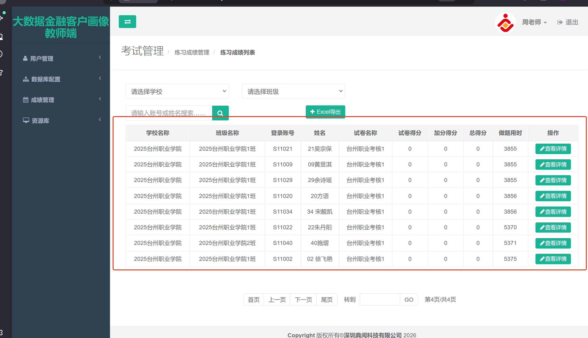

# 金融大数据删除操作日志题目号段成绩

### 查询视图
```plain
SELECT TOP (1000000)
    ID,
    UId,
    UserNo,
    BeginTime,
    UserName,
    TeamID,
    SchoolId,
    TeamName,
    SchoolName,
    ExamName,
    totalScore,
    addScore,
    endScore,
    useTime,
    submitTime
FROM (
    SELECT 
        t4.ID,
        t1.UId,
        t1.UserNo,
        t4.BeginTime,
        t1.UserName,
        t2.Id AS TeamID,
        t2.SchoolId,
        t2.TeamName,
        (
            SELECT Name 
            FROM dbo.tb_School 
            WHERE (Id = t2.SchoolId)
        ) AS SchoolName,
        t4.TestPaperName AS ExamName,
        t3.ExamScore AS totalScore,
        ISNULL(t3.addScore, 0) AS addScore,
        t3.ExamScore + ISNULL(t3.addScore, 0) AS endScore,
        (
            CASE 
                WHEN t3.useTime IS NULL 
                THEN CAST(DATEDIFF(s, t3.CrateDate, t4.EndTime) AS decimal(18, 2)) 
                ELSE t3.useTime 
            END
        ) AS useTime,
        t3.EditDate AS submitTime
    FROM 
        dbo.tb_UserInfo AS t1 WITH (nolock)
    INNER JOIN 
        dbo.tb_Team AS t2 WITH (nolock) ON t1.UserClassId = t2.Id
    INNER JOIN 
        dbo.RT_TestPaperResult AS t3 ON t1.UId = t3.UserID
    INNER JOIN 
        dbo.TB_TestPaper AS t4 ON t4.ID = t3.TestPaperID
) AS a
ORDER BY 
    BeginTime DESC, 
    endScore DESC, 
    useTime;

```


### 查询语句
```sql
SELECT TOP (1000000) 
    t4.ID, 
    t1.UId, 
    t1.UserNo, 
    t4.BeginTime, 
    t1.UserName, 
    t2.Id AS TeamID, 
    t2.SchoolId, 
    t2.TeamName, 
    (SELECT Name FROM dbo.tb_School WHERE (Id = t2.SchoolId)) AS SchoolName, 
    t4.TestPaperName AS ExamName, 
    t3.ExamScore AS totalScore, 
    ISNULL(t3.addScore, 0) AS addScore, 
    t3.ExamScore + ISNULL(t3.addScore, 0) AS endScore, 
    (CASE WHEN t3.useTime IS NULL THEN CAST(DATEDIFF(s, t3.CrateDate, t4.EndTime) AS decimal(18, 2)) ELSE t3.useTime END) AS useTime, 
    t3.EditDate AS submitTime
FROM dbo.tb_UserInfo AS t1 WITH (nolock)
INNER JOIN dbo.tb_Team AS t2 WITH (nolock) ON t1.UserClassId = t2.Id
INNER JOIN dbo.RT_TestPaperResult AS t3 ON t1.UId = t3.UserID
INNER JOIN dbo.TB_TestPaper AS t4 ON t4.ID = t3.TestPaperID
WHERE t2.SchoolId = 515
  AND t4.TestPaperName = '大数据综合练习一'
ORDER BY t4.BeginTime DESC, endScore DESC, useTime;

```




### 删除语句
```sql
DELETE FROM dbo.RT_TestPaperResult
WHERE ID IN (
    SELECT t3.ID
    FROM dbo.tb_UserInfo AS t1 WITH (nolock)
    INNER JOIN dbo.tb_Team AS t2 WITH (nolock) ON t1.UserClassId = t2.Id
    INNER JOIN dbo.RT_TestPaperResult AS t3 ON t1.UId = t3.UserID
    INNER JOIN dbo.TB_TestPaper AS t4 ON t4.ID = t3.TestPaperID
    WHERE t2.SchoolId = 515
      AND t4.TestPaperName = '大数据综合练习一'
)

```


> 更新: 2026-01-07 09:26:31  
> 原文: <https://www.yuque.com/lixinsi/hntyk2/rexhra2vc51916he>