# 金融大数据实训

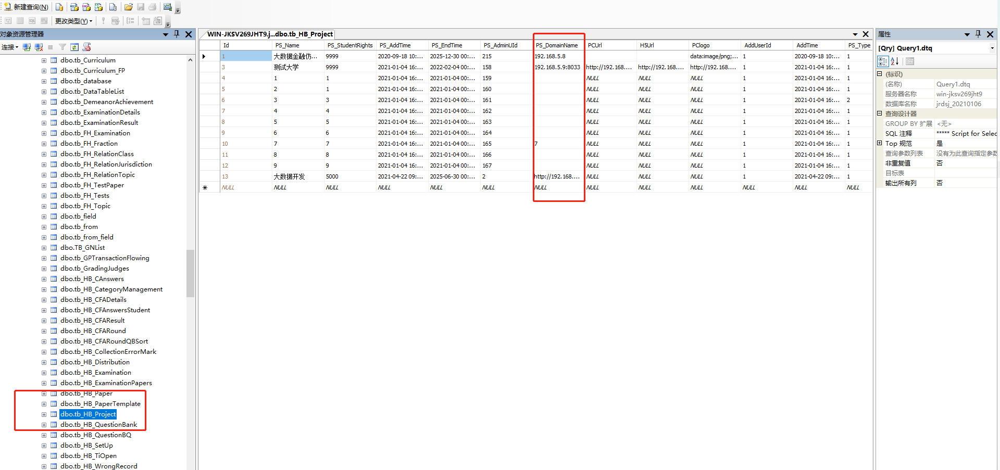

```sql
select * from [JRDSJ_YHHYXM].[dbo].[tb_HB_Project]
  update [JRDSJ_YHHYXM].[dbo].[tb_HB_Project] set PS_DomainName='xmdataht.dianyueyun.com' where Id=1


select*from [dbo].[dbConfig]
select*From tb_UserInfo where UserType=3

delete From tb_UserInfo where UserType=2
delete From tb_UserInfo where UserType=3
truncate table tb_School
truncate table tb_Team
truncate table TB_TestPaper--清楚竞赛案列
```

需要改链接HP_project地址是ht域名或者ip地址，DBconfig配置数据库密码以及数据库名称

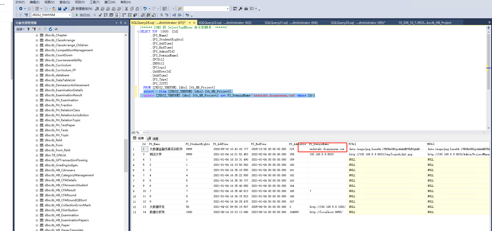

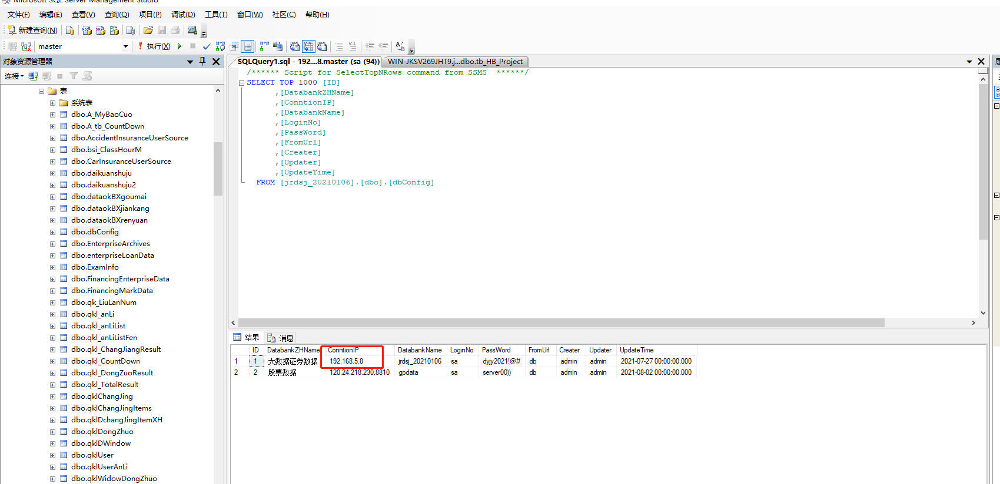

隐藏页面模块

在学生端下面的index.html根据元素写

```html
<style type="text/css">
  .layout-left-bottom,
  .layout-right-bottom,
  .layout-left-top > div:last-child,
  .layout-right-top{display: none !important;}

</style>
```

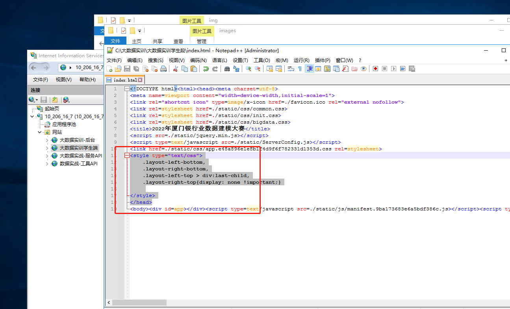

更改服务api模式

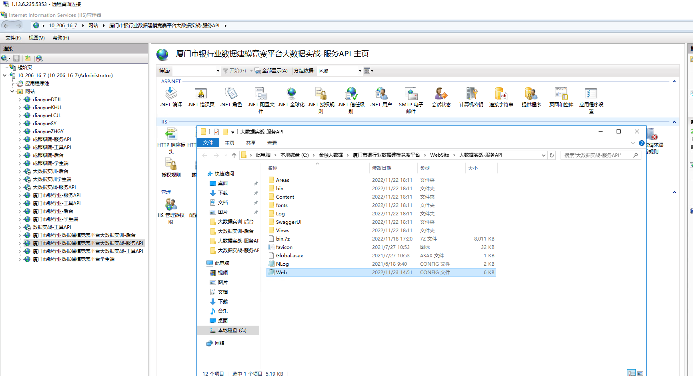

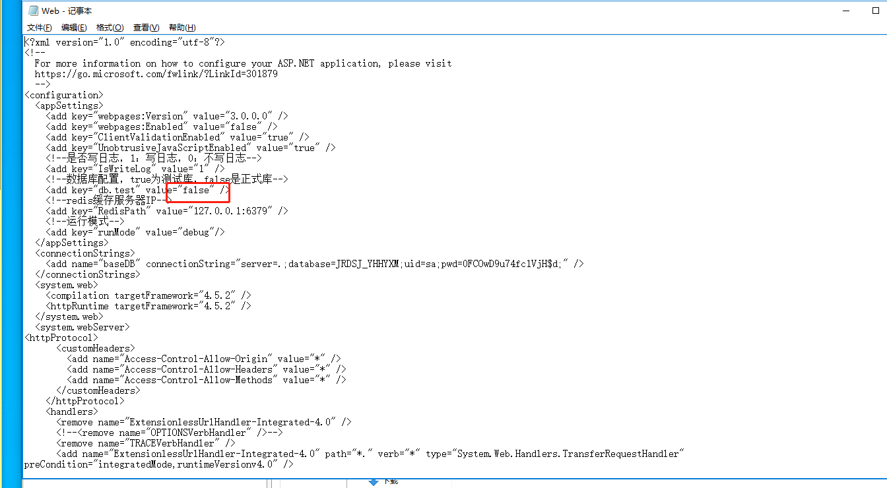

路径C:\金融大数据\厦门市银行业数据建模竞赛平台\WebSite\学生端\static下面的

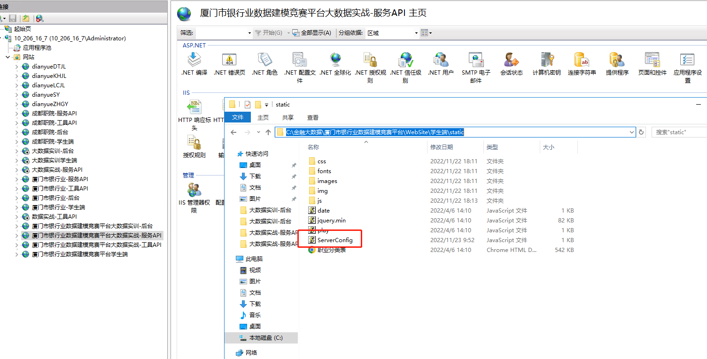

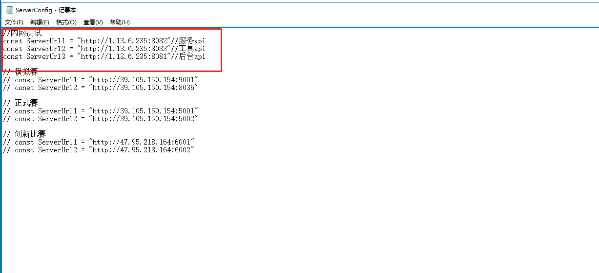

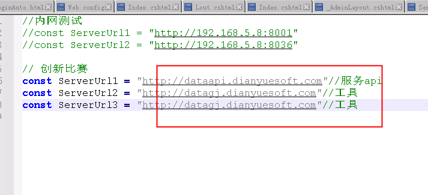

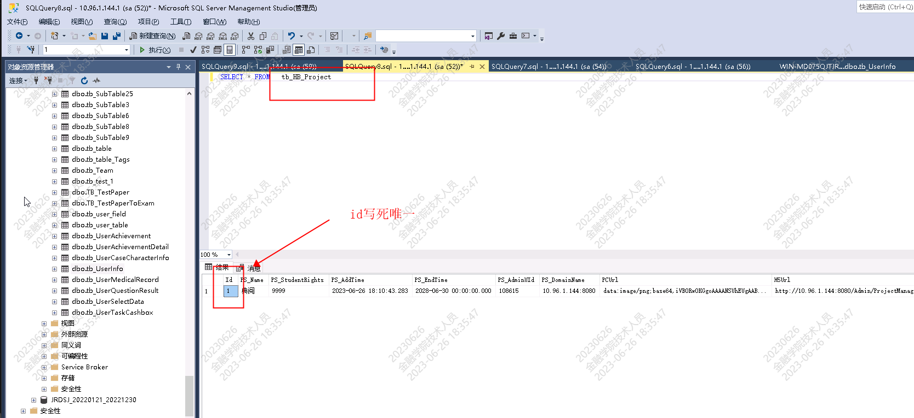


数据库配置ip远程连接

更新dbconfig里面的链接


系统到期时间需要更新学校到期时间。key值以及tb_HBproject到期时间。

改封面在到期超级管理员里面改封面。

超级管理员账号：admin  密码：dysoft

需要安装redis缓存


更改前端的文字用vscode 打开学生端


### 案列保存不成功配置使用ip连接数据库


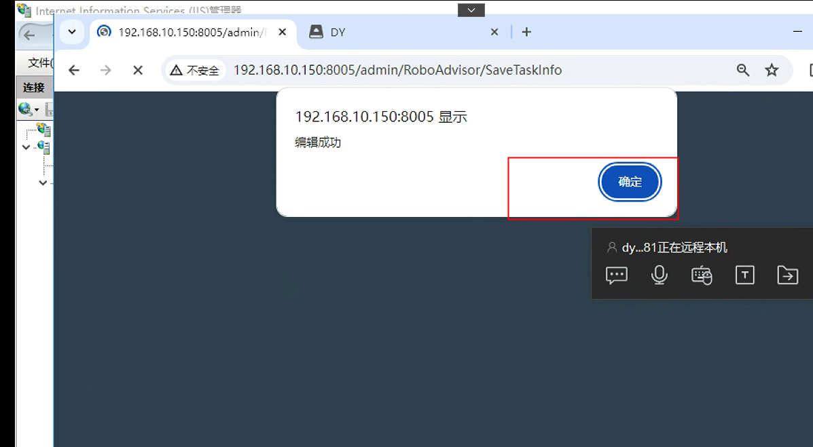

安装redis连接后保存案列成功

配置文件两个地方有redis

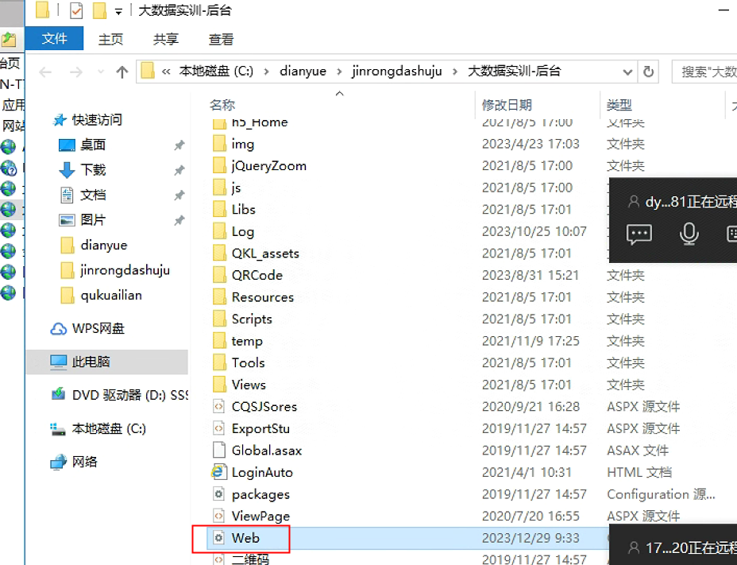


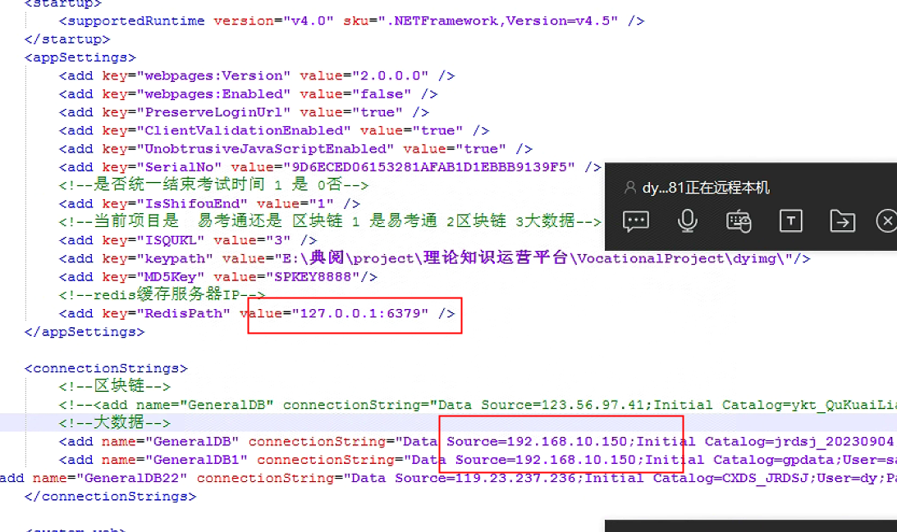

服务api


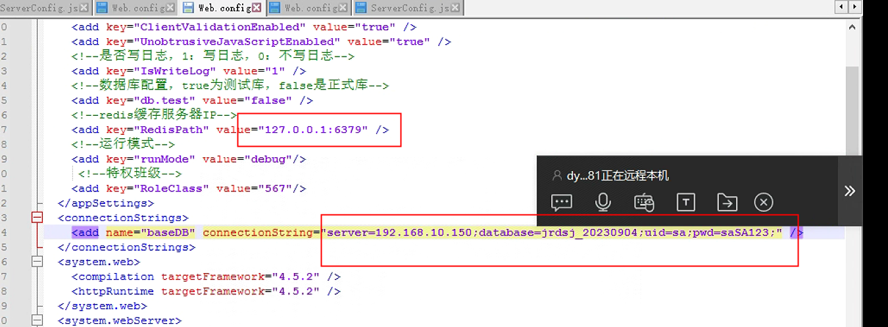


### 查看题目 sql 脚本
```dockerfile
select * from tb_UserInfo where UserNo='s0015'


select * from tb_case_list where mid=64

select * from RT_LoanExamResult where UserID=113188 and ExamID=64

select * from RT_LoanExamResultScoreInfo where UserID=113188 and ExamResultID=254


select * from TaskBankScoreInfo where TaskID=70

select * from RT_LoanExamCheckedSource where UserID=113188 and TaskID=70 order by SourceID
select * from RT_LoanExamCheckedSource where UserType=1 and TaskID=70 order by SourceID
```

### 前端隐藏模块代码在 index.html
```html
.layout-right-top, .layout-left-bottom, .layout-right-bottom{
display:none !important;
}
.layout-left-top > div:nth-child(4){
display:none !important;
}
```

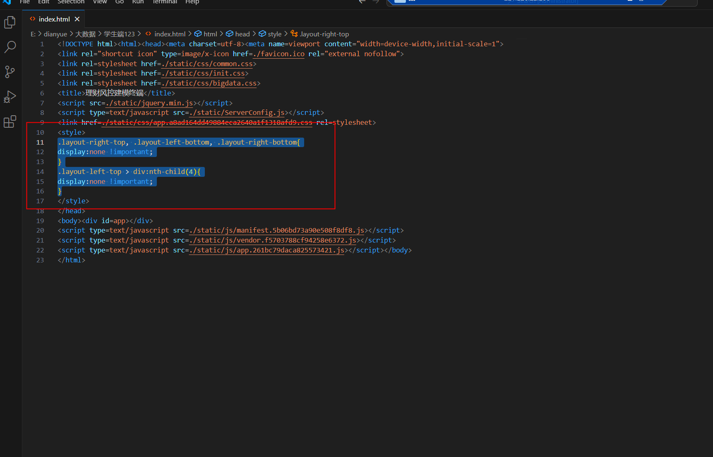


> 更新: 2025-04-23 09:53:41  
> 原文: <https://www.yuque.com/lixinsi/hntyk2/qgh1h2rlvpxplb3t>