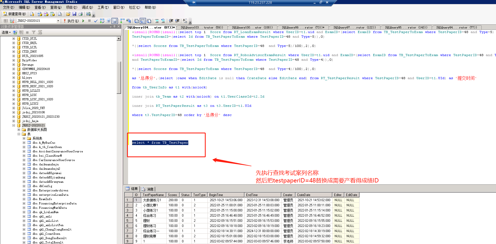
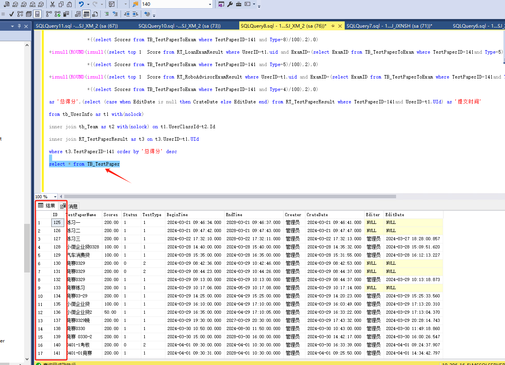
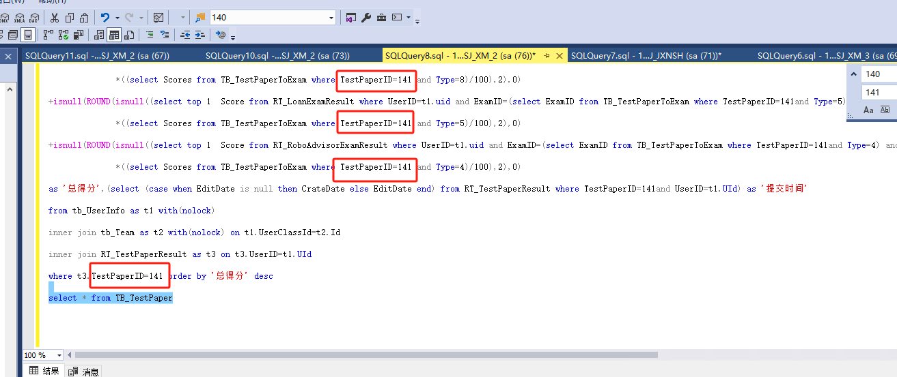

# 金融大数据导出成绩

```plsql
--分项


select UserNo as '账号',TeamName as '班级',isnull(ROUND(isnull((select top 1 Score from RT_SecuritiesExamResult where UserID=t1.uid and ExamID=(select ExamID from TB_TestPaperToExam where TestPaperID=34 and Type=1) and TestPaperToExamID=(select Id from TB_TestPaperToExam where TestPaperID=34 and Type=1)),0)

                                                    *((select Scores from TB_TestPaperToExam where TestPaperID=34  and Type=1)/100),2),0) as '证券得分',

isnull(ROUND(isnull((select top 1  Score from RT_BankExamResult where UserID=t1.uid and ExamID=(select ExamID from TB_TestPaperToExam where TestPaperID=34 and Type=2) and TestPaperToExamID=(select Id from TB_TestPaperToExam where TestPaperID=34 and Type=2)),0)

             *((select Scores from TB_TestPaperToExam where TestPaperID=34  and Type=2)/100),2),0) as '车贷得分',

isnull(ROUND(isnull((select top 1  Score from RT_SafeExamResult where UserID=t1.uid and ExamID=(select ExamID from TB_TestPaperToExam where TestPaperID=34 and Type=3) and TestPaperToExamID=(select Id from TB_TestPaperToExam where TestPaperID=34 and Type=3)),0)

             *((select Scores from TB_TestPaperToExam where TestPaperID=34  and Type=3)/100),2),0) as '保险得分',

isnull(ROUND(isnull((select top 1  Score from RT_AccidentInsuranceExamResult where UserID=t1.uid and ExamID=(select ExamID from TB_TestPaperToExam where TestPaperID=34 and Type=7) and TestPaperToExamID=(select Id from TB_TestPaperToExam where TestPaperID=34 and Type=7)),0)

             *((select Scores from TB_TestPaperToExam where TestPaperID=34  and Type=7)/100),2),0) as '意外险得分',

isnull(ROUND(isnull((select top 1  Score from RT_CarInsuranceExamResult where UserID=t1.uid and ExamID=(select ExamID from TB_TestPaperToExam where TestPaperID=34 and Type=6) and TestPaperToExamID=(select Id from TB_TestPaperToExam where TestPaperID=34 and Type=6)),0)

             *((select Scores from TB_TestPaperToExam where TestPaperID=34  and Type=6)/100),2),0) as '汽车险得分',

isnull(ROUND(isnull((select top 1  Score from RT_FinancingExamResult where UserID=t1.uid and ExamID=(select ExamID from TB_TestPaperToExam where TestPaperID=34 and Type=8) and TestPaperToExamID=(select Id from TB_TestPaperToExam where TestPaperID=34 and Type=8)),0)

             *((select Scores from TB_TestPaperToExam where TestPaperID=34  and Type=8)/100),2),0) as '理财得分',

isnull(ROUND(isnull((select top 1  Score from RT_LoanExamResult where UserID=t1.uid and ExamID=(select ExamID from TB_TestPaperToExam where TestPaperID=34 and Type=5) and TestPaperToExamID=(select Id from TB_TestPaperToExam where TestPaperID=34 and Type=5)),0)

             *((select Scores from TB_TestPaperToExam where TestPaperID=34  and Type=5)/100),2),0) as '小微企业贷得分',

isnull(ROUND(isnull((select top 1  Score from RT_RoboAdvisorExamResult where UserID=t1.uid and ExamID=(select ExamID from TB_TestPaperToExam where TestPaperID=34 and Type=4) and TestPaperToExamID=(select Id from TB_TestPaperToExam where TestPaperID=34 and Type=4)),0)

             *((select Scores from TB_TestPaperToExam where TestPaperID=34  and Type=4)/100),2),0) as '智能投顾得分',

isnull(ROUND((isnull((select top 1 Score from RT_SecuritiesExamResult where UserID=t1.uid and ExamID=(select ExamID from TB_TestPaperToExam where TestPaperID=34 and Type=1) and TestPaperToExamID=(select Id from TB_TestPaperToExam where TestPaperID=34 and Type=1)),0)

              *((select Scores from TB_TestPaperToExam where TestPaperID=34  and Type=1)/100)),2),0)+

isnull((select top 1  Score from RT_BankExamResult where UserID=t1.uid and ExamID=(select ExamID from TB_TestPaperToExam where TestPaperID=34 and Type=2) and TestPaperToExamID=(select Id from TB_TestPaperToExam where TestPaperID=34 and Type=2)),0)

*isnull(ROUND((((select Scores from TB_TestPaperToExam where TestPaperID=34  and Type=2)/100)),2),0)

+isnull(ROUND(((isnull((select top 1  Score from RT_SafeExamResult where UserID=t1.uid and ExamID=(select ExamID from TB_TestPaperToExam where TestPaperID=34 and Type=3) and TestPaperToExamID=(select Id from TB_TestPaperToExam where TestPaperID=34 and Type=3)),0))

               *((select Scores from TB_TestPaperToExam where TestPaperID=34  and Type=3)/100)),2),0) 

+isnull(ROUND(isnull((select top 1  Score from RT_AccidentInsuranceExamResult where UserID=t1.uid and ExamID=(select ExamID from TB_TestPaperToExam where TestPaperID=34 and Type=7) and TestPaperToExamID=(select Id from TB_TestPaperToExam where TestPaperID=34 and Type=7)),0)

              *((select Scores from TB_TestPaperToExam where TestPaperID=34  and Type=7)/100),2),0)

+isnull(ROUND(isnull((select top 1  Score from RT_CarInsuranceExamResult where UserID=t1.uid and ExamID=(select ExamID from TB_TestPaperToExam where TestPaperID=34 and Type=6) and TestPaperToExamID=(select Id from TB_TestPaperToExam where TestPaperID=34 and Type=6)),0)

              *((select Scores from TB_TestPaperToExam where TestPaperID=34  and Type=6)/100),2),0)

+isnull(ROUND(isnull((select top 1  Score from RT_FinancingExamResult where UserID=t1.uid and ExamID=(select ExamID from TB_TestPaperToExam where TestPaperID=34 and Type=8) and TestPaperToExamID=(select Id from TB_TestPaperToExam where TestPaperID=34 and Type=8)),0)

              *((select Scores from TB_TestPaperToExam where TestPaperID=34  and Type=8)/100),2),0)

+isnull(ROUND(isnull((select top 1  Score from RT_LoanExamResult where UserID=t1.uid and ExamID=(select ExamID from TB_TestPaperToExam where TestPaperID=34 and Type=5) and TestPaperToExamID=(select Id from TB_TestPaperToExam where TestPaperID=34 and Type=5)),0)

              *((select Scores from TB_TestPaperToExam where TestPaperID=34  and Type=5)/100),2),0)

+isnull(ROUND(isnull((select top 1  Score from RT_RoboAdvisorExamResult where UserID=t1.uid and ExamID=(select ExamID from TB_TestPaperToExam where TestPaperID=34 and Type=4) and TestPaperToExamID=(select Id from TB_TestPaperToExam where TestPaperID=34 and Type=4)),0)

              *((select Scores from TB_TestPaperToExam where TestPaperID=34  and Type=4)/100),2),0)

as '总得分',(select (case when EditDate is null then CrateDate else EditDate end) from RT_TestPaperResult where TestPaperID=34 and UserID=t1.UId) as '提交时间'

from tb_UserInfo as t1 with(nolock) 

inner join tb_Team as t2 with(nolock) on t1.UserClassId=t2.Id

inner join RT_TestPaperResult as t3 on t3.UserID=t1.UId

where t3.TestPaperID=34 order by '总得分' desc


--select * from TB_TestPaper
```




### 1.先用下面得sql语句查询ID如图所示
```plsql
select * from TB_TestPaper
--查看出来testpaperName ID
```



### 2.然后用下面得sql语句查询所有得成绩把id替换成上面查询到得ID如图所示




```plsql
--分项


select UserNo as '账号',TeamName as '班级',isnull(ROUND(isnull((select top 1 Score from RT_SecuritiesExamResult where UserID=t1.uid and ExamID=(select ExamID from TB_TestPaperToExam where TestPaperID=141and Type=1) and TestPaperToExamID=(select Id from TB_TestPaperToExam where TestPaperID=141and Type=1)),0)

                                                    *((select Scores from TB_TestPaperToExam where TestPaperID=141 and Type=1)/100),2),0) as '证券得分',

isnull(ROUND(isnull((select top 1  Score from RT_BankExamResult where UserID=t1.uid and ExamID=(select ExamID from TB_TestPaperToExam where TestPaperID=141and Type=2) and TestPaperToExamID=(select Id from TB_TestPaperToExam where TestPaperID=141and Type=2)),0)

             *((select Scores from TB_TestPaperToExam where TestPaperID=141 and Type=2)/100),2),0) as '车贷得分',

isnull(ROUND(isnull((select top 1  Score from RT_SafeExamResult where UserID=t1.uid and ExamID=(select ExamID from TB_TestPaperToExam where TestPaperID=141and Type=3) and TestPaperToExamID=(select Id from TB_TestPaperToExam where TestPaperID=141and Type=3)),0)

             *((select Scores from TB_TestPaperToExam where TestPaperID=141 and Type=3)/100),2),0) as '保险得分',

isnull(ROUND(isnull((select top 1  Score from RT_AccidentInsuranceExamResult where UserID=t1.uid and ExamID=(select ExamID from TB_TestPaperToExam where TestPaperID=141and Type=7) and TestPaperToExamID=(select Id from TB_TestPaperToExam where TestPaperID=141and Type=7)),0)

             *((select Scores from TB_TestPaperToExam where TestPaperID=141 and Type=7)/100),2),0) as '意外险得分',

isnull(ROUND(isnull((select top 1  Score from RT_CarInsuranceExamResult where UserID=t1.uid and ExamID=(select ExamID from TB_TestPaperToExam where TestPaperID=141and Type=6) and TestPaperToExamID=(select Id from TB_TestPaperToExam where TestPaperID=141and Type=6)),0)

             *((select Scores from TB_TestPaperToExam where TestPaperID=141 and Type=6)/100),2),0) as '汽车险得分',

isnull(ROUND(isnull((select top 1  Score from RT_FinancingExamResult where UserID=t1.uid and ExamID=(select ExamID from TB_TestPaperToExam where TestPaperID=141and Type=8) and TestPaperToExamID=(select Id from TB_TestPaperToExam where TestPaperID=141and Type=8)),0)

             *((select Scores from TB_TestPaperToExam where TestPaperID=141 and Type=8)/100),2),0) as '理财得分',

isnull(ROUND(isnull((select top 1  Score from RT_LoanExamResult where UserID=t1.uid and ExamID=(select ExamID from TB_TestPaperToExam where TestPaperID=141and Type=5) and TestPaperToExamID=(select Id from TB_TestPaperToExam where TestPaperID=141and Type=5)),0)

             *((select Scores from TB_TestPaperToExam where TestPaperID=141 and Type=5)/100),2),0) as '小微企业贷得分',

isnull(ROUND(isnull((select top 1  Score from RT_RoboAdvisorExamResult where UserID=t1.uid and ExamID=(select ExamID from TB_TestPaperToExam where TestPaperID=141and Type=4) and TestPaperToExamID=(select Id from TB_TestPaperToExam where TestPaperID=141and Type=4)),0)

             *((select Scores from TB_TestPaperToExam where TestPaperID=141 and Type=4)/100),2),0) as '智能投顾得分',

isnull(ROUND((isnull((select top 1 Score from RT_SecuritiesExamResult where UserID=t1.uid and ExamID=(select ExamID from TB_TestPaperToExam where TestPaperID=141and Type=1) and TestPaperToExamID=(select Id from TB_TestPaperToExam where TestPaperID=141and Type=1)),0)

              *((select Scores from TB_TestPaperToExam where TestPaperID=141 and Type=1)/100)),2),0)+

isnull((select top 1  Score from RT_BankExamResult where UserID=t1.uid and ExamID=(select ExamID from TB_TestPaperToExam where TestPaperID=141and Type=2) and TestPaperToExamID=(select Id from TB_TestPaperToExam where TestPaperID=141and Type=2)),0)

*isnull(ROUND((((select Scores from TB_TestPaperToExam where TestPaperID=141 and Type=2)/100)),2),0)

+isnull(ROUND(((isnull((select top 1  Score from RT_SafeExamResult where UserID=t1.uid and ExamID=(select ExamID from TB_TestPaperToExam where TestPaperID=141and Type=3) and TestPaperToExamID=(select Id from TB_TestPaperToExam where TestPaperID=141and Type=3)),0))

               *((select Scores from TB_TestPaperToExam where TestPaperID=141 and Type=3)/100)),2),0) 

+isnull(ROUND(isnull((select top 1  Score from RT_AccidentInsuranceExamResult where UserID=t1.uid and ExamID=(select ExamID from TB_TestPaperToExam where TestPaperID=141and Type=7) and TestPaperToExamID=(select Id from TB_TestPaperToExam where TestPaperID=141and Type=7)),0)

              *((select Scores from TB_TestPaperToExam where TestPaperID=141 and Type=7)/100),2),0)

+isnull(ROUND(isnull((select top 1  Score from RT_CarInsuranceExamResult where UserID=t1.uid and ExamID=(select ExamID from TB_TestPaperToExam where TestPaperID=141and Type=6) and TestPaperToExamID=(select Id from TB_TestPaperToExam where TestPaperID=141and Type=6)),0)

              *((select Scores from TB_TestPaperToExam where TestPaperID=141 and Type=6)/100),2),0)

+isnull(ROUND(isnull((select top 1  Score from RT_FinancingExamResult where UserID=t1.uid and ExamID=(select ExamID from TB_TestPaperToExam where TestPaperID=141and Type=8) and TestPaperToExamID=(select Id from TB_TestPaperToExam where TestPaperID=141and Type=8)),0)

              *((select Scores from TB_TestPaperToExam where TestPaperID=141 and Type=8)/100),2),0)

+isnull(ROUND(isnull((select top 1  Score from RT_LoanExamResult where UserID=t1.uid and ExamID=(select ExamID from TB_TestPaperToExam where TestPaperID=141and Type=5) and TestPaperToExamID=(select Id from TB_TestPaperToExam where TestPaperID=141and Type=5)),0)

              *((select Scores from TB_TestPaperToExam where TestPaperID=141 and Type=5)/100),2),0)

+isnull(ROUND(isnull((select top 1  Score from RT_RoboAdvisorExamResult where UserID=t1.uid and ExamID=(select ExamID from TB_TestPaperToExam where TestPaperID=141and Type=4) and TestPaperToExamID=(select Id from TB_TestPaperToExam where TestPaperID=141and Type=4)),0)

              *((select Scores from TB_TestPaperToExam where TestPaperID=141 and Type=4)/100),2),0)

as '总得分',(select (case when EditDate is null then CrateDate else EditDate end) from RT_TestPaperResult where TestPaperID=141and UserID=t1.UId) as '提交时间'

from tb_UserInfo as t1 with(nolock) 

inner join tb_Team as t2 with(nolock) on t1.UserClassId=t2.Id

inner join RT_TestPaperResult as t3 on t3.UserID=t1.UId

where t3.TestPaperID=141 order by '总得分' desc
```


> 更新: 2024-04-01 14:53:13  
> 原文: <https://www.yuque.com/lixinsi/hntyk2/gelbkbp8zkc09pai>