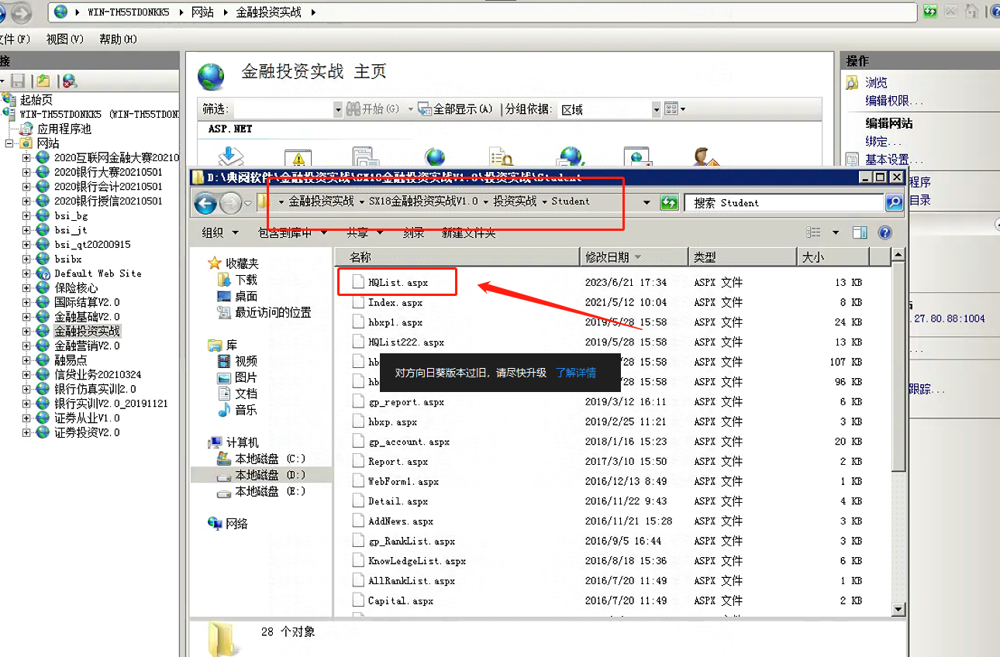
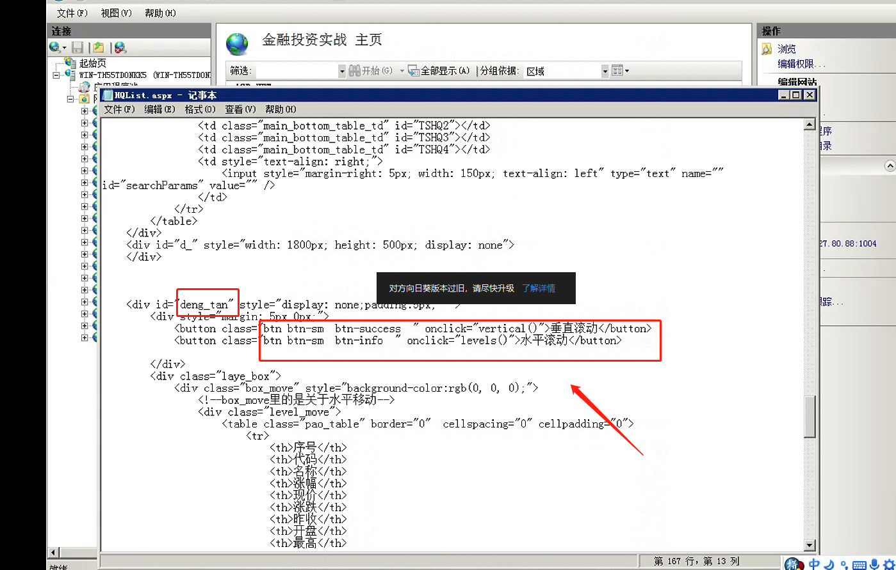
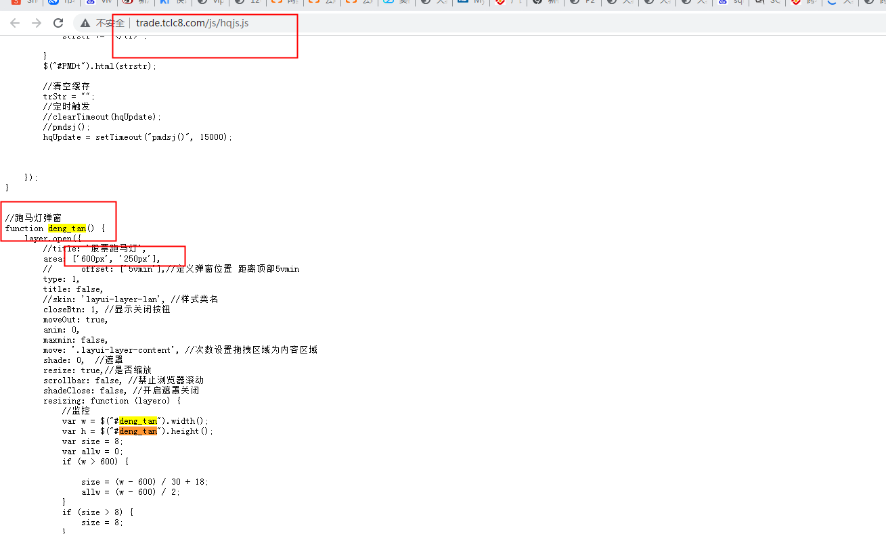

# 金融投资实战跑马灯

首先检查账号是否到期

然后通过软件看是否有跑马灯功能

登入账号选自选股如果数据只显示一行就用屏幕调整软件显示调整长和宽

如果页面显示数据就把跑马灯的右下角把跑马灯页面拉满屏幕

服务器端设置跑马灯

路径D:\典阅软件\金融投资实战\SX18金融投资实战V1.0\投资实战\Student

跑马灯按钮显示

跑马灯弹窗设置

> 更新: 2023-06-21 18:02:08  
> 原文: <https://www.yuque.com/lixinsi/hntyk2/szug0e84wq4gsres>