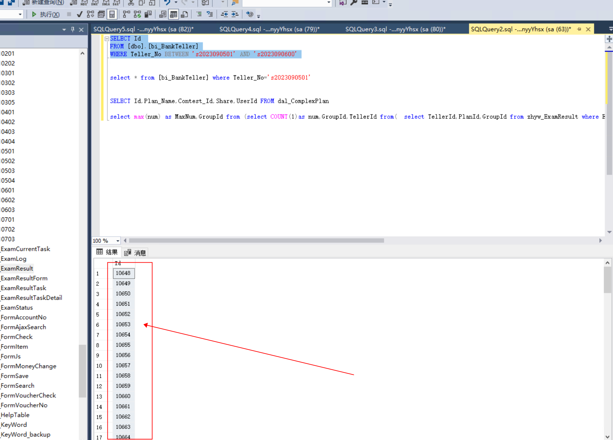

# 银行v2.0

## 删除指定教师账号下面的学生的所有操作记录
查询指定老师下面的所有的学生账号 id

```plain
SELECT Id 
FROM [dbo].[bi_BankTeller]
WHERE Teller_No BETWEEN 's2023090501' AND 's2023090600' 
```




新建一张 execl 表格复制进去

[附件: 银行v2.0删除.xlsx](./attachments/v9mWVKMT1BcNFYpM/银行v2.0删除.xlsx)


> 更新: 2024-10-09 12:12:38  
> 原文: <https://www.yuque.com/lixinsi/hntyk2/fsgftwcyngqc6vtf>